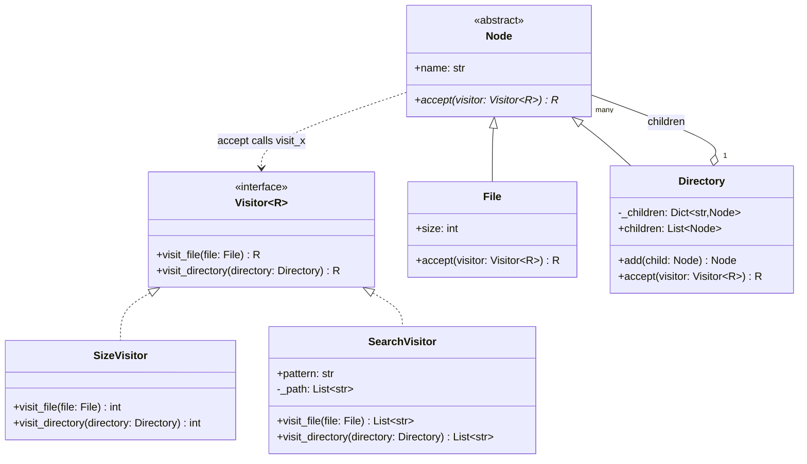

# Visitor

## Intent

Represent an operation over the elements of an object structure as its own class, so that operations (size, search, export, pricing) can be added without touching the element classes. Each element's `accept` hands itself to the visitor, which runs the method for that element type: two dispatches, one on the element and one on the visitor, which is why the pattern exists in languages without multiple dispatch.

## When to use and when not to

**Use it when**

- The structure is stable and the operations keep coming: a file tree that gains size, search, a permission audit and an export; an AST that gains type checking, constant folding and pretty-printing; a cart whose line items gain tax, shipping and loyalty rules.
- An operation needs state across the traversal (a path stack, a running total, an indentation level) that does not belong on the elements.
- The operation treats several element types differently and you want that logic in one place instead of a slice per class.

**Leave it out when**

- The element types keep changing: every new `Node` subclass forces a new method on every visitor, the cost the Gang of Four list first.
- There is one operation, or it is the element's own business (`File.size` is a field, not an operation).
- The structure is a handful of types in Python: `functools.singledispatch` or a `match` statement gives you an operation per function without `accept`.
- You never traverse anything; a dict keyed by type is enough.

## Structure

**Four roles: the Element with `accept`, its concrete classes, the Visitor interface with one `visit_*` per concrete element, and one concrete visitor per operation.**



`Node` depends on `Visitor` only through `accept`, and `Visitor` names every concrete element: that is the coupling the pattern trades for open-ended operations. `Directory` holding `Node` children is the Composite the visitors walk. `R` is the operation's result type, so a size visitor returns `int` and a search visitor `list[str]` through one interface.

## Canonical example in Python

The elements come first (`code/patterns/visitor.py`, tested by `code/patterns/tests/test_visitor.py`):

```python title="code/patterns/visitor.py — the visitor interface and the elements"
--8<-- "code/patterns/visitor.py:elements"
```

Three decisions to say out loud:

- **`accept` is one line, and it is the whole trick.** `File.accept` calls `visitor.visit_file(self)`: the element's type chooses the method at the one place where that type is statically known. Without it the visitor would `isinstance` its way through the hierarchy.
- **The result type is a type parameter.** `Visitor[R]` and `accept[R]` let the same elements serve an `int`-returning size visitor and a `list[str]`-returning search visitor, with no `Any` and no casting.
- **Elements validate themselves; visitors compute.** Names and sizes are checked in constructors and duplicates in `add`. Visitors never mutate the tree, which is what makes a third visitor safe to add without rereading the first two.

The operations live apart from the tree:

```python title="code/patterns/visitor.py — two operations, zero edits to the elements"
--8<-- "code/patterns/visitor.py:visitors"
```

`SizeVisitor` is stateless and drives the traversal itself: `visit_directory` calls `child.accept(self)`, which is the recursion. Letting the visitor own traversal is what lets a search stop early and a printer track depth. `SearchVisitor` keeps a path stack, pushes in `visit_directory` and pops in `finally`, so an exception in a child never leaves the stack dirty and one visitor can be reused across trees.

Running `python -m patterns.visitor` prints:

```text
--- the tree, drawn by a visitor: no node has a print method ---
  home/
    docs/
      guide.md (1200 B)
      notes.txt (300 B)
    src/
      main.py (2400 B)
      README.md (800 B)
      pkg/
        __init__.py (0 B)
        core.py (2000 B)
    empty/
--- SizeVisitor: one operation, no size() on any node ---
home  = 6700 B
docs  = 1500 B
src   = 5200 B
empty = 0 B
--- SearchVisitor: a second operation, the tree untouched ---
*.md  -> home/docs/guide.md, home/src/README.md
*.py  -> home/src/main.py, home/src/pkg/__init__.py, home/src/pkg/core.py
--- the same operations with singledispatch and match ---
size_of(home) = 6700 B
find(home, '*.md') = ['home/docs/guide.md', 'home/src/README.md']
rejected: 'docs' already exists in 'home'
```

## Pythonic variant

Python can dispatch on the runtime type without the element's help, which removes `accept` and with it the elements' knowledge that visitors exist:

```python title="code/patterns/visitor.py — the same operations as singledispatch and match"
--8<-- "code/patterns/visitor.py:functional"
```

- **`singledispatch` registers one function per type.** `size_of` dispatches on `type(node)` through the MRO, so a `Symlink(File)` subclass gets the file rule for free and an unknown type lands in the base function, which raises. `singledispatchmethod` does the same inside a class when the operation needs state.
- **`match` puts every case on one screen.** Class patterns with keyword captures (`Directory(children=children)`) read like the visitor's method list, a guard folds a condition into the dispatch, and `case _` is the explicit "new element type, nobody handled it" that the class form expresses as a missing abstract method.
- **What you lose.** Nothing tells you that a new element type needs a new case in every operation; a test per operation does. And the dispatch is on one argument: an operation that depends on two types (a discount applied to a line item) needs a table keyed by both.

| Reach for | When |
|---|---|
| A method on the element | One operation that belongs to the element |
| `singledispatch` functions | Several operations over stable types, no state across the traversal |
| `match` on the element type | The same, with guards, or when every case should be readable in one function |
| Visitor classes with `accept` | State across the traversal, or an interface that enumerates the element types so a new type fails loudly in every operation |

## Real-world usage

- **`ast.NodeVisitor`**: `visit` looks up `visit_<ClassName>` by name and falls back to `generic_visit`; `ast.NodeTransformer` is the mutating variant that returns replacement nodes. Linters, formatters and type checkers are visitors over this tree.
- **`functools.singledispatch`** is the standard library's visitor; `copy`, `pickle` and `pprint` keep dispatch tables keyed by type, the same idea as a dict.
- **Compilers and query builders**: SQLAlchemy compiles an expression tree through `visit_select` and `visit_column` methods on a compiler object, the class form exactly; ANTLR generates a visitor base class per grammar.

## Related patterns and confusions

| Looks like Visitor | How to tell them apart |
|---|---|
| **Composite** | Composite is the structure, Visitor is an operation over it. `size()` as a method on every node is how Composite usually starts; move the operation out when the second and third arrive. |
| **Interpreter** | An Interpreter is a class per grammar rule with an `evaluate` method: the operation inside the nodes. The moment you want a second operation (pretty-print, optimise), the nodes grow `accept` and the evaluator becomes a visitor. |
| **Iterator** | An iterator yields elements and the caller does the work; a visitor is called back with the type already known. `os.walk` plus `isinstance` checks is an iterator doing a visitor's job badly. |
| **Strategy** | Strategy swaps one algorithm behind one method; Visitor adds a whole operation across a family of types. A visitor may hold strategies, such as which tax rule applies per item type. |
| **Overloading** | Python has no overloading by parameter type, so `visit(file)` and `visit(directory)` cannot share a name; the `visit_file` naming *is* the overload, and `singledispatch` is the library doing it for you. |

## Where it appears in LLD problems

- [Design an in-memory file system](../problems/in-memory-file-system.md) — `SizeVisitor` and `SearchVisitor` over `File` and `Directory`, exactly this module, with a permission audit as the follow-up.
- [Design a learning management system](../problems/learning-management.md) — progress and total-duration visitors over courses, modules and lessons of several kinds.
- [Design Amazon (cart, order, inventory, payment)](../problems/ecommerce-order-inventory.md) — tax, shipping and discounts computed per line-item type without a growing `isinstance` ladder in the cart.

## Interview tips

!!! tip "Interview tip"
    State the trade before you draw: "I am optimising for adding operations, not element types; the tree is stable, the reports are not." Then give double dispatch in one sentence, "`accept` picks the method by element type, the visitor supplies the behaviour", and add the Python note: "with three node types I would write `singledispatch` functions and keep `accept` out of the nodes; the class form earns its place when the visitor carries state across the traversal."

!!! warning "Common mistake"
    Reaching for Visitor when the operations are stable and the element types are not: each new `Node` subclass then breaks every visitor. Runner-up: a visitor that mutates the tree while traversing it, deleting children inside `visit_directory`; snapshot `children` first, or return a new tree the way `ast.NodeTransformer` does.

## Related

- [Composite](composite.md) — the structure visitors walk
- [Interpreter](interpreter.md) — operations inside the nodes, until the second one arrives
- [Iterator](iterator.md) — traversal without the type dispatch
- [Design an in-memory file system](../problems/in-memory-file-system.md) — this tree in a full problem
- [Design a learning management system](../problems/learning-management.md) — visitors over a course hierarchy
- Gamma, Helm, Johnson and Vlissides, *Design Patterns* (1994), Visitor
- [Python documentation: `ast.NodeVisitor`](https://docs.python.org/3/library/ast.html#ast.NodeVisitor)
- [Python documentation: `functools.singledispatch`](https://docs.python.org/3/library/functools.html#functools.singledispatch)
