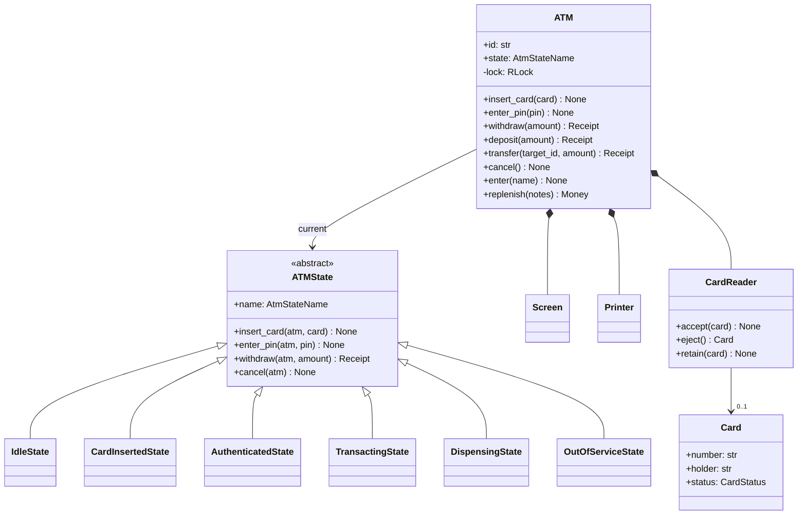
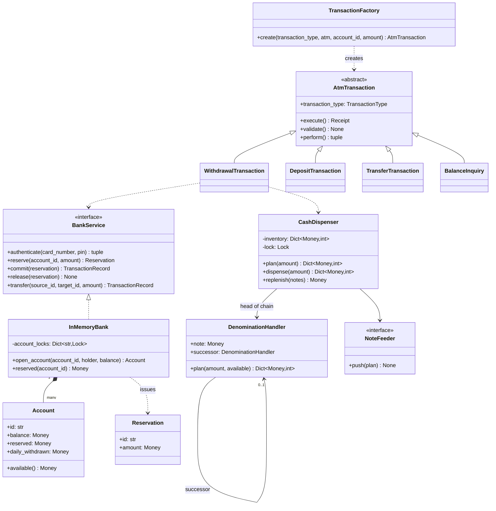
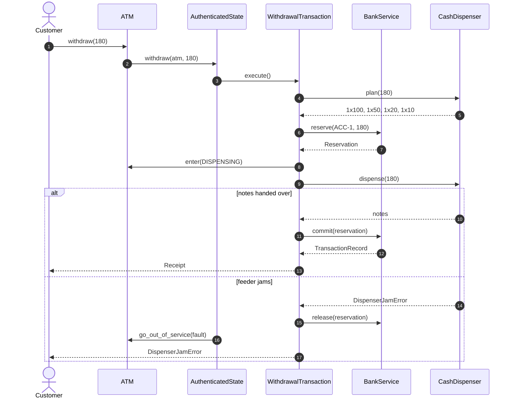
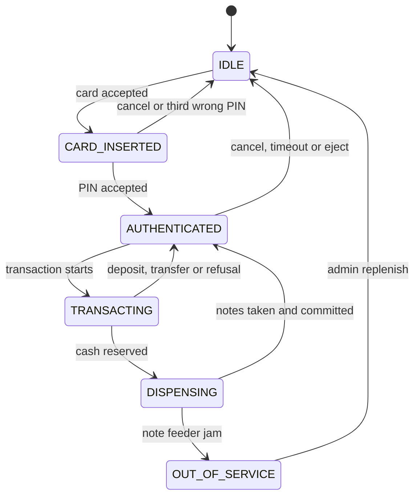

# Design an ATM

## TL;DR

- You build a state machine with a bank behind it: six `ATMState` classes decide what is even offered, `AtmTransaction` commands do the work, and a `CashDispenser` picks the notes.
- Three decisions carry the interview: **reserve, dispense, commit** (a jam rolls the reservation back, so nothing is debited), **the account lock lives in the bank, not the machine** (two ATMs, one account), and **the denomination chain backtracks** instead of being greedy.
- Patterns that earn their place: State, Chain of Responsibility, Command with Template Method, Facade, Factory. A `Keypad` class is deliberately absent.

## Problem statement

"Design the software inside an ATM. A customer inserts a card, enters a PIN, and can check a balance, withdraw cash, deposit, transfer between their accounts and print a mini statement. Three wrong PINs block the card. Withdrawals respect a daily limit and can only pay amounts the machine's notes can make. Cash is finite and an engineer refills it. Tell me what happens when the machine debits the account and then fails to hand over the notes, and what happens when the same account is used at two machines at once."

## Requirements

**Functional**

- Card in, PIN entry, three attempts, then the card is blocked and retained.
- Account selection when a card reaches more than one account; balance inquiry.
- Withdrawal with a per-account daily limit and physical note dispensing.
- Deposit, transfer between accounts, and a mini statement of the last transactions.
- Cancel and eject at any point where cancelling is safe; a printed receipt per transaction.
- Out-of-cash and out-of-service handling; an admin replenishes the cassettes.

**Non-functional and constraints**

- The account is never debited for money the customer did not receive, and never pays out money it did not debit.
- The same account used at two machines at once must not go below zero or past its daily limit.
- An abandoned session ends by itself and returns the card.
- In-memory, single process. The core banking system sits behind a `Protocol`; the note feeder is an object you can replace with one that jams.

**Out of scope**: the physical hardware bus, card networks and EMV cryptography, cheque deposits, fraud scoring, multi-currency.

## Clarifying questions and assumptions

| Question to ask | Assumption taken here |
|---|---|
| Is the machine online with the bank for every transaction? | Yes. Offline stand-in mode is a follow-up and changes the risk model completely. |
| What are the notes? | 100, 50, 20 and 10. The set is injected, so a machine with 2000s and 500s is a constructor argument. |
| Whose money is at risk if the dispenser jams? | The bank's, and that is the point. The design chooses "customer keeps the money in the account" over "machine keeps the notes". |
| Does the PIN attempt counter live in the machine or the bank? | The bank. A counter in the machine would reset by walking to the next ATM. |
| Is the daily limit per card or per account? | Per account, so two cards on a joint account share it. |
| What happens when the customer walks away? | A 90-second inactivity timeout ejects the card and drops the session. |
| Can one machine serve two customers at once? | No, and the lock enforces it - but the maintenance panel and the timeout watchdog are separate callers, so the lock is not ceremony. |

## Core entities and relationships

- **ATM** — the State context. It owns the peripherals, the current state object, the selected account and the `RLock` that serialises everything.
- **ATMState** (abstract) with `IdleState`, `CardInsertedState`, `AuthenticatedState`, `TransactingState`, `DispensingState`, `OutOfServiceState`. The base refuses every operation; each subclass overrides only what it allows.
- **AtmTransaction** (abstract) with `WithdrawalTransaction`, `DepositTransaction`, `TransferTransaction`, `BalanceInquiry`, built by `TransactionFactory`. `execute` is a Template Method: validate, perform, print.
- **BankService** (`Protocol`) with `InMemoryBank` — the Facade over the core banking system. It owns `Account`s, one lock per account, the PIN attempt counters and the ledger.
- **Reservation** — money held for a withdrawal that has not been dispensed yet. It is the object that makes the whole design atomic.
- **CashDispenser** — the cassettes, their lock, and the `NoteFeeder` that stands in for the hardware.
- **DenominationHandler** — one link per note value; the chain plans which notes to hand out.
- **Screen**, **Printer**, **CardReader** — the peripherals, so no flow ever calls `print`.

Multiplicities: ATM `1 -> 1` state (shared instances), ATM `1 -> 1` dispenser, dispenser `1 -> *` handlers in a chain, bank `1 -> *` accounts, card `1 -> *` accounts, account `1 -> *` transaction records.

## Class diagram

**The machine: one context, six states, three peripherals.**



**The work: transactions, the bank facade, and the note chain.**



## Design patterns applied

| Pattern | Where | Why it earns its place |
|---|---|---|
| State | `ATMState` and its six subclasses | The base class is a wall of refusals and each state overrides three or four methods, so "what can I do here" is answered by reading one short class. An enum plus `if` guards in every method would scatter the same table across a dozen places. |
| Chain of Responsibility | `DenominationHandler` per note, largest first | Each link takes what it can and passes the remainder on. Adding a 5 note is one more link; the dispenser code does not change. |
| Command | `AtmTransaction` subclasses | A transaction is an object, so it can be validated before it starts, logged, retried, or queued for an offline mode. |
| Template Method | `AtmTransaction.execute` = validate, perform, print | The order is fixed for every transaction type and written once. Only the withdrawal overrides `validate`, because only it touches hardware. |
| Facade | `BankService` | The real core banking system is many hosts; the machine sees eight methods. That is also what makes the whole package testable without a bank. |
| Factory Method | `TransactionFactory`, `build_chain` | Adding "pay a bill" is one class and one registry line. |
| Flyweight | `state_for` interning one instance per state | States hold no data, so every machine in the estate can share six objects. |

What was deliberately *not* used: a **`Keypad` class**. Interviewers expect the noun list from the problem statement to become classes; a keypad has no behaviour beyond "the PIN arrives as an argument", so modelling it adds a file and buys nothing. Say that out loud — knowing which nouns are *not* entities is the same skill as knowing which are. Also no **Singleton** for the dispenser: it is constructor-injected, so tests can hand the machine a feeder that jams.

## Key flows

**Withdrawal: plan, reserve, dispense, commit — and what happens when the notes stick.**



**The state machine.** Note the two arrows that matter: `TRANSACTING -> DISPENSING` happens only after the money is reserved, and `DISPENSING -> OUT_OF_SERVICE` is the only place a fault takes the machine down.



## Implementation

Build it in the order the money moves: the vocabulary, the cash, the transactions, the states, then the machine that hosts them.

The enums are the state names and the transaction taxonomy; the errors are what the screen turns into a message. `Account` is the first place the design shows: `balance` and `reserved` are separate fields, and `available()` is what everybody checks.

```python title="code/lld/atm/models.py — enums"
--8<-- "code/lld/atm/models.py:enums"
```

```python title="code/lld/atm/models.py — errors"
--8<-- "code/lld/atm/models.py:errors"
```

```python title="code/lld/atm/models.py — entities"
--8<-- "code/lld/atm/models.py:entities"
```

The note chain. The version everybody writes is greedy — take as many 100s as fit, then 50s — and it is wrong: paying 60 out of one 50 and three 20s takes the 50 first and then fails with 10 left over. Counting down and backtracking when the rest of the chain cannot finish costs four lines.

```python title="code/lld/atm/dispenser.py — the chain"
--8<-- "code/lld/atm/dispenser.py:chain"
```

The dispenser owns the cassettes and their lock. `plan` is the dry run the withdrawal uses to fail *before* any money is promised; `dispense` pushes the notes and only then decrements the counts.

```python title="code/lld/atm/dispenser.py — cassettes and hardware"
--8<-- "code/lld/atm/dispenser.py:dispenser"
```

Now the transactions. `execute` is the same three steps for all of them; `WithdrawalTransaction.perform` is the sequence the whole problem is about.

```python title="code/lld/atm/transactions.py — the template and the withdrawal"
--8<-- "code/lld/atm/transactions.py:template"
```

```python title="code/lld/atm/transactions.py — the other commands"
--8<-- "code/lld/atm/transactions.py:commands"
```

The states. Read the base class first: every operation refuses, so a state that forgets to implement something fails loudly instead of doing damage.

```python title="code/lld/atm/states.py — the base and the first two states"
--8<-- "code/lld/atm/states.py:base"
```

```python title="code/lld/atm/states.py — the authenticated state and the rest"
--8<-- "code/lld/atm/states.py:authenticated"
```

The bank is a Facade with one lock per account. `reserve`, `commit` and `release` are the three methods worth reading twice.

```python title="code/lld/atm/bank.py"
--8<-- "code/lld/atm/bank.py:bank"
```

Finally the machine itself. Every keypad entry point is two lines: take the lock, delegate to the current state. The `_session` context manager is where the inactivity timeout lives, so no operation can forget it.

```python title="code/lld/atm/services.py — the ATM"
--8<-- "code/lld/atm/services.py:atm"
```

`python -m lld.atm.demo` runs one customer across two machines:

```text
atm-1 is idle with 2800.00 USD in the cassettes
atm-1: wrong PIN, 2 attempt(s) left
atm-1 is authenticated: accounts: ACC-1, ACC-2
balance of ACC-1: 1200.00 USD
withdrew 180 -> 1x100.00 USD, 1x50.00 USD, 1x20.00 USD, 1x10.00 USD, balance 1020.00 USD
25.00 refused: 25.00 USD is not a multiple of 10.00 USD
400.00 refused: ACC-1 may still take 320.00 USD today, not 400.00 USD
deposit 300 -> balance 1320.00 USD
transfer 200 -> ACC-1 1120.00 USD, ACC-2 700.00 USD
mini statement: 3 entries, last transfer
atm-1 is idle again: card returned
atm-2: note feeder jammed while picking 1 denomination(s)
atm-2 is out_of_service; ACC-1 still holds 1120.00 USD (was 1120.00 USD)
admin replenish -> atm-2 is idle with 3800.00 USD
```

## Concurrency and edge cases

**Which lock protects what.** Three, and they are at three different levels:

1. `ATM._lock` (an `RLock`) serialises one machine. A physical ATM serves one customer, but the software has three callers: the keypad, the maintenance panel, and the inactivity watchdog. Without the lock the watchdog can eject the card between `reserve` and `dispense`. It is re-entrant because a state calls back into `atm.enter(...)` while the outer call still holds it.
2. `InMemoryBank._account_locks[id]` — one lock per account, held for the balance read *and* the write. This is the lock that makes the two-machine case correct, and it is deliberately *not* in the ATM: the account is shared, the machine is not. `transfer` takes two of them in sorted id order, so opposite transfers between the same pair cannot deadlock.
3. `CashDispenser._lock` — the note counts. The customer and the replenishing engineer touch the same cassettes, and a half-counted cassette is real money.

There is also one ordering rule to state out loud: an account lock may be taken before the registry lock, never the other way round.

**The race it prevents.** Two machines, one account with 500, both asked for 100 at the same moment. `reserve` runs inside the account lock and checks `available() = balance - reserved`, so the second caller sees the first one's reservation immediately. The concurrency test fires 16 withdrawals of 100 through two machines and asserts exactly five succeed and the balance lands on zero — never below.

**Debit versus dispense.** The failure everyone has met in real life is "the account was debited and no cash came out". This design cannot produce it, because the balance only moves in `commit`, which runs *after* the notes are out. The mirror failure ("cash out, no debit") is prevented by reserving first: the money is already unavailable to any other machine before a note moves. The residual risk is a *partial* dispense — the feeder hands over two notes of four and dies. Real machines solve this with a note counter and a reconciliation record; here `NoteFeeder.push` either succeeds or raises before anything leaves, and the honest answer in the room is "I would model a partial dispense as a `DiscrepancyRecord` the machine writes before going out of service, and reconcile against the physical count at replenishment".

**Cost check.** A withdrawal makes two calls to the bank (reserve and commit) instead of one. At the estimation cheatsheet's 500 µs same-datacenter round trip that is 1 ms instead of 0.5 ms, against a dispenser that takes seconds to count notes — a rounding error for a guarantee you cannot get any other way. The locks are cheaper still: an uncontended mutex is 17 ns.

**Other edge cases handled**: three wrong PINs block the card *in the bank* (a counter in the machine resets by walking to the next ATM) and the reader retains it; the daily limit resets on a day boundary computed from the injected clock as `now // 86400`, so tests advance one day instead of sleeping; an amount that is not a multiple of the smallest note is refused with a message that says which note; out-of-cash is checked against the cassette total before the chain runs; cancelling is allowed in every state except `DISPENSING`, where notes are already moving; a refusal keeps the session open, a jam does not.

!!! warning "Common mistake"
    Debiting the account first and dispensing afterwards, "because the bank call can fail". It can, but so can the hardware, and the hardware fails after you have already taken the money. The order that survives review is: plan the notes (fail cheap), reserve (fail cheap), dispense (fail expensive), commit (cannot fail). The second common mistake is putting the account lock in the ATM — it looks like it works until the interviewer says "now there are two machines", and then nothing protects the balance.

## Extensibility and follow-ups

- **Cardless withdrawal**: the bank issues a one-time code bound to an account and amount. `IdleState` grows an `enter_code` path that produces the same authenticated session; every state and transaction below it is unchanged.
- **Fraud checks**: a second chain, this time of rules (velocity, geography, amount), consulted inside `WithdrawalTransaction.validate`. Chain of Responsibility again, which is a nice thing to point out — the pattern is already in the codebase.
- **Offline / stand-in mode**: the transactions are already Command objects, so queue them with a conservative local limit and replay on reconnection. Say the risk out loud: stand-in mode trades correctness for availability, and the bank absorbs the difference.
- **Audit log**: every `TransactionRecord` already carries an injected timestamp and a status including `ROLLED_BACK`; append them to a write-ahead log before `commit` and the machine can be reconciled after a power cut.
- **A new note denomination**: one more `DenominationHandler` in `build_chain`.
- **Estate-wide monitoring** (cash forecasting, remote diagnostics) is the point where this becomes an HLD conversation about telemetry ingestion.

!!! tip "Interview tip"
    When the interviewer asks "what if the dispenser jams", do not answer with a `try`/`except`. Answer with the *sequence*: "plan, reserve, dispense, commit — the balance moves last, so a jam releases the reservation and the customer keeps their money." Then say what you would do about a partial dispense. Naming the failure you cannot fully solve is worth more than pretending the happy path covers it.

## Tests

`tests/test_atm.py` has 11 cases (17 with parametrisation), one per risk: a withdrawal dispenses the right notes and debits exactly once; three wrong PINs block and retain the card; every operation is refused in the states that do not offer it; the note chain is checked against five amounts including the one greedy gets wrong; the daily limit is shared across machines, counts money that is only reserved, and resets on a new day; out-of-cash is detected before anything is reserved; an idle session times out and returns the card; a transfer records both sides.

The jam test is the one to walk through — it asserts all four invariants at once:

```python title="code/lld/atm/tests/test_atm.py — a jam changes nothing"
--8<-- "code/lld/atm/tests/test_atm.py:jam"
```

And the concurrency test states the invariant as arithmetic: 500 in the account, 16 attempts of 100, exactly five winners.

```python title="code/lld/atm/tests/test_atm.py — two machines, one account"
--8<-- "code/lld/atm/tests/test_atm.py:concurrency"
```

Run them with `uv run pytest code/lld/atm -q`. Everything is deterministic: `FakeClock` drives the timeout and the day boundary, and `JammingFeeder` is a four-line class that makes a hardware failure a first-class test case.

## 45-minute pacing

| Minutes | What to do | What to say or write |
|---|---|---|
| 0-5 | Clarify | Online or offline? Which notes? Daily limit per card or account? Who owns the PIN counter? Out of scope: EMV, cheques, fraud. |
| 5-10 | Entities and states | List the six states first — they are the spine of this problem. Then ATM, Card, Account, BankService, CashDispenser, transactions. |
| 10-16 | Class diagram | Draw the State hierarchy and the transaction hierarchy side by side. Mark the three locks. |
| 16-24 | The withdrawal flow | Write `WithdrawalTransaction.perform` and say "reserve, dispense, commit" as you write each line. This is the part they are grading. |
| 24-32 | The dispenser | Write `DenominationHandler.plan`, then break it: 60 from one 50 and three 20s. Add the backtracking. |
| 32-40 | Concurrency | Two machines on one account: where is the lock, and why is it in the bank? Then the jam path and out-of-service. |
| 40-45 | Extensions | Cardless codes, fraud rules as a second chain, offline stand-in and its risk, audit log. |

## Related

- [State](../patterns/state.md) — the pattern behind the six machine states
- [Chain of Responsibility](../patterns/chain-of-responsibility.md) — the note-planning chain
- [Template Method](../patterns/template-method.md) — validate, perform, print
- [Design a vending machine (and a coffee machine)](vending-machine.md) — the same state machine with change-making instead of notes
- [Design a payment gateway and digital wallet](payment-gateway-wallet.md) — reserve and capture at the other end of the same money movement
- [Design a parking lot](parking-lot.md) — the same reserve-charge-commit shape on a smaller problem
