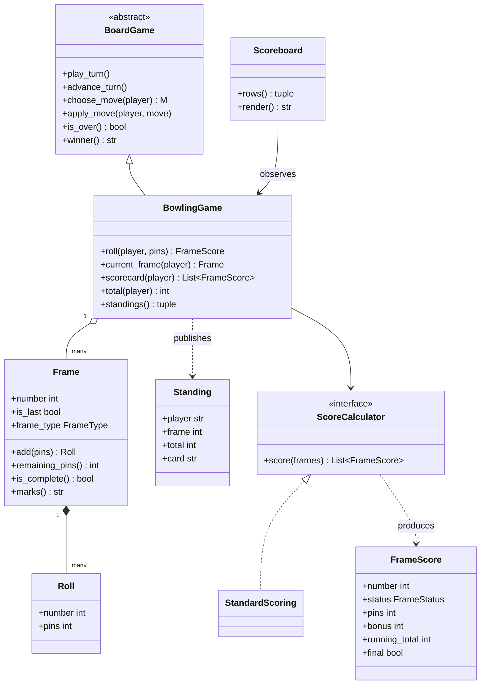
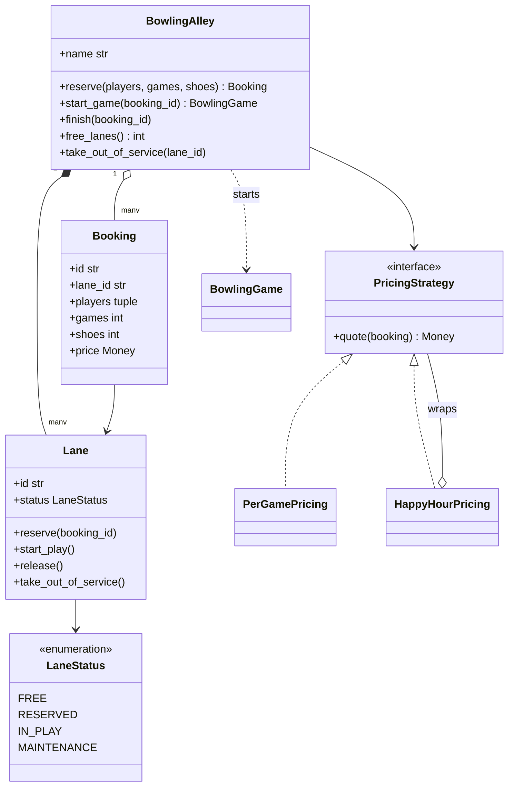
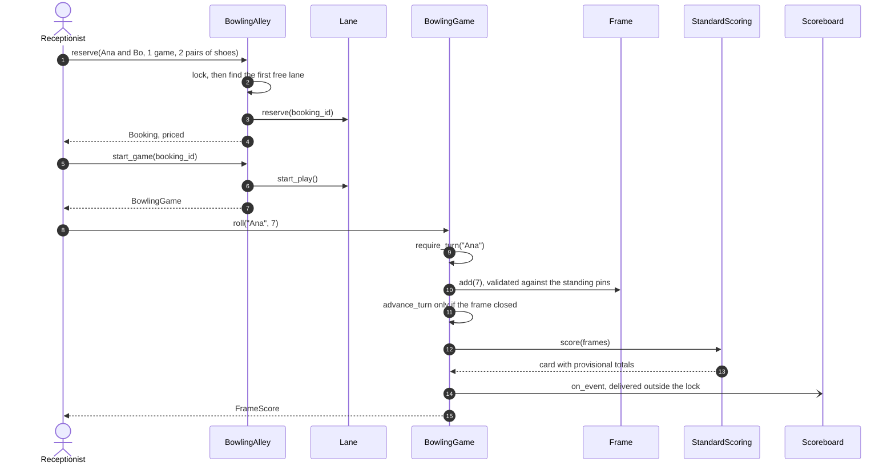
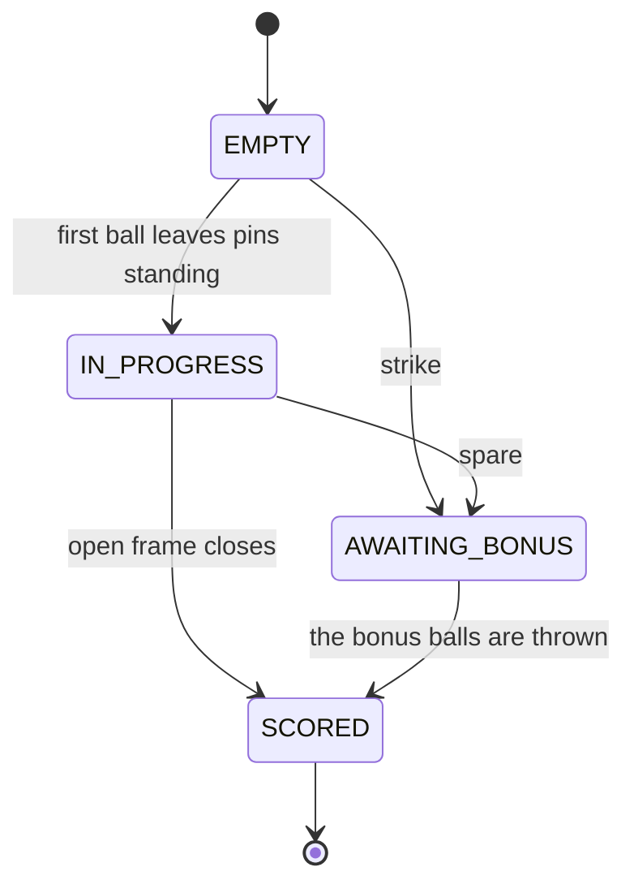
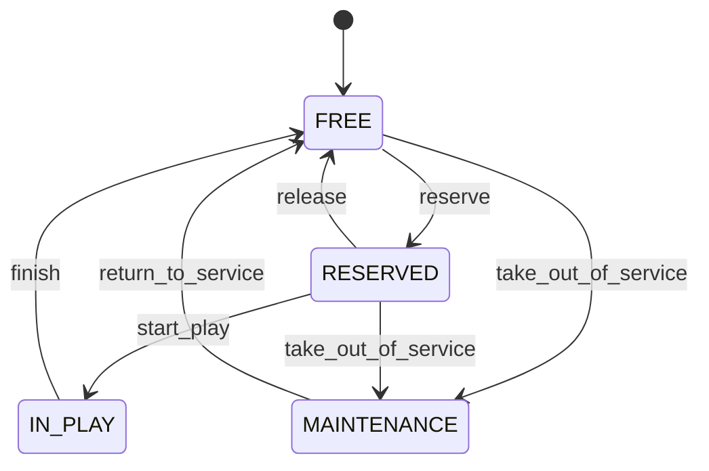

# Design a bowling alley

## TL;DR

- You build two things that meet at one point: a house that hands out lanes, and a game that scores ten frames per player on the lane it was given.
- Three decisions carry the interview: **the tenth frame is the same `Frame` class with a flag** (its rules live in `remaining_pins` and `is_complete`, nowhere else), **the card is recomputed from the rolls on every read** so a bonus that arrives two frames later needs no cache invalidation, and **turn rotation is a hook override** — the ball passes when a frame closes, not after every ball.
- Patterns that earn their place: Template Method (the `BoardGame` base from [tic-tac-toe](tic-tac-toe.md)), State, Strategy (scoring, pricing), Observer (scoreboard), Object Pool (lanes). Singleton is discussed and deliberately *not* used.

## Problem statement

"Design the software for a bowling alley. Customers reserve a lane for a party of one to six, optionally renting shoes, and are charged for the games they play. On the lane they bowl ten frames each, taking turns. A strike is worth ten plus the next two balls, a spare ten plus the next one, and the tenth frame gets up to three balls. A screen above the lane shows live scores. Show me the classes, how a frame is scored while its bonus is still unknown, and what happens when two receptionists book the last lane at the same moment."

## Requirements

**Functional**

- Lanes with availability; reserve one, play on it, release it back.
- One to six players per game, rotating turns.
- Ten frames per player, with strike, spare and open frames, and up to three balls in the tenth.
- Standard cumulative scoring, including totals that are still provisional while bonuses are unresolved.
- A live scoreboard that is told about changes rather than polling.
- Completion detection and a winner, with a tie reported as a draw.
- Pricing per player per game, plus optional shoe rental, with an alternative discount policy.

**Non-functional and constraints**

- Correct under concurrency: two receptionists must never be given the same lane.
- Pin counts are validated against the pins actually standing, including after a tenth-frame re-rack.
- Money is integer cents, never a float. Time and ids are injected.
- In-memory, single process, standard library only.

**Out of scope**: pin-setter hardware, food and drink orders, leagues and handicaps, multiple branches.

## Clarifying questions and assumptions

| Question to ask | Assumption taken here |
|---|---|
| Is the tenth frame a special class? | No — a flag on `Frame`. The rules differ, the interface does not, so the game never asks which frame it is on. |
| When does the ball pass to the next player? | When the current frame closes: after one ball for a strike, two for an open frame, up to three in the tenth. |
| What total does the board show while a strike is unresolved? | The provisional one, with the bonus counted as zero, flagged so the display can mark it. That is what a real scoreboard does. |
| Who supplies the pin count? | The caller — a pin-setter, an operator, or a test. `roll(player, pins)` is the whole input surface. |
| Do players bowl several games per booking? | The booking records how many and prices them; the model here runs one `BowlingGame` object per game. |
| Is the alley a Singleton? | No. It is built once in `main` and injected, exactly as with the [parking lot](parking-lot.md) — a second branch is then a second object. |
| What if two players tie? | `winner()` returns `None`, which the shared base reports as a draw. |

## Core entities and relationships

- **BowlingAlley** — the house. It owns the lanes, the bookings and the lock, and it is the pool: `reserve` acquires a lane, `finish` returns it.
- **Lane** with **LaneStatus** — free, reserved, in play, under maintenance, with guarded transitions so a lane cannot be handed out twice.
- **Booking** — a frozen record: lane, players, games, shoes, price and the injected timestamp.
- **PricingStrategy** — `PerGamePricing` and `HappyHourPricing`, which wraps any other policy rather than subclassing it.
- **BowlingGame** — a `BoardGame` subclass. It holds one card of ten `Frame`s per player, the shared frame index, and the turn rotation rule.
- **Frame** and **Roll** — a frame owns its rolls and every rule about how many it may take. `is_last` is the only thing that makes the tenth different.
- **ScoreCalculator** with **StandardScoring** — turns a card of frames into a card of scores.
- **FrameScore** and **FrameStatus** — one cell of the scorecard and whether its total can still move.
- **Standing** and **Scoreboard** — a row of the live board, and the observer that renders it.

Multiplicities: alley `1 -> *` lanes, alley `1 -> *` bookings, booking `1 -> 1` lane, game `1 -> 1..6` players, player `1 -> 10` frames, frame `1 -> 1..3` rolls, game `1 -> *` observers.

## Class diagram

**The game: ten frames per player, and a calculator that reads them.**



**The house: a pool of lanes, a booking, and the price of it.**



## Design patterns applied

| Pattern | Where | Why it earns its place |
|---|---|---|
| [Template Method](../patterns/template-method.md) | `BoardGame` from the tic-tac-toe package | Bowling is a turn-based game with an unusual rotation. Reusing the skeleton and overriding one hook is a far better answer than a second bespoke turn loop, and it is a concrete demonstration that the abstraction was worth building. |
| [State](../patterns/state.md) | `FrameStatus` and `LaneStatus` with guarded transitions | Two lifecycles, both with four states, both with illegal edges that must raise rather than silently pass. Here enums plus guard clauses are enough because the transitions are guarded in one place each; the [snake game](snake-game.md) is where per-state *behaviour* justifies actual State classes. |
| [Strategy](../patterns/strategy.md) | `ScoreCalculator`, `PricingStrategy` | Scoring rules vary by league, prices vary by hour. `HappyHourPricing` wraps another policy rather than subclassing it, so discounts compose. |
| [Observer](../patterns/observer.md) | `Scoreboard` and `GameLog` on the same game | The game emits events and knows nothing about screens. The board renders the *latest* standings; the log keeps the history. Two observers, two jobs. |
| [Object Pool](../patterns/object-pool.md) | `BowlingAlley` as the pool of `Lane`s | Lanes are the scarce, reusable resource. `reserve` is acquire, `finish` is release, and the pool is exhausted rather than grown. Say the pattern name and then say it has a domain name here, which is why there is no class called `LanePool`. |
| Dependency injection | `Clock`, `IdGenerator`, both strategies | Bookings are timestamped from an injected clock and identified by an injected generator, so the demo and the tests are byte-for-byte reproducible. |

What was deliberately *not* used: **Singleton** for `BowlingAlley`, for the same reason as in the [parking lot](parking-lot.md) — one instance created in `main` and injected lets tests build a dozen alleys. Also not used: a **`TenthFrame` subclass**. It sounds right and it is a trap: `Game` would have to know which frame it is holding, and every method would need an `isinstance` check or a duplicated implementation. One flag, two branches inside `Frame`, and the interface stays uniform.

## Key flows

**From the front desk to a scored ball.**



**A frame's score.** The edge that matters is `AWAITING_BONUS -> SCORED`: it is triggered by a ball thrown in a *later* frame, which is why the calculator reads the whole card rather than each frame in isolation.



**A lane's life.** Every edge not drawn here raises `LaneUnavailableError`, which is what makes double booking impossible rather than unlikely.



## Implementation

Write the frame first. Everything else in this problem is easy, and everything an interviewer probes is in those forty lines.

The vocabulary: two enums for the two lifecycles, and errors that subclass the shared hierarchy:

```python title="code/lld/bowling_alley/models.py — enums and errors"
--8<-- "code/lld/bowling_alley/models.py:enums"
```

`Frame` is the heart of the problem. `remaining_pins` re-racks after a strike or a spare in the tenth, which makes pin validation a single expression everywhere; `is_complete` encodes "up to three balls, but only if you earned the third":

```python title="code/lld/bowling_alley/models.py — frames and rolls"
--8<-- "code/lld/bowling_alley/models.py:frame"
```

The scorecard types are frozen. `FrameScore.status` is what a display uses to decide whether to print a total or a total with a mark next to it:

```python title="code/lld/bowling_alley/models.py — scorecard values"
--8<-- "code/lld/bowling_alley/models.py:scores"
```

Lanes and bookings. Every lane transition is guarded, so an illegal one raises instead of quietly corrupting availability:

```python title="code/lld/bowling_alley/models.py — lanes and bookings"
--8<-- "code/lld/bowling_alley/models.py:lane"
```

Scoring recomputes the whole card from the roll list on every call. That is at most 21 numbers per player, so there is no incremental cache to invalidate and a bonus arriving two frames later is picked up for free:

```python title="code/lld/bowling_alley/strategies.py — scoring"
--8<-- "code/lld/bowling_alley/strategies.py:scoring"
```

```python title="code/lld/bowling_alley/strategies.py — pricing"
--8<-- "code/lld/bowling_alley/strategies.py:pricing"
```

The game is short because the template already exists. Read `advance_turn`: three lines that encode "the ball passes when the frame closes, and the frame number moves on when the last player has bowled":

```python title="code/lld/bowling_alley/services.py — the game"
--8<-- "code/lld/bowling_alley/services.py:game"
```

```python title="code/lld/bowling_alley/services.py — the scoreboard"
--8<-- "code/lld/bowling_alley/services.py:scoreboard"
```

The alley is the pool. `reserve` finds and claims a lane inside one lock, which is the only thing standing between you and two parties on lane 3:

```python title="code/lld/bowling_alley/services.py — the alley"
--8<-- "code/lld/bowling_alley/services.py:alley"
```

Running `python -m lld.bowling_alley.demo` books a lane, bowls a textbook card against nine strikes, and shows the provisional totals settling:

```text
--- Sunset Lanes: BK-1 on L1, 2 lanes still free ---
price 19.00 USD for 2 players x 1 game plus 2 pairs of shoes; happy hour 15.20 USD
--- after four frames, a star marks a total that later balls can still move ---
Ana   frame  5   39*  14 45 6/ 5/
Bo    frame  5   90*  X X X X
--- final cards ---
Ana   frame 10  133   14 45 6/ 5/ X -1 7/ 6/ X 2/6
Bo    frame 10  297   X X X X X X X X X XX7
won: Bo beats Ana 297 to 133 in 31 rolls
tenth frame: Ana threw 3, Bo threw 3
--- rejections ---
too many pins: InvalidPinCountError: frame 1: 5 pins, but 3 are standing
game over: InvalidStateError: game is won; no turn can be played
lane L1 is free, 3 lanes free
```

Point at the middle block in the interview. After four frames Ana's total reads 39 with a star: her fourth-frame spare is worth ten plus a ball she has not thrown yet. Bo's 90 is provisional for the same reason across three of his four strikes. Both settle to 133 and 297 without a single cache being invalidated.

## Concurrency and edge cases

**Which lock protects what.** There are two, and they never nest.

1. `BowlingAlley._lock` guards the lane statuses and the booking registry. `reserve` scans for a free lane *and* claims it inside the lock, so the scan cannot go stale between reading and writing. Two receptionists racing for the last lane serialise here and the loser gets `LaneUnavailableError`. The concurrency test fires 30 bookings from eight workers at four lanes and asserts that exactly four succeed with four distinct lane ids.
2. `BoardGame._lock`, inherited by `BowlingGame`, guards one game's cards and turn cursor. A game is a small aggregate whose parts change together, so the game object is the unit of locking — the same argument as in [tic-tac-toe](tic-tac-toe.md), and the opposite granularity from the parking lot, where floors are independent.

A lane and a game are never locked at the same time: `start_game` builds the game while holding the alley lock, but the game is not yet visible to anyone else, and every later roll touches only the game lock. Saying that out loud is what shows you thought about lock ordering rather than got lucky.

**Provisional scores.** A strike or a spare is complete as a *frame* but not as a *score*. The calculator reports it as `AWAITING_BONUS` with the bonus counted as zero, so the running total only ever moves upwards as balls are thrown and never has to be retracted. Because the card is recomputed on every read, there is no moment where a cached total and the rolls disagree.

**Edge cases handled**: more pins than are standing, and negative pins; a re-rack after a tenth-frame strike or spare, so `10, 3, 4` is legal but `3, 8` is not; a third ball only when it is earned; a roll after the game is over, and a roll by the wrong player; a party of zero or seven; more pairs of shoes than players; an unknown booking or lane id; releasing a lane that is already free; taking a lane out of service while a game is on it; and a tie, which the base reports as a draw rather than picking a winner arbitrarily.

!!! warning "Common mistake"
    Scoring the card incrementally — adding the frame's pins to a running total as each ball lands, then trying to patch earlier frames when a bonus arrives. It works until a strike is followed by a strike, at which point the bonus for frame 8 depends on a ball in frame 10, and the patching logic grows a special case per combination. Recompute from the roll list: 21 numbers, no state, no invalidation. If the interviewer pushes on cost, that is when you say the card is bounded and the calculator is stateless, so it is also thread-safe.

## Extensibility and follow-ups

- **Leagues and handicaps**: a `HandicapScoring` that wraps `StandardScoring` and adds a per-player allowance to the final total. It is a decorator over the existing Strategy, and the `Scoreboard` needs no change because it reads `Standing`.
- **No-tap or low-ball rules**: alternative `ScoreCalculator` implementations. The frames and rolls are unchanged; only the interpretation moves.
- **Several games per booking**: the `Booking` already records `games`. Keep a list of `BowlingGame` objects per booking and release the lane when the last one finishes.
- **Reservations for a future time slot**: `Lane` gains a schedule instead of a single status, and `reserve` becomes an interval overlap check. That is where the single alley lock starts to hurt, and where a per-lane lock ordered by id is the right next step.
- **Pin-setter integration**: `roll(player, pins)` is already the port. A hardware adapter calls it, and a mis-read is exactly the invalid pin count the model already rejects.
- **Multiple branches**: this becomes a system design question — a lane availability service, bookings with idempotency keys, and eventual consistency between the branch screens and the central view.

!!! tip "Interview tip"
    When you get to scoring, write the tenth frame *first* and the first nine second. Everyone can score an open frame; the tenth is where the rules bite, and starting there forces you to decide early whether it is a subclass or a flag. Announce the decision — "one class, one flag, because the game must not care" — and you have answered the design question before you write the arithmetic.

## Tests

`tests/test_bowling_alley.py` has 18 cases. The parametrized card table is the one to show first: five known games, one line each, and any scoring bug fails at least one of them.

```python title="code/lld/bowling_alley/tests/test_bowling_alley.py — the tenth frame"
--8<-- "code/lld/bowling_alley/tests/test_bowling_alley.py:tenth"
```

The provisional-score tests are the ones that catch an incremental scorer. They assert the total *before* the bonus lands as well as after:

```python title="code/lld/bowling_alley/tests/test_bowling_alley.py — provisional totals"
--8<-- "code/lld/bowling_alley/tests/test_bowling_alley.py:provisional"
```

```python title="code/lld/bowling_alley/tests/test_bowling_alley.py — lane allocation under load"
--8<-- "code/lld/bowling_alley/tests/test_bowling_alley.py:concurrency"
```

The rest cover: the gutter game, the all-fives game, the perfect game, the textbook 133 card and a nine-and-miss game; invalid pin counts including the tenth-frame re-rack; the ball passing only when a frame closes, and an out-of-turn roll; every guarded lane transition; pricing with and without a discount; the scoreboard and the log observing the same game; and the alley refusing bad party sizes, unknown ids and a double release. Run them with `uv run pytest code/lld/bowling_alley -q`.

## 45-minute pacing

| Minutes | What to do | What to say or write |
|---|---|---|
| 0–5 | Clarify | Tenth frame rules? Turn rotation per ball or per frame? Live scores while bonuses are pending? Out of scope: hardware, food, leagues. |
| 5–10 | Split the problem | Two halves on the board: the house (lanes, bookings, pricing) and the game (frames, rolls, scoring). Say which half you will do first and why. |
| 10–20 | The frame | `remaining_pins`, `is_complete`, `frame_type`. Do the tenth frame first. State the one-class-one-flag decision out loud. |
| 20–28 | Scoring | `StandardScoring.score` over the flattened roll list, with `AWAITING_BONUS` for unresolved marks. Show the provisional total on the board. |
| 28–34 | The game | Reuse `BoardGame`, override `advance_turn`, and point out that this is the payoff for having built the template in the first place. |
| 34–40 | The house and concurrency | `reserve` inside one lock, the lane state machine, and why the alley lock and the game lock never nest. |
| 40–45 | Extensions | Handicaps as a decorator, time-slot reservations and per-lane locks, pin-setter as an adapter, multiple branches as the HLD hand-off. |

## Related

- [Design tic-tac-toe (an extensible board game)](tic-tac-toe.md) — where `BoardGame`, the turn cursor and the observers come from
- [Template Method](../patterns/template-method.md) — the skeleton, and the `advance_turn` hook this problem needs
- [State](../patterns/state.md) — the frame and lane lifecycles, and when to promote an enum to classes
- [Object Pool](../patterns/object-pool.md) — lanes as the scarce reusable resource
- [Strategy](../patterns/strategy.md) — scoring and pricing policies
- [Design a parking lot](parking-lot.md) — the other allocation problem, with a finer lock granularity
