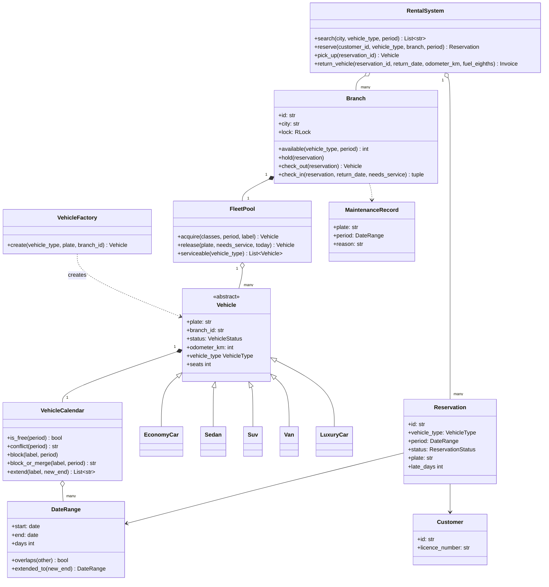
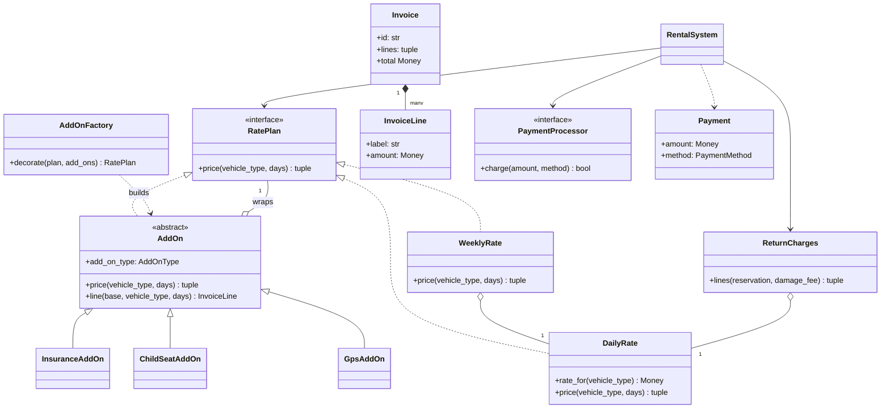
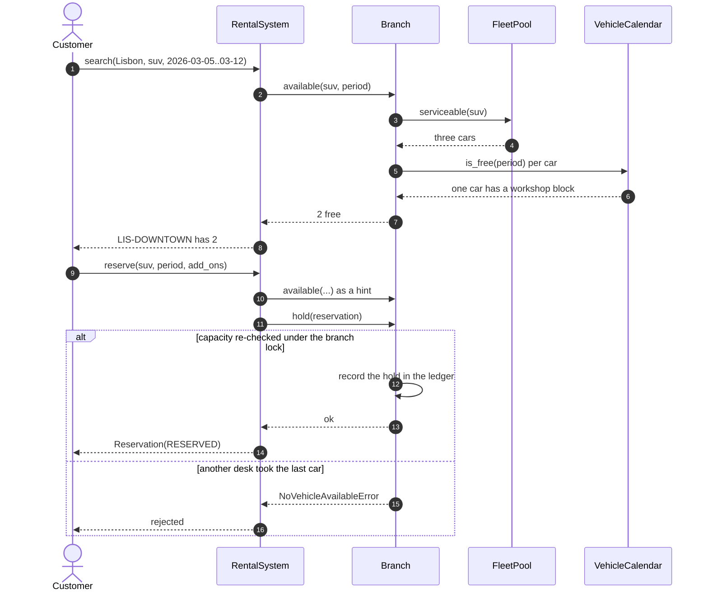
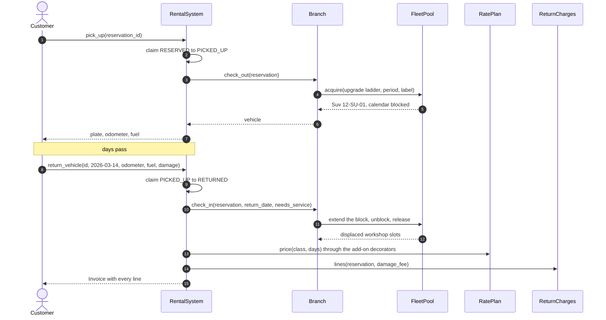
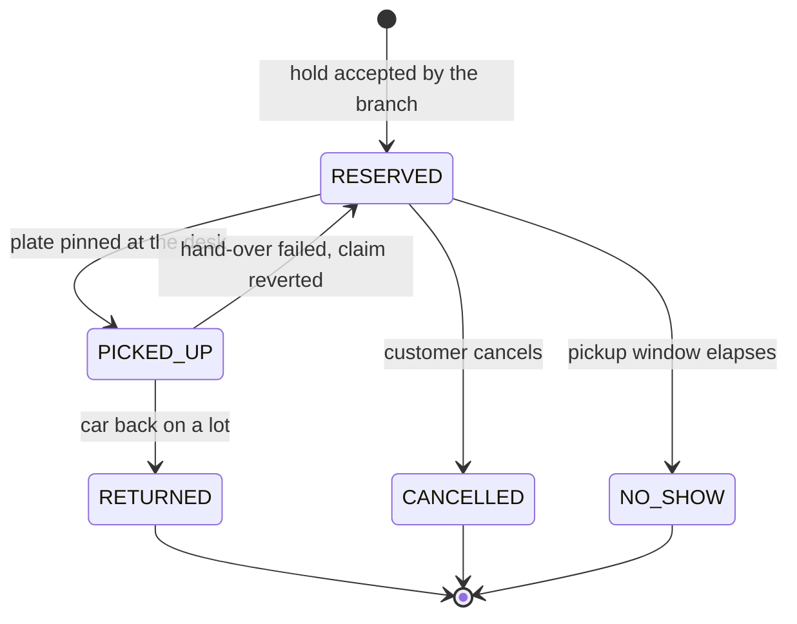

# Design a car rental system

## TL;DR

- You build a multi-branch rental company: customers search by city and dates, reserve a **class** of car, and are handed a **plate** only at the desk.
- Three decisions carry the interview: **half-open date intervals** so overlap detection is one comparison, **counted availability per class plus a per-vehicle calendar** so the two never double-count, and **one lock per branch** so two cities never contend.
- Patterns that earn their place: Strategy (rate plans), Decorator (add-ons, because insurance prices itself off what it wraps), Object Pool (the fleet), Factory Method (vehicles), Facade (`RentalSystem`).

## Problem statement

"Design the software behind a car rental company. It has branches in several cities, each with a fleet of vehicles of different classes. Customers search by city, dates and class, reserve a car, pick it up, drive it, and drop it off — sometimes at a different branch. You bill a daily or weekly rate plus optional extras, and you charge for late returns, missing fuel and damage. Cars also need scheduled maintenance. Model the classes, the booking flow, and what happens when two customers want the last car."

## Requirements

**Functional**

- Branches in multiple cities; each owns a fleet of vehicles with a class, a plate and a status.
- Search by city, date range and vehicle class; the result is how many cars are free for the *whole* range.
- Reserve a class for a date range with a pickup branch and a drop-off branch (which may differ).
- Pricing: a daily rate per class, a weekly rate for stays of seven days or more, and add-ons (GPS, child seat, insurance).
- Pickup pins a physical car to the reservation and records odometer and fuel; return records them again.
- Charges on return: base rate, add-ons, late days, refuelling, mileage above the allowance, one-way fee, damage.
- Cancellation, with a fee inside the free-cancellation window; a no-show releases the hold.
- Maintenance windows are scheduled per vehicle and remove it from availability for those days.

**Non-functional and constraints**

- Never oversell a branch: if three SUVs are on the lot, at most three overlapping reservations exist for that week.
- A vehicle can never hold two overlapping bookings, including maintenance.
- In-memory and single-process; repositories are the seam where a database would go.
- Deterministic: the clock and the ID generators are injected, so every test pins a real calendar date.

**Out of scope**: loyalty programmes, dynamic pricing, telematics, the payment gateway beyond a processor interface, and driver licence verification.

## Clarifying questions and assumptions

| Question to ask | Assumption taken here |
|---|---|
| Does a customer book a specific car or a class of car? | A class. Every real rental company does this, and it is the source of the most interesting logic on this page. |
| What is the unit of time — a day or an hour? | A calendar day, modelled as a **half-open** range `[start, end)`. Hourly rentals are the same code with a different resolution. |
| Can a rental start and end at different branches? | Yes. One-way rentals attract a fee and physically move the car between fleets. |
| What happens when the booked class is out at the desk? | The desk walks an upgrade ladder and bills the class the customer booked. A van has no substitute, so a van booking can only be filled by a van. |
| Is the reservation confirmed by payment? | No. The hold is free; money is taken at return. This keeps the payment saga out of the core flow, and you can add an authorisation later. |
| Do branches share a fleet? | Not for availability. A car belongs to exactly one branch at a time; rebalancing is an explicit transfer. |
| How precise must overlap detection be? | Exact. Two bookings on one plate that share a single day is a bug that puts two customers in the same car. |

## Core entities and relationships

- **DateRange** — a frozen half-open interval `[start, end)` with `overlaps` and `days`. Everything about time flows through it.
- **Vehicle** (abstract) with `EconomyCar`, `Sedan`, `Suv`, `Van`, `LuxuryCar`. Each subclass fixes its `vehicle_type` and `seats`; `VehicleFactory` turns a fleet-import string into the right subclass.
- **VehicleCalendar** — the blocked ranges of one car: its rentals and its maintenance windows. One vehicle owns exactly one calendar.
- **FleetPool** — one branch's cars, with `acquire` and `release`. This is the Object Pool: the desk borrows a car, it never creates one.
- **Branch** — a location: a `FleetPool`, a ledger of open holds, and *the lock* that makes both consistent. One branch, many vehicles; one branch, many reservations.
- **Reservation** — customer, class, branches, `DateRange`, add-ons, and a status that walks `RESERVED → PICKED_UP → RETURNED`. It carries a plate only after pickup.
- **RatePlan** (`DailyRate`, `WeeklyRate`) and **AddOn** (`GpsAddOn`, `ChildSeatAddOn`, `InsuranceAddOn`) — the pricing policies; **ReturnCharges** prices what only the return desk knows.
- **Invoice** / **InvoiceLine** / **Payment** — an itemised bill, because a customer who is charged 1,098.60 USD wants seven lines, not one number.
- **RentalSystem** — the facade the API layer talks to: search, reserve, cancel, pick up, return, pay, schedule maintenance.

Multiplicities: company `1 → *` branches, branch `1 → *` vehicles, vehicle `1 → 1` calendar, branch `1 → *` reservations, reservation `0..1 → 1` vehicle (pinned at pickup), reservation `1 → *` invoice lines.

## Class diagram

**Structure: branches own cars, cars own calendars, reservations own dates.**



**Pricing: one rate plan, wrapped once per add-on, plus what the return desk discovers.**



## Design patterns applied

| Pattern | Where | Why it earns its place |
|---|---|---|
| Strategy | `RatePlan` with `DailyRate` and `WeeklyRate` | "Now add a weekend rate" is a new class and one constructor argument. `WeeklyRate` *composes* `DailyRate` instead of subclassing it, so the day rate lives in one place. |
| Decorator | `AddOn` and its three subclasses | Add-ons compose in any number and any order, which a pair of booleans on `Reservation` cannot do. `InsuranceAddOn` settles the argument: it charges 20% of everything it wraps, so it must *see* the lines below it. |
| Object Pool | `FleetPool.acquire` / `release` | Cars are expensive, finite and reused. The desk borrows the next acceptable car and gives it back; retirement removes it from the pool for good. |
| Factory Method | `VehicleFactory.create`, `AddOnFactory.decorate` | Fleet imports and stored reservations carry strings. A registry dict maps them to classes; adding a pickup truck touches the registry, nothing else. |
| Facade | `RentalSystem` | Six verbs over branches, pricing and payments. The API layer never touches a `FleetPool`. |
| State (lightweight) | `ReservationStatus` with guarded transitions | An enum plus one `_claim` helper is enough. Full State classes would add five files and no behaviour. |
| Dependency Injection | `Clock`, three `IdGenerator`s, `RatePlan`, `PaymentProcessor` | Tests pin the date to 2026-03-01 and get `R-1`, `INV-1`, `M-1` every run. |

What was deliberately *not* used: a **Repository** per entity. The brief lists it, and in production you would have `ReservationRepository` and `VehicleRepository` behind protocols — but in a 45-minute round they add indirection before they add value. Say the sentence out loud instead: "`Branch` and `RentalSystem` hold dicts today; both are one protocol away from a database, and the transaction boundary is already the branch." That is the answer the interviewer wants, and it costs you ten seconds instead of ten minutes.

## Key flows

**Booking: the branch is the only thing that may say yes.**



**Pickup and return: the plate appears at the desk, and the bill is assembled from three sources.**



**Reservation lifecycle.** `PICKED_UP` is what makes the counting safe: the moment a reservation is pinned to a plate, it stops being a counted hold and becomes a calendar block, so it is never counted twice.



## Implementation

Write it in the order you would in the room: the vocabulary, then the one value object every other class depends on, then the entities, then the policies, then the services that hold the locks.

The enums pin the vocabulary. `UPGRADE_LADDER` next to them is deliberate — it is a business rule, not an implementation detail, and putting it in the model file stops it being reinvented inside three services:

```python title="code/lld/car_rental/models.py — enums"
--8<-- "code/lld/car_rental/models.py:enums"
```

`DateRange` is the class the whole problem turns on. Half-open means a rental ending on the 12th does not occupy the 12th, so the next customer collects the same car that morning — and overlap is a single expression with no `+1` anywhere:

```python title="code/lld/car_rental/models.py — DateRange"
--8<-- "code/lld/car_rental/models.py:daterange"
```

Each car owns a calendar of labelled blocks. `block` refuses an overlap outright, `block_or_merge` is for a car that comes back damaged into a slot the workshop already holds, and `extend` is the late-return path: the physical car really is late, so the extension always wins and the method reports what it ran into.

```python title="code/lld/car_rental/models.py — VehicleCalendar"
--8<-- "code/lld/car_rental/models.py:calendar"
```

Vehicles carry their own class and capacity, so no service ever branches on a type string:

```python title="code/lld/car_rental/models.py — vehicles"
--8<-- "code/lld/car_rental/models.py:vehicles"
```

Rate plans return *lines*, not a total. That one choice makes the itemised invoice free and lets insurance price itself off the lines above it:

```python title="code/lld/car_rental/strategies.py — rate plans"
--8<-- "code/lld/car_rental/strategies.py:rates"
```

```python title="code/lld/car_rental/strategies.py — add-ons as decorators"
--8<-- "code/lld/car_rental/strategies.py:addons"
```

The pool only *selects and mutates*; it takes no lock, because `Branch` serialises every call into it. That separation is what keeps a car's calendar and the branch ledger consistent:

```python title="code/lld/car_rental/services.py — FleetPool"
--8<-- "code/lld/car_rental/services.py:pool"
```

`Branch` is the unit of locking and the only object allowed to say "yes, you may have a car". `_available` is the whole oversell argument in five lines:

```python title="code/lld/car_rental/services.py — Branch"
--8<-- "code/lld/car_rental/services.py:branch"
```

The facade never holds its own lock across a branch call. Every status change goes through `_claim`, which is a check-and-flip under the registry lock — the same "reserve, do, commit or revert" shape the parking lot uses at its exit gate:

```python title="code/lld/car_rental/services.py — RentalSystem"
--8<-- "code/lld/car_rental/services.py:system"
```

Running `python -m lld.car_rental.demo` walks a whole week, including the late return that eats its own workshop slot:

```text
today is 2026-03-01; searching suv in Lisbon for 2026-03-05..2026-03-12
  LIS-DOWNTOWN: 2 suv free
workshop booked for both suvs; availability for the week is now 1
R-1 reserved: suv 2026-03-05..2026-03-12 with gps, insurance -> quote 501.60 USD
second suv request rejected: no suv free at LIS-DOWNTOWN for 2026-03-05..2026-03-12
R-2 reserved: economy 2026-03-05..2026-03-08, one-way to LIS-AIRPORT
R-2 picked up 10-EC-01; R-1 picked up 12-SU-01 at 41200 km, fuel 8/8
R-2 dropped at LIS-AIRPORT: INV-1 totals 243.00 USD (one-way fee included)
R-1 back on 2026-03-14, two days late and damaged; it displaced ['maint:M-2']
    suv rental: 1 week(s) x 6 day(s) x 65.00 USD: 390.00 USD
    GPS unit: 7 day(s) x 4.00 USD: 28.00 USD
    damage waiver: 20% of the lines above: 83.60 USD
    late return: 2 day(s) x 97.50 USD: 195.00 USD
    refuelling: 3/8 tank: 27.00 USD
    mileage: 900 km past the 1800 km allowance: 225.00 USD
    damage assessment: 150.00 USD
PAY-INV-2: 1098.60 USD by card; 12-SU-01 goes straight to the workshop
```

## Concurrency and edge cases

**Which lock protects what.** There are exactly two, and they are never nested:

1. `Branch.lock` (an `RLock`) guards that branch's fleet pool, every vehicle calendar in it, and the ledger of open holds. It is the serialisation point of the design. Coarser than one lock per car — because "is any SUV free that week?" would otherwise be a scan that takes N locks in an order you have to prove is safe — and far finer than one lock for the company, so Lisbon and Porto never contend. An uncontended lock costs about 17 ns; a branch that handles even 100 bookings a minute is nowhere near contention, so buying simplicity with a slightly coarse lock is the right trade.
2. `RentalSystem._lock` guards the reservation registry and every status transition. `_claim(id, expected, target)` checks and flips atomically, so two desks handed the same reservation cannot both pick the car up: the loser gets `ReservationStateError`.

The ordering rule is stated once and obeyed everywhere: **claim under the registry lock, then do the branch work outside it, then revert the claim if that work failed.** `pick_up` is the example — if `check_out` cannot find a car, the reservation goes back to `RESERVED` and the customer keeps their booking.

**Preventing oversell.** `Branch._available` is the invariant:

```python
fleet    = cars of that class that are not retired
blocked  = those whose calendar overlaps the range   # maintenance + already-pinned rentals
held     = RESERVED rows for that class overlapping the range
available = len(fleet) - blocked - held
```

The subtlety worth saying out loud: a reservation is counted in exactly one of the two terms, never both. While it is `RESERVED` it is a counted hold with no plate; the instant it becomes `PICKED_UP` it acquires a calendar block and is dropped from the ledger. `reserve` does a cheap unlocked `available()` call first as a *hint*, then calls `hold`, which recomputes under the lock and is the only thing that can say yes.

**Two branch locks at once.** A one-way return has to remove a car from one fleet and add it to another. `transfer` sorts the two branches by id and takes the locks in that order, so two one-way returns running in opposite directions can never deadlock — the classic fixed-order rule, applied to the only place in this design that needs two locks.

**The late-return cascade.** A car that comes back two days late has already broken somebody's plan. `VehicleCalendar.extend` grows the rental block and returns the labels it now overlaps, so the branch learns immediately that its workshop slot is gone. Nothing downstream breaks, and that is the payoff of booking by class: the next customer is not waiting for *that plate*, they are waiting for *an SUV*, so the desk can hand them a different one — or walk the upgrade ladder.

**Edge cases handled**: back-to-back rentals on one plate (half-open ranges), zero-length and reversed date ranges rejected at construction, booking a date in the past, cancelling twice, cancelling after pickup, an overlapping maintenance window, a damaged car returning into a workshop slot it already had, a one-way return into a branch with no cars of that class, mileage and fuel deltas, and a return date before the pickup date.

!!! warning "Common mistake"
    Modelling the reservation as a link to a specific plate at booking time. It feels tidier and it fails the moment a car is late, breaks down or is written off: every downstream booking on that plate has to be rewritten, under a lock, with a fallback nobody designed. Book the class, count the fleet, pin the plate at the desk — and if the interviewer pushes back, point at the one-line `_available` formula and the upgrade ladder.

## Extensibility and follow-ups

- **Dynamic pricing**: a `DemandRate(daily, utilisation_provider)` that reads branch utilisation and multiplies. It implements `RatePlan`, so it slots in as a constructor argument and every add-on still composes on top.
- **Loyalty**: a `LoyaltyDiscount(RatePlan)` decorator that appends a negative line. Decorators already compose, so gold-tier plus insurance plus GPS needs no new plumbing — only a decision about ordering, which is exactly the discussion you want to be having.
- **Fleet rebalancing**: `transfer` already exists and is deadlock-safe. A rebalancer is a job that reads utilisation per branch per class and issues transfers; the only new rule is that a car with a future block cannot leave.
- **Damage photos**: `MaintenanceRecord` grows an `evidence: tuple[str, ...]` of object-storage keys. The domain does not change; the upload path is an HLD conversation about presigned URLs.
- **Hourly rentals and car sharing**: swap `date` for `datetime` inside `DateRange`. Every overlap check is already written against the interval, not against days.
- **Persistence and multi-region**: `Branch` is the natural transaction boundary — one row per hold, and the per-vehicle blocks become an exclusion constraint on a range column, which is the same predicate `DateRange.overlaps` implements. That mapping is what makes this design portable rather than clever.

!!! tip "Interview tip"
    When you draw the timeline, draw it half-open and say so: "the 12th belongs to the next rental". Then write `a.start < b.end and b.start < a.end` on the board and note it is the same predicate a database range-exclusion constraint uses. Two sentences, and you have shown you know both the domain rule and how it survives contact with a real database.

## Tests

`tests/test_car_rental.py` has 20 cases. Two are worth walking through out loud. The concurrency test races 24 threads at a branch with three SUVs and asserts exactly three winners — the invariant, not the mechanism:

```python title="code/lld/car_rental/tests/test_car_rental.py — no oversell under contention"
--8<-- "code/lld/car_rental/tests/test_car_rental.py:concurrency"
```

The upgrade test is the one that proves booking-by-class was the right model: the reserved car breaks down *after* the booking is taken, the desk hands over a sedan, and the customer is still billed the economy week rate.

```python title="code/lld/car_rental/tests/test_car_rental.py — upgrade at the desk"
--8<-- "code/lld/car_rental/tests/test_car_rental.py:upgrade"
```

The rest cover: the full reserve-pickup-return-pay path; half-open overlap through a five-case `parametrize` (touching at either end must *not* overlap); back-to-back rentals landing on the same plate; rejection when every car of the class is committed, and acceptance for a neighbouring window; past dates and zero-day ranges; free versus chargeable cancellation and a second cancel failing; maintenance hiding a car and rejecting an overlapping window; the one-way transfer moving the car between fleets; the late return charging 1.5x per late day and reporting the displaced workshop slot; and the rate plans and add-on decorators through a five-case `parametrize`. Run them with `uv run pytest code/lld/car_rental -q`.

## 45-minute pacing

| Minutes | What to do | What to say or write |
|---|---|---|
| 0–5 | Clarify | By class or by plate? Days or hours? One-way allowed? What happens when the booked class is out? Out of scope: loyalty, dynamic pricing, gateway. |
| 5–10 | Entities and the timeline | Draw a calendar strip. Write `DateRange` half-open and the overlap predicate. Nouns: Branch, Vehicle (+5), Calendar, Reservation, Invoice. |
| 10–18 | Class diagram | Structure first, then hang `RatePlan` and the `AddOn` decorators off `RentalSystem`. Mark the branch lock on the diagram. |
| 18–34 | Code | `DateRange.overlaps` → `VehicleCalendar` → `Branch._available` → `Branch.hold` → `RentalSystem.pick_up`. Say "count the class, pin the plate" while writing it. |
| 34–40 | Concurrency and pricing | The two locks, the claim-do-revert rule, the fixed lock order for transfers. Then the insurance decorator as the reason add-ons are not booleans. |
| 40–45 | Edge cases and extensions | Late-return cascade, upgrade ladder, dynamic pricing as a new `RatePlan`, and the range-exclusion constraint you would use in Postgres. |

## Related

- [Design a hotel management system](hotel-management.md) — the same date-range inventory problem with rooms instead of cars
- [Design Ticketmaster (with a hotel-booking variant)](../../hld/case-studies/ticketing-and-reservations.md) — what this becomes at scale, with holds, TTLs and a waiting room
- [Decorator](../patterns/decorator.md) — the add-on stack and why insurance must wrap
- [Object Pool](../patterns/object-pool.md) — acquire and release over a finite fleet
- [Strategy](../patterns/strategy.md) — the rate plans
- [Concurrency for LLD in Python](../fundamentals/concurrency-for-lld.md) — lock granularity and fixed lock ordering
- Primary source: PostgreSQL documentation, "Range Types" and `EXCLUDE USING gist` constraints — the database expression of `DateRange.overlaps`
