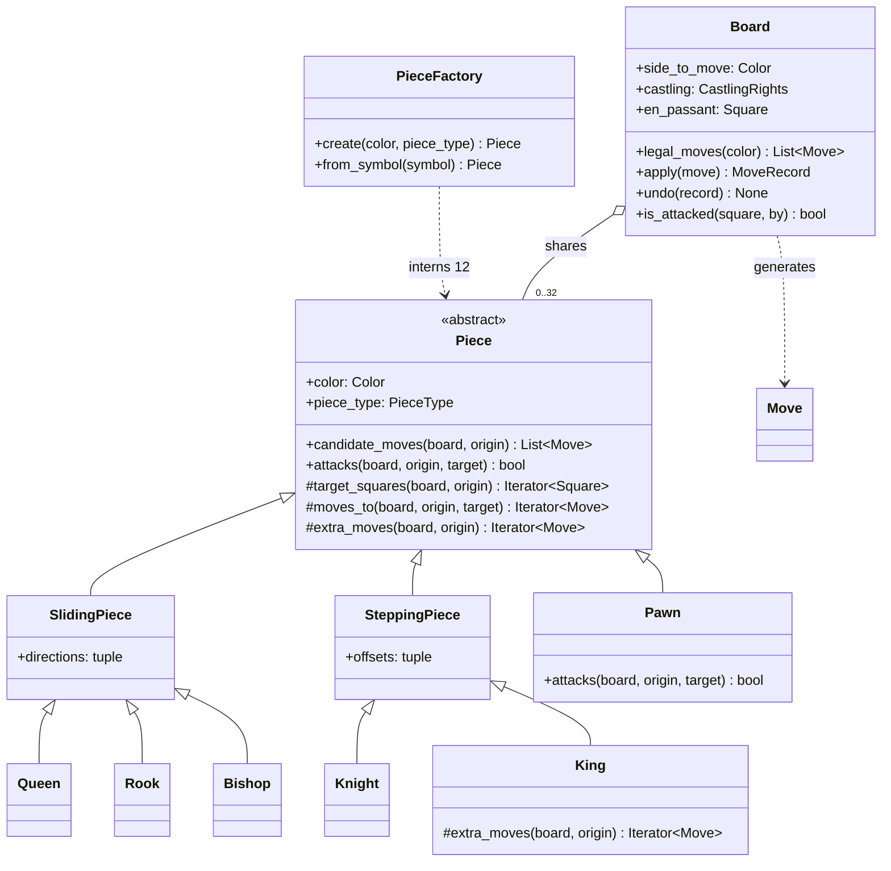
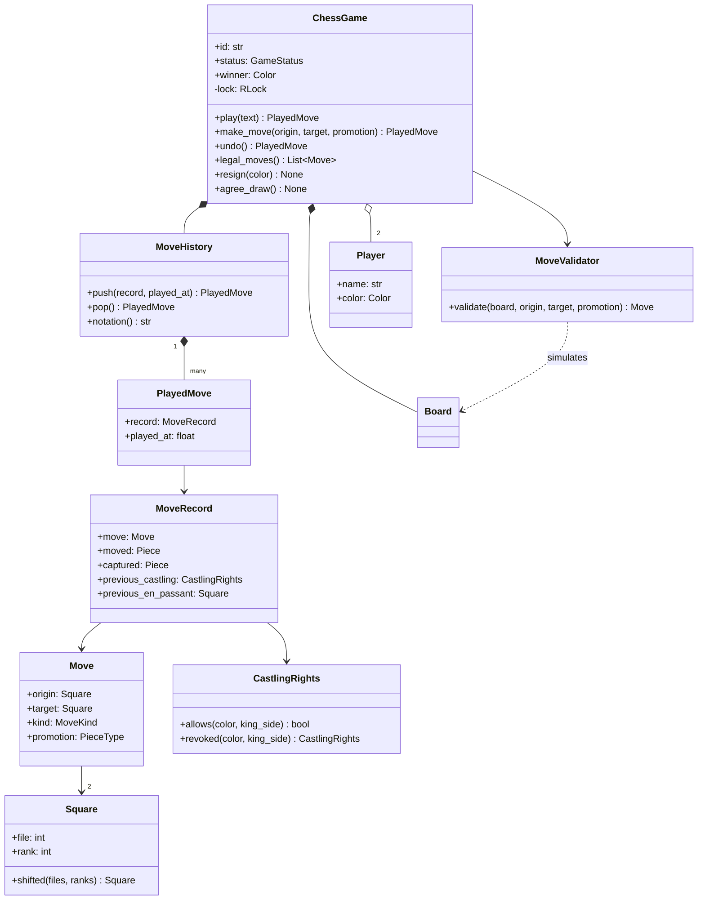
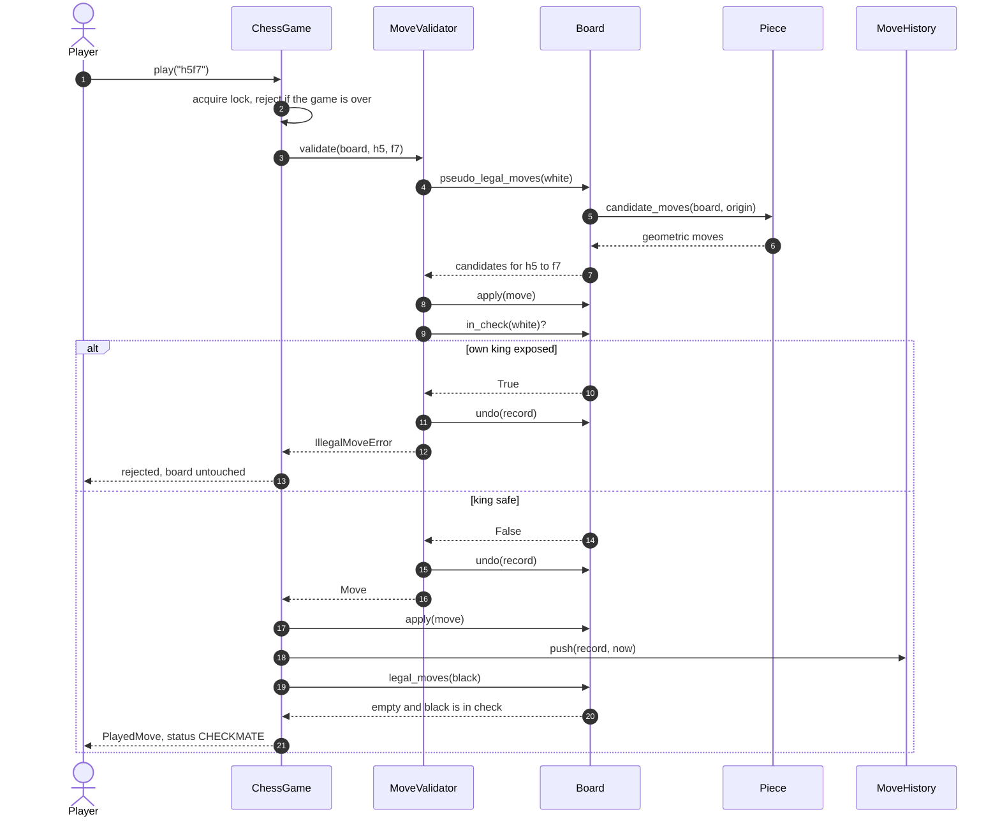
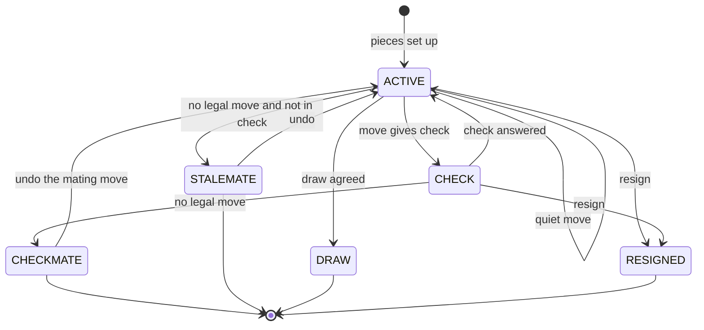

# Design chess

## TL;DR

- You build a rules engine: a `Board` that applies and undoes moves, a `Piece` hierarchy that generates its own geometry, and a `ChessGame` that owns the turn, the status and the lock.
- Three decisions carry the interview: **legality is decided by simulation** (apply, ask "is my king in check?", undo), **castling rights live on the board, not on the piece**, and **undo restores a memento**, not a guess.
- Patterns that earn their place: Template Method, Flyweight, Memento, Command, Factory. An if/elif ladder on piece type is deliberately absent.

## Problem statement

"Implement chess. Two players alternate moves on an 8x8 board. Every piece type moves differently; a move is illegal if it leaves your own king attacked. Support captures, castling, pawn promotion and en passant, detect check, checkmate and stalemate, let a player resign or agree a draw, and support taking back moves. I want the class model, the legal-move generation, and the flow of a single `make_move` call — including what happens when the move is rejected."

## Requirements

**Functional**

- Standard starting position, white moves first, strict turn alternation.
- Legal move generation per piece type: king, queen, rook, bishop, knight, pawn.
- Check detection; checkmate and stalemate detection after every move.
- Captures, including en passant; pawn promotion with an explicit piece choice.
- Castling on both wings, with the rights, path and "not through check" rules.
- Move history, and undo that restores captured pieces, castling rights and the en-passant square.
- Resignation and draw by agreement; a queryable game status at all times.

**Non-functional and constraints**

- A move is validated and applied atomically: two clients pushing moves into one game must never interleave halfway.
- Deterministic and testable: positions can be built directly, time and IDs are injected.
- In-memory, single process. The engine is a library; the UI, the network and the clock sit outside it.

**Out of scope**: an opponent (search and evaluation), algebraic notation parsing, threefold repetition and the 50-move claim, time controls, opening books, PGN import.

## Clarifying questions and assumptions

| Question to ask | Assumption taken here |
|---|---|
| Do you want a playable engine or an AI? | Rules only. Search is a follow-up and would be a separate class that consumes `legal_moves`. |
| Which special moves are in? | All three: castling, promotion and en passant. They are where the design is tested, so cutting them cuts the interesting part. |
| Who chooses the promotion piece? | The caller, always. `a7a8` without a piece is an error, not a silent queen; a rejected choice is far cheaper than a wrong one. |
| How are moves expressed? | Coordinate notation (`e2e4`, `a7a8q`). Standard algebraic notation is a formatter on top and is a follow-up. |
| Is undo unlimited? | Yes, back to the first move. Resignation and an agreed draw are final: undo would rewrite a result both players accepted. |
| Can the same game be driven from two connections? | Yes, so the game holds a lock. The board itself is not thread-safe by design. |
| Do you need draws by repetition or the 50-move rule? | Not for the first pass; the half-move clock is tracked so the rule is a small addition. |

## Core entities and relationships

- **Piece** (abstract) with `SlidingPiece` (`Queen`, `Rook`, `Bishop`), `SteppingPiece` (`Knight`, `King`) and `Pawn`. A piece knows its geometry and nothing else — not its square, not whether it has moved.
- **PieceFactory** — interns one instance per colour and type. Thirty-two pieces on the board are twelve objects.
- **Square** — a frozen `(file, rank)` pair with `shifted()` returning `None` off the board, which removes every bounds check from the generators.
- **Move** — a command object: origin, target, a `MoveKind` for the three special cases, and an optional promotion type.
- **Board** — piece placement plus the four pieces of state a position needs beyond it: side to move, `CastlingRights`, the en-passant target square, and the half-move clock. It applies and undoes moves and answers `is_attacked`.
- **MoveRecord** — the memento `Board.apply` returns and `Board.undo` consumes.
- **MoveValidator** — turns a raw `(from, to)` request into a legal `Move` or an error that names the reason.
- **MoveHistory** — the caretaker: a stack of `PlayedMove` (memento plus timestamp).
- **ChessGame** — the aggregate root: two `Player`s, one `Board`, the `GameStatus`, and the lock.

Multiplicities: game `1 -> 1` board, game `1 -> 2` players, board `1 -> 0..32` pieces (shared), history `1 -> *` played moves, played move `1 -> 1` record.

## Class diagram

**Structure: the piece hierarchy and the board that shares it.**



**Behaviour: the game, the validator and the memento chain that makes undo exact.**



## Design patterns applied

| Pattern | Where | Why it earns its place |
|---|---|---|
| Template Method | `Piece.candidate_moves` with the `_target_squares`, `_moves_to` and `_extra_moves` hooks | The skeleton ("reach squares, drop friendly occupants, wrap in moves") is written once. A new piece supplies geometry only; the board never learns its name. |
| Polymorphism over conditionals | `SlidingPiece.directions`, `SteppingPiece.offsets` | The queen is four lines. Adding a fairy piece is a class, not an `elif` in a 200-line function — this is the single loudest signal in this problem. |
| Flyweight | `PieceFactory` interning 12 instances | Pieces carry no square and no `has_moved` flag, so they can be shared. That constraint is what forces castling rights onto the board, where they belong. |
| Memento | `MoveRecord` produced by `Board.apply`, consumed by `Board.undo` | Legality checking undoes thousands of moves per game. The memento makes undo exact and O(1), and the same object powers user-facing take-backs. |
| Command | `Move` as a value object with a `kind` | The board switches on `kind`, not on piece type, and a move can be logged, queued or sent over a socket. |
| Factory Method | `Board.standard`, `Board.from_placement`, `PieceFactory.from_symbol` | Setup is a named constructor, and tests build a five-piece position in one line instead of playing twenty moves to reach it. |
| State (lightweight) | `GameStatus` with guarded transitions in `ChessGame` | Six statuses with a single `is_over` predicate. Full State classes would add six classes and buy nothing. |

What was deliberately *not* used: a **Strategy** for move generation. It is tempting to inject a `MoveRule` per piece type, but the rule and the piece are the same concept here — one object, not two. Also **no bitboards**: they are the right answer for an engine that searches millions of positions and the wrong answer for a 45-minute interview, and saying that out loud is better than either writing them or ignoring them.

## Key flows

**One move: validate by simulation, apply, then classify the position it produced.**



**Status lifecycle.** `CHECK` is not a terminal state, it is a label on an active position; `CHECKMATE` and `STALEMATE` are decided by the same question ("does the side to move have a legal move?") and separated by one more ("is the king attacked?").



## Implementation

Write it in this order: the vocabulary, the pieces, the board, then the services. Nothing below is pseudocode — it is the module the tests run.

The enums are the vocabulary. `MoveKind` is the one that pays: it names exactly the three moves that are not "pick the piece up and put it down", so the board can handle them without asking what piece moved.

```python title="code/lld/chess/models.py — enums"
--8<-- "code/lld/chess/models.py:enums"
```

```python title="code/lld/chess/models.py — errors"
--8<-- "code/lld/chess/models.py:errors"
```

The value objects. `Square.shifted` returning `None` off the board is a small decision with a large payoff: every generator below is a loop with no bounds arithmetic in it. `MoveRecord` is the memento — note the two fields candidates forget, `captured` and `previous_castling`.

```python title="code/lld/chess/models.py — value objects"
--8<-- "code/lld/chess/models.py:values"
```

Now the piece hierarchy, and the Template Method that makes it work. `candidate_moves` is written once; subclasses fill three hooks. Read `attacks` carefully: it is *not* "is the target in my move list", because castling asks whether a square is attacked, and asking the king for its moves would recurse forever.

```python title="code/lld/chess/pieces.py — the template"
--8<-- "code/lld/chess/pieces.py:base"
```

The six pieces are now tiny. The king owns castling in `_extra_moves` (the only place `is_attacked` is consulted during generation), and the pawn owns promotion, the double push and en passant in `_moves_to`.

```python title="code/lld/chess/pieces.py — the six pieces"
--8<-- "code/lld/chess/pieces.py:pieces"
```

The factory interns the twelve instances at import time. Because a piece has no `has_moved` flag, sharing is safe — and that is precisely why castling rights are board state.

```python title="code/lld/chess/pieces.py — flyweight factory"
--8<-- "code/lld/chess/pieces.py:factory"
```

The board is the memento originator. `apply` returns everything `undo` needs; `legal_moves` is the pin rule, and it is the method the interviewer is waiting for.

```python title="code/lld/chess/board.py"
--8<-- "code/lld/chess/board.py:board"
```

The validator exists so that "illegal" comes with a reason. Its last block is the crux of the whole problem: apply, ask, take back.

```python title="code/lld/chess/services.py — validator"
--8<-- "code/lld/chess/services.py:validator"
```

The history is a plain caretaker; it stores mementos and never looks inside one.

```python title="code/lld/chess/services.py — history"
--8<-- "code/lld/chess/services.py:history"
```

The game ties it together: one lock, one status machine, and a `_refresh_status` that runs after both `make_move` and `undo` so there is exactly one place where the result is decided.

```python title="code/lld/chess/services.py — game"
--8<-- "code/lld/chess/services.py:game"
```

`python -m lld.chess.demo` plays Scholar's mate, takes it back, and then shows a pin, a castle and a promotion on hand-built positions:

```text
G-1: white has 20 legal moves in the opening position
1. white e2e4 -> active
1. black e7e5 -> active
2. white f1c4 -> active
2. black b8c6 -> active
3. white d1h5 -> active
3. black g8f6 -> active
4. white h5f7 -> checkmate
Ada wins by checkmate; black has 0 legal moves
undo h5f7 -> active, f7 holds a black pawn again
G-2: e4d6 leaves the white king in check
G-3: e1g1 castles -> rank 1 is now .....RK.
G-4: a7a8q -> white queen on a8, check
G-4: draw by agreement
32 pieces on the board share 12 Piece objects
```

## Concurrency and edge cases

**Which lock protects what.** `ChessGame._lock` is a single `RLock` guarding the board, the status and the history as one unit. The sentence that impresses is *why* it also guards reads: `legal_moves` applies and undoes every candidate, so move generation mutates the board. Two threads calling `game.legal_moves()` at the same time on an unlocked board would interleave an `apply` from one with an `undo` from the other and leave pieces on the wrong squares. In this design there is no such thing as a read-only query of the position. The alternatives are to copy the board per query (allocation-heavy, and copying is what the memento exists to avoid) or to make generation non-mutating with an incremental attack map — real engines do the latter; say so and move on. It is an `RLock` rather than a `Lock` because `make_move` calls `_refresh_status`, which calls back into locked helpers.

**The race it prevents.** Two connections submitting moves for the same game: both read `side_to_move == WHITE`, both validate successfully, both apply. Without the lock you get two white moves in a row and a corrupted history. With it, the second call re-reads `side_to_move` inside the critical section, finds black, and raises `NotYourTurnError`. The concurrency test fires eight legal white openings at one game from eight threads and asserts exactly one lands.

**Pinned pieces.** There is no static test for a pin. A knight on `e4` between a white king on `e1` and a black rook on `e8` has eight geometrically perfect moves and zero legal ones. The only correct answer is to play the move, ask `in_check`, and take it back — which is why `apply`/`undo` had to be cheap.

**Undo correctness.** Three things must come back: the captured piece (on `d5`, not `d6`, after an en-passant capture), the castling rights the move destroyed (capturing a rook on `h1` kills white's king-side castle forever — undo must resurrect it), and the en-passant target square, which expires after exactly one move.

**Move-generation cost.** One `legal_moves` call in a middlegame position is roughly 30 candidates, each of which applies the move, scans up to 16 enemy pieces for an attack on the king, and undoes it: about 30 x 16 x 8 = 3.8k square reads. At the 100 ns main-memory reference from the estimation cheatsheet that is ~0.4 ms of memory traffic per sweep, and the interpreter multiplies it. Two consequences: cache `legal_moves` per position rather than micro-optimising the loop, and never call it inside another loop. By contrast the lock is free — an uncontended mutex is 17 ns, so one sweep costs about `0.4 ms / 17 ns ~ 20,000` lock acquisitions and guarding the whole game object costs nothing you can measure.

**Other edge cases handled**: promotion without a choice is rejected rather than defaulted; castling out of, through or into check is refused, as is castling when the rook was captured on its home square; a stalemated player is not "in check", so the result is a draw and `winner` stays `None`; undo after checkmate resumes the game, but undo after an agreed draw raises; moving an opponent's piece raises `NotYourTurnError`, which is a different error from `IllegalMoveError` because a UI treats the two differently.

!!! warning "Common mistake"
    Storing `has_moved` on the king and rook to decide castling. It looks natural and it breaks undo: after taking back a move you must know whether the flag was already set *before* it, so you end up storing the old value in the history anyway. Keep the four rights on the board as an immutable value, revoke them in `apply`, and restore them from the memento. The same mistake shows up as a `Piece.position` field — the moment a piece knows its square you can no longer share pieces, and both `apply` and `undo` have two sources of truth to keep in step.

## Extensibility and follow-ups

- **Play against the machine**: a `Search` class that calls `game.legal_moves()`, applies each move, recurses, and undoes. Minimax with alpha-beta pruning needs nothing new from this design — that is the payoff of a cheap `apply`/`undo` pair. The evaluation function is a Strategy.
- **Clocks**: every `PlayedMove` already carries `played_at` from the injected `Clock`, so per-move durations are a subtraction; a `TimeControl` object holding two budgets decides flag-fall.
- **Standard algebraic notation**: a formatter over `MoveRecord` — it needs the piece, the capture flag and disambiguation against the other legal moves, all of which the memento already holds. Parsing is the inverse and goes in front of `MoveValidator`.
- **Threefold repetition and the 50-move rule**: hash the position (pieces, side to move, castling rights, en-passant square) after every move into a counter; the half-move clock is already tracked and reset on captures and pawn moves.
- **Online play**: `ChessGame` is already the aggregate root behind one lock, so a socket handler calls `play` and broadcasts `PlayedMove`. Persistence is the move list — replay it to rebuild any position.
- **Variants**: Chess960 changes only `Board.standard` and the castling target squares; a fairy piece is one subclass of `SlidingPiece` or `SteppingPiece`.

!!! tip "Interview tip"
    When you reach legality, say the sentence out loud before you write it: "I cannot decide this statically, so I will simulate the move and ask whether my king is attacked." Then write `apply`, `undo` and the four-line loop that uses them. Candidates who try to special-case pins with a "is this piece pinned?" helper spend ten minutes and get it wrong; candidates who simulate finish in three and get checkmate detection for free, because "no legal move" is the same loop.

## Tests

`tests/test_chess.py` has 11 cases (18 with parametrisation). They are chosen so that each one fails for exactly one reason: the opening position has 20 legal moves per side (16 pawn moves plus 4 knight moves) and sets the en-passant square; Scholar's mate reaches `CHECKMATE` and then refuses further moves; a stalemate position is a draw with no winner; castling is checked five ways (both wings, missing rights, through check, blocked); promotion is parametrised over all four pieces and rejects a missing choice; en passant removes a pawn that is not on the target square, and undo puts it back.

The two worth walking through in the room are the pin and the undo:

```python title="code/lld/chess/tests/test_chess.py — the pin"
--8<-- "code/lld/chess/tests/test_chess.py:pin"
```

```python title="code/lld/chess/tests/test_chess.py — undo restores the capture and the right"
--8<-- "code/lld/chess/tests/test_chess.py:undo"
```

The concurrency test asserts the turn invariant directly — eight threads, eight legal white openings, one winner:

```python title="code/lld/chess/tests/test_chess.py — concurrency"
--8<-- "code/lld/chess/tests/test_chess.py:concurrency"
```

Run them with `uv run pytest code/lld/chess -q`. Note how `Board.from_placement` keeps every test to five pieces or fewer: a rules test that starts from the opening position and plays twenty moves to reach the interesting square is a test nobody can debug.

## 45-minute pacing

| Minutes | What to do | What to say or write |
|---|---|---|
| 0-5 | Clarify | Rules engine or AI? Castling, promotion, en passant in or out? Undo required? Notation? Out of scope: search, clocks, repetition draws. |
| 5-10 | Entities | Board, Square, Piece (+6), Move, MoveRecord, ChessGame, MoveValidator, MoveHistory. State the key claim: pieces are stateless and shared, the board owns castling rights. |
| 10-16 | Class diagram | Draw `Piece` with the three hooks and hang the six subclasses off `SlidingPiece`/`SteppingPiece`. Add `Board` with `apply`/`undo`/`is_attacked`. |
| 16-24 | Move generation | Write `candidate_moves`, then `SlidingPiece._target_squares` and `Pawn`. Say why `attacks` is separate from `candidate_moves`. |
| 24-34 | Legality and status | Write `apply`, `undo` and `legal_moves`. Then `_refresh_status`: no legal move plus check is mate, no legal move without check is stalemate. |
| 34-40 | Undo and concurrency | Walk the memento fields; explain the lock and why `legal_moves` is a write. Mention the eight-thread test. |
| 40-45 | Extensions | Minimax over `legal_moves`, notation as a formatter, repetition via position hashing, Chess960 as one changed factory. |

## Related

- [Design tic-tac-toe (an extensible board game)](tic-tac-toe.md) — the same board-game skeleton at a size you can finish in 20 minutes
- [Memento](../patterns/memento.md) — the pattern behind `MoveRecord` and undo
- [Template Method](../patterns/template-method.md) — the skeleton in `Piece.candidate_moves`
- [Flyweight](../patterns/flyweight.md) — why 32 pieces are 12 objects
- [Concurrency for LLD in Python](../fundamentals/concurrency-for-lld.md) — locks, granularity and why a "read" can be a write
- [FIDE Laws of Chess](https://handbook.fide.com/chapter/E012023) — the primary source for castling, en passant and stalemate
