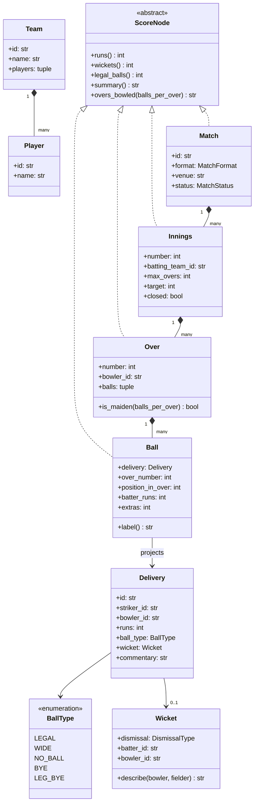
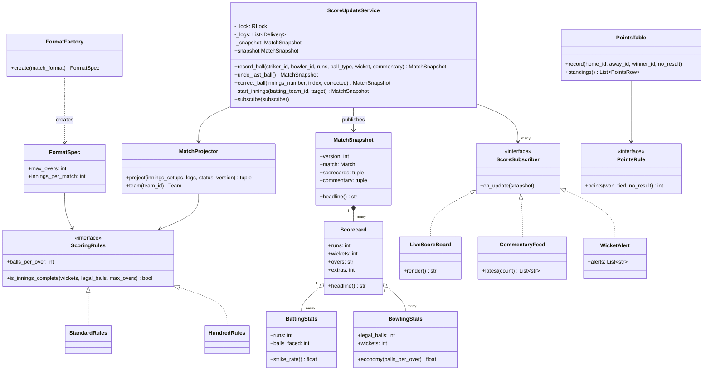
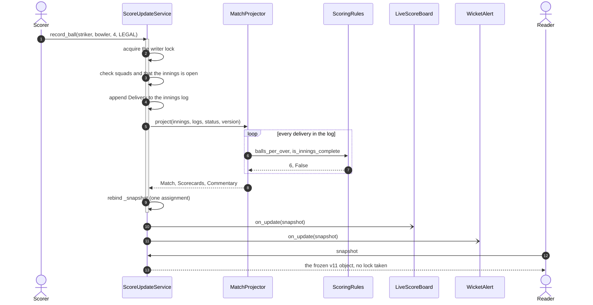
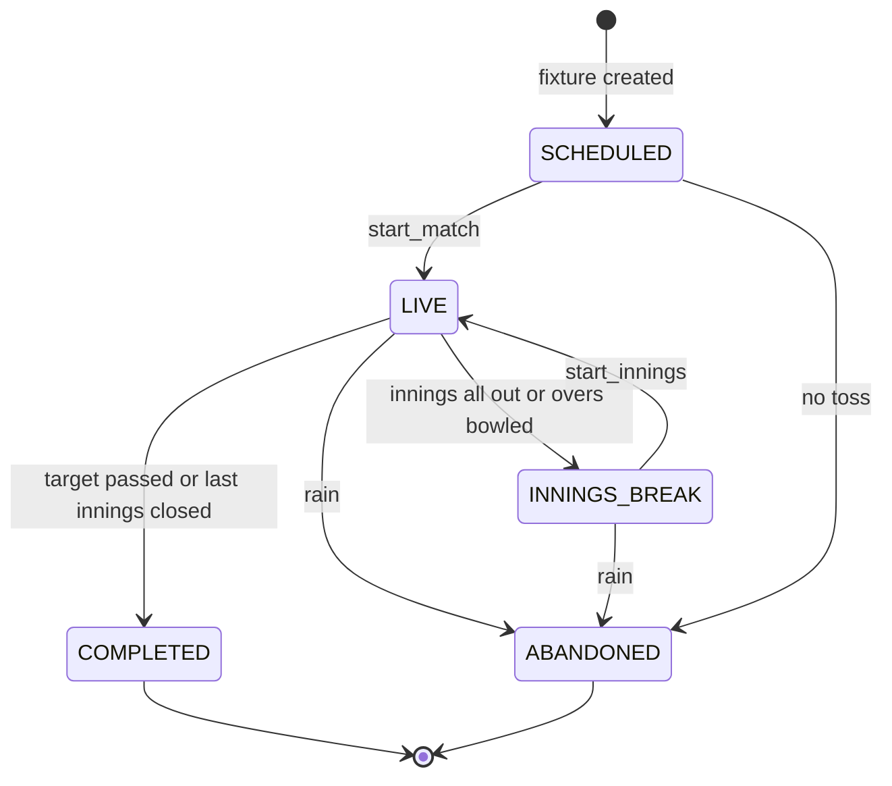

# Design Cricinfo (live scoreboard)

## TL;DR

- You build an append-only log of `Delivery` events, a pure `MatchProjector` that replays the log into an immutable match → innings → over → ball tree, and observers that push each new snapshot to scoreboards and commentary feeds.
- Three decisions carry the interview: **the event stores no position** (over and ball numbers are derived, so a correction can re-cut the overs), **corrections are replays, not inverses**, and **readers take no lock** because every publish is one rebind of an immutable snapshot.
- Composite, Observer and Factory earn their place. Command earns it too, in its event-sourced form — the log *is* the command history.

## Problem statement

"Design the software behind a live cricket scoreboard. A scorer at the ground enters every delivery: runs, extras, wickets. The site shows a live score, a full scorecard with batting and bowling figures, and ball-by-ball commentary, and it pushes updates to anyone watching. Scorers make mistakes and must be able to fix a ball they entered wrongly. Focus on the class model, the scoring flow, and what readers see while the scorer is editing."

## Requirements

**Functional**

- Matches with two teams, a venue, a format (T20, ODI, Test, The Hundred) and a status.
- Ball-by-ball scoring: runs off the bat, wides, no-balls, byes and leg byes, and wickets with a dismissal type, bowler and fielder.
- A composite score model: match holds innings, innings holds overs, an over holds balls, and every level answers runs, wickets and balls bowled.
- Batting figures (runs, balls faced, fours, sixes, dismissal) and bowling figures (overs, maidens, runs conceded, wickets), both derived, never typed in.
- Commentary attached to deliveries, and a live subscription so scoreboards and feeds are pushed to rather than polling.
- Corrections: undo the last ball, and fix a ball entered several deliveries ago.
- Match status through the innings break to a result; a tournament points table.

**Non-functional and constraints**

- A correction must never leave the scorecard half-updated, and a reader must never see a half-applied ball.
- Readers vastly outnumber the one scorer, so reads must not block on the write path.
- In-memory, single process; deterministic and testable with an injected clock and ID generator.

**Out of scope**: the transport that pushes updates to browsers (that is the HLD question), video, fantasy scoring, DRS, rain rules.

## Clarifying questions and assumptions

| Question to ask | Assumption taken here |
|---|---|
| Can the scorer edit a ball from ten deliveries ago? | Yes, and this is the whole design. `correct_ball(innings, index, delivery)` replaces one event and replays. |
| Does a wide count as a ball of the over? | No. Neither does a no-ball. That single rule is why over numbers cannot be stored on the event. |
| Who owns the runs on a leg bye? | Extras, not the batter, and the bowler is not charged. Each `BallType` answers those questions itself. |
| Are the scorecards stored or computed? | Computed, on every write. A T20 innings is ~130 events, so a full replay is microseconds; storage would be a second source of truth to keep in sync. |
| How many writers? | One scorer per match. The lock exists to make each write atomic, not to scale writes. |
| Do readers see the very latest ball? | They see the last published snapshot. It is always a whole ball behind at worst, never a torn one. |
| Do we model free hits and follow-ons? | Not now. `ScoringRules` is where they land, which is the answer that matters. |

## Core entities and relationships

- **Delivery** — the event the scorer types: striker, bowler, runs, `BallType`, an optional `Wicket`, commentary and a timestamp. It carries **no** over or ball number.
- **Ball** — the projection of one delivery: the same event plus where the replay decided it landed (over number, position in over, batter runs, extras). The leaf of the composite.
- **Over** `1 → *` balls, **Innings** `1 → *` overs, **Match** `1 → *` innings. All four implement `ScoreNode`, so `runs()`, `wickets()` and `legal_balls()` mean the same thing at every level.
- **BallType** — `LEGAL`, `WIDE`, `NO_BALL`, `BYE`, `LEG_BYE`, each answering five questions about itself (penalty, legal, faced, credits the batter, charges the bowler).
- **Team** `1 → *` **Player**; **Wicket** — dismissal type plus batter, bowler and fielder.
- **Scorecard** — one innings rendered: totals, extras, `BattingStats` per batter and `BowlingStats` per bowler.
- **MatchSnapshot** — a version number, the projected `Match`, the scorecards and the commentary, frozen. This is the only thing readers ever touch.
- **MatchProjector** — the pure replay. **ScoreUpdateService** — the log, the lock, the status machine and the observer fan-out.
- **ScoringRules** and **FormatSpec** / **FormatFactory** — how long an over is and when an innings ends. **PointsRule** and **PointsTable** — the tournament side.

## Class diagram

**The composite: one interface from a single ball up to the whole match.**



**The write path: one service, one pure projector, three subscribers, two strategies.**



## Design patterns applied

| Pattern | Where | Why it earns its place |
|---|---|---|
| Composite | `ScoreNode` → `Ball` / `Over` / `Innings` / `Match` | The scoreboard asks `runs()` of a match, an innings or a single ball with the same call. Rendering "15/1" needs no idea how deep it is standing. |
| Event sourcing + Command | `Delivery` log, `record_ball` / `undo_last_ball` / `correct_ball` | The log is the command history and the deliveries are the commands. Undo is "drop and replay", not an inverse — see the warning below for why that distinction is the whole problem. |
| Observer | `ScoreSubscriber` → `LiveScoreBoard`, `CommentaryFeed`, `WicketAlert` | The service pushes one immutable snapshot; a scoreboard, a filtering alert and a feed all consume it without the service knowing any of them exist. |
| Strategy | `ScoringRules`, `PointsRule` | `HundredRules` changes an over from six balls to five and the projector does not move a line. Test points and league points are one class each. |
| Factory Method | `FormatFactory.create` | A format is a registry entry mapping to overs, innings count and rules. Adding T10 is one row. |
| Template Method | `ScoreNode.summary` calling the three abstract methods | The shape of a score line is fixed in the base; every level supplies only the numbers. |
| Polymorphism over conditionals | `BallType` properties | `penalty`, `is_legal`, `is_faced`, `credits_batter`, `charges_bowler` live on the enum. The projector has no `if wide … elif no_ball …` ladder, which is exactly where hand-written scorers rot. |
| Immutable value objects | `Delivery`, `Ball`, `Scorecard`, `MatchSnapshot` | Frozen objects are what make lock-free reads correct. A reader holding an old snapshot can never be corrupted by the next ball. |

What was deliberately *not* used: a **reader-writer lock**. It is the textbook answer for "many readers, one writer", and it is worse here — readers would still block during a replay, and a replay after a correction is the longest write there is. Publishing an immutable snapshot by a single rebind gives readers zero contention and gives you snapshot isolation for free. Say that trade out loud.

## Key flows

**Record a ball: append, replay, publish, notify. Every write is the same four steps.**



**Match lifecycle.** `INNINGS_BREAK` exists so that "open the next innings" has one legal predecessor instead of a boolean scattered across the service.



## Implementation

Write the vocabulary first, because in cricket the vocabulary *is* the rules.

`BallType` carries five properties instead of five branches in the projector. This is the single highest-leverage decision in the file: every extras rule in the game is one of these five answers.

```python title="code/lld/cricinfo/models.py — the scoring vocabulary"
--8<-- "code/lld/cricinfo/models.py:enums"
```

Now the event. Read the docstring aloud in the interview — it explains why there is no `over_number` field:

```python title="code/lld/cricinfo/models.py — the delivery event"
--8<-- "code/lld/cricinfo/models.py:events"
```

The composite is four small classes over one abstract base. `Ball` is a frozen dataclass *and* a `ScoreNode`, which is what makes "sum the tree" a one-liner at each level:

```python title="code/lld/cricinfo/models.py — the composite score tree"
--8<-- "code/lld/cricinfo/models.py:composite"
```

The rules are a `Protocol` with two members. `HundredRules` differs from `StandardRules` by one integer, and that integer changes where every over boundary falls:

```python title="code/lld/cricinfo/strategies.py — scoring rules"
--8<-- "code/lld/cricinfo/strategies.py:rules"
```

The projector is the heart. It holds no state and no lock, which is the property that makes a replay trustworthy: given the same log it produces the same tree, every time.

```python title="code/lld/cricinfo/projector.py — the replay"
--8<-- "code/lld/cricinfo/projector.py:projector"
```

The service owns the log, the lock and the status machine. Look at `_publish`: build the new snapshot first, rebind last. That ordering is the whole reader story.

```python title="code/lld/cricinfo/services.py — the scorer's service"
--8<-- "code/lld/cricinfo/services.py:service"
```

The three subscribers show the range Observer covers: one keeps the latest, one keeps the projected tail, one fires on a condition.

```python title="code/lld/cricinfo/services.py — the live subscribers"
--8<-- "code/lld/cricinfo/services.py:subscribers"
```

Running `python -m lld.cricinfo.demo` scores an over, gets a ball wrong, and fixes it:

```text
live: [v10] India 15/1 (1.1 ov) (live)
overs hold [7, 1] deliveries; extras 3
commentary: ['1.4 over midwicket', '2.1 timber']
alerts: ['WICKET at 15/1 (1.1 ov)']
delivery 3 was entered as a wide; it was a legal ball edged for four
after replay: [v11] India 18/1 (1.2 ov) (live)
overs now hold [6, 2] deliveries; extras 2
the reader still holds v10: India 15/1 (1.1 ov)
bat: Rohit 5 (3b) b Cummins
bat: Kohli 11 (5b) not out
bowl: Starc 1.1-0-16-0
bowl: Cummins 0.1-0-0-1
undo the wicket: [v12] India 18/0 (1.1 ov) (live)
points: [('IND', 2), ('AUS', 0)]
```

The two lines that matter are `overs hold [7, 1]` and `overs now hold [6, 2]`. Correcting the third delivery from a wide to a legal ball made the over one delivery shorter, so the eighth delivery moved from over 1 into over 2, and the wicket's commentary line moved from `2.1` with it. No inverse operation can express that; only a replay can.

## Concurrency and edge cases

**Which lock protects what.** There is one lock and one lock-free path, and explaining why is the interview.

1. `ScoreUpdateService._lock` (an `RLock`) guards the delivery logs, the innings list, the status and the version counter. Every write takes it: `record_ball`, `undo_last_ball`, `correct_ball`, `start_innings`. It is an `RLock` because `record_ball` calls `_settle`, which may call `_close_innings`, all under the same lock.
2. Readers take **no** lock. `snapshot` returns whatever `self._snapshot` currently points at. Because the write path builds a completely new frozen object and then rebinds the attribute in one statement, a reader gets either the old score or the new one. There is no window in which it can see the runs updated but not the ball list, and a reader that keeps its snapshot for a whole render sees one consistent match, however many balls are scored underneath it.

That is a copy-on-write publish, and it beats a reader-writer lock here for a concrete reason: a correction replays the whole innings, so it is the slowest write in the system, and a reader-writer lock would make every reader wait for exactly that.

**Cost of the replay.** A T20 innings is about 130 deliveries; a full replay walks the log once and allocates a few hundred small objects, which is microseconds — the same order as the ~3 µs it takes to read 1 MB sequentially from memory. Rebuilding is cheaper than maintaining a second, patchable copy of the scorecard and keeping it consistent, and it is the only version that survives a correction.

**Correcting a mis-entered ball.** `correct_ball` replaces one event in place, keeping its id as the audit trail, then replays. Because over and ball positions are derived, a correction that changes legality re-cuts every later over. The test asserts exactly that: `[7, 1]` deliveries per over becomes `[6, 2]`. `undo_last_ball` is the same mechanism with a `pop`.

**Innings and match transitions.** After every write the service replays, asks the rules whether the innings is complete, and compares the total against the target. Passing a target ends the match mid-over; running out of wickets or overs ends the innings and moves to `INNINGS_BREAK`. The status is derived from the replay in *both* directions, which is the part candidates skip: undoing or correcting the ball that ended an innings reopens it, and a status that only ever moved forward would leave the match in a break over an innings the scorecard says is live. `undo_last_ball` therefore works during a break, because the ball a scorer most often needs back is exactly the one that closed the innings. `start_innings` demands `INNINGS_BREAK` for any innings after the first, so you cannot open a second innings while the first is live.

**Other edge cases handled**: wides and no-balls not advancing the over, byes and leg byes not charged to the bowler, a no-ball counting as a ball faced while a wide does not, run-outs not credited to the bowler, a batter who only appears as a run-out victim still getting a scorecard row, maidens counted only on complete overs with no charged runs, recording a ball for a player who is not in the squad, and recording after the match is over.

!!! warning "Common mistake"
    Implementing undo as an inverse: "subtract the runs, decrement the ball count". It passes the demo and it is wrong. Correcting a delivery can flip whether it was legal, which shifts every later ball into a different over, changes which bowler owns those overs, and changes whether an over was a maiden. Inverses cannot express a re-cut. Store events, derive positions, and replay.

## Extensibility and follow-ups

- **Free hits**: after a no-ball, the next legal delivery cannot dismiss the batter except by run-out. That is a rule about the *sequence*, which the projector already walks — add a flag it carries forward, and put the toggle on `ScoringRules`.
- **Follow-on and Test cricket**: `FormatSpec(TEST)` already declares four innings and no over limit. The follow-on is a condition checked in `_close_innings` on the first-innings lead.
- **Super overs**: a tied match starts a new `ScoreUpdateService` with a one-over `FormatSpec`. The service is one match, so a second match is a second object.
- **Snapshot diffs for the wire**: readers currently receive the whole snapshot. Since every snapshot carries a version, sending `(version, changed scorecard rows)` is a projection detail and no domain code changes.
- **Push at scale**: millions of concurrent viewers is the HLD question — WebSocket or SSE fan-out, regional edges and a pull-based fallback. See [Design a notification system](../../hld/case-studies/notification-system.md) for the delivery machinery.
- **Fantasy leagues**: another `ScoreSubscriber` that scores points per snapshot; the domain never learns fantasy exists.

!!! tip "Interview tip"
    When the interviewer says "the scorer entered the wrong ball", do not reach for a mutable `Ball` object. Ask one question — "can a correction change whether the ball was legal?" — and when the answer is yes, you have earned the event log. That single question is what separates a candidate who has modelled cricket from one who has modelled a spreadsheet.

## Tests

`tests/test_cricinfo.py` has 16 cases. The correction test is the one to walk through, because it asserts the over boundaries moved rather than just the total:

```python title="code/lld/cricinfo/tests/test_cricinfo.py — the correction"
--8<-- "code/lld/cricinfo/tests/test_cricinfo.py:correction"
```

The concurrency test runs scorers and readers through the same pool and checks that every snapshot a reader saw was internally whole:

```python title="code/lld/cricinfo/tests/test_cricinfo.py — readers and the scorer"
--8<-- "code/lld/cricinfo/tests/test_cricinfo.py:concurrency"
```

The rest cover: an over scored ball by ball with exact batting and bowling figures; all five ball types via `parametrize`, asserting who gets the runs and whether the over advanced; validation (unknown striker, a bowler from the wrong side, negative runs, opening a second innings too early); the full status walk from `SCHEDULED` to `COMPLETED` with a chased target; undo removing a wicket and its alert; undoing the ball that closed an innings reopening it, and a correction that turns the last legal ball into a wide doing the same; `HundredRules` cutting overs at five balls; and both points rules. Run them with `uv run pytest code/lld/cricinfo -q`.

## 45-minute pacing

| Minutes | What to do | What to say or write |
|---|---|---|
| 0–5 | Clarify | Can the scorer fix an old ball? Does a wide count towards the over? Are figures stored or derived? Out of scope: the push transport, DRS, rain rules. |
| 5–10 | Entities | Nouns: Match, Innings, Over, Ball, Delivery, Team, Player, Wicket. Note out loud that Delivery and Ball are different things and say why. |
| 10–16 | Class diagram | Draw `ScoreNode` and hang the four levels off it. Then the service, the projector and the subscribers. |
| 16–22 | Ball types | Write the `BallType` enum with its five properties. Say "this is where every extras rule lives, so the projector has no branches". |
| 22–32 | The write path | `record_ball`: lock, validate, append, replay, publish. Then `correct_ball`, and draw the `[7, 1] → [6, 2]` example on the board. |
| 32–38 | Readers | Immutable snapshot, one rebind, no reader lock. Contrast with a reader-writer lock and say why it loses. |
| 38–43 | Tests | The correction test's three assertions and the reader/scorer race. |
| 43–45 | Extensions | Free hits, follow-on, super over, and push at scale as the HLD hand-off. |

## Related

- [Composite](../patterns/composite.md) — `ScoreNode` from a single ball up to the match
- [Observer](../patterns/observer.md) — the snapshot fan-out to boards, feeds and alerts
- [Command](../patterns/command.md) — the delivery log as a command history, and why undo is a replay
- [Memento](../patterns/memento.md) — the snapshot-versus-log trade this page takes the other side of
- [Design a notification system](../../hld/case-studies/notification-system.md) — pushing those snapshots to millions of viewers
- [Design Stack Overflow](stack-overflow.md) — the same Observer shape without the replay problem
