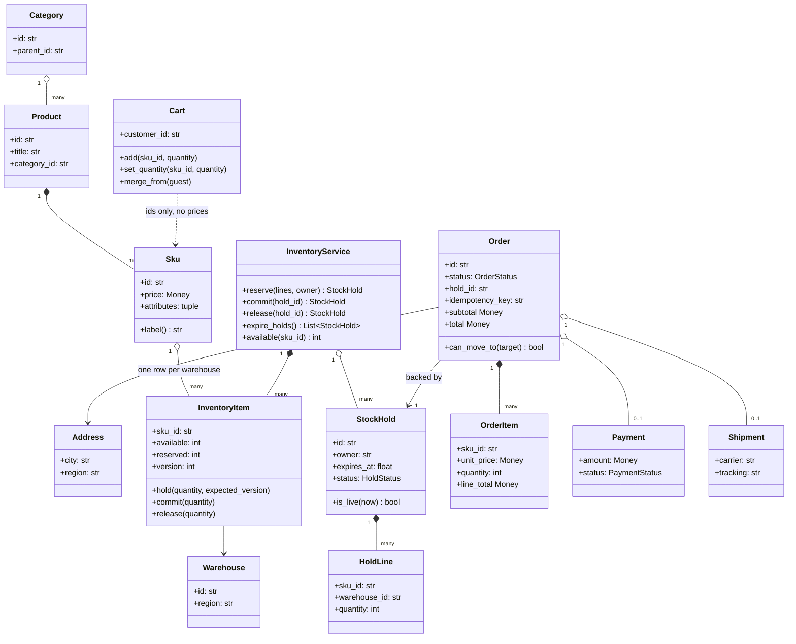
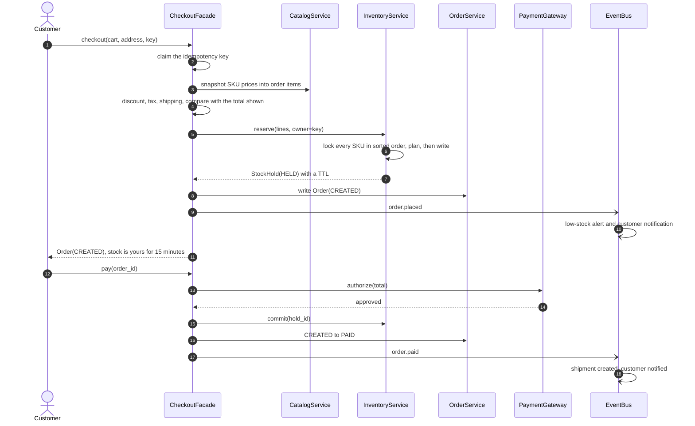
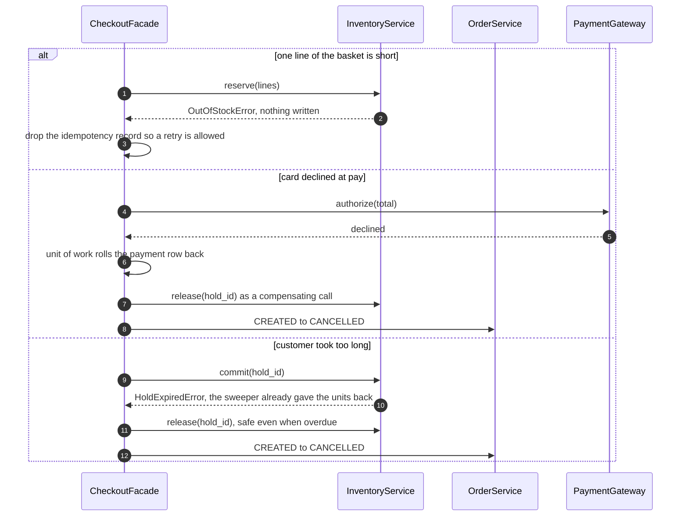
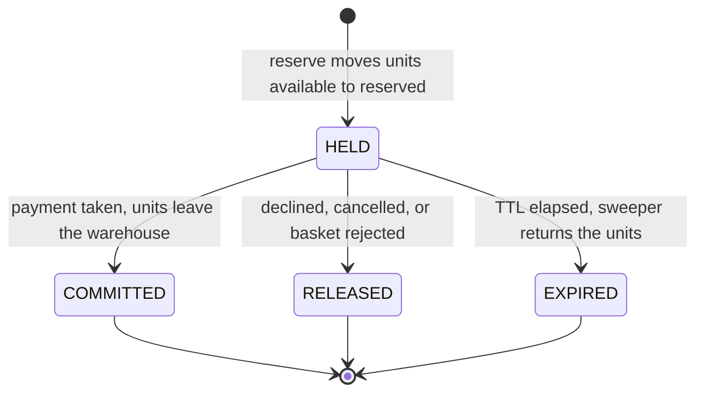
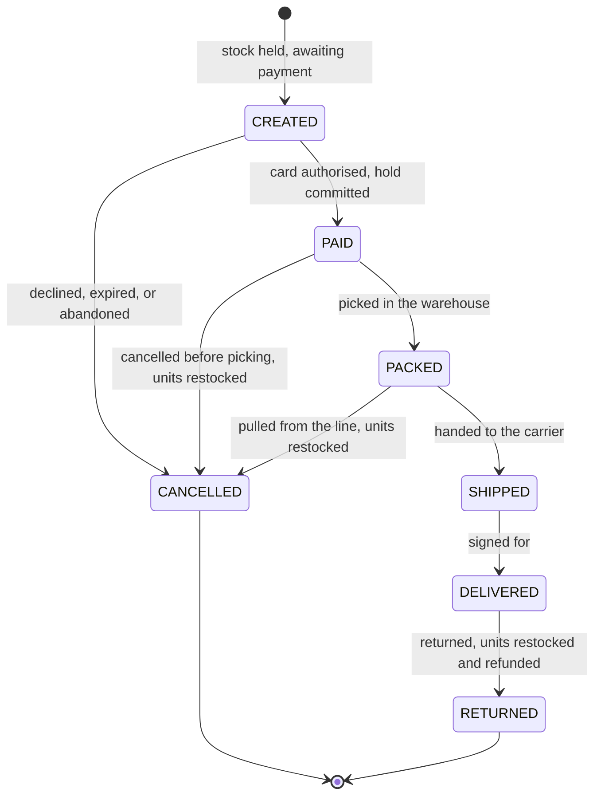

# Design Amazon (cart, order, inventory, payment)

## TL;DR

- You build the checkout core: a catalog you can filter, a cart with no prices in it, stock that is **reserved, then committed or released**, and an order that walks a state machine.
- Four decisions carry the interview: **one lock per SKU taken in sorted order** so a multi-item basket is all-or-nothing and cannot deadlock, a **TTL on every hold** so abandoned carts give stock back, an **idempotency key with in-progress and completed states** so a retried checkout never buys twice, and **compensate across services, roll back inside one**.
- Patterns that earn their place: Facade (`CheckoutFacade`), State (the order table), Strategy (discount, tax, shipping), Event Bus plus Observer, Repository and Unit of Work, Specification (catalog search), Null Object (`NoDiscount`).

## Problem statement

"Design the order and inventory core of a large online store. Customers browse a catalog, add items to a cart, and check out with an address and a card. You must never sell the same unit twice, even in a flash sale where thousands want the last dozen items. The order then moves through paid, packed, shipped and delivered, and can be cancelled or returned. Focus on the classes, the checkout flow, and what happens when two buyers race for the last unit or the same request arrives twice."

## Requirements

**Functional**

- Catalog of products, SKUs and categories, searchable by composable filters (in stock, under a price, by attribute).
- Cart: add, update quantity, remove; a guest cart merges into the customer's cart at sign-in.
- Inventory per SKU per warehouse, with `available` and `reserved` counters, reserve, commit, release and restock.
- Checkout: price the basket (discount, tax, shipping), hold the stock, create the order, then take payment.
- Order pricing through pluggable discount, tax and shipping rules.
- Order state machine: created, paid, packed, shipped, delivered, cancelled, returned.
- Low-stock alerts and restocking; order history per customer; notifications at each step.

**Non-functional and constraints**

- Never oversell: if twelve units exist, at most twelve orders can hold them, whatever the concurrency.
- A basket is all-or-nothing: a checkout that cannot get every line reserves nothing.
- A retried checkout request must not buy twice, and a concurrent duplicate must not race.
- Held stock must not be held forever: every hold has a deadline.
- In-memory and single-process; repositories are the seam where a database goes; time and IDs are injected.

**Out of scope**: search ranking and relevance, recommendations, the real payment gateway, warehouse picking optimisation, and cross-region replication.

## Clarifying questions and assumptions

| Question to ask | Assumption taken here |
|---|---|
| Is checkout one call or two? | Two: `checkout` holds stock and creates the order, `pay` takes the money. A customer sits on the payment page for minutes, and that gap is where the TTL, the abandoned cart and the hold-expiry race live. |
| Do we decrement stock at checkout or at payment? | Neither: we *move* it from `available` to `reserved` at checkout and out of both at payment. Two counters, not one, is what makes cancellation and expiry exact. |
| What if a basket has five lines and one is short? | Nothing is reserved. All-or-nothing, because a partly reserved basket is a state nobody wants to write compensation for. |
| Can one SKU come from two warehouses? | Yes. Allocation walks warehouses in a fixed order, which is also where a real system would put distance and cost. |
| What stops a bot parking all the stock in a cart? | The hold TTL, swept by a background job. Fifteen minutes here; a flash sale would use two. |
| Does the price in the cart bind us? | No. The cart holds ids and quantities; the order snapshots prices at checkout. The client may pass the total it displayed and get a conflict rather than a surprise charge. |
| Should reserving stock be an event? | No: it must be synchronous and ordered with the payment. Low-stock alerts, notifications and shipment creation go on the bus, because those you can retry. |

## Core entities and relationships

- **Sku** (frozen) is what you actually sell: a product plus variant attributes and a price. **Product** and **Category** organise them.
- **Cart** holds SKU ids and quantities for one customer or one guest — and no prices at all.
- **InventoryItem** is one SKU in one warehouse: `available`, `reserved`, and a `version` counter. It is the row a SQL `UPDATE ... WHERE version = ?` would target.
- **StockHold** is an all-or-nothing reservation across SKUs and warehouses, made of **HoldLine**s, with `expires_at` and a `HoldStatus`.
- **Order** owns immutable **OrderItem** price snapshots, the address, the three money components, the id of the hold that backs it, and its idempotency key.
- **InventoryService** owns every stock row and the per-SKU locks; **OrderService** owns the order repository and every transition; **CheckoutFacade** sequences them and owns the idempotency store.
- **EventBus** carries `order.placed`, `order.paid`, `order.shipped` and `order.cancelled` to **NotificationService**, **LowStockMonitor** and **ShipmentDispatcher**; **UnitOfWork** groups repository writes; **Specification** composes catalog filters.

Multiplicities: product `1 → *` SKUs, SKU `1 → *` inventory rows (one per warehouse), cart `1 → *` lines, order `1 → *` order items, order `1 → 1` hold, hold `1 → *` hold lines, order `1 → 0..1` payment and `1 → 0..1` shipment.

## Class diagram

**Domain: the catalog, the cart, and the two numbers that matter.**



**Services and patterns: one facade, three owners of state, and the rules you swap.**

```mermaid
classDiagram
    class CheckoutFacade {
        +checkout(cart_id, customer_id, ship_to, idempotency_key) Order
        +pay(order_id) Payment
        +cancel(order_id) Order
        +accept_return(order_id) Order
        +sweep_expired_holds() List~str~
    }
    class CheckoutRecord {
        +key: str
        +order_id: str
    }
    class CatalogService {
        +search(spec, category_id) List~Sku~
        +reprice(sku_id, price) Sku
    }
    class CartService {
        +open(customer_id) Cart
        +merge_guest_cart(guest_cart_id, customer_id) Cart
    }
    class OrderService {
        +transition(order_id, target) Order
        +history(customer_id) List~Order~
    }
    class InventoryService
    class Repository {
        <<interface>>
        +add(entity)
        +get(entity_id)
        +all() List~Any~
    }
    class InMemoryRepository
    class UnitOfWork {
        +commit()
        +rollback()
    }
    class EventBus {
        +subscribe(topic, handler)
        +publish(event) int
    }
    class NotificationService {
        +inbox(customer_id) List~str~
    }
    class LowStockMonitor {
        +alerts() List~str~
    }
    class ShipmentDispatcher {
        +shipment_for(order_id) Shipment
    }
    class DiscountStrategy {
        <<interface>>
        +discount(items) Money
    }
    class NoDiscount
    class PercentOff
    class TaxCalculator {
        <<interface>>
        +tax(taxable, ship_to) Money
    }
    class ShippingStrategy {
        <<interface>>
        +cost(items, ship_to, speed) Money
    }
    class PaymentGateway {
        <<interface>>
        +authorize(amount, reference) bool
        +capture(amount, reference) bool
    }
    class Specification {
        <<abstract>>
        +is_satisfied_by(sku, stock) bool
    }
    CheckoutFacade --> CatalogService
    CheckoutFacade --> CartService
    CheckoutFacade --> InventoryService
    CheckoutFacade --> OrderService
    CheckoutFacade --> UnitOfWork
    CheckoutFacade --> EventBus
    CheckoutFacade --> PaymentGateway
    CheckoutFacade "1" o-- "many" CheckoutRecord
    CheckoutFacade --> DiscountStrategy
    CheckoutFacade --> TaxCalculator
    CheckoutFacade --> ShippingStrategy
    Repository <|.. InMemoryRepository
    UnitOfWork o-- "many" InMemoryRepository
    OrderService --> InMemoryRepository
    CatalogService ..> Specification
    DiscountStrategy <|.. NoDiscount
    DiscountStrategy <|.. PercentOff
    EventBus --> NotificationService : notifies
    EventBus --> LowStockMonitor : notifies
    EventBus --> ShipmentDispatcher : notifies
```



## Design patterns applied

| Pattern | Where | Why it earns its place |
|---|---|---|
| Facade | `CheckoutFacade` | Checkout touches five collaborators in a fixed order, and getting that order right *is* the answer. One class owns it; the API layer owns none of it. |
| State (as a table) | `ORDER_TRANSITIONS` plus `OrderService.transition` | Seven statuses touched by customers, warehouse staff and a sweeper. One dict, one gate, and the state diagram below is a drawing of that dict. |
| Strategy | `DiscountStrategy`, `TaxCalculator`, `ShippingStrategy` | The three rules that change per country, per campaign and per carrier. `CheapestFreeInBundle` shows why `discount` takes the *lines* and not the total: a bundle rule cannot be computed from one number. |
| Event Bus + Observer | `EventBus` with three subscribers | Notifications, low-stock alerts and shipment creation are retryable and nobody is waiting on them, so they go on the bus. Reserving stock is neither, so it does not. That sentence is the whole test for "should this be an event?". |
| Repository + Unit of Work | `InMemoryRepository`, `UnitOfWork` | The persistence seam, and why a declined card leaves no payment row. It wraps `pay`, where two repositories change together — wrapping the single write in `checkout` would be theatre. |
| Specification | `InStock() & PriceBelow(...)` | Filters become named, testable objects that compose, instead of a `search()` signature that grows a keyword argument per release. |
| Null Object | `NoDiscount`, `ZeroTax` | Pricing never writes `if discount is None`. The default *is* an object. |
| Dependency Injection | `Clock`, `IdGenerator`, gateway, strategies | The tests advance a `FakeClock` by 61 seconds to expire a hold and use a declining gateway to prove the release path. No sleeps, no wall clock. |

What was deliberately *not* used: a **Factory** for orders (one construction path, so it adds a file and removes nothing) and **Command** for fulfilment (three one-line methods, and command objects buy undo you do not want — you cannot un-ship a parcel). Name both out loud: knowing which patterns to leave out is the same skill as knowing which to use.

## Key flows

**Checkout and payment: hold first, take money second, publish last.**



**The three ways it goes wrong, and what each one gives back.**



**Stock hold lifecycle.** Only `HELD` counts against `available`, and only one caller can move a hold out of it.



**Order lifecycle.** This is `ORDER_TRANSITIONS` drawn out; nothing else enforces it.



## Implementation

Write it in the order the interviewer wants: vocabulary and the transition table, then the inventory row, then the service that locks it, then the facade that sequences everything. `RESTOCK_ON_CANCEL_FROM` sits beside the enums because "when do units come back" is a business rule, not a service detail:

```python title="code/lld/ecommerce_order_inventory/models.py — statuses and the transition table"
--8<-- "code/lld/ecommerce_order_inventory/models.py:enums"
```

```python title="code/lld/ecommerce_order_inventory/models.py — errors"
--8<-- "code/lld/ecommerce_order_inventory/models.py:errors"
```

The catalog is ordinary; the line to point at is that `Cart` stores ids and quantities and never a price.

```python title="code/lld/ecommerce_order_inventory/models.py — catalog and cart"
--8<-- "code/lld/ecommerce_order_inventory/models.py:catalog"
```

`InventoryItem` is where the interview is won or lost. Two counters instead of one, and a `version` that is the row version a database would check:

```python title="code/lld/ecommerce_order_inventory/models.py — the inventory row and the hold"
--8<-- "code/lld/ecommerce_order_inventory/models.py:inventory_row"
```

`InventoryService` owns the locks. `reserve` plans every line first and writes only once all of them can be satisfied, holding every lock throughout.

```python title="code/lld/ecommerce_order_inventory/inventory.py — reserve, commit, release, expire"
--8<-- "code/lld/ecommerce_order_inventory/inventory.py:inventory"
```

The unit of work is what makes a declined card leave nothing behind. Its docstring is deliberate about what it does *not* do:

```python title="code/lld/ecommerce_order_inventory/repository.py — Repository and UnitOfWork"
--8<-- "code/lld/ecommerce_order_inventory/repository.py:repository"
```

Pricing rules are Strategies over the order *lines*, not over a total:

```python title="code/lld/ecommerce_order_inventory/strategies.py — discount, tax, shipping"
--8<-- "code/lld/ecommerce_order_inventory/strategies.py:pricing"
```

```python title="code/lld/ecommerce_order_inventory/strategies.py — Specification"
--8<-- "code/lld/ecommerce_order_inventory/strategies.py:specification"
```

The bus is dull on purpose, and its docstring names what is *not* allowed on it:

```python title="code/lld/ecommerce_order_inventory/events.py — EventBus"
--8<-- "code/lld/ecommerce_order_inventory/events.py:bus"
```

```python title="code/lld/ecommerce_order_inventory/events.py — the subscribers"
--8<-- "code/lld/ecommerce_order_inventory/events.py:subscribers"
```

The facade last. Every line of `checkout` and `pay` is about ordering and recovery:

```python title="code/lld/ecommerce_order_inventory/checkout.py — CheckoutFacade"
--8<-- "code/lld/ecommerce_order_inventory/checkout.py:checkout"
```

Running `python -m lld.ecommerce_order_inventory.demo` walks a multi-warehouse hold, a retry, an oversell rejection and an abandoned cart:

```text
search kitchen, in stock, under 50.00: ['sku-kettle', 'sku-mug']
kettle: 5 available across two warehouses
ORD-1 created: 175.00 USD - 15.00 USD + 32.00 USD tax + 0.00 USD ship = 192.00 USD
held ['2xkettle@w-east', '2xkettle@w-west', '2xmug@w-east']; kettles now 1 available, 4 reserved
retrying with key idem-1 returns ORD-1 again, not a second order
second buyer rejected: sku-kettle: short by 1 of 2
low-stock alerts raised on order.placed: [('sku-kettle', 1)]
PAY-1 captured 192.00 USD; kettles on hand 1
after the 15 min TTL the sweeper cancels ['ORD-2'], grinder back to 1
ORD-1 shipped via TRK-ORD-1
    cust-1: order ORD-1 received, total 192.00 USD
    cust-1: payment taken for ORD-1
    cust-1: ORD-1 is on its way, tracking TRK-ORD-1
```

## Concurrency and edge cases

**Which lock protects what.** Four, and no method holds two of the interesting ones at once:

1. `InventoryService._sku_locks[sku_id]` guards every warehouse row of that SKU: the oversell guard. One lock per SKU is the right granularity — a global lock puts every buyer behind whoever wants the popular item, and a lock per warehouse row makes a five-line basket take an unbounded set of locks in an order nobody has reasoned about.
2. `InventoryService._holds_lock` guards the hold registry and the status flip, which makes `commit`, `release` and `expire` mutually exclusive per hold.
3. `OrderService._lock` guards the order repository and every transition.
4. `CheckoutFacade._lock` guards the idempotency store, held just long enough to read and write one key.

**Why all-or-nothing works.** `reserve` takes every SKU lock it needs **in sorted id order**, then plans all lines, then writes. Two baskets holding the same pair of SKUs in opposite order still acquire them in the same order, so there is no lock cycle. Because the plan is computed while holding every lock, either all lines succeed or nothing is written — no partly reserved basket, so no compensation to design. The database version of that sentence is "one transaction, rows locked in primary-key order".

**Sizing it.** A store doing 2M orders a day averages 2,000,000 / 86,400 ≈ 23 orders/s, and roughly 70/s at the usual 3x peak — trivially served. A flash sale is what breaks you, because every attempt contends on *one* SKU lock. An uncontended lock is about 17 ns, so the lock is never the cost; the critical section is, and it is a handful of integer updates. The real constraint is downstream: a single relational primary sustains roughly 5k-20k writes/s in total, which is why the production answer for a flash sale is an atomic decrement in Redis (about 100k ops/s on one instance) with the relational row reconciled behind it.

**The reserve/commit/release cycle.** `available` and `reserved` are two numbers, not one: `reserve` moves units between them, `commit` removes reserved units for good, `release` puts them back. The invariant the tests assert is the sum — units physically on hand — which only changes when goods really move. Stating that invariant is the difference between a candidate who has decremented a counter and one who has run a warehouse.

**The TTL, and the one thing it blocks.** `expire_holds` returns the units of abandoned checkouts and `sweep_expired_holds` cancels the orders waiting on them. The deadline blocks exactly one operation — `commit` — because taking units the shop has already re-offered is the only unsafe thing an overdue hold can do. Releasing an overdue hold is always allowed, and that asymmetry is what lets `pay` recover when the sweeper won the race.

**The idempotency key.** `_claim_key` implements the two states a real idempotency record has. No order id means *in progress*, so a concurrent duplicate is rejected with `CheckoutInProgressError` rather than allowed to reserve a second basket. An order id means *completed*, so the original order is replayed. A failed attempt deletes its record so a genuine retry can proceed. Those three behaviours are what "idempotent" means on a write endpoint.

**Compensate across services, roll back inside one.** The unit of work rolls the order and payment repositories back together because they are the same store; inventory is a different service, so undoing a hold is a `release` call — a compensating action, which is a saga in two steps. The same reasoning governs publishing: events go out *after* the unit of work closes, because publishing inside it is how stores send "order received" emails for orders that never existed. A transactional outbox is the production form of that fix.

**Edge cases handled**: one line of a basket short, a SKU split across two warehouses, an empty cart, a guest cart merging into an existing one, a repriced SKU after the order was placed, a total that moved between cart and checkout, a declined card, a hold that expired before payment, cancelling before and after payment, a return, a stale row version, and a subscriber that throws.

!!! warning "Common mistake"
    Modelling stock as a single `quantity` integer and decrementing it at checkout. It looks simpler and it cannot answer any of the questions that follow: what happens when the payment fails, how do you know how much you could still sell, and what stops a bot holding your whole stock in a cart? Two counters plus a hold with a deadline answers all three, and it is the same shape as `SELECT ... FOR UPDATE` plus a reservations table, so it survives the move to a real database.

## Extensibility and follow-ups

- **Flash sales**: shorten the TTL to about two minutes and move the hot SKU's counter to an atomic decrement in a cache, reconciled behind. `InventoryService` keeps its interface; only four method bodies change.
- **Returns as a saga**: with a real gateway the refund is a network call that can fail, so `accept_return` becomes a compensating step with retries and a `RETURN_PENDING` status between `DELIVERED` and `RETURNED`.
- **Multi-warehouse allocation**: `_plan` walks warehouses in id order. Sorting by distance or cost is an `AllocationStrategy` injected into `InventoryService` — one interface, no other change.
- **Backorders**: a partly satisfiable basket fails today. Allowing it means a `promised_at` per hold line, an `AWAITING_STOCK` status, and a subscriber on the restock event that retries.
- **Persistence and scale**: `InMemoryRepository` becomes a SQL repository, `UnitOfWork.__enter__` becomes `BEGIN`, and the per-SKU lock becomes `SELECT ... FOR UPDATE` ordered by SKU id — or the optimistic `WHERE version = ?` the `version` field already anticipates. Beyond that it is a system design question, and the [HLD case study](../../hld/case-studies/ecommerce-platform.md) is this problem with those constraints.

!!! tip "Interview tip"
    When they say "now make sure we never oversell", do not reach for a lock immediately. Say the invariant first: "`available + reserved` is the physical stock and only changes when goods move; overselling means `available` went negative." Then choose the mechanism — a per-SKU lock here, `SELECT ... FOR UPDATE` in Postgres, an atomic decrement in Redis — and say why the granularity is a SKU. Stating the invariant before the mechanism is the single clearest senior signal in this problem.

## Tests

`tests/test_ecommerce_order_inventory.py` has 25 cases. The flagship is the oversell race: forty buyers, twelve units, sixteen threads, exactly twelve winners — plus the physical-stock invariant, which catches bugs the winner count alone would miss.

```python title="code/lld/ecommerce_order_inventory/tests/test_ecommerce_order_inventory.py — oversell and idempotency races"
--8<-- "code/lld/ecommerce_order_inventory/tests/test_ecommerce_order_inventory.py:oversell"
```

The second half of that snippet fires ten concurrent checkouts with the *same* idempotency key and asserts one order, one hold, and one answer shared by every caller that got one.

The rest cover: checkout to payment with the pricing arithmetic and a repricing the order ignores; all-or-nothing reserve leaving the other SKU untouched; a SKU split across warehouses; the TTL expiring and the sweeper cancelling the order; paying after expiry with no payment row; a declined card releasing the hold; the transition table; a return restocking and refunding; price drift rejected before anything is held; the guest-cart merge; composed specifications; a stale `version`; a throwing subscriber; and five discount strategies. Run them with `uv run pytest code/lld/ecommerce_order_inventory -q`.

## 45-minute pacing

| Minutes | What to do | What to say or write |
|---|---|---|
| 0–5 | Clarify | One checkout call or two? All-or-nothing baskets? Multi-warehouse? What happens on a retry? Out of scope: search ranking, recommendations, real gateway. |
| 5–10 | The invariant | Draw `available` and `reserved` as two boxes and the arrows between them: "physical stock is the sum, and it only changes when goods move". |
| 10–18 | Entities and class diagram | Sku, Cart with no prices, InventoryItem, StockHold with a TTL, Order with a snapshot. Then the facade over three services. |
| 18–34 | Code | `InventoryItem.hold` → `InventoryService.reserve` with sorted locks → `CheckoutFacade.checkout` → `pay` with the unit of work and the compensating release. |
| 34–40 | Concurrency | Per-SKU locks and why that granularity, the sorted order, the TTL asymmetry, and the idempotency record's two states. |
| 40–45 | Extensions | Flash sale with an atomic decrement, returns as a saga, allocation strategy, the outbox — then hand off to the HLD version. |

## Related

- [Design Amazon (e-commerce with inventory and flash sales)](../../hld/case-studies/ecommerce-platform.md) — the same checkout across services, queues and regions
- [Transactions, 2PC, sagas and idempotency](../../hld/fundamentals/transactions-and-distributed-transactions.md) — the database and saga forms of everything on this page
- [Facade](../patterns/facade.md) — why one class owns the order of operations
- [Event Bus](../patterns/event-bus.md) — topics, synchronous dispatch and handler isolation
- [Unit of Work](../patterns/unit-of-work.md) — grouping repository writes and what rollback cannot undo
- [Specification](../patterns/specification.md) — composable catalog filters
- Primary source: Stripe API documentation, "Idempotent requests" — the in-progress versus completed record this checkout implements
