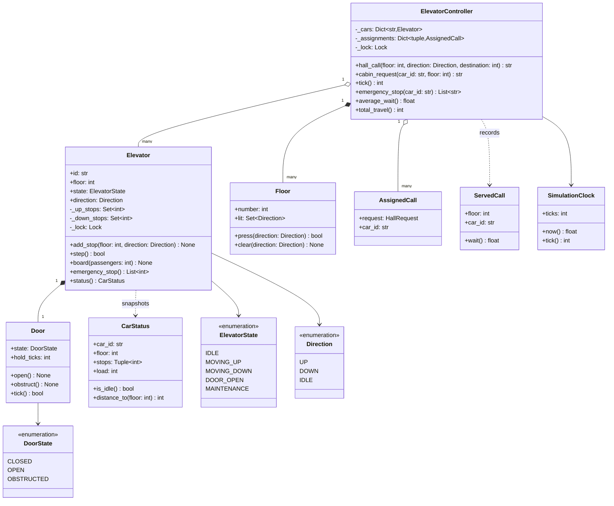
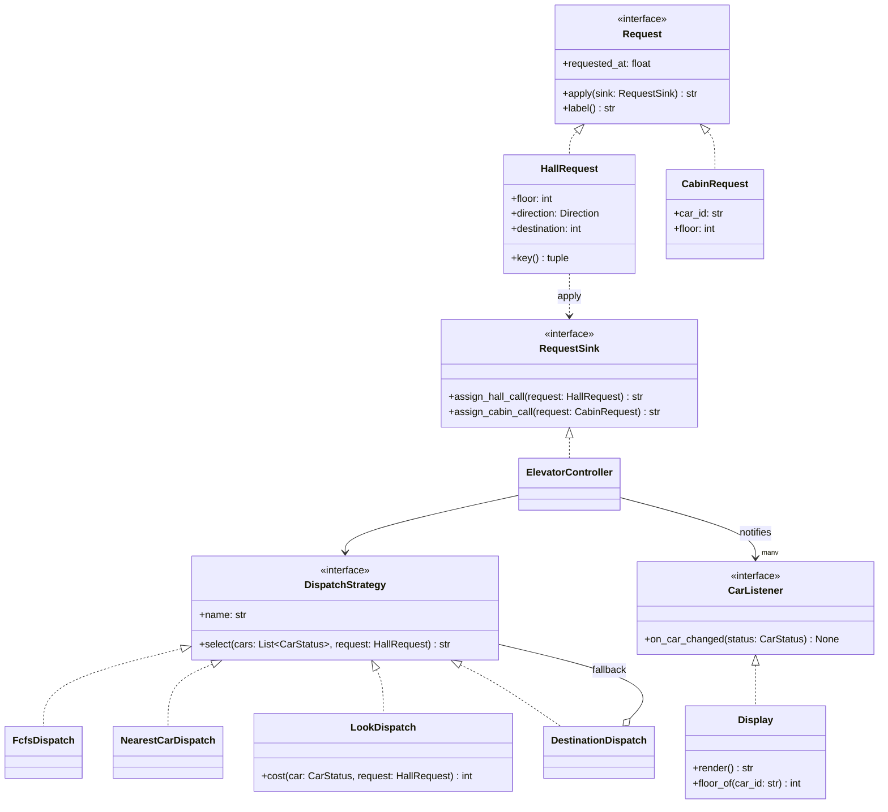
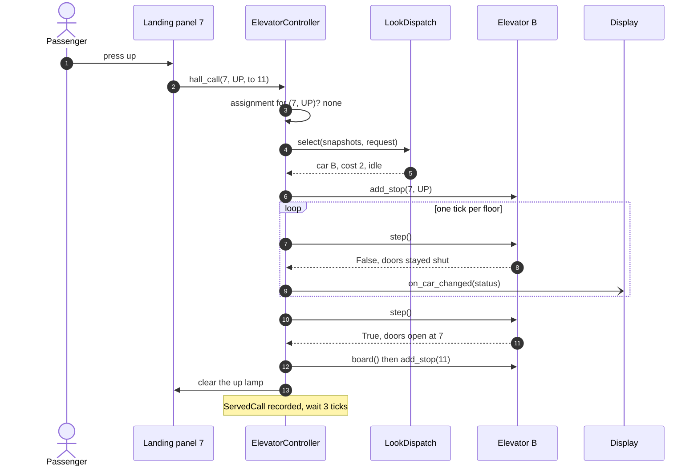
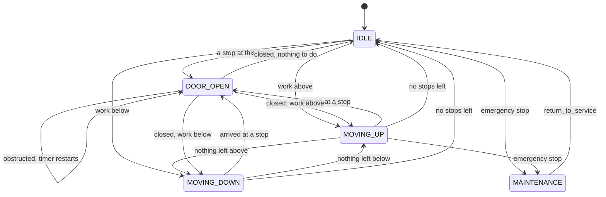

# Design an elevator system

## TL;DR

- You build a controller that receives hall calls, picks a car with a pluggable policy, and drives every car one tick at a time so the whole thing is deterministic and testable.
- Three decisions carry the interview: **the car owns its state machine** (five states, two stop sets), **the controller owns the conversation** (Mediator: landings and cars never address each other), and **dispatch is a Strategy** you can swap and measure.
- Patterns that earn their place: State, Strategy, Mediator, Command, Observer. Singleton is discussed and deliberately not used.

## Problem statement

"Design the software that runs a bank of elevators. A building has N cars and M floors. People press up or down at a landing and press a floor number inside a car; the system decides which car answers each landing call, moves the cars, opens and closes doors, and drives the indicator displays. Cars have a rated capacity, can be stopped in an emergency and taken into maintenance. Make the scheduling policy pluggable and show me how you would compare two policies."

## Requirements

**Functional**

- N cars serving M floors, each car starting wherever you place it.
- Hall calls (a floor plus a direction) and cabin requests (a floor pressed inside a car).
- A dispatcher selects the car that answers each hall call; a cabin request needs no decision.
- Movement one floor at a time, with doors that open, dwell and close, and a rated capacity per car.
- Emergency stop and maintenance mode: a car out of service takes no new stops, and the hall calls it still owed are re-dispatched.
- Direction and floor displays that update without polling the cars.
- Pluggable scheduling: FCFS, nearest-car, SCAN/LOOK and destination dispatch, comparable on the same workload.
- A tick-based simulation: no threads sleeping, no wall-clock time.

**Non-functional and constraints**

- Correct when calls arrive while cars are moving: the same landing button must never be assigned to two cars.
- Deterministic: identical inputs produce identical output, so a scheduling comparison means something.
- In-memory and single-process; the hardware (motors, sensors, door edges) sits behind method calls you could replace with a driver.

**Out of scope**: fire-service recall codes, physically accurate acceleration curves, building access control, the hardware bus.

## Clarifying questions and assumptions

| Question to ask | Assumption taken here |
|---|---|
| What is a tick worth? | One floor of travel, one step of the door timer, or one decision. An idle car spends its first tick choosing a direction, as a real one spends it closing up. |
| Can a landing button be pressed twice? | Yes, and the second press is absorbed: the lamp is already lit and the call already has a car. |
| Does the landing panel know where you are going? | Only in the destination-dispatch variant. `HallRequest.destination` is optional, so three of the four strategies ignore it. |
| What happens when the chosen car fills up? | The passenger stays on the landing and the call is re-dispatched; if every car is full, it is retried on the next tick. |
| Are hall calls and cabin requests the same thing? | Both are commands, but only a hall call needs a dispatch decision. A cabin request goes straight to the car that is already carrying you. |
| Does the interviewer want threads? | Assume the simulation is single-threaded but the API is not: calls can arrive from any thread, so state is locked. |

## Core entities and relationships

- **Elevator** — one car: current floor, `ElevatorState`, `Direction`, a `Door`, a load, and *two* stop sets (`_up_stops`, `_down_stops`). It owns the lock that makes its own state atomic and exposes an immutable `CarStatus` snapshot.
- **Door** — a dwell timer rather than a motor: `open` starts it, `tick` runs it down, an obstruction restarts it.
- **Floor** — a landing with two lamps. Pressing a lit lamp is absorbed here, so the controller never sees a duplicate.
- **ElevatorController** — the mediator: many cars, many landings, one assignment map, the event log, and the served-call statistics. Built once and injected; the demo builds three of them side by side.
- **HallRequest** / **CabinRequest** — button presses as command objects, each carrying the time it was made, so waiting time is measurable rather than guessed.
- **DispatchStrategy** — `FcfsDispatch`, `NearestCarDispatch`, `LookDispatch`, `DestinationDispatch`. Each scores `CarStatus` snapshots and names a car.
- **CarStatus** / **ServedCall** — immutable value objects: the first is what strategies and displays read, the second is one answered call with its wait.
- **Display** — an observer of car status; **SimulationClock** — the injected clock the whole package shares.

Multiplicities: controller `1 -> *` cars, controller `1 -> *` landings, car `1 -> 1` door, controller `1 -> *` assignments, one assignment `1 -> 1` car.

## Class diagram

**Structure: the controller, the cars it drives, and the value objects that cross between them.**



**Behaviour: presses as commands, dispatch as a strategy, displays as observers.**



## Design patterns applied

| Pattern | Where | Why it earns its place |
|---|---|---|
| [State](../patterns/state.md) | `ElevatorState` plus the guarded transitions in `Elevator.step` | Five statuses, and the same tick means something different in each. The enum-and-table form is the right one here: the transitions are one line each and the whole machine is nine lines you can read in the room. Classes per state would triple the code without adding a decision. |
| [Strategy](../patterns/strategy.md) | `DispatchStrategy` and its four implementations | "Now use nearest-car instead" is the follow-up you will be asked, and it is a constructor argument. Because strategies read immutable snapshots, they are pure functions and testable without a building. |
| [Mediator](../patterns/mediator.md) | `ElevatorController` | Landings and cars never reference each other. With N cars and M landings that is N + M edges through the controller instead of N x M between peers, and the dispatch policy lives in one object. |
| [Command](../patterns/command.md) | `HallRequest`, `CabinRequest` behind the `Request` protocol | A press becomes an object with a timestamp, so the controller can log it, replay it, and measure how long it waited. `submit` logs then delegates; the request itself decides which controller method runs. |
| [Observer](../patterns/observer.md) | `CarListener` and `Display` | Indicators subscribe; the controller pushes statuses after each tick, outside its lock. A second display is one more subscriber. |
| Dependency injection | `SimulationClock`, strategies, cars | Nothing calls the wall clock, so 90 ticks run in microseconds and every test is exact. |

What was deliberately *not* used: **Singleton** for the controller. A building genuinely has one controller, which is exactly why interviewers expect it — but the demo builds four controllers to compare four strategies, and every test builds its own. One instance created in `main` and injected gives you the same guarantee without the global.

## Key flows

**A hall call from press to answered, with the display updated on every tick.**



**The car's lifecycle. Every arrow is one branch of `step`; the maintenance arrows are the emergency stop.**



Two things to say while you draw it. First, `DOOR_OPEN --> DOOR_OPEN` is the obstruction: the door restarts its dwell timer instead of closing, which is why a car with someone standing in the doorway holds the floor forever and never loses its queue. Second, there is no arrow from `MOVING_UP` to `MOVING_UP`: staying in motion is the absence of a transition, so the diagram shows exactly the decisions the code makes.

## Implementation

Write it in the order the interviewer wants to see: vocabulary, then the presses, then the entities, then the policies, then the car, then the controller that ties them together.

The five car states and three door states are the whole design in one screen; `Direction.IDLE` is what a car reports when it has nothing to do, and keeping it in the same enum avoids a nullable field.

```python title="code/lld/elevator_system/models.py — enums"
--8<-- "code/lld/elevator_system/models.py:enums"
```

```python title="code/lld/elevator_system/models.py — errors"
--8<-- "code/lld/elevator_system/models.py:errors"
```

A press is a command object. `RequestSink` is the two-method view of the controller a request needs, which is how `models.py` stays free of any import from `services.py`, and `requested_at` is what later becomes a wait time.

```python title="code/lld/elevator_system/models.py — the presses"
--8<-- "code/lld/elevator_system/models.py:requests"
```

The door is a timer, the landing is two lamps, and `CarStatus` is the immutable snapshot every strategy and every display reads. Nothing here holds a lock, because nothing here is shared until a car or the controller owns it.

```python title="code/lld/elevator_system/models.py — entities and snapshots"
--8<-- "code/lld/elevator_system/models.py:entities"
```

Strategies take snapshots and return a car id, so they never touch a lock and never mutate anything. `_eligible` is the one rule they all share: a car in maintenance or already full cannot answer.

```python title="code/lld/elevator_system/strategies.py — the interface"
--8<-- "code/lld/elevator_system/strategies.py:protocol"
```

The two you write first are the two you then criticise. FCFS ignores geography; nearest-car ignores direction and will happily assign a car that is about to speed past you the other way.

```python title="code/lld/elevator_system/strategies.py — FCFS and nearest-car"
--8<-- "code/lld/elevator_system/strategies.py:simple"
```

LOOK is the one that earns the interview. Its cost function has three cases, and saying them out loud is the answer: on my way costs the distance, after my turn costs a shaft more, behind me costs two.

```python title="code/lld/elevator_system/strategies.py — LOOK and destination dispatch"
--8<-- "code/lld/elevator_system/strategies.py:look"
```

The clock is injected and discrete, which is what makes a 90-tick simulation exact and instant.

```python title="code/lld/elevator_system/services.py — the simulation clock"
--8<-- "code/lld/elevator_system/services.py:clock"
```

Now the car, which is big enough to deserve its own module. `step` is the whole state machine: run the door timer, or move one floor, then re-decide. `_resume` and `_stop_here` are the LOOK rule, and splitting the stops by service direction is what makes them short. Note that `step` returns whether the doors opened rather than leaving the controller to infer it — a car standing with its doors open can be given a stop at its own floor and close and reopen inside a single tick, and an edge detector on the status would miss that passenger forever.

```python title="code/lld/elevator_system/car.py — the car"
--8<-- "code/lld/elevator_system/car.py:car"
```

Displays subscribe and are pushed to; they never poll a car.

```python title="code/lld/elevator_system/services.py — displays"
--8<-- "code/lld/elevator_system/services.py:observer"
```

The controller is the mediator. `submit` is the Command invoker, `_assign_locked` is the dispatch decision, `tick` is the simulation, and `_on_arrival` is the part candidates forget: when the doors open, riders get out, the waiting passenger gets in and presses a floor, and only then is the call recorded as served.

```python title="code/lld/elevator_system/services.py — the controller"
--8<-- "code/lld/elevator_system/services.py:controller"
```

Running `python -m lld.elevator_system.demo` prints one narrated scenario and then replays a fixed eight-call workload against each strategy:

```text
--- three cars, twelve floors, LOOK dispatch ---
t0 A-0 | B-5 | C-11   waiting: none
hall call 7 up (to 11) -> car B
t1 A-0 | B^5 | C-11   waiting: 7^
t2 A-0 | B^6 | C-11   waiting: 7^
hall call 1 up (to 9)  -> car A
t3 A^0 | B^7 door | C-11   waiting: 1^
emergency stop A -> its hall calls move to ['C']
t4 A-0 door | B^7 door | Cv11   waiting: 1^
t5 A-0 door | B^7 | Cv10   waiting: 1^
served 7^ by B after 3 ticks
--- eight calls replayed against each strategy ---
fcfs         wait  8.38 ticks    49 floors travelled   8/8 served
nearest_car  wait  7.38 ticks    45 floors travelled   8/8 served
look         wait  7.00 ticks    32 floors travelled   8/8 served
destination  wait  4.62 ticks    28 floors travelled   8/8 served
```

That table is the reason the clock is injected. FCFS is worst on both measures; nearest-car buys a shorter wait by dragging cars off their runs, which costs floors; LOOK travels 32 floors instead of 45 for a shorter wait than either; destination dispatch wins because it can put two passengers heading to floor 11 in the same car. Say out loud that the ranking is workload-dependent — on a light load with idle cars, nearest-car is hard to beat, and the honest claim is "here is the harness, here are two metrics, run your traffic through it".

## Concurrency and edge cases

**Which lock protects what.** There are two levels and one rule.

1. `Elevator._lock` guards that car's floor, state, direction, door, load and both stop sets. Every public method takes it; the private helpers (`_resume`, `_stop_here`, `_next_direction`) assume it is already held and never take it again. A call arriving mid-move therefore lands in `_up_stops` between two ticks, never during one.
2. `ElevatorController._lock` guards the assignment map, the landing lamps, the deferred queue, the rider counts, the event log and the served-call list. Dispatch reads snapshots and writes the assignment under it, so two threads pressing the same button produce one assignment and one car.

**The rule** is that the controller lock is always taken before a car lock, never the reverse: a car never calls back into the controller, it only returns values from `step` and `status`. That single direction is what makes the ordering trivially safe. An uncontended lock costs about 17 ns (see the [latency numbers](../../cheatsheets/latency-and-estimation.md)), so a bank of eight cars pays roughly 8 x 17 ns per tick for locking — nothing next to any real work, which is why per-car granularity is the right trade here rather than one lock over the whole bank.

**The duplicate press.** `_assign_locked` checks the assignment map first and returns the existing car; the lamp is idempotent. The concurrency test presses eight buttons five times each from eight threads and asserts that no button was ever answered by two different cars and that no floor is queued in two cars.

**SCAN starvation.** `_next_direction` keeps a car going while any stop remains ahead, so a steady stream of upward calls can strand a down call at the bottom. Name it as a known property of LOOK, then offer the fix: age each assignment and let the controller re-dispatch (or force a turnaround) once a call has waited more than a threshold, which is a change to the controller rather than the car.

**Capacity overflow.** When the doors open and the car is full, the passenger cannot board, so the call is re-dispatched to a car with room; if there is none, it goes on `_deferred` and is retried at the start of the next tick. That path is tested with a car of capacity 1.

**Other edges handled**: doors obstructed indefinitely (the dwell timer restarts and the car holds the floor); a stop added at the floor the car is already standing on; an emergency stop that re-homes the hall calls the car owed while dropping the cabin requests of passengers who are getting out; floors outside the building rejected with a validation error; every car in maintenance rejected with `NoCarAvailableError`.

!!! warning "Common mistake"
    Modelling the queue as one sorted list of floors. It reads well for thirty seconds and then cannot express "stop at 5 on the way up but not on the way down", which is the entire point of a hall call having a direction. Two sets — one served going up, one going down — make LOOK three lines and make the diagram honest.

## Extensibility and follow-ups

- **Compare policies on real traffic**: already built. `replay` runs a fixed workload and reports average wait and floors travelled; feed it a seeded random workload for a bigger sample.
- **Zoning and express cars**: a `ZonedDispatch` that filters the snapshots to the cars serving the requested floor's zone and delegates to any inner strategy — the same composition `DestinationDispatch` already uses for its fallback.
- **Power failure or fire recall**: a mode on the controller that cancels all assignments, sends every car to a designated floor, and refuses new calls; the car needs no change because `emergency_stop` already returns the stops it dropped.
- **Elevator groups across buildings**: several controllers behind a facade that routes a call to a group first. This is where the conversation turns into a distributed-systems question — telemetry, per-group health, and a supervisor that reassigns when a group stops answering.
- **Real hardware**: `Elevator` becomes an interface with a simulated and a driver-backed implementation; the tick becomes the driver's position callback. Nothing in the controller changes, which is the point of it never having read a car's fields directly.

!!! tip "Interview tip"
    When you are asked "which scheduling algorithm would you use?", do not pick one. Say "I would make it a strategy and measure": name FCFS, nearest-car, LOOK and destination dispatch, describe the two metrics that matter (wait to pick-up and floors travelled), and point at the seam where a new one plugs in. Then give your default, which is LOOK, and why.

## Tests

`tests/test_elevator_system.py` has 18 cases covering the happy path, validation, the state machine, both concurrency invariants and the awkward edges. The two worth walking through in the room are the LOOK sweep and the concurrent presses:

```python title="code/lld/elevator_system/tests/test_elevator_system.py — the LOOK sweep"
--8<-- "code/lld/elevator_system/tests/test_elevator_system.py:sweep"
```

```python title="code/lld/elevator_system/tests/test_elevator_system.py — concurrent presses"
--8<-- "code/lld/elevator_system/tests/test_elevator_system.py:concurrency"
```

The rest cover: a hall call served end to end with the passenger boarding and pressing a destination; floors outside the building rejected; the exact six-tick state sequence of one car; a duplicate press producing one served call; an emergency stop re-homing the call it owed; every car in maintenance; an obstructed door holding the floor and then releasing it; a full car handing its passenger back to the bank; boarding over the rated load; three strategies picking three different cars, destination dispatch grouping two passengers bound for the same floor, and the display following every car without polling. Run them with `uv run pytest code/lld/elevator_system -q`.

## 45-minute pacing

| Minutes | What to do | What to say or write |
|---|---|---|
| 0-5 | Clarify | What is a tick? Do landings know the destination? Capacity, emergency stop, maintenance? Out of scope: fire recall, hardware bus. |
| 5-10 | Entities | Nouns on the board: Controller, Elevator, Door, Floor, HallRequest, CabinRequest, Display. Verbs become methods: `hall_call`, `step`, `add_stop`, `select`. |
| 10-16 | Diagrams | Draw the five-state machine first, then the class diagram around it. Mark the two locks while you draw. |
| 16-34 | Code | Enums, then `HallRequest`, then `Elevator.step` and `_resume`, then `ElevatorController.tick` and `_assign_locked`. Say "two stop sets" when you write them. |
| 34-40 | Concurrency and dispatch | The controller-then-car lock order, the duplicate press, the full car. Then the four strategies and the two metrics you would compare them on. |
| 40-45 | Extensions | Zoning, aging to kill starvation, hardware behind the same interface, groups as the hand-off to a system-design question. |

## Related

- [State](../patterns/state.md) — the enum-and-table form used for `ElevatorState`
- [Strategy](../patterns/strategy.md) — the four dispatch policies
- [Mediator](../patterns/mediator.md) — the controller, and a smaller version of this same example
- [Command](../patterns/command.md) — presses as objects with a timestamp
- [Concurrency for LLD in Python](../fundamentals/concurrency-for-lld.md) — lock ordering and granularity
- [Mock LLD interview: elevator system](../../mocks/mock-lld-elevator.md) — the same problem as a 45-minute transcript
