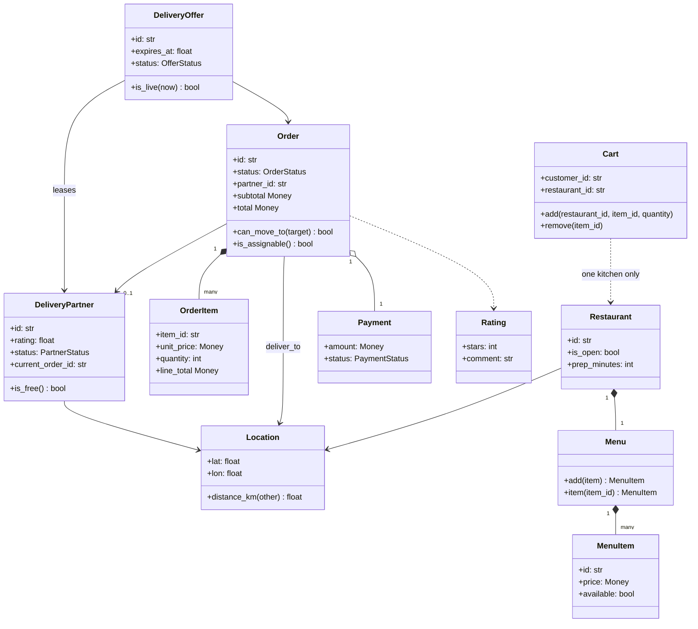
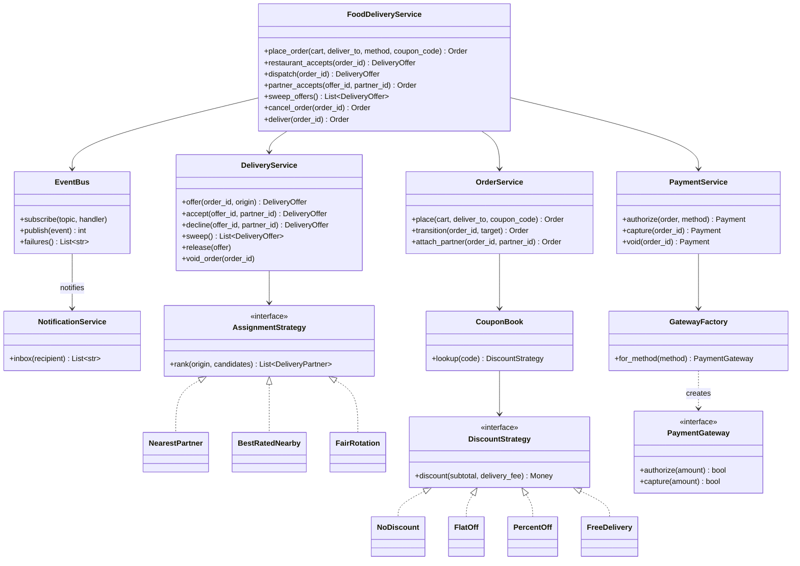
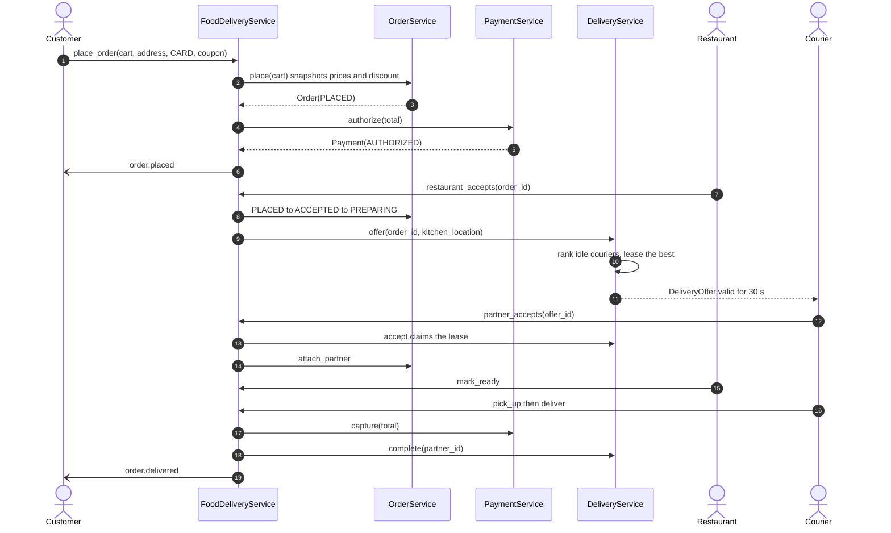
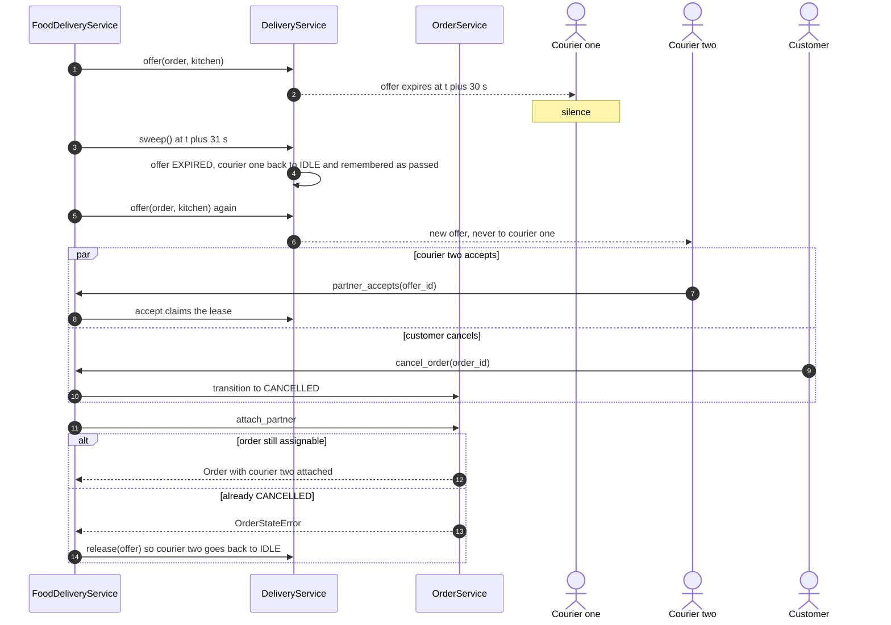
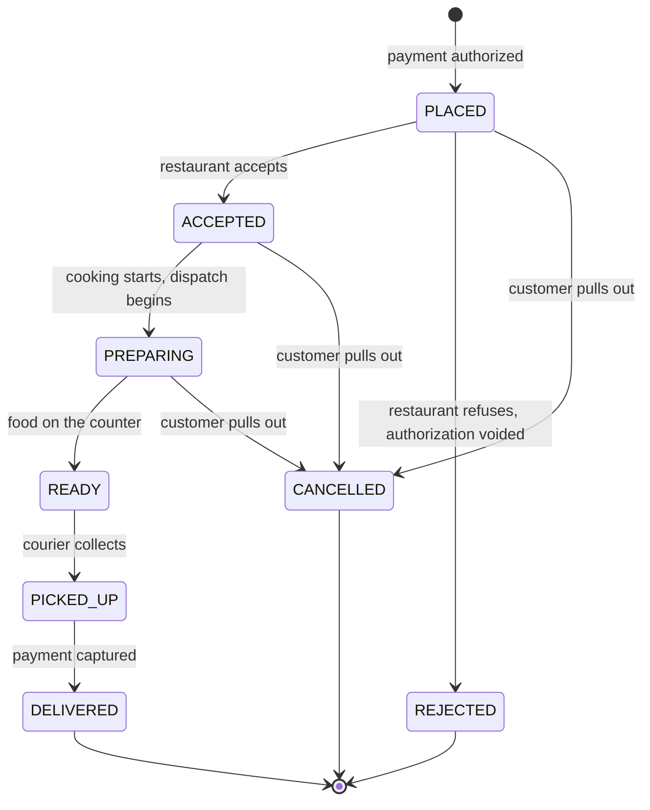
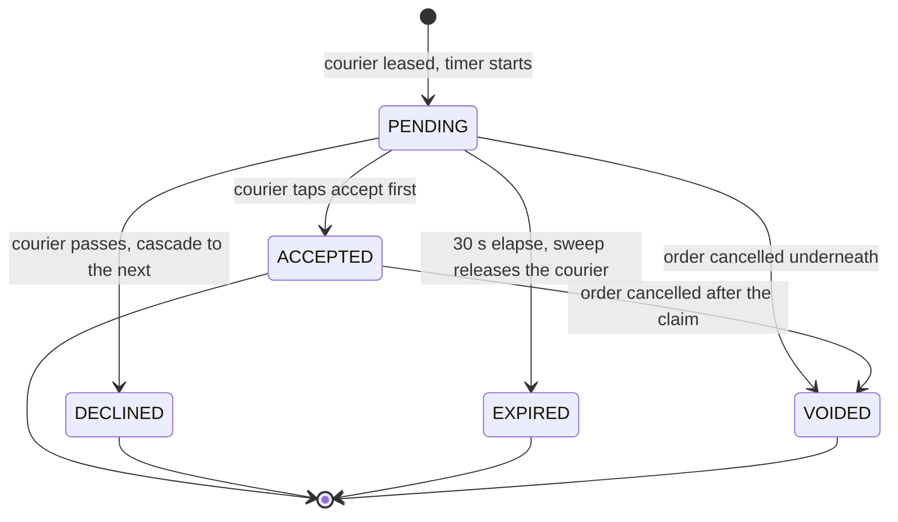

# Design a food delivery system (Swiggy, Zomato, DoorDash)

## TL;DR

- You build the three-sided flow: a customer orders, a restaurant accepts and cooks, a courier is offered the job and delivers it.
- Three decisions carry the interview: an **order transition table** as the single gate on state, a courier offer that is a **time-boxed lease** (so nobody is double-assigned and a silent courier does not stall the order), and **claim-then-act-then-revert** across two services so the cancel-versus-accept race has exactly one safe outcome.
- Patterns that earn their place: State (the table), Strategy (courier ranking, coupons), Event Bus plus Observer (notifications), Facade (`FoodDeliveryService`), Factory (payment gateways), Null Object (no coupon).

## Problem statement

"Design a food delivery platform. Customers browse nearby restaurants, build a cart and place an order. The restaurant accepts or rejects it and cooks. A delivery partner is offered the job, accepts, collects the food and delivers it. You take payment, apply coupons, notify all three parties and collect ratings. Focus on the order lifecycle, how a partner gets assigned, and what happens when two things happen at once — two dispatchers picking the same courier, or a customer cancelling while a courier is accepting."

## Requirements

**Functional**

- Browse open restaurants near a location, with menus and per-item availability.
- A cart holds items from one restaurant; checkout snapshots prices into the order.
- Coupons: flat off above a minimum spend, capped percentage off, free delivery.
- Payment is authorized at checkout and captured on delivery; a rejection or cancellation voids the authorization.
- The restaurant accepts or rejects, prepares, and marks the food ready.
- A delivery partner is offered the order by a pluggable strategy, and may accept, decline or time out.
- The order walks a state machine from placed to delivered, with cancellation and rejection as terminal branches.
- Notifications to the customer, the restaurant and the partner at every step; ratings after delivery.

**Non-functional and constraints**

- A courier is never assigned two orders at once, no matter how many dispatchers run.
- An order never sits waiting on a courier who closed the app: every offer expires.
- A cancelled order never leaves a courier believing they are still delivering it.
- In-memory and single-process; the clock and ID generators are injected so every test is deterministic.

**Out of scope**: real-time GPS tracking on a map, courier batching, surge pricing, restaurant onboarding, and the search index behind "browse".

## Clarifying questions and assumptions

| Question to ask | Assumption taken here |
|---|---|
| When is the courier assigned — at order time or when the food is ready? | While it cooks. Dispatch starts the moment the restaurant accepts, so the courier arrives as the food does. That is the DoorDash answer and it changes the state machine. |
| Can the customer cancel after a courier accepts? | Yes, until the food is picked up. That is what makes the cancel-versus-accept race real rather than theoretical. |
| Do we charge at checkout or at delivery? | Authorize at checkout, capture on delivery. Two calls, because food can fail to arrive. |
| What happens if a courier ignores the offer? | It expires after 30 seconds and cascades to the next candidate, who is never the one who just passed. |
| Can a cart mix restaurants? | No. One cart, one kitchen — the validation lives in `Cart.add`. |
| Are menu prices allowed to move between browsing and checkout? | Yes, so the order stores an `OrderItem` price snapshot. The customer pays what they saw. |
| How is "nearby" computed? | Straight-line distance inside one city. Swapping in a geospatial index changes one strategy class, nothing else. |

## Core entities and relationships

- **Restaurant** owns one **Menu** of **MenuItem**s, each with a price and an availability flag. One restaurant, many menu items.
- **Cart** holds item ids and quantities for exactly one restaurant. It stores no prices — that is the point.
- **Order** owns an immutable tuple of **OrderItem** price snapshots, a delivery `Location`, a fee, a discount and an `OrderStatus`. One order, one restaurant, at most one courier.
- **DeliveryPartner** — id, live location, rating, `PartnerStatus`, and the order they currently hold.
- **DeliveryOffer** — the lease: order, partner, `created_at`, `expires_at`, `OfferStatus`. At most one live offer names a given courier.
- **OrderService** owns the order registry and every transition; **DeliveryService** owns courier state and offers; **PaymentService** owns authorizations.
- **FoodDeliveryService** is the facade that sequences those three and publishes to the **EventBus**, which **NotificationService** observes.
- **AssignmentStrategy** (`NearestPartner`, `BestRatedNearby`, `FairRotation`) and **DiscountStrategy** (`FlatOff`, `PercentOff`, `FreeDelivery`, `NoDiscount`) are the two policies you will be asked to change.

Multiplicities: restaurant `1 → *` menu items, order `1 → *` order items, order `1 → *` offers over its life but `0..1` live at a time, courier `1 → 0..1` live offer, order `0..1 → 1` courier.

## Class diagram

**Domain: what an order is made of, and who can carry it.**



**Services and policies: three owners of state, one facade, two pluggable rules.**



## Design patterns applied

| Pattern | Where | Why it earns its place |
|---|---|---|
| State (as a table) | `ORDER_TRANSITIONS` plus `OrderService.transition` | Eight statuses and four actors. One dict is the whole machine, every service asks it, and the state diagram below is literally a drawing of that dict. Full State classes would be eight files with no behaviour in them. |
| Strategy | `AssignmentStrategy`, `DiscountStrategy` | The two rules the interviewer will change: "now rank by rating", "now add free delivery over 500". A strategy only *ranks* or *computes* — never mutates, never locks — so swapping one cannot introduce a race. |
| Event Bus + Observer | `EventBus`, `NotificationService` | `OrderService` must not import a push-notification client. It publishes `order.assigned`; whoever cares subscribes. Handlers run outside the bus lock and a failing handler is logged, not propagated: an order does not roll back because a push timed out. |
| Facade | `FoodDeliveryService` | The API layer gets eight verbs and never touches a lock. It is also the only place that knows the *order* of the three services. |
| Factory Method | `GatewayFactory.for_method` | Checkout carries the string `"wallet"`. A registry maps it to a gateway; cash-on-delivery is a class, not an `if`. |
| Null Object | `NoDiscount` | `CouponBook.lookup(None)` returns an object, so pricing has no `if coupon is None` branch. An *unknown* code still raises — absent and invalid are different things. |
| Dependency Injection | `Clock`, `IdGenerator`, strategies, gateways | Tests freeze the clock at 2026-02-25, advance it 31 seconds and watch an offer expire, with no sleeps anywhere. |

What was deliberately *not* used: **Command** for the dispatch cascade, and a **Repository** per entity. Command would let you queue and retry offers, and you should mention it as the natural next step when dispatch moves onto a worker pool — but here the cascade is three lines inside `sweep_offers`, and wrapping it in objects buys nothing today. Repositories are the persistence seam; say "each service holds a dict and would hold a repository protocol instead", then move on.

## Key flows

**The happy path: three actors, three services, one facade sequencing them.**



**The two races. Left: the lease times out and cascades. Right: a cancel lands while a courier accepts.**



**Order lifecycle.** This diagram is `ORDER_TRANSITIONS` drawn out; the table in `models.py` is the only thing that enforces it.



**Offer lifecycle.** Only `PENDING` is live, and only one caller can move an offer out of it — that single transition is what makes double assignment impossible.



## Implementation

The order in the room: the vocabulary and the transition table first, because everything else asks it questions; then the catalog and the order; then the two policies; then the three services and the facade.

The enums plus two frozen sets *are* the state machine. Putting `ORDER_TRANSITIONS` in `models.py` rather than inside a service is deliberate — it is a business rule, and three different callers need the same answer:

```python title="code/lld/food_delivery/models.py — statuses and the transition table"
--8<-- "code/lld/food_delivery/models.py:enums"
```

```python title="code/lld/food_delivery/models.py — errors"
--8<-- "code/lld/food_delivery/models.py:errors"
```

The catalog is unremarkable except for one line: `Cart` stores item ids and quantities and no prices at all. Prices are resolved once, at checkout, into immutable `OrderItem`s:

```python title="code/lld/food_delivery/models.py — catalog and cart"
--8<-- "code/lld/food_delivery/models.py:catalog"
```

`DeliveryOffer.is_live` is the smallest method on the page and the most important one: an offer is usable only while it is `PENDING` *and* inside its window.

```python title="code/lld/food_delivery/models.py — order, courier, offer"
--8<-- "code/lld/food_delivery/models.py:order"
```

Assignment strategies rank and nothing else. Notice that none of them touches a lock or mutates a courier — that is enforced by giving them a read-only `Sequence`:

```python title="code/lld/food_delivery/strategies.py — courier ranking"
--8<-- "code/lld/food_delivery/strategies.py:assignment"
```

```python title="code/lld/food_delivery/strategies.py — coupons, with a Null Object default"
--8<-- "code/lld/food_delivery/strategies.py:discount"
```

`OrderService` owns one lock and every transition. `transition` raises rather than returning `False`: a caller that tried an illegal move has a bug, and silence would hide it.

```python title="code/lld/food_delivery/services.py — OrderService"
--8<-- "code/lld/food_delivery/services.py:orders"
```

`DeliveryService` is where the lease lives. `offer` flips a courier from `IDLE` to `OFFERED` *inside* the lock, which is the entire double-assignment defence; `_retire` is the one place a courier is freed, so the three ways an offer can die share their cleanup:

```python title="code/lld/food_delivery/services.py — DeliveryService and the lease"
--8<-- "code/lld/food_delivery/services.py:dispatch"
```

The bus is deliberately dull: subscribers under the lock, handlers outside it, failures recorded rather than raised.

```python title="code/lld/food_delivery/messaging.py — EventBus"
--8<-- "code/lld/food_delivery/messaging.py:bus"
```

The facade sequences and never computes. Every cross-service step is claim, act, revert on failure — `partner_accepts` is the canonical example:

```python title="code/lld/food_delivery/facade.py — FoodDeliveryService"
--8<-- "code/lld/food_delivery/facade.py:facade"
```

Running `python -m lld.food_delivery.demo` walks a timeout, a decline and a delivery:

```text
open near home: ['Curry Corner']
O-1 placed: subtotal 19.00 USD, SAVE10 -1.90 USD, fee 2.50 USD, total 19.60 USD
O-1 accepted and cooking; OF-1 offered to p1 until +30 s
OF-1 expired (expired); p1 is idle again
cascaded to p2, who declines
cascaded again to p3, who accepts
O-1 delivered by p3; payment captured 19.60 USD
p3 rating is now 4.84
    customer: we sent O-1 to r1
    customer: r1 is cooking O-1
    customer: p3 is bringing O-1
    customer: O-1 is on the counter
    customer: p3 picked up O-1
    customer: O-1 delivered by p3
```

## Concurrency and edge cases

**Which lock protects what.** Three, and no method ever holds two of them:

1. `OrderService._lock` guards the order registry and every status change. `transition` and `attach_partner` are check-and-flip: two callers cannot both move an order out of `PREPARING`, and a courier cannot be attached to an order that is no longer assignable.
2. `DeliveryService._lock` guards courier statuses, the offer registry and the per-order set of couriers who already passed. `offer` reads the idle set, ranks it and flips the winner to `OFFERED` in one critical section.
3. `PaymentService._lock` guards the payment registry, with the same check-and-flip on `AUTHORIZED → CAPTURED | VOIDED`. `EventBus` has a fourth lock over its subscriber map, but that map is written once at wiring time.

**Why nesting is banned, and what replaces it.** The facade needs two services to agree, so the temptation is to hold both locks. Instead every cross-service step is **claim, act, revert**: `partner_accepts` claims the lease in `DeliveryService`, then pins the courier in `OrderService`, and calls `release` if the second step fails. There is no lock order to get wrong because there are never two locks held, and the recovery path is one line you can point at on the board.

**No double assignment.** Two dispatchers running for two different orders can pick the same courier from the same idle list — but only one of them executes `partner.status = OFFERED` under the lock. The other finds nobody idle at that rank and walks down its own ranking, or reports that nobody is free. `dispatch` is also idempotent: if a live offer already exists for the order, `offer` returns it instead of leasing a second courier.

**The lease timeout.** A courier who closes their phone would otherwise pin an order forever. `sweep` expires every offer past `expires_at`, frees the courier, and records them in `_passed_on[order_id]` so the cascade never comes back to them. Call it from a timer; the test calls it directly after advancing a `FakeClock` by 31 seconds, which is why there are no sleeps in the suite.

**Cancel versus accept.** Both calls may legitimately succeed — a courier can accept a millisecond before the customer cancels. What must never happen is a courier left believing they are delivering a dead order. `cancel_order` flips the order first, then calls `void_order`, which retires any live *or accepted* offer and returns the courier to `IDLE`. So the post-condition the test asserts is not "exactly one wins" but "if the order is cancelled, the courier is idle" — which is the invariant that actually matters.

**Sizing the locks.** A city doing 500k orders a day is 500,000 / 86,400 ≈ 6 orders/s on average and roughly 18/s at a 3x peak. Each order takes the order lock about eight times over its life, so about 150 acquisitions per second; an uncontended lock costs about 17 ns, so the lock is four orders of magnitude away from mattering. Say that out loud before anyone proposes sharding a mutex.

**Edge cases handled**: an item selling out between browsing and checkout, an empty cart, a closed kitchen, a cart mixing two restaurants, a coupon below its minimum spend, an unknown coupon code versus no code at all, a declined authorization cancelling the order, a rejected order voiding the authorization, accepting an expired offer, accepting somebody else's offer, declining until the cascade is exhausted, and rating an order that was never delivered.

!!! warning "Common mistake"
    Assigning the courier by writing `order.partner_id = partner.id` and calling it done. That is a *write*, not a *lease*: nothing stops a second dispatcher writing over it, nothing expires when the courier goes silent, and nothing tells you who already declined. The offer object with an expiry is the entire difference between a toy and a dispatch system — and it is also the answer to "how would you scale this?", because a lease is exactly what you would put in Redis with a TTL.

## Extensibility and follow-ups

- **ETA and surge**: an `EtaService` composed from `Restaurant.prep_minutes` and courier distance. Surge is a `DiscountStrategy` with a negative discount, or better, a `PricingStrategy` sibling so the two do not fight over one field.
- **Batching two orders onto one courier**: `DeliveryPartner.current_order_id` becomes `current_order_ids: list[str]` with a capacity, and `is_free` becomes `has_capacity`. Every strategy keeps working because it only reads.
- **Restaurant throttling**: a `Restaurant.max_open_orders` check inside `restaurant_accepts`, or a `Specification` composed with the existing open-and-in-range filter.
- **Refund saga**: a cancel after pickup cannot void an authorization, so it becomes capture-then-refund with compensating steps. `PaymentService` already models `CAPTURED → REFUNDED`; the saga is the ordering of those steps plus retries.
- **Dispatch on a worker pool**: `sweep_offers` becomes a scheduled job and each cascade becomes a Command on a queue. That is also the moment the offer registry moves to Redis with a real TTL and the process stops being the source of truth.
- **Scale**: at that point it is a system design question — geo-sharded dispatch, WebSocket courier location ingestion, and an outbox instead of an in-process bus. The [HLD case study](../../hld/case-studies/ride-sharing.md) is the same problem with those constraints.

!!! tip "Interview tip"
    When you are asked "how do you assign a delivery partner?", do not start with the ranking algorithm — that is the easy half and it is a Strategy. Start with "an assignment is a lease with an expiry, and only one caller can move it out of `PENDING`". Ranking is a policy you can change in a class; the lease is the correctness argument, and it is what separates an SDE2 answer from an SDE1 one.

## Tests

`tests/test_food_delivery.py` has 19 cases. The two concurrency tests are the ones to walk through. The first races eight dispatches against three couriers and asserts three distinct leases — and, just as importantly, that a lease is *not* an assignment:

```python title="code/lld/food_delivery/tests/test_food_delivery.py — no double assignment"
--8<-- "code/lld/food_delivery/tests/test_food_delivery.py:double_assign"
```

The second interleaves twenty accepts with twenty cancels and asserts the invariant that actually matters:

```python title="code/lld/food_delivery/tests/test_food_delivery.py — cancel versus accept"
--8<-- "code/lld/food_delivery/tests/test_food_delivery.py:cancel_race"
```

The rest cover: price snapshotting and coupon application, with the menu changed afterwards to prove the snapshot holds; sold-out items, empty carts and closed kitchens; the transition table through a six-case `parametrize` of legal and illegal moves; the lease making a second order undispatchable and `dispatch` being idempotent; the 30-second timeout cascading to a courier who has not passed, and the stale offer being unusable; declining until the cascade is exhausted; authorize-then-capture on the happy path and authorize-then-void on rejection; the three assignment strategies each picking a different courier from the same three candidates; and the bus isolating a handler that throws. Run them with `uv run pytest code/lld/food_delivery -q`.

## 45-minute pacing

| Minutes | What to do | What to say or write |
|---|---|---|
| 0–5 | Clarify | Three actors. When is the courier assigned? Can the customer cancel late? Authorize or capture? Out of scope: tracking, batching, surge. |
| 5–10 | State machine first | Draw the eight order statuses and the arrows. Say "this is a table, not a class hierarchy", and write `ORDER_TRANSITIONS`. |
| 10–18 | Entities and class diagram | Restaurant, Menu, Cart, Order + OrderItem snapshot, DeliveryPartner, DeliveryOffer. Then the three services and the facade over them. |
| 18–34 | Code | `OrderService.transition` → `DeliveryService.offer` (the lease) → `accept` → `FoodDeliveryService.partner_accepts` with the revert. Say "claim, act, revert" as you write it. |
| 34–40 | Concurrency | Three locks, never nested. The double-assignment argument, the timeout sweep, and why cancel-versus-accept is about the courier and not about who wins. |
| 40–45 | Extensions | Batching, ETA, refund saga, then hand off to the HLD version: Redis leases with a TTL and geo-sharded dispatch. |

## Related

- [Design Uber (with a DoorDash variant)](../../hld/case-studies/ride-sharing.md) — the same dispatch problem at city scale
- [Design Uber (LLD) with driver matching](ride-sharing-lld.md) — the sibling problem, with a geospatial index in front of the offer
- [Design a restaurant management system](restaurant-management.md) — what happens inside the kitchen after `ACCEPTED`
- [State](../patterns/state.md) — the transition table and when classes beat a dict
- [Strategy](../patterns/strategy.md) — courier ranking and coupons
- [Event Bus](../patterns/event-bus.md) — topics, synchronous dispatch and handler isolation
- Primary source: Stripe API documentation, "Place a hold on a card" — the authorize-then-capture split this design mirrors
