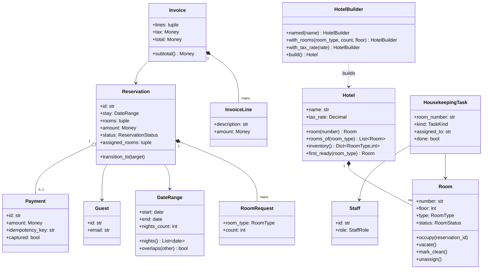
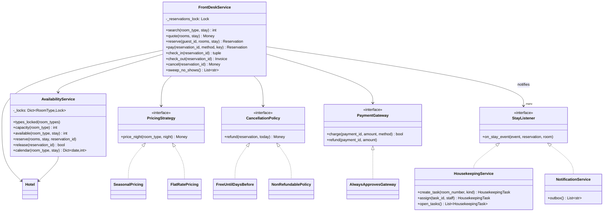
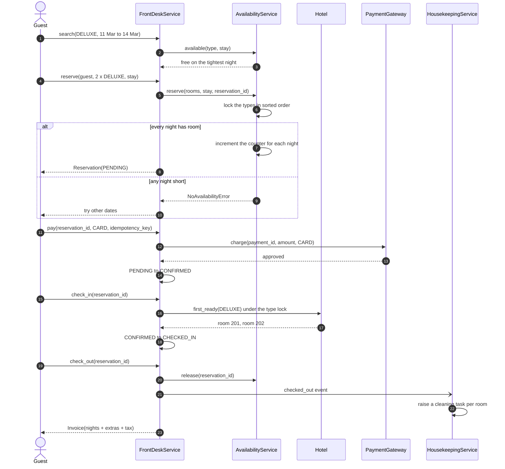
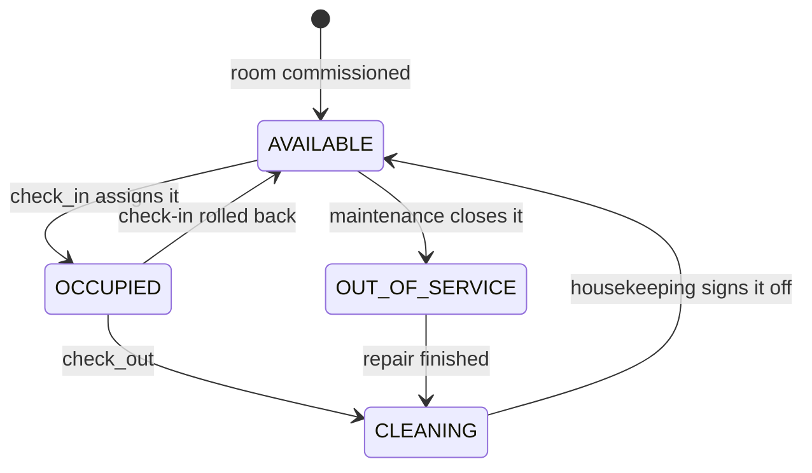
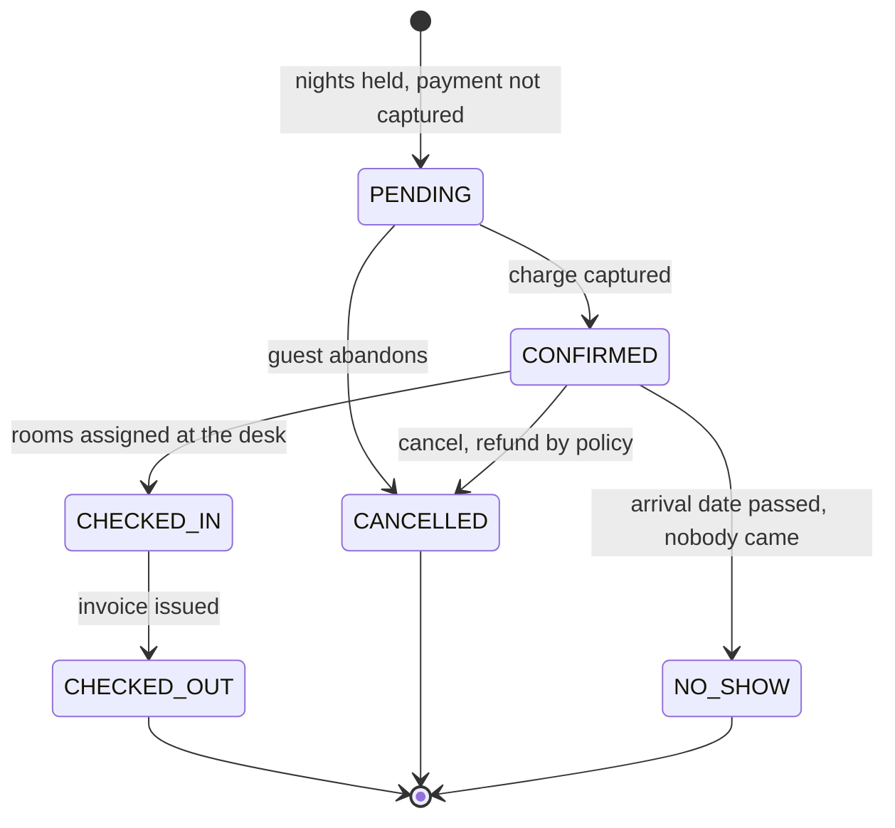

# Design a hotel management system

## TL;DR

- You build the front desk: search availability for a date range, reserve against a *room type*, pay, check in to a physical room, check out with an invoice, and hand the room to housekeeping.
- Three decisions carry the interview: **half-open date ranges** so a departure and an arrival on the same day do not collide; **inventory as a per-night counter per room type**, guarded by one lock per type, so overlapping ranges are an integer comparison rather than an interval search; **assign the physical room at check-in, not at booking**, so a maintenance closure never invalidates a reservation made three months ago.
- Patterns that earn their place: Builder (hotel construction), Strategy (pricing, cancellation), State (room, reservation), Observer (housekeeping), Facade (`FrontDeskService`).

## Problem statement

"Design a hotel management system. Guests search for rooms of a given type over a date range, reserve them, pay, arrive, stay, and check out with an invoice that includes extras. Rooms have housekeeping status; staff have roles. Rates change by season and cancellation is governed by a policy. Show me the classes, how you decide whether a date range is available, and what happens when two travel agents book the last suite at the same instant."

## Requirements

**Functional**

- Rooms with a number, a floor, a type (single, double, deluxe, suite) and a housekeeping status.
- Availability for a room type over a date range; the answer is the free count on the *tightest* night.
- Reserve one or more rooms of one or more types for a guest, all-or-nothing across every requested type and every night.
- Pay to confirm; a replayed idempotency key must not charge twice.
- Check in (assign physical rooms), add extras during the stay, check out (invoice with tax), and free the nights.
- Seasonal nightly pricing and a swappable cancellation policy with refunds.
- Housekeeping tasks raised automatically on checkout, assignable to staff with the right role.
- Sweep no-shows so an unclaimed reservation frees the nights for walk-ins.
- An overbooking allowance per room type, off by default.

**Non-functional and constraints**

- Correct under concurrency: the per-night counters are the contended resource.
- In-memory and single-process; the counters map one-to-one onto a table you would index by `(room_type, night)`.
- Deterministic and testable: the clock, the ids and the payment gateway are injected; "today" is `clock.now_dt().date()`.

**Out of scope**: multi-property chains, channel managers and OTA sync, loyalty programmes, revenue management.

## Clarifying questions and assumptions

| Question to ask | Assumption taken here |
|---|---|
| Does the guest book a room *number* or a room *type*? | A type. Real hotels assign the number at the desk, and it removes an entire class of "your room broke" failures. |
| Is checkout day a billable night? | No. Ranges are half-open `[start, end)`, so a three-night stay is `11 → 14`. |
| Which timezone decides "today"? | The property's local day, injected via `Clock`. Never the guest's, never the server's. |
| Do we overbook? | Not by default. `AvailabilityService` takes an allowance per type, because hotels do overbook and the interviewer will ask. |
| What if the room is not clean when the guest arrives? | Check-in fails with `NoRoomReadyError` and the reservation stays `CONFIRMED`. Upgrading the guest is a policy, not a lock change. |
| Can a guest check out early? | Yes. The nights go back on sale immediately; whether the guest is refunded is the cancellation policy's business, not check-out's. |
| Is the availability page strongly consistent? | No. Search returns a snapshot; only `reserve` is authoritative. Say it out loud — it is why the search path can be cached. |

## Core entities and relationships

- **Hotel** `1 → *` **Room**. A `Room` is physical: number, floor, type, and a housekeeping `RoomStatus`. Its status answers "can a guest walk into it right now", never "is it sellable in June".
- **AvailabilityService** — the sales ledger: `dict[RoomType, dict[date, int]]` of nights already sold, the overbooking allowance, and one lock per room type.
- **DateRange** — a frozen half-open interval with `nights()`, `nights_count` and `overlaps()`. Every date question in the system routes through it.
- **RoomRequest** — `(room_type, count)`. A reservation is a tuple of these, which is what makes a family booking a deluxe *and* a suite a first-class case rather than a hack.
- **Reservation** `1 → 1` guest, `1 → *` `RoomRequest`, `1 → 0..1` **Payment**, and a status machine with six states.
- **Invoice** `1 → *` **InvoiceLine** — room nights plus extras, then tax.
- **FrontDeskService** — the Facade the reception UI calls: `search`, `quote`, `reserve`, `pay`, `check_in`, `add_charge`, `check_out`, `cancel`, `sweep_no_shows`.
- **HousekeepingService** and **NotificationService** — observers of stay events; **PricingStrategy** and **CancellationPolicy** — the two swappable rules; **HotelBuilder** — stepwise construction with validation.

## Class diagram

**Structure: physical rooms on one side, the sold-nights ledger on the other.**



**Behaviour: one facade, one availability ledger, four injected seams.**



## Design patterns applied

| Pattern | Where | Why it earns its place |
|---|---|---|
| [Builder](../patterns/builder.md) | `HotelBuilder` | Construction is genuinely stepwise (name, tax rate, N floors of rooms) and genuinely needs validation (a hotel with no rooms, duplicate numbers). `build()` is the only place a `Hotel` can be born invalid, so it is the only place that has to check. |
| [Strategy](../patterns/strategy.md) | `PricingStrategy`, `CancellationPolicy` | "Now make July 50 % more expensive" and "now make the last 48 hours non-refundable" are the two follow-ups you will get. `price_night` is per night on purpose: a stay price then composes for free, including across a season boundary. |
| [State](../patterns/state.md) | `Room` guards, `Reservation.transition_to` with `RESERVATION_TRANSITIONS` | Six reservation states and four room states with no per-state behaviour: a transition table beats six classes. The guard clauses on `Room` are inline because they run inside the lock. |
| [Observer](../patterns/observer.md) | `StayListener`, `HousekeepingService`, `NotificationService` | A checkout must create cleaning work and send an email. Neither belongs in `check_out`. Listeners are notified *outside* every lock. |
| [Facade](../patterns/facade.md) | `FrontDeskService` | Reception calls nine methods; pricing, locking, gateway and observers stay behind them. |
| Factory | `HousekeepingService.create_task` | The task *kind* is derived from the stay (five nights or more means a deep clean), so callers never pick a checklist. One method, no class hierarchy — say that out loud rather than inventing a `TaskFactory`. |

What was deliberately *not* used: an **interval tree** for availability. It is the answer candidates reach for, and it is the wrong shape here. Rooms are fungible within a type, so "is this range free" collapses to "is the minimum free count over these nights at least N" — a loop over at most a few hundred integers. Reach for interval structures when the resource is *not* fungible (one specific meeting room, one specific vehicle).

## Key flows

**Reserve, pay, arrive, leave. Note where the physical room enters: at check-in, not before.**



**Room lifecycle. The `CLEANING` state is what stops the desk handing a dirty room to the next guest.**



**Reservation lifecycle. Three terminal states, and the sweeper is what makes `NO_SHOW` real rather than a label nobody sets.**



## Implementation

Write the value object first. In this problem `DateRange` is not plumbing — it is the model, and getting half-open right in the first two minutes buys you the rest of the interview.

```python title="code/lld/hotel_management/models.py — enums"
--8<-- "code/lld/hotel_management/models.py:enums"
```

```python title="code/lld/hotel_management/models.py — date range"
--8<-- "code/lld/hotel_management/models.py:date_range"
```

The physical room carries housekeeping status only. `unassign` exists so a partially completed check-in can be rolled back, which is the same all-or-nothing idea as the reservation itself.

```python title="code/lld/hotel_management/models.py — entities"
--8<-- "code/lld/hotel_management/models.py:entities"
```

The reservation state machine is a table. Six states, one guard, no ladder.

```python title="code/lld/hotel_management/models.py — reservation"
--8<-- "code/lld/hotel_management/models.py:reservation"
```

`HotelBuilder` is the one place a hotel can be built wrong, so it is the only place that validates.

```python title="code/lld/hotel_management/hotel.py — hotel and builder"
--8<-- "code/lld/hotel_management/hotel.py:hotel"
```

Now the piece the interview is about. `_free_on` takes the minimum across the nights of the stay; `reserve` checks every request before it increments anything; `types_locked` sorts so multi-type bookings cannot deadlock.

```python title="code/lld/hotel_management/services.py — availability"
--8<-- "code/lld/hotel_management/services.py:availability"
```

The facade. Read `check_in`: the room roster is mutated under the *same* room-type lock that guards the counters, which is why two receptionists cannot hand out room 201 twice.

```python title="code/lld/hotel_management/services.py — front desk"
--8<-- "code/lld/hotel_management/services.py:front_desk"
```

Pricing is per night so a stay that crosses a season boundary is priced correctly with no special case:

```python title="code/lld/hotel_management/strategies.py — pricing"
--8<-- "code/lld/hotel_management/strategies.py:pricing"
```

Running `python -m lld.hotel_management.demo` walks a day at the desk:

```text
Seaside Grand: 7 rooms, inventory {'deluxe': 2, 'double': 4, 'suite': 1}
doubles free 2026-03-11..2026-03-14: 4
RSV-1 2026-03-11..2026-03-14 2 x double -> pending, 720.00 USD
overlapping request rejected: 2026-03-13..2026-03-16: cannot sell 3 x double
RSV-3 2026-03-13..2026-03-16 2 x double -> pending (nights 13 and 14 were free)
RSV-1 paid once, replay is a no-op -> confirmed
no-show sweep on 2026-03-11 -> ['RSV-4'], suite back on sale
RSV-1 checked in to rooms 101,102
  2 x double x 3 nights: 720.00 USD
  minibar: 45.50 USD
  tax 12%: 91.86 USD -> total 857.36 USD
housekeeping raised [('101', 'turndown'), ('102', 'turndown')]
room 101 is available again
RSV-3 cancelled 2 days out -> refund 720.00 USD
doubles free 2026-03-13..2026-03-16 after the cancellation: 4
notifications: 12 sent, last was cancelled: RSV-3 (2026-03-13..2026-03-16)
```

The third request wanted three doubles over `13 → 16`, and only two were free on the night of the 13th — so it was refused outright rather than partially filled. The two-room version of the same request went through.

## Concurrency and edge cases

**Which lock protects what.**

1. `AvailabilityService._locks` — **one `threading.Lock` per `RoomType`**, created lazily under `_registry_lock`. It guards two things at once: the per-night counters for that type *and* the physical room roster for that type. That pairing is deliberate — "sell a deluxe" and "hand out deluxe 201" must not interleave, and one lock is simpler to defend than two that must be ordered.
2. `FrontDeskService._reservations_lock` — guards the reservation registry, every `transition_to` and the idempotency-key table. It is never held while a room-type lock is held, so the two families cannot form a cycle.

**Lock ordering.** A booking that spans a deluxe and a suite acquires `DELUXE` before `SUITE`, because `types_locked` sorts. Every caller sorts, so the ABBA deadlock cannot occur. The cost is trivial: an uncontended mutex is about 17 ns, so even a four-type group booking spends under 100 ns in acquisition.

**Overlapping ranges without an interval search.** Because rooms are fungible within a type, availability is `min(capacity - booked[night] for night in stay.nights())`. A 30-night stay is 30 integer comparisons. The parametrised test pins the boundary behaviour: a range ending on your arrival day and a range starting on your departure day both leave availability untouched, while a range straddling either end reduces it. That is the half-open interval doing its job.

**All-or-nothing.** `reserve` runs two passes under the locks: check every `RoomRequest` against its tightest night, then increment. A family never ends up with the suite but not the deluxe. Check-in does the same for physical rooms and calls `unassign` on anything it already took if a later room is not ready.

**Overbooking.** `capacity()` is inventory plus an allowance per type, so a hotel that deliberately sells 102 % of its deluxe rooms changes one dict and nothing else. The failure mode — a confirmed guest with no clean room — surfaces as `NoRoomReadyError` at check-in, which is exactly where a human can walk the guest to a partner property.

**Date boundaries and timezones.** "Today" comes from the injected clock as `clock.now_dt().date()`, so the no-show sweep is testable to the day and the property's local midnight is a configuration choice rather than a server accident. A stay of zero nights is rejected in `DateRange.__post_init__`, before it can become a division by zero in a rate calculation.

**Other edge cases handled**: releasing nights twice is a no-op, not a negative counter; a declined card leaves the reservation `PENDING` with the nights still held so the guest can retry; early checkout frees the remaining nights immediately; extras can only be added while `CHECKED_IN`; a room taken out of service leaves the inventory count, so future availability drops automatically.

!!! warning "Common mistake"
    Modelling availability as "is this room free for this range" and scanning reservations for overlaps. It is O(reservations) per search, it forces you to pick a physical room at booking time, and it turns every cancellation into an index rebuild. Say instead: "rooms are fungible within a type, so inventory is a counter per type per night, and the physical room is chosen at check-in." The other classic slip is inclusive end dates — then a guest leaving on the 14th blocks the guest arriving on the 14th, and you have silently lost 30 % of your sellable nights.

## Extensibility and follow-ups

- **Persistence.** The counters map onto `room_inventory(room_type, night, sold)` with a primary key on `(room_type, night)`. `reserve` becomes a transaction doing `SELECT ... FOR UPDATE ... ORDER BY night` then a conditional `UPDATE`; the sorted acquisition you already have is the same discipline. A single primary handles roughly 5k–20k writes/s, which is far more than any one property generates.
- **Hotel chains.** `AvailabilityService` is scoped to one `Hotel`; a chain is one instance per property plus a search service that fans out. Nothing in the reservation flow changes, and the fan-out is where the conversation becomes the [HLD version](../../hld/case-studies/ticketing-and-reservations.md).
- **Group bookings** already work: a `Reservation` holds a tuple of `RoomRequest`. What a real group needs on top is a partial-allocation policy ("give me 8 of the 10 rooms"), which is a strategy passed to `reserve`, not a change to the locking.
- **Loyalty and rate plans.** A `LoyaltyPricing` that composes `SeasonalPricing` and applies a tier discount, exactly like the surge wrapper in the [movie ticket sibling](movie-ticket-booking.md).
- **OTA channels.** Each channel gets an allotment carved out of `capacity()`, plus an outbound event on every counter change — a third `StayListener`, not a rewrite.
- **Housekeeping scheduling.** Today tasks are raised and assigned by hand. Adding a scheduler that batches tasks by floor is a consumer of `open_tasks()`; the observer boundary already isolates it.

!!! tip "Interview tip"
    When you reach availability, draw the calendar grid — room types down the side, nights across the top, an integer in every cell — before you write a line of code. Then point at a column and say "this cell is the contended resource, and this is the lock." Interviewers grade date-range problems on whether you found the counter; candidates who start from `Reservation.overlaps()` almost never get there in 45 minutes.

## Tests

`tests/test_hotel_management.py` has 18 cases. The boundary test is the one to walk through out loud, because it is where date-range problems are won or lost:

```python title="code/lld/hotel_management/tests/test_hotel_management.py — half-open boundaries"
--8<-- "code/lld/hotel_management/tests/test_hotel_management.py:overlap"
```

The concurrency test asserts the invariant rather than a winner: 30 agents, five rooms, and afterwards every night of the contended stay is at exactly zero free while the following window is untouched.

```python title="code/lld/hotel_management/tests/test_hotel_management.py — concurrency"
--8<-- "code/lld/hotel_management/tests/test_hotel_management.py:concurrency"
```

The rest cover: the full reserve-to-invoice path with tax and a housekeeping task; capacity refusal and the overbooking allowance; every illegal reservation transition; a partial check-in rolling back when the second room is still dirty; a declined card keeping the hold; the no-show sweep; all four cancellation outcomes via `parametrize`; seasonal rates and builder validation; and the housekeeping role check with a deep clean for long stays. Run them with `uv run pytest code/lld/hotel_management -q`.

## 45-minute pacing

| Minutes | What to do | What to say or write |
|---|---|---|
| 0–5 | Clarify | Room number or room type? Is checkout day billable? Whose timezone? Do we overbook? Park chains and OTAs. |
| 5–10 | The date model | Draw the calendar grid. Write `DateRange` as half-open and say why. This is the highest-value five minutes on the clock. |
| 10–16 | Entities | Hotel, Room, RoomRequest, Reservation, Invoice, HousekeepingTask. State that reservations are sold against a type. |
| 16–22 | State machines | Room (four states) and Reservation (six). Mark where check-in and the no-show sweep sit. |
| 22–34 | Code | `DateRange.nights` → `_free_on` (say "minimum over the nights") → `reserve` (say "check all, then increment all") → `check_in` (say "same lock as the counters"). |
| 34–41 | Concurrency | Lock per room type, sorted acquisition, overbooking as a capacity change. Describe the 30-agent test and the boundary parametrisation. |
| 41–45 | Extensions | The SQL mapping, chains as one service per property, loyalty as a pricing wrapper, OTAs as allotments. |

## Related

- [Design a movie ticket booking system (BookMyShow)](movie-ticket-booking.md) — the same hold-then-confirm shape over seats instead of nights
- [Design Ticketmaster (with a hotel-booking variant)](../../hld/case-studies/ticketing-and-reservations.md) — the distributed version, including date-range inventory at scale
- [Strategy](../patterns/strategy.md) — the pricing and cancellation seams
- [Builder](../patterns/builder.md) — `HotelBuilder` and the validate-in-`build` idiom
- [State](../patterns/state.md) — the transition table behind `Reservation`
- [Facade](../patterns/facade.md) — why reception talks to one object
