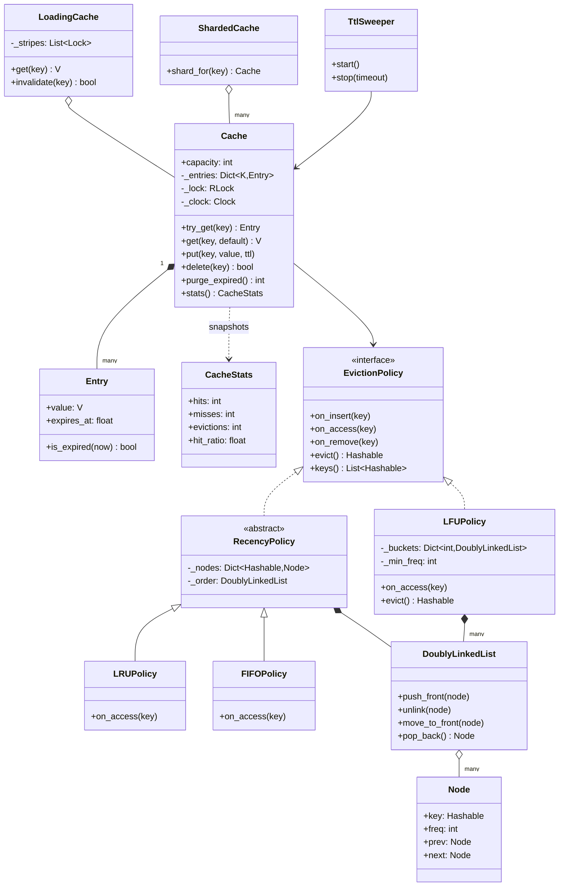
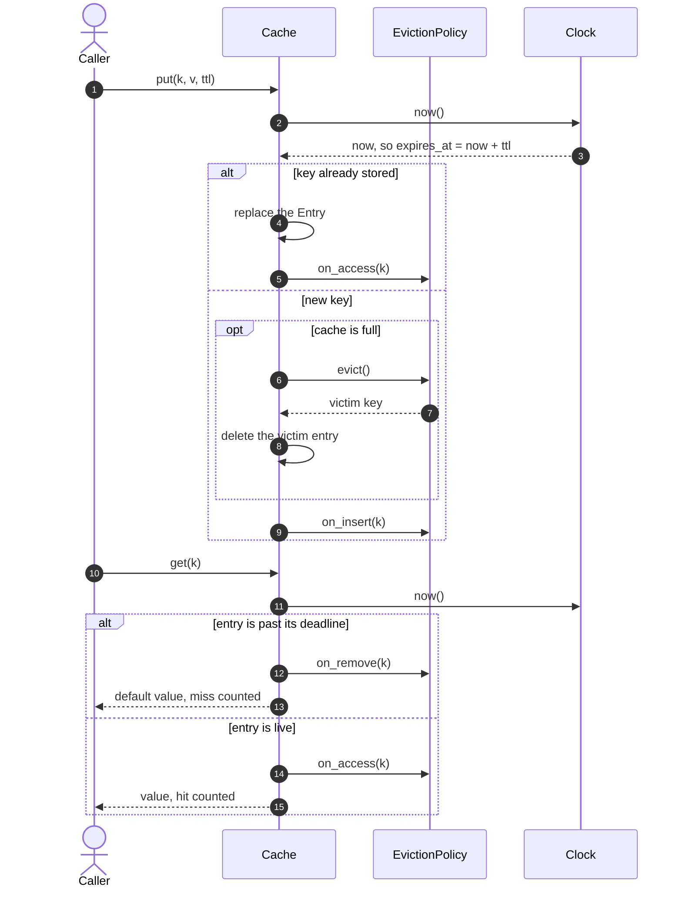
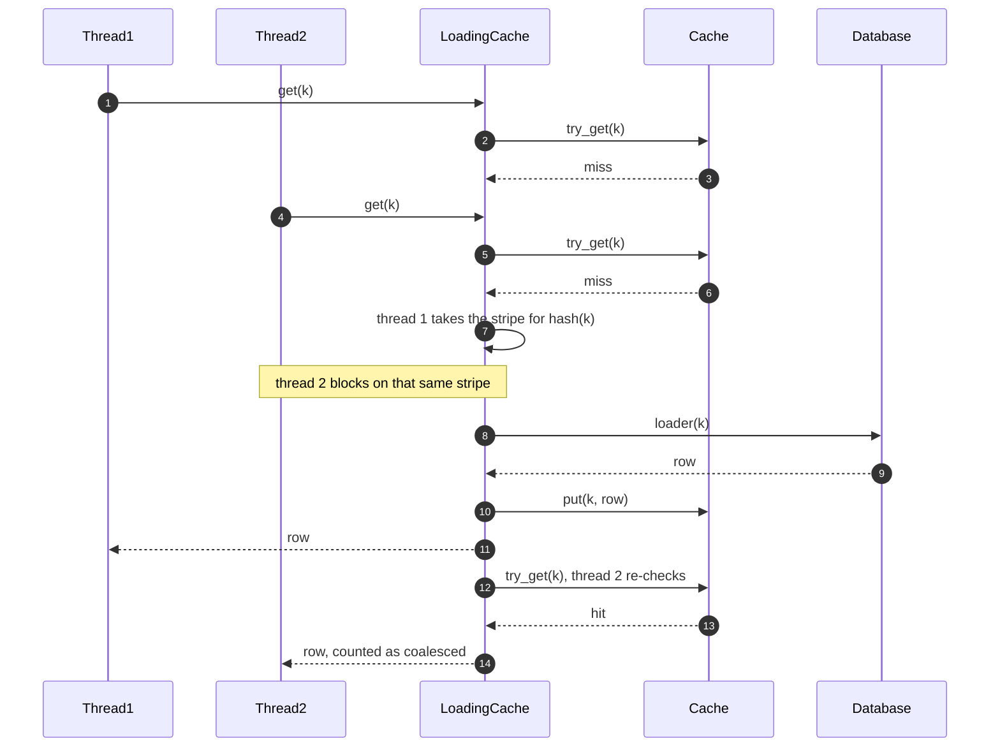

# Design an in-memory cache (LRU, LFU, TTL)

## TL;DR

- You build a bounded `Cache` whose reads and writes are O(1): a dict holds the values, a pluggable `EvictionPolicy` holds the order.
- Three decisions carry the interview: **the dict and the ordering structure must move under one lock**, **LFU needs frequency buckets plus a minimum pointer** or eviction degrades to a scan, and **TTL is checked lazily on read** with a sweeper only for memory.
- Patterns that earn their place: Strategy (the policy), Template Method (LRU and FIFO differ by one method), Decorator (`LoadingCache`), Dependency Injection (`Clock`).

## Problem statement

"Design an in-memory cache with a fixed capacity. `get` and `put` must both be O(1). When the cache is full, an eviction policy decides which key leaves — support least-recently-used and least-frequently-used, and make the policy swappable. Keys may carry a time-to-live. The cache is shared by many threads, and it should report hit and miss statistics. Show me the data structures, then show me what happens when two threads write at the same time."

## Requirements

**Functional**

- O(1) `get` and `put`, including the eviction that a `put` may trigger.
- A fixed capacity; a `put` past the capacity evicts exactly one key.
- LRU built from a dict plus a doubly linked list; LFU built from frequency buckets, also O(1); FIFO for contrast.
- The policy is pluggable: the cache never asks which one it holds.
- Per-key TTL with lazy expiry on read, plus an optional background sweeper.
- Thread-safe: concurrent readers and writers cannot corrupt either structure.
- Hit, miss, eviction and expiry counters, and the hit ratio derived from them.
- An optional read-through loader (cache-aside behind one call) with a stampede guard.

**Non-functional and constraints**

- In-process and in-memory. Distribution is a different problem, and the page hands it off to the HLD case study.
- Deterministic and testable: time is injected, so a TTL test never sleeps.
- No unbounded growth: every structure a key touches must release it on eviction or expiry.

**Out of scope**: persistence, serialisation, size-aware eviction by bytes, and cross-process invalidation.

## Clarifying questions and assumptions

| Question to ask | Assumption taken here |
|---|---|
| Is capacity counted in entries or in bytes? | Entries. Byte-aware eviction is an extensibility item, and it changes `_evict_one` into a loop. |
| Does a `put` on an existing key count as a use? | Yes — a rewrite is a use, so it moves to the front under LRU and bumps the frequency under LFU. |
| What does `get` return for a missing key? | A default (`None`). `try_get` returns the `Entry`, so a caller can tell "absent" from "stored `None`". |
| Is TTL absolute or a sliding window? | Absolute: the deadline is fixed at write time. Sliding TTL is one line in `try_get`, and you should say which one. |
| Must expired keys disappear immediately? | No. Lazy expiry is correct on its own; the sweeper exists to release memory nobody reads again. |
| One lock or many? | One reentrant lock per cache, plus an optional `ShardedCache` when profiling says the lock is the bottleneck. |
| Do we need the values to be strongly typed? | `Cache[K, V]` is generic, keys are `Hashable`. Policies work in terms of keys only. |

## Core entities and relationships

- **`Cache[K, V]`** — the aggregate: the entry dict, the policy, the injected `Clock`, the lock and the counters. Everything public goes through it.
- **`Entry[V]`** — a frozen value object: the value plus `expires_at`, an absolute instant rather than a remaining duration, so nothing has to be decremented as time passes.
- **`EvictionPolicy`** — a `Protocol` with five verbs: `on_insert`, `on_access`, `on_remove`, `evict`, `keys`. It owns order and never sees a value.
- **`Node` and `DoublyLinkedList`** — the intrusive list both list-based policies share. The list stores no wrappers: the policy already holds the node for a key, so "move this key to the front" is four pointer writes.
- **`RecencyPolicy`** (abstract) with **`LRUPolicy`** and **`FIFOPolicy`** — one index, one list, one hook.
- **`LFUPolicy`** — `dict[int, DoublyLinkedList]` keyed by use count, plus `_min_freq`.
- **`LoadingCache[K, V]`** — wraps a `Cache` and adds read-through loading with a single-flight guard.
- **`ShardedCache[K, V]`** — many independent caches chosen by `hash(key)`, for when one lock is measurably hot.
- **`TtlSweeper`** — a daemon thread that calls `purge_expired` on an interval and stops on an `Event`.
- **`CacheStats`** — an immutable snapshot; the cache never hands out live counters.

Multiplicities: cache `1 → 1` policy, cache `1 → *` entries, `RecencyPolicy` `1 → 1` list, `LFUPolicy` `1 → *` lists, `ShardedCache` `1 → *` caches.

## Class diagram

**Structure: a dict for the values, a policy for the order, and three ways to be that policy.**



## Design patterns applied

| Pattern | Where | Why it earns its place |
|---|---|---|
| Strategy | `EvictionPolicy` with `LRUPolicy`, `LFUPolicy`, `FIFOPolicy` | Eviction is the rule the interviewer changes ("now make it LFU", "now add ARC"). Each is a new class and a registry entry; `Cache` is untouched. |
| Template Method | `RecencyPolicy` → `LRUPolicy` / `FIFOPolicy` | Insert, remove, evict and listing are identical; the algorithms differ only in what a read does. One abstract method makes that difference literally one line long. |
| Decorator | `LoadingCache` wrapping `Cache` | Read-through and stampede protection are a separate concern layered on top. A caller that does not want a loader pays nothing for it. |
| Dependency Injection | `Clock` | TTL is testable without sleeping: `FakeClock.advance(301)` expires a five-minute key instantly. |
| Factory | `make_policy("lfu")` | Configuration arrives as a string; the registry dict maps it to a class. |
| Composite-by-hash | `ShardedCache` holding many `Cache` objects | Same public surface, many locks. You add it when profiling says so, not before. |

What was deliberately *not* used: **a `BaseCache` template with abstract hooks**. The temptation is to make `Cache` abstract and have `LruCache` and `LfuCache` subclass it. That puts the varying part (the order) in the inheritance axis and the fixed part (dict, lock, TTL, stats) in the subclasses' way — composition through a policy object is strictly better, and you can say why in one sentence. **Observer** for eviction notifications is also skipped: nothing in this problem listens, and a listener called under the cache lock is a deadlock waiting to happen.

## Key flows

**Write then read: the policy is told about every change, and expiry is settled on the read path.**



**The stampede: sixteen threads miss the same key, one query leaves the process.**



## Implementation

Write it in the order you would at the whiteboard: the vocabulary, then the list everything else stands on, then the policies, then the cache and its lock.

The errors subclass the shared hierarchy, so a caller catches `ValidationError` without importing anything cache-specific, and the policy names are an enum because they arrive from configuration as strings:

```python title="code/lld/in_memory_cache/models.py — errors and policy names"
--8<-- "code/lld/in_memory_cache/models.py:errors"
```

`Entry` stores an absolute deadline rather than a duration — the difference between a TTL you can check in one comparison and one you would have to sweep to maintain. `CacheStats` is frozen because handing out live counters is how a "read-only" accessor becomes a data race.

```python title="code/lld/in_memory_cache/models.py — entry and stats"
--8<-- "code/lld/in_memory_cache/models.py:entry"
```

Now the structure the whole problem rests on. Write the sentinels first and the rest follows: with a permanent head and tail there is no "is this the only node?" case to get wrong under pressure.

```python title="code/lld/in_memory_cache/models.py — intrusive doubly linked list"
--8<-- "code/lld/in_memory_cache/models.py:list"
```

The policy interface is five verbs and one rule: the cache owns values, the policy owns order. Because every method runs with the cache's lock already held, no policy needs a lock of its own — say that out loud, it is the reason the design stays simple.

```python title="code/lld/in_memory_cache/policies.py — the Strategy interface"
--8<-- "code/lld/in_memory_cache/policies.py:protocol"
```

LRU and FIFO share everything except what a read means, so the shared machinery lives in an abstract base with exactly one abstract method:

```python title="code/lld/in_memory_cache/policies.py — LRU and FIFO"
--8<-- "code/lld/in_memory_cache/policies.py:recency"
```

LFU is the one people get wrong. The trick is that you never search for the minimum count: `_min_freq` is maintained, a new key resets it to 1, and promoting the last key out of the minimum bucket moves it up by exactly one.

```python title="code/lld/in_memory_cache/policies.py — LFU with frequency buckets"
--8<-- "code/lld/in_memory_cache/policies.py:lfu"
```

The cache is then short, which is the point: it validates, reads the clock once per call, and keeps the dict and the policy in step under one lock.

```python title="code/lld/in_memory_cache/services.py — the cache"
--8<-- "code/lld/in_memory_cache/services.py:cache"
```

The loader is a decorator, not a feature of the cache. Its single-flight guard is a fixed array of stripe locks rather than a lock per key, so there is no per-key bookkeeping to leak:

```python title="code/lld/in_memory_cache/services.py — read-through with single flight"
--8<-- "code/lld/in_memory_cache/services.py:loading"
```

Sharding and the sweeper are the two answers you keep in your pocket for "what if this is too slow?" and "what about memory?":

```python title="code/lld/in_memory_cache/services.py — sharded cache"
--8<-- "code/lld/in_memory_cache/services.py:sharded"
```

```python title="code/lld/in_memory_cache/services.py — TTL sweeper"
--8<-- "code/lld/in_memory_cache/services.py:sweeper"
```

Running `python -m lld.in_memory_cache.demo` walks the whole surface — the same access trace under LRU and under LFU, lazy expiry, the sweeper, the stampede and the sharded variant:

```text
--- LRU, capacity 3: put a,b,c then read a, then put d ---
  eviction order, victim first: ['c', 'a', 'd']
  b was evicted: get('b') -> None, stats: size=3/3 hits=1 misses=1 evictions=1 expirations=0 hit_ratio=0.50
--- LFU, capacity 3: a read 3 times, b once, c never, then put d ---
  eviction order, victim first: ['d', 'b', 'a']
  c was evicted (least used): get('c') -> None
--- TTL with lazy expiry ---
  after 4 min: user-7
  after 6 min: None, size=0/100 hits=1 misses=1 evictions=0 expirations=1 hit_ratio=0.50
--- background sweeper reclaims what nobody reads again ---
  reclaimed both keys without a read: True, cache size now 0
--- loading cache: 8 threads, one cold key, one database query ---
  values agree: {'row(product:1)'}, loader ran 1 time(s), coalesced=7
--- sharded cache: 8 locks instead of 1 ---
  400 keys written by 8 threads, capacity 64 -> size 64
  size=64/64 hits=0 misses=0 evictions=336 expirations=0 hit_ratio=0.00
```

## Concurrency and edge cases

**Which lock protects what.** `Cache._lock` is one `threading.RLock` guarding three things that must always agree: `_entries`, the policy's ordering structure, and the counters. The race it prevents is the one every candidate half-sees: `put` reads `len(_entries) >= capacity`, decides not to evict, and inserts. Two threads can both read 49 against a capacity of 50, both skip the eviction and both insert — and now the dict holds 51 entries while the policy's list holds 51 nodes that no longer match the dict after the next eviction. Reading the size and acting on it is one critical section, not two.

**Why reentrant.** `purge_expired` walks the keys and calls the same private removal helper as `delete`; a plain `Lock` would force a second no-lock variant of every internal method, which is exactly how a codebase grows a deadlock. An uncontended acquire costs about 17 ns against a 100 ns main-memory reference, so reentrancy is not what your latency budget will notice — contention is.

**Why you cannot simply stripe an LRU.** The recency list is global state that every *read* mutates, so per-key locks buy nothing: they all end up serialising on the list anyway. The real answer is `ShardedCache` — partition the key space, give each shard its own lock and its own order, and accept that eviction is now per shard. That is what production caches do, and the hit-ratio cost is small because the shards see statistically similar load.

**Lazy expiry and its cost.** An expired entry occupies memory until something reads it or the sweeper runs. Lazy expiry alone is *correct* — the read path checks the deadline before every hit — but a write-once key that expires and is never read again would sit there until eviction pressure removed it. The sweeper is `Event.wait(interval)` rather than `sleep`, so `stop()` returns as soon as the flag is set instead of after the rest of an interval, and the thread is a daemon so a forgotten `stop()` cannot keep the process alive.

**Edge cases handled**: capacity below 1 is rejected at construction rather than producing a cache that evicts what it just inserted; a non-positive TTL is rejected because "expire immediately" is a `delete`; a rewrite updates in place instead of inserting a second node; `key in cache` never resurrects an expired key and never disturbs recency; the LFU tie is broken by taking the back of the minimum bucket, which is the least recently used key at that frequency; deleting a key repairs `_min_freq` instead of leaving it pointing at a bucket that no longer exists; and a loader that raises propagates and stores nothing, so a database outage does not fill the cache with failures.

!!! warning "Common mistake"
    Writing `self._policy = policy or LRUPolicy()`. It reads fine and it is a real bug: a policy defines `__len__`, an empty policy is therefore falsy, and every caller who passes a fresh `LFUPolicy()` silently gets an LRU cache. Use `if policy is None`. The general rule is worth saying in the room — `or` for defaults is only safe for arguments that can never be falsy.

## Extensibility and follow-ups

- **LRU-K and ARC**: LRU-K evicts on the K-th most recent access rather than the last one, which stops a single scan from flushing the whole cache. Both are new `EvictionPolicy` implementations; ARC additionally keeps ghost lists of recently evicted keys, so it needs a policy that is told about evictions — one more hook, not a redesign.
- **Size-based eviction**: give `put` a weight and keep a running total; `_evict_one` becomes `while total > limit: evict`. The policy interface does not change at all.
- **Sliding TTL**: refresh `expires_at` inside `try_get` on a hit. One line, and a genuinely different product decision — say which you chose.
- **Probabilistic early expiration**: have `try_get` treat an entry as expired slightly before its deadline with a probability that grows as the deadline approaches, so one request refreshes a hot key while the rest still get the cached value. It composes with the single-flight guard rather than replacing it.
- **Monotonic time**: `SystemClock.now()` is wall-clock, and a clock step from an NTP correction can expire or resurrect entries. In production the `Clock` you inject should read a monotonic source; the injection point is already there, which is the whole benefit of not calling `time.time()` inside the cache.
- **Async loader**: the same `LoadingCache` shape with an `asyncio.Lock` per stripe and an awaited loader — the algorithm is unchanged.
- **Distribution**: once the cache must survive a process restart or be shared by many machines, the conversation becomes sharding, replication and cross-node invalidation, and it moves to the distributed-cache case study.

Sizing is the other follow-up worth rehearsing. The 80/20 rule from the estimation sheet gives you the capacity in one line: 100M reads/day at 1 KB per object, caching the hottest 20%, is 100M x 1 KB x 0.2 = 20 GB — one large machine, or a small cluster once you want redundancy. And the reason to bother: a hit costs a ~100 ns memory reference against ~16 µs for the 4 KB SSD read it replaces, roughly 160 times cheaper before the query itself is counted.

!!! tip "Interview tip"
    When you are asked for LFU, do not start typing. Say the shape first: "a dict from key to node, a dict from frequency to a list of nodes, and a `_min_freq` integer — the integer is what makes eviction O(1) instead of a scan." Then write it. Interviewers grade whether you knew the invariant before you wrote the code, and `_min_freq` is the invariant.

## Tests

`tests/test_in_memory_cache.py` has 17 cases. The two worth walking an interviewer through are the capacity invariant under load and the stampede.

```python title="code/lld/in_memory_cache/tests/test_in_memory_cache.py — capacity under concurrency"
--8<-- "code/lld/in_memory_cache/tests/test_in_memory_cache.py:concurrency"
```

The assertion that matters is not `len(cache) == 50`, which a lucky race would still satisfy; it is that the dict's key set equals the policy's key set. Structural drift between the two is the bug an unlocked cache actually produces, and it survives long after the count looks right.

```python title="code/lld/in_memory_cache/tests/test_in_memory_cache.py — single flight"
--8<-- "code/lld/in_memory_cache/tests/test_in_memory_cache.py:single_flight"
```

A `threading.Barrier` makes the stampede deterministic: all sixteen threads arrive at the miss together instead of trickling in after the first one has already filled the cache.

The rest cover: LRU eviction order and its stats; LFU eviction with the frequency tie broken by recency; a parametrized case where LRU, LFU and FIFO disagree about a key that was written first and then read; lazy expiry with `KeyMissingError` from the strict accessor; active purge; rejected capacities and TTLs; delete-and-overwrite keeping both structures in step; a loader failure that is retried rather than cached; the sweeper reclaiming in the background and stopping within its timeout; and the sharded cache splitting its capacity. Run them with `uv run pytest code/lld/in_memory_cache -q`.

## 45-minute pacing

| Minutes | What to do | What to say or write |
|---|---|---|
| 0–5 | Clarify | Capacity in entries or bytes? Which policies? TTL absolute or sliding? Threads? Out of scope: persistence, distribution. |
| 5–10 | Entities and API | `get`, `put`, `delete`, `stats` on the board. Name the split immediately: dict owns values, policy owns order. |
| 10–16 | LRU | Draw the dict beside the list, mark head as newest and tail as victim, then write `Node`, the sentinels and `move_to_front`. |
| 16–24 | Policy seam and LFU | Extract the five-verb `EvictionPolicy`, then write LFU with buckets and `_min_freq`. State the tie-break rule before coding it. |
| 24–32 | Cache, TTL and the lock | `put` with the eviction branch, `try_get` with lazy expiry, and the one lock around both structures. |
| 32–40 | Concurrency | The 49-plus-49 race, why an RLock, why LRU cannot be striped, and what the concurrency test asserts. |
| 40–45 | Extensions | Stampede and single flight, LRU-K and ARC as new policies, size-based eviction, and the hand-off to a distributed cache. |

## Related

- [Caching and CDNs](../../hld/fundamentals/caching-and-cdn.md) — where caches sit, cache-aside versus write-through, and stampede protection at system scale
- [Strategy](../patterns/strategy.md) — the pattern behind the pluggable eviction policy
- [Template Method](../patterns/template-method.md) — the one-hook base class that separates LRU from FIFO
- [Decorator](../patterns/decorator.md) — how `LoadingCache` adds read-through without touching `Cache`
- [Concurrency for LLD in Python](../fundamentals/concurrency-for-lld.md) — lock granularity, reentrancy and the read-modify-write race
- [Design a distributed cache](../../hld/case-studies/distributed-cache.md) — the same problem once it no longer fits in one process
- Primary sources: Megiddo and Modha, "ARC: A Self-Tuning, Low Overhead Replacement Cache" (FAST 2003); Nishtala et al., "Scaling Memcache at Facebook" (NSDI 2013)
