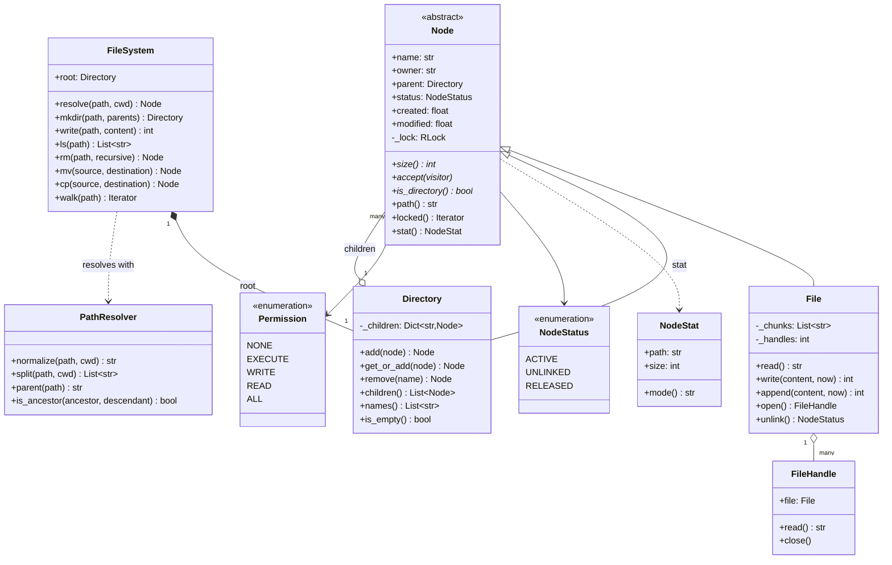
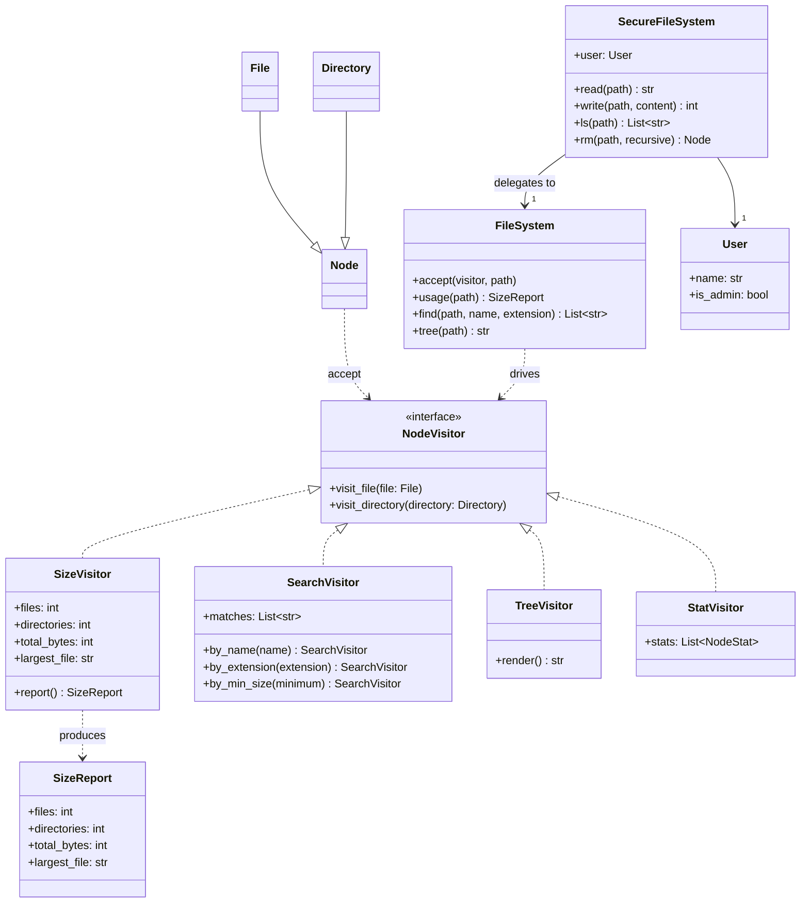
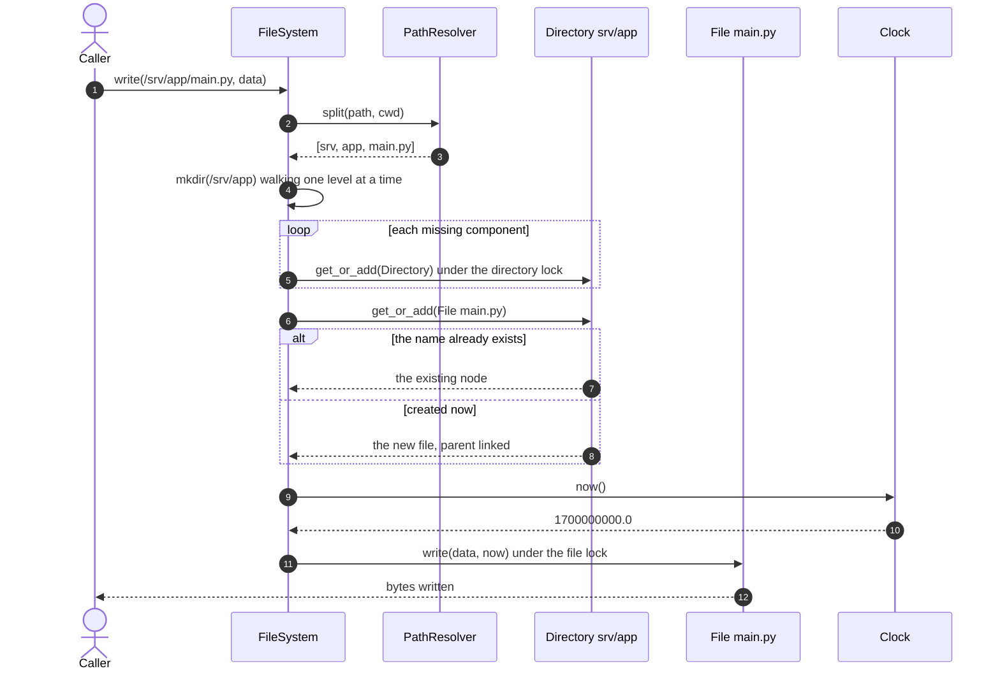
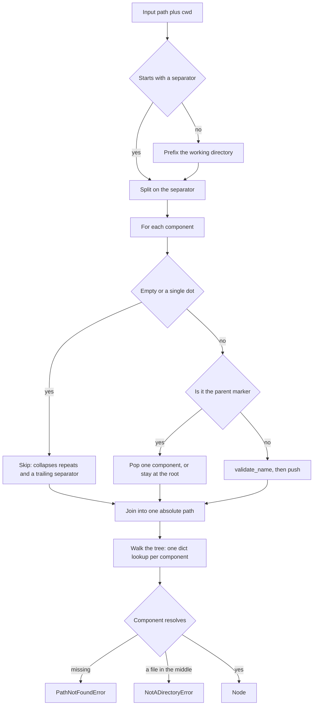
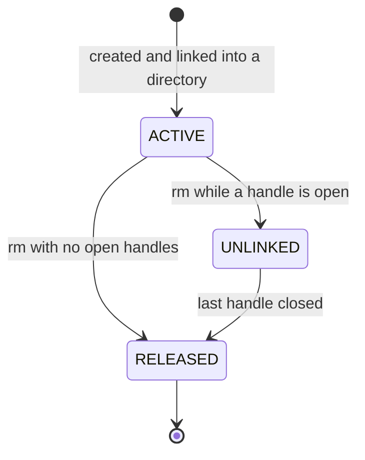

# Design an in-memory file system

## TL;DR

- You build a Composite tree (`Node` → `File` | `Directory`), a `PathResolver` that owns every string edge case, and a `FileSystem` service that holds the lock ordering.
- Three decisions carry the interview: **traversals are Visitors, not methods on `Node`** (search, `du` and `tree` never touch the node classes), **locks are per node with a fixed order by absolute path** (so `mv` between two directories cannot deadlock), and **`rm` unlinks rather than deletes** (an open handle keeps the bytes alive, exactly like POSIX).
- It is LeetCode 588 with the parts that matter added: `mv` into its own subtree is rejected, permissions sit behind a Proxy, and every operation is thread-safe.

## Problem statement

"Design an in-memory file system. Support `mkdir -p`, creating and writing and appending and reading files, a sorted `ls`, recursive delete, move, copy, recursive size, and find by name or extension. Paths are absolute, with relative paths resolved against a working directory. Files and directories carry an owner, permission bits and timestamps. It has to behave correctly when several threads work on the tree at once, and you should be explicit about what happens at the awkward path cases."

## Requirements

**Functional**

- `mkdir -p`: create intermediate directories, idempotently.
- Create, write (replace), append and read files; `create` fails if the file exists.
- `ls` returning sorted names; a path that names a file lists that file (LeetCode 588 semantics).
- `rm`, refusing a non-empty directory unless recursive.
- `mv` (rename or move into a directory) and `cp` (deep copy).
- Absolute path resolution, plus relative paths against a working directory.
- `find` by name or by extension; recursive size; `stat` with owner, mode and timestamps.
- Permission bits for the owner and for everyone else, enforced per user.
- Timestamps from an injected clock.

**Non-functional and constraints**

- Correct under concurrency: two threads calling `mkdir -p` on the same path both succeed and create one directory.
- No global tree lock. Contention is per directory.
- `mv` must never be able to detach a subtree from the root.
- In-memory, single process, standard library only. Time is injected, so timestamp assertions are exact.

**Out of scope**: real persistence, symbolic and hard links, byte-range reads, extended attributes, and quotas. The distributed version is [Design Dropbox or Google Drive](../../hld/case-studies/cloud-file-storage.md).

## Clarifying questions and assumptions

| Question to ask | Assumption taken here |
|---|---|
| Is `ls` on a file an error or does it list the file? | It lists the file, matching LeetCode 588 — and it is the kind of question that shows you have read the spec. |
| What does `..` at the root do? | It stays at the root. `/..` is `/`, not an error; that is what every real shell does. |
| Does a trailing slash matter? | No. `/a/b/` and `//a///b` both normalise to `/a/b`. |
| Where does `mv /a /a/b` land? | Nowhere: it is rejected. Allowing it orphans the subtree, and the check is one string comparison. |
| Does `rm` free the bytes immediately? | Only if nobody has the file open. Otherwise the node becomes `UNLINKED` and is released when the last handle closes. |
| One global lock or many? | One lock per node. `mv` and `cp` take two, always ordered by absolute path. |
| Should permission checks live in `FileSystem`? | No. They live in a `SecureFileSystem` proxy with the same surface, so the core stays readable. |

## Core entities and relationships

- **Node** (abstract) — name, parent, owner, two permission masks, timestamps, status and its own `RLock`. Declares `size()`, `accept(visitor)` and `is_directory()`.
- **File** — a leaf. Content is a list of chunks so `append` is O(1) rather than O(size). Tracks open handles.
- **Directory** — a composite: `name → Node`, with `add`, `get_or_add` (the atomic step behind `mkdir -p`), `remove` and a sorted `children()`. `1 → *` children.
- **FileHandle** — keeps an unlinked file alive; `close()` releases it when it is the last one.
- **PathResolver** — pure string handling: `normalize`, `split`, `parent`, `basename`, `join`, `is_ancestor`. No tree, no locks.
- **FileSystem** — the service: resolution, node creation, lock ordering, and the operations (`mkdir`, `write`, `rm`, `mv`, `cp`, `find`, `walk`).
- **NodeVisitor** — `SizeVisitor`, `SearchVisitor`, `TreeVisitor`, `StatVisitor`. The visitor drives the recursion.
- **SecureFileSystem** — the Proxy, holding a `User`; **Permission**, **NodeStatus**, **NodeStat**, **SizeReport** — the value vocabulary.

## Class diagram

**Structure: the Composite tree and the service that navigates it.**



**Behaviour: traversals that live outside the tree, and the permission proxy in front of it.**



## Design patterns applied

| Pattern | Where | Why it earns its place |
|---|---|---|
| Composite | `Node` → `File` / `Directory` | `size()` on a directory is `sum(child.size())` and it is the same call on a leaf. Every recursive operation stops being a type check and becomes a recursive call. |
| Visitor | `SizeVisitor`, `SearchVisitor`, `TreeVisitor`, `StatVisitor` | Search, `du`, `tree` and a listing API are four traversals that have nothing to do with what a file *is*. Adding a fifth touches no node class. The visitor drives the recursion, so pruning is a one-line change. |
| Iterator | `FileSystem.walk` | A generator yielding `(path, node)` depth-first and sorted. Callers can stream a huge tree without materialising it, and `walk` snapshots each directory so a concurrent delete cannot break the loop. |
| Proxy | `SecureFileSystem` | Identical surface, permission checks in front. The core stays free of `if user.can(...)`, and "run this batch job as root" is one line at the call site. |
| Factory Method | `mkdir` / `_file_for_write` creating nodes | Node creation is centralised, so a symlink or a device node becomes a third `Node` subclass and one branch, not a rewrite. |
| Strategy (light) | `SearchVisitor(predicate)` | `by_name`, `by_extension` and `by_min_size` are three predicates, not three classes. |
| Dependency Injection | `Clock` | Timestamps are asserted exactly (`modified == 1_700_000_030`) instead of being fuzzed with tolerances. |

Deliberately **not** used: **Singleton** for `FileSystem`. It is tempting — there is "one" file system — but tests build dozens, and mounting a second in-memory volume should be a second object, not a redesign. Also not used: the **Command** pattern for undoable operations. It is a real option (`rm` becomes a command that keeps the unlinked subtree), but it doubles the surface, and the `UNLINKED` status already gives you the piece that actually matters. Say you considered it, and say what it would cost.

## Key flows

**`write("/srv/app/main.py", data)` — resolve, create the parents, get-or-create the file, stamp it.**



**Path resolution, which is where most candidates lose points.**



**A node's life.** `UNLINKED` is the state that makes `rm` on an open log file behave the way operators expect.



## Implementation

Start with the vocabulary. `NodeStatus` is the enum the state diagram draws, and `Permission` is an `IntFlag` so `READ | WRITE` is one value rather than a set.

```python title="code/lld/in_memory_file_system/models.py — statuses and permissions"
--8<-- "code/lld/in_memory_file_system/models.py:enums"
```

```python title="code/lld/in_memory_file_system/models.py — errors"
--8<-- "code/lld/in_memory_file_system/models.py:errors"
```

Write the resolver next, and write it as pure string handling. Keeping it away from the tree is what lets you test nine edge cases in one `parametrize` and never think about them again.

```python title="code/lld/in_memory_file_system/paths.py"
--8<-- "code/lld/in_memory_file_system/paths.py:resolver"
```

Now the Composite. `Node` declares the three things every node answers, and it owns the lock — there is no lock anywhere above it.

```python title="code/lld/in_memory_file_system/nodes.py — the base"
--8<-- "code/lld/in_memory_file_system/nodes.py:node"
```

The leaf stores chunks rather than one string, so appending a log line is O(1). `unlink` and `close_handle` are the whole POSIX story in twelve lines.

```python title="code/lld/in_memory_file_system/nodes.py — files and handles"
--8<-- "code/lld/in_memory_file_system/nodes.py:file"
```

The composite is a dict plus a lock. `get_or_add` is the method that makes `mkdir -p` correct under contention: the check and the insert happen inside one critical section.

```python title="code/lld/in_memory_file_system/nodes.py — directories"
--8<-- "code/lld/in_memory_file_system/nodes.py:directory"
```

The visitors are where the Visitor pattern justifies itself. Note that `Directory.size()` already exists from Composite — the visitors are for the operations you would *not* put on a node.

```python title="code/lld/in_memory_file_system/visitors.py — the interface"
--8<-- "code/lld/in_memory_file_system/visitors.py:protocol"
```

```python title="code/lld/in_memory_file_system/visitors.py — four traversals"
--8<-- "code/lld/in_memory_file_system/visitors.py:visitors"
```

Finally the service. Read `mv` first: the subtree check, the destination rules, and `_two_locks` sorting by absolute path are the three things an interviewer is looking for.

```python title="code/lld/in_memory_file_system/services.py — the file system"
--8<-- "code/lld/in_memory_file_system/services.py:filesystem"
```

The proxy is short, which is the point — it adds one concern and delegates everything else.

```python title="code/lld/in_memory_file_system/services.py — the permission proxy"
--8<-- "code/lld/in_memory_file_system/services.py:proxy"
```

Running `python -m lld.in_memory_file_system.demo`:

```text
ls /srv/app -> ['README.md', 'logs', 'main.py']
read log    -> 'boot\nready\n'
path edge cases: ['README.md', 'logs', 'main.py'] == ['README.md', 'logs', 'main.py']
du /srv: 29B in 3 files, 3 dirs, largest /srv/app/main.py
find *.log  -> ['/srv/app/logs/app.log']
after mv: /srv -> ['README.md', 'app'], /srv/app -> ['logs', 'main.py']
rejected: cannot move /srv/app into its own subtree (/srv/app/logs/app)
rm with a handle open -> status=unlinked, still readable: 'boot\nready\n'
after close -> status=released
guest denied: guest lacks READ on /srv/app/main.py
root allowed: "print('hi')\n"
cp -r /srv/app /backup -> ['logs', 'main.py'], 12B
rm -r /srv -> status=released, released=True, root now ['backup']
backup/
  logs/
  main.py (12B)
```

## Concurrency and edge cases

**Which lock protects what.** One per node, and no lock above them:

1. `Directory._lock` guards that directory's children dict. Two threads creating files in different directories never contend. This is the granularity that matters: a global tree lock would serialise every operation in the system, and a lock per *file* alone would leave the dict unprotected.
2. `File._lock` guards the chunk list, the size counter and the handle count. Three hundred threads appending to one log serialise here and every line survives.
3. **Two directories, one fixed order.** `mv` and `cp` take both parents through `_two_locks`, which sorts them by absolute path. Two threads moving files in opposite directions between `/a` and `/b` therefore acquire in the same order and cannot form a cycle. Naming this ordering rule is the single highest-value sentence in the concurrency section.

**The race `get_or_add` prevents.** `mkdir -p /shared/dir-0` from eight threads at once: a naive `if not exists: add()` has a window between the check and the insert, and the losers get `PathExistsError` for a path that should be idempotent. Deciding under the lock makes the loser return the winner's directory instead. The concurrency test runs 200 such calls across four directories and asserts exactly five directories exist afterwards.

**`mv` into its own subtree.** `PathResolver.is_ancestor(src, dst)` is checked before anything is locked. Without it, `mv /a /a/b` leaves `/a` referenced only by its own descendant — a cycle unreachable from the root, invisible to `ls` and a permanent leak. Note that the check compares components, not string prefixes: `/a` is an ancestor of `/a/b` but not of `/ab`.

**Delete while iterating.** `Directory.children()` returns a sorted snapshot taken under the lock, and `Directory.size()` releases its own lock before recursing. So a concurrent `rm` during a `walk` or a `du` yields a slightly stale view rather than a `RuntimeError`; the traversal never sees a half-mutated dict.

**`rm` on an open file.** The directory entry disappears immediately, the node moves to `UNLINKED`, and the bytes stay readable through the handle until the last `close()` moves it to `RELEASED`. This is why deleting a log file does not free space until the writing process restarts, and saying so signals operational experience.

**Path edge cases handled**: `/` normalises to `/`; a trailing slash and repeated separators collapse; `.` is dropped; `..` pops one component and is a no-op at the root; relative paths resolve against a working directory; a component that is a file in the middle of a path raises `NotADirectoryError`; empty and whitespace-only paths are rejected; names are validated (no separators, no reserved words, at most 255 characters).

**Cost model.** Resolution is one dict lookup per component, so `/a/b/c/d.txt` costs about four main-memory references at ~100 ns each — call it 400 ns. A real file system doing one 4 KB SSD read per inode would spend ~16 µs per level, roughly 40 times more per component; that gap is the whole reason page caches exist. The ceiling is memory: at roughly 1 KB per small file including content, a million files is about 1 GB and fits comfortably on a 64–512 GB box, while a hundred million does not — which is where this becomes a storage design problem.

!!! warning "Common mistake"
    Wrapping every operation in one global lock and calling it thread-safe. It is safe and it is useless: `ls` on an unrelated directory now waits behind a large `cp`. The other half of the same mistake is going per-node without defining an acquisition order — the first two-directory `mv` under load deadlocks, and it will not reproduce on your laptop. Per-node locks plus "always sorted by absolute path" is the answer, and it is one `contextmanager`.

## Extensibility and follow-ups

- **LeetCode 588 parity** is already there: `ls`, `mkdir`, `addContentToFile` and `readContentFromFile` map to `ls`, `mkdir`, `append` and `read`, including "`ls` on a file returns the file name". A test walks the exact example sequence from the problem.
- **Quotas**: a `QuotaVisitor` accumulating bytes per owner, plus a check in `_file_for_write`. The visitor already exists in spirit — `SizeVisitor` with a grouping key.
- **Symlinks**: a third `Node` subclass holding a target path. Resolution follows it with a depth limit (POSIX uses 40) to break cycles, and `is_ancestor` must then be checked on the *resolved* path, which is a good thing to mention before it becomes a bug.
- **Versioning**: `File` already keeps chunks; keep a list of `(version, chunks)` and have `read` take an optional version. Copy-on-write makes a snapshot O(1).
- **Sharing and ACLs**: the `Permission` masks become an ACL list, and `SecureFileSystem` grows a group lookup. Nothing in the tree changes, which is the payoff for putting the checks in a proxy.
- **Undoable operations**: give each mutation a Command with the unlinked subtree kept alive, and `rm` becomes a trash bin.
- **Going distributed** is the hand-off: chunking, content-addressed blocks, metadata sharded separately from data, and sync conflicts — see [Design Dropbox or Google Drive](../../hld/case-studies/cloud-file-storage.md).

!!! tip "Interview tip"
    Draw the Composite in the first five minutes, then immediately say "traversals go in Visitors, not on `Node`" and give one example the interviewer did not ask for (`du`, `tree`, quota). Then name the lock ordering rule. Those two moves cover the two things this problem is actually testing, and both take ten seconds to say.

## Tests

`tests/test_in_memory_file_system.py` has 29 cases (14 functions, two of them parameterised). The four worth walking through are the happy path, path normalisation, `mv`, and concurrency.

The happy path pins `mkdir -p`, append, sorted `ls`, recursive size, the injected clock and the LeetCode `ls`-on-a-file rule in six assertions:

```python title="code/lld/in_memory_file_system/tests/test_in_memory_file_system.py — happy path"
--8<-- "code/lld/in_memory_file_system/tests/test_in_memory_file_system.py:happy"
```

Path normalisation is a table, because that is what it is. Nine rows, one line each, and the `is_ancestor` test that keeps `/ab` from looking like a child of `/a`:

```python title="code/lld/in_memory_file_system/tests/test_in_memory_file_system.py — path edge cases"
--8<-- "code/lld/in_memory_file_system/tests/test_in_memory_file_system.py:paths"
```

The `mv` test covers all four behaviours in one narrative — move up, move into an existing directory, refuse the subtree, refuse an existing name:

```python title="code/lld/in_memory_file_system/tests/test_in_memory_file_system.py — move"
--8<-- "code/lld/in_memory_file_system/tests/test_in_memory_file_system.py:mv"
```

The concurrency test is the one to describe out loud: 200 tasks over eight threads, each doing `mkdir -p` on one of four shared directories and then writing its own file. The invariant is that exactly five directories exist and all 200 files landed.

```python title="code/lld/in_memory_file_system/tests/test_in_memory_file_system.py — concurrency"
--8<-- "code/lld/in_memory_file_system/tests/test_in_memory_file_system.py:concurrency"
```

The rest cover: seven invalid operations through `parametrize`; `mkdir` idempotency and its refusal to walk through a file; recursive `rm` releasing the whole subtree; the unlink-with-an-open-handle sequence; `cp` producing an independent deep copy; three visitors reporting and searching; `walk` yielding a sorted depth-first order; 300 concurrent appends to one file keeping every line; the permission proxy denying a guest and admitting the owner and an admin; and the LeetCode 588 example sequence verbatim. Run them with `uv run pytest code/lld/in_memory_file_system -q`.

## 45-minute pacing

| Minutes | What to do | What to say or write |
|---|---|---|
| 0–5 | Clarify | Absolute or relative paths? What does `ls` on a file do? What about `..` at the root? Concurrency? Out of scope: persistence, symlinks, quotas. |
| 5–10 | Entities | Nouns: Node, File, Directory, FileSystem, PathResolver, Visitor. Draw the Composite and say "Visitor for traversals" immediately. |
| 10–17 | Class diagram | Tree on the left, visitors on the right, the proxy in front of the service. Mark the per-node lock. |
| 17–33 | Code | `PathResolver.normalize` (all the edge cases) → `Directory.get_or_add` → `FileSystem.mkdir` → `write` → `mv` with the subtree check and `_two_locks` → `SizeVisitor`. |
| 33–40 | Concurrency | Per-node locks, the ordering rule, the `mkdir -p` race, snapshots during traversal, and unlink-with-open-handle. |
| 40–45 | Extensions | Symlinks with a depth limit, quotas as a visitor, ACLs in the proxy, versioning by chunk lists, and the hand-off to cloud file storage. |

## Related

- [Composite](../patterns/composite.md) — files and directories answering the same interface
- [Visitor](../patterns/visitor.md) — size, search and rendering without touching the node classes
- [Iterator](../patterns/iterator.md) — `walk` as a lazy, snapshot-safe traversal
- [Proxy](../patterns/proxy.md) — permission checks in front of the same surface
- [Concurrency for LLD in Python](../fundamentals/concurrency-for-lld.md) — lock granularity and fixed acquisition order
- [Design Dropbox or Google Drive](../../hld/case-studies/cloud-file-storage.md) — what this becomes once it must survive a restart
