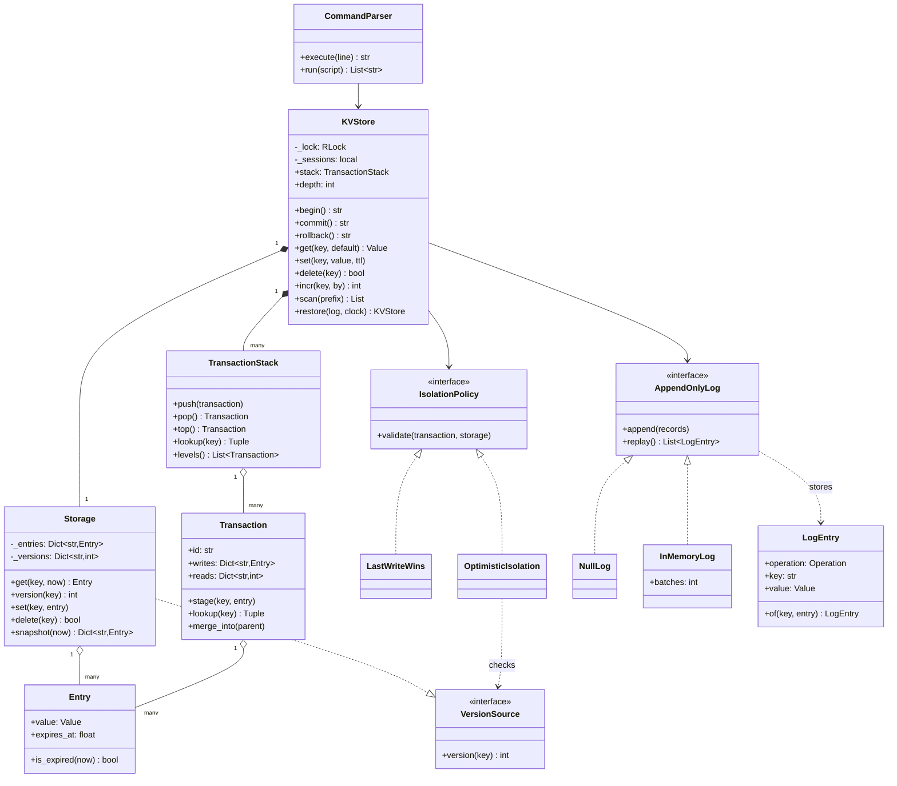
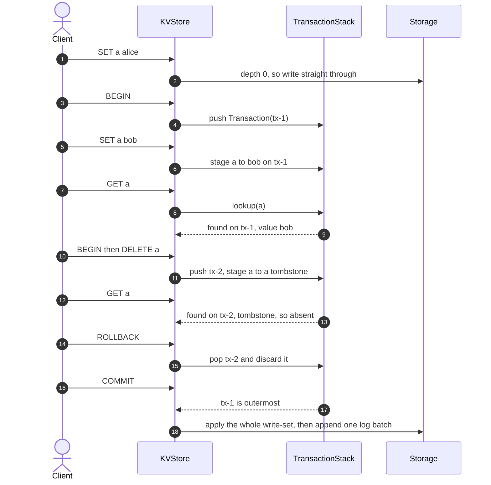
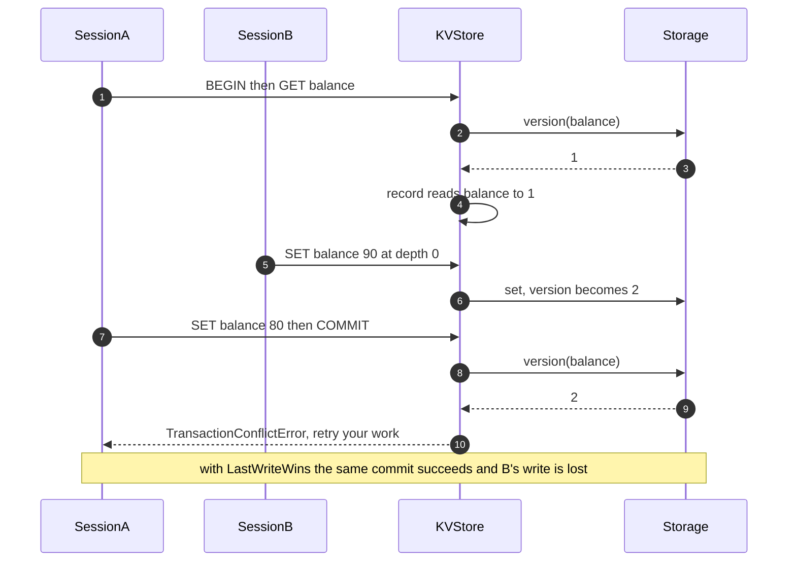

# Design an in-memory key-value store with transactions

## TL;DR

- You build a store whose committed state is one dict and whose transactions are a *stack of write-sets* layered over it; a read walks the stack outward and stops at the first level that mentions the key.
- Three decisions carry the interview: **a delete is a tombstone, not a removal**, **a nested `COMMIT` merges into its parent rather than into storage**, and **the transaction stack is per session** so one thread's rollback cannot discard another's work.
- Patterns that earn their place: Unit of Work (the write-set), Memento (a savepoint you pop), Strategy (isolation), Command (the log record you replay), Facade (the REPL).

## Problem statement

"Design an in-memory key-value store with transactions. It supports `get`, `set`, `delete`, `exists`, `incr` and a prefix scan, plus `BEGIN`, `COMMIT` and `ROLLBACK` — and transactions nest. A read inside a transaction must see that transaction's own uncommitted writes. Keys may carry a TTL. Several threads use the store at once. Walk me through what `BEGIN; SET a 1; BEGIN; DELETE a; ROLLBACK; COMMIT` leaves behind, and then tell me how you would make it durable."

## Requirements

**Functional**

- `get`, `set`, `delete`, `exists`, plus `incr` and `decr` on integer values.
- `BEGIN`, `COMMIT` and `ROLLBACK`, arbitrarily nested.
- Reads inside a transaction see that transaction's own uncommitted writes.
- Per-key TTL, expired lazily on read, with an explicit purge.
- Prefix scan and snapshot iteration over the merged view.
- Thread safety, with an explicit answer for what two concurrent transactions see.
- An optional append-only log, and recovery by replaying it.
- An optional command parser, so the store can be driven as a REPL.

**Non-functional and constraints**

- `get` and `set` stay O(1) at depth zero, and O(depth) inside nested transactions — depth is a handful, not a scale factor.
- A commit is atomic: either every staged write lands, or none does, and the log records it as one batch.
- Deterministic and testable: the clock is injected, so a five-minute TTL is proven in microseconds.

**Out of scope**: multi-version concurrency control, replication, Redis data types beyond strings and integers, and any network protocol.

## Clarifying questions and assumptions

| Question to ask | Assumption taken here |
|---|---|
| What does a nested `COMMIT` mean? | It merges into the parent write-set. Only the outermost commit touches storage — say this before writing anything. |
| Are transactions per connection or global? | Per session. The stack lives in `threading.local`, so two threads are isolated by construction. |
| What do concurrent transactions see of each other? | Nothing until commit. The conflict rule is a `Strategy`: last-write-wins by default, optimistic version checks when you ask for them. |
| Is TTL fixed at write time or at commit time? | At write time, because the value is what carries the deadline. A long transaction can therefore commit an already-expired key. |
| Does `delete` inside a transaction return whether the key existed? | Yes, judged through the chain, which is what the caller means by "existed". |
| What should `incr` do on a missing key? | Treat it as 0. On a string it raises rather than coercing. |
| How durable does this need to be? | An append-only log behind a `Protocol`, one append per commit. The fsync policy is the real durability question and belongs in the discussion. |

## Core entities and relationships

- **`KVStore`** — the aggregate: committed `Storage` under one `RLock`, a per-session `TransactionStack`, an `IsolationPolicy` and an `AppendOnlyLog`.
- **`Storage`** — the committed dict plus a version per key and lazy TTL evaluation. It never locks; the store holds the lock around every call.
- **`Entry`** — a frozen cell: value plus an absolute `expires_at`.
- **`Transaction`** — one savepoint: `writes` (a `None` value is a tombstone) and `reads` (key to the base version seen).
- **`TransactionStack`** — the chain, with `lookup` walking innermost outward.
- **`IsolationPolicy`** with **`LastWriteWins`** and **`OptimisticIsolation`** — what happens at the outermost commit.
- **`AppendOnlyLog`** with **`NullLog`** and **`InMemoryLog`**; **`LogEntry`** is the record.
- **`CommandParser`** — the REPL facade.

Multiplicities: store `1 → 1` storage, store `1 → 1` stack *per thread*, stack `1 → *` transactions, transaction `1 → *` staged entries, store `1 → 1` isolation policy and `1 → 1` log.

## Class diagram

**One dict of committed truth, a stack of write-sets over it, and two seams: isolation and durability.**



## Design patterns applied

| Pattern | Where | Why it earns its place |
|---|---|---|
| Unit of Work | `Transaction.writes` | Changes are collected and applied in one step at commit, which is the definition of atomicity here. Nothing reaches `Storage` until the outermost commit runs. |
| Memento | `TransactionStack` | Each `BEGIN` captures a savepoint that `ROLLBACK` pops. The caretaker (the stack) never reads inside a transaction — it only pushes, pops and merges. |
| Command | `LogEntry` and the replay in `restore` | Every mutation is reified as a record with enough information to be re-applied, which is what makes recovery a `for` loop instead of a special case. |
| Strategy | `IsolationPolicy` | "What if two transactions touch the same key?" is a policy question with more than one right answer. Swapping `LastWriteWins` for `OptimisticIsolation` changes nothing else. |
| Facade | `CommandParser` | String handling, argument counts and reply formatting stay out of the store, which keeps a Python API for callers who have one. |
| Iterator | `KVStore.__iter__` | Iteration is over a *snapshot*, so writing during a loop cannot corrupt it — the failure mode a naive `for key in self._entries` produces. |
| Null Object | `NullLog` | The default log does nothing, so the store never asks whether durability is configured. |

What was deliberately *not* used: **MVCC**. Keeping a version chain per key and giving each transaction a read snapshot is what a real database does, and it is the right answer to "how do I stop writers from blocking readers" — but it is a different problem with garbage collection attached, and pretending to it in forty-five minutes produces something subtly wrong. Name it as the next step instead. **A class per transaction state** is also skipped: a transaction is open until it is popped, and that is not three states.

## Key flows

**A read walks the chain from the innermost savepoint outward and stops at the first level that mentions the key.**



**Optimistic isolation: the losing commit is refused, not silently merged.**



## Implementation

Write the vocabulary, then the chain — the chain *is* the problem — then the store that wraps it.

Two errors carry the design conversation: `NoTransactionError` for a `COMMIT` with nothing open, and `TransactionConflictError` for a commit built on a stale read.

```python title="code/lld/kv_store_transactions/models.py — operations and errors"
--8<-- "code/lld/kv_store_transactions/models.py:errors"
```

`Entry` is frozen so that copying a write-set into a parent copies references and cannot alias mutable state. `LogEntry.of` is the one place a staged cell becomes a durable record.

```python title="code/lld/kv_store_transactions/models.py — the stored cell and the log record"
--8<-- "code/lld/kv_store_transactions/models.py:entry"
```

Now the heart of it. Two details are worth saying out loud before you type them: a tombstone is a key mapped to `None`, not a missing key, and `merge_into` moves writes down one level rather than committing them.

```python title="code/lld/kv_store_transactions/transactions.py — the write-set chain"
--8<-- "code/lld/kv_store_transactions/transactions.py:transaction"
```

Isolation is a policy object because the question has more than one defensible answer. `OptimisticIsolation` is compare-and-set widened from one key to a whole read-set.

```python title="code/lld/kv_store_transactions/transactions.py — isolation policies"
--8<-- "code/lld/kv_store_transactions/transactions.py:isolation"
```

Committed storage keeps a version per key, and the versions outlive their keys — a transaction that read a key as absent still has to notice that someone created it.

```python title="code/lld/kv_store_transactions/services.py — storage and the log"
--8<-- "code/lld/kv_store_transactions/services.py:storage"
```

The store itself is then thin: `_read` walks the chain and falls through, `_write` stages or autocommits, and `commit` has exactly two branches.

```python title="code/lld/kv_store_transactions/services.py — the store"
--8<-- "code/lld/kv_store_transactions/services.py:store"
```

The parser exists because interviewers hand you a script, not a Python API:

```python title="code/lld/kv_store_transactions/repl.py — the command facade"
--8<-- "code/lld/kv_store_transactions/repl.py:parser"
```

Running `python -m lld.kv_store_transactions.demo` drives the store as a REPL, then shows TTL, recovery and a refused commit:

```text
--- nesting: an inner ROLLBACK drops its own level and nothing else ---
  SET user:1 alice -> OK
  BEGIN            -> OK depth=1
  SET user:1 bob   -> OK
  BEGIN            -> OK depth=2
  DEL user:1       -> 1
  GET user:1       -> (nil)
  ROLLBACK         -> OK depth=1
  GET user:1       -> bob
  COMMIT           -> OK depth=0
  GET user:1       -> bob
inner COMMIT only reaches the parent: after the outer ROLLBACK, GET flag -> (nil)
counters: OK | 5 | 3 | 3
prefix scan: user:1=bob user:2=bob
TTL: at 299 s -> token, at 301 s -> (nil), 4 keys visible
durability: a 3-write transaction appended 1 batch, 11 records in the log
recovery: restored user:1=bob hits=3 with 7 visible keys
optimistic isolation: slow session rejected, fast writer committed, balance=90
```

## Concurrency and edge cases

**Which lock protects what.** One lock, and one deliberate absence of a lock.

1. `KVStore._lock` is a single `threading.RLock` around every read and write of `Storage`. It is coarse on purpose. A commit has to apply a whole write-set atomically, so per-key locks would have to be taken as a set, in a fixed order, and released together — that is a distributed-transaction protocol inside one process, for a store whose operations are a dict lookup. Redis makes exactly this trade, with one thread and no locks at all, and still serves on the order of 100k operations per second; an uncontended acquire here costs about 17 ns against a 100 ns main-memory reference, so the lock is not what limits you.
2. The transaction stack has *no* lock, because it lives in `threading.local`. Exactly one thread can reach it. This is the answer to the question candidates usually miss: if the stack were an attribute of the store, one session's `ROLLBACK` would discard another session's staged writes, and `depth` would be meaningless.

**Where read-modify-write actually races.** `incr` at depth zero holds the lock across the read and the write, so eight threads incrementing 800 times produce exactly 800. Inside a transaction it cannot: the read happens when you call it and the write lands at commit, and that gap is real. `OptimisticIsolation` is what closes it — it re-checks, at commit time and under the lock, that every version the transaction read is still current, and refuses the commit otherwise. The loser's work is gone and the caller must redo it, which is the trade optimistic control always makes.

**Visibility rules, stated precisely.** A read consults each open savepoint from innermost outward. A level "mentions" a key if the key is in its `writes` dict, tombstone included; that level's answer wins and the walk stops. If no level mentions it, the committed value applies, and the version behind it is recorded for conflict detection. Nothing outside the session can see a staged write, ever.

**Nested commit and rollback.** `ROLLBACK` pops and discards, which is why savepoints are a stack and not a list of diffs to invert. `COMMIT` pops and merges into the parent — `parent.writes.update(child.writes)` — so an inner commit is durable only if every enclosing transaction also commits. That single line is the semantic the whole question is built around.

**TTL inside a transaction.** The deadline is computed at `set` time from the injected clock, not at commit. A transaction open for longer than the TTL therefore commits a key that is already expired, and the next read reports it absent. That is defensible — the value carries its own lifetime — but it is a decision, so say it. The alternative, resolving deadlines at commit, makes `GET` inside the transaction inconsistent with `GET` after it.

**Edge cases handled**: `COMMIT` and `ROLLBACK` with nothing open raise instead of silently succeeding; `delete` reports existence judged through the chain, not from storage; `incr` treats a missing key as 0 and refuses a string rather than coercing; an empty key and a non-positive TTL are rejected; iteration is over a snapshot so writing mid-loop is safe; a rollback appends nothing to the log; and recovery replays TTLs as absolute instants, so a key that expired while the process was down stays expired.

!!! warning "Common mistake"
    Implementing `DELETE` inside a transaction as `del write_set[key]`. It looks right and it is exactly backwards: removing the key from the write-set means the read falls through to the committed value, so `BEGIN; DELETE a; GET a` returns the old value. The write-set is not a cache of pending values, it is a record of *decisions*, and "deleted" is a decision that has to be stored.

## Extensibility and follow-ups

- **MVCC**: give each key a chain of versioned values and each transaction a read timestamp. Readers then never block writers, which is the real reason databases pay for it, and the cost is garbage collecting versions no live transaction can still see.
- **Write-ahead log recovery in earnest**: the log here appends one batch per commit, which is the property recovery depends on. Production adds a commit marker per batch so a torn tail can be discarded, a checkpoint so replay does not start from the beginning, and a stated fsync policy — every commit is durable and slow, every few milliseconds is fast and loses a window.
- **A value-count index**: answering "how many keys hold this value?" in O(1) needs a `dict[value, int]` — and that index has to be transactional too, staged in the write-set and merged at commit, or a rollback leaves the counts wrong. Today `count` scans, which is O(n) and honest; explaining *why* the index is hard is worth more than a half-correct one.
- **Memory caps**: track the byte size of committed state and reject or evict on a limit. A large write-set is the other half of that problem, since an uncommitted transaction is unbounded memory held by one session.
- **Richer types**: lists, sets and hashes turn `Entry.value` into a union and every mutation into a typed command. The chain does not change; the merge does, because merging a list append is not the same as overwriting a value.
- **Distribution**: partitioning by key, replication and cross-shard transactions is where this becomes a Dynamo-style design, and the transaction semantics become two-phase commit or sagas.

!!! tip "Interview tip"
    Before you write anything, say the invariant out loud: "a read walks the stack from the innermost transaction outward and stops at the first level that mentions the key — where a tombstone counts as mentioning it." Then write `lookup`. Candidates who start from `get` end up with special cases for delete; candidates who state the walk first get the whole problem in about fifteen lines.

## Tests

`tests/test_kv_store_transactions.py` has 17 cases. The two to walk through are the nesting semantics and the per-session isolation.

```python title="code/lld/kv_store_transactions/tests/test_kv_store_transactions.py — nesting"
--8<-- "code/lld/kv_store_transactions/tests/test_kv_store_transactions.py:nesting"
```

The first case is the one an interviewer will dictate; the second proves the tombstone rule, because after the inner rollback the outer write has to reappear rather than the committed value.

```python title="code/lld/kv_store_transactions/tests/test_kv_store_transactions.py — isolation"
--8<-- "code/lld/kv_store_transactions/tests/test_kv_store_transactions.py:isolation"
```

A `threading.Barrier` makes the interleaving deterministic: the reader looks while the writer is provably mid-transaction, so "invisible until commit" is tested rather than hoped for. The second test is the counterpart on the committed side — 800 increments from eight threads, and no lost update.

The rest cover: read-your-own-writes; a delete committing as a removal; `COMMIT` and `ROLLBACK` with nothing open, via `parametrize`; `incr` inside a transaction and on a string; a TTL fixed at write time and surviving a commit; a prefix scan over the merged chain and snapshot iteration; optimistic isolation refusing a stale commit and last-write-wins accepting the same one; one log batch per commit with a rollback writing nothing, and a restore that replays it; and the parser running a script and reporting errors without aborting it. Run them with `uv run pytest code/lld/kv_store_transactions -q`.

## 45-minute pacing

| Minutes | What to do | What to say or write |
|---|---|---|
| 0–5 | Clarify | Do transactions nest? Per connection or global? What does a nested commit mean? TTL? Durability? |
| 5–9 | The model | Committed dict plus a stack of write-sets on the board. State the read walk and the tombstone rule before coding. |
| 9–18 | The chain | `Transaction.stage` and `lookup`, then `TransactionStack.lookup`. Draw the three-level example while writing it. |
| 18–26 | The store | `get`, `set`, `delete`, then `begin`, `commit`, `rollback` — with the two-branch commit called out explicitly. |
| 26–32 | Concurrency | Why the stack is per session, why one coarse lock, and where `incr` actually races. |
| 32–38 | Durability | One append per commit, replay on start, and the fsync trade. |
| 38–45 | Extensions | MVCC, the transactional value-count index, memory caps, and the hand-off to a distributed store. |

## Related

- [Design a Dynamo-style key-value store](../../hld/case-studies/key-value-store.md) — the same store once it is partitioned and replicated
- [Transactions, 2PC, sagas and idempotency](../../hld/fundamentals/transactions-and-distributed-transactions.md) — isolation levels and what a commit means across machines
- [Unit of Work](../patterns/unit-of-work.md) — collecting changes and applying them once
- [Memento](../patterns/memento.md) — savepoints as snapshots a caretaker cannot read into
- [Command](../patterns/command.md) — the reified mutation behind log replay
- [Facade](../patterns/facade.md) — the shape of the command parser
- Primary sources: Gray and Reuter, *Transaction Processing: Concepts and Techniques* (1992), chapters on savepoints and logging; the PostgreSQL documentation on `SAVEPOINT`
