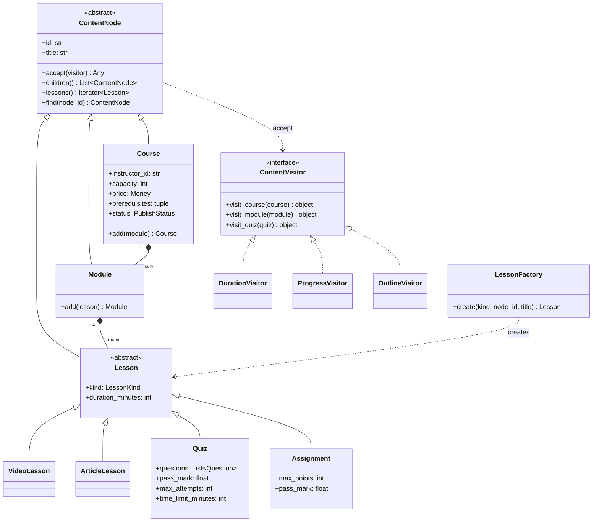
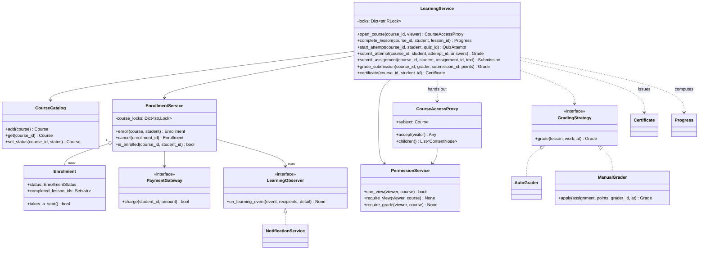
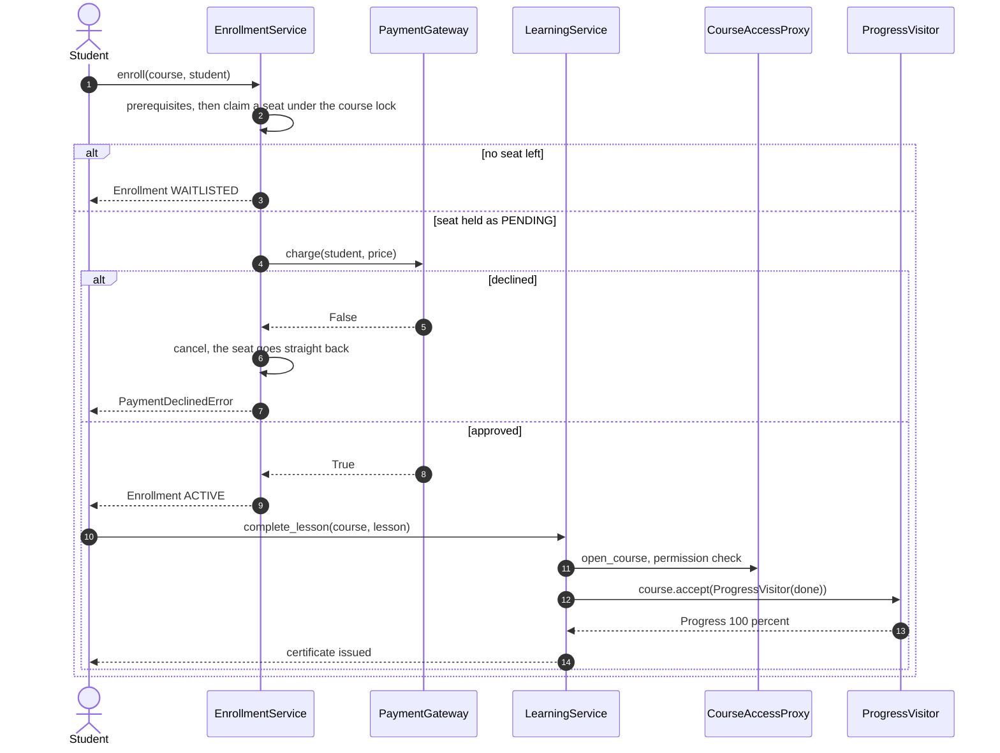
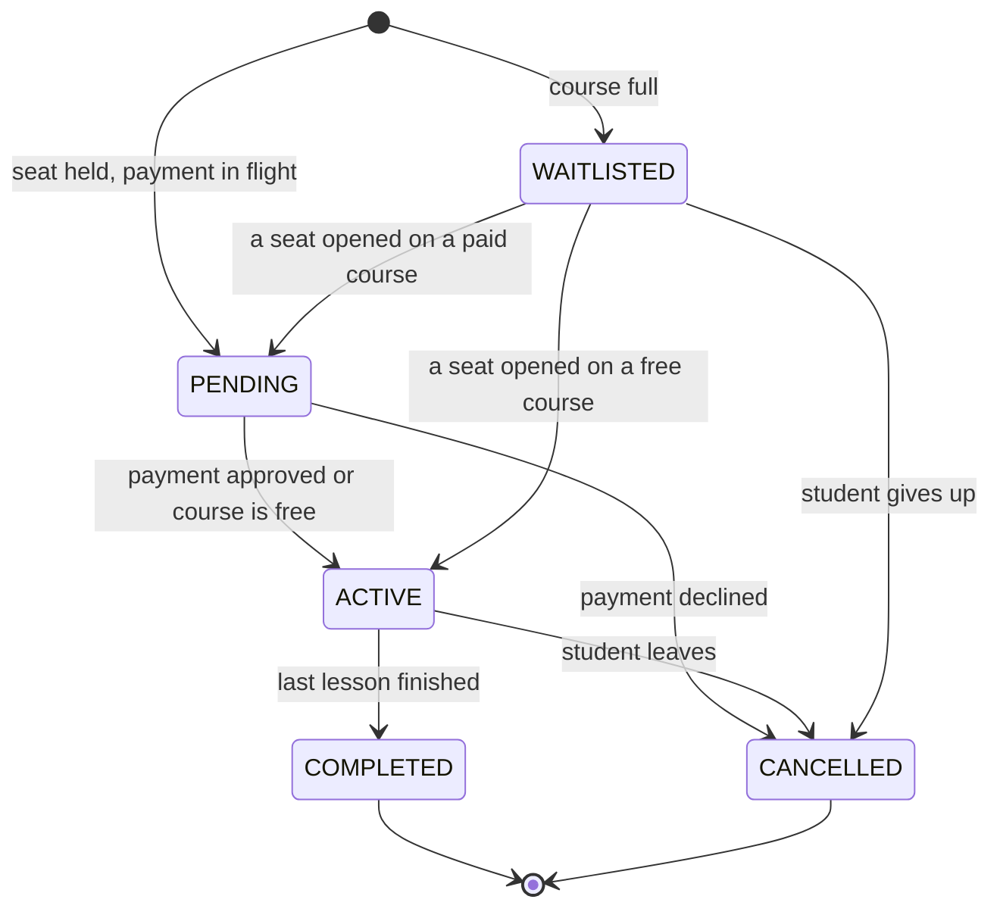

# Design a learning management system

## TL;DR

- You build a course tree (course to module to lesson), a set of Visitors that ask it questions, and services for enrollment, grading and progress.
- Three decisions carry the interview: **the tree is a Composite and every question about it is a Visitor** (duration, progress, outline), **a seat is claimed before the payment** so a full course never oversells, and **content is handed out behind a Proxy** so a draft is invisible even if you know the URL.
- Patterns that earn their place: Composite, Visitor, Proxy, Factory, Strategy, Observer, Repository. A pricing Strategy is discussed and deliberately not used.

## Problem statement

"Design a learning platform. Instructors build courses out of modules and lessons - videos, articles, quizzes and assignments - and publish them. Students enroll (free or paid), work through the lessons, take quizzes that grade themselves and hand in assignments that an instructor grades. The system tracks progress, issues a certificate at 100 percent, and notifies people. Courses have a capacity and prerequisites. Tell me what happens when the last seat is taken by two students at once, and who can see a course that has not been published yet."

## Requirements

**Functional**

- Courses contain modules; modules contain lessons: video, article, quiz and assignment.
- Instructors create courses as drafts, publish them and archive them.
- Enrollment: free or paid, capacity-limited, with prerequisite courses; a waiting list when full.
- Progress tracking per student: lessons completed, minutes done, percent.
- Quizzes are auto-graded with a pass mark, an attempt limit and a time limit; assignments are graded by a human.
- A certificate when everything in the course is finished.
- Discussions attached to lessons, and notifications for enrollment, grading and certificates.
- Roles and permissions: student, instructor, admin.

**Non-functional and constraints**

- Capacity is never exceeded, whatever the interleaving of concurrent enrollments.
- Unpublished content is unreachable for anyone but its author and admins, on every access path.
- Progress stays sane when an instructor edits a published course.
- Deterministic and testable: injected clock and IDs, in-memory repositories behind protocols.

**Out of scope**: video hosting and playback (that is the [YouTube or Netflix](../../hld/case-studies/video-streaming.md) problem), payment integration beyond a gateway interface, recommendations, live classes, plagiarism detection.

## Clarifying questions and assumptions

| Question to ask | Assumption taken here |
|---|---|
| How deep does the content tree go? | Three levels today, but modelled as a Composite so a "chapter" between them costs nothing. |
| Does submitting an assignment complete it? | No. Only a passing grade does, which is exactly what separates it from a quiz. |
| What happens when the course is full? | The student is waitlisted, not rejected, and promoted when a seat opens. A constructor flag turns this into a hard refusal. |
| Is a paid enrollment active before the money arrives? | No: `PENDING` holds the seat, `ACTIVE` follows the payment, and a decline frees the seat. |
| What counts as progress? | Lessons completed against the tree *as it is now*. Percent is derived, never stored. |
| Who can see a draft? | Its instructor and admins. Archived courses stay open to people already enrolled. |
| Do students see each other's grades? | No. Grading is permission-checked and a peer cannot grade a submission. |

## Core entities and relationships

- **ContentNode** (abstract) with `Course`, `Module` and `Lesson`; `Lesson` has `VideoLesson`, `ArticleLesson`, `Quiz` and `Assignment`. `LessonFactory` builds a leaf from imported data.
- **ContentVisitor** with `DurationVisitor`, `ProgressVisitor` and `OutlineVisitor` — three questions, zero changes to the tree.
- **CourseAccessProxy** — the same interface as `Course`, permission-checked on every call.
- **CourseCatalog** — the repository plus the publish/archive transitions; **PermissionService** — who may view, edit and grade.
- **EnrollmentService** — seats, prerequisites, payment and the waiting list; it owns one lock per course.
- **Enrollment** — student, course, `EnrollmentStatus`, and the set of completed lesson ids.
- **LearningService** — what a student does after enrolling: complete lessons, take quizzes, submit assignments, receive certificates. One lock per enrollment.
- **GradingStrategy** with `AutoGrader` (quizzes) and `ManualGrader` (assignments); **Grade**, **QuizAttempt**, **Submission**, **Certificate**, **Progress**.
- **NotificationService** — an observer of learning events.

Multiplicities: course `1 -> *` modules, module `1 -> *` lessons, course `1 -> *` enrollments (bounded by capacity), enrollment `1 -> *` completed lessons, quiz `1 -> *` questions, student `1 -> *` attempts per quiz (bounded by `max_attempts`).

## Class diagram

**The content tree and the visitors that walk it.**



**The services: enrollment, grading, permissions and the proxy.**



## Design patterns applied

| Pattern | Where | Why it earns its place |
|---|---|---|
| Composite | `ContentNode` with `Course`, `Module`, `Lesson` | "Total duration" and "percent complete" are the same recursion whatever the depth. Adding a chapter level between module and lesson touches no caller. |
| Visitor | `DurationVisitor`, `ProgressVisitor`, `OutlineVisitor` | Three questions that would otherwise be three methods on six classes. The tree is closed and the operations are open - the textbook trade, and here the trade is right because new *questions* are frequent and new *node types* are rare. |
| Proxy | `CourseAccessProxy` | Protection proxy: it has the same interface as `Course` and re-checks permission on every call, so there is no path that forgets the check. That matters more than it sounds - the usual bug is one endpoint that reads the course directly. |
| Factory Method | `LessonFactory`, `grading_for` | Imported course data is a `kind` string; the factory is the only place that maps strings to classes. |
| Strategy | `GradingStrategy` with `AutoGrader` and `ManualGrader` | Both are called the same way; the difference is that one returns a `Grade` and the other returns `None`, meaning "a human has to look at this". One call site, two behaviours. |
| Observer | `LearningObserver` -> `NotificationService` | Enrollment and grading announce; email, push and audit subscribe. Announcements happen outside every lock. |
| Repository | `CourseCatalog`, the enrollment store | Swap for SQL without touching a service. |
| State (lightweight) | `EnrollmentStatus`, `PublishStatus` | Five and three values with guarded transitions. Classes would be ceremony. |

What was deliberately *not* used: a **pricing Strategy**. The brief invites one, but a course has a single `price` field today; a strategy family with one implementation is speculative generality. Say what would change your mind: the moment coupons, regional pricing or subscriptions appear, `price` becomes `PricingStrategy.quote(student, course)` and the enrollment code is unchanged because it already asks the course, not a table.

## Key flows

**Enroll, learn, finish: the seat is held before the money moves, and progress is recomputed from the tree.**



**Enrollment lifecycle.** `PENDING` is the seat reservation, `WAITLISTED` holds no seat, and only `ACTIVE` can become `COMPLETED`.



## Implementation

Write the tree first. Everything else in this design is a question asked of it.

The enums fix the vocabulary; `EnrollmentStatus` is the one to write on the board, because `PENDING` versus `WAITLISTED` is the whole seat story.

```python title="code/lld/learning_management/models.py — enums"
--8<-- "code/lld/learning_management/models.py:enums"
```

```python title="code/lld/learning_management/models.py — errors"
--8<-- "code/lld/learning_management/models.py:errors"
```

The flat data: who is enrolled, what they answered, what they earned. Note `Progress` is a computed snapshot with a derived percent, never a stored counter that can drift.

```python title="code/lld/learning_management/models.py — entities"
--8<-- "code/lld/learning_management/models.py:entities"
```

The Composite. `accept` is the only thing every node must implement; `children` is what makes composites composite, and a leaf simply returns nothing.

```python title="code/lld/learning_management/content.py — the composite"
--8<-- "code/lld/learning_management/content.py:composite"
```

The four leaf types, and the factory that builds one from imported data. `ArticleLesson` derives its duration from its length instead of storing a number someone has to maintain.

```python title="code/lld/learning_management/content.py — lessons and the factory"
--8<-- "code/lld/learning_management/content.py:lessons"
```

Now the Visitors. Three questions, one file, and the tree classes never learned about any of them.

```python title="code/lld/learning_management/visitors.py"
--8<-- "code/lld/learning_management/visitors.py:visitor"
```

The catalogue is a plain repository with the publish transitions and no permission logic - that belongs to one service, next.

```python title="code/lld/learning_management/services.py — catalogue"
--8<-- "code/lld/learning_management/services.py:catalog"
```

`PermissionService` answers the questions; `CourseAccessProxy` is what guarantees nobody forgets to ask. The check is per call, not per handle.

```python title="code/lld/learning_management/services.py — permissions and the proxy"
--8<-- "code/lld/learning_management/services.py:permissions"
```

Enrollment is where the interview's concurrency question lives: claim the seat under the course lock, then pay, then activate.

```python title="code/lld/learning_management/services.py — enrollment"
--8<-- "code/lld/learning_management/services.py:enrollment"
```

Grading is two strategies with the same signature. `ManualGrader.grade` returning `None` is the design, not an omission: it is how one call site handles both kinds of work.

```python title="code/lld/learning_management/learning.py — grading"
--8<-- "code/lld/learning_management/learning.py:grading"
```

Finally the student-facing service. `_mark_complete` is the one place progress changes, which is why it is also the one place a certificate can be issued.

```python title="code/lld/learning_management/learning.py — the learning service"
--8<-- "code/lld/learning_management/learning.py:learning"
```

`python -m lld.learning_management.demo` runs one course end to end:

```text
C-1 Design patterns in Python: 88 minutes, seats 2
draft is invisible: course C-1 is a draft; ada cannot open it
Ada -> active (seats free: 1)
Linus -> active (seats free: 0)
Marie -> waitlisted (seats free: 0)
Design patterns in Python [published]
  Foundations
    [ ] Why patterns (video, 12 min)
    [ ] SOLID in one page (article, 6 min)
  Assessment
    [ ] Patterns quiz (quiz, 10 min)
    [ ] Refactor a god object (assignment, 60 min)
Ada after two lessons: 2/4 lessons (50.0%), 18/88 min
quiz auto-graded: 3/3 (100.0%) pass; progress 3/4 lessons (75.0%), 28/88 min
peer grading refused: linus cannot grade work in course C-1
instructor grades it: 45/50 (90.0%) pass
Ada is completed: certificate ID-6 at 100.0%
Linus cancels -> Marie moves off the waiting list to pending
10 notifications, Ada has 4
```

## Concurrency and edge cases

**Which lock protects what.**

1. `EnrollmentService._course_locks[course_id]` — one per course, held across "count the seats" and "create the enrollment". This is the capacity invariant: without it, twenty threads all read four seats taken and all get in. Per course, so enrolling in two different courses never contends.
2. `LearningService._locks[enrollment_id]` — one per enrollment, held across "record the lesson, recompute progress, issue the certificate". Two devices finishing the last two lessons at the same moment would otherwise both see 100 percent and issue two certificates.
3. `CourseCatalog._lock` and `NotificationService._lock` — the dictionaries themselves.

The ordering rule: an enrollment lock may be taken before a registry lock, never the other way round. Notifications are sent *after* every lock is released, so a slow email listener cannot hold a course's seats hostage.

**The race it prevents.** The capacity test enrolls twenty students on a five-seat course from ten threads and asserts five `ACTIVE` and fifteen `WAITLISTED`. The certificate test finishes four lessons from four threads and asserts exactly one certificate. Both fail loudly without the locks and pass deterministically with them.

**Seat before payment.** A paid enrollment goes `PENDING` under the lock, the gateway is called outside it (a network call must never be made while holding a lock), and a decline cancels the enrollment - which also promotes the first person on the waiting list. Same shape as the ATM's reserve-dispense-commit, and worth naming as such in the room.

**Unpublished content.** `require_view` distinguishes "draft" (a `NotPublishedError`, because the resource is not ready) from "denied" (a `PermissionDeniedError`). The proxy re-checks per call, so publishing a course makes an existing handle start working and archiving one makes it stop - no cached decisions.

**Attempt limits and time windows.** The attempt count is read and incremented inside the registry lock, so a student cannot get a fourth attempt by clicking twice. The time window is checked at submission against the injected clock: `now - started_at > time_limit`, which a `FakeClock` can drive without a single sleep in the tests.

**Progress when the structure changes.** Adding a lesson to a published course drops everyone from 100 percent to 80. That is the correct behaviour - the alternative, freezing each student's syllabus at enrollment, is a real product decision (cohorts) and a bigger data model. What must never happen is losing data: completed ids for removed lessons are kept and simply ignored, so restoring the lesson restores the progress. The test asserts both halves.

**Cost check.** Recomputing progress is one visitor pass over the tree. A large course of 12 modules x 8 lessons is about 100 nodes; at the estimation cheatsheet's 100 ns main-memory reference that is ~10 µs of memory traffic per pass, which is why progress is derived on demand rather than cached in a counter that can drift out of step with the tree.

!!! warning "Common mistake"
    Storing `percent_complete` on the enrollment and updating it when a lesson is finished. It looks like an optimisation and it is a bug generator: the instructor adds a lesson and every stored percentage is silently wrong, with no way to tell which are stale. Store the *facts* (which lessons this student completed), derive the number, and cache it only when a profiler says to - with an invalidation hook on course edits.

## Extensibility and follow-ups

- **Video delivery** is the HLD half of this problem: uploads, transcoding, adaptive bitrate and a CDN. The LLD boundary is `VideoLesson.url`; everything behind it is [Design YouTube or Netflix](../../hld/case-studies/video-streaming.md).
- **Cohorts and scheduled runs**: a `Cohort` between course and enrollment that pins a syllabus version and a date range. Progress then resolves against the cohort's snapshot, which is the clean answer to "the course changed under me".
- **Recommendations**: a read model over completed courses and prerequisites; the graph is already there in `Course.prerequisites`.
- **A new question type** (free text, code with tests): one `Question` subclass and one grader; `AutoGrader` becomes a chain of per-question graders.
- **Plagiarism checks**: a `SubmissionInspector` observer on the "assignment submitted" event, so the grading path is untouched.
- **Discussions and moderation**: `DiscussionPost` exists; add a `PermissionService.can_moderate` and the same proxy pattern for reading a thread on unpublished content.

!!! tip "Interview tip"
    When you draw the tree, immediately ask the interviewer: "how often do you add a new *node type* versus a new *question about the tree*?" If it is questions, Visitor is right and you say so. If it is node types, Visitor is the wrong trade and a method on the node is better. Naming the trade-off out loud is worth more than the pattern itself - it is the difference between someone who memorised Visitor and someone who knows when it hurts.

## Tests

`tests/test_learning_management.py` has 12 cases (15 with parametrisation). They map one-to-one onto the risks: the visitors compute duration and progress on a known tree; a draft is invisible to a student and open to its instructor and an admin; a peer cannot grade a submission; prerequisites block enrollment until the earlier course is completed; a quiz auto-grades and completes itself while an assignment waits for a human; the attempt limit and the time window both fire; editing a published course lowers progress without losing data; a declined payment gives the seat back; the lesson factory builds each kind; and invalid content is refused at construction.

The two worth walking through are the permission check and the capacity race:

```python title="code/lld/learning_management/tests/test_learning_management.py — drafts"
--8<-- "code/lld/learning_management/tests/test_learning_management.py:permissions"
```

```python title="code/lld/learning_management/tests/test_learning_management.py — twenty students, five seats"
--8<-- "code/lld/learning_management/tests/test_learning_management.py:capacity"
```

The certificate test is the other concurrency one: four threads finish four lessons and exactly one certificate comes out. Run everything with `uv run pytest code/lld/learning_management -q`.

## 45-minute pacing

| Minutes | What to do | What to say or write |
|---|---|---|
| 0-5 | Clarify | How deep is the tree? Free or paid? Capacity and prerequisites? Who sees drafts? Out of scope: video delivery, recommendations. |
| 5-10 | Entities | Draw course to module to lesson and name it a Composite. Then Enrollment, Progress, Grade, Certificate. |
| 10-18 | Class diagram | The tree with four leaf types, then the services beside it. Mark the two locks: per course, per enrollment. |
| 18-26 | Visitors | Write `accept` and `DurationVisitor`, then `ProgressVisitor`. Say the trade-off: new questions cheap, new node types expensive. |
| 26-34 | Enrollment | Claim the seat under the course lock, then pay, then activate. Waitlist instead of refusing; promote on cancel. |
| 34-40 | Grading and permissions | `AutoGrader` versus `ManualGrader` and the `None` return. The proxy, and why the check is per call. |
| 40-45 | Extensions | Cohorts for syllabus versioning, video delivery as the HLD hand-off, new question types. |

## Related

- [Composite](../patterns/composite.md) — the course, module and lesson tree
- [Visitor](../patterns/visitor.md) — duration, progress and outline without touching the tree
- [Proxy](../patterns/proxy.md) — the permission-checked handle on a course
- [Design an in-memory file system](in-memory-file-system.md) — the same Composite plus Visitor pair on a smaller problem
- [Design YouTube or Netflix](../../hld/case-studies/video-streaming.md) — what sits behind `VideoLesson.url` at scale
