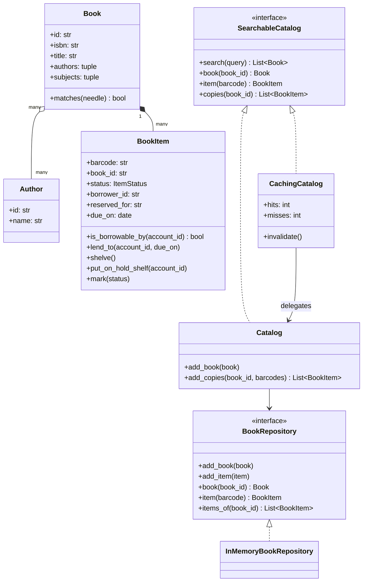
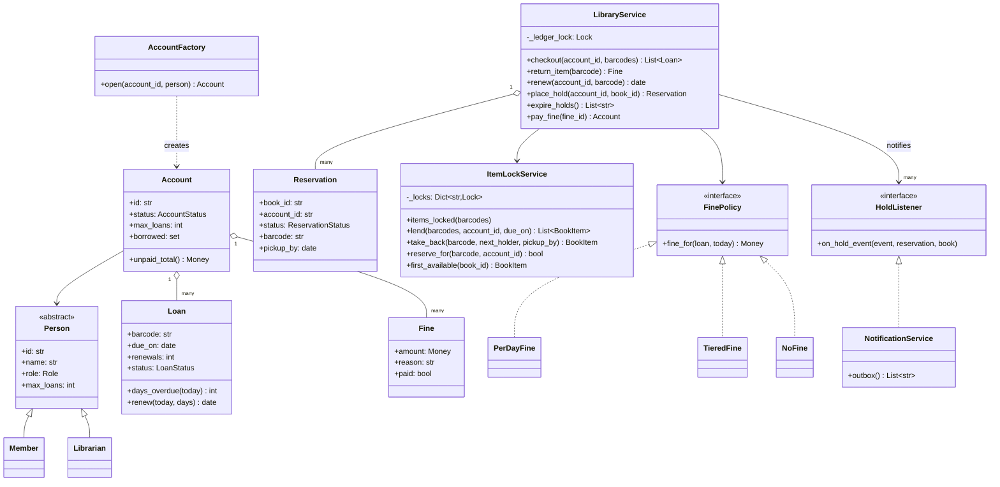
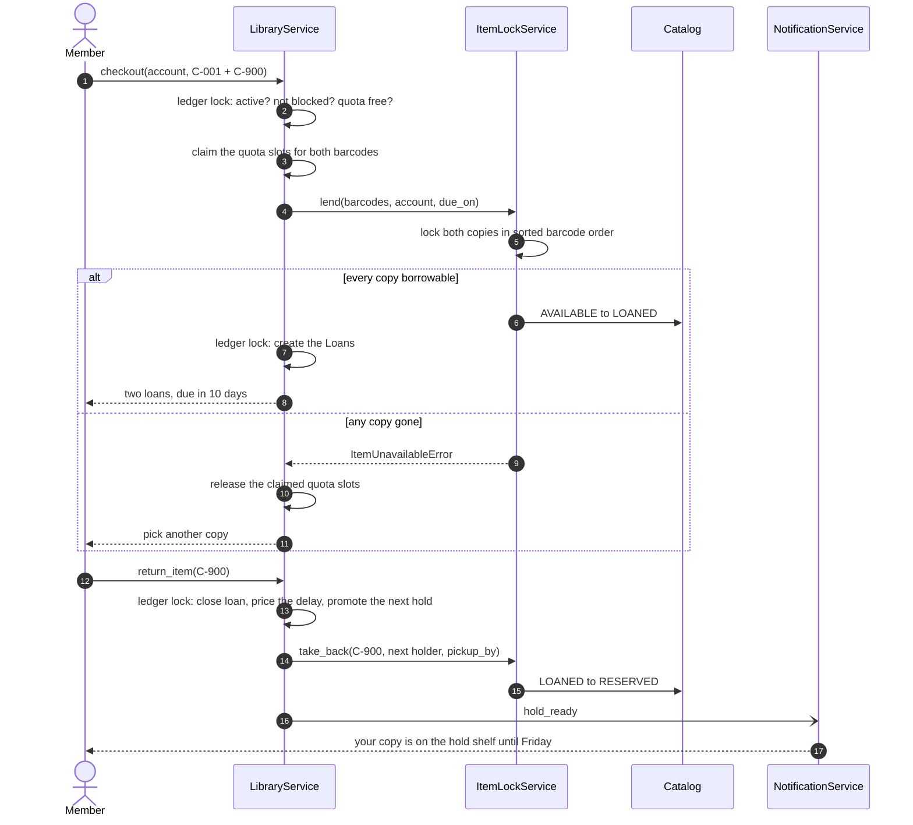
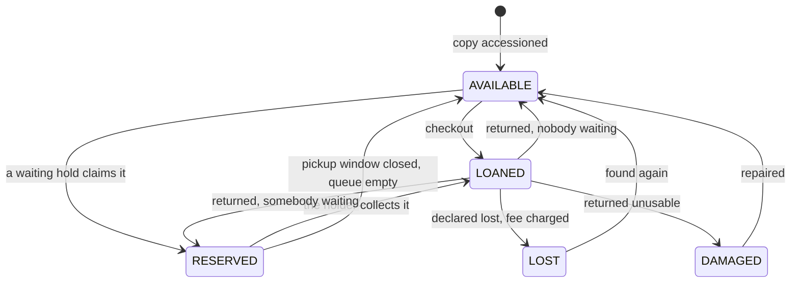
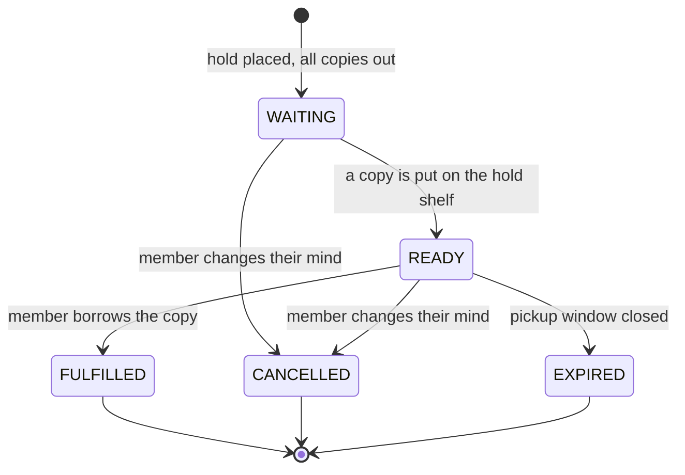

# Design a library management system

## TL;DR

- You build circulation: search the catalog, borrow barcoded copies against a quota, return them with a fine, queue holds on a title, and block members who owe money.
- Three decisions carry the interview: **`Book` (catalog record) versus `BookItem` (barcoded copy)** — you search books and borrow items; **one lock per copy plus a quota claimed before the copy is touched**, so neither the last copy nor the five-item limit can be over-issued; **a FIFO hold queue that renewals cannot jump**, promoted under the ledger lock and rolled back if the copy is gone.
- Patterns that earn their place: Repository (catalog), Proxy (a caching catalog), Observer (hold notifications), State (copy, reservation), Strategy (fines), Factory (accounts), Facade (`LibraryService`).

## Problem statement

"Design a library management system. Members search a catalog by title, author, ISBN or subject, and borrow physical copies — up to five at a time, for ten days. Returns are late sometimes, and late means a fine; members who owe too much cannot borrow. If every copy of a title is out, a member can place a hold and be notified when one comes back. Show me the classes, the lifecycle of a copy, and what happens when three members try to borrow the last copy at the same moment."

## Requirements

**Functional**

- A catalog of books; each book has one or more barcoded copies.
- Search by title, author, ISBN or subject, case-insensitively and on partial words.
- Members and librarians, each with an account and a borrowing limit (five and ten).
- Checkout of one or more copies at once, all-or-nothing, for a ten-day loan.
- Return with a fine for overdue days, capped, computed from an injected clock.
- Holds on a title, FIFO; the first copy returned goes on the hold shelf for the member at the head, with a three-day pickup window and a notification.
- Renewal, capped at two, and refused while somebody is waiting for the title.
- Copies can be marked lost or damaged, with a replacement fee for lost ones.
- Members with unpaid fines over a threshold are blocked until they pay.

**Non-functional and constraints**

- Correct under concurrency: the last copy of a popular title, and the loan quota, are the two invariants that must not break.
- Search is the hot read path and is allowed to be a little stale; availability is not.
- In-memory and single-process, behind a repository interface.
- Deterministic and testable: the clock, the ids and the fine policy are injected.

**Out of scope**: e-books and licence pools, inter-branch transfers, acquisitions and cataloguing workflow, recommendations.

## Clarifying questions and assumptions

| Question to ask | Assumption taken here |
|---|---|
| Do members borrow a title or a copy? | A copy — barcodes are what the scanner reads. But holds queue on the *title*, because any copy will do. That asymmetry is the model. |
| Is the loan period per item or per member? | Per item, ten days, injected. A reference item with a two-day loan is then a field, not a branch. |
| What blocks a member? | Unpaid fines at or over 10.00. Not "any fine" — a 25-cent fine should not lock somebody out of the library. |
| Can a renewal jump the hold queue? | No. A queue that renewals can jump is not a queue; say this out loud, it is the rule interviewers probe. |
| What happens if the hold is not collected? | The pickup window closes, the reservation expires, and the copy passes to the next member in the queue rather than back to the open shelf. |
| Is search allowed to be stale? | Yes, for a few seconds — which is what justifies the caching proxy. Availability is read live, every time. |
| Do we track who damaged a copy? | The loan does, because the copy remembers its borrower until it is returned. Charging for it is a policy call to confirm with the interviewer. |

## Core entities and relationships

- **Book** `1 → *` **BookItem**. `Book` is the immutable catalog record (ISBN, title, authors, subjects) and owns the search predicate `matches`. `BookItem` is a barcode on a shelf with a status, a borrower and a due date.
- **Author** `* → *` **Book**, modelled as a tuple on the book because nothing in circulation needs the reverse edge.
- **Person** (abstract) with **Member** and **Librarian**; each declares its own `max_loans`. **AccountFactory** opens the matching **Account**, so the desk never asks "what kind of person is this".
- **Account** `1 → *` **Loan**, `1 → *` **Fine**, and a set of currently borrowed barcodes — the quota counter.
- **Loan** — barcode, dates, renewals, status. `days_overdue` is *derived*, never stored.
- **Reservation** — a hold on a `book_id`, satisfied by whichever copy returns first. Its status machine is what makes the pickup window real.
- **ItemLockService** — owns one lock per barcode and every `BookItem` transition in the system.
- **LibraryService** — the Facade the circulation desk calls; **SearchableCatalog** with **Catalog** and the **CachingCatalog** proxy; **BookRepository** behind them; **FinePolicy** and **HoldListener** are the two injected seams.

## Class diagram

**The catalog side: a repository, a catalog, and a proxy that is indistinguishable from it.**



**The circulation side: people, loans, holds, and the two locks.**



## Design patterns applied

| Pattern | Where | Why it earns its place |
|---|---|---|
| [Repository](../patterns/repository.md) | `BookRepository`, `InMemoryBookRepository` | The catalog is the one part of this system that obviously becomes a database. Naming the boundary lets you answer "how would you persist it" with "swap this class", and it keeps the search predicate (`Book.matches`) in the domain where it can be tested. |
| [Proxy](../patterns/proxy.md) | `CachingCatalog` in front of `Catalog` | Search is the hottest read and the only one that tolerates staleness. The proxy implements the same `SearchableCatalog` protocol, so the service cannot tell them apart, and it deliberately does *not* cache availability — that would sell the same copy twice. |
| [Observer](../patterns/observer.md) | `HoldListener`, `NotificationService` | A returned copy must page the member at the head of the queue. That belongs nowhere near `return_item`, and listeners are called outside the lock so a slow mail server cannot stall the returns desk. |
| [State](../patterns/state.md) | `ItemStatus` guards on `BookItem`, `ReservationStatus` | Five copy states and five reservation states with no per-state behaviour: guard clauses inside the lock, not a class per state. Say why — it is a judgement question. |
| [Strategy](../patterns/strategy.md) | `FinePolicy` with three implementations | Fines change by board decision, by branch and by amnesty week. `PerDayFine(grace_days=3)` and `TieredFine()` are configuration, not new code paths. |
| Factory Method | `AccountFactory.open` | The person's class carries its own `max_loans`, so opening an account never branches on role. Adding a "student" tier is one subclass. |
| Facade | `LibraryService` | The desk screen calls eight methods; the catalog, the copy locks, the fine policy and the notifiers stay behind them. |

What was deliberately *not* used: **Singleton** for the catalog. Every candidate reaches for it and it is the wrong tool — the catalog is constructed once in `main` and injected, so tests build a dozen and a second branch is a second object. Also skipped: a full **State** class hierarchy for `BookItem`. Five states, no behaviour, one owner — the guard clauses are the honest implementation.

## Key flows

**Borrow, return, notify. Note where the quota is claimed: before any copy is touched.**



**Copy lifecycle. `RESERVED` is the hold shelf: the copy is back in the building but is not on sale.**



**Reservation lifecycle. The pickup window is what stops a hold shelf filling up with books nobody collects.**



## Implementation

Start with the vocabulary. Five copy states and five reservation states, written down before any logic, is what gets the interviewer nodding early.

```python title="code/lld/library_management/models.py — enums"
--8<-- "code/lld/library_management/models.py:enums"
```

Then the split that defines the problem. `Book` is immutable and owns `matches`, so search lives in the domain; `BookItem` owns its transitions, which run inside the copy lock.

```python title="code/lld/library_management/models.py — catalog records and copies"
--8<-- "code/lld/library_management/models.py:catalog_models"
```

People carry their own limit, and `AccountFactory` reads it. Adding a student tier with three loans is one subclass and zero changes at the desk.

```python title="code/lld/library_management/models.py — people and accounts"
--8<-- "code/lld/library_management/models.py:people"
```

`days_overdue` is derived from the injected clock rather than stored, because an `is_overdue` column is wrong every night at midnight.

```python title="code/lld/library_management/models.py — loans and holds"
--8<-- "code/lld/library_management/models.py:loans"
```

The catalog sits behind a repository, and the proxy in front of it is the same protocol — which is exactly what makes it a Proxy rather than a helper.

```python title="code/lld/library_management/catalog.py — repository"
--8<-- "code/lld/library_management/catalog.py:repository"
```

```python title="code/lld/library_management/catalog.py — catalog and caching proxy"
--8<-- "code/lld/library_management/catalog.py:catalog"
```

Now the contended part. Every `BookItem` transition in the system happens inside `ItemLockService`, and multi-copy operations sort the barcodes before acquiring.

```python title="code/lld/library_management/locks.py — copy locks"
--8<-- "code/lld/library_management/locks.py:item_locks"
```

The facade. Read `checkout` and `return_item` together: the quota is claimed before the copies are touched and rolled back if they are gone, and the hold is promoted before the copy moves.

```python title="code/lld/library_management/services.py — the circulation desk"
--8<-- "code/lld/library_management/services.py:library_service"
```

Fines are the policy the board changes every year, so they are a strategy with a cap:

```python title="code/lld/library_management/strategies.py — fines"
--8<-- "code/lld/library_management/strategies.py:fines"
```

Running `python -m lld.library_management.demo` walks a week at the desk:

```text
accounts: LN-1 (limit 5), LN-2 (limit 5)
search 'gaiman' -> ['American Gods']
caching proxy: 1 hit, 1 miss
LN-1 borrows ['C-001', 'C-003'], due 2026-03-21
last copy contended: copies not available: C-003
LN-2 joins the queue for Godel Escher Bach -> waiting
renewal refused: another member is waiting for b-2
returned 40 days late -> fine 10.00 USD (overdue, capped), account now blocked
notified: hold_ready: Godel Escher Bach for LN-2 (copy C-003, by 2026-05-03)
borrowing blocked: account LN-1 is blocked (owes 10.00 USD)
fine paid -> active, can borrow again
LN-2 collects the hold: fulfilled, queue for b-2 is now []
C-001 marked lost -> fee 30.00 USD, copy is lost
```

## Concurrency and edge cases

**Which lock protects what.**

1. `ItemLockService._locks` — **one `threading.Lock` per barcode**, created lazily under `_registry_lock`. It guards copy status, the borrower and the hold shelf. Three members racing for `C-001` serialise on `C-001` alone; a fourth borrowing `C-002` never waits. This is the in-process twin of a row lock on the copies table.
2. `LibraryService._ledger_lock` — guards accounts, loans, fines, reservations and the hold queues. It is never held while a copy lock is held.

**Lock ordering.** A checkout of several barcodes sorts them before acquiring, so two members scanning `C-002, C-001` and `C-001, C-002` both take `C-001` first. Acquisition is cheap — an uncontended mutex is about 17 ns, so a five-book stack costs under 100 ns, which is nothing next to the scanner.

**The last copy.** `lend` checks every copy under the locks and only then mutates any of them, so a stack is all-or-nothing. The concurrency test fires 30 members at a single copy and asserts exactly one loan, with the copy's `borrower_id` equal to that winner.

**The quota, which is the race candidates miss.** The five-item limit lives on the *account*, not on any copy, so per-copy locks alone would let two concurrent checkouts push a member to six. `checkout` therefore claims the slots under the ledger lock first, takes the copies second, and releases the slots if the copies are gone. Release exactly what you claimed, not the whole scan — a barcode the card already held never took a slot, so subtracting it would hand back quota for a book that is still out. The second concurrency test fires 12 single-book checkouts from one account and asserts that exactly five succeed.

**The hold queue.** Promotion happens under the ledger lock and the copy is claimed afterwards, never the other way round — that is what keeps the two lock families from nesting. If the copy vanished in between, `_offer` demotes the reservation back to `WAITING` at its original position in the list, so nobody loses their place. On a return the copy is still `LOANED` while the queue is popped, so the window is not a race at all.

**Renewal versus reserved.** `renew` refuses while any `WAITING` reservation exists on the title, and separately caps renewals at two. Both checks run under the ledger lock, which is also where the hold queue lives, so there is no window in which a hold is placed between the check and the extension.

**Other edge cases handled**: returning a copy twice raises rather than double-crediting; a blocked account cannot borrow *or* renew; expired holds pass the copy down the queue rather than back to the open shelf; cancelling a `READY` hold does the same; a lost copy clears the borrower and charges a replacement fee; fines are capped so a forgotten book does not accrue forever; the caching proxy is invalidated on new stock, so a newly catalogued title is findable immediately.

!!! warning "Common mistake"
    Modelling one class for a book and putting `is_available` on it. Then a library with four copies of a bestseller cannot represent "three out, one on the hold shelf", holds have nothing to attach to, and the barcode on the physical object has no home. Draw `Book "1" *-- "many" BookItem` in the first five minutes and say "you search books, you borrow items" — it is the sentence the whole design hangs on.

## Extensibility and follow-ups

- **E-books and licences.** A licence pool is a copy count without barcodes: implement `SearchableCatalog` over a counter, and the loan is time-boxed with automatic return. `LibraryService` needs no change because it already talks to the protocol, not to `Catalog`.
- **Branches.** `ItemLockService` and `LibraryService` are per-branch objects; an inter-branch transfer is a `BookItem` changing its owning branch while `IN_TRANSIT`, which is one more state on a machine you have already drawn. Cross-branch holds become the interesting part, and that is where this turns into an HLD question.
- **Overdue reminders.** A scheduled job that scans active loans and emits events to the existing `HoldListener` fan-out — the same seam the hold notifications use, so it is a new listener rather than new plumbing.
- **Recommendations.** Loans are already a member-to-book event stream; a recommender consumes it offline. Keep it out of the circulation path.
- **Persistence and search at scale.** `BookRepository` becomes SQL and `Book.matches` becomes a full-text index. A single primary handles 50k+ indexed reads per second, so a public library system will be limited by the search index long before the loans table. The caching proxy in front is the cheap first move: caching the top 20 % of queries typically absorbs most of the read traffic.
- **A different fine regime.** `PerDayFine(grace_days=3)`, `TieredFine()` and `NoFine()` already exist; per-branch policy is a constructor argument.

!!! tip "Interview tip"
    When the interviewer says "now two people want the last copy", do not jump to the lock. Say the invariant first — "exactly one loan exists for a barcode at a time, and an account never exceeds its limit" — then show the two locks that enforce them. Naming invariants before mechanisms is the single clearest senior signal in a concurrency discussion.

## Tests

`tests/test_library_management.py` has 23 cases. The hold queue is the one to walk through, because it exercises the copy lifecycle, the FIFO order and the notification in one scenario:

```python title="code/lld/library_management/tests/test_library_management.py — the hold queue"
--8<-- "code/lld/library_management/tests/test_library_management.py:holds"
```

The two concurrency tests pin the two different invariants — one copy, one loan; and one account, five items — because per-copy locking alone only gets you the first.

```python title="code/lld/library_management/tests/test_library_management.py — concurrency"
--8<-- "code/lld/library_management/tests/test_library_management.py:concurrency"
```

The rest cover: the checkout-to-return state walk; search across title, author, ISBN and subject via `parametrize`; the caching proxy hitting, missing and invalidating; the member limit, the librarian limit and the blocked-then-paid cycle; a re-scan of a copy already on the card, which must roll back only the slots *this* checkout claimed; expired holds passing the copy down the queue; renewal blocked by the cap and by a waiting hold; a cancelled hold releasing the copy; lost and damaged copies leaving circulation; and all three fine policies with grace periods and caps. Run them with `uv run pytest code/lld/library_management -q`.

## 45-minute pacing

| Minutes | What to do | What to say or write |
|---|---|---|
| 0–5 | Clarify | Book or copy? Loan period and limit? What blocks a member? Can renewals jump the queue? Park e-books and branches. |
| 5–11 | Entities | Draw `Book "1" *-- "many" BookItem` first and say the sentence. Then Account, Loan, Reservation, Fine. |
| 11–18 | State machines | Copy (five states) and Reservation (five). Mark the hold shelf and the pickup window. |
| 18–24 | Class diagram | Catalog behind a repository, the facade in the middle, fine policy and listeners hanging off. Mark the two locks. |
| 24–35 | Code | `BookItem.is_borrowable_by` → `items_locked` (say "sorted") → `lend` (say "check all, then lend all") → `checkout` (say "claim the quota first") → `return_item` (say "promote, then move the copy"). |
| 35–42 | Concurrency | The last copy *and* the quota — two invariants, two locks. Describe both concurrency tests. |
| 42–45 | Extensions | Licence pools behind the same protocol, branches with an in-transit state, reminders as another listener. |

## Related

- [Repository](../patterns/repository.md) — the catalog persistence boundary
- [Proxy](../patterns/proxy.md) — `CachingCatalog` and why availability is not cached
- [Observer](../patterns/observer.md) — hold notifications off the returns path
- [Design a hotel management system](hotel-management.md) — the sibling contended-resource problem, over date ranges
- [State](../patterns/state.md) — the copy and reservation machines
- [Strategy](../patterns/strategy.md) — the fine policies
