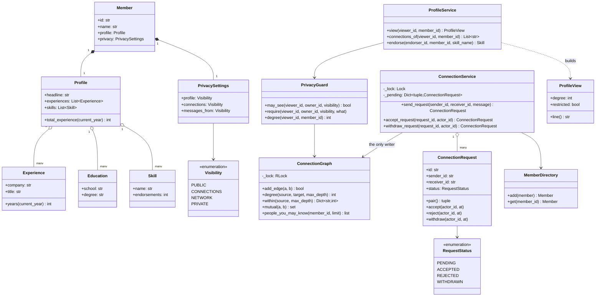
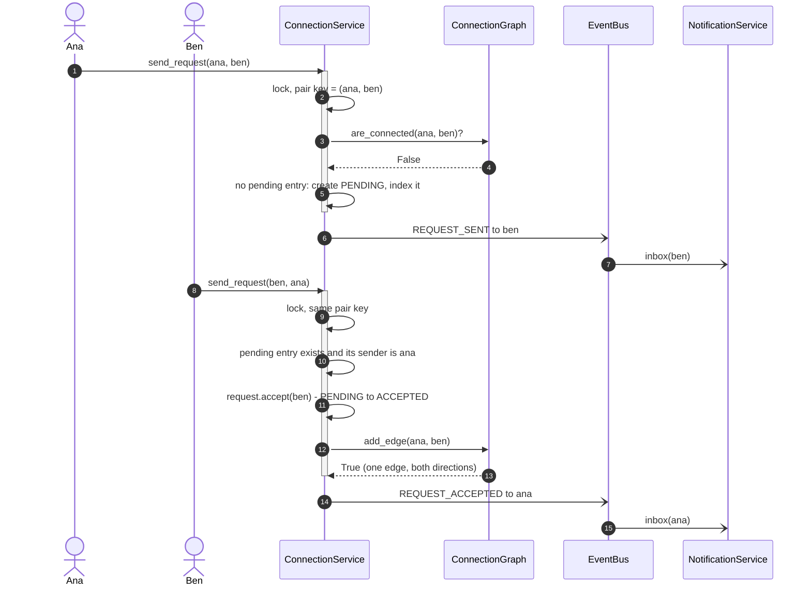
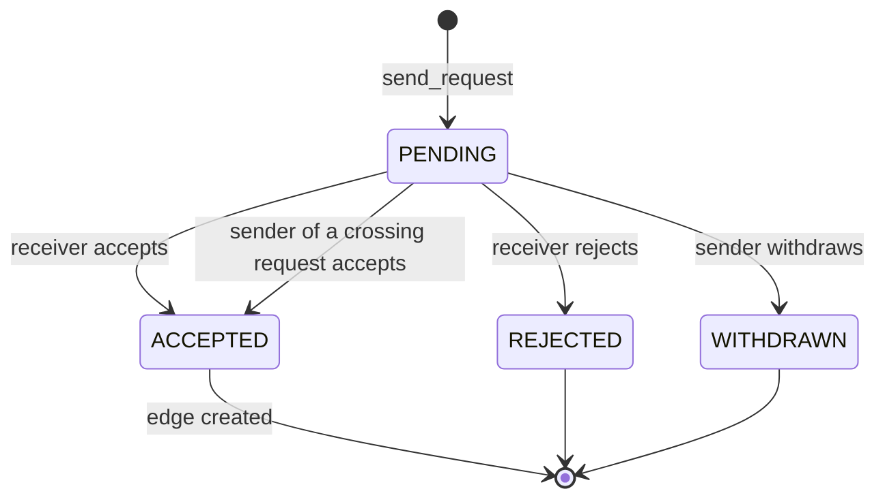

# Design LinkedIn (social network)

## TL;DR

- You build a `ConnectionGraph` with a depth-limited BFS, a `ConnectionService` that turns requests into edges, a `PrivacyGuard` every read passes through, and feed, messaging and job services layered on top.
- Three decisions carry the interview: **the pending index is keyed by the unordered pair**, so two members requesting each other cross into exactly one auto-accept; **the BFS stops at three hops**, because a fourth reaches most of the network and answers nothing; **privacy is evaluated at read time**, never baked into what was written.
- Event Bus, State and Specification earn their place. Fan-out on write for the feed is discussed and deliberately *not* used.

## Problem statement

"Design a professional network. Members have profiles with experience, education and skills. They send connection requests that the other side accepts, rejects or that the sender withdraws, and the network shows how far apart any two members are — first, second or third degree. Members post updates that their connections see, message each other, and apply to jobs. Privacy settings control who sees what. Focus on the graph, the request lifecycle, and what happens when two people send each other a request at the same moment."

## Requirements

**Functional**

- Profiles: headline, summary, experiences, educations and endorsable skills.
- Connection requests: send with a note, accept, reject, withdraw. One pending request per pair; when two members request each other, the second one accepts the first rather than creating a duplicate.
- Degrees: first, second and third, computed by BFS with a hard depth limit. "People you may know" ranks second-degree members by mutual connections.
- Follow (one-way) in addition to connect (two-way).
- Posts with a visibility, reactions (one per member) and comments; a chronological feed with a pluggable ranking.
- Direct messages, gated by the recipient's "who may message me" setting.
- Companies, job postings, composable job search filters, and applications with a status.
- Notifications for requests, accepts, posts, reactions, messages and applications.
- Privacy settings for the profile, the connection list and messaging, applied on every read.

**Non-functional and constraints**

- Two crossing requests must produce exactly one edge and exactly one accepted request.
- A traversal must be bounded: no read may walk an unbounded slice of the graph.
- In-memory, single process; deterministic and testable with an injected clock and ID generator.

**Out of scope**: ranking quality, search relevance, group pages, InMail billing, recruiter tooling, the real notification transport.

## Clarifying questions and assumptions

| Question to ask | Assumption taken here |
|---|---|
| What if A and B request each other at the same instant? | The second request auto-accepts the first. One edge, one `ACCEPTED` row, no second request. This is the whole concurrency section. |
| How deep do degrees go? | Three. `degree()` takes `max_depth` so the limit is policy, not a hard-coded number, but the default stays at 3. |
| Is a follow the same as a connection? | No. Connections are undirected and mutual; follows are one-way and feed-only. |
| Are privacy rules applied when writing or reading? | Reading. A member who tightens their settings must change what every future read returns, including reads of data written years ago. |
| Is the feed pushed or pulled? | Pulled. Fan-out on write is the HLD answer; in one process a pull with a read-time filter is simpler and always correct. |
| Can you re-send a request after a rejection? | Yes — the rejected request stays resolved and a new one can be created. Rate limiting that is a follow-up, not a class. |
| Do we model blocks? | Not as a separate list; `Visibility.PRIVATE` covers the read side. A denylist is one more check in `PrivacyGuard`. |

## Core entities and relationships

- **Member** `1 → 1` **Profile** (experiences, educations, skills) and `1 → 1` **PrivacySettings**.
- **ConnectionRequest** — sender, receiver, note, `RequestStatus` and a `pair()` key that is the same for A→B and B→A. That key is what makes crossing requests collide on purpose.
- **ConnectionGraph** — an undirected adjacency map plus a one-way follow map. It knows nothing about requests, privacy or feeds.
- **ConnectionService** — the only writer of the graph; owns the request table and the pending-pair index.
- **PrivacyGuard** — one function, `may_see(viewer, owner, visibility)`, consulted by every read path. **ProfileService** builds a `ProfileView` per viewer.
- **Post** `1 → *` **Comment**, `1 → *` **Reaction** (one per member, so the dict key is the constraint). **FeedService** resolves the audience, then filters by each post's visibility.
- **Job**, **Company**, **JobApplication**; **JobSpec** filters compose with `&`, `|` and `~`.
- **Conversation** `1 → *` **Message**, keyed by the participant pair.
- **EventBus** and **NetworkEvent** — every service publishes, `NotificationService` listens.

Multiplicities: member `1 → *` requests sent and received, member `* ↔ *` members (connections), member `1 → *` posts, post `1 → *` comments, job `1 → *` applications.

## Class diagram

**The graph, the requests and the profile side.**



**The surfaces: feed, messaging, jobs and the event bus.**

```mermaid
classDiagram
    class FeedService {
        +publish(author_id, text, visibility) Post
        +react(post_id, member_id, reaction) Post
        +comment(post_id, author_id, text) Comment
        +feed(viewer_id, ranking, limit) List~Post~
    }
    class Post {
        +author_id: str
        +visibility: Visibility
        +reactions: Dict~str,Reaction~
        +engagement() int
    }
    class Comment {
        +post_id: str
        +author_id: str
        +text: str
    }
    class Reaction {
        +member_id: str
        +type: ReactionType
    }
    class FeedRanking {
        <<interface>>
        +rank(posts) List~Post~
    }
    class ChronologicalFeed
    class EngagementFeed
    class DegreeWeightedFeed
    class MessagingService {
        +send(sender_id, recipient_id, text) Message
        +conversation(viewer_id, other_id) Conversation
    }
    class Conversation {
        +participants: frozenset
        +messages: List~Message~
    }
    class Message {
        +sender_id: str
        +text: str
    }
    class JobService {
        +post_job(company_id, title, location, remote, min_experience, skills) Job
        +search(spec, limit) List~Job~
        +apply(job_id, member_id) JobApplication
    }
    class Job {
        +title: str
        +location: str
        +remote: bool
        +min_experience: int
    }
    class JobApplication {
        +status: ApplicationStatus
    }
    class JobSpec {
        <<abstract>>
        +is_satisfied_by(job) bool
        +describe() str
    }
    class AndSpec
    class RemoteOnly
    class RequiresSkill
    class MaxExperience
    class EventBus {
        +subscribe(event_type, handler)
        +publish(event)
    }
    class NotificationService {
        +messages(member_id) List~str~
        +unread(member_id) int
    }
    class PrivacyGuard
    FeedService "1" o-- "many" Post
    FeedService --> FeedRanking
    FeedService --> PrivacyGuard
    Post "1" o-- "many" Comment
    Post "1" o-- "many" Reaction
    FeedRanking <|.. ChronologicalFeed
    FeedRanking <|.. EngagementFeed
    FeedRanking <|.. DegreeWeightedFeed
    MessagingService --> PrivacyGuard
    MessagingService "1" o-- "many" Conversation
    Conversation "1" *-- "many" Message
    JobService "1" o-- "many" Job
    JobService "1" o-- "many" JobApplication
    JobService --> JobSpec
    JobSpec <|-- AndSpec
    JobSpec <|-- RemoteOnly
    JobSpec <|-- RequiresSkill
    JobSpec <|-- MaxExperience
    EventBus --> NotificationService : notifies
```



## Design patterns applied

| Pattern | Where | Why it earns its place |
|---|---|---|
| State (lightweight) | `ConnectionRequest` with `accept` / `reject` / `withdraw` | Four states, and each transition names *who* may make it. `_resolve` checks status and actor in one place, so "the sender cannot accept their own request" is one line, not a rule in three services. |
| Event Bus | `EventBus` → `NotificationService` | Five services publish; none of them imports a notifier. Handlers are copied under the lock and called outside it, so a slow listener never stalls the graph. |
| Specification | `JobSpec` with `&`, `|`, `~` | `RequiresSkill("python") & RemoteOnly() & MaxExperience(6)` is one object. `JobService.search` takes a spec, not eight optional parameters. |
| Strategy | `FeedRanking` (chronological, engagement, degree-weighted) | Ranking is the thing product will change weekly. `DegreeWeightedFeed` takes the degree map as data, so ranking never reaches into the graph. |
| Facade | `ProfileService`, `FeedService`, `JobService` | Each surface is one class with a small verb set; the graph, the guard and the bus stay behind them. |
| Repository | `MemberDirectory` | The persistence seam. Services depend on it, never on a dict. |
| Value object | `ProfileView` | A frozen, per-viewer projection. Because it is built per read, it cannot be cached by accident and leak a tightened setting. |
| Dependency injection | `Clock`, `IdGenerator`, `FeedRanking`, `PrivacyGuard` | Every test asserts exact ids and timestamps, and swaps the ranking without touching the service. |

What was deliberately *not* used: **fan-out on write** for the feed. Precomputing an inbox per member is the right answer at scale and the wrong answer here — it duplicates every post, and a privacy change would have to rewrite every inbox that already holds it. Pull the audience at read time and filter; then say out loud that a real system flips to fan-out on write for members with few followers and keeps a pull path for the ones with many. That trade-off is the [Design a news feed](../../hld/case-studies/news-feed.md) conversation.

## Key flows

**Send a request that crosses one already in flight.** The pending index is keyed by the unordered pair, so the second sender finds the first request and accepts it instead of creating a twin.



**Connection request lifecycle.** Every arrow names the actor allowed to pull it, which is why the status lives on the request rather than in the service.



## Implementation

Build it in the order the interviewer follows: the vocabulary, the request that owns its own transitions, the graph, the service that joins them, then the read-time guard.

The enums are the vocabulary, and `Visibility` is the one that shows up in four different places later:

```python title="code/lld/linkedin/models.py — the vocabulary"
--8<-- "code/lld/linkedin/models.py:enums"
```

The request owns its state machine. Look at `pair()` — that unordered key is what makes the crossing case collide on purpose — and at `_resolve`, which checks the status and the actor together so no service can forget either:

```python title="code/lld/linkedin/models.py — the request and the entities"
--8<-- "code/lld/linkedin/models.py:entities"
```

The graph knows only about edges. BFS is bounded twice, by depth and by a node budget, and the docstring says why a fourth hop is not worth computing:

```python title="code/lld/linkedin/graph.py — the connection graph"
--8<-- "code/lld/linkedin/graph.py:graph"
```

`ConnectionService` is the only writer of the graph. `send_request` is the method to walk through line by line: it looks up the pending entry by pair, and the branch where one already exists *from the other side* is the auto-accept:

```python title="code/lld/linkedin/services.py — requests and the crossing case"
--8<-- "code/lld/linkedin/services.py:connections"
```

Every read goes through `PrivacyGuard`. Four visibility levels map to four one-line rules, and `ProfileService.view` rebuilds a `ProfileView` for this viewer on every call:

```python title="code/lld/linkedin/services.py — read-time privacy"
--8<-- "code/lld/linkedin/services.py:privacy"
```

The feed resolves the audience from the graph and then filters by each post's visibility. Those are two different questions, and answering only the first is the bug this design exists to avoid:

```python title="code/lld/linkedin/feeds.py — the feed"
--8<-- "code/lld/linkedin/feeds.py:feed"
```

The event bus copies handlers under its lock and calls them outside it:

```python title="code/lld/linkedin/events.py — the event bus and notifications"
--8<-- "code/lld/linkedin/events.py:bus"
```

Running `python -m lld.linkedin.demo` walks a five-member network:

```text
ana->ben is accepted; ben->ana returned request r-1 (accepted)
edges after the crossing: 1
degrees from ana: [('ben', 1), ('cara', 2), ('dev', 3), ('eve', None)]
people ana may know: [('cara', 1)]
ana sees cara: Cara (2nd) - Cara the engineer
ana sees eve:  Eve (out of network) - Eve the engineer [restricted]
connection list blocked: ana may not see the connection list of eve
request r-5 is now withdrawn; eve has 0 pending
ana feed: ['Hiring backend engineers', 'Shipped the scheduler']
jobs for a 6-year engineer: ['Backend engineer']
application j-4 is submitted
ana inbox (3): ['ben is now a connection: worked together', 'ben posted an update']
```

Two lines repay a second look. `eve` is four hops from `ana` in a five-member chain, so `degree` returns `None` — not an error, just "out of network", and that is what the profile view renders. And the feed shows Cara's public post but not her connections-only one, even though Ana follows Cara: being in the audience and being allowed to see a post are different questions.

## Concurrency and edge cases

**Which lock protects what**, and in which order:

1. `ConnectionService._lock` guards the request table and the pending-pair index. Every request write takes it, and the whole crossing decision — look up the pair, decide, mutate the request, add the edge — happens inside it.
2. `ConnectionGraph._lock` (an `RLock`) guards the adjacency and follow maps. It is always acquired *while* the service lock is held, never before it, so the pair cannot deadlock. `add_edge` also sorts the two ids before touching them, so nested edge work has a fixed order.
3. `MemberDirectory._lock`, `FeedService._lock`, `MessagingService._lock`, `JobService._lock` and `EventBus._lock` each guard one dict and are never held across a call into another service.

Handlers on the bus run after every lock is released. That is not a micro-optimisation: a notification handler that blocked would otherwise hold the graph lock while it worked.

**The crossing-request race.** Ana taps connect on Ben's profile at the same millisecond Ben taps connect on Ana's. Both threads reach `send_request`, and both compute the same pair key because `_pair` sorts the two ids. One wins the lock and finds no entry, so it creates the `PENDING` request. The other wins the lock next, finds an entry whose sender is *the other member*, and accepts it. The test fires 20 calls through 10 threads, ten each way, and asserts exactly one `PENDING` result, exactly one `ACCEPTED` result, exactly one edge and nothing left pending — the remaining eighteen calls fail cleanly with `DuplicateRequestError` or `AlreadyConnectedError`.

**Bounding the traversal.** BFS holds the graph lock for the whole walk, which is only safe because the walk is bounded: three hops by default and a `NODE_BUDGET` of 50,000 visited nodes. The arithmetic is worth saying: with an average of 500 connections, the third degree is roughly 500³ = 125M members, so an unbounded traversal is not slow, it is meaningless. The budget turns a pathological hub into a wrong-but-fast `None` rather than a stalled service, and the honest follow-up is that at real scale this read leaves the process entirely for a graph store.

**Privacy at read time.** The test tightens Cara's settings between two identical `view()` calls and asserts the second one comes back restricted with no experiences. That is the property a write-time filter cannot give you, and it is worth demonstrating rather than asserting.

**Other edge cases handled**: connecting, following or messaging yourself; a duplicate request in the same direction; the sender trying to accept or the receiver trying to withdraw; acting on a request that is already resolved; endorsing someone you are not connected to; reacting twice (the member id is the dict key, so the second reaction replaces the first); applying to the same job twice (idempotent, returns the existing application); reading the connection list of someone whose setting forbids it; and a post from someone outside the audience never appearing however public it is.

!!! warning "Common mistake"
    Keying the pending-request index by `(sender, receiver)`. It reads naturally, it passes every single-threaded test, and it lets A→B and B→A both become pending — two rows, two accepts, and either a duplicate edge or a graph that disagrees with the request table. The key must be the *unordered* pair. In SQL that is a unique index on `(least(a, b), greatest(a, b))`; in memory it is one `sorted()` call.

## Extensibility and follow-ups

- **People you may know at depth 3**: `within(member, 3)` already returns everyone with their degree. Rank by mutual count and shared employers, and the method stays inside `ConnectionGraph`.
- **Blocks and denylists**: one more check in `PrivacyGuard.may_see` plus a denylist set on the graph. Every read path inherits it because every read path already goes through the guard.
- **Feed at scale**: flip to fan-out on write with a pull path for high-follower members, and cache the audience set. The visibility filter stays at read time — see [Design a news feed](../../hld/case-studies/news-feed.md).
- **A real graph store**: `ConnectionGraph` has nine methods and no knowledge of requests. Reimplement them over a graph database and nothing above it changes.
- **Messaging at scale**: conversations keyed by participant set become their own service with a per-conversation lock and a sequence number per message.
- **Search across members and jobs**: `JobSpec` is already the interface an index would sit behind, exactly as in [Design Stack Overflow](stack-overflow.md).

!!! tip "Interview tip"
    Say the words "unordered pair" as soon as connection requests come up, before anyone mentions concurrency. It tells the interviewer you have seen this problem in production, and it usually earns you the follow-up you want — "how would you enforce that in a database?" — which you answer with a unique index on the sorted pair.

## Tests

`tests/test_linkedin.py` has 14 cases built on one wired-up `Network` fixture. The crossing-request test is the one to walk through:

```python title="code/lld/linkedin/tests/test_linkedin.py — crossing requests"
--8<-- "code/lld/linkedin/tests/test_linkedin.py:crossing"
```

The privacy test proves the rule is evaluated per read by changing the setting between two identical calls:

```python title="code/lld/linkedin/tests/test_linkedin.py — read-time privacy"
--8<-- "code/lld/linkedin/tests/test_linkedin.py:privacy"
```

The rest cover: send-then-accept producing one edge and two notifications; request validation and wrong-actor transitions; degrees 0 to 3 and `None` beyond the limit via `parametrize`, including proof that the limit is a parameter; people-you-may-know ranked by mutual connections; the feed showing the audience intersected with each post's visibility, plus one reaction per member and a swapped ranking; messaging gated by the recipient's policy; and job search composing four specifications with idempotent applications. Run them with `uv run pytest code/lld/linkedin -q`.

## 45-minute pacing

| Minutes | What to do | What to say or write |
|---|---|---|
| 0–5 | Clarify | What happens when two people request each other? How deep do degrees go? Is privacy applied on write or read? Out of scope: ranking quality, recruiter tooling. |
| 5–10 | Entities | Nouns: Member, Profile, ConnectionRequest, ConnectionGraph, Post, Job, Conversation. Draw the graph as a separate box from the service straight away. |
| 10–17 | Class diagram | Graph and requests first, then hang `PrivacyGuard` between the services and the graph. Mark the two locks and their order. |
| 17–25 | The request flow | Write `send_request` on the board. Say "unordered pair" and draw the crossing case with two arrows into one slot. |
| 25–32 | Degrees | BFS with a depth limit; show the 500³ arithmetic for why three hops is the end. Then `people_you_may_know` as a use of the same walk. |
| 32–38 | Privacy and feed | `may_see` as four one-line rules; feed as audience ∩ visibility. Say why fan-out on write is the wrong answer in one process. |
| 38–43 | Tests | The 20-call crossing race and its four assertions; the tighten-then-read privacy test. |
| 43–45 | Extensions | Blocks, a graph store, feed fan-out as the HLD hand-off. |

## Related

- [Observer](../patterns/observer.md) — the event bus behind every notification
- [Specification](../patterns/specification.md) — the job filter algebra
- [State](../patterns/state.md) — the connection request's guarded transitions
- [Design Stack Overflow](stack-overflow.md) — the same Specification and event shapes over threads instead of a graph
- [Design a news feed](../../hld/case-studies/news-feed.md) — what the feed becomes at fan-out scale
- [Design a notification system](../../hld/case-studies/notification-system.md) — delivering what the event bus publishes
