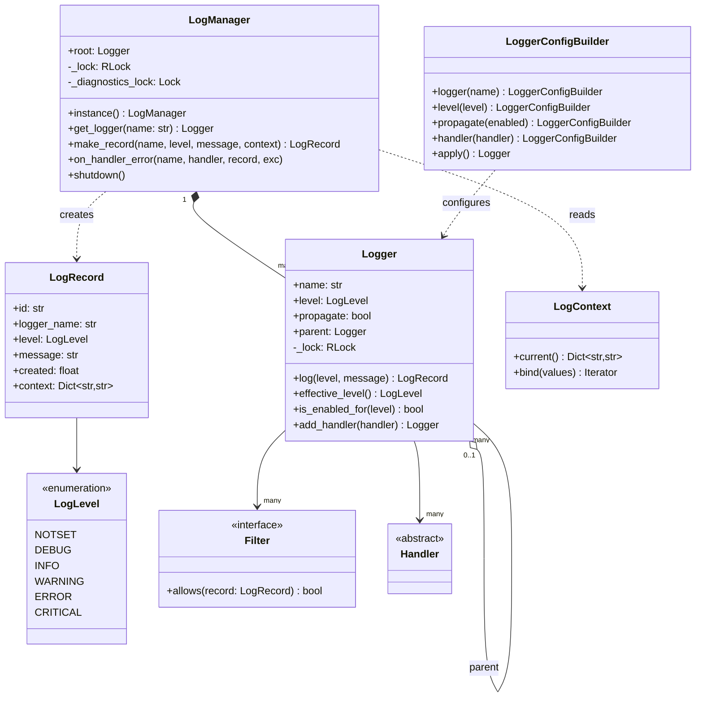
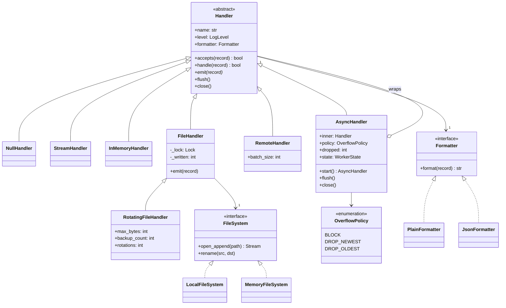
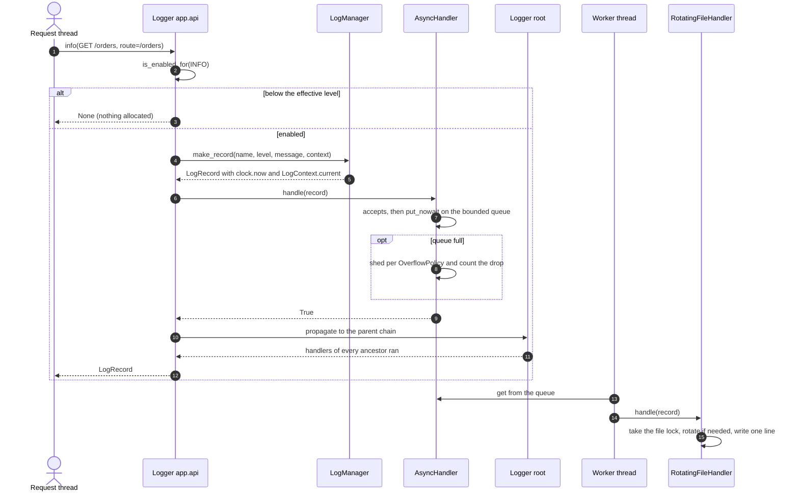
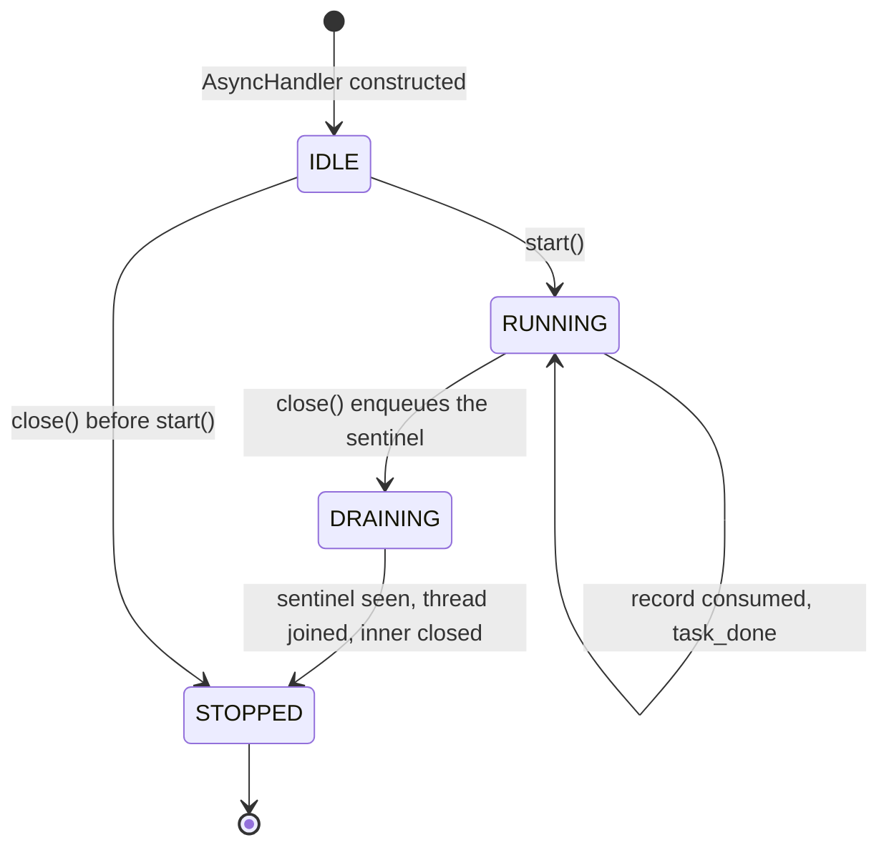

# Design a logging framework

## TL;DR

- You build a dotted logger hierarchy (`app.api.auth`) where the *threshold* is inherited upwards and the *record* is propagated upwards through every ancestor's handlers.
- Three decisions carry the interview: **the two axes** (handlers are destinations, formatters are representations — Bridge, not a subclass matrix), **the bounded queue** in front of slow sinks with a named overflow policy, and **failure isolation** so a full disk never raises into the caller.
- Patterns that earn their place: Chain of Responsibility, Bridge, Decorator (async), Builder, Null Object. Singleton appears exactly once, on the registry, and you say why.

## Problem statement

"Design a logging framework that an application team would use instead of writing to standard output. Modules should get a logger by name and inherit configuration from their parent; each logger fans out to handlers — console, file, rotating file, an in-memory buffer for tests, a remote shipper — and each handler decides how records are rendered. It has to be safe from many threads, it must not block a request thread on a slow sink, and nothing may be lost at shutdown."

## Requirements

**Functional**

- Levels `DEBUG < INFO < WARNING < ERROR < CRITICAL`, filtered at both the logger and the handler.
- Handlers: console (stream), file, size-based rotating file, in-memory, and a remote shipper behind a transport interface.
- Formatters: plain human-readable text and one JSON object per line; any handler can use any formatter.
- A dotted logger hierarchy where `a.b.c` inherits its level from `a.b`, then `a`, then the root, and propagates records to their handlers.
- Filters as predicates on a record: by name subtree, by level range, sampled, or rate limited.
- An async handler that moves work off the calling thread through a bounded queue.
- Thread safety, fluent configuration through a builder, and a shutdown that flushes everything.
- Structured context (a correlation id) attached without changing call signatures.

**Non-functional and constraints**

- A disabled log call is one integer comparison, allocating nothing.
- A failing handler must never propagate an exception to the application.
- Contention is per handler, not global: two files being written are two independent locks.
- In-memory, single process, standard library only. Time and IDs are injected, so tests are deterministic.

**Out of scope**: log parsing, a query language, alerting rules, and cross-process aggregation — that is the [Observability, SLOs and error budgets](../../hld/fundamentals/observability-and-slos.md) conversation.

## Clarifying questions and assumptions

| Question to ask | Assumption taken here |
|---|---|
| Do loggers form a hierarchy, or is a logger a flat named channel? | A hierarchy. It is the feature that makes "turn on DEBUG for the whole payments subtree" a one-line change. |
| When a child and its parent both have handlers, do both run? | Yes — that is propagation, and `propagate=False` is the escape hatch for an audit logger that must not leak to the console. |
| Is the framework allowed to block the caller? | Only when you configure it to. The default async policy sheds load and counts drops; `BLOCK` is available and is a deliberate choice. |
| What happens when a handler raises? | It is recorded in the manager's diagnostics and the siblings still run. An application must not die because a log volume filled up. |
| Should there be one global logger registry? | Yes, one `LogManager` per process, reachable through `instance()`. The constructor stays public so tests never share state. |
| How is the correlation id passed? | Ambiently, through a `ContextVar`, so no call signature grows a `trace_id` parameter. |

## Core entities and relationships

- **LogLevel** — an ordered `IntEnum`. `NOTSET = 0` means "ask my parent"; that single value is what makes level inheritance work.
- **LogRecord** — the immutable event: id, logger name, level, message, creation time (from the injected `Clock`), thread name and a context dict. One record is shared by every handler in the chain, so it is frozen.
- **Logger** — a node in the dotted tree, holding its own level, its own handlers, its own filters and a `propagate` flag. `1 → *` handlers, `1 → 0..1` parent.
- **LogManager** — the registry. It owns the root logger, mints records (clock + ids + ambient context), collects handler failures, and drives shutdown. `1 → *` loggers.
- **Handler** (abstract) — a destination with its own threshold and filters: `NullHandler`, `StreamHandler`, `InMemoryHandler`, `FileHandler`, `RotatingFileHandler`, `RemoteHandler`, and `AsyncHandler`, which wraps any other handler.
- **Formatter** (protocol) — `PlainFormatter` and `JsonFormatter`. A handler *has a* formatter; it does not *inherit* one.
- **FileSystem** and **Transport** (protocols) — injected so rotation and shipping are testable without a disk or a socket.
- **Filter** (protocol) — `LevelRangeFilter`, `NamePrefixFilter`, `RateLimitFilter`, `SamplingFilter`, attachable to either.
- **LogContext** — ambient key/value pairs bound around a unit of work; **LoggerConfigBuilder** — the fluent front door.

## Class diagram

**Structure: the hierarchy, the registry and the record that flows through them.**



**Behaviour: the Bridge. Destinations on the left, representations on the right, and the async Decorator on top.**



## Design patterns applied

| Pattern | Where | Why it earns its place |
|---|---|---|
| Chain of Responsibility | `Logger._dispatch` walking `self → parent → … → root` | Two behaviours ride the same chain: the threshold is inherited, the record is propagated. Configuring one subtree configures everything under it, and `propagate=False` cuts the chain at exactly one node. |
| Bridge | `Handler` × `Formatter` | Destination and representation vary independently. Without it you get `JsonFileHandler`, `PlainFileHandler`, `JsonRemoteHandler` — an `n × m` matrix. With it, a `CsvFormatter` is one class every handler can use. |
| Decorator | `AsyncHandler(inner)` | Asynchrony is orthogonal to destination. Any handler becomes non-blocking by being wrapped, and the wrapper is itself a `Handler`, so the logger cannot tell. |
| Builder | `LoggerConfigBuilder` | Configuration has many optional knobs and one invalid half-built state (no handlers *and* no propagation). It validates once, and `apply()` is the only method that mutates a live logger — exactly what config reload needs. |
| Singleton | `LogManager.instance()`, double-checked | The registry is genuinely process-wide: two of them mean two roots and two shutdown paths. The constructor stays public, so tests build isolated managers. |
| Null Object | `NullHandler` | A library attaches one so it never has to ask "did the application configure logging?" and never warns about a missing handler. |
| Factory Method | `LogManager.get_logger(name)` | Idempotent, and it builds the ancestor chain eagerly so a late `get_logger("app")` never has to re-parent an existing `app.api`. |
| Strategy | `Filter` implementations, `OverflowPolicy` | Sampling, rate limiting and shedding are policies you swap, not `if` branches inside the emit path. |
| Template Method | `Handler.handle` calling `emit` | `handle` fixes the policy (threshold, then filters, then emit); subclasses supply only the varying step. |

Deliberately **not** used: an Observer registry for handlers. It looks like Observer — one producer, many listeners — but Observer implies decoupled, unordered, best-effort notification, whereas here handler order on a logger is defined, delivery is synchronous by default, and the caller needs the return value. Also not used: a State class per `WorkerState`; four values with guarded transitions are an enum, not four objects.

## Key flows

**The hot path: one call, a threshold check, one record, and the walk up the chain.**



**The async worker's lifecycle.** `DRAINING` is what makes shutdown honest: `close()` puts a sentinel behind the backlog and joins, so every record already queued is written before the file descriptor closes.



## Implementation

Write it in the order you would defend it: the vocabulary, then the record, then the two Bridge axes, then the hierarchy, and only then the async wrapper and the builder.

Levels are an `IntEnum` and not a `StrEnum`, because threshold filtering must be a single integer comparison on the hot path. `NOTSET` is the sentinel that makes inheritance work, and `OverflowPolicy` and `WorkerState` are the two enums the concurrency section turns into behaviour.

```python title="code/lld/logging_framework/models.py — levels and policies"
--8<-- "code/lld/logging_framework/models.py:levels"
```

The errors subclass the shared hierarchy, so an application can catch `ValidationError` on a bad config without importing anything from this package:

```python title="code/lld/logging_framework/models.py — errors"
--8<-- "code/lld/logging_framework/models.py:errors"
```

The record is frozen on purpose. One record is handed to every handler in the chain, and two handlers may format it concurrently; a mutable record would be a data race waiting for a busy afternoon.

```python title="code/lld/logging_framework/models.py — the record"
--8<-- "code/lld/logging_framework/models.py:record"
```

Everything that touches the outside world is a `Protocol`, so the tests exercise rotation and remote shipping without a disk or a socket:

```python title="code/lld/logging_framework/models.py — sink protocols"
--8<-- "code/lld/logging_framework/models.py:sinks"
```

Formatters are the second axis of the Bridge. Note that the formatter never asks what time it is — the record carries `created`, the formatter only renders it, which is why the demo output below is byte-for-byte reproducible.

```python title="code/lld/logging_framework/formatters.py"
--8<-- "code/lld/logging_framework/formatters.py:formatters"
```

`Handler` is the first axis. `handle` is fixed policy — threshold, then filters, then `emit` — and subclasses override only `emit`. `NullHandler` is the Null Object that makes "no configuration" a valid configuration.

```python title="code/lld/logging_framework/handlers.py — the base and the Null Object"
--8<-- "code/lld/logging_framework/handlers.py:handler_base"
```

The concrete handlers are where the locks live. Each one owns a lock over the resource it writes; `RotatingFileHandler` rotates *inside* the same lock, so no record can be split across a rename.

```python title="code/lld/logging_framework/handlers.py — concrete destinations"
--8<-- "code/lld/logging_framework/handlers.py:concrete_handlers"
```

Ambient context is a `ContextVar`, not a parameter and not a `threading.local`: it is correct for threads and for coroutines, and `bind` restores the previous mapping on exit even when the body raises.

```python title="code/lld/logging_framework/services.py — ambient context"
--8<-- "code/lld/logging_framework/services.py:context"
```

Now the centrepiece. `effective_level` walks up for the threshold; `_dispatch` walks up for the record. `_emit_local` is where failure isolation lives — a raising handler is reported to the manager, and its siblings still run.

```python title="code/lld/logging_framework/services.py — the logger and the chain"
--8<-- "code/lld/logging_framework/services.py:logger"
```

The manager is the registry and the only Singleton on the page. `_get_locked` creates ancestors eagerly, which is the simplification CPython avoids with placeholder nodes; say that out loud, because the interviewer who knows the standard library will ask.

```python title="code/lld/logging_framework/services.py — the registry"
--8<-- "code/lld/logging_framework/services.py:manager"
```

The async wrapper is the piece worth the most points. The queue is bounded, the policy is explicit, drops are counted rather than silent, and `flush` is a real barrier built on `queue.join()` rather than a sleep.

```python title="code/lld/logging_framework/handlers.py — the async decorator"
--8<-- "code/lld/logging_framework/handlers.py:async_handler"
```

Finally the builder: one validated place to describe a logger, and the `replace_handlers` step that config reload needs.

```python title="code/lld/logging_framework/services.py — the builder"
--8<-- "code/lld/logging_framework/services.py:builder"
```

Running `python -m lld.logging_framework.demo` shows inheritance, propagation, an ambient correlation id, rotation, isolation and shutdown in one pass:

```text
app.api level=DEBUG (its own)  app.db level=INFO (inherited)
2023-11-14T22:13:20Z INFO     app.api      GET /orders correlation_id=c-42 route=/orders user=u-7
2023-11-14T22:13:21Z DEBUG    app.api      cache miss correlation_id=c-42 key=orders:u-7 user=u-7
2023-11-14T22:13:22Z ERROR    app.api      upstream timeout correlation_id=c-42 upstream=billing user=u-7
rotating file wrote 1 live line(s), 1 rotation(s)
files on disk: /var/log/app.log, /var/log/app.log.1
audit sink (ERROR and above) captured 1: {"correlation_id":"c-42","level":"ERROR","logger":"app.api","msg":"upstream timeout","ts":"2023-11-14T22:13:22Z","upstream":"billing","user":"u-7"}
2023-11-14T22:13:23Z WARNING  app.api      degraded mode
manager errors after a failing handler: [('broken', 'HandlerFailure: disk full')]
async worker state=stopped, dropped=0
unhandled records (no handler anywhere): 0
```

## Concurrency and edge cases

**Which lock protects what.** There are four kinds, and naming them in this order is the answer:

1. `FileHandler._lock` guards one file descriptor and the byte counter beside it. Two threads appending to the same log serialise here; a thread writing to a *different* file does not wait. An uncontended mutex costs about 17 ns, so this is free relative to any real write — the mistake would be sharing one lock across unrelated files.
2. `Logger._lock` (an `RLock`) guards the handler and filter lists. `_emit_local` snapshots and iterates outside the lock, so a slow handler never blocks a thread that is merely attaching one. State the consequence: a handler attached mid-dispatch starts receiving from the *next* record.
3. `LogManager._lock` guards the logger registry. It is an `RLock` because `_get_locked` recurses to build ancestors.
4. `LogManager._diagnostics_lock` guards the failure list and the counters — deliberately separate, so recording a handler failure never contends with `get_logger`.

**The record is immutable**, so it needs no lock at all. That is the cheapest concurrency decision on the page.

**Queue overflow.** The queue is bounded at 1,024 records. Sizing: a stateless app server sustains roughly 1k QPS and a chatty request emits about 5 log lines, so 5k lines/s at 200 B–1 KB per line is 1–5 MB/s, and 1,024 buffered records is under a megabyte of slack. When the sink cannot keep up, exactly one of three things happens and you must name it: `BLOCK` applies backpressure, `DROP_NEWEST` sheds the burst, `DROP_OLDEST` keeps the freshest window. All three are counted — silent loss is the failure mode that costs you the offer.

**Handler failure isolation.** `_emit_local` calls `handle` inside `try/except`: a failure lands in the manager's diagnostics, the loop continues, and the application call returns normally. The worker thread has the same guard, so one poisonous record cannot kill the drain.

**Shutdown.** `LogManager.shutdown` collects handlers into a dict keyed by `id()`, so one shared by three loggers is closed exactly once. For `AsyncHandler`, `close()` enqueues the sentinel behind the backlog and joins the worker; the test asserts 50 queued records all reach disk.

**Rotation during a write** cannot interleave: `_rotate_locked` runs inside `_write_locked`, whose caller already holds the lock. It drops the oldest generation, renames `.1 → .2`, then reopens.

**Other edge cases handled**: a disabled call returns `None` without building a record; a record that reaches no handler anywhere increments `unhandled_count` instead of vanishing; invalid logger names (`""`, `"app."`, `"app..api"`) raise `LoggingConfigError`; a rate-limited logger reopens its window on the injected clock; `LogContext.bind` restores the previous mapping even if the block raises.

!!! warning "Common mistake"
    Putting one global lock around "emit to all handlers", or — worse — an unbounded `queue.Queue` in front of the file. The global lock makes the slowest sink the speed of the whole application; the unbounded queue converts a downstream stall into an out-of-memory kill, which is a far more expensive outage than dropping debug lines. Bound the queue, name the overflow policy, and count what you drop.

## Extensibility and follow-ups

- **Sampling and rate limiting**: already a `Filter`. `SamplingFilter(rate=0.01, seed=42)` keeps one DEBUG line in a hundred while letting every WARNING through; `RateLimitFilter(max_per_window, window_seconds, clock)` caps a hot loop. Attach either to a logger or to a single handler; nothing else changes.
- **Remote shipping with batching**: `RemoteHandler` buffers `batch_size` lines and ships them through an injected `Transport`. The arithmetic makes the case: a same-datacenter round trip is about 500 µs, so 5k lines/s shipped one at a time would need 5,000 × 500 µs = 2.5 s of blocking per wall-clock second — impossible on one thread. Batch 100 lines and it is 50 round trips/s, about 25 ms of network time per second. Wrap it in `AsyncHandler` and the request thread pays none of it.
- **Config reload**: `replace_handlers()` closes the old handlers (flushing them) before attaching the new ones, so a SIGHUP reload loses nothing. A file-driven config layer is then just a translation from a mapping into builder calls.
- **Time-based rotation**: a sibling of `RotatingFileHandler` overriding the same `_write_locked` hook, triggering on `clock.now()` crossing a boundary instead of on byte count.
- **A new destination** (syslog, a database, a pager) is one `Handler`; a **new representation** (logfmt, CSV) is one `Formatter`. That is the Bridge paying for itself, and it is the sentence to say when the interviewer asks "how would you add X?".
- **Multi-process aggregation** is where this becomes an HLD question: a per-host agent tailing files, a queue, an indexer, retention tiers, and a sampling budget.

!!! tip "Interview tip"
    When you draw the handler hierarchy, draw the formatter axis next to it and say "two axes, so I compose instead of multiplying classes". Then, unprompted, name the bounded queue and its overflow policy. Those two sentences separate a candidate who has used a logging library from one who has thought about writing one.

## Tests

`tests/test_logging_framework.py` has 21 cases (17 functions, four of them parameterised). The ones worth walking through are the hierarchy test, the isolation test and the concurrency test.

The hierarchy test asserts both directions of the chain at once — the threshold coming down and the record going up:

```python title="code/lld/logging_framework/tests/test_logging_framework.py — hierarchy"
--8<-- "code/lld/logging_framework/tests/test_logging_framework.py:hierarchy"
```

Isolation is the test that proves logging is best effort. The broken handler raises, the sibling still writes, the caller gets its record back, and the failure is *recorded* rather than swallowed:

```python title="code/lld/logging_framework/tests/test_logging_framework.py — failure isolation"
--8<-- "code/lld/logging_framework/tests/test_logging_framework.py:isolation"
```

The concurrency test drives 400 records through eight threads into one `FileHandler` and asserts the invariant that the per-handler lock exists to protect: 400 whole lines, every message present exactly once, none interleaved.

```python title="code/lld/logging_framework/tests/test_logging_framework.py — concurrency"
--8<-- "code/lld/logging_framework/tests/test_logging_framework.py:concurrency"
```

The rest cover: `propagate=False` cutting the chain; invalid logger names through `parametrize`; the builder rejecting a non-level and a dead-end configuration; the worker's `IDLE → RUNNING → STOPPED` transitions; both drop policies keeping the expected two records out of three; `BLOCK` timing out and reporting through the manager; rotation producing exactly the expected generations; shutdown draining 50 queued records to disk; ambient context disappearing after its block; the rate-limit window reopening on a `FakeClock`; the Null Object; and remote batching. No test sleeps — the async ones use `flush()` or `close()` as barriers. Run them with `uv run pytest code/lld/logging_framework -q`.

## 45-minute pacing

| Minutes | What to do | What to say or write |
|---|---|---|
| 0–5 | Clarify | Hierarchy or flat names? Do parent handlers also run? May we block the caller? What happens when a sink fails? Out of scope: parsing, alerting, cross-process aggregation. |
| 5–10 | Entities | Nouns on the board: Logger, LogManager, LogRecord, Handler, Formatter, Filter. Say "handlers and formatters are two axes" before anyone asks. |
| 10–18 | Class diagram | Hierarchy first, then hang the handler tree off it, then the formatter axis, then `AsyncHandler` wrapping a handler. Mark the file lock and the registry lock. |
| 18–34 | Code | `LogLevel` with `NOTSET` → `LogRecord` (frozen) → `Handler.handle/emit` → `Logger.effective_level` and `_dispatch` → `FileHandler` with its lock → `AsyncHandler` with the bounded queue. |
| 34–40 | Concurrency | Name the four locks and what each prevents. Walk the overflow policy and the drop counter. Explain `close()` draining through the sentinel. |
| 40–45 | Extensions | Filters for sampling and rate limiting, batching with the 500 µs arithmetic, config reload, and the hand-off to the observability HLD. |

## Related

- [Chain of Responsibility](../patterns/chain-of-responsibility.md) — the propagation walk up the logger tree
- [Bridge](../patterns/bridge.md) — handlers and formatters as two independent axes
- [Builder](../patterns/builder.md) — the fluent configuration front door
- [Singleton](../patterns/singleton.md) — why the registry is the one defensible case
- [Null Object](../patterns/null-object.md) — `NullHandler` and the "no configuration" default
- [Observability, SLOs and error budgets](../../hld/fundamentals/observability-and-slos.md) — where these logs go once they leave the process
