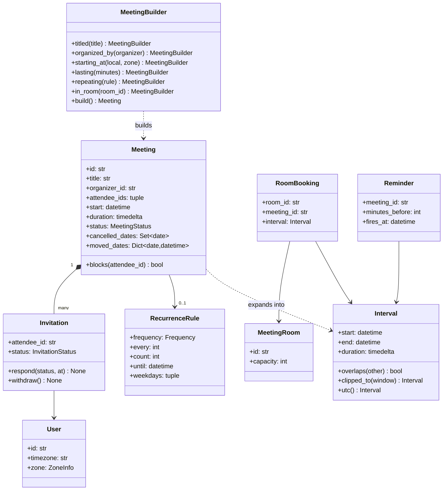
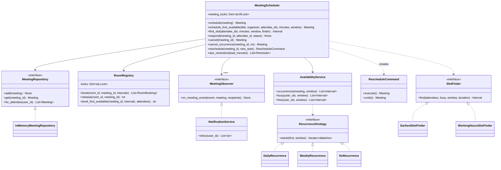
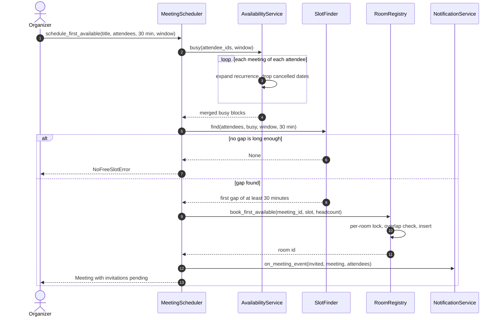
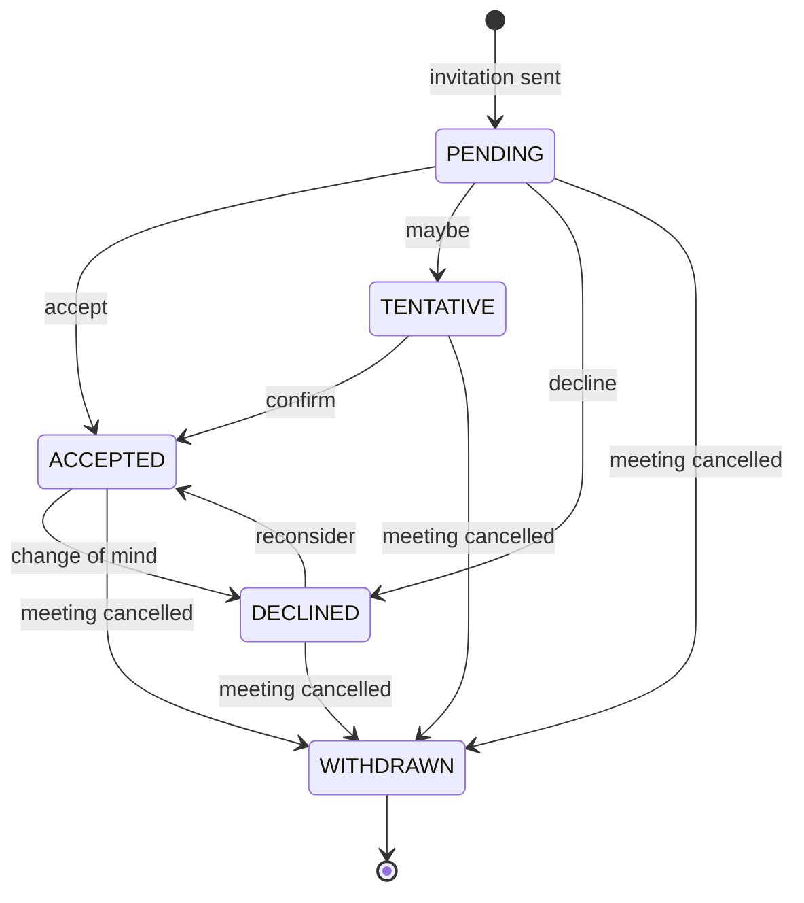

# Design a meeting scheduler and calendar

## TL;DR

- You build a calendar service: meetings expand into `Interval`s, busy blocks merge, the first gap that fits wins, and a room is booked under its own lock.
- Three decisions carry the interview: **intervals are half-open** (`[start, end)`, so 10-11 and 11-12 do not clash), **recurrence repeats wall-clock time** (09:00 local stays 09:00 across a DST switch), and **the room lock is per room** so two organisers racing for one room have exactly one winner.
- Patterns that earn their place: Strategy (recurrence, slot finding), Builder, Observer, Command with undo, Repository. A `Calendar` class is deliberately absent.

## Problem statement

"Design a meeting scheduler. Users have calendars; an organiser creates a meeting with a time range, attendees, optionally a room, and optionally a recurrence rule. Attendees accept, decline or answer tentatively. The system detects conflicts, finds the earliest free slot for a group inside a search window, and sends notifications and reminders. Attendees are in different timezones. Handle cancelling or moving one occurrence of a recurring series, and tell me what happens when two people book the last room at the same instant."

## Requirements

**Functional**

- Per-user calendars; create a meeting with a time range, attendees, an optional room and an optional recurrence rule.
- Conflict detection for attendees and rooms; rooms have a capacity.
- Find the first free slot of a given length for N attendees inside a window.
- Invitations with accept, decline and tentative; declining frees the attendee's time.
- Update, reschedule (with undo) and cancel, each notifying the attendees.
- Reminders a fixed lead time before an occurrence starts.
- Recurring meetings (daily, weekly on chosen weekdays, with a count or an end date), including cancelling or moving a single occurrence.
- Timezones: every attendee sees their own; the stored truth is one instant.

**Non-functional and constraints**

- Two organisers must never double-book a room, whatever the interleaving.
- Recurrence expansion is bounded: no query may expand an endless series.
- Deterministic and testable: the clock is injected, expansion is pure, no wall-clock reads inside services.
- In-memory behind a `Repository` protocol; a database is a swap, not a redesign.

**Out of scope**: external calendar sync (Exchange, Google), video-conference links, resource types other than rooms, free/busy sharing across organisations, mail delivery.

## Clarifying questions and assumptions

| Question to ask | Assumption taken here |
|---|---|
| Are the endpoints inclusive? | Half-open, `[start, end)`. Everything downstream (merge, gaps, conflicts) is simpler and the 11:00 boundary stops being a bug. |
| Does a pending invitation block time? | Yes. Pending and tentative are busy, declined is not - that is what a real calendar shows. |
| Where does a recurring meeting live? | One row with a rule plus an exception list. Materialising every occurrence is a follow-up for very long series. |
| What does "every day at 09:00" mean across a DST switch? | 09:00 local, always. That is what the organiser meant, and it is why the start time carries the organiser's zone. |
| Can an attendee be double-booked? | Yes - real calendars allow it and warn. Only *rooms* are hard-enforced. |
| How far ahead does a room get booked for an endless series? | 60 days, rolled forward by a job. Booking a room until the end of time is not a feature. |
| Who is the source of truth for "now"? | An injected `Clock`. Reminders and tests need the same one. |

## Core entities and relationships

- **Interval** — a frozen, timezone-aware, half-open range. Every conflict question in this design is one `overlaps` call.
- **Meeting** — one series: organiser, attendees, first start (in the organiser's zone), duration, optional `RecurrenceRule`, optional room, plus `cancelled_dates` and `moved_dates` for the exceptions.
- **MeetingBuilder** — eight fields, four optional and interdependent; the Builder is the one place a meeting can be born invalid.
- **Invitation** — per attendee, with a five-value status and guarded transitions.
- **User** — id, name and an IANA timezone; **MeetingRoom** — id, name, capacity; **RoomBooking** — a room, a meeting and one interval.
- **RecurrenceStrategy** (`NoRecurrence`, `DailyRecurrence`, `WeeklyRecurrence`) — expands a series into starts inside a window; **`strategy_for`** is the factory that picks one from the rule.
- **SlotFinder** (`EarliestSlotFinder`, `WorkingHoursSlotFinder`) — picks the slot; the second one adds each attendee's out-of-hours time as busy.
- **AvailabilityService** — expand, drop exceptions, merge. **RoomRegistry** — bookings and the per-room locks. **MeetingScheduler** — the facade. **NotificationService** — an observer. **RescheduleCommand** — move with undo.

Multiplicities: meeting `1 -> *` invitations, meeting `1 -> 0..1` recurrence rule, meeting `1 -> *` occurrences (computed, never stored), room `1 -> *` bookings, user `1 -> *` meetings.

## Class diagram

**The domain: intervals, the meeting they come from, and the builder that assembles one.**



**The services and the two Strategy families.**



## Design patterns applied

| Pattern | Where | Why it earns its place |
|---|---|---|
| Strategy | `RecurrenceStrategy`, `SlotFinder` | The two things interviewers change mid-question. "Now only weekdays" is a class; "now respect working hours" is a class that reuses the same gap scan. |
| Builder | `MeetingBuilder` | Eight fields with rules between them (a start needs a zone, attendees always include the organiser). One `build()` gate means an invalid `Meeting` cannot exist. |
| Factory Method | `strategy_for(rule)` | The rule is data that can be stored or sent over the wire; the expansion is behaviour. Keeping them apart is what lets a rule be a database row. |
| Observer | `MeetingObserver` -> `NotificationService` | The scheduler announces; it does not know that email, push or an audit log exist. The announce loop runs outside every lock. |
| Command | `RescheduleCommand` | "Move it, no wait, put it back" is a real user action, and the command carries the previous start so undo is exact rather than reconstructed. |
| Repository | `MeetingRepository` | Availability is the query layer; swapping the in-memory dict for SQL changes one class. |
| State (lightweight) | `InvitationStatus` with guarded transitions | Five values and one rule (a withdrawn invitation cannot be answered). Enum plus a guard beats five classes. |

What was deliberately *not* used: a **`Calendar` class**. It is the first noun everybody writes, and it turns out to be an empty shell - a calendar *is* the set of meetings a user is invited to, which `AvailabilityService.busy` computes on demand. Modelling it means keeping two copies of the same truth in sync every time an invitation changes. Say that in the room; the interviewer is watching for whether you can delete a noun.

## Key flows

**Find a slot and book it: expand, merge, first gap, room, notify.**



**Invitation lifecycle.** Every answer is reversible until the organiser cancels; `WITHDRAWN` is the only terminal state, and it is reached from all four others.



## Implementation

Write the interval first. Every later method is a two-line call on it, and getting the half-open comparison right up front is what stops the rest of the hour turning into off-by-one debugging.

```python title="code/lld/meeting_scheduler/models.py — enums and errors"
--8<-- "code/lld/meeting_scheduler/models.py:enums"
```

`merge_intervals` sorts and folds; `free_gaps` is its complement inside a window. Those two functions are the whole availability engine, and both are pure.

```python title="code/lld/meeting_scheduler/models.py — intervals"
--8<-- "code/lld/meeting_scheduler/models.py:interval"
```

The entities are small because the behaviour lives in the services. Note `Meeting.start` keeping the organiser's zone and the two exception collections.

```python title="code/lld/meeting_scheduler/models.py — entities"
--8<-- "code/lld/meeting_scheduler/models.py:entities"
```

The Builder is where the rules live. Everything it accepts is optional until `build`, which is the single gate.

```python title="code/lld/meeting_scheduler/models.py — builder"
--8<-- "code/lld/meeting_scheduler/models.py:builder"
```

Now the part interviewers actually push on. Adding 24 hours to an instant is wrong twice a year; adding one day to the *local naive* time and re-attaching the zone is right. `localise` also handles the hour that does not exist on the morning the clocks jump forward.

```python title="code/lld/meeting_scheduler/recurrence.py — wall-clock arithmetic"
--8<-- "code/lld/meeting_scheduler/recurrence.py:localise"
```

```python title="code/lld/meeting_scheduler/recurrence.py — recurrence strategies"
--8<-- "code/lld/meeting_scheduler/recurrence.py:recurrence"
```

Slot finding is a scan over the gaps. `WorkingHoursSlotFinder` does not reimplement it: it adds each attendee's out-of-hours time as busy and delegates.

```python title="code/lld/meeting_scheduler/recurrence.py — slot finders"
--8<-- "code/lld/meeting_scheduler/recurrence.py:slots"
```

Availability turns meetings into busy blocks: expand within the window, drop cancelled dates, apply moved ones, merge.

```python title="code/lld/meeting_scheduler/services.py — availability"
--8<-- "code/lld/meeting_scheduler/services.py:availability"
```

The room registry owns the lock that matters. `book` is all-or-nothing across every occurrence of a series.

```python title="code/lld/meeting_scheduler/services.py — rooms"
--8<-- "code/lld/meeting_scheduler/services.py:rooms"
```

The scheduler is a facade: it composes the pieces, holds one lock per meeting for status changes, and announces outside every lock.

```python title="code/lld/meeting_scheduler/services.py — the scheduler and the reschedule command"
--8<-- "code/lld/meeting_scheduler/services.py:scheduler"
```

`python -m lld.meeting_scheduler.demo` runs a standup across the March DST switch, two slot searches and a room clash:

```text
M-1 Standup: 09:00 Europe/Berlin daily, 7 in the week
before the DST switch: 2026-03-25 08:00-08:15Z | after it: 2026-03-31 07:00-07:15Z
cancelled 2026-03-27: 6 occurrences left
ada is busy ['2026-03-26 08:00-08:15Z', '2026-03-26 13:00-14:00Z']
first 30 min for ada+linus: 2026-03-26 08:15-08:45Z
inside 09:00-17:00 in Berlin and New York: 2026-03-26 14:00-14:30Z
adding Grace in Kolkata: None
room clash: Turing is already booked for 2026-03-26 13:30-14:00Z
invitations: {'ada': 'accepted', 'linus': 'declined', 'grace': 'tentative'}
rescheduled standup to 2026-03-25 10:00-10:15Z
undo put it back to 2026-03-25 08:00-08:15Z; 16 notifications sent
reminders due at 07:55Z: ['M-1']
```

## Concurrency and edge cases

**Which lock protects what.**

1. `RoomRegistry._locks[room_id]` — one lock per room, held across the overlap check *and* the insert. This is the only hard-enforced conflict in the system, so it is the only place that needs the check-then-act to be atomic. Per room rather than one global lock: two organisers booking two different rooms never wait for each other.
2. `MeetingScheduler._meeting_locks[meeting_id]` — one per meeting, guarding status, invitations and the exception lists. Two attendees answering at the same instant touch the same dict; the lock makes "cancel the meeting" and "accept the invitation" a total order rather than a coin flip.
3. `InMemoryMeetingRepository._lock` and `NotificationService._lock` — the dictionaries themselves.

The ordering rule: **meeting lock, then room lock, never the reverse.** `cancel` holds the meeting lock and calls `release`; nothing holds a room lock and reaches for a meeting.

**The race it prevents.** Eight threads book the same room for the same hour. Each one reads the booking list, sees no clash, and inserts. Without the lock all eight succeed and the room is eight times booked; with it, one wins and seven get `SlotConflictError`. `book_first_available` turns that loss into a retry on the next room, which is the optimistic pattern: never hold a lock while searching, only while claiming.

**Half-open intervals.** `10:00-11:00` and `11:00-12:00` do not overlap. With closed intervals they do, and you will spend the last ten minutes of the interview explaining why nobody can book the hour after yours. The test parametrises all four boundary cases.

**Recurrence bounds.** Every expansion takes a window and a hard cap (`MAX_OCCURRENCES`). A daily meeting with no end date is not a bug in the rule, it is a bug in any code that expands it eagerly. Room bookings use a 60-day horizon for the same reason - a rolling job extends it.

**DST.** Two things break, and both are in the tests: the 09:00 standup must stay 09:00 across the switch (its UTC instant moves by an hour), and a time that does not exist (02:30 on the spring-forward morning) must be pushed forward rather than silently given the wrong offset. The general rule to state: *store instants, schedule wall-clock, convert at the edges.*

**Editing one occurrence.** `cancelled_dates` removes a single Tuesday and `moved_dates` shifts one, both keyed by the occurrence's local date; the series stays one row. The honest limitation to name: an occurrence moved *out of* an expansion window disappears from that window's results, which is why production systems promote a moved occurrence to its own row that points back at the series.

**Cost check.** Searching a week for ten attendees with twenty meetings each is 200 intervals; merging is one sort, ~200 x log2(200) ≈ 1.5k comparisons. At the estimation cheatsheet's 100 ns main-memory reference that is well under a millisecond of real work - the expansion, not the merge, is what to bound.

!!! warning "Common mistake"
    Storing recurring meetings as UTC instants plus "add 86400 seconds". It passes every test you write in June and produces 08:00 standups in November. The fix is one line - add days to the local naive time and re-attach the zone - but only if the meeting kept its zone, which is why `Meeting.start` is aware and in the *organiser's* zone rather than normalised to UTC on the way in.

## Extensibility and follow-ups

- **Minimum number of rooms for a set of meetings** (the "Meeting Rooms II" question): sort starts, push ends onto a heap, pop everything that ended before the next start; the answer is the maximum heap size. Your `Interval` already has what it needs.
- **Ranked suggestions instead of the first gap**: another `SlotFinder` that scores candidate gaps (fewest attendees dragged out of hours, least fragmentation of the day) and returns the best. Nothing else changes - that is the Strategy paying rent.
- **Working hours and holidays per user**: `WorkingHoursSlotFinder` already reads each attendee's zone; give `User` a working-hours field and a holiday calendar and feed both into `_off_hours`.
- **External sync (Exchange, Google)**: an adapter that maps their event model onto `Meeting` plus a sync token; conflicts become last-writer-wins per field or a merge dialogue.
- **Materialised occurrences**: for a series older than the horizon, write rows into an occurrence table so queries become index scans instead of expansions. That is the moment this becomes an HLD conversation about sharding by user and fanning out reminders.
- **Reminders at scale**: today `due_reminders` polls. At millions of users that becomes a time-bucketed queue, which is the same design as a distributed job scheduler.

!!! tip "Interview tip"
    Draw the timeline before you write any code: a horizontal line, three attendees' busy blocks stacked, the merged row underneath, the gap you would pick. Then say "merge, then scan the gaps" and write the ten lines. Interviewers grade this problem on whether you found the interval algebra, and a drawing gets you there faster than a class diagram does.

## Tests

`tests/test_meeting_scheduler.py` has 12 cases (16 with parametrisation). The boundary cases are parametrised (`11:00-12:00` after `10:00-11:00` is not a clash); `merge_intervals` and `free_gaps` are checked as inverses on the same input; weekly recurrence expands only the named weekdays; a cancelled occurrence disappears while the series stays active; a declined invitation frees the attendee but not the organiser; a cancelled meeting withdraws invitations, releases the room and refuses further answers; the builder refuses an incomplete meeting three ways.

The two to walk through are DST and the room race:

```python title="code/lld/meeting_scheduler/tests/test_meeting_scheduler.py — DST"
--8<-- "code/lld/meeting_scheduler/tests/test_meeting_scheduler.py:dst"
```

```python title="code/lld/meeting_scheduler/tests/test_meeting_scheduler.py — one room, eight threads"
--8<-- "code/lld/meeting_scheduler/tests/test_meeting_scheduler.py:concurrency"
```

The reschedule test is worth a mention because it asserts on the *room*, not the meeting: after `execute` the booking has moved, after `undo` it is back where it started. Run everything with `uv run pytest code/lld/meeting_scheduler -q`.

## 45-minute pacing

| Minutes | What to do | What to say or write |
|---|---|---|
| 0-5 | Clarify | Half-open or closed? Do pending invitations block time? Recurrence in scope? Timezones? Out of scope: external sync, video links. |
| 5-10 | Entities and the timeline | Draw busy blocks, the merged row and the gap. Name the entities: Interval, Meeting, Invitation, Room, RoomBooking. |
| 10-16 | Class diagram | Meeting with a rule and two exception collections; the two Strategy families; where the locks live. |
| 16-26 | Interval algebra | Write `overlaps`, `merge_intervals`, `free_gaps` and the earliest-slot scan. This is the core and it should be on the board by minute 26. |
| 26-34 | Recurrence and DST | Expand within a window, drop exceptions, and say "wall-clock, not UTC arithmetic". Write `shifted`. |
| 34-40 | Rooms and concurrency | Per-room lock, all-or-nothing booking, the eight-thread test, the lock order rule. |
| 40-45 | Extensions | Minimum rooms with a heap, ranked suggestions as a strategy, materialised occurrences and the hand-off to HLD. |

## Related

- [Builder](../patterns/builder.md) — the fluent `MeetingBuilder` and its single validation gate
- [Strategy](../patterns/strategy.md) — recurrence expansion and slot finding
- [Observer](../patterns/observer.md) — notifications without the scheduler knowing its listeners
- [Design a hotel management system](hotel-management.md) — the same overlapping-range problem with rooms and nights
- [Design a distributed job scheduler](../../hld/case-studies/job-scheduler.md) — where reminders go when there are millions of them
- [RFC 5545 (iCalendar)](https://datatracker.ietf.org/doc/html/rfc5545) — the primary source for recurrence rules and floating vs absolute time
