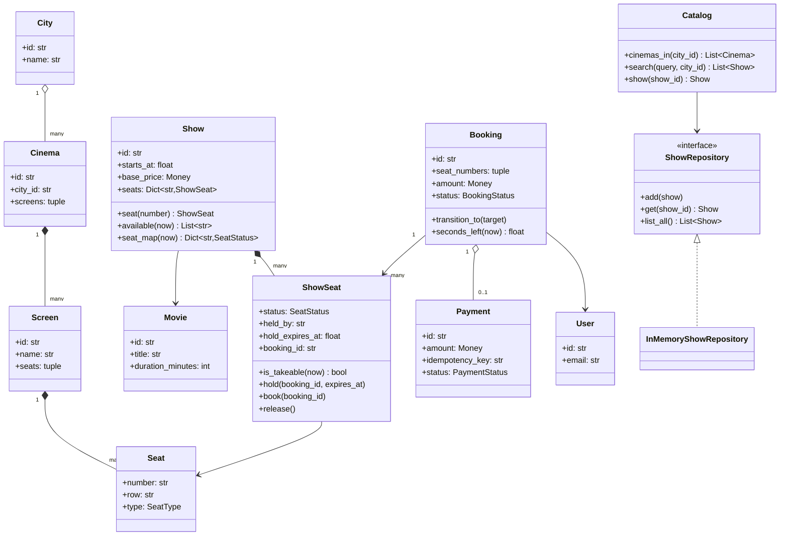
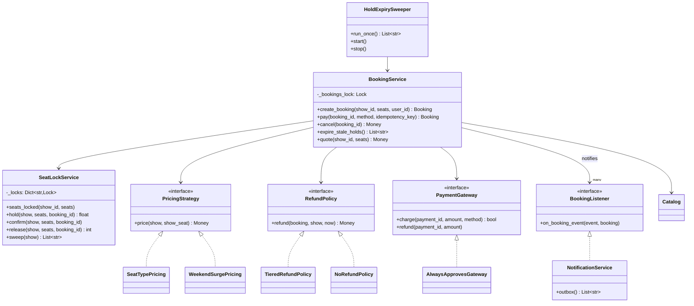
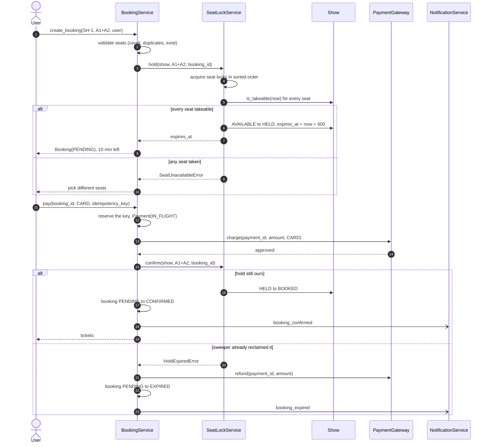
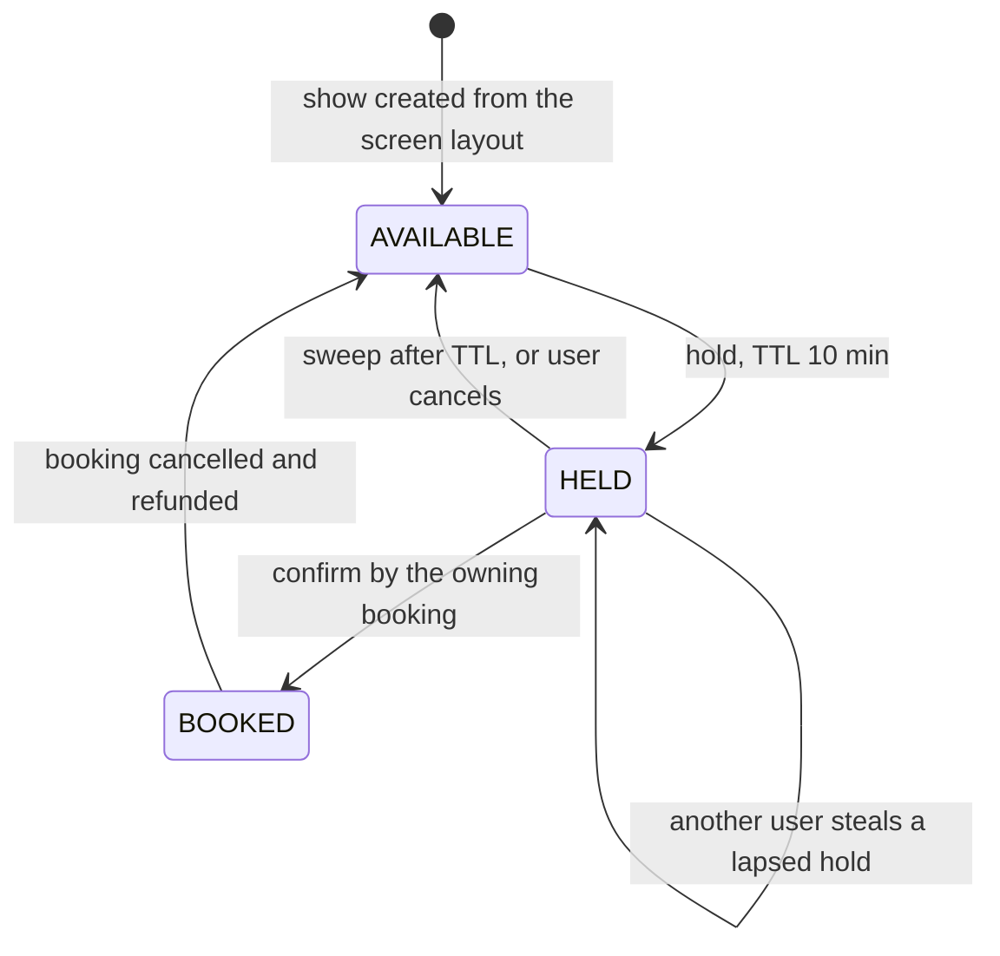
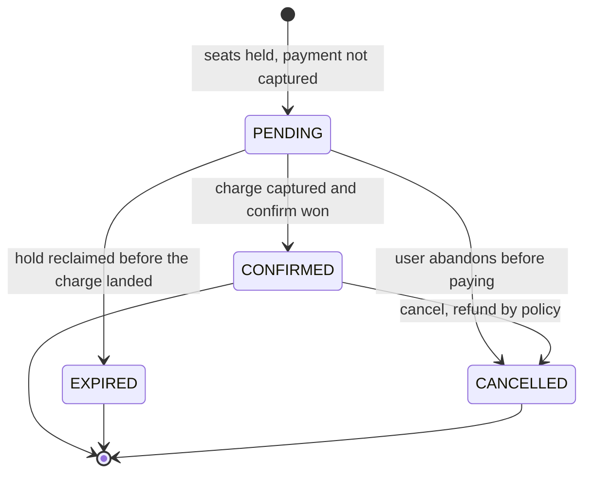

# Design a movie ticket booking system (BookMyShow)

## TL;DR

- You build the path from *browse* to *booked*: cities to cinemas to screens to shows, a seat map per show, and a three-step reservation — hold with a TTL, pay, confirm.
- Three decisions carry the interview: **one lock per `ShowSeat`, acquired in sorted order** so a multi-seat request is all-or-nothing and deadlock-free; **lazy expiry plus an eager sweeper**, so an expired hold is never sold twice and never leaks; **an idempotency key reserved before the charge**, so a retried callback cannot charge twice.
- Patterns that earn their place: State (two machines), Strategy (pricing, refunds), Repository, Observer, Facade. Singleton for the lock service is discussed and deliberately *not* used.

## Problem statement

"Design the booking system behind BookMyShow. A user picks a city, finds a movie, chooses a show at a cinema, sees the seat map, selects seats and pays. Seats must be held while the payment is in flight and released if the user abandons it. No seat may ever be sold twice, and a payment that succeeds after the hold has expired must not leave the user out of pocket. Show me the classes, the seat state machine, and what happens when two people tap the same seat in the same second."

## Requirements

**Functional**

- Browse cities, cinemas in a city, screens in a cinema, and shows on a screen; search shows by movie title within a city.
- A show exposes a seat map with seat types (regular, premium, recliner) and a price per seat.
- Select seats, then hold them for 10 minutes, then pay, then confirm. The hold is all-or-nothing: either every requested seat is held or none is.
- Release the hold on timeout or when the user cancels; released seats go straight back on sale.
- No double booking, ever, including when several users request overlapping seat sets simultaneously.
- Cancel a confirmed booking with a refund decided by policy; notify the user on confirm, expiry and cancellation.
- An admin adds movies, cinemas, screens and shows.
- The same engine serves the airline variant: a flight leg is a show, a cabin is a seat class.

**Non-functional and constraints**

- Correct under concurrency; the seat map is the contended resource and the interview is graded on it.
- Payment is an external call: slow, retried by the network, and never made while holding a lock.
- In-memory and single-process, with the persistence boundary behind a repository interface.
- Deterministic and testable: time, ids and the payment gateway are injected.

**Out of scope**: the virtual waiting room and the real-time seat-map push (both are the [HLD version](../../hld/case-studies/ticketing-and-reservations.md)), loyalty, coupons, seat recommendations.

## Clarifying questions and assumptions

| Question to ask | Assumption taken here |
|---|---|
| How long is the hold? | 10 minutes, injected as `hold_ttl_seconds`. The number belongs in configuration, not in an `if`. |
| Can a user hold seats across two shows in one booking? | No. One booking, one show. Multi-leg itineraries are the airline follow-up. |
| What happens if the payment succeeds after the hold expires? | The confirm fails, the booking becomes `EXPIRED` and the charge is refunded automatically. Never keep money for seats you did not deliver. |
| Is a failed card the same as an expired hold? | No. A decline leaves the booking `PENDING` and the hold alive so the user can retry with another card. |
| Is the seat map strongly consistent for readers? | No. Readers get a snapshot; only the hold itself is authoritative. Say this out loud — it is the single biggest scaling lever. |
| How many seats can one user grab? | Ten. Without a cap, one script holds a whole screen for ten minutes. |
| Do we overbook? | Cinemas do not. Airlines do, and that is a counter on the show rather than a change to the lock design. |

## Core entities and relationships

- **City** `1 → *` **Cinema** `1 → *` **Screen** `1 → *` **Seat**. All four are immutable catalog data — a seat's *number, row and type* never change.
- **Show** — a `Movie` on a `Screen` at a `starts_at`, carrying its own `dict[str, ShowSeat]`. That copy is the point: availability belongs to the show, not to the physical seat.
- **ShowSeat** — the contended row. `status`, `held_by` (the booking that owns the hold), `hold_expires_at`, `booking_id`. In a database this is the row you `SELECT ... FOR UPDATE`.
- **Booking** `1 → *` seats, `1 → 0..1` **Payment**. It owns `amount`, `hold_expires_at` and the status machine.
- **SeatLockService** — owns one `threading.Lock` per `ShowSeat` and the `hold` / `confirm` / `release` / `sweep` operations. Nothing else touches seat status.
- **BookingService** — the Facade the API layer calls: `create_booking`, `pay`, `cancel`, `expire_stale_holds`.
- **Catalog** + **ShowRepository** — the read side, behind an interface so a SQL implementation drops in later.
- **PricingStrategy**, **RefundPolicy**, **PaymentGateway**, **BookingListener** — the four seams you will be asked to swap.

## Class diagram

**Structure: the catalog is immutable, the show owns the contended state.**



**Behaviour: one facade, one lock service, and four injected seams.**



## Design patterns applied

| Pattern | Where | Why it earns its place |
|---|---|---|
| [State](../patterns/state.md) | `ShowSeat` status guards, `Booking.transition_to` with `BOOKING_TRANSITIONS` | Two machines, two different shapes. The seat's transitions are enforced inside the lock, so they are inline guards; the booking's are a declarative table, so an illegal move fails the same way everywhere. Say why you chose a table over State classes: four states with no per-state behaviour do not deserve four classes. |
| [Strategy](../patterns/strategy.md) | `PricingStrategy`, `RefundPolicy` | "Now add weekend surge" and "now make the last hour non-refundable" are the two follow-ups you will actually get. `WeekendSurgePricing` *composes* another strategy instead of subclassing it, so surge on top of a loyalty price is one more wrapper. |
| [Repository](../patterns/repository.md) | `ShowRepository`, `InMemoryShowRepository` | The seam where `SELECT ... FOR UPDATE` replaces the in-memory dict. Naming it lets you answer the persistence question in one sentence instead of redesigning. |
| [Observer](../patterns/observer.md) | `BookingListener`, `NotificationService` | Confirm, expiry and cancellation all fan out to email, SMS and the live seat map. The service pushes and never learns what a notifier is; listeners are called *outside* the lock. |
| [Facade](../patterns/facade.md) | `BookingService` | The HTTP layer calls four methods. Locking, pricing, gateway and observers stay behind them. |
| Dependency injection | `Clock`, `IdGenerator`, `PaymentGateway`, both strategies | Tests use `FakeClock` and a declining gateway; nothing calls `time.time()`, so "the hold expired" is one `clock.advance(601)`. |

What was deliberately *not* used: **Singleton** for `SeatLockService`. It is the textbook answer and it is the wrong one — you want exactly one instance per process, which you get by constructing it in `main` and injecting it. A Singleton class makes tests share state across cases and makes a second region a rewrite. Say that out loud.

## Key flows

**The happy path: hold, charge, confirm — with the two failure branches that matter.**



**Seat lifecycle. `HELD` is the state that makes the whole system safe: it is short-lived, owned by exactly one booking, and self-healing.**



**Booking lifecycle. Three terminal states, and which one you land in is decided under the seat lock.**



## Implementation

Write it in interview order: vocabulary, then the two entities that hold state, then the lock service, then the facade. Every block below is the file the tests run.

Enums first — they are the fastest way to make an interviewer agree with your model before you write any logic. `SeatStatus` and `BookingStatus` are the two machines from the diagrams above.

```python title="code/lld/movie_ticket_booking/models.py — enums"
--8<-- "code/lld/movie_ticket_booking/models.py:enums"
```

The errors subclass the shared hierarchy, so an API layer can catch `ConflictError` for everything that means "try again" without importing a single booking symbol.

```python title="code/lld/movie_ticket_booking/models.py — errors"
--8<-- "code/lld/movie_ticket_booking/models.py:errors"
```

`ShowSeat` is the contended row. `is_takeable` is the *lazy expiry* rule and the most important five lines on the page: a seat whose hold has lapsed is takeable again even if no sweeper has run yet.

```python title="code/lld/movie_ticket_booking/models.py — show seat"
--8<-- "code/lld/movie_ticket_booking/models.py:show_seat"
```

A `Show` builds its own seat map from the screen layout, so two shows on the same screen never share availability.

```python title="code/lld/movie_ticket_booking/models.py — show"
--8<-- "code/lld/movie_ticket_booking/models.py:show"
```

The booking state machine is a dict, not an `if/elif` ladder. Adding `REFUND_PENDING` later is one row.

```python title="code/lld/movie_ticket_booking/models.py — booking"
--8<-- "code/lld/movie_ticket_booking/models.py:booking"
```

Now the piece the interview is actually about. `seats_locked` sorts the keys before acquiring, which is what makes concurrent overlapping requests deadlock-free; `hold` checks every seat before mutating any, which is what makes it all-or-nothing; `sweep` re-checks under the same locks `confirm` uses, which is what makes the expiry race safe.

```python title="code/lld/movie_ticket_booking/services.py — seat locks"
--8<-- "code/lld/movie_ticket_booking/services.py:seat_locks"
```

The facade. Read `pay` slowly: the idempotency key is reserved *before* the charge, the gateway is called with no lock held, and the only way to `CONFIRMED` runs through `SeatLockService.confirm`.

```python title="code/lld/movie_ticket_booking/services.py — booking service"
--8<-- "code/lld/movie_ticket_booking/services.py:booking_service"
```

The sweeper is deliberately thin — it exists so the seat map looks right, not so correctness depends on it.

```python title="code/lld/movie_ticket_booking/services.py — sweeper"
--8<-- "code/lld/movie_ticket_booking/services.py:sweeper"
```

Pricing and refunds are the two policies to have ready when the interviewer changes the rules.

```python title="code/lld/movie_ticket_booking/strategies.py — pricing"
--8<-- "code/lld/movie_ticket_booking/strategies.py:pricing"
```

Running `python -m lld.movie_ticket_booking.demo` walks the whole flow, including the race:

```text
search 'inter' in Bengaluru -> SH-1 at PVR Forum, 7 seats free
BK-1 holds A1,A2 for 600s -> pending, 500.00 USD
second user rejected: show SH-1: seats already taken: A2
BK-1 paid -> confirmed via PAY-1
replay of key pay-alpha -> confirmed, refunds issued so far: 0
BK-3 holds B1,B2 -> pending, 750.00 USD
11 minutes pass; sweeper reclaims ['BK-3']
late payment lost the race: hold on seat B1 for booking BK-3 is gone (seat is available)
BK-3 is expired; refunds issued: 1
BK-1 cancelled 2.8h before showtime -> refund 250.00 USD
seats free again: A1,A2,A3,A4,B1,B2,C1
  notify booking_confirmed: BK-1 seats A1,A2 (500.00 USD)
  notify booking_expired: BK-3 seats B1,B2 (750.00 USD)
  notify booking_cancelled: BK-1 seats A1,A2 (500.00 USD)
airline variant: AI2841 BLR->DEL is show LEG-1 with 4 seats
```

`BK-2` is missing on purpose: the id is minted before the hold is attempted, and that hold lost the race for seat A2. Gaps in booking ids are normal; gaps in *seat* ownership are not.

## Concurrency and edge cases

**Which lock protects what.** There are exactly two families, and naming them is the answer the interviewer wants.

1. `SeatLockService._locks` — **one `threading.Lock` per `ShowSeat`**, keyed `"{show_id}::{seat_number}"` and created lazily under `_registry_lock`. It guards seat status, the hold owner and the expiry. Two users tapping A5 at the same instant serialise on A5's lock only; a user booking B7 is untouched. This is the in-process twin of a row lock.
2. `BookingService._bookings_lock` — guards the booking registry, every `Booking` transition and the idempotency-key table. It is never held while a seat lock is held, so the two families cannot form a cycle.

**Lock ordering.** A multi-seat request sorts its keys before acquiring. Two users asking for `A5,A6` and `A6,A5` therefore both take `A5` first and one waits — the classic ABBA deadlock cannot arise. The cost is negligible: an uncontended mutex is about 17 ns, so six locks cost roughly 100 ns, against the ~500 µs round trip to the payment gateway that this design carefully keeps *outside* every lock.

**All-or-nothing.** `hold` runs two passes under the locks: check every seat with `is_takeable`, then mutate every seat. A single failing seat means nothing is written, so a user never ends up owning half a row. The concurrency test asserts exactly this: 40 threads requesting six overlapping pairs, and no seat number appears in two winning bookings.

**The sweeper versus the payment.** Both take the same seat locks, so one of them wins cleanly. If `confirm` wins, the seats are `BOOKED` and the later sweep skips them. If `sweep` wins, the seats are `AVAILABLE`, `confirm` raises `HoldExpiredError`, the booking becomes `EXPIRED` and the captured charge is refunded in the same call. The user is never charged for seats they did not get, and the seats are never lost.

**Lazy plus eager expiry.** `is_takeable` treats a lapsed hold as free, so correctness never depends on the sweeper running. The sweeper exists so the seat map does not show a phantom sell-out for up to ten minutes. Ship both: a paused sweeper then degrades the display, not the inventory.

**Idempotent payment callback.** Gateways retry. The key is inserted into `_by_key` *before* the charge, so a duplicate that arrives mid-flight gets `PaymentInFlightError` instead of a second charge; a duplicate that arrives after capture returns the same `Booking` object; a duplicate of a declined key returns the decline. Retrying a genuinely failed card requires a new key, which is the correct contract.

**Other edge cases handled**: a declined card leaves the hold intact so the user can try another card; cancelling a `PENDING` booking releases the hold and refunds nothing; cancelling twice raises `BookingStateError`; more than ten seats, duplicate seat numbers and unknown seats are rejected before any lock is taken; refunds are split with `Money.allocate`, so half of 5.01 never loses a cent.

!!! warning "Common mistake"
    Guarding the whole show with one lock and calling it done. It is correct and it serialises every user in the cinema through one mutex — on an opening night that is the entire system. The opposite mistake is worse: per-seat locks taken in *request* order, which deadlocks the first time two users pick the same two seats in opposite orders. Say "one lock per seat, acquired in sorted id order" and you have answered both in one sentence.

## Extensibility and follow-ups

- **Redis or database locks instead of in-process ones.** `SeatLockService` is the only class that changes: `SET show:seat NX PX 600000` per seat, still in sorted order, with a fencing token so a slow client cannot release someone else's lock. A single Redis instance sustains about 100k ops/s, so a six-seat hold at six ops leaves headroom for roughly 16k holds/s — far past any single on-sale. In SQL the equivalent is `SELECT ... FOR UPDATE` over the seat rows `ORDER BY seat_id`, which gives you the same ordering guarantee for free.
- **Dynamic pricing.** A new `PricingStrategy` reading occupancy from `show.seat_map`; `WeekendSurgePricing` already shows the composition shape. Nothing in `BookingService` changes.
- **Seat recommendations.** A `SeatSuggestionStrategy` that scores contiguous blocks in the same row and returns candidates; the hold path is untouched because suggestion only *selects*.
- **Waiting room.** Once a popular on-sale outruns the database, admission tokens in front of `create_booking` become the answer, and the conversation becomes the [HLD version](../../hld/case-studies/ticketing-and-reservations.md).
- **The airline variant** is already in the package: `leg_as_show` maps a flight leg onto a `Show`, a cabin onto a `SeatType` and an aircraft onto a `Screen`. `SeatLockService` and `BookingService` are reused unchanged. A multi-leg itinerary is one all-or-nothing hold whose sorted keys span several leg ids — the same code path, a longer key list. Overbooking is a per-cabin allowance checked in `hold`, not a change to the locking.
- **Lock lifetime.** The lock registry grows with every seat ever touched. Evict the entries for shows that have started; the bound is (seats per screen) x (live shows), which is small — a 300-seat screen with 50 live shows is 15k locks.

!!! tip "Interview tip"
    When you draw the seat state machine, write the TTL on the `AVAILABLE → HELD` edge and the sweeper on the `HELD → AVAILABLE` edge, then point at both and say "these two edges are the only places inventory changes hands, and they take the same lock." That single sentence covers double booking, the expiry race and the refund path, and it is what separates a hire from a maybe.

## Tests

`tests/test_movie_ticket_booking.py` has 19 cases. Two are worth walking through out loud.

The first is the race the problem is really about — the sweeper reclaims a lapsed hold, and the payment that lands afterwards is refunded rather than confirmed:

```python title="code/lld/movie_ticket_booking/tests/test_movie_ticket_booking.py — the expiry race"
--8<-- "code/lld/movie_ticket_booking/tests/test_movie_ticket_booking.py:sweeper_race"
```

The second is the invariant test: 40 threads, six overlapping seat pairs, and the assertion is not "somebody won" but "no seat number appears twice and the held set exactly equals the sold set".

```python title="code/lld/movie_ticket_booking/tests/test_movie_ticket_booking.py — concurrency"
--8<-- "code/lld/movie_ticket_booking/tests/test_movie_ticket_booking.py:concurrency"
```

The rest cover: the happy path with a notification assertion; all-or-nothing rejection leaving the untouched seat free; invalid requests (empty, duplicate, over the cap, unknown seat) via `parametrize`; a payment that beats the sweeper; the sweeper marking the booking `EXPIRED`; idempotent replay counting gateway charges; a declined card keeping the hold; cancellation with each refund policy; seat-type and weekend pricing; and the airline variant booking two business seats through the same services. Run them with `uv run pytest code/lld/movie_ticket_booking -q`.

## 45-minute pacing

| Minutes | What to do | What to say or write |
|---|---|---|
| 0–5 | Clarify | Hold length? Payment after expiry? Seats per booking? Is the seat map strongly consistent? Park the waiting room as an HLD topic. |
| 5–10 | Entities | Nouns: City, Cinema, Screen, Seat, Movie, Show, ShowSeat, Booking, Payment. Draw `Show *-- ShowSeat` and say "availability lives on the show, not the seat". |
| 10–16 | State machines | Both diagrams, side by side. Write the TTL on the hold edge. This is the moment to earn the round. |
| 16–24 | Class diagram | Facade in the middle, `SeatLockService` beside it, four seams hanging off: pricing, refunds, gateway, listeners. Mark the two locks. |
| 24–36 | Code | `ShowSeat.is_takeable` → `seats_locked` (say "sorted") → `hold` (say "check all, then mutate all") → `pay` (say "reserve the key, charge outside the lock, confirm"). |
| 36–42 | Concurrency | The three races: two users on one seat, the sweeper against the payment, the retried callback. Describe the 40-thread test and its invariant. |
| 42–45 | Extensions | Redis locks with fencing tokens, dynamic pricing as a strategy, the airline variant, and the hand-off to the waiting-room discussion. |

## Related

- [Design Ticketmaster (with a hotel-booking variant)](../../hld/case-studies/ticketing-and-reservations.md) — the distributed version of this exact problem
- [Mock LLD interview: movie ticket booking](../../mocks/mock-lld-movie-ticket-booking.md) — the same problem as a 45-minute transcript
- [State](../patterns/state.md) — the transition table behind `Booking` and `ShowSeat`
- [Design a hotel management system](hotel-management.md) — the same hold-then-confirm shape over date ranges
- [Strategy](../patterns/strategy.md) — the pricing and refund seams
- [Repository](../patterns/repository.md) — the persistence boundary the seat lock will eventually move behind
