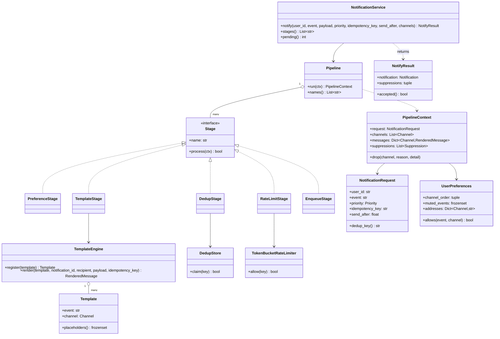
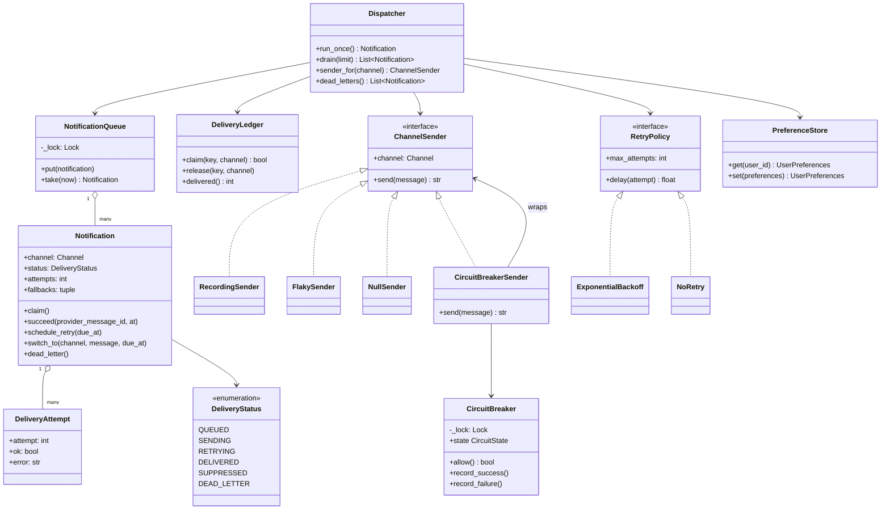
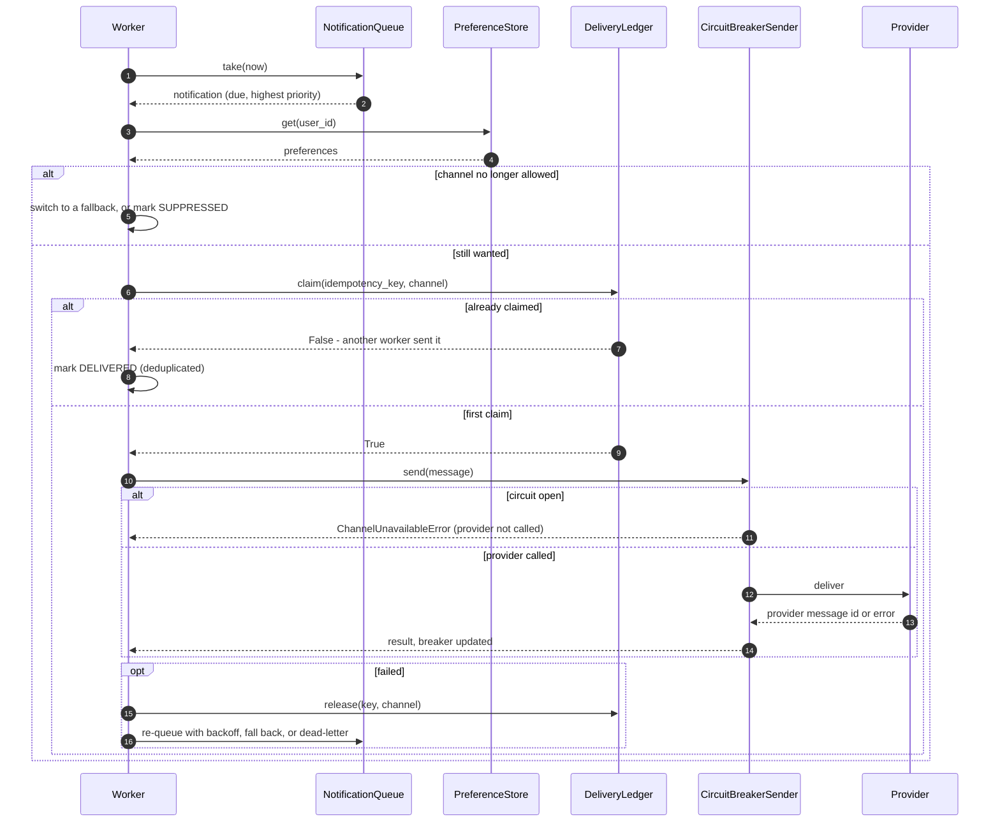
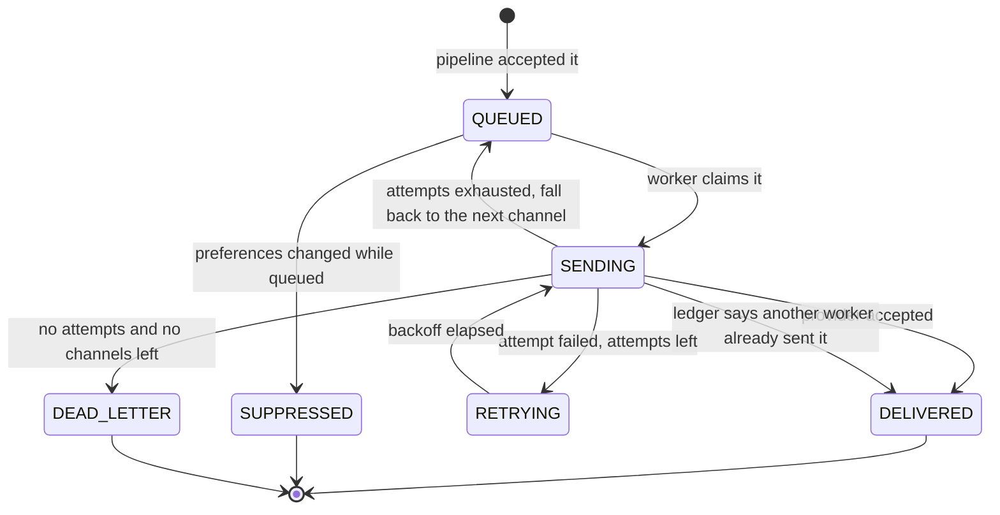
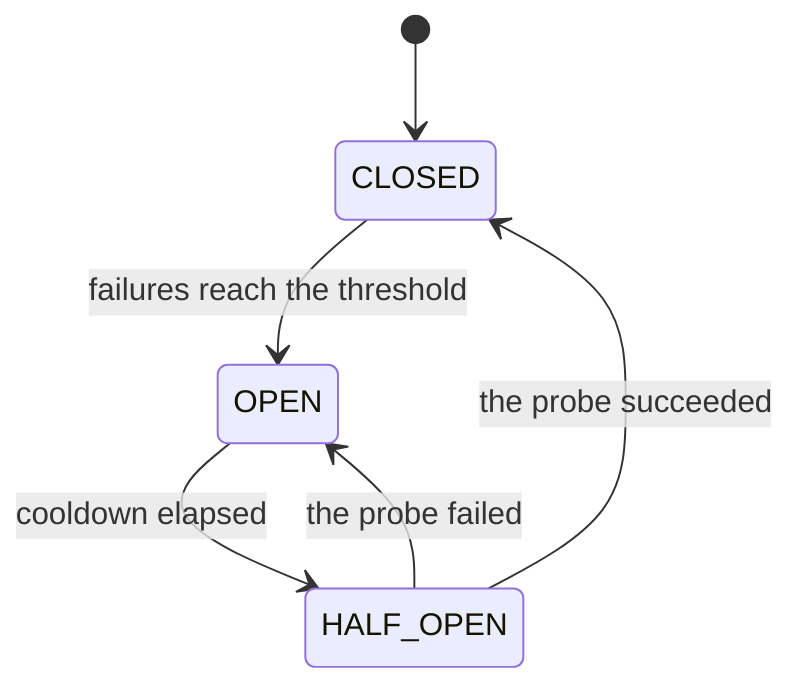

# Design a notification service (LLD)

## TL;DR

- You build an admission pipeline (preferences → dedup → rate limit → template → enqueue), a bounded priority queue, and a dispatcher that sends, retries, falls back to the next channel and finally dead-letters.
- Three decisions carry the interview: **two different idempotency guards** (a dedup window on the request side, a delivery ledger on the send side), **a circuit breaker per provider** so a failing SMS vendor cannot slow email down, and **preferences re-checked at send time**, not at enqueue time.
- Strategy, Decorator, Pipeline and Null Object earn their place. A thread-per-notification model is discussed and deliberately *not* used.

## Problem statement

"Design the service other teams call when they want to tell a user something. It renders a template, respects the user's channel preferences and opt-outs, does not spam them, sends over email, SMS, push or in-app, retries when a provider fails, falls back to another channel, and gives up into a dead letter queue. Some sends are scheduled, some are urgent. Focus on the classes, the delivery path, and what stops a user getting the same message twice."

## Requirements

**Functional**

- Four channels — email, SMS, push, in-app — behind one sender interface, each with a provider stub.
- Templates with `{placeholder}` slots, registered per (event, channel); a payload that does not fill every placeholder is an error, not a blank.
- Per-user preferences: muted events, disabled channels, addresses per channel, and an ordered channel list that doubles as the fallback chain.
- A dedup window: the same idempotency key inside it produces one notification, not two.
- A per-user rate limit that a `CRITICAL` priority walks past.
- A bounded queue ordered by due time then priority, so scheduled sends and urgent sends both work and an outage cannot exhaust memory.
- Retry with exponential backoff and jitter; then fallback to the next allowed channel; then the dead letter queue.
- Delivery status per notification, with the attempt history.

**Non-functional and constraints**

- At-least-once transport must not become at-least-twice delivery: the same message on the same channel is handed to a provider at most once.
- A failing provider must be isolated, not merely retried.
- In-memory, single process; deterministic and testable with an injected clock, ID generators and a seeded jitter source.

**Out of scope**: the real providers, digests and quiet hours (both named as extensions), open and click tracking, template A/B testing, cross-region delivery.

## Clarifying questions and assumptions

| Question to ask | Assumption taken here |
|---|---|
| Do we send on every allowed channel, or one? | One, with the rest as fallbacks. Blasting all four is a product decision that turns "fallback" into "spam". |
| Where does the idempotency key come from? | The caller. If they omit it, `dedup_key()` falls back to `user:event`, so a forgetful caller still gets deduplication. |
| Is a rate-limited notification dropped or delayed? | Dropped, with a reason the caller can see. Delaying it silently is how you deliver "your code is 2FA…" ten minutes late. |
| What if the queue is full? | `notify` raises `QueueFullError`. Backpressure the caller can see beats an unbounded queue that dies as an out-of-memory kill. |
| What if the user opts out while a notification is queued? | The dispatcher re-checks at send time and marks it `SUPPRESSED`. Checking only at enqueue time is how people get mail after unsubscribing. |
| Should a retry be a new notification? | No. One `Notification` is one delivery chain: attempts, channel switches and history all hang off it. |
| Do we need workers and threads? | The dispatcher exposes `run_once()`; a worker is a thread calling it in a loop. That keeps the tests deterministic and the concurrency real. |

## Core entities and relationships

- **NotificationRequest** — what a caller asks for: user, event, payload, priority, idempotency key, optional `send_after`. Frozen.
- **Notification** — one delivery chain on one channel, with its fallbacks, attempt count, `DeliveryStatus` and `DeliveryAttempt` history. The only mutable domain object.
- **Template** `1 → 1` (event, channel); **TemplateEngine** renders it into a frozen **RenderedMessage**.
- **UserPreferences** — muted events, disabled channels, addresses, and `channel_order`, which *is* the fallback chain.
- **Pipeline** `1 → *` **Stage**: `PreferenceStage`, `DedupStage`, `RateLimitStage`, `TemplateStage`, `EnqueueStage`. Each narrows the context or stops it.
- **DedupStore** (request side) and **DeliveryLedger** (send side) — two different idempotency guards, described below.
- **NotificationQueue** — bounded, ordered by `(due_at, -priority)`. **Dispatcher** — the worker step. **NotificationService** — the facade.
- **ChannelSender** — the provider interface; `RecordingSender`, `FlakySender` and `NullSender` implement it, and `CircuitBreakerSender` decorates any of them.
- **RetryPolicy** — `ExponentialBackoff` or `NoRetry`. **CircuitBreaker** — one per provider.

## Class diagram

**The admission path: request in, notification queued or suppressed.**



**The delivery path: queue, dispatcher, senders and their two decorators.**



## Design patterns applied

| Pattern | Where | Why it earns its place |
|---|---|---|
| Pipeline | `Pipeline` over five `Stage`s | Quiet hours is a sixth stage in a list. Without it, `notify` becomes a 60-line function with five nested `if`s and no way to test one rule alone. |
| Strategy | `ChannelSender`, `RetryPolicy` | The provider and the backoff are the two things that differ per channel. `NoRetry` for in-app and `ExponentialBackoff` for SMS is configuration, not code. |
| Decorator | `CircuitBreakerSender` wrapping any `ChannelSender` | Provider isolation is orthogonal to what a provider does, so it wraps rather than subclasses. Stack another decorator for metrics and nothing else changes. |
| Null Object | `NullSender` | An unconfigured channel accepts and discards. `sender_for` never returns `None`, so the dispatcher has no null check and a missing provider is a no-op instead of an `AttributeError` in a worker at 3 a.m. |
| Template Method (lightweight) | `Notification.claim` / `succeed` / `fail` / `schedule_retry` | The status machine lives on the entity; the dispatcher decides *which* transition, never *how* to apply it. |
| Facade | `NotificationService.notify` | Callers pass a user, an event and a payload. They never see the pipeline, the queue or the ledger. |
| Dependency injection | `Clock`, two `IdGenerator`s, `random.Random` for jitter, every collaborator | Backoff delays are asserted exactly, and the circuit breaker's cooldown is tested by moving a `FakeClock`, not by sleeping. |
| Value object | `RenderedMessage`, `NotificationRequest`, `Suppression` | A provider stub receives a frozen message and cannot reach back into the domain. |

What was deliberately *not* used: **a thread per notification**. It is the first thing people reach for and it fails at both ends — thousands of threads under load, and no way to bound work or apply backpressure. A bounded queue plus a fixed worker pool gives you a queue depth you can alarm on, a natural place to shed load, and a `run_once()` you can call from a test without threads at all.

## Key flows

**Delivery: claim, re-check, send, and the three ways to fail.**



**Notification lifecycle.** Every arrow is a method on `Notification`, which is why no service can invent a transition.



**Circuit breaker.** One per provider, so a bad SMS vendor costs SMS traffic and nothing else.



## Implementation

Write the vocabulary first; in this problem the enums *are* half the design.

`Priority.bypasses_rate_limit` and the `DeliveryStatus` set are the two decisions readers will question, so put them where they can see them:

```python title="code/lld/notification_service/models.py — the vocabulary"
--8<-- "code/lld/notification_service/models.py:enums"
```

`Notification` is the only mutable object in the package, and every transition is a named method:

```python title="code/lld/notification_service/models.py — the notification"
--8<-- "code/lld/notification_service/models.py:notification"
```

The three collaborators the pipeline leans on. `DedupStore.claim` is one compare-and-set under a lock; `TokenBucketRateLimiter` refills from the injected clock, so there is no timer thread anywhere:

```python title="code/lld/notification_service/pipeline.py — engine, dedup and rate limit"
--8<-- "code/lld/notification_service/pipeline.py:collaborators"
```

Now the pipeline. Note the order: three cheap filters, then rendering. The brief's ordering renders first; render last, because rendering is the expensive stage and most drops happen before it — say that trade out loud rather than silently reordering.

```python title="code/lld/notification_service/pipeline.py — the five stages"
--8<-- "code/lld/notification_service/pipeline.py:pipeline"
```

Senders are a `Protocol`, so a provider is anything with a `channel` and a `send`. `NullSender` is the Null Object that removes every null check downstream:

```python title="code/lld/notification_service/channels.py — the senders"
--8<-- "code/lld/notification_service/channels.py:senders"
```

The breaker and its decorator. The decorator is nine lines and it is the whole of provider isolation:

```python title="code/lld/notification_service/channels.py — the circuit breaker"
--8<-- "code/lld/notification_service/channels.py:breaker"
```

The queue is the backpressure boundary and the ledger is the idempotency guard. These two small classes are where most of the correctness lives:

```python title="code/lld/notification_service/services.py — queue and ledger"
--8<-- "code/lld/notification_service/services.py:queue"
```

`Dispatcher.run_once` is one worker step. Read it as five decisions in a row: still wanted, already sent, send, recover, record.

```python title="code/lld/notification_service/services.py — the dispatcher"
--8<-- "code/lld/notification_service/services.py:dispatcher"
```

Running `python -m lld.notification_service.demo` walks every branch:

```text
pipeline: preferences -> dedup -> rate_limit -> template -> enqueue
first: order_shipped -> push (queued) | repeat: order_shipped -> suppressed (duplicate)
push calls=2, email sends=1, breaker=open
delivery: n-1 order_shipped via email: delivered after 1 attempt(s)
attempts: [(1, 'push', False), (2, 'push', False), (1, 'email', True)]
rate limit, capacity 2: order_shipped -> push (queued) | order_shipped -> suppressed (rate_limited)
critical bypasses the limit: order_shipped -> push (queued)
after the opt-out: {'suppressed': 2}
u-2 has push only: n-6 order_shipped via push: dead_letter after 2 attempt(s)
dead letters: ['n-6']
queue depth=0, distinct deliveries=1
```

Trace the third and fourth lines. Push fails twice, which is `max_attempts`, so the notification switches to email and is delivered on its first attempt there — and those two failures also tripped the breaker, so the *next* push notification fails without a network call at all. The last user has only push configured, so the same failures end in the dead letter queue.

## Concurrency and edge cases

**Which lock protects what.** Six small locks, none held across a call into another component:

1. `NotificationQueue._lock` guards the heap. `take` pops under it and returns; `put` refuses past capacity under it.
2. `DeliveryLedger._lock` guards the claim set. Claim, send, release is the sequence, and the claim is what serialises two workers holding the same message.
3. `CircuitBreaker._lock` guards the failure count and the state, including the timed `OPEN → HALF_OPEN` move, which happens lazily inside `_refresh` rather than on a timer thread.
4. `DedupStore._lock`, `TokenBucketRateLimiter._lock` and `PreferenceStore._lock` each guard one dict.

The provider call itself happens **outside** every lock. That matters more here than anywhere else on this page: a network call to an SMS vendor can take a full round trip, and a lock held across it would serialise every worker on the slowest provider.

**Two idempotency guards, and they are not the same thing.** `DedupStore` sits in the pipeline and answers "has this caller already asked for this?" over a time window; it stops a retrying caller from creating two notifications. `DeliveryLedger` sits in the dispatcher and answers "has this exact message already gone to this channel?"; it stops an at-least-once queue from handing the same notification to two workers and delivering twice. Drop either one and you have a real bug: without the store you get two notifications, without the ledger you get one notification delivered twice. The test fires 12 concurrent `notify` calls with one key (one accepted, eleven suppressed), then drains 30 distinct notifications through four worker threads and asserts 31 sends with 31 distinct idempotency keys.

**Failure isolation.** A retry alone does not help when a provider is down — it multiplies the load on it. The breaker trips after a threshold of failures and every subsequent call fails in nanoseconds instead of waiting on a socket; a same-datacenter round trip is about 500 µs and a failing provider is far worse, so failing fast is thousands of times cheaper than trying. After the cooldown one probe goes through, and a single failure puts it straight back to `OPEN`.

**Backpressure.** The queue is bounded and `notify` raises `QueueFullError` rather than growing. A worker pool of 10 threads at roughly 1k operations per second each is about 10k sends/s of headroom; a queue that grows past capacity means the providers are slower than the callers, and the correct answer is to shed load at the door, not to buffer until the process dies.

**Mid-flight preference changes.** `_still_wanted` runs at send time, not at enqueue time. If the channel is no longer allowed it tries a fallback; if nothing is allowed it marks the notification `SUPPRESSED`. The test opts a user out while their notification sits in the queue and asserts it is never sent.

**Other edge cases handled**: a payload missing a placeholder (`RenderError`, before anything is enqueued); no template for a fallback channel (that channel is dropped, the rest survive); a channel with no address configured; an unconfigured provider (Null Object); a scheduled send that is not yet due (`take` returns `None`); a `CRITICAL` request walking past the rate limit; a notification claimed twice (`NotificationStateError`); and jitter that is seeded, so every backoff assertion is an exact number.

!!! warning "Common mistake"
    Treating "retry" and "idempotency" as the same feature. Retries are what you do when a send fails; idempotency is what saves you when a send *succeeded* and you did not find out — the provider accepted the SMS and the acknowledgement was lost. Retrying that without a delivery ledger sends it twice. Say the sentence "at-least-once transport plus an idempotent consumer equals effectively-once" and then point at the ledger.

## Extensibility and follow-ups

- **Quiet hours**: a sixth `Stage` that pushes `send_after` to the end of the quiet window instead of dropping. The queue already orders by due time, so nothing else changes.
- **Digests**: a stage that appends to a per-user bucket instead of enqueuing, plus a scheduled job that renders the bucket into one notification. The dispatcher never learns digests exist.
- **A/B template tests**: `TemplateEngine.template_for` becomes a strategy that picks a variant by a hash of the user id; the rendered message already carries an id you can join analytics on.
- **Open and click tracking**: a `TrackingSender` decorator that rewrites links before delegating. That is a third decorator on the same interface.
- **Per-channel retry policies**: `Dispatcher` takes one `RetryPolicy` today; make it a map keyed by channel and give in-app `NoRetry`.
- **Real workers and a real broker**: `run_once()` becomes the body of a consumer loop against SQS or Kafka. The ledger becomes a table with a unique key on `(idempotency_key, channel)` — the same design, one process wider. That is where this becomes [Design a notification system](../../hld/case-studies/notification-system.md).

!!! tip "Interview tip"
    Draw the pipeline as five boxes before you write a single class. It gives the interviewer a shape to hang follow-ups on ("where would quiet hours go?", "where would digests go?"), and every one of those answers is then "a new stage, here" — which is exactly the extensibility signal being graded.

## Tests

`tests/test_notification_service.py` has 14 cases over one wired-up `Rig`. The fallback test walks the whole recovery ladder in one function:

```python title="code/lld/notification_service/tests/test_notification_service.py — retry, fallback, dead letter"
--8<-- "code/lld/notification_service/tests/test_notification_service.py:fallback"
```

The concurrency test covers both idempotency guards at once — many callers with one key, then many workers on one queue:

```python title="code/lld/notification_service/tests/test_notification_service.py — idempotency under threads"
--8<-- "code/lld/notification_service/tests/test_notification_service.py:concurrency"
```

The rest cover: the happy path with exact rendered text and recipient; each pipeline stage dropping for its own reason via `parametrize` (muted, duplicate, rate limited, no channel); a payload that fails to render and the Null Object for an unconfigured channel; the breaker walking `CLOSED → OPEN → HALF_OPEN → CLOSED` with proof the provider was not called while open; preferences changed while queued, both to a fallback and to `SUPPRESSED`; due-time-then-priority ordering plus `QueueFullError`; and exact backoff delays from a seeded jitter source. Run them with `uv run pytest code/lld/notification_service -q`.

## 45-minute pacing

| Minutes | What to do | What to say or write |
|---|---|---|
| 0–5 | Clarify | One channel or all of them? Where does the idempotency key come from? Dropped or delayed when rate limited? Out of scope: real providers, digests, tracking. |
| 5–10 | The pipeline | Draw five boxes: preferences, dedup, rate limit, template, enqueue. Say why rendering comes last. |
| 10–17 | Entities | `NotificationRequest` vs `Notification`; the status set; `UserPreferences.channel_order` doubling as the fallback chain. |
| 17–24 | Class diagram | The delivery half: queue, dispatcher, `ChannelSender` and the two decorators. Mark the six locks. |
| 24–33 | The delivery path | Write `run_once`: still wanted, ledger claim, send, recover. Then `_recover`: retry, fall back, dead-letter. |
| 33–39 | Idempotency and isolation | Two guards and why both exist; the breaker's three states and the cooldown probe. |
| 39–43 | Tests | The recovery ladder test and the 12-callers-one-key race. |
| 43–45 | Extensions | Quiet hours and digests as new stages; a real broker as the HLD hand-off. |

## Related

- [Strategy](../patterns/strategy.md) — senders and retry policies as swappable rules
- [Pipeline and Middleware](../patterns/pipeline-middleware.md) — the five-stage admission chain
- [Null Object](../patterns/null-object.md) — `NullSender` and the null checks it deletes
- [Decorator](../patterns/decorator.md) — the circuit breaker wrapping any sender
- [Design a notification system](../../hld/case-studies/notification-system.md) — the same pipeline across many machines
- [Design a rate limiter (LLD)](rate-limiter-lld.md) — the token bucket this service embeds
