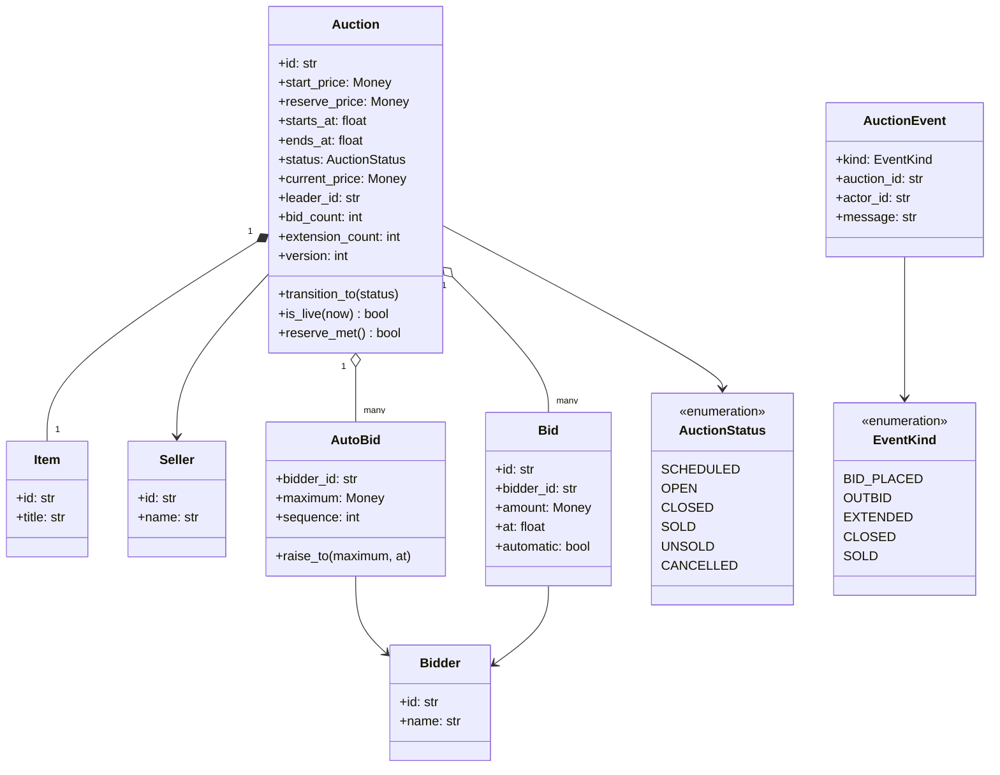
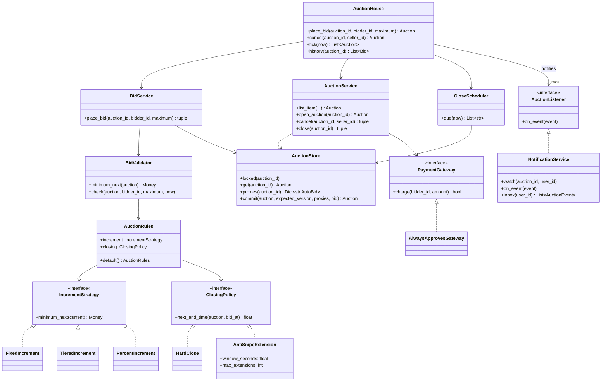
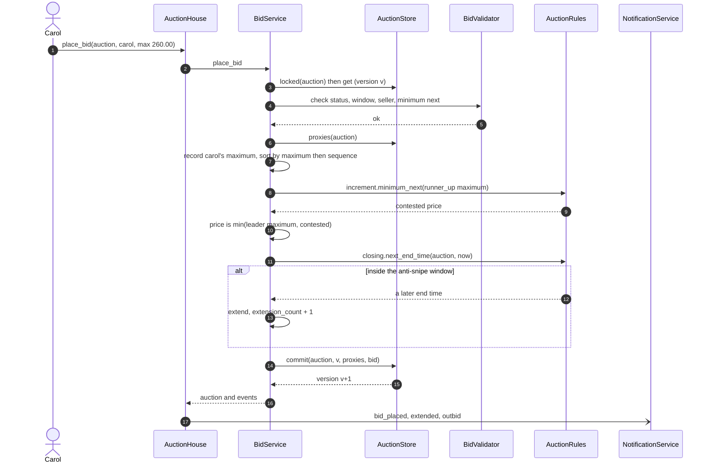
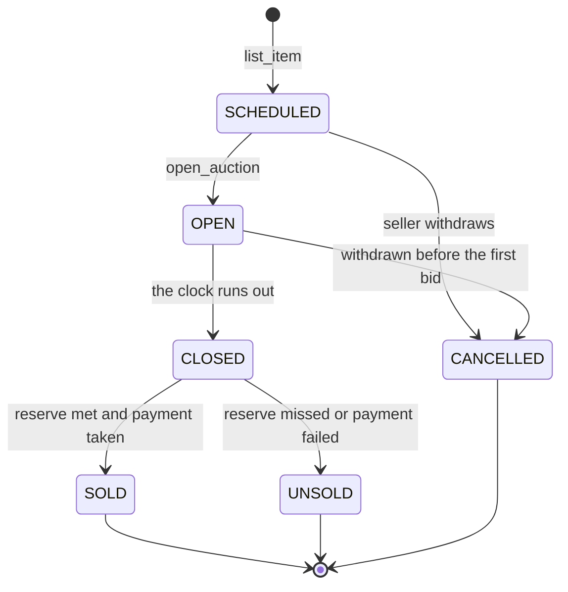

# Design an online auction

## TL;DR

- You build listings with a start and reserve price, bids that must clear an increment, proxy bidding up to a maximum, live notifications, automatic closing and payment on win.
- Three decisions carry the interview: **every bid is a maximum**, which turns proxy resolution into one sort rather than a bidding loop; **one lock per auction plus a version check** so concurrent bids cannot interleave; and **anti-sniping with a bounded number of extensions** so the auction actually ends.
- Observer for watchers, State for the auction lifecycle, Strategy for increments and closing, Mediator for the wiring. Singleton for the scheduler is discussed and deliberately *not* used.

## Problem statement

"Design an online auction site. Sellers list items with a start price, a secret reserve and a closing time. Buyers bid, and a bid must beat the current price by at least the increment. Buyers can also set a maximum and let the system bid on their behalf. Watchers get notified when the price moves and when they are outbid. When the clock runs out the highest bid wins if it meets the reserve, and the winner is charged. Focus on the classes, the bidding rule, and what happens when two bids arrive at the same instant — or at the closing instant."

## Requirements

**Functional**

- Listings with an item, start price, reserve price, start time and end time.
- A bid must be at least the current price plus the increment; the first bid pays the start price.
- Proxy bidding: a bidder states a maximum and the system bids the minimum needed on their behalf.
- Notifications to watchers when the price moves, and to a bidder the moment they are outbid.
- Automatic close at the end time: highest bidder wins if the reserve is met, otherwise the listing goes unsold.
- Anti-sniping: a bid near the end pushes the end out, a bounded number of times.
- Payment on win, through a gateway interface.
- Full bid history; the seller may withdraw a listing only before the first bid.

**Non-functional and constraints**

- Concurrent bids on the same listing must produce one leader and a price that only ever rises.
- Proxy resolution must terminate. Two proxies must not be able to bid against each other forever.
- Money is `common.Money` (integer cents).
- Time is injected, so closing behaviour is testable to the second without sleeping.
- In-memory, single process; the store is behind a repository you could back with SQL.

**Out of scope**: search and browse, shipping and taxes, seller ratings, Dutch and sealed-bid formats (a follow-up), shill-bid detection beyond the seller-cannot-bid rule.

## Clarifying questions and assumptions

| Question to ask | Assumption taken here |
|---|---|
| Does a bid mean "pay this" or "pay up to this"? | Up to this. Every bid is a maximum, which is what makes manual and proxy bidding the same code path. |
| What does the first bidder pay? | The start price, not their maximum — the same rule real marketplaces use, and the reason proxy bidding is worth having. |
| What happens on a tie of maximums? | The bidder who committed to that maximum first wins, at that maximum. `AutoBid.sequence` is the tie-break. |
| Is the reserve visible? | No. Bidders see only whether it has been met; the class exposes `reserve_met()`, not the number. |
| Is a bid at exactly the closing instant accepted? | No: the check is `now < ends_at`. Pick a side of the boundary and say it out loud, because the interviewer will ask. |
| Can anti-sniping extend forever? | No. `AntiSnipeExtension` has a `max_extensions` bound; without it two bidders can keep an auction open indefinitely. |
| Do we need a background thread for closing? | No. `CloseScheduler` is polled by `tick(now)`, so tests control time exactly; production swaps in a timer wheel. |

## Core entities and relationships

- **Auction** — the aggregate: item, seller, start and reserve price, window, status, current price, leader, bid count, extension count, and a `version` that changes on every accepted bid.
- **AutoBid** — one row per bidder per auction: their maximum plus the `sequence` in which they committed to it. A manual bid creates or raises one; there is no separate "manual bid" type.
- **Bid** — the history row: who led, at what price, when, and whether a proxy raised it rather than the bidder.
- **AuctionStatus** with `AUCTION_TRANSITIONS` — six states, and `CLOSED` genuinely means "bidding over, settlement pending".
- **IncrementStrategy** (`FixedIncrement`, `TieredIncrement`, `PercentIncrement`) and **ClosingPolicy** (`HardClose`, `AntiSnipeExtension`), bundled into **AuctionRules**.
- **BidValidator** — every refusal reason in one place, in the order it should be checked.
- **BidService** resolves proxies; **AuctionService** lists, opens, cancels and settles; **CloseScheduler** knows what is due; **NotificationService** is the observer; **PaymentGateway** is the protocol for charging the winner.
- **AuctionHouse** is the Mediator: the only object that knows all of the above.

Multiplicities: auction `1 -> *` bids, auction `1 -> *` auto-bids (at most one per bidder), auction `1 -> 1` item, house `1 -> *` listeners.

## Class diagram

**The domain: a listing, the maxima behind it, and the history it leaves.**



**The services: two pluggable policies, one validator, and the mediator that owns the wiring.**



## Design patterns applied

| Pattern | Where | Why it earns its place |
|---|---|---|
| Strategy | `IncrementStrategy`, `ClosingPolicy` | The two rules an auction house actually argues about. "Charity auctions extend for five minutes" is a constructor argument, not a code change. |
| State (transition table) | `AuctionStatus` + `AUCTION_TRANSITIONS` | Six states with explicit legal moves. `CLOSED -> SOLD` and `CLOSED -> UNSOLD` are the only ways out of `CLOSED`, which is what makes settlement restartable. |
| Observer | `AuctionListener` / `NotificationService` | Watchers, the outbid bidder, an analytics sink and an anti-shill monitor all attach the same way, and the bidder's thread never waits for them. |
| Mediator | `AuctionHouse` | `BidService` does not know notifications exist; `CloseScheduler` does not know how to close anything. All the cross-talk lives in one class, which is the difference between a mediator and a god object: it wires, it does not compute. |
| Repository with CAS | `AuctionStore.get` / `commit` | Read a copy, mutate it, hand it back with the version you read. The version check makes the "did I lose a race?" question explicit rather than implicit. |
| Polymorphism over conditionals | `AutoBid` for manual and proxy bids alike | There is no `if is_proxy` anywhere, because there is no such distinction in the model. |

What was deliberately *not* used: **Singleton** for `CloseScheduler`. It is the reflex answer — "there is only one scheduler" — but one instance created in `main` and injected gives you the same guarantee, lets tests run a dozen independent auction houses in one process, and turns "shard the scheduler by region" into a second object instead of a redesign. Say that out loud; it is the same judgement call as the parking lot's `ParkingLot`. Also no **Command** object for bids: a bid cannot be undone, so an undo stack would be a pattern applied to a domain that forbids it.

## Key flows

**Placing a bid: validate, record the maximum, resolve, extend, notify.**



**Auction lifecycle.** `CLOSED` is a real state, not a synonym for finished: the gateway is called after the close commits, so a crash mid-settlement leaves an auction the scheduler can pick up again.



## Implementation

Write the vocabulary, then the aggregate, then the two policies, then the bidding algorithm — which is the part the interviewer is waiting for.

The enums carry the transition table, and `AutoBid` carries the modelling decision that makes everything else simple.

```python title="code/lld/online_auction/models.py — enums and transitions"
--8<-- "code/lld/online_auction/models.py:enums"
```

```python title="code/lld/online_auction/models.py — errors"
--8<-- "code/lld/online_auction/models.py:errors"
```

```python title="code/lld/online_auction/models.py — entities"
--8<-- "code/lld/online_auction/models.py:entities"
```

Increments are banded in real marketplaces because a fixed step is either absurd at a dollar or invisible at a thousand. Closing is a policy for the same reason.

```python title="code/lld/online_auction/strategies.py — increments"
--8<-- "code/lld/online_auction/strategies.py:increment"
```

```python title="code/lld/online_auction/strategies.py — closing"
--8<-- "code/lld/online_auction/strategies.py:closing"
```

The store gives you a copy and takes back a version. Read `commit` carefully: it is a compare-and-set, and it is the assertion that the lock discipline holds.

```python title="code/lld/online_auction/store.py"
--8<-- "code/lld/online_auction/store.py:store"
```

Validation first, in a class of its own, so "why was my bid rejected?" has exactly one place to look.

```python title="code/lld/online_auction/services.py — validation"
--8<-- "code/lld/online_auction/services.py:validator"
```

`BidService._resolve` is the whole problem in eight lines. Sort the maxima, the top one leads, and it pays one increment over the runner-up, capped at its own maximum and floored at the current price.

```python title="code/lld/online_auction/services.py — bidding and proxy resolution"
--8<-- "code/lld/online_auction/services.py:bidservice"
```

Closing is two transactions with the gateway call between them, so no lock is held across a network call and a half-settled auction can be picked up again.

```python title="code/lld/online_auction/services.py — listing, closing and the scheduler"
--8<-- "code/lld/online_auction/services.py:auctionservice"
```

```python title="code/lld/online_auction/services.py — observer"
--8<-- "code/lld/online_auction/services.py:observer"
```

```python title="code/lld/online_auction/services.py — mediator"
--8<-- "code/lld/online_auction/services.py:mediator"
```

The demo runs one listing end to end: four maxima, a refused bid, a refused withdrawal, a snipe that extends the clock, and settlement.

```python title="code/lld/online_auction/demo.py"
--8<-- "code/lld/online_auction/demo.py"
```

Running `python -m lld.online_auction.demo` prints:

```text
A-1 Leica M6: start 100.00 USD, reserve 250.00 USD, minimum bid 100.00 USD
alice sets a maximum of 150.00 -> alice leads at 100.00 USD
bob sets a maximum of 200.00 -> bob leads at 152.50 USD
alice sets a maximum of 300.00 -> alice leads at 202.50 USD
carol sets a maximum of 260.00 -> alice leads at 265.00 USD
reserve met: True, bob's inbox: ['bid_placed', 'bid_placed', 'bid_placed', 'outbid', 'bid_placed']
dave bids too little: bid at least 270.00 USD, got 261.00 USD
seller cannot withdraw: auction A-1 already has 4 bids
carol snipes at 400.00 -> carol leads at 305.00 USD, extended 1 time(s)
alice was told: ['outbid at 152.50 USD', 'outbid at 305.00 USD']
one second left: tick closes 0 auction(s)
sold: winner carol at 305.00 USD after 5 bids
history: ['alice 100.00 USD', 'bob 152.50 USD', 'alice 202.50 USD', 'alice 265.00 USD', 'carol 305.00 USD']
```

Line 5 is the one to point at: Carol committed 260.00 and *lost*, but her bid still moved the price to 265.00 — one 5.00 band step over her maximum, paid by Alice's proxy. That is proxy bidding working, and it is the behaviour candidates most often get wrong.

## Concurrency and edge cases

**Which lock protects what.** `AuctionStore.locked(auction_id)` is a reentrant lock around one auction. Everything that touches that auction — placing a bid, cancelling, closing — holds it for the whole read-modify-write. Two listings never contend, because nothing in this design crosses auctions. `AuctionStore._registry_lock` guards the dictionaries and is held for a lookup; it is a leaf, and it is the only lock ever acquired underneath the auction lock, so there is no ordering problem to reason about.

**Why the version is still there.** `commit(auction, expected_version)` refuses to write if the stored version has moved. Under the lock it cannot have moved, so the check is an assertion rather than a retry loop — and it is exactly the mechanism you keep when you move to a shared database: drop the lock, retry on conflict, and the bidding code does not change. A test proves the check fires on a stale copy.

**Concurrent bids.** The critical section is a sort over the auction's proxies plus a dict write — microseconds, and an uncontended mutex is about 17 ns (see the [latency cheatsheet](../../cheatsheets/latency-and-estimation.md)). One lock can therefore pass far more bids per second than any single listing generates, so per-auction locking costs nothing and buys a price that only ever rises. The concurrency test fires 30 bids from 10 threads and asserts three invariants: one leader, that leader has the highest accepted maximum, and the recorded prices are non-decreasing.

**Bids at the closing instant.** The bid and the close take the same lock, so they serialise; the only question is which side of `now < ends_at` you put the boundary. This design rejects a bid at exactly `ends_at`. What you must not do is check the time outside the lock and act inside it — that is how a bid lands on an auction that has already been settled.

**Proxy termination.** The naive implementation is a loop: A's proxy outbids B, B's proxy outbids A, repeat. It does terminate, because each round raises the price by at least one increment and the maxima are finite — but you do not need the loop at all. Resolving from the maxima directly is `O(n log n)` once, with no intermediate history rows and no chance of an infinite exchange if someone later makes increments zero-valued.

**Anti-sniping must be bounded.** `AntiSnipeExtension` counts extensions and stops. Without the bound, two bidders with deep pockets keep an auction open forever and the seller never gets paid.

!!! warning "Common mistake"
    Treating a bid as "the amount the bidder pays" and then bolting proxy bidding on as a second mechanism that loops. You end up with two code paths, an ordering bug between them, and a bidding war that can spin. Model every bid as a maximum from the first minute, and proxy bidding stops being a feature and becomes the default behaviour of one sort.

**Other edge cases handled**: a bid below the minimum next (rejected, nothing written, version unchanged); the seller bidding on their own listing; a bid in a different currency; a bidder trying to lower their own maximum; a tie of maximums; a reserve that is never met; a payment that fails at settlement; a withdrawal after the first bid; a second `tick` after settlement returning nothing; an auction left `CLOSED` by a crash, which the scheduler picks up again.

## Extensibility and follow-ups

- **Dutch and sealed-bid auctions**: both are a different `IncrementStrategy` plus a different resolution rule. Extract `_resolve` into a `PricingRule` strategy and a Dutch auction becomes "the price falls until someone accepts", with the same store, scheduler and notifications.
- **Buy it now**: a price on the auction and a `buy_now` method that takes the same lock, transitions straight to `CLOSED`, and settles. It composes with everything already here because the lock is the auction.
- **Shill-bid detection**: a listener on the event stream that flags a bidder who repeatedly pushes a specific seller's prices and never wins. It attaches like any other `AuctionListener` and never touches `BidService`.
- **Escrow instead of a direct charge**: `PaymentGateway` grows `hold` and `release`; `close` holds at settlement and releases on delivery confirmation. That is the [payment gateway and wallet](payment-gateway-wallet.md) problem underneath.
- **Clock skew**: every timestamp here comes from an injected `Clock`. In a distributed deployment the closing decision must be made by one authority — the scheduler's clock — and bid timestamps recorded by that same clock, never by the client's.
- **Scale**: a hot listing is a hot key. The per-auction lock becomes a row lock or a single-partition actor; the notification fan-out becomes a topic per auction; and the scheduler becomes a timer wheel or a delayed queue. That is the point where this becomes an HLD conversation.

!!! tip "Interview tip"
    When you get to proxy bidding, resist the loop. Say "every bid is a maximum, so the leader is the highest maximum and the price is one increment over the second-highest" and write the four-line `_resolve`. It is shorter than the loop, obviously terminating, and it is exactly how the real systems work — which is a strong signal that you have thought about the domain and not just the code.

## Tests

`tests/test_online_auction.py` has 16 cases. The three worth walking through are the anti-snipe bound, the concurrency invariants, and the closing-instant boundary:

```python title="code/lld/online_auction/tests/test_online_auction.py — anti-sniping"
--8<-- "code/lld/online_auction/tests/test_online_auction.py:snipe"
```

```python title="code/lld/online_auction/tests/test_online_auction.py — concurrency"
--8<-- "code/lld/online_auction/tests/test_online_auction.py:concurrency"
```

The rest cover: the first bid paying the start price and a proxy paying one increment over the runner-up; a tie going to whoever committed first; a bid below the minimum and a seller bidding on their own listing, both leaving the auction untouched; a bid at exactly the closing instant refused while `tick` settles the auction; a reserve that is not met and a payment that fails, both ending unsold; withdrawal allowed only before the first bid; a stale version rejected by the compare-and-set; and all three increment strategies via `parametrize`. Run them with `uv run pytest code/lld/online_auction -q`.

## 45-minute pacing

| Minutes | What to do | What to say or write |
|---|---|---|
| 0-5 | Clarify | Does a bid mean "pay up to"? Is the reserve secret? Anti-sniping? What happens at exactly the end time? Out of scope: search, shipping, ratings. |
| 5-11 | Entities | Auction, Item, Bid, AutoBid, and the sentence "every bid is a maximum". Draw the six-state lifecycle. |
| 11-18 | Class diagram | Domain first, then hang `IncrementStrategy` and `ClosingPolicy` off `AuctionRules` and mark the per-auction lock. |
| 18-33 | Code | `BidValidator.check`, then `_resolve` (the sort), then `place_bid` with the extension and the events. Narrate "validate, record, resolve, extend, commit, notify". |
| 33-40 | Concurrency and closing | The auction lock, the version check, the closing-instant boundary, and why extensions are bounded. |
| 40-45 | Extensions | Dutch auctions as a strategy, buy-it-now, shill detection as a listener, and the hand-off to a hot-key HLD discussion. |

## Related

- [Observer](../patterns/observer.md) — watchers, outbid notices and the event stream
- [State](../patterns/state.md) — the auction lifecycle and its transition table
- [Mediator](../patterns/mediator.md) — `AuctionHouse` wiring services that never call each other
- [Strategy](../patterns/strategy.md) — increments and closing policies
- [Design a stock brokerage system](stock-brokerage.md) — the same price-priority ideas with an external venue
- [Design a payment gateway and digital wallet](payment-gateway-wallet.md) — what settlement becomes when the money is real
