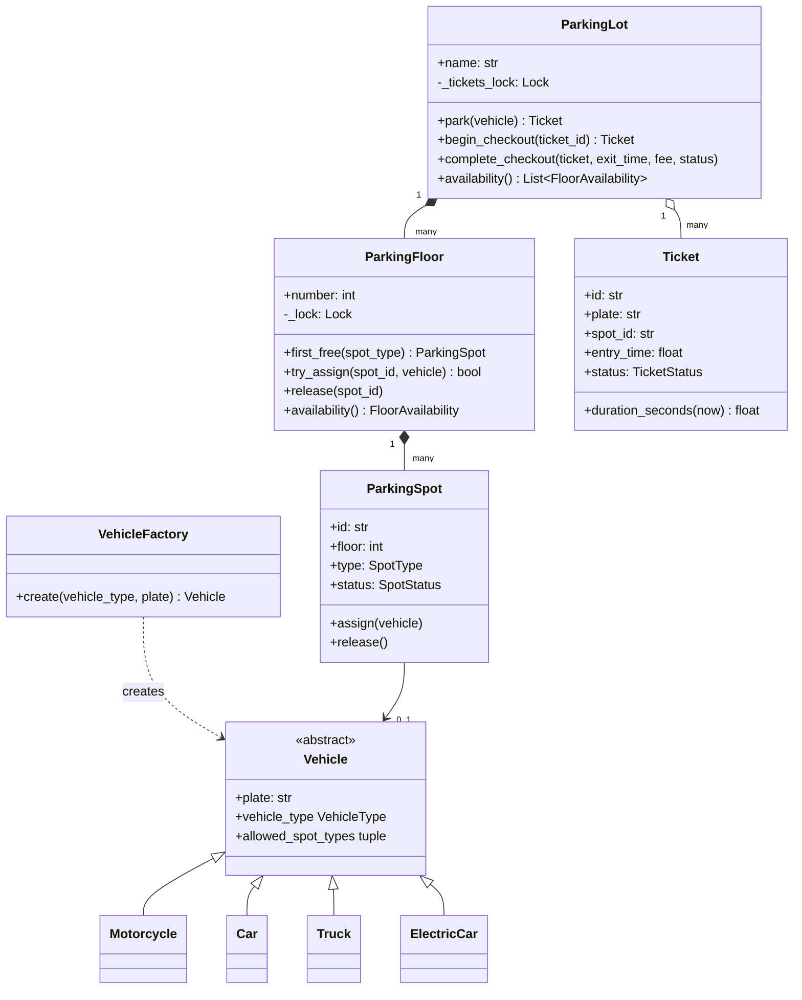
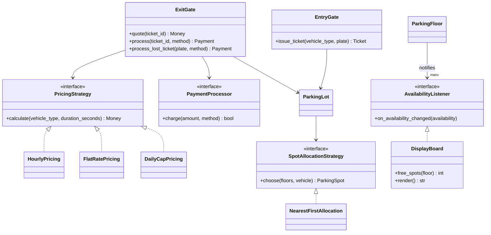
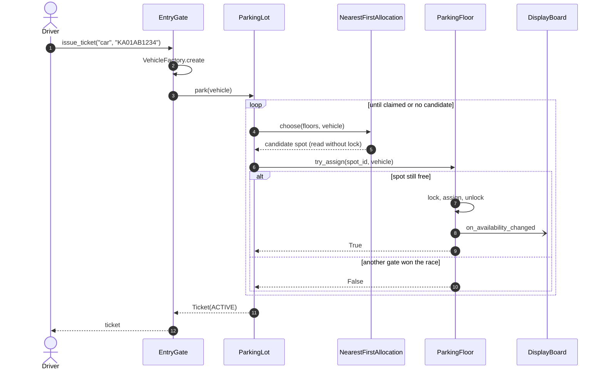
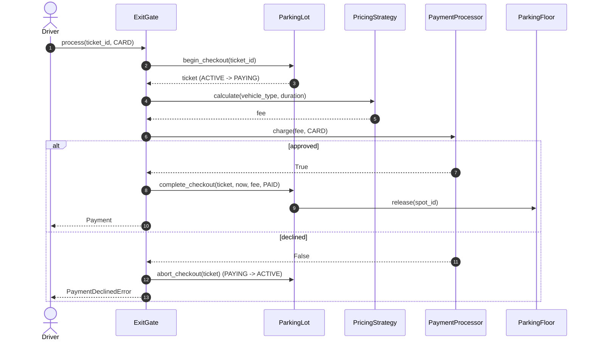
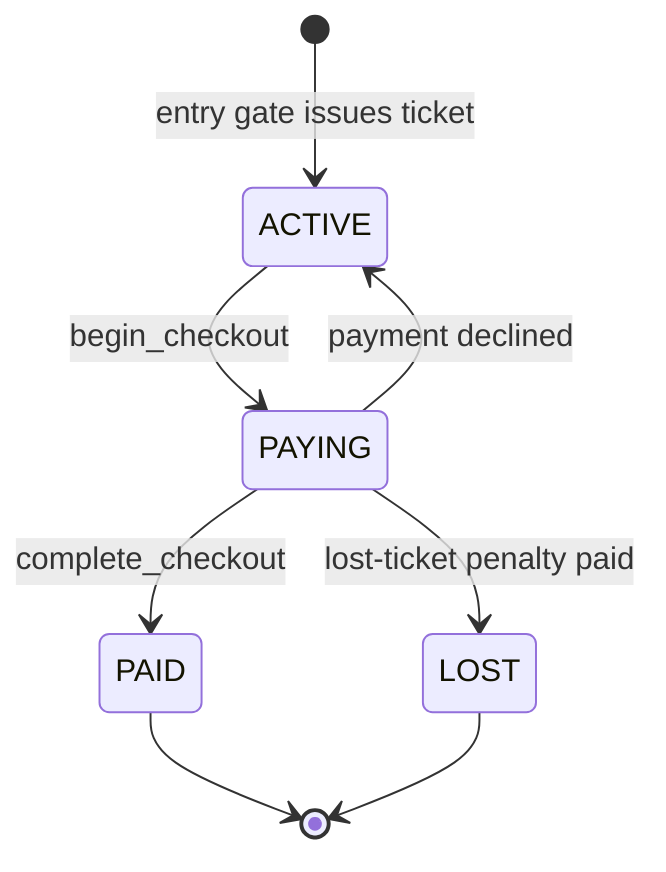

# Design a parking lot

## TL;DR

- You build a multi-floor lot where gates issue tickets, spots are allocated by a pluggable policy, and exits charge by a pluggable pricing rule.
- Three decisions carry the interview: **who owns the lock** (each floor, not the lot), **how the exit gate avoids double charging** (reserve the ticket, charge, commit), and **how vehicles map to spots** (polymorphism, not an `if/elif` ladder).
- Patterns that earn their place: Strategy (pricing, allocation), Factory Method (vehicles), Observer (display board). Singleton is discussed and deliberately *not* used.

## Problem statement

"Design the software for a multi-floor parking lot. Vehicles of different sizes arrive at several entry gates and receive a ticket; when they leave through an exit gate they pay according to how long they stayed. The lot should display free spots per floor and reject vehicles when it is full. Focus on the core classes, the flows, and how it behaves when two gates act at the same time."

## Requirements

**Functional**

- Multiple floors; each floor has spots of types motorcycle, compact, large and electric (compact with a charger).
- Vehicle types: motorcycle, car, truck, electric car. A motorcycle may use any spot; a car a compact or large spot; a truck only a large spot; an electric car prefers an electric spot but can take a compact one.
- Several entry gates issue tickets and assign the *nearest* eligible spot (lowest floor, most suitable type, lowest spot number).
- Several exit gates compute the fee with a pricing strategy (hourly with a grace period, flat rate, hourly with a daily cap), accept cash or card, and free the spot.
- A lost ticket is settled with a flat penalty by licence plate.
- A display board per floor shows free spots per type; admins can take spots out of service.
- When no eligible spot is free anywhere, the gate rejects the vehicle.

**Non-functional and constraints**

- Correct under concurrency: two gates must never assign the same spot, and two exit gates must never charge the same ticket.
- In-memory, single process; persistence is behind an interface you could add later.
- Deterministic and testable: time and IDs are injected.

**Out of scope**: payments integration beyond a processor interface, reservations, pricing by demand, hardware (barriers, cameras).

## Clarifying questions and assumptions

| Question to ask | Assumption taken here |
|---|---|
| How many gates, and can they act simultaneously? | Yes; that is the whole point of the concurrency section. |
| Is "nearest" measured from the gate or just the lowest floor? | Lowest floor, then spot number. The allocation strategy is pluggable, so per-gate distance is a one-class change. |
| Can a small vehicle take a bigger spot? | Yes, in order of preference; a truck never fits a compact spot. |
| How is the fee computed? | Per started hour after a 15-minute grace period by default; the strategy is injectable. |
| Do we charge for a declined card? | No: a declined payment leaves the car parked and the ticket active. |
| Do we need persistence or multiple lots? | Not now; the lot is an ordinary object, so a second lot is a second instance. |

## Core entities and relationships

- **Vehicle** (abstract) with `Motorcycle`, `Car`, `Truck`, `ElectricCar`. Each subclass declares the spot types it accepts, most preferred first. `VehicleFactory` turns the gate's raw input into the right subclass.
- **ParkingSpot** — id, floor, `SpotType`, `SpotStatus` (free / occupied / out of service) and the vehicle currently in it. One spot belongs to exactly one floor.
- **ParkingFloor** — owns many spots and *the lock* that makes assignment on that floor atomic. It publishes `FloorAvailability` to listeners.
- **ParkingLot** — the aggregate root: many floors, the ticket registry, the allocation strategy, the injected clock and ID generator. Built once in `main` and passed to the gates.
- **Ticket** — plate, vehicle type, spot, entry time, and a status that moves `ACTIVE → PAYING → PAID` (or `LOST`).
- **EntryGate** / **ExitGate** — thin services: the entry gate creates the vehicle and asks the lot to park it; the exit gate prices the stay, charges through a `PaymentProcessor`, and commits.
- **PricingStrategy** and **SpotAllocationStrategy** — the two policies that vary; **DisplayBoard** — an observer of floor availability.

Multiplicities: lot `1 → *` floors, floor `1 → *` spots, ticket `1 → 1` spot, lot `1 → *` tickets.

## Class diagram

**Structure: what the lot is made of.**



**Behaviour: the gates and the three pluggable policies.**



## Design patterns applied

| Pattern | Where | Why it earns its place |
|---|---|---|
| Strategy | `PricingStrategy`, `SpotAllocationStrategy` | Pricing and allocation are the two rules the interviewer will ask you to change ("now add a daily cap", "now prefer spots near the gate"). Each is a one-class addition. |
| Factory Method | `VehicleFactory.create` | The gate receives a string and a plate; the registry dict maps it to a class. Adding a bus touches the registry, not the gate. |
| Polymorphism over conditionals | `Vehicle.allowed_spot_types` | The allocator never asks "what type are you?" — it iterates the vehicle's own preference list. This is the open/closed principle in one line. |
| Observer | `ParkingFloor` → `AvailabilityListener` (`DisplayBoard`) | Floors push availability; the board never polls and floors never know what a board is. |
| Dependency Injection | `Clock`, `IdGenerator`, `PaymentProcessor`, strategies | Tests use `FakeClock` and a declining processor; nothing calls `time.time()`. |
| State (lightweight) | `TicketStatus`, `SpotStatus` with guarded transitions | Enum plus guard clauses is enough here; full State classes would be ceremony. |

What was deliberately *not* used: **Singleton** for `ParkingLot`. Interviewers often expect it; the better answer is "one instance created in `main` and injected" — tests can build many lots, and a second physical lot becomes a second object instead of a redesign. Say that out loud; it signals judgement.

## Key flows

**Entry: the gate asks the lot, the lot asks the strategy, the floor does the atomic claim.**



**Exit: reserve the ticket, price it, charge, commit — so a declined card cannot free the spot.**



**Ticket lifecycle.** The `PAYING` state is what makes two exit gates safe: only one of them can move the ticket out of `ACTIVE`.



## Implementation

Write the code in the order an interviewer wants to see it: the vocabulary first (enums and errors), then the entities, then the policies, then the services that tie them together. Every block below is the real file the tests run.

The enums pin down the vocabulary, and the errors subclass the shared hierarchy so callers can catch `ConflictError` without knowing about parking:

```python title="code/lld/parking_lot/models.py — enums"
--8<-- "code/lld/parking_lot/models.py:enums"
```

```python title="code/lld/parking_lot/models.py — errors"
--8<-- "code/lld/parking_lot/models.py:errors"
```

Vehicles carry their own spot preferences. Note that `allowed_spot_types` is ordered: the allocator tries a motorcycle spot before a compact one for a motorcycle, so cheap spots are not wasted.

```python title="code/lld/parking_lot/models.py — vehicles"
--8<-- "code/lld/parking_lot/models.py:vehicles"
```

Spots and tickets are plain dataclasses with guarded transitions; `FloorAvailability` is the immutable message floors publish to observers.

```python title="code/lld/parking_lot/models.py — entities"
--8<-- "code/lld/parking_lot/models.py:entities"
```

Pricing is a `Protocol`, so any object with a `calculate` method qualifies — no inheritance needed. `DailyCapPricing` composes `HourlyPricing` rather than subclassing it.

```python title="code/lld/parking_lot/strategies.py — pricing"
--8<-- "code/lld/parking_lot/strategies.py:pricing"
```

Allocation only *selects*; it never mutates. That separation is what lets the floor own the lock.

```python title="code/lld/parking_lot/strategies.py — allocation"
--8<-- "code/lld/parking_lot/strategies.py:allocation"
```

The floor is the unit of locking. `first_free` is a lock-free hint; `try_assign` re-checks under the lock and returns `False` if another gate got there first.

```python title="code/lld/parking_lot/services.py — floor"
--8<-- "code/lld/parking_lot/services.py:floor"
```

The lot runs an optimistic loop: choose, try to claim, and retry on a lost race. The ticket registry has its own lock, and the `begin / complete / abort` trio is the checkout state machine.

```python title="code/lld/parking_lot/services.py — lot"
--8<-- "code/lld/parking_lot/services.py:lot"
```

The gates are thin. The exit gate's `_settle` is the one place where "charge, then commit" is enforced.

```python title="code/lld/parking_lot/services.py — gates"
--8<-- "code/lld/parking_lot/services.py:gates"
```

The observer side is small and deliberately decoupled — the floor notifies *outside* its lock so a slow listener can never block a gate:

```python title="code/lld/parking_lot/services.py — observer"
--8<-- "code/lld/parking_lot/services.py:observer"
```

Running `python -m lld.parking_lot.demo` prints the scenario end to end:

```text
T-1:          car KA01AB1234 -> spot F1-C01
T-2:   motorcycle KA02MC0001 -> spot F1-M01
T-3:        truck KA03TR9999 -> spot F1-L01
T-4: electric_car KA04EV4242 -> spot F1-E01
--- display board ---
Floor 1: 1 motorcycle, 2 compact, 0 large, 0 electric
Floor 2: 4 compact, 2 large
--- KA01AB1234 leaves after 2h35m: charged 9.00 USD (card) ---
second exit rejected: ticket T-1 is paid, not active
lost ticket for KA02MC0001: charged 50.00 USD
--- display board ---
Floor 1: 2 motorcycle, 3 compact, 0 large, 0 electric
Floor 2: 4 compact, 2 large
free spots in Downtown: 11
```

## Concurrency and edge cases

**Which lock protects what.** There are exactly two kinds of lock, and naming them is the answer the interviewer is fishing for:

1. `ParkingFloor._lock` guards spot status on that floor. Two gates racing for the last compact spot on floor 1 serialise on it; a gate working on floor 2 is not affected. This is finer than one lot-wide lock and coarser than one lock per spot (which would make "find a free spot" a multi-lock dance).
2. `ParkingLot._tickets_lock` guards the ticket registry and every ticket status transition. `begin_checkout` moves a ticket `ACTIVE → PAYING` under this lock, so two exit gates handed the same ticket cannot both charge it; the loser gets `TicketStateError`.

**The optimistic claim loop.** The allocation strategy reads spot status without a lock (a hint), and `try_assign` re-validates under the floor lock. If the spot was taken in between, `park` simply chooses again. The loop is bounded (`MAX_CLAIM_ATTEMPTS`) so a pathological storm degrades to a clean `LotFullError` instead of a spin.

**Declined payment.** The charge happens while the ticket is `PAYING`; on failure `abort_checkout` returns it to `ACTIVE` and the spot stays occupied. Nothing is released before money is confirmed.

**Edge cases handled**: grace period (first 15 minutes free), partial hours rounded up, lost ticket by plate (only an *active* ticket qualifies), out-of-service spots excluded from allocation, unknown ticket ids, a second exit on a paid ticket, empty plates, unknown vehicle types.

!!! warning "Common mistake"
    Putting a single lock on `ParkingLot.park` and calling the problem solved. It is correct, but it serialises every gate in the building through one mutex, and you have just told the interviewer you did not think about granularity. Name the floor lock, explain why not per-spot, and mention the optimistic retry.

## Extensibility and follow-ups

- **Reservations**: add a `RESERVED` spot status with an expiry and a `ReservationService` that holds the floor lock when converting a reservation into an assignment; allocation skips reserved spots.
- **EV charging fees**: a `ChargingPricing` decorator around any `PricingStrategy` that adds energy cost from a meter reading — Decorator, not a subclass explosion.
- **Per-gate "nearest"**: a `NearestToGateAllocation(gate_location)` strategy that sorts spots by distance; nothing else changes.
- **Persistence**: `ParkingLot` keeps tickets in a dict today; put that behind a `TicketRepository` protocol with an in-memory and a SQL implementation.
- **Multiple lots / a city-wide system**: this is where the conversation becomes an HLD question — availability APIs, a search service, payments, and eventual consistency of the display boards.
- **Hardware events**: barrier and camera integrations become additional `AvailabilityListener`s or gate adapters.

!!! tip "Interview tip"
    When asked "how would you add X?", answer with the *seam*: "that is a new `PricingStrategy`, registered here, and nothing else changes." Then say which test you would add. That is the extensibility signal interviewers grade at SDE2.

## Tests

`tests/test_parking_lot.py` has 14 cases. The ones worth walking through in an interview are the concurrency test (40 arrivals, 10 spots, three gates — every spot used exactly once) and the declined-payment test (the car stays parked):

```python title="code/lld/parking_lot/tests/test_parking_lot.py — concurrency"
--8<-- "code/lld/parking_lot/tests/test_parking_lot.py:concurrency"
```

```python title="code/lld/parking_lot/tests/test_parking_lot.py — declined payment"
--8<-- "code/lld/parking_lot/tests/test_parking_lot.py:declined"
```

The rest cover: per-started-hour pricing, the grace period, motorcycle preference then fallback, trucks spilling to the next floor and `LotFullError`, exiting twice and unknown tickets, the lost-ticket flow, the display board, and all three pricing strategies via `parametrize`. Run them with `uv run pytest code/lld/parking_lot -q`.

## 45-minute pacing

| Minutes | What to do | What to say or write |
|---|---|---|
| 0–5 | Clarify | Gates in parallel? Spot/vehicle fit rules? Pricing? Lost tickets? Out of scope: payments integration, reservations. |
| 5–10 | Entities | Nouns on the board: Lot, Floor, Spot, Vehicle (+4), Ticket, Gates, Payment. Verbs become methods: `park`, `process`, `calculate`, `choose`. |
| 10–18 | Class diagram | Draw structure first, then hang the three strategies and the observer off it. Mark the two locks. |
| 18–35 | Code | Enums → `Vehicle` hierarchy → `ParkingFloor.try_assign` → `ParkingLot.park` loop → `ExitGate.process`. Say "reserve, charge, commit" while writing it. |
| 35–42 | Concurrency and tests | Explain the floor lock and the `PAYING` state; describe the 40-arrivals test. |
| 42–45 | Extensions | Reservations, EV pricing as a Decorator, per-gate nearest, multiple lots as the HLD hand-off. |

## Related

- [Strategy](../patterns/strategy.md) — the pricing and allocation policies
- [Factory Method](../patterns/factory-method.md) — `VehicleFactory` and the registry idiom
- [Singleton](../patterns/singleton.md) — why the lot is injected instead
- [Concurrency for LLD in Python](../fundamentals/concurrency-for-lld.md) — lock granularity and optimistic retries
- [The LLD interview framework](../fundamentals/lld-interview-framework.md) — the process this page follows
- [Mock LLD interview: parking lot](../../mocks/mock-lld-parking-lot.md) — the same problem as a 45-minute transcript
