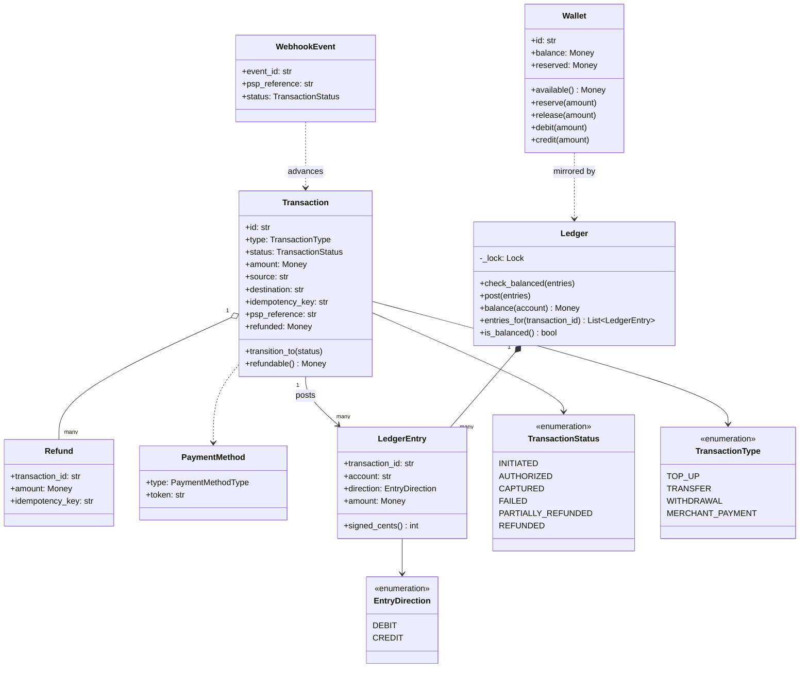
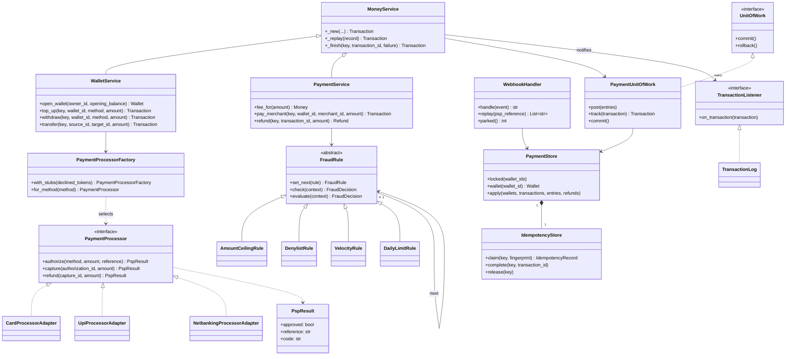
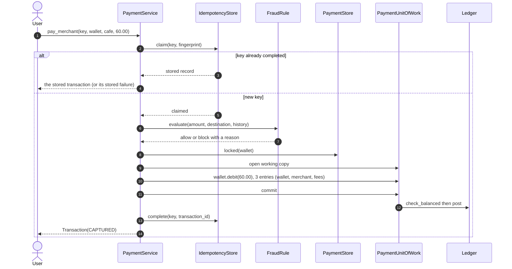
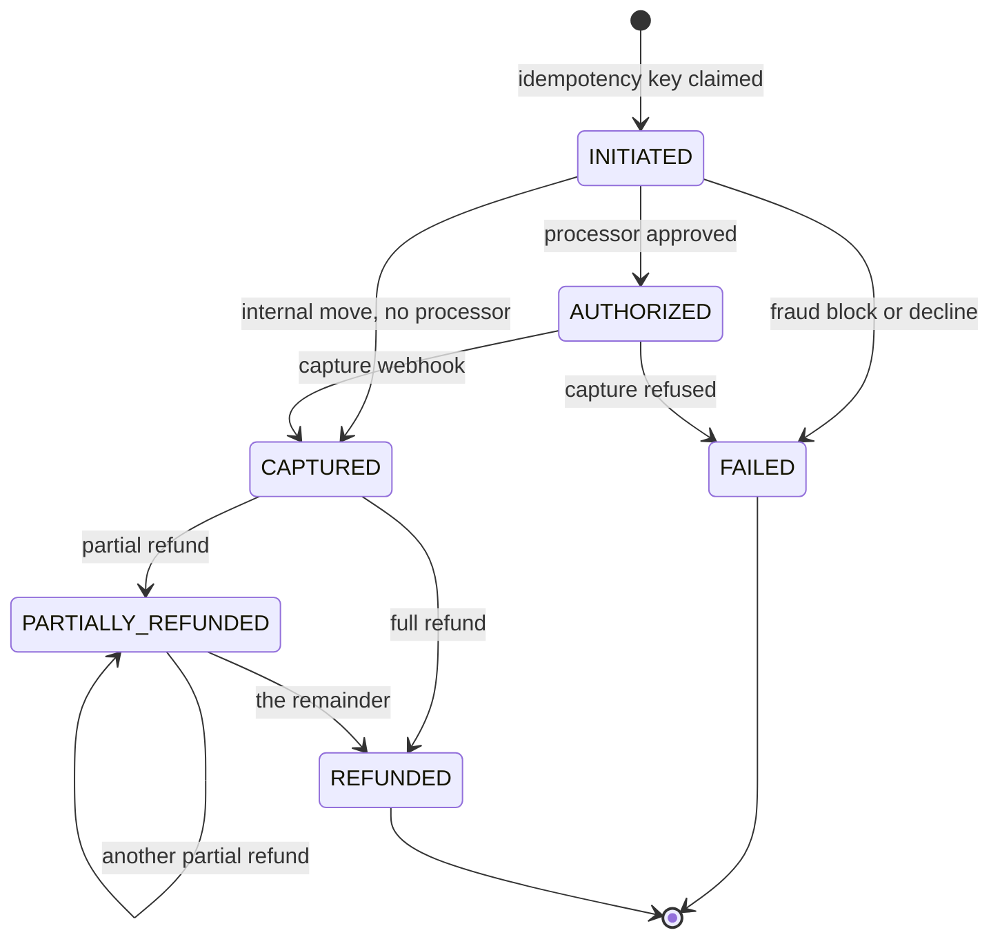

# Design a payment gateway and digital wallet

## TL;DR

- You build wallets, a gateway to card, UPI and netbanking processors, and a double-entry ledger that every cent passes through.
- Three decisions carry the interview: **an idempotency key on every money-moving call**, **debits equal credits or nothing is written**, and **wallet locks taken in id order** so two transfers in opposite directions queue instead of deadlocking.
- Adapter hides three incompatible vendor SDKs, Chain of Responsibility holds the fraud and limit rules, Unit of Work makes balance plus ledger plus transaction one commit, and the webhook handler survives duplicate, reordered and early delivery.

## Problem statement

"Design a digital wallet with a payment gateway in front of it. Users add money from a card, UPI or bank account, send money to each other, pay merchants and get refunds. Each payment goes through fraud and limit checks, is authorized and captured with an external processor, and shows up in a history. The processor calls us back with webhooks that are not always in order and not always once. Focus on the classes, the money invariants, and what happens when a client retries a payment it is not sure went through."

## Requirements

**Functional**

- Wallets with a balance and reservations; opening balance funded from the clearing account so the book starts balanced.
- Add money through a payment method (card, UPI, netbanking) via a processor adapter; withdraw back to a bank.
- Wallet-to-wallet transfer; merchant payment with a platform fee; full and partial refunds.
- A payment lifecycle: initiated, authorized, captured, failed, partially refunded, refunded.
- An idempotency key on every money-moving call. A repeat returns the stored result; the same key with a different payload is an error.
- A double-entry ledger: every posting has debits equal to credits, and the ledger balance of a wallet account equals the wallet balance.
- Fraud and daily-limit rules evaluated before any money moves.
- Processor webhooks that may be duplicated, reordered, or arrive before the transaction row is committed.

**Non-functional and constraints**

- Money is `common.Money` (integer cents). Fees are integer basis points with floor division; no float, ever.
- Effectively-once money movement: at-least-once delivery plus idempotent handlers.
- No deadlock. Multi-wallet operations acquire locks in a fixed order.
- No processor call while a lock is held.
- A wallet can never go negative.

**Out of scope**: KYC, currency conversion, chargeback dispute workflows, card tokenisation and PCI scope, settlement files and reconciliation (that is the [HLD version](../../hld/case-studies/payment-system.md)).

## Clarifying questions and assumptions

| Question to ask | Assumption taken here |
|---|---|
| Who supplies the idempotency key? | The client, one per logical request. We store the request fingerprint with it and reject the key if the payload differs. |
| What does a retry get back while the first call is still running? | A conflict, not a second payment. In-flight is a real state in the idempotency store. |
| Is a top-up settled when the processor approves it? | No. Approval is `AUTHORIZED`; the money lands when the capture webhook arrives. That is what makes the webhook path worth designing. |
| Can webhooks arrive out of order? | Yes. Each status has a rank; an event that does not move the transaction forward is ignored. |
| What if a webhook arrives before we committed the transaction? | It is parked by processor reference and replayed the moment the row exists. |
| How is the merchant fee rounded? | `amount x 200 / 10000` with floor division, so the platform never rounds in its own favour, and the merchant gets the remainder. |
| One currency or many? | One per store. Multi-currency needs a rate snapshot per transaction, which is a follow-up. |

## Core entities and relationships

- **Wallet** — balance, reservations, and the only negative-balance guard in the system. `available()` is `balance - reserved`.
- **Transaction** — one money-moving intent: type, status, amount, source and destination *ledger accounts*, idempotency key, processor reference, refunded total. `transition_to` consults `TRANSACTION_TRANSITIONS`.
- **LedgerEntry** and **Ledger** — the book. An entry is one side of a posting; `Ledger.check_balanced` refuses anything whose signed cents do not sum to zero.
- **PaymentMethod** and the **PaymentProcessor** protocol, with **CardProcessorAdapter**, **UpiProcessorAdapter** and **NetbankingProcessorAdapter** over three deliberately incompatible vendor clients; **PaymentProcessorFactory** picks one by method type.
- **FraudRule** chain — `AmountCeilingRule`, `DenylistRule`, `VelocityRule`, `DailyLimitRule`, each returning a `FraudDecision` or passing the request on.
- **IdempotencyStore** — `claim`, `complete`, `release`. **PaymentStore** owns wallets, transactions, refunds, the ledger and one reentrant lock per wallet. **PaymentUnitOfWork** is the transaction boundary.
- **MoneyService** is the shared skeleton; **WalletService** and **PaymentService** fill in the middle. **WebhookHandler** applies processor events.

Multiplicities: wallet `1 -> *` transactions, transaction `1 -> *` ledger entries (always at least two), transaction `1 -> *` refunds, store `1 -> 1` ledger, method type `1 -> 1` processor adapter.

## Class diagram

**The domain: a wallet, a transaction, and the ledger both of them answer to.**



**The services: adapters, the fraud chain, the transaction boundary and the webhook handler.**



## Design patterns applied

| Pattern | Where | Why it earns its place |
|---|---|---|
| Adapter | `CardProcessorAdapter`, `UpiProcessorAdapter`, `NetbankingProcessorAdapter` | The three stub clients return a dict, a tuple and a colon-separated string, which is exactly how real vendor SDKs differ. Each adapter normalises one into `PspResult`; nothing upstream knows a vendor exists. |
| Chain of Responsibility | `FraudRule` and its four subclasses | Rules are added, reordered and switched off per market. Cheap checks sit at the front, history scans at the back, and the first rule with an opinion wins. |
| Unit of Work | `PaymentUnitOfWork` + `PaymentStore.apply` | Balance, transaction row and ledger entries become visible together, and `apply` validates the posting *before* it writes. An imbalanced posting cannot move a balance. |
| Template Method | `MoneyService` | Claim key, lock, transact, commit, complete, notify — the same six steps in five operations. The subclasses only supply the middle. |
| State (transition table) | `TRANSACTION_TRANSITIONS` + `Transaction.transition_to` | Six statuses with an explicit legal-move table. `CAPTURED` can only become a refund state; `FAILED` and `REFUNDED` are terminal. |
| Factory | `PaymentProcessorFactory.for_method` | Method type to adapter, in one dict. Adding a wallet-to-wallet rail is one entry. |
| Observer | `TransactionListener` / `TransactionLog` | Receipts, notifications and analytics hang off settled transactions and are notified outside every lock. |
| Repository (light) | `PaymentStore` | `wallet`, `transaction`, `apply`, `locked`. Backing it with SQL means implementing four methods, and `locked` becomes `SELECT ... FOR UPDATE` in id order. |

What was deliberately *not* used: **two-phase commit** between the wallet and the processor. You cannot enrol a card network in your transaction; the honest answer is a local transaction plus an idempotent, reconcilable webhook — which is what this design is. Also no **Saga orchestrator** class: with one local resource and one remote call, a reservation and a compensating release are enough.

## Key flows

**A merchant payment: fraud chain, then one transaction that debits, credits and splits the fee.**



**Transaction lifecycle.** A fraud block and a processor decline both land on `FAILED`, which is what makes the replay path uniform.



## Implementation

The order to write it in: vocabulary, wallet, transaction, ledger, adapters, fraud chain, idempotency, transaction boundary, services.

The enums carry two tables. `TRANSACTION_TRANSITIONS` is the state machine; `STATUS_RANK` is what makes an out-of-order webhook detectable in one comparison.

```python title="code/lld/payment_gateway_wallet/models.py — enums and tables"
--8<-- "code/lld/payment_gateway_wallet/models.py:enums"
```

```python title="code/lld/payment_gateway_wallet/models.py — errors"
--8<-- "code/lld/payment_gateway_wallet/models.py:errors"
```

The wallet is four methods and one guard. Say out loud that `debit` is the *only* place a balance goes down, so "can a wallet go negative?" has a one-line answer.

```python title="code/lld/payment_gateway_wallet/models.py — wallet"
--8<-- "code/lld/payment_gateway_wallet/models.py:wallet"
```

```python title="code/lld/payment_gateway_wallet/models.py — transaction and refund"
--8<-- "code/lld/payment_gateway_wallet/models.py:transaction"
```

The ledger is the shortest and most important file. `signed_cents` turns a posting into a sum that must be zero, and `check_balanced` is called before anything is written.

```python title="code/lld/payment_gateway_wallet/ledger.py"
--8<-- "code/lld/payment_gateway_wallet/ledger.py:ledger"
```

The three stub clients are intentionally inconsistent. Read them together with their adapters: this is what Adapter is actually for, and it is worth 30 seconds of narration in the room.

```python title="code/lld/payment_gateway_wallet/psp.py"
--8<-- "code/lld/payment_gateway_wallet/psp.py:psp"
```

Fraud rules are a chain because the ordering is a business decision that changes. `check` returns `None` to pass the request on; `evaluate` walks the chain.

```python title="code/lld/payment_gateway_wallet/fraud.py"
--8<-- "code/lld/payment_gateway_wallet/fraud.py:fraud"
```

Three verbs make money movement effectively-once. `claim` is the one to talk through: a completed key replays, an in-flight key conflicts, a mismatched fingerprint conflicts.

```python title="code/lld/payment_gateway_wallet/store.py — idempotency"
--8<-- "code/lld/payment_gateway_wallet/store.py:idempotency"
```

`locked` is the deadlock answer: sort the ids, take the locks, release in reverse. The Unit of Work validates before it writes.

```python title="code/lld/payment_gateway_wallet/store.py — store and lock ordering"
--8<-- "code/lld/payment_gateway_wallet/store.py:store"
```

```python title="code/lld/payment_gateway_wallet/store.py — unit of work"
--8<-- "code/lld/payment_gateway_wallet/store.py:uow"
```

`MoneyService` holds the shape every operation repeats; `WalletService` and `PaymentService` supply the middle. `top_up` is the interesting one: authorize, commit, and let the webhook settle.

```python title="code/lld/payment_gateway_wallet/services.py — shared skeleton"
--8<-- "code/lld/payment_gateway_wallet/services.py:base"
```

```python title="code/lld/payment_gateway_wallet/services.py — wallet service"
--8<-- "code/lld/payment_gateway_wallet/services.py:wallet_service"
```

```python title="code/lld/payment_gateway_wallet/services.py — payment service"
--8<-- "code/lld/payment_gateway_wallet/services.py:payment_service"
```

The webhook handler is three defences in fifteen lines: duplicate by event id, out of order by rank, early by parking and replay.

```python title="code/lld/payment_gateway_wallet/webhooks.py"
--8<-- "code/lld/payment_gateway_wallet/webhooks.py:webhooks"
```

The demo runs a full day: a card top-up settled by webhook, a duplicate and a late webhook, an early webhook, a retried transfer, a merchant payment with its fee, a partial refund, and a blocked payment.

```python title="code/lld/payment_gateway_wallet/demo.py"
--8<-- "code/lld/payment_gateway_wallet/demo.py"
```

Running `python -m lld.payment_gateway_wallet.demo` prints:

```text
opened T-1 with 200.00 USD and T-5 with 50.00 USD
top-up T-9 authorized at the card network, balance still 200.00 USD
capture webhook: applied, balance 500.00 USD
same webhook again: duplicate
late authorized webhook: ignored
webhook for the next authorization arrives first: deferred, parked 1
top-up T-10 committed, parked drained to 0, balance 600.00 USD
transfer T-11: ada 480.00 USD, bob 170.00 USD
retry of the same key: T-11, ada still 480.00 USD
same key, different amount: key idem-xfer-1 was already used for a different request
paid cafe 60.00 USD: merchant 58.80 USD, fees 1.20 USD (2% of 60.00 USD is 1.20 USD)
refund 25.00 USD: transaction now partially_refunded, ada 445.00 USD
fraud chain: P-9 failed: fraud:amount_ceiling:600.00 USD exceeds the 500.00 USD ceiling
ledger balanced: True over 16 entries
wallet ledger account matches the wallet: 445.00 USD == 445.00 USD
```

The last two lines are the ones to point at. The whole book nets to zero, and the ledger's view of the wallet agrees with the wallet's own balance — two independent statements of the same truth.

## Concurrency and edge cases

**Which lock protects what, and in what order.**

1. `PaymentStore._wallet_locks[wallet_id]` is a reentrant lock guarding one wallet's balance, reservations and the transactions that touch it. It is held across the whole read-modify-write.
2. `PaymentStore.locked(*wallet_ids)` sorts the ids before acquiring. A transfer A to B and a simultaneous B to A therefore request the same lock first and queue; without the sort they would take one lock each and wait forever. That single `sorted` call is the deadlock answer, and interviewers ask for it by name.
3. `PaymentStore._registry_lock` guards the dictionaries and is held for a lookup or a write batch. It is a leaf: nothing else is acquired underneath it.
4. `IdempotencyStore._lock` and `Ledger._lock` are likewise leaves.

**No processor call under a lock.** `top_up` and `withdraw` commit, release, call the processor, then open a second transaction. An uncontended mutex is around 17 ns and a same-datacenter round trip around 500 µs (see the [latency cheatsheet](../../cheatsheets/latency-and-estimation.md)) — about 30 000 times longer, and a real card network is tens of milliseconds further away. Holding a wallet lock across that would make one slow processor look like a broken wallet.

**Exactly-once, honestly.** Delivery is at-least-once; the handlers are idempotent; together that is effectively-once. Three separate keys do the work: the client's idempotency key for outbound calls, the processor's `event_id` for inbound webhooks, and `STATUS_RANK` for ordering. A retry after a timeout is safe because the key is claimed *before* the processor is called.

**Webhook arriving before the commit.** The processor can call back faster than we can finish our own transaction. `handle` finds no transaction for that reference, parks the event, and returns `deferred`; `WalletService` calls `replay` right after committing the authorization. Nothing is lost, nothing is applied twice.

**Rounding.** The fee is `amount x 200 / 10000` with floor division on integer cents, so a 60.00 payment yields exactly 1.20 in fees and 58.80 to the merchant, and a refund reverses the fee on the refunded amount using the same formula. No cent appears or disappears, which the `is_balanced()` assertion proves after every test.

!!! warning "Common mistake"
    Treating the idempotency key as a cache of the *response*. It is a claim on the *operation*: you take it before you call the processor, you keep it if the payment fails for business reasons, and you release it only when nothing happened. Candidates who look the key up after the charge have built a system that double-charges on exactly the retry the key was supposed to protect.

**Other edge cases handled**: the same key with a different payload (conflict); a key whose first request is still running (conflict); a wallet debited below zero (refused before any entry is written); a refund larger than the refundable remainder; a second refund that completes the total and flips the status to `REFUNDED`; a fraud block recorded as a `FAILED` transaction so the replay re-raises the same error; a declined withdrawal releasing its reservation; an imbalanced posting rejected with the exact residual in the message.

## Extensibility and follow-ups

- **A new rail** (bank transfer, buy-now-pay-later): one adapter and one registry entry. The stub clients show the shape a vendor SDK arrives in; nothing above `PaymentProcessor` changes.
- **A new fraud rule** (device fingerprint, geo velocity): one `FraudRule` subclass and one `set_next` call. Rule order becomes configuration, and a scoring rule that combines signals is just a rule that reads more of the context.
- **Chargebacks**: a new transaction type whose posting reverses the original and debits a `chargeback_losses` account. The ledger already supports it; only the state table grows.
- **Processor timeout with an unknown outcome**: the worst case in payments. Keep the key claimed, mark the transaction `INITIATED`, and reconcile from the processor's report rather than guessing. Never auto-retry an unknown authorization without the same key.
- **Multi-currency**: a currency on every account, an FX rate snapshot on the transaction, and postings that stay within one currency per leg.
- **Scale**: a million payments a day is `1M / 10^5 = 12` writes per second on average, peak roughly three times that — trivial for one primary, which handles 5k to 20k writes per second. The real limit is contention on a hot merchant wallet, so shard the merchant balance into buckets and sum them on read.

!!! tip "Interview tip"
    Write `assert sum(debits) == sum(credits)` on the board early and say "this is the invariant; everything else in my design exists to protect it." It converts a sprawling problem into one you can reason about out loud, and it gives every later decision — the Unit of Work, the ordering of the fraud check, the webhook rank — an obvious justification.

## Tests

`tests/test_payment_gateway_wallet.py` has 19 cases, and every one that moves money ends by asserting `ledger.is_balanced()`. The three to walk through are idempotent replay, the two-directional concurrency test, and the webhook triple:

```python title="code/lld/payment_gateway_wallet/tests/test_payment_gateway_wallet.py — idempotency"
--8<-- "code/lld/payment_gateway_wallet/tests/test_payment_gateway_wallet.py:idempotency"
```

```python title="code/lld/payment_gateway_wallet/tests/test_payment_gateway_wallet.py — concurrency"
--8<-- "code/lld/payment_gateway_wallet/tests/test_payment_gateway_wallet.py:concurrency"
```

```python title="code/lld/payment_gateway_wallet/tests/test_payment_gateway_wallet.py — webhooks"
--8<-- "code/lld/payment_gateway_wallet/tests/test_payment_gateway_wallet.py:webhooks"
```

The rest cover: a transfer keeping the wallet balance and its ledger account in agreement; a wallet refusing to go negative and releasing the key so a retry works; each of the four fraud rules blocking with its own reason via `parametrize`; a fraud block recorded as a failed transaction that replays as the same error; partial then full refund walking the state machine and returning the fee; a declined processor releasing the reservation; the ledger rejecting a posting that is out by one cent; and all three adapters normalising their vendor responses. Run them with `uv run pytest code/lld/payment_gateway_wallet -q`.

## 45-minute pacing

| Minutes | What to do | What to say or write |
|---|---|---|
| 0-5 | Clarify | Who supplies idempotency keys? Are webhooks ordered? Is authorize the same as capture? Out of scope: KYC, FX, chargeback workflow. |
| 5-10 | Invariants | Write "debits equal credits" and "a wallet never goes negative" on the board. Everything else follows from those two lines. |
| 10-17 | Entities and lifecycle | Wallet, Transaction, LedgerEntry, Ledger, PaymentMethod. Draw the six-state diagram. |
| 17-32 | Code | `Ledger.check_balanced`, `Wallet.debit`, `IdempotencyStore.claim`, then `pay_merchant` end to end inside the Unit of Work. |
| 32-39 | Concurrency | Lock ordering by wallet id, no processor call under a lock, and the webhook triple: duplicate, out of order, early. |
| 39-45 | Extensions | A new rail as an adapter, a new fraud rule as a chain link, chargebacks, and the unknown-outcome timeout. |

## Related

- [Design a payment system and digital wallet](../../hld/case-studies/payment-system.md) — the distributed version: settlement, reconciliation and scale
- [Adapter](../patterns/adapter.md) — three vendor SDKs behind one interface
- [Unit of Work](../patterns/unit-of-work.md) — balance, transaction and ledger in one commit
- [Chain of Responsibility](../patterns/chain-of-responsibility.md) — the fraud and limit rules
- [Design Splitwise](splitwise.md) — the same ledger discipline without an external rail
- [Design a stock brokerage system](stock-brokerage.md) — reservations and idempotent settlement in a different domain
