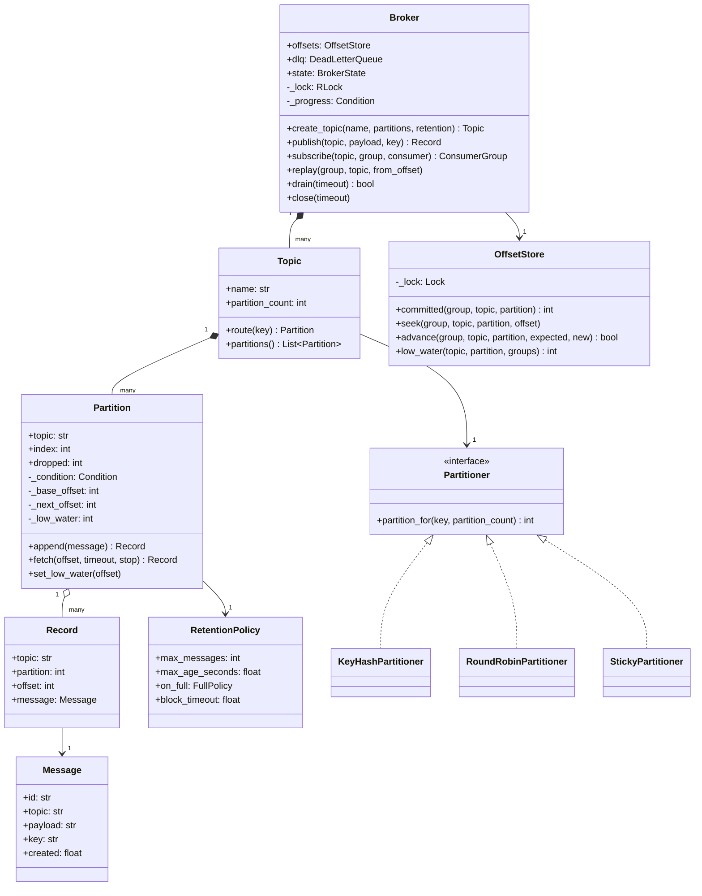
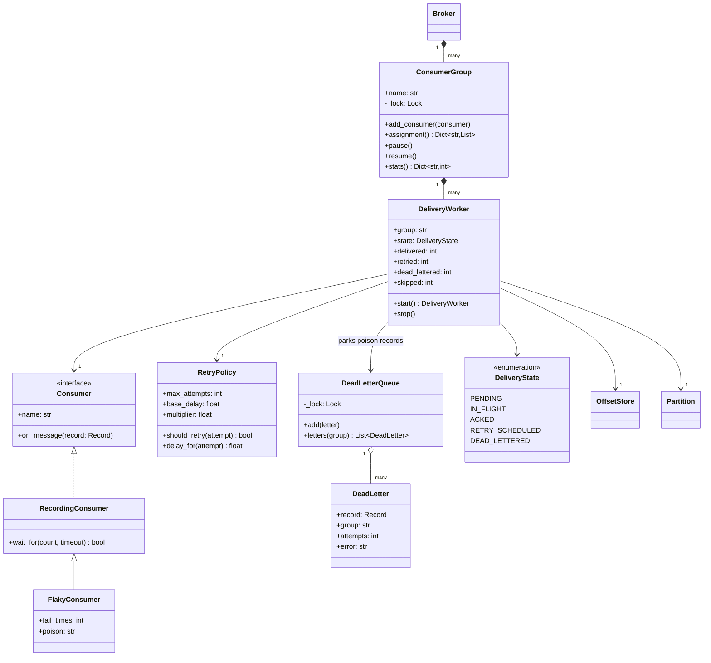
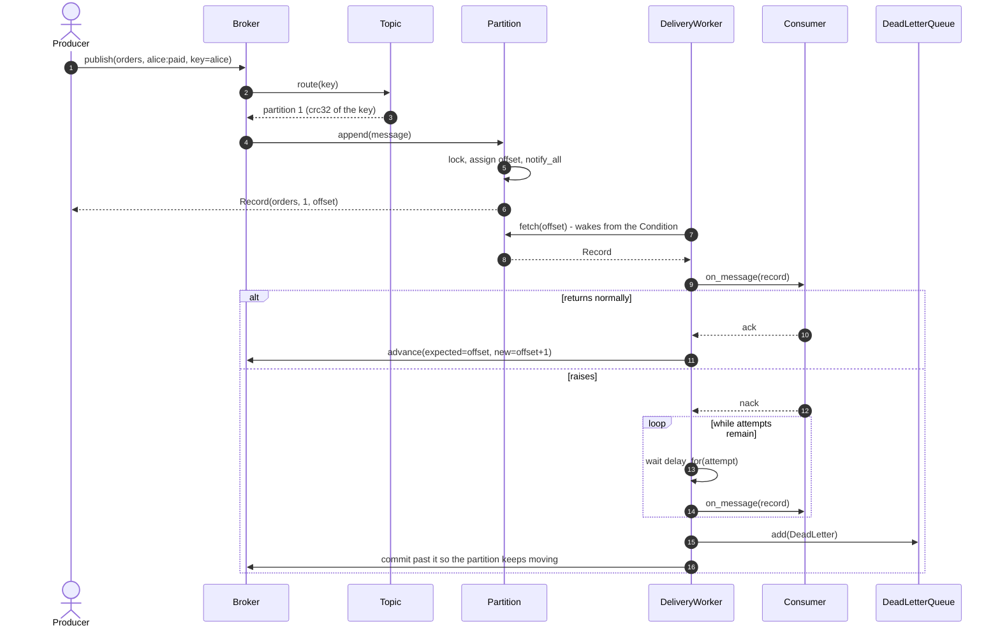
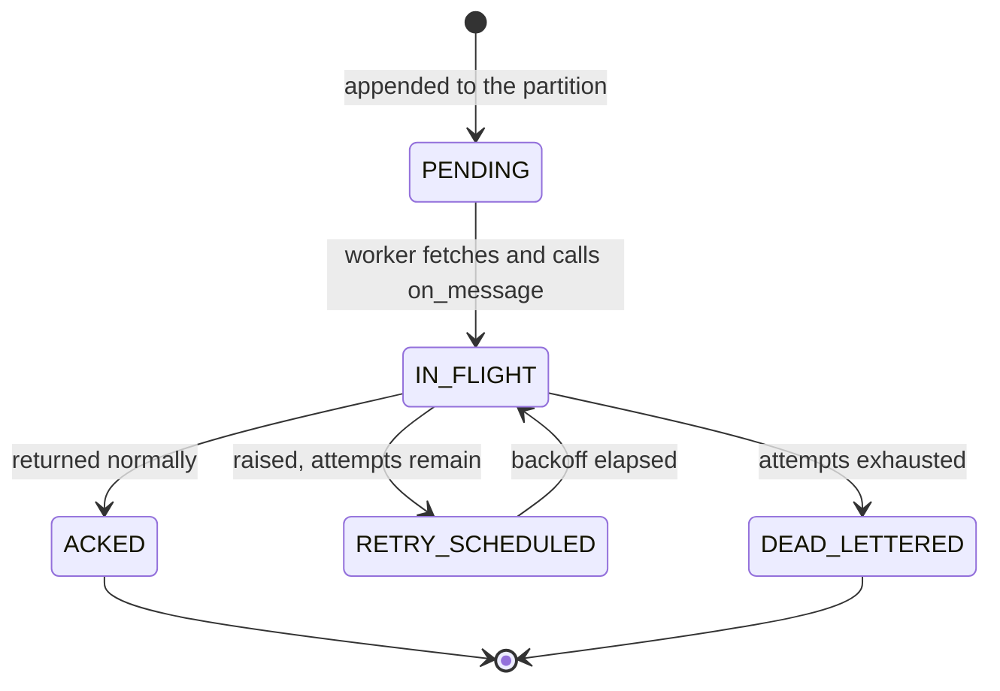

# Design an in-memory pub/sub message queue

## TL;DR

- You build an append-only log per partition, a cursor per consumer group, and one worker thread per `(group, partition)` — which is where the ordering guarantee comes from and where it stops.
- Three decisions carry the interview: **the offset lives in a store, never in a thread** (so replay and rebalancing are trivial), **the buffer is bounded** (so a stalled consumer becomes backpressure, not an out-of-memory kill), and **commit happens after the ack** (so failure means redelivery, not loss).
- Patterns that earn their place: Mediator (the broker), Strategy (partitioner, retry), Producer-Consumer over a `Condition`, Observer/Event Bus at the edges.

## Problem statement

"Design an in-memory publish/subscribe message queue. Producers publish to a named topic; the topic is split into partitions so several consumers can work in parallel. Consumers join named groups: every group sees every message, but within a group each message goes to exactly one consumer. Delivery is at-least-once with acknowledgement, failures are retried with backoff and eventually parked in a dead-letter queue, and a group can rewind and replay. It must be correct with many producers and consumers running at once, and shut down without losing anything."

## Requirements

**Functional**

- Topics with a configurable partition count; a key routes a message to a partition.
- Publish; subscribe by `(topic, group, consumer)`; push delivery to each consumer.
- Consumer groups: every group has its own cursor, so two groups read the same records independently.
- Offsets stored per `(group, topic, partition)`, with seek and replay from any offset.
- At-least-once delivery: the offset advances only after the consumer acks.
- Retry with exponential backoff, then a dead-letter queue so one poison record cannot stall a partition.
- Retention by size (a bounded buffer per partition) and by age.
- Concurrent producers and consumers, plus graceful shutdown that drains before stopping.

**Non-functional and constraints**

- Per-key ordering is guaranteed; global ordering across partitions is explicitly not.
- A publish never blocks forever: it either finds room, sheds, or fails with a clear error.
- No message is lost between an ack and a commit; a crash mid-delivery causes redelivery, never loss.
- In-memory, single process, standard library only. Time and IDs injected; tests are deterministic and use barriers rather than sleeps.

**Out of scope**: durability to disk, cross-process transport, exactly-once semantics, and consumer-driven pull APIs. The distributed version of all of this is [Design a distributed message queue](../../hld/case-studies/distributed-message-queue.md).

## Clarifying questions and assumptions

| Question to ask | Assumption taken here |
|---|---|
| Push or pull delivery? | Push: the broker owns a worker thread per `(group, partition)`. A pull API is the same log with the loop moved into the consumer. |
| Does every subscriber get every message? | Every *group* does. Inside a group, exactly one consumer gets each record — that is the whole point of groups. |
| What ordering do we promise? | Per key, because a key always maps to one partition and one worker. Never across partitions; say this before you are asked. |
| At-least-once, at-most-once, or effectively-once? | At-least-once. The offset advances after the ack, so a failure mid-processing means redelivery. Effectively-once = at-least-once plus an idempotent consumer. |
| Is an ack explicit or implicit? | Implicit: returning from `on_message` acks, raising nacks. A real system passes an ack callable so a consumer can finish asynchronously. |
| What happens when a consumer is slower than the producer? | The partition buffer fills, then either the producer blocks (`BLOCK`) or the oldest records are shed (`DROP_OLDEST`). Both are counted; neither is silent. |
| Can records be replayed after they are acked? | Yes, until pressure reclaims them. Records are freed when the buffer is full, not the moment they are acked. |

## Core entities and relationships

- **Message** — what a producer hands over: id, topic, payload, optional key and headers, and a creation time from the injected `Clock`.
- **Record** — a message once it has a place in the log: `(topic, partition, offset)` plus the message. Immutable and shared by every group.
- **Partition** — the append-only buffer, the offset counter, and the single `Condition` that makes producers and workers meet. `1 → *` records.
- **Topic** — a name, a list of partitions and a `Partitioner`. `1 → *` partitions.
- **Broker** — the mediator: topic registry, group registry, `OffsetStore`, `DeadLetterQueue`, publish, subscribe, replay, drain and shutdown.
- **ConsumerGroup** — a set of consumers sharing one cursor per partition, plus the rebalance that deals partitions out again when a consumer joins. `1 → *` `DeliveryWorker`.
- **DeliveryWorker** — one thread bound to one `(group, partition)`: fetch, deliver, retry, dead-letter, commit.
- **OffsetStore** — `(group, topic, partition) → next offset`, with `seek` for replay and a compare-and-set `advance` for commits.
- **RetryPolicy** and **RetentionPolicy** — the two frozen policy objects; **DeadLetterQueue** — where exhausted records park.

## Class diagram

**Structure: the log and how a message finds its place in it.**



**Behaviour: how a record reaches a consumer, and what happens when it does not.**



## Design patterns applied

| Pattern | Where | Why it earns its place |
|---|---|---|
| Mediator | `Broker` | Producers and consumers never hold a reference to each other. Adding a group, replaying, or shutting down is one object's job, and that object is the only place that knows the wiring. |
| Producer-Consumer | `Partition._condition` | The textbook rendezvous: `append` notifies, `fetch` waits on a predicate. `wait_for` with a timeout and a stop event means a worker never spins and never misses a wake-up. |
| Strategy | `Partitioner`, `RetryPolicy` | Routing and backoff are the two rules an interviewer will ask you to change ("now make it sticky", "now cap the backoff"). Each is one object with no effect on the broker. |
| Iterator (cursor) | `OffsetStore` | An offset is an external iterator over a partition. Because it lives in a store and not in a thread, replay is an assignment and rebalancing loses nothing. |
| Event Bus / Observer | `subscribe` + push delivery | Consumers register interest by name and are called back; the broker fans out. The difference from a plain in-process [Event Bus](../patterns/event-bus.md) is durability of position: a bus forgets, a log remembers. |
| Template Method | `DeliveryWorker._deliver` | The retry/dead-letter skeleton is fixed; the varying step is the consumer's `on_message`. |
| Null Object (light) | An empty group list | A topic with no subscribers keeps its records so a late group can replay them, rather than special-casing "nobody is listening". |
| Singleton | `Broker.instance()` | Offered, not imposed. A process usually wants one broker; the constructor stays public so each test owns its own broker and its own threads. |

Deliberately **not** used: a State class per `DeliveryState`. Five values with guarded transitions are an enum and a `for` loop over attempts; five classes would hide a nine-line method. Also not used: a thread per *consumer*. Threads are bound to partitions, not consumers, because the partition is the unit of ordering — bind them to consumers and you either lose ordering or need a lock per key.

## Key flows

**Publish, wake, deliver, ack, commit — and the retry branch that keeps a poison record from stalling everyone.**



**One delivery attempt, as a state machine.** `RETRY_SCHEDULED` is the only state that costs wall-clock time, and it is the one you must be able to bound in the room.



## Implementation

Write the log first, then the cursor, then the thread that joins them. The enums pin the vocabulary; `DeliveryState` is the one that becomes the state diagram and `FullPolicy` the one that becomes the concurrency section.

```python title="code/lld/pub_sub_system/models.py — enums"
--8<-- "code/lld/pub_sub_system/models.py:enums"
```

```python title="code/lld/pub_sub_system/models.py — errors"
--8<-- "code/lld/pub_sub_system/models.py:errors"
```

A `Message` is what the producer wrote; a `Record` is where it ended up. Keeping them separate is what lets the same message be re-read from an offset forever without the producer's object being mutable.

```python title="code/lld/pub_sub_system/models.py — messages and records"
--8<-- "code/lld/pub_sub_system/models.py:messages"
```

Both policies are frozen dataclasses with the arithmetic on them, not scattered through the worker. `RetentionPolicy` carries two independent bounds — size, which creates backpressure, and age, which does not care whether anyone read the record.

```python title="code/lld/pub_sub_system/models.py — policies"
--8<-- "code/lld/pub_sub_system/models.py:policies"
```

The partitioner is the only Strategy a producer chooses, and `zlib.crc32` instead of `hash()` is a detail worth saying out loud: CPython salts string hashes per process, so `hash()` would route the same key differently after a restart.

```python title="code/lld/pub_sub_system/strategies.py"
--8<-- "code/lld/pub_sub_system/strategies.py:partitioners"
```

Now the centre of the design. `Partition` owns the only `Condition` in the package: producers append and notify, workers park on `fetch`, and a commit that reclaims space notifies the producers back.

```python title="code/lld/pub_sub_system/storage.py — the partition"
--8<-- "code/lld/pub_sub_system/storage.py:partition"
```

The offset store is deliberately dull, and that is the point — progress is data, not thread state, so replay is an assignment and a rebalance is a restart.

```python title="code/lld/pub_sub_system/storage.py — offsets"
--8<-- "code/lld/pub_sub_system/storage.py:offsets"
```

The worker is the at-least-once contract in code. Read the offset fresh every turn (a replay may have moved it), deliver, retry with backoff, dead-letter when the attempts run out, and only then commit — with a compare-and-set so a concurrent seek is never clobbered.

```python title="code/lld/pub_sub_system/services.py — the delivery worker"
--8<-- "code/lld/pub_sub_system/services.py:worker"
```

A group is a rebalance policy plus a bag of workers. Because the cursor lives in the store, stopping every worker and dealing the partitions out again is a safe, boring operation.

```python title="code/lld/pub_sub_system/services.py — the consumer group"
--8<-- "code/lld/pub_sub_system/services.py:group"
```

The broker mediates and owns the two things nobody else can: the registries, and `drain`, which is a real barrier built on a `Condition` that every commit signals.

```python title="code/lld/pub_sub_system/services.py — the broker"
--8<-- "code/lld/pub_sub_system/services.py:broker"
```

Running `python -m lld.pub_sub_system.demo` publishes six order events into two partitions, feeds three groups, retries a transient failure, dead-letters a poison record and replays one group:

```text
published alice:created      -> partition 1 offset 0
published bob:created        -> partition 0 offset 0
published alice:paid         -> partition 1 offset 1
published bob:cancelled      -> partition 0 offset 1
published alice:shipped      -> partition 1 offset 2
published carol:created      -> partition 1 offset 3
billing received 6 of 6 (its own cursor)
audit   received 6 of 6 (an independent cursor)
alice keeps her order (one partition, one worker): ['alice:created', 'alice:paid', 'alice:shipped']
shipping stats: {'delivered': 5, 'retried': 7, 'dead_lettered': 1, 'skipped': 0}
shipping retried alice:paid 2 times before it acked
dead letter after 3 attempts: bob:cancelled (ConsumerError: cannot process bob:cancelled)
lag before replay: billing=0
billing after replay from offset 0: 12 records
broker state=stopped, dead letters=1
```

## Concurrency and edge cases

**Which lock protects what.** Four, and they never nest in a cycle:

1. `Partition._condition` guards the deque, `_base_offset`, `_next_offset` and `_low_water`. It is both the mutex and the rendezvous: `append` assigns the offset and calls `notify_all`; `fetch` calls `wait_for(offset < next_offset or stopping)`. An uncontended lock costs about 17 ns, so partitioning is what buys throughput — four partitions are four independent locks, not one queue with four readers.
2. `OffsetStore._lock` guards the cursor map. Commits go through `advance(expected, new)`, a compare-and-set, so a replay that moved the cursor while a record was in flight is not clobbered by the late ack.
3. `ConsumerGroup._lock` serialises rebalances, so two threads joining at once cannot both deal partitions out.
4. `Broker._lock` (an `RLock`) guards the topic and group registries, and `Broker._progress` is a separate `Condition` signalled after every commit — that is what makes `drain()` a barrier instead of a poll loop.

**Ordering.** One worker per `(group, partition)` is the entire guarantee. Same key → same partition → same worker → offset order. Across partitions there is no order at all, and a candidate who promises one has not understood the model.

**Backpressure versus retention.** A record is *not* freed when it is acked; it is freed when the buffer is under pressure and every group has committed past it. Sizing, using the chat fan-out numbers: 2B messages/day is 2B / 10^5 ≈ 23k msg/s; spread over four partitions that is roughly 5.8k msg/s each, so a 1,024-record buffer absorbs about 1,024 / 5,800 ≈ 0.18 s of consumer hiccup. That is the honest claim — a bounded buffer buys you a couple of hundred milliseconds, not minutes. Past that, `BLOCK` slows the producer down and `DROP_OLDEST` sheds; both increment `dropped`.

**Retention overtaking a slow consumer.** Age-based trimming ignores consumers, so a group can find its offset below `earliest_offset()`. `fetch` raises `OffsetOutOfRangeError`, the worker seeks forward, and the gap is counted in `skipped` — visible data loss beats silent data loss.

**Subscribe during publish.** Joining a group takes `ConsumerGroup._lock` outside the broker's registry lock, stops the workers, re-deals partitions and restarts from the *stored* offsets. Records published during the rebalance sit in the partition and are picked up on the next fetch. A late group starts at zero and reads the whole backlog.

**Graceful shutdown.** `close()` flips the state to `DRAINING` (publishes now raise `BrokerClosedError`), waits on `drain`, then stops the workers and closes the partitions. A worker interrupted mid-backoff returns *without* committing, which is the at-least-once contract: on restart, that record is delivered again.

!!! warning "Common mistake"
    Committing the offset before calling the consumer, because it makes the loop simpler. That turns at-least-once into at-most-once, and the failure mode is a silently dropped payment. The other half of the same mistake is an unbounded queue: it looks like it removes the backpressure problem, but it only moves it to the memory allocator, where it fails much later and much worse.

## Extensibility and follow-ups

- **Persistence**: `Partition` is already an append-only structure with a base offset. Add a write-ahead log behind an interface, flush on append, and rebuild the deque on start; the offset store becomes a second small file. Nothing above the partition changes.
- **Effectively-once**: at-least-once plus an idempotent consumer. Give the consumer the record id as an idempotency key and have it deduplicate; the broker keeps its simple contract.
- **Delayed and priority topics**: a delayed topic sorts by "visible at" and `fetch` waits until the clock passes it — the `Condition` already supports a timed wait. A priority topic is several partitions with a weighted worker, and you should say out loud that priority and per-key ordering are in tension.
- **Consumer lag as an SLI**: `Broker.lag(group, topic)` is already the raw number; export it per partition and alert on its derivative rather than its value.
- **Pull-based consumers**: expose `fetch(offset, max_records)` and delete the worker. The log does not change; only who owns the loop does.
- **Going distributed** is the hand-off: replication and leader election per partition, a rebalance protocol between processes, and durability guarantees — see [Messaging, queues and Kafka internals](../../hld/fundamentals/messaging-and-event-streaming.md). A single Kafka broker sustains roughly 100 MB/s in, which at ~1 KB per message is about 100k messages/s — that is the scale at which this in-process design stops being the answer.

!!! tip "Interview tip"
    Volunteer the ordering boundary before you are asked: "per key, because a key maps to one partition and one worker; nothing across partitions." Then say where the offset lives. Those two sentences tell the interviewer you have thought about a real queue rather than a list with a lock around it.

## Tests

`tests/test_pub_sub_system.py` has 21 cases. Every asynchronous assertion uses a barrier — `RecordingConsumer.wait_for` or `Broker.drain` — so nothing sleeps and nothing is timing-dependent.

The group test asserts the two guarantees at once: independent cursors across groups, and per-key order inside one:

```python title="code/lld/pub_sub_system/tests/test_pub_sub_system.py — consumer groups"
--8<-- "code/lld/pub_sub_system/tests/test_pub_sub_system.py:groups"
```

The retry test uses a consumer that fails once for every payload and always for one poison value, which pins down all three outcomes — retried and acked, dead-lettered, and the partition still making progress:

```python title="code/lld/pub_sub_system/tests/test_pub_sub_system.py — retry and dead letters"
--8<-- "code/lld/pub_sub_system/tests/test_pub_sub_system.py:retry"
```

The backpressure test proves the bounded buffer is real: with nobody consuming, the third publish into a two-record partition raises; once a group has consumed and committed, the space is reclaimed and the publish succeeds.

```python title="code/lld/pub_sub_system/tests/test_pub_sub_system.py — backpressure"
--8<-- "code/lld/pub_sub_system/tests/test_pub_sub_system.py:backpressure"
```

The concurrency test drives 400 publishes through eight threads into four partitions with two consumers in one group, then asserts that every `(partition, offset)` pair is unique and that the group delivered all 400 payloads exactly once.

```python title="code/lld/pub_sub_system/tests/test_pub_sub_system.py — concurrency"
--8<-- "code/lld/pub_sub_system/tests/test_pub_sub_system.py:concurrency"
```

The rest cover: key-to-partition stability across 50 calls; four invalid requests through `parametrize`; a duplicate consumer name; the `PENDING → IN_FLIGHT → ACKED` walk with the committed offset; replay redelivering everything; a late subscriber reading the backlog; `DROP_OLDEST` shedding three records and fast-forwarding the slow group; age-based trimming on a `FakeClock`; a rebalance that neither loses nor redelivers; graceful shutdown then `BrokerClosedError`; the compare-and-set on the offset store; a raising consumer that does not kill its worker; and round-robin spreading for keyless messages. Run them with `uv run pytest code/lld/pub_sub_system -q`.

## 45-minute pacing

| Minutes | What to do | What to say or write |
|---|---|---|
| 0–5 | Clarify | Push or pull? Group semantics? What ordering do we promise? At-least-once? What happens when a consumer is slow? Out of scope: durability, cross-process, exactly-once. |
| 5–10 | Entities | Nouns: Broker, Topic, Partition, Record, ConsumerGroup, OffsetStore, DeliveryWorker, DLQ. State the ordering boundary here, unprompted. |
| 10–18 | Class diagram | Log on the left (Topic → Partition → Record), delivery on the right (Group → Worker → Consumer), with the OffsetStore between them. |
| 18–34 | Code | `Partition.append` with the `Condition` → `fetch` with `wait_for` → `OffsetStore.advance` (compare-and-set) → `DeliveryWorker._deliver` with retry and DLQ. |
| 34–40 | Concurrency | Name the four locks. Walk the bounded buffer and the two full policies with the ~0.18 s of headroom arithmetic. Explain the drain barrier and shutdown. |
| 40–45 | Extensions | Persistence behind an interface, effectively-once with an idempotency key, lag as an SLI, and the hand-off to the distributed queue. |

## Related

- [Event Bus](../patterns/event-bus.md) — the in-process cousin that forgets instead of remembering
- [Observer](../patterns/observer.md) — the notification mechanic underneath push delivery
- [Mediator](../patterns/mediator.md) — why producers and consumers never reference each other
- [Concurrency for LLD in Python](../fundamentals/concurrency-for-lld.md) — `Condition`, `wait_for` and the producer-consumer rendezvous
- [Messaging, queues and Kafka internals](../../hld/fundamentals/messaging-and-event-streaming.md) — partitions, consumer groups and delivery semantics at scale
- [Design a distributed message queue](../../hld/case-studies/distributed-message-queue.md) — the same problem once one process is not enough
