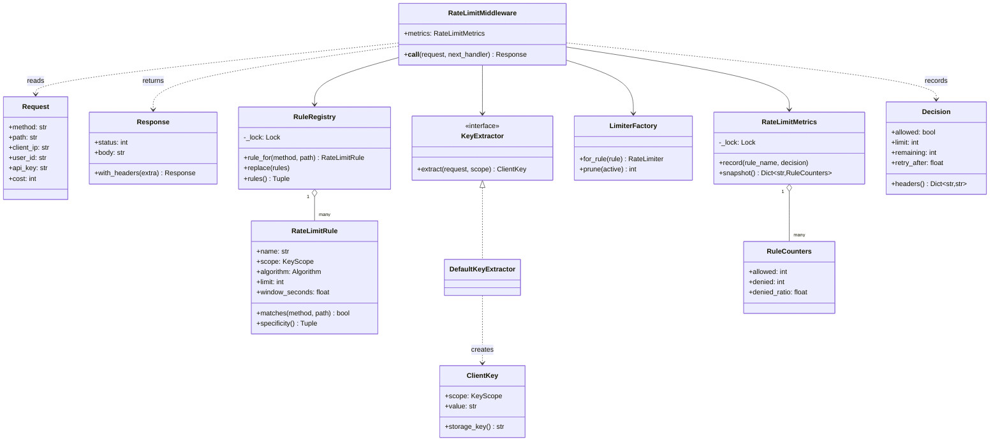
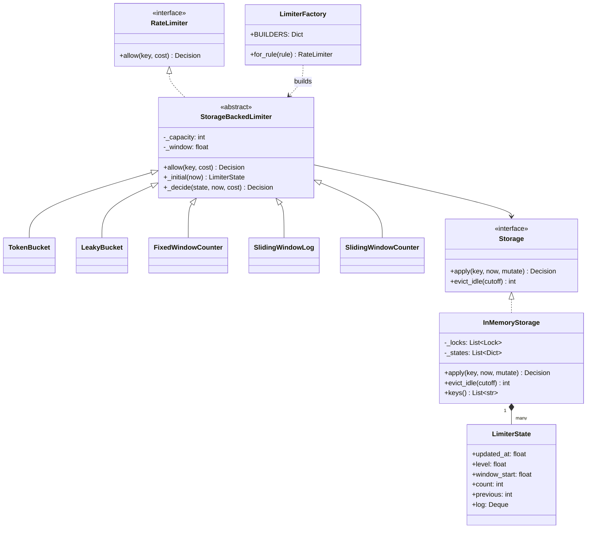
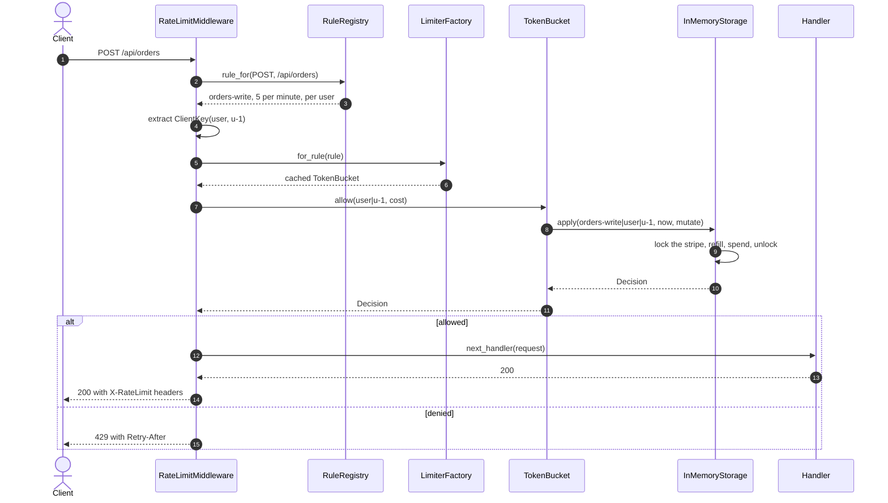
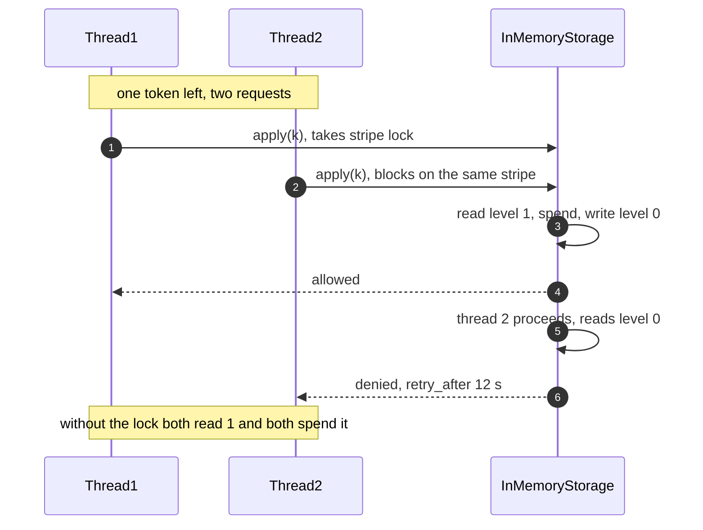

# Design a rate limiter (LLD)

## TL;DR

- You build a gateway middleware: a rule decides *which* limit applies, a `ClientKey` decides *whose* budget it is, and one of five algorithms decides *whether* this request passes.
- Three decisions carry the interview: **the storage owns atomicity, not the algorithm** (that is what lets the same class run on a dict today and a Redis script tomorrow), **the state map is striped**, and **every answer is a `Decision` object** carrying `Retry-After`, not a bare boolean.
- Patterns that earn their place: Strategy (the algorithms), Template Method (the shared request path), Factory (rule to limiter), Pipeline/Middleware (the gateway stage), Dependency Injection (`Clock`, `Storage`).

## Problem statement

"Design the rate limiter that sits in front of an API. Different endpoints have different limits — five order submissions per minute per user, a thousand reads per minute per API key — and a request that exceeds its limit gets a 429 with a `Retry-After` header. Support several algorithms and let operations switch between them per endpoint without a deploy. It runs in a multi-threaded gateway process, and the state must eventually live in Redis. Show me the classes, the algorithms and what happens when two threads hit the same key."

## Requirements

**Functional**

- Per-caller keys: user id, API key, client IP, or one global bucket.
- Five algorithms: token bucket, leaky bucket, fixed window, sliding window log, sliding window counter.
- Rules per endpoint (method plus path prefix), most specific match wins, with an optional default.
- Every call answers allow or deny with the limit, what is left, and how long to wait.
- Thread-safe under concurrent requests for the same key.
- Pluggable storage: an in-process implementation now, a Redis-shaped one later, behind one `Protocol`.
- Middleware integration: one pipeline stage, not an annotation on every handler.
- Metrics: allowed and denied counts per rule.
- Cost-weighted requests: an expensive endpoint may spend more than one unit.

**Non-functional and constraints**

- The decision is on the request path, so it must be O(1) in time and bounded in memory per key.
- Configuration is hot-reloadable: changing a limit must not need a restart.
- Deterministic and testable: the clock is injected, so no test ever sleeps to watch a window roll.
- Fail-open or fail-closed is a policy question you should raise; here the limiter is in-process, so it cannot fail independently.

**Out of scope**: the distributed counter itself (Lua scripts, cell-based sync), client-side backoff, and quota billing.

## Clarifying questions and assumptions

| Question to ask | Assumption taken here |
|---|---|
| Is the limit per user, per IP, or per API key? | Per rule — `KeyScope` is a field of the rule, so the same endpoint can be limited differently for different tenants. |
| What happens to an anonymous caller under a per-user rule? | Fall back to the IP. Keying every anonymous request the same way would give them one shared budget, which one script could exhaust. |
| Do the limits need to be exact? | No. The sliding window counter is approximate and that is the right default; sliding log is offered for small, expensive limits. |
| One process or many? | One here. The `Storage` protocol is the seam to a shared store, and the page says exactly what changes. |
| Do requests all cost the same? | No — `Request.cost` defaults to 1, and a fan-out search can declare 10. |
| What does a denied request get? | 429 with `X-RateLimit-*` and `Retry-After`, never below 1 second. |
| What happens to keys that go quiet? | `evict_idle` sweeps them. In Redis you would set a key TTL instead and let the server forget. |

## Core entities and relationships

- **`RateLimitRule`** — a frozen value object: method, path prefix, scope, algorithm, limit, window, optional burst. It validates itself and knows how specific it is.
- **`RuleRegistry`** — the ordered ruleset, sorted most specific first, swappable in one assignment for a hot reload.
- **`ClientKey`** — scope plus identity. It does *not* know which rule is asking; the limiter prefixes its own name so two rules can never share a counter.
- **`KeyExtractor`** (`Protocol`) with **`DefaultKeyExtractor`** — request to `ClientKey`, including the anonymous fallback.
- **`RateLimiter`** (`Protocol`) — `allow(key, cost) -> Decision`. **`StorageBackedLimiter`** is the abstract base the five algorithms extend.
- **`Storage`** (`Protocol`) with **`InMemoryStorage`** — one atomic `apply` per key, plus idle eviction. **`LimiterState`** is the record it keeps.
- **`LimiterFactory`** — rule to limiter, cached by rule *value*.
- **`RateLimitMiddleware`** — the pipeline stage. **`RateLimitMetrics`** and **`RuleCounters`** — the counters beside it.
- **`Decision`** — allowed, limit, remaining, retry-after, and the `headers()` an HTTP layer needs.

Multiplicities: registry `1 → *` rules, rule `1 → 1` limiter, limiter `1 → 1` storage, storage `1 → *` states, middleware `1 → 1` registry and `1 → 1` factory.

## Class diagram

**The request path: rule, key, decision, response.**



**The algorithms and the storage they all share.**



## Design patterns applied

| Pattern | Where | Why it earns its place |
|---|---|---|
| Strategy | `RateLimiter` with five implementations | The algorithm is the thing the interviewer swaps. Because it is a `Protocol`, a rule's `algorithm` field is the only thing that changes when operations move an endpoint from fixed window to sliding counter. |
| Template Method | `StorageBackedLimiter.allow` | Validation, the single clock read and the storage round trip are identical across five algorithms. Each subclass writes only `_initial` and `_decide`, so the five algorithms read as five paragraphs of arithmetic. |
| Factory | `LimiterFactory.BUILDERS` | Configuration names an algorithm as a string; the registry maps it to a class. Keying the cache by the rule *value* means a changed limit yields a new limiter with no invalidation logic. |
| Pipeline / Middleware | `RateLimitMiddleware.__call__(request, next_handler)` | The limit belongs to the route, not to the handler function. One stage covers every endpoint, and it composes with auth and logging stages in a known order. |
| Dependency Injection | `Clock`, `Storage`, `KeyExtractor` | `FakeClock` rolls a window instantly; a Redis-shaped storage swaps in without touching an algorithm. |
| Value Object | `Decision`, `RateLimitRule`, `ClientKey` | Frozen, hashable, and safe to share across threads. `Decision` is what turns "denied" into a response an HTTP client can act on. |

What was deliberately *not* used: **Decorator per handler** (`@rate_limit(5, "1/min")`). It reads nicely and it is the wrong seam — the limit becomes source code, so operations cannot change it during an incident, and an endpoint added without the decorator is silently unlimited. **Singleton** for the storage is also avoided: one instance built in `main` and injected lets a test build a fresh limiter per case, which is why the test file has no shared state.

## Key flows

**One request through the gateway: rule, key, decision, then pass or 429.**



**Why the storage owns atomicity: the same two threads, with and without the stripe lock.**



## Implementation

Write it in the order the request travels: what a rule is, what an answer is, then the algorithms, then the storage and the middleware.

The enums are the configuration vocabulary — an operator writes `"sliding_counter"` in a config file and it lands here:

```python title="code/lld/rate_limiter/models.py — algorithms, scopes and errors"
--8<-- "code/lld/rate_limiter/models.py:enums"
```

`RateLimitRule` validates itself in `__post_init__`, so an impossible rule fails at load time rather than on the first request that matches it. `specificity` is the sort key that makes "most specific wins" one line in the registry.

```python title="code/lld/rate_limiter/models.py — rule and client key"
--8<-- "code/lld/rate_limiter/models.py:rule"
```

`Decision` is the object that separates a good answer from a bare boolean: the caller learns the ceiling, what is left and when to come back, and `headers()` renders exactly what an HTTP client reads.

```python title="code/lld/rate_limiter/models.py — decision, counters and messages"
--8<-- "code/lld/rate_limiter/models.py:decision"
```

One record type serves all five algorithms. Say why out loud: it keeps the `Storage` protocol free of algorithm-specific methods, and a Redis-backed store would persist only the fields its algorithm touches.

```python title="code/lld/rate_limiter/models.py — the stored record"
--8<-- "code/lld/rate_limiter/models.py:state"
```

Now the two protocols. The contract on `Storage.apply` is the sentence to say in the room: *read, decide and write are one indivisible step*. A storage offering plain `get` and `set` would turn every algorithm into a read-modify-write race.

```python title="code/lld/rate_limiter/strategies.py — the two protocols"
--8<-- "code/lld/rate_limiter/strategies.py:protocols"
```

The abstract base holds everything the five algorithms share, including the single clock read and the rule namespacing:

```python title="code/lld/rate_limiter/strategies.py — the shared request path"
--8<-- "code/lld/rate_limiter/strategies.py:template"
```

The bucket algorithms are continuous: they compute the refill or the drain from elapsed time, so an idle key costs nothing and there is no timer thread anywhere in the design.

```python title="code/lld/rate_limiter/strategies.py — token bucket and leaky bucket"
--8<-- "code/lld/rate_limiter/strategies.py:buckets"
```

The window algorithms trade memory against accuracy in three steps: a counter that leaks at the boundary, an exact log that costs O(limit) per key, and the weighted estimate that most gateways actually run.

```python title="code/lld/rate_limiter/strategies.py — the three window algorithms"
--8<-- "code/lld/rate_limiter/strategies.py:windows"
```

The storage is where the locks are. Note that each stripe owns its own dict rather than sharing one:

```python title="code/lld/rate_limiter/services.py — striped storage"
--8<-- "code/lld/rate_limiter/services.py:storage"
```

The registry and the key extractor are the configuration half. Copy-on-write is the trick worth naming: readers copy a reference to an immutable tuple and scan outside the lock.

```python title="code/lld/rate_limiter/services.py — rules and keys"
--8<-- "code/lld/rate_limiter/services.py:registry"
```

```python title="code/lld/rate_limiter/services.py — the factory"
--8<-- "code/lld/rate_limiter/services.py:factory"
```

The middleware is then eight lines of glue, which is the sign the seams are in the right places:

```python title="code/lld/rate_limiter/services.py — metrics and middleware"
--8<-- "code/lld/rate_limiter/services.py:middleware"
```

Running `python -m lld.rate_limiter.demo` puts three rules behind the middleware and then runs the same burst through all five algorithms:

```text
--- 7 POST /api/orders from user u-1, limit 5 per minute ---
  allowed 5, denied 2, last body: rate limit exceeded for rule orders-write
  429 headers: {'X-RateLimit-Limit': '5', 'X-RateLimit-Remaining': '0', 'Retry-After': '12'}
--- the same user on a different route uses a different budget ---
  cost=5 against a limit of 10: 200, 200, then 429
--- an anonymous request falls through to the IP rule ---
  GET /health -> 200, {'X-RateLimit-Limit': '100', 'X-RateLimit-Remaining': '99'}
--- limit 5 per second, 7 requests arrive together at t=0 ---
  token bucket    : 5 allowed, 2 denied, Retry-After 0.20 s
  leaky bucket    : 5 allowed, 2 denied, Retry-After 0.20 s
  fixed window    : 5 allowed, 2 denied, Retry-After 1.00 s
  sliding log     : 5 allowed, 2 denied, Retry-After 1.00 s
  sliding counter : 5 allowed, 2 denied, Retry-After 1.00 s
--- boundary burst: 5 requests at t+0.9 s, 5 more at t+1.0 s ---
  fixed window    : 5 allowed, then 5 more within 0.1 s
  sliding counter : 5 allowed, then 0 more within 0.1 s
--- housekeeping ---
  keys held: 10, evicted after 10 min idle: 10
  catch-all: 1 allowed / 0 denied, orders-write: 5 allowed / 2 denied, search: 2 allowed / 1 denied
```

## Concurrency and edge cases

**Which lock protects what.** Four locks, each with one job.

1. `InMemoryStorage._locks[i]` guards `_states[i]`, one dict per stripe. The race it prevents is the read-modify-write: "read the level, subtract the cost, write it back" is three steps, and two threads that interleave them both spend the same token. With 64 stripes, two keys collide only when their hashes agree modulo 64, so unrelated tenants never wait for each other — while requests for the *same* key still serialise, which is right: the hot key is the one that must be counted correctly.
2. `RuleRegistry._lock` guards a single reference to an immutable tuple. A reload assigns a new tuple; readers copy the reference under the lock and scan outside it. No request can observe a half-applied ruleset, and the read path costs one uncontended acquire, about 17 ns.
3. `LimiterFactory._lock` guards the rule-to-limiter cache: a check-then-insert, so two threads missing the same rule build one limiter, not two.
4. `RateLimitMetrics._lock` guards the counters, and deliberately not the storage stripe — a metrics update must never run inside the critical section every request for a hot key already queues on.

**Why each stripe owns its dict.** One shared dict mutated under several different locks leans on CPython's internals rather than on a lock — not a claim you want to defend in a review.

**Where atomicity really lives.** The algorithms never lock. They hand a closure to `Storage.apply` and the storage makes read-decide-write indivisible. That is the seam that survives the move to Redis: in process a stripe lock; in Redis a Lua script, which ships the algorithm to the data instead of pulling the data to the algorithm. The cost difference is the whole argument for keeping a local tier: an in-process decision is one uncontended mutex, about 17 ns, against a 500 µs same-datacenter round trip for the Redis call — roughly 30,000 times cheaper.

**Idle keys.** Every distinct caller creates a record, so the map grows with your IP space unless something removes it. `evict_idle(cutoff)` sweeps per stripe; in Redis you would set a key expiry and let the server forget. Sizing then tells you which algorithm you can afford: a token bucket record is a level and a timestamp, 8 B each, while a sliding log at a limit of 1,000 per key is 1,000 timestamps, 8 KB — so a million active keys is 8 GB of nothing but timestamps. That is why sliding log belongs on login attempts and not on a public read API.

**Edge cases handled**: a cost larger than the limit is rejected at once instead of being denied forever; `Retry-After` is never rendered as 0, because a client reading 0 retries immediately and is denied again; an anonymous caller under a per-user rule falls back to its IP; a request that matches no rule passes, a configuration choice this page states rather than a silent default; raising a limit through a hot reload changes the ceiling and the refill rate at once but does not hand back tokens already spent; and the sliding window counter's `retry_after` solves for when enough of the previous window will have aged out, rather than always pointing at the next boundary.

!!! warning "Common mistake"
    Returning `True`/`False` from `allow`. The caller then has to invent the `Retry-After` value, and every caller invents a different one — usually the whole window, which turns a one-second wait into a sixty-second one and makes clients bunch up at the next boundary. Return a `Decision`, compute `retry_after` from the algorithm's own state, and let `headers()` render it.

## Extensibility and follow-ups

- **Distributed counters**: replace `InMemoryStorage` with one that runs the same decision as a Redis Lua script. The algorithm classes do not change, because the atomicity contract already lives in `Storage`. That conversation — local-then-global, cell-based sync, eventual accuracy — is the HLD case study.
- **Hierarchical limits**: a request may have to satisfy per-user *and* per-tenant *and* global rules. Change `rule_for` to return every match and require all of them to allow, and make sure you spend the tokens only once every rule has agreed, or a denial by the last rule will have silently charged the first.
- **Cost-weighted requests**: already here as `Request.cost`. The next step is deriving the cost from the response (a search that touched ten shards) and settling the difference afterwards, which turns the limiter into an accounting problem.
- **Fail-open versus fail-closed**: once the storage is remote it can be unavailable. Decide out loud — fail-open protects availability and lets an attack through, fail-closed protects the backend and turns a cache outage into an outage.
- **Hot reload from a config service**: `RuleRegistry.replace` is already the seam; add a watcher that validates and swaps. `LimiterFactory.prune` drops the limiters built from retired rules.
- **A radix tree for routes**: the registry scans an ordered tuple, which is fine for tens of rules. At hundreds you would index by method and path segment — and only then, because scanning 20 rules costs less than the lock beside it.

Sizing: a gateway at 10k QPS calls the limiter once per request, so a Redis instance rated at roughly 100k ops/s absorbs ten such nodes — until a second rule per request halves that to five.

!!! tip "Interview tip"
    Lead with the comparison table, not with code. "Fixed window is one integer and leaks twice the limit at a boundary; sliding log is exact and costs O(limit) memory per key; sliding counter is two integers and approximates by overlap; token bucket allows a burst and then the sustained rate." Four sentences buys you the whole design discussion, and then you write the one the interviewer picks.

## Tests

`tests/test_rate_limiter.py` has 23 cases. The two worth walking through are the boundary comparison, because it is the answer to the question every interviewer asks, and the concurrency test.

```python title="code/lld/rate_limiter/tests/test_rate_limiter.py — the boundary burst"
--8<-- "code/lld/rate_limiter/tests/test_rate_limiter.py:boundary"
```

With an injected clock, the flaw everyone describes in words becomes four assertions: ten requests pass in 100 milliseconds under a fixed window of five per second, and none pass under the sliding counter.

```python title="code/lld/rate_limiter/tests/test_rate_limiter.py — concurrency"
--8<-- "code/lld/rate_limiter/tests/test_rate_limiter.py:concurrency"
```

Freezing the clock is what makes the concurrency assertion sharp: with no refill possible, any number above the capacity is a lost update rather than time passing. The sibling test proves the other half — eight tenants on eight keys each get exactly their own limit, so striping does not leak budget between callers.

The rest cover: the token bucket's burst-then-rate behaviour and its exact `retry_after`; all five algorithms admitting exactly the limit in one burst, via `parametrize`; the sliding log pointing `retry_after` at the moment its oldest entry ages out; a cost larger than the limit and a cost of zero; four invalid rule configurations; most-specific rule matching and a missing rule; two rules never sharing a caller's budget; the anonymous IP fallback; the middleware's 429, headers and metrics; cost-weighted spending; a hot reload taking effect without a restart; an unknown algorithm; and idle-key eviction. Run them with `uv run pytest code/lld/rate_limiter -q`.

## 45-minute pacing

| Minutes | What to do | What to say or write |
|---|---|---|
| 0–5 | Clarify | Per user, IP or API key? Exact or approximate? One process or a fleet? What does a denied caller get back? |
| 5–10 | Algorithms | The four-sentence comparison, then commit to token bucket as the default and say why. |
| 10–16 | Entities | `RateLimitRule`, `ClientKey`, `Decision`, `RateLimiter`, `Storage` on the board. Name the split: rules configure, limiters decide, storage keeps. |
| 16–26 | Code the limiter | `Decision` first, then `TokenBucket._decide`. Say "refill from elapsed time, no timer thread" while writing it. |
| 26–34 | Storage and concurrency | The read-modify-write race, why `apply` takes a closure, why stripes, and why each stripe owns its dict. |
| 34–40 | Middleware and rules | The pipeline stage, most-specific matching, hot reload by swapping an immutable tuple. |
| 40–45 | Distribution | Redis with a Lua script, local-then-global, fail-open versus fail-closed, and hand off to the HLD version. |

## Related

- [Rate limiting](../../hld/fundamentals/rate-limiting.md) — the algorithms in system-design terms, placement and the accuracy trade
- [Design a distributed rate limiter](../../hld/case-studies/rate-limiter.md) — the same problem once the counter has to be shared by a fleet
- [Strategy](../patterns/strategy.md) — the pattern behind the five interchangeable algorithms
- [Pipeline and Middleware](../patterns/pipeline-middleware.md) — the stage-and-next-handler shape this middleware follows
- [Factory Method](../patterns/factory-method.md) — the registry idiom behind `LimiterFactory`
- [Concurrency for LLD in Python](../fundamentals/concurrency-for-lld.md) — striped locks, copy-on-write configuration and read-modify-write races
- Primary sources: RFC 6585 (HTTP 429) and RFC 9110 for `Retry-After`; the Redis `INCR`/Lua rate-limiting patterns in the official Redis documentation
