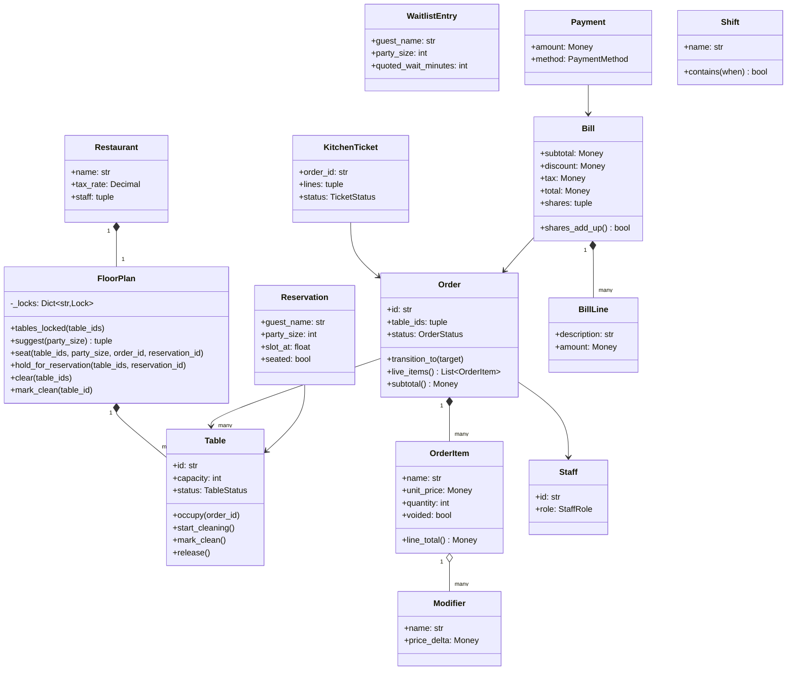
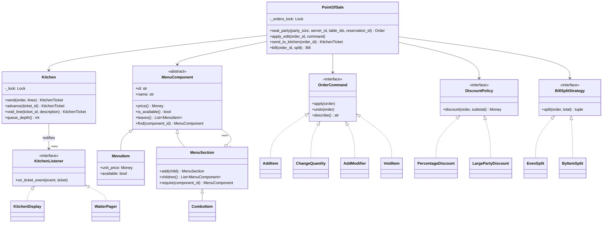
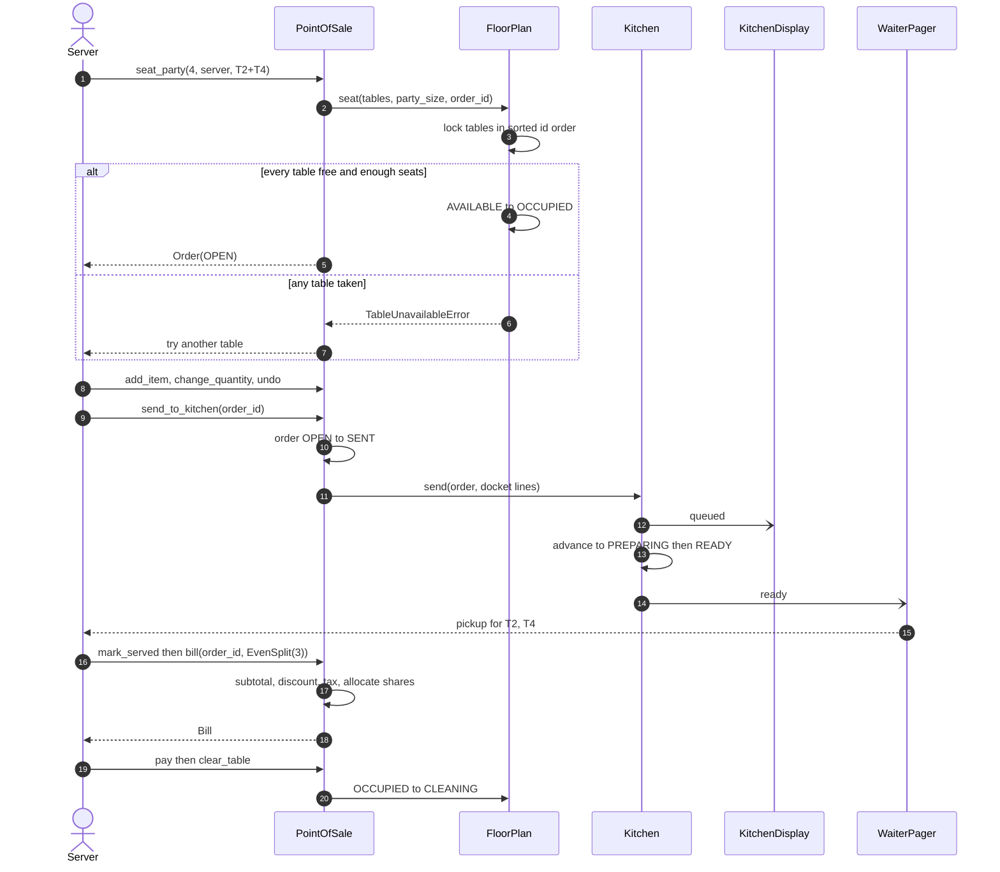
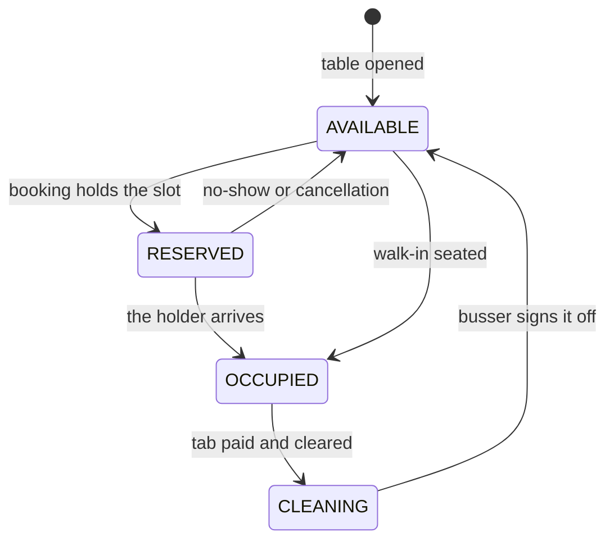
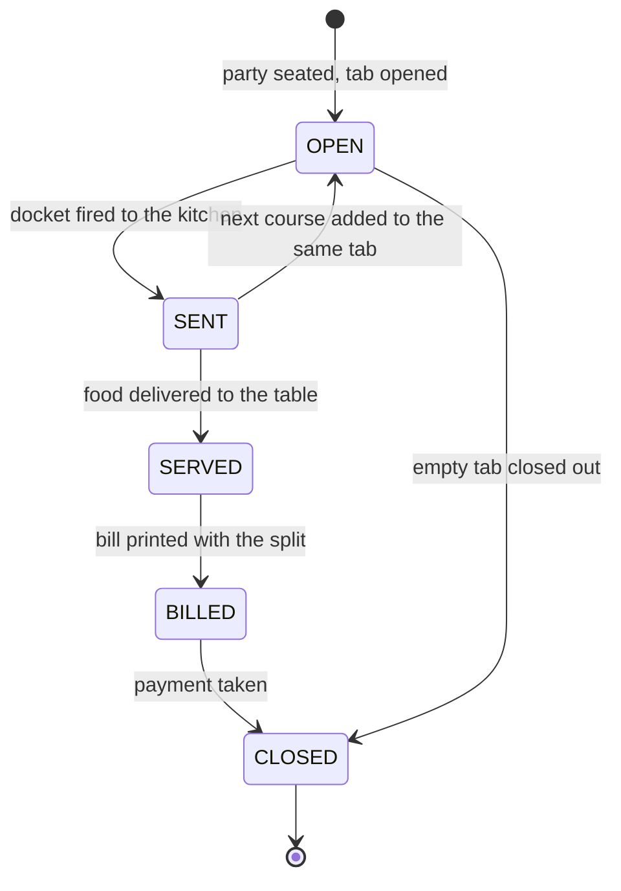

# Design a restaurant management system

## TL;DR

- You build the point of sale: seat a party (one table, or two joined), open a tab, take an order off a nested menu, fire a kitchen ticket, serve it, split the bill and hand the table to the bussers.
- Three decisions carry the interview: **one lock per table, acquired in sorted id order**, so joining tables 4 and 7 is all-or-nothing and deadlock-free; **the menu as a Composite**, so a combo prices and validates itself; **order edits as Command objects**, which is what makes "undo that" and "the docket is already on the pass, get a manager" two lines instead of two subsystems.
- `Money.allocate` does every split. A bill divided three ways adds back up to the cent, and that is a thing interviewers actually check.

## Problem statement

"Design the software a restaurant runs on. Hosts seat walk-ins and reservations at tables of different sizes; servers take orders against a menu with sections, modifiers and combos; the kitchen works a queue of tickets and signals when food is ready; the bill applies a discount and tax and can be split. Show me the classes, the table and order state machines, and what happens when two hosts seat two parties at the same table at the same moment."

## Requirements

**Functional**

- Tables with a capacity and a status; parties may be seated on a joined group of tables.
- Reservations hold a table for a slot; walk-ins join a FIFO waitlist with a quoted wait.
- A menu of sections containing items; items carry priced modifiers; combos price several items together at a discount; a dish can be marked unavailable for the night.
- One order (tab) per seated party, with quantity and modifier edits, and undo while the order is still open.
- Sending the order creates a kitchen ticket that moves queued to preparing to ready to served; the kitchen display and the servers' pagers are both notified.
- After sending, the only legal edit is a void, and it takes a manager.
- Bills apply a discount policy, then tax, then a split strategy; the shares must sum exactly to the total.
- Payments close the tab; the tables move to cleaning and back to available.
- Staff have roles; a daily report per shift gives tabs, revenue and tables used.

**Non-functional and constraints**

- Correct under concurrency: table status is the contended resource on a Friday night.
- Money never uses floats; every split routes through `Money.allocate`.
- In-memory and single-process; time and ids are injected so the report and the waitlist are testable.

**Out of scope**: online ordering and delivery (see the [food delivery problem](food-delivery.md)), inventory and ingredient deduction, payroll, multi-branch.

## Clarifying questions and assumptions

| Question to ask | Assumption taken here |
|---|---|
| Can a party occupy more than one table? | Yes. That is what makes the locking interesting, and it is the difference between a toy answer and a real one. |
| What happens to an edit after the ticket is fired? | It becomes a void with a manager's authorisation, and the kitchen is told. Silently editing a sent ticket is how restaurants lose food cost. |
| Does a section have a price? | Yes, the sum of its children — which is exactly what a combo needs. That single decision is why Composite fits here. |
| Is the waitlist strictly FIFO? | Ordered, but a party that does not fit is skipped rather than blocking everyone behind it. Say this out loud; interviewers like the nuance. |
| Do we deduct ingredients? | No. It is a listener on the ticket-sent event, so it is a follow-up rather than a redesign. |
| Which price does the bill use? | The price snapshotted onto the order line. A menu change at 8 pm must not move a tab opened at 7 pm. |
| How do we handle tipping and tax order? | Discount first, then tax on the discounted amount, then the split. Ask — jurisdictions differ, and getting the order wrong is a real bug. |

## Core entities and relationships

- **Restaurant** — the aggregate: a `FloorPlan`, a menu root, a tax rate and staff.
- **FloorPlan** `1 → *` **Table**, plus one lock per table. `Table` has a capacity and a `TableStatus`; the whole seating flow is transitions on it.
- **MenuComponent** (abstract) with **MenuItem** (leaf), **MenuSection** (composite) and **ComboItem** (an orderable composite). `price()`, `is_available()` and `leaves()` are uniform across all three.
- **Order** `1 → *` **OrderItem** `1 → *` **Modifier**. An order references one or more table ids and carries an `OrderStatus`.
- **OrderCommand** — `AddItem`, `ChangeQuantity`, `AddModifier`, `VoidItem`. `PointOfSale` keeps the applied list per order, which is both an undo stack and an audit log.
- **Kitchen** `1 → *` **KitchenTicket**, with **KitchenListener** observers: **KitchenDisplay** (the screen over the pass) and **WaiterPager** (only cares about ready).
- **Bill** `1 → *` **BillLine**, plus the shares from a **BillSplitStrategy**; **Payment** closes it.
- **PointOfSale** — the Facade the terminal calls; **Reservation** and **WaitlistEntry** are the two front-of-house records; **Staff**, **StaffRole** and **Shift** cover people and reporting.

## Class diagram

**Structure: the floor, the tab and the money.**



**Behaviour: the Composite menu, the Command edits, the Observer kitchen and the two strategies.**



## Design patterns applied

| Pattern | Where | Why it earns its place |
|---|---|---|
| [Composite](../patterns/composite.md) | `MenuComponent`, `MenuItem`, `MenuSection`, `ComboItem` | The menu is genuinely a tree, and the uniform `price()` / `is_available()` interface is what lets a combo be ordered exactly like a dish. The two composites differ in one line and the difference is meaningful: a section is available if *any* child is, a combo only if *every* child is. |
| Command | `OrderCommand` with four implementations | Every edit becomes an object, so undo is `history.pop().undo(order)` and the audit log is the same list. It also gives voids a natural home: `VoidItem` refuses in its constructor unless a manager authorised it. |
| [State](../patterns/state.md) | `TableStatus` guards on `Table`, `Order.transition_to` with `ORDER_TRANSITIONS`, `Kitchen.NEXT_STATUS` | Three small machines. Two are transition tables, one is a guard set on the entity that owns the lock. None of them deserves a class per state. |
| Observer | `KitchenListener`, `KitchenDisplay`, `WaiterPager` | The display wants every event, the pager wants only `ready`. Filtering in the listener rather than in the kitchen is the whole point of the pattern. |
| Strategy | `DiscountPolicy`, `BillSplitStrategy` | The two rules that change most often. Splits are the interesting one: `ByItemSplit` shares tax and discount pro rata *and* still sums exactly, because it hands ratios to `Money.allocate`. |
| Facade | `PointOfSale` | The terminal calls one object. Locking, kitchen, menu, discounts and splits stay behind it. |

What was deliberately *not* used: a **Chain of Responsibility** for order approval (server, then manager, then owner). It looks tempting for voids, but there are exactly two levels and one condition, so a guard clause in `VoidItem.__init__` is clearer and cheaper. Mention that you considered it and rejected it — knowing when a pattern is overkill scores higher than knowing one more pattern.

## Key flows

**Seat, order, fire, serve, bill, clear. Note that the kitchen never talks to the floor.**



**Table lifecycle. `CLEANING` is what stops the host seating a party at a table that still has plates on it.**



**Order lifecycle. The `SENT` state is the fence: on one side edits are free, on the other they need a manager.**



## Implementation

Write the enums first — three status types, and being explicit that they are *different* machines is half the model.

```python title="code/lld/restaurant_management/models.py — enums"
--8<-- "code/lld/restaurant_management/models.py:enums"
```

The floor. `Table` carries its own transition guards because they run inside the table lock.

```python title="code/lld/restaurant_management/models.py — floor"
--8<-- "code/lld/restaurant_management/models.py:floor"
```

The tab. The unit price is snapshotted onto the line, so a menu edit mid-service cannot move an open bill.

```python title="code/lld/restaurant_management/models.py — order"
--8<-- "code/lld/restaurant_management/models.py:order"
```

The Composite. Look at the last two methods: `MenuSection.is_available` uses `any`, `ComboItem.is_available` uses `all`, and that is the entire difference between a category and a combo.

```python title="code/lld/restaurant_management/menu.py — composite"
--8<-- "code/lld/restaurant_management/menu.py:composite"
```

Edits as Commands. `VoidItem` validates the manager in its constructor, so an unauthorised void cannot even be built, let alone applied.

```python title="code/lld/restaurant_management/commands.py — commands"
--8<-- "code/lld/restaurant_management/commands.py:commands"
```

Now the contended part. `tables_locked` sorts, `seat` checks every table and the seat count before it occupies anything, and `suggest` is a lock-free hint that `seat` re-validates.

```python title="code/lld/restaurant_management/services.py — floor plan"
--8<-- "code/lld/restaurant_management/services.py:floor_plan"
```

The kitchen owns one lock over the ticket board and notifies listeners outside it, so a slow display never stalls a cook.

```python title="code/lld/restaurant_management/services.py — kitchen"
--8<-- "code/lld/restaurant_management/services.py:kitchen"
```

The facade. `bill` is worth reading closely: subtotal, then discount, then tax on the discounted amount, then the split — in that order, always.

```python title="code/lld/restaurant_management/pos.py — point of sale"
--8<-- "code/lld/restaurant_management/pos.py:pos"
```

Splitting is where the cents go missing, so both strategies delegate to `Money.allocate`:

```python title="code/lld/restaurant_management/strategies.py — splits"
--8<-- "code/lld/restaurant_management/strategies.py:splits"
```

Running `python -m lld.restaurant_management.demo` walks one service:

```text
prix fixe 35.70 USD vs a la carte 42.00 USD (15% off)
risotto orderable: False; mains section still on: True
ID-1 holds T3, table is now reserved
waitlist: Iyer party of 2, quoted 15 min
seated Iyer at T1 -> order ID-3
undo: set line ID-5 to 1; tab is now 93.90 USD
KT-1 -> kitchen: ['2 x Prix fixe', '3 x Garden salad']
edit after send rejected: order ID-3 is sent; quantities are fixed
pager: ['pickup for T1 (KT-1)']; board: KT-1 T1 ready
bill 71.40 USD - 5.00 USD discount + 5.31 USD tax = 71.71 USD
split three ways: ['23.91 USD', '23.90 USD', '23.90 USD'] (adds up: True)
tables T1 -> cleaning
joining tables rejected: tables not free: T1
party of 8 joins T2+T4 -> order ID-9
dinner report: 1 tabs, 71.71 USD taken, 3 tables used
```

The split line is the one to point at: 71.71 divided three ways is 23.9033…, and the odd cent lands on the first guest deterministically rather than disappearing.

## Concurrency and edge cases

**Which lock protects what.**

1. `FloorPlan._locks` — **one `threading.Lock` per `Table`**, created lazily under `_registry_lock`. It guards table status, the occupying order id and the reservation hold. Two hosts reaching for table 4 serialise on table 4; a host seating table 9 is unaffected.
2. `PointOfSale._orders_lock` — guards the order registry, the per-order command history, the reservation book, the waitlist and the bills. It is never held while a table lock is held.
3. `Kitchen._lock` — guards the ticket board only. Listeners are notified after it is released.

**Lock ordering.** Joining tables for a party of eight acquires them in sorted id order, so a host asking for `T4, T2` and a host asking for `T2, T4` both take `T2` first. Without the sort this is the textbook ABBA deadlock, and it is the single most likely thing the interviewer will probe. The cost is nothing: an uncontended mutex is about 17 ns, so a two-table seating spends under 50 ns acquiring.

**Table double-assignment.** `seat` checks every table *and* the combined capacity under the locks, then occupies. A host who loses the race gets `TableUnavailableError` naming the tables that went; nothing is half-seated. The concurrency test fires 20 hosts at six overlapping seating plans and asserts that no table id appears in two winning orders and that the set of claimed tables is exactly the set of occupied ones.

**Edits after the ticket is sent.** `Order.transition_to` moves `OPEN → SENT` when the docket fires. `ChangeQuantity` and `AddModifier` refuse outside `OPEN`; `undo_last_edit` refuses too, telling the caller to void instead. `VoidItem` marks the line, and `PointOfSale.void_line` appends a strike-through to the kitchen ticket so the line cooks see it. A second course reopens the tab with `next_course`, which is `SENT → OPEN` again — the same order, a new docket.

**Split-bill rounding.** `EvenSplit` calls `total.allocate([1] * ways)`; `ByItemSplit` builds the ratios from each guest group's item subtotal in cents. Both inherit the guarantee that the shares sum exactly to the total, remainder cents distributed deterministically to the earliest shares. `Bill.shares_add_up()` asserts it, and the parametrised test pins the awkward cases (10.00 three ways, 0.05 four ways).

**Kitchen queue updates.** The board is a dict under one lock; `advance` is a single step through `NEXT_STATUS`, so a double-tap on "ready" raises rather than skipping to served. The display keeps its own copy so rendering never touches the kitchen's lock.

**Reservation versus walk-in.** A held table is `RESERVED`, so `seat` rejects a walk-in unless the caller passes the matching reservation id. The waitlist is ordered but not blocking: `seat_next_walk_in` walks the queue and seats the first party that fits, so a party of six waiting for a six-top does not stop the two-top behind it from being seated.

**Other edge cases handled**: an unavailable dish is refused at `add_item`, not at the pass; a party larger than the combined capacity is refused; sending an empty order raises; clearing a table before payment raises; the daily report is bounded by an injected `Shift` rather than "today" on the server.

!!! warning "Common mistake"
    Letting the kitchen mutate table state, or the floor plan know about orders. It feels efficient and it welds two independently changing subsystems together — the moment you add a second kitchen station or a self-service tablet, everything breaks. Keep the arrows one-way: `PointOfSale` calls both, the kitchen publishes events, and nothing calls back up.

## Extensibility and follow-ups

- **Ingredient deduction.** A third `KitchenListener` that subtracts a recipe's ingredients on `queued` and refuses to when stock is short — the same hook that already feeds the display. Marking a dish unavailable then becomes automatic instead of a manager tapping a screen.
- **Online ordering.** A delivery order is an `Order` with no `table_ids` and a courier instead of a server; the kitchen path is identical. Where it stops being an LLD question is dispatch and ETAs, which is the [food delivery problem](food-delivery.md).
- **Multi-branch.** `Restaurant` is already an ordinary object; a chain is one `PointOfSale` per branch plus a reporting service that aggregates `daily_report`. Nothing in the seating flow changes.
- **Tipping and payroll.** Tips are a `BillLine` added after tax and a share adjustment in the split strategy; payroll consumes `Shift` and the server id already on every order.
- **Persistence.** Orders, tickets and bills go behind repositories; table status becomes a row you take `SELECT ... FOR UPDATE ... ORDER BY table_id` on, which is the same sorted acquisition you already have in `tables_locked`.
- **Table combinations.** `suggest` currently tries a single table then a pair. A `SeatingStrategy` would let a restaurant express its own rules (never split a party of two across two-tops, keep the corner booth for six) without touching the lock code.

!!! tip "Interview tip"
    When you reach the menu, ask "can a combo contain a combo?" before you design it. If yes you need Composite, if no a flat list is enough — and either answer, asked out loud, tells the interviewer you pick structures from requirements rather than from habit. Then draw the tree with one combo in it and point at `price()` on both node types.

## Tests

`tests/test_restaurant_management.py` has 15 cases. The edit fence is the one to walk through, because it is the rule that turns a naive POS into a real one:

```python title="code/lld/restaurant_management/tests/test_restaurant_management.py — edits after the ticket is sent"
--8<-- "code/lld/restaurant_management/tests/test_restaurant_management.py:edit_after_send"
```

The concurrency test asserts the floor invariant rather than a winner: whatever the interleaving, the claimed tables and the occupied tables are the same set.

```python title="code/lld/restaurant_management/tests/test_restaurant_management.py — concurrency"
--8<-- "code/lld/restaurant_management/tests/test_restaurant_management.py:concurrency"
```

The rest cover: the full seat-to-clear path with the display and the pager; combo pricing and an unavailable dish; `any` versus `all` availability on the two composites; even splits including the odd-cent cases via `parametrize`; a by-item split sharing tax and discount pro rata; modifiers on the line total and on the docket; a reservation blocking a walk-in but not its holder; the waitlist skipping a party that does not fit; validation failures; and the discount threshold feeding the daily report. Run them with `uv run pytest code/lld/restaurant_management -q`.

## 45-minute pacing

| Minutes | What to do | What to say or write |
|---|---|---|
| 0–5 | Clarify | Can a party span tables? Can a combo nest? What happens to an edit after the fire? Park inventory and delivery. |
| 5–11 | Entities | Table, Order, OrderItem, Modifier, KitchenTicket, Bill. Say "three status enums, three separate machines". |
| 11–17 | Menu | Draw the tree with one combo. Write `price()` and `is_available()` on both composite types and name the `any` / `all` difference. |
| 17–24 | State machines | Table (five states) and Order (five). Mark `SENT` as the edit fence and `CLEANING` as the reseat fence. |
| 24–35 | Code | `tables_locked` (say "sorted") → `seat` (say "check all, then occupy all") → `OrderCommand` and `VoidItem` → `bill` (say "discount, tax, split, in that order"). |
| 35–41 | Concurrency and money | The table lock, the ABBA deadlock the sort prevents, and `Money.allocate` for the split. Describe the 20-host test. |
| 41–45 | Extensions | Ingredient deduction as a listener, online orders as a table-less order, branches as more instances, seating strategy as the next seam. |

## Related

- [Design a food delivery system (Swiggy, Zomato, DoorDash)](food-delivery.md) — where the online-ordering follow-up leads
- [Composite](../patterns/composite.md) — the menu tree and the orderable combo
- [State](../patterns/state.md) — the table, order and ticket machines
- [Design a hotel management system](hotel-management.md) — the sibling contended-resource problem, over date ranges instead of tables
- [Design a movie ticket booking system (BookMyShow)](movie-ticket-booking.md) — the same sorted multi-resource locking, over seats
