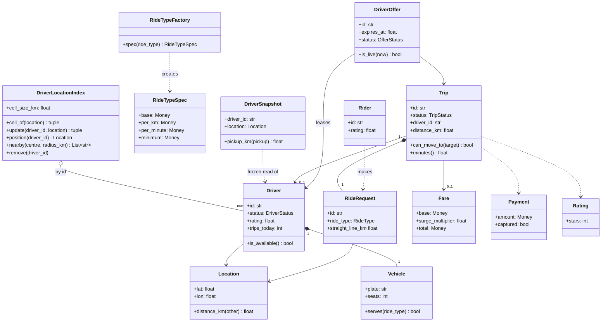
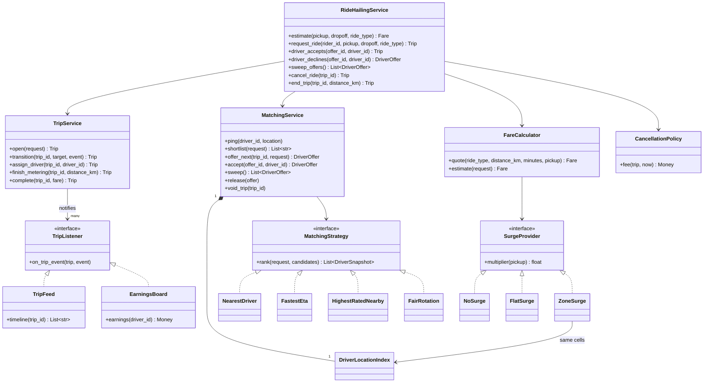
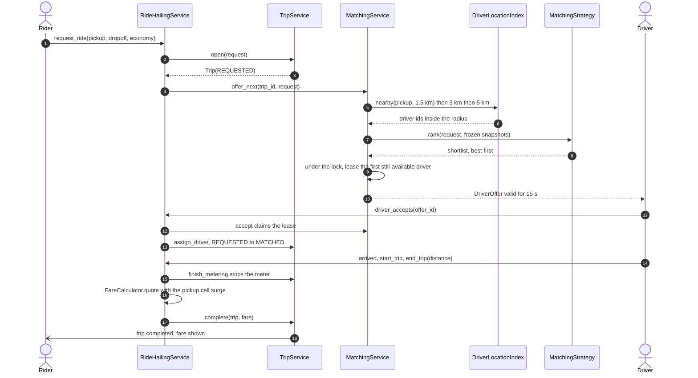
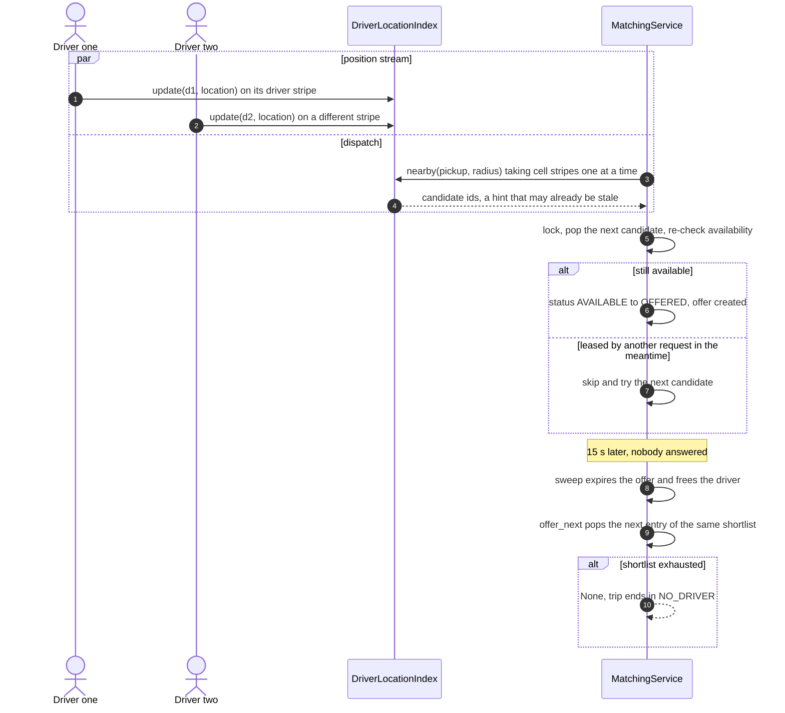
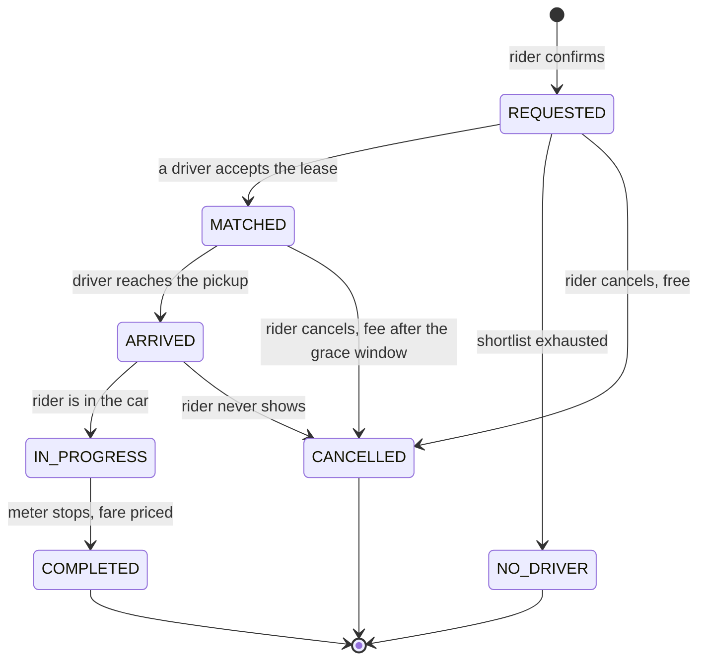
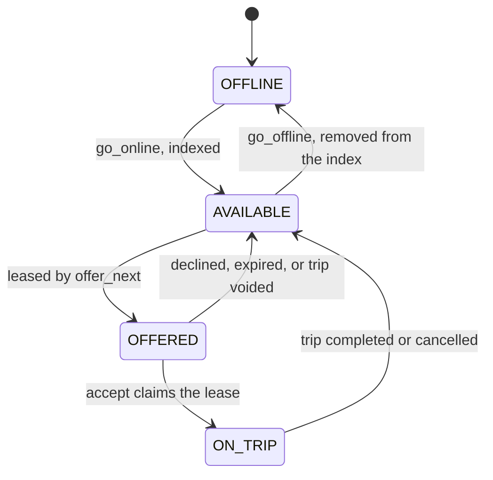

# Design Uber (LLD) with driver matching

## TL;DR

- You build the dispatch core: drivers stream positions into a grid index, a rider requests a ride, the best candidates are ranked, and one of them is *leased* an offer that expires.
- Three decisions carry the interview: the index uses **striped locks** (per cell and per driver) instead of one global mutex, matching is an **optimistic hint re-validated under the dispatch lock**, and an assignment is a **lease with a timeout** that cascades down a shortlist.
- Patterns that earn their place: Mediator (`MatchingService`), State (the trip transition table), Strategy (matching and surge), Observer (trip feed, earnings), Factory (ride types), Facade (`RideHailingService`).

## Problem statement

"Design the core of a ride-hailing service. Drivers go online and report their position continuously. A rider asks for a ride of a given class between two points, and the system finds a nearby driver, offers them the trip, and waits for an answer. The trip then runs through arrival, start and end, and a fare is charged from base, distance, time and surge. Focus on how you find drivers quickly, how you make sure one driver is never given two trips, and what happens when a driver ignores the offer or a rider cancels mid-flight."

## Requirements

**Functional**

- Drivers go online, stream position updates, and go offline.
- A rider requests a ride with a pickup, a drop-off and a ride class; a fare estimate is available before confirming.
- Matching finds nearby eligible drivers, ranks them, and offers the trip to the best one with a deadline.
- An offer may be accepted, declined or left to expire; declines and expiries cascade to the next candidate.
- The trip walks a state machine through matched, arrived, in progress and completed, with cancellation branches.
- The final fare is base plus distance plus time, multiplied by a surge factor read from the pickup's grid cell, floored at a class minimum.
- Cancellation is free before a driver commits and inside a short grace window afterwards; then it costs a fee.
- Ratings after completion; trip history per rider.

**Non-functional and constraints**

- Position updates are the hot path and must not serialise behind dispatch.
- One driver is never offered or assigned two trips, no matter how many riders request simultaneously.
- A driver who stops responding must not pin a rider's request indefinitely.
- In-memory and single-process; the clock and ID generators are injected, so every test is deterministic.

**Out of scope**: routing and real road distance, pooling, scheduled rides, driver onboarding, and the payment gateway beyond a captured amount.

## Clarifying questions and assumptions

| Question to ask | Assumption taken here |
|---|---|
| How often do drivers report position, and how many are online? | Every few seconds, tens of thousands per city. That is what forces a striped index rather than a lock around a dict. |
| Is distance road distance or straight line? | Straight line, computed with an equirectangular approximation. Real routing is a service call behind the same `MatchingStrategy` interface. |
| Do we offer to one driver or broadcast to several? | One at a time, with a 15-second lease. Broadcast-and-first-wins is the alternative, and the trade — faster match, more declines, unfair to slow phones — is worth saying out loud. |
| What if nobody accepts? | The shortlist is walked once and then the trip ends in `NO_DRIVER`. A retry is a product decision, not a correctness one. |
| Is surge per city or per area? | Per grid cell, using the same geometry as the index, so pricing and dispatch argue about the same coordinates. |
| Can the rider cancel after matching? | Yes. Free for 120 seconds, then a flat fee — and the driver is always released. |
| Where does the fare come from? | Class specs in a factory registry, so adding a new class is one dict entry, not an `if` in the calculator. |

## Core entities and relationships

- **Location** — a frozen lat/lon pair that knows how to measure distance. Everything spatial goes through it.
- **DriverLocationIndex** — a uniform grid over the city. It owns *both* striped lock arrays and is the only authority on where a driver is.
- **Driver** — id, vehicle, rating, `DriverStatus`, and the trip they currently hold. **DriverSnapshot** is the immutable read of one driver that ranking sees.
- **Vehicle** and **RideTypeSpec** — which classes a car may serve, and what each class costs. `RideTypeFactory` is the registry.
- **RideRequest** (frozen) and **Trip** — the ask and the thing that happens. One trip, one request, at most one driver.
- **DriverOffer** — the lease: trip, driver, `expires_at`, `OfferStatus`. At most one live offer names a given driver.
- **TripService** owns trips and every transition; **MatchingService** is the mediator that owns drivers, the index and offers; **RideHailingService** is the facade.
- **MatchingStrategy** (`NearestDriver`, `FastestEta`, `HighestRatedNearby`, `FairRotation`) and **SurgeProvider** (`NoSurge`, `FlatSurge`, `ZoneSurge`) are the policies; **FareCalculator** combines a spec and a surge into a **Fare**.

Multiplicities: index `1 → *` cells, cell `1 → *` drivers, driver `1 → 0..1` live offer, trip `1 → *` offers over its life, trip `0..1 → 1` driver, trip `1 → 0..1` fare.

## Class diagram

**Domain: where drivers are, what a trip is, and what it costs.**



**Services and policies: one mediator, one facade, two swappable rules.**



## Design patterns applied

| Pattern | Where | Why it earns its place |
|---|---|---|
| Mediator | `MatchingService` | Nothing else in the system holds both a `Driver` and a `Trip`. Riders ask it for a driver, drivers report position and answer offers to it, and it alone decides who hears about whom. Without it, `Trip` reaches into the driver registry and `Driver` reaches into trips, and you have a two-way dependency you cannot test. |
| State (as a table) | `TRIP_TRANSITIONS` plus `TripService.transition` | Seven statuses and three actors that can act at once. One dict is the machine, one method is the gate, and the state diagram below is a drawing of that dict. |
| Strategy | `MatchingStrategy`, `SurgeProvider` | The two rules that change every interview. Strategies receive frozen `DriverSnapshot` values, so they *cannot* mutate dispatch state or take a lock — swapping the ranking rule cannot introduce a race, and that is a design property, not a convention. |
| Observer | `TripListener` with `TripFeed` and `EarningsBoard` | `TripService` publishes moves and knows nothing about who listens. Listeners are notified outside the trip lock, so a slow feed cannot stall dispatch. |
| Factory Method | `RideTypeFactory.spec` | A request carries `"xl"`. A registry maps it to base, per-km, per-minute and minimum. A new class is one dict entry; `FareCalculator` never changes. |
| Facade | `RideHailingService` | Nine verbs for the API layer, and the only place that knows in what order the two services must be called. |
| Null Object | `NoSurge` | `FareCalculator` never writes `if surge is None`. The default *is* an object that returns 1.0. |

What was deliberately *not* used: a **Repository** per entity, and a full **State class hierarchy**. Repositories are the persistence seam — say "each service holds a dict today and would hold a repository protocol instead, with the trip table as the transaction boundary" and move on. State classes would be seven files whose only content is a list of successors, which the table already holds in nine lines.

## Key flows

**Request to fare: the index is read without the dispatch lock, and the lease is taken with it.**



**The hot path and the cascade: pings never wait for dispatch, and dispatch never trusts a stale read.**



**Trip lifecycle.** This is `TRIP_TRANSITIONS` drawn out; nothing else enforces it.



**Driver lifecycle.** `OFFERED` is the lease. It exists so that "is this driver free?" has one answer, held under one lock.



## Implementation

Write it in the order the interviewer wants: vocabulary and the transition table, then the index (which is the part they are actually testing), then the policies, then the two services and the facade.

The enums and `TRIP_TRANSITIONS` are the contract every service reads. `CHARGEABLE_CANCEL_FROM` sits next to them because "when does cancelling cost money" is a business rule, not a service detail:

```python title="code/lld/ride_sharing/models.py — statuses and the transition table"
--8<-- "code/lld/ride_sharing/models.py:enums"
```

`DriverSnapshot` is the small idea with the biggest payoff: matching strategies receive frozen values, never live drivers.

```python title="code/lld/ride_sharing/models.py — value objects and the ride-type registry"
--8<-- "code/lld/ride_sharing/models.py:values"
```

The index is the centrepiece. Two arrays of locks, a fixed one-way order between them, and a read path that holds nothing while it computes distances:

```python title="code/lld/ride_sharing/index.py — the striped grid"
--8<-- "code/lld/ride_sharing/index.py:index"
```

Ranking is pure. Note the rounding in `FastestEta`: without it, two drivers forty metres apart order by floating-point noise and the same request matches differently on every run.

```python title="code/lld/ride_sharing/strategies.py — matching"
--8<-- "code/lld/ride_sharing/strategies.py:matching"
```

```python title="code/lld/ride_sharing/strategies.py — surge and the fare"
--8<-- "code/lld/ride_sharing/strategies.py:fare"
```

`TripService` owns one lock and every write to a trip. `finish_metering` exists so the fare can be priced with no lock held and committed afterwards:

```python title="code/lld/ride_sharing/services.py — TripService"
--8<-- "code/lld/ride_sharing/services.py:trips"
```

`MatchingService` is the mediator and the lease-holder. Read `offer_next` carefully — the shortlist is computed *outside* the lock and every candidate is re-checked inside it:

```python title="code/lld/ride_sharing/services.py — MatchingService"
--8<-- "code/lld/ride_sharing/services.py:matching"
```

The facade sequences and reverts:

```python title="code/lld/ride_sharing/facade.py — RideHailingService"
--8<-- "code/lld/ride_sharing/facade.py:facade"
```

Running `python -m lld.ride_sharing.demo` walks a timeout, a decline, an accept and a surged fare:

```text
6 drivers online; pickup cell (8393, 1439) holds 2
within 1.5 km of the pickup: ['d1', 'd2', 'd3', 'd5', 'd6']
economy estimate: 12.74 USD = (2.00 USD base + 4.56 USD distance + 2.54 USD time) x 1.40 surge
T-1 requested; shortlist ranked by ETA, OF-1 offered to d1 for 15 s
OF-1 expired; cascaded to d2, who declines
OF-3 offered to d3, who accepts
T-1 completed after 6.4 km in 18 min
fare: 15.90 USD = (2.00 USD base + 5.76 USD distance + 3.60 USD time) x 1.40 surge
PAY-T-1 captured 15.90 USD; Chetan now rated 4.73 with 15.90 USD earned
timeline: requested -> matched -> arrived -> in_progress -> completed
```

## Concurrency and edge cases

**Which lock protects what.** Two families, and no method holds locks from both at once:

1. **Inside the index**, `_cell_locks[i]` guards the cell-to-drivers map for cells hashing to stripe `i`, and `_driver_locks[j]` guards where a driver currently is. Lock order is one-way — driver stripe first, then cell stripes in ascending index order — so a driver crossing a boundary takes at most three locks in a provable order and the index cannot deadlock.
2. **`MatchingService._lock`** guards driver statuses, the offer registry and the per-trip shortlist. **`TripService._lock`** guards the trip registry and every transition. Cross-service work is claim, act, revert.

**Why striping is worth the extra code.** Position updates dominate. A city with 30,000 drivers online pinging every 4 seconds is 30,000 / 4 = 7,500 updates per second. A single lock would serialise all of them behind one critical section; sixteen stripes spread it to roughly 7,500 / 16 ≈ 470 per stripe, and drivers who stay inside their cell — the common case — do no set edits at all. The lock itself is not the cost: an uncontended acquire is about 17 ns, so 7,500 of them is 0.13 ms of pure locking per second. What you are buying is *parallel progress* on the writes inside. For scale reference, a single Redis instance sustains about 100k ops/s, so this shape of workload fits one node comfortably until the fleet is an order of magnitude larger.

**The read is a hint, the lease is the truth.** `shortlist` queries the index and ranks without the dispatch lock, because ranking five candidates should not block every other request in the city. By the time `offer_next` runs, a candidate may already be leased — so it re-checks `driver.is_available()` under the lock and skips to the next entry. This is exactly the parking lot's "choose without the lock, claim under it" loop, and saying that out loud connects two problems in the interviewer's head.

**No double assignment.** Only `offer_next` moves a driver `AVAILABLE → OFFERED`, and only inside the lock. Two riders whose shortlists both start with the same driver cannot both lease them: the loser sees a non-available driver and moves down its own list. `offer_next` is also idempotent — a live offer for the trip is returned rather than a second driver being leased.

**Search cost.** `nearby` reads a square ring of cells and then filters exactly. A 1 km grid searched at 1.5 km reads a 5x5 block: 25 cells, of which the corners are 2.1 km away and get discarded by the distance filter. That over-read is the deliberate trade — a cheap superset from the grid, then exact arithmetic — and it is why the radius expands 1.5 km, 3 km, 5 km rather than starting wide.

**Cancel during an offer.** `cancel_ride` flips the trip first and *then* voids the offer, so a driver accepting at the same instant either loses at `assign_driver` (and their lease is released in the `except` branch) or has already won and is released by `void_trip`. Either way the driver ends `AVAILABLE` — that is the invariant the test asserts, rather than "exactly one call wins".

**Edge cases handled**: a driver leaving the index while a shortlist that names them is in flight, a ride class no online driver serves, the cascade running out and ending in `NO_DRIVER`, an expired offer being accepted, an offer accepted by the wrong driver, cancelling inside and outside the grace window, rating a trip that never completed, and a driver going offline mid-lease.

!!! warning "Common mistake"
    Holding one lock around "find nearby drivers, rank them, and assign the best one". It is correct and it is also a city-wide mutex: every rider in the city queues behind one ranking pass, and every GPS ping queues behind those. Split it the way the code does — a striped index for position, a short critical section for the lease, and an explicit re-check because the read in between was only a hint.

## Extensibility and follow-ups

- **Pooling**: `Driver` gains a seat budget and `DriverOffer` names a list of trips. `MatchingStrategy` keeps working unchanged because it only reads snapshots; what changes is the eligibility filter and the fare split.
- **Surge from live supply and demand**: a `DemandSurge(index, requests_per_cell)` implementing `SurgeProvider`, reading the same cells the index already maintains. Nothing else changes — that is the payoff of `ZoneSurge` sharing the index's geometry.
- **Scheduled rides**: a queue keyed by departure time that calls `request_ride` at the right moment; the state machine gains a `SCHEDULED` state before `REQUESTED`.
- **Broadcast matching**: offer to the top three at once and let the first accept win. `offer_next` becomes `offer_batch`, and the lease invariant becomes "a driver holds at most one live offer" instead of "a trip has at most one".
- **Real ETAs**: replace the straight line with a routing service behind `MatchingStrategy`. The ranking call becomes network-bound, which is precisely why it must stay outside the dispatch lock.
- **Better geometry**: swap the uniform grid for geohash prefixes, S2 cells or H3 hexagons. The interface is three methods — `update`, `remove`, `nearby` — so the swap is contained. See [Geospatial indexing](../../hld/fundamentals/geospatial-indexing.md) for the trade-offs.

!!! tip "Interview tip"
    Draw the grid before you draw any class. Put four dots in cells, circle the 3x3 block around the pickup, and say "this is the read path, and it is striped so pings do not queue". Interviewers grade this problem on whether you understand that *position updates outnumber ride requests by orders of magnitude* — everything else in your design follows from that sentence.

## Tests

`tests/test_ride_sharing.py` has 20 cases. Two concurrency tests carry the design. The first hammers the index with 480 pings from twelve threads, deliberately letting two threads ping the *same* driver — the interleaving that duplicates a driver across cells in a naive implementation:

```python title="code/lld/ride_sharing/tests/test_ride_sharing.py — index under contention and no double assignment"
--8<-- "code/lld/ride_sharing/tests/test_ride_sharing.py:index_race"
```

The second half of that snippet races eight ride requests at three drivers and asserts three distinct leases plus five `NO_DRIVER` trips — no silent over-assignment and no lost requests.

The rest cover: the end-to-end trip with a surged fare, the observer timeline and the earnings board; the index moving a driver between cells and emptying the old one; twelve threads racing to accept one offer with exactly one winner; a cancel during an offer freeing the driver and killing the offer; the timeout walking the shortlist and then giving up with `NO_DRIVER`; the transition table through a six-case `parametrize`; ride-class eligibility filtering the shortlist; the four matching strategies each picking a different driver from the same three snapshots; the cancellation fee inside and outside the grace window; and rating an unfinished trip being rejected while a finished one moves the running average. Run them with `uv run pytest code/lld/ride_sharing -q`.

## 45-minute pacing

| Minutes | What to do | What to say or write |
|---|---|---|
| 0–5 | Clarify | How many drivers, how often do they ping? One offer or a broadcast? Straight line or routing? Out of scope: pooling, scheduling, real maps. |
| 5–12 | The index | Draw the grid, the 3x3 read, the expanding radius. Write `cell_of` and `nearby`. Say "pings outnumber requests by orders of magnitude". |
| 12–20 | Entities and states | Trip statuses as a table, driver statuses as a four-state lease. Then the class diagram with `MatchingService` in the middle. |
| 20–34 | Code | `DriverLocationIndex.update` with the two stripe families → `shortlist` → `offer_next` with the re-check → `accept` → `assign_driver` with the revert. |
| 34–40 | Concurrency | The lock order, the hint-versus-truth split, the timeout sweep, and why cancel-versus-accept is judged on the driver's final state. |
| 40–45 | Extensions | Pooling, demand-based surge, broadcast offers, and the swap to H3 — then hand off to the HLD version. |

## Related

- [Design Uber (with a DoorDash variant)](../../hld/case-studies/ride-sharing.md) — the same dispatch loop across regions, queues and WebSockets
- [Geospatial indexing](../../hld/fundamentals/geospatial-indexing.md) — geohash, quadtree, S2 and H3 behind the same three methods
- [Design a food delivery system (Swiggy, Zomato, DoorDash)](food-delivery.md) — the sibling marketplace, with a kitchen between the two sides
- [State](../patterns/state.md) — the trip transition table and when classes beat a dict
- [Mediator](../patterns/mediator.md) — why `MatchingService` is the only object that sees both sides
- [Concurrency for LLD in Python](../fundamentals/concurrency-for-lld.md) — striped locks, lock ordering and optimistic re-checks
- Primary source: Uber Engineering, "H3: a hexagonal hierarchical spatial index" — the production answer to the grid this page builds by hand
