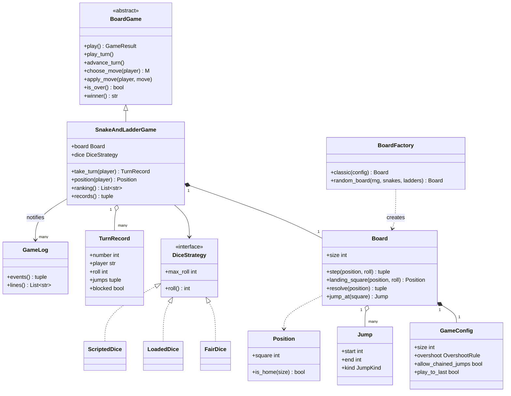
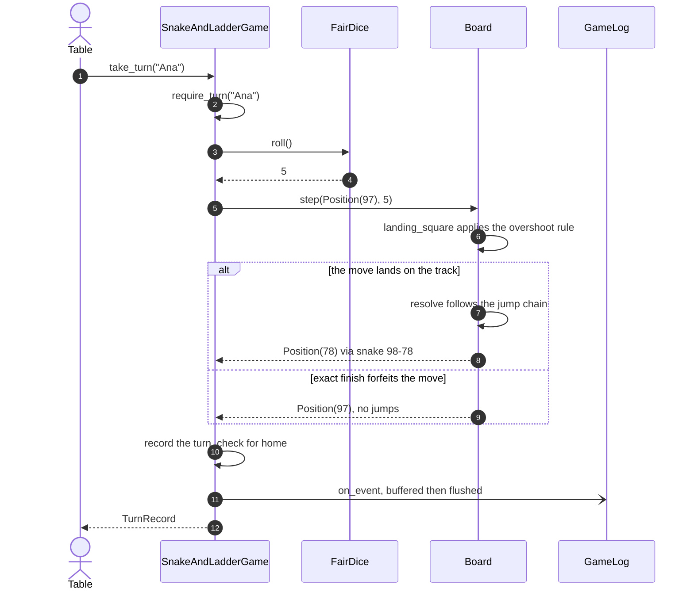
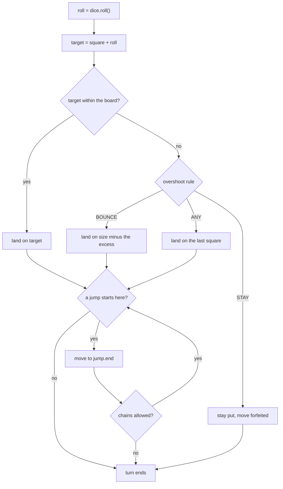

# Design snake and ladder

## TL;DR

- You reuse the `BoardGame` template from [tic-tac-toe](tic-tac-toe.md) and add five methods: a roll is the move, a position is the state, first one home wins.
- Three decisions carry the interview: **dice are a Strategy** so every test is exact, **the board validates itself at construction** (no doubled heads, no chains, no cycles), and **the overshoot rule is configuration**, not an `if` buried in the turn loop.
- Patterns that earn their place: Template Method, Strategy, Factory, Observer. A `Snake` and `Ladder` class hierarchy is deliberately not used.

## Problem statement

"Design snake and ladder. Two or more players take turns rolling a die and moving that many squares along a track of 100. Snakes send you down, ladders send you up. The first player to reach the last square wins — decide and defend whether the final roll must be exact. Support different dice, report a ranking at the end, and keep a log of the game. Show me the classes and how you would prove the board is not broken."

## Requirements

**Functional**

- A track of N squares (default 100) carrying snakes and ladders.
- Two to eight players taking turns in a fixed rotation.
- A pluggable dice policy: a fair die, several dice at once, a loaded die, a scripted sequence.
- A configurable exact-finish rule: stay put on an overshoot, bounce back, or win on any roll that reaches the end.
- Board validation: no two jumps starting on the same square, no jump landing on the head of another (unless chains are explicitly enabled), and never a cycle.
- A winner, and a ranking of everyone else.
- A game log that an observer receives without polling.

**Non-functional and constraints**

- Deterministic: the random generator is injected and seeded, so a game replays identically.
- Correct when several clients drive turns concurrently: one record per turn, exactly one winner.
- In-memory, single process, standard library only.

**Out of scope**: Ludo-style multiple tokens, betting, board rendering, networking.

## Clarifying questions and assumptions

| Question to ask | Assumption taken here |
|---|---|
| Must the winning roll be exact? | Configurable, defaulting to exact (`OvershootRule.STAY`). Ask this out loud — it is the rule interviewers most often leave unstated. |
| Can a jump land you on another jump? | Not by default; `Board` rejects such a board. `allow_chained_jumps=True` enables it and switches validation to cycle detection. |
| Does a six grant another turn? | Not here. It is an override of `advance_turn`, which is why that hook exists on the base class. |
| Do players knock each other back to the start? | No. It would be a rule in `apply_move` reading the other players' positions; the entities do not change. |
| One die or several? | Whatever the `DiceStrategy` says. The game never counts dice. |
| Does the game stop at the first winner? | Yes by default. `play_to_last=True` keeps going so every position in the ranking is earned rather than inferred. |
| How big is the board? | `GameConfig.size`, minimum 4. Nothing in the code assumes 100 or a 10 x 10 grid. |

## Core entities and relationships

- **SnakeAndLadderGame** — the subclass. It supplies the five template steps plus one hook override, and adds `take_turn`, `position`, `records` and `ranking`.
- **Board** — the track and its jumps. Its constructor is where every board rule is enforced; `step` is the only method a turn calls.
- **GameConfig** — a frozen bundle of every rule a variant changes: size, overshoot rule, chained jumps, play-to-last.
- **Jump** — a frozen `(start, end)` pair. Whether it is a snake or a ladder is derived from the numbers, so the two can never disagree.
- **Position** — a frozen square number, `0` meaning "not on the board yet" and `size` meaning home.
- **TurnRecord** — the immutable log line: turn number, player, roll, start, end, and the jumps taken. Everything a replay or an audit needs.
- **BoardFactory** — `classic()` returns the Milton Bradley layout; `random_board(rng, ...)` generates a valid one by construction.
- **DiceStrategy** — `FairDice`, `LoadedDice`, `ScriptedDice`.
- **GameLog** — the observer, imported unchanged from the tic-tac-toe package.

Multiplicities: game `1 -> 1` board, game `1 -> 1` dice, board `1 -> 1` config, board `1 -> *` jumps, game `1 -> *` turn records, game `1 -> *` observers.

## Class diagram

**One subclass, one validated board, one dice interface: everything else is inherited.**



## Design patterns applied

| Pattern | Where | Why it earns its place |
|---|---|---|
| [Template Method](../patterns/template-method.md) | `BoardGame` from the tic-tac-toe package | This whole problem is five overrides on a skeleton you already wrote. Saying that in the room, and pointing at the shared file, is worth more than a second turn loop. |
| [Strategy](../patterns/strategy.md) | `DiceStrategy` with fair, loaded and scripted dice | `ScriptedDice` is what turns "simulate and hope" into an exact assertion, and multiple dice or a loaded die become one class each. |
| [Factory](../patterns/factory-method.md) | `BoardFactory.classic` and `random_board` | Board construction has rules of its own. `random_board` pairs distinct squares so the result is valid by construction rather than by retrying. |
| [Observer](../patterns/observer.md) | `GameLog` subscribed to the game | The log is a subscriber, not a field on the game. The same class serves tic-tac-toe and bowling. |
| Configuration object | `GameConfig` | Four rule flags travel together and are read together. As separate constructor arguments they drift; as a frozen dataclass they are one thing you can print in a bug report. |
| Value objects | `Jump`, `Position`, `TurnRecord` | Frozen and comparable, so a test asserts `records[0].jumps == (Jump(3, 12),)` instead of picking apart integers. |

What was deliberately *not* used: a **`Snake` / `Ladder` class hierarchy**. The two differ only in whether `end` is below or above `start`; `Jump.kind` derives it. Two subclasses would let you construct a `Snake(10, 30)` that climbs, which is a state the type system was supposed to prevent. Also skipped: a **Singleton board**. Tests build a dozen boards; the classic one is a factory call, not a global.

## Key flows

**One turn, driven from outside: turn check, roll, overshoot rule, jump chain, log.**



**How one roll resolves.** The order matters and is the thing to draw: the overshoot rule is applied *first*, then jumps. Bouncing back onto the head of a snake is legal, and the demo below does exactly that.



## Implementation

Write the vocabulary first, then the board's constructor — that is where the interesting code is — and only then the game, which is short because the template already exists.

The enums are the rule vocabulary. `OvershootRule` is the one to name out loud before you write anything else:

```python title="code/lld/snake_and_ladder/models.py — enums and errors"
--8<-- "code/lld/snake_and_ladder/models.py:enums"
```

`Jump.kind` is derived, `Position` is a number with a name, and `TurnRecord.blocked` gives the log a word for "the exact-finish rule stopped you":

```python title="code/lld/snake_and_ladder/models.py — values"
--8<-- "code/lld/snake_and_ladder/models.py:values"
```

Now the board. Three invariants are established once, in the constructor, so that no turn ever has to re-check them: a jump stays on the track, no two jumps share a head, and jumps neither chain nor loop. `landing_square` and `resolve` are separate because the overshoot rule and the jump rule compose in a fixed order:

```python title="code/lld/snake_and_ladder/models.py — board and validation"
--8<-- "code/lld/snake_and_ladder/models.py:board"
```

Dice are the smallest possible Strategy: one method. `ScriptedDice` is the reason the tests below assert exact squares instead of statistical properties:

```python title="code/lld/snake_and_ladder/strategies.py — dice"
--8<-- "code/lld/snake_and_ladder/strategies.py:dice"
```

The factory hides the two ways a board comes into existence. Note the comment on `random_board`: sampling distinct squares and pairing them makes overlap and chaining impossible, so there is no retry loop:

```python title="code/lld/snake_and_ladder/services.py — board factory"
--8<-- "code/lld/snake_and_ladder/services.py:factory"
```

And the game. Everything above the divider is the template's five steps plus one hook; below it are the four methods a caller actually uses. Compare the shape with `TicTacToeGame` — same skeleton, different rules:

```python title="code/lld/snake_and_ladder/services.py — the game"
--8<-- "code/lld/snake_and_ladder/services.py:game"
```

Running `python -m lld.snake_and_ladder.demo` plays a seeded game on the classic board, then shows the three overshoot rules and two boards that never get built:

```text
--- classic board, three players, one seeded six-sided die ---
[ 2] Bo rolls 1: 0 to 38 via ladder 1-38
[ 3] Cy rolls 1: 0 to 38 via ladder 1-38
[11] Bo rolls 6: 43 to 11 via snake 49-11
[29] Bo rolls 6: 22 to 84 via ladder 28-84
[38] Bo rolls 6: 89 to 75 via snake 95-75
[52] Ana rolls 3: 61 to 60 via snake 64-60
winner: Cy after 69 turns, ranking ['Cy', 'Ana', 'Bo']
the log observer recorded 71 events
--- rolling a 5 from square 97, one rule at a time ---
  stay: 97 + 5 lands on 97
bounce: 97 + 5 lands on 78 via snake 98-78
   any: 97 + 5 lands on 100
--- boards rejected at construction, never at turn 40 ---
overlap: snake 10-5 overlaps ladder 10-30 on square 10
cycle: the chain from square 10 loops back to 10
```

The bounce line is the one to point at: rolling a 5 from square 97 walks to 100, bounces back to 98, and 98 is the head of a snake, so the player ends on 78. Two rules composed in the right order, with no special case for it anywhere in the code.

## Concurrency and edge cases

**Which lock protects what.** `BoardGame._lock`, inherited, guards the turn cursor, the positions dictionary, the finish order and the record list — everything a turn mutates. `take_turn` holds it across the turn check *and* the roll *and* the position update, which is the point: without that, two clients could both pass `require_turn`, both roll, and both write a position for the same turn number. The board itself is immutable after construction, so nothing about jumps needs a lock at all — that is a direct benefit of validating in the constructor.

**The race it prevents.** The concurrency test drives one game from six worker threads calling `take_turn` for a cycling player, and asserts three invariants: the number of accepted calls equals `game.turns` equals the number of records; the record numbers are `1..n` with no gap or duplicate; and each player's stored position is the end position of that player's last record. Losers get `NotYourTurnError`, which is the correct answer rather than a lost update.

**Edge cases handled**: a board whose jumps overlap, chain, loop, leave the track, go nowhere or start on the last square; a chain that is followed only when the config allows it; the overshoot rule in all three settings; a bounce that lands on a snake; a player who is already home being skipped by `advance_turn` when playing to last place; a roll of zero or less; a scripted die that runs out; a random board request that needs more squares than the track has; a one-player game; and a turn played after the game ended. The inherited turn limit converts a pathological board — one where the exact-finish rule makes the end unreachable — into a clean `TurnLimitError` instead of an infinite loop.

!!! warning "Common mistake"
    Validating the board lazily, inside the turn loop, or not at all. A jump whose end is another jump's head produces a chain you did not intend; three of them in a ring produce a token that jumps forever and a game that hangs at turn 40 with no useful stack trace. Reject it in the constructor, in a method you can name — `_reject_chains` or `_reject_cycles` — and say which invariant each one establishes. It is four lines of graph walking and it is the single strongest signal in this problem.

## Extensibility and follow-ups

- **Ludo**: each player owns several tokens, so `Position` moves from the game's dictionary onto a `Token`, and `apply_move` becomes "roll, then choose which token to move" — a second Strategy. Safe zones are a predicate on the board; sending an opponent home is a rule in `apply_move` that reads other tokens.
- **A six grants another turn**: override `advance_turn` to return without rotating when the last roll was the maximum. One method, no other change — that is exactly why the base class exposes it as a hook rather than inlining rotation.
- **Undo**: snake and ladder needs less machinery than tic-tac-toe, because `TurnRecord` already stores the start position. Undo is "pop the record, restore `start`, restore the turn cursor Memento".
- **Knock-back on collision**: when two players share a square, the later arrival sends the earlier one back. It reads other players' positions inside `apply_move`; the entities do not change, but say out loud that it makes turns order-dependent and therefore harder to parallelise.
- **Board generation with a difficulty target**: keep `random_board`, add a scoring function (expected turns to finish, estimated by simulation with a seeded generator) and resample until it lands in a band.
- **A networked table**: `TurnRecord` is already serialisable, `take_turn` is already turn-checked, and the game lock already makes two sockets safe. What is missing is reconnection, which is a replay of the records.

!!! tip "Interview tip"
    When the interviewer says "now make the dice loaded" or "now allow two dice", do not add a parameter to the game. Say "that is a `DiceStrategy` implementation" and write the four-line class. Then add: "and the game's test does not change, because it already injects a scripted die." Naming the seam and its test in the same breath is what separates a P2 answer from a P0 one.

## Tests

`tests/test_snake_and_ladder.py` has 17 cases. The scripted game is the one to walk through: it pins a ladder, a snake and an exact finish in nine turns with no randomness anywhere.

```python title="code/lld/snake_and_ladder/tests/test_snake_and_ladder.py — a scripted game and the overshoot rule"
--8<-- "code/lld/snake_and_ladder/tests/test_snake_and_ladder.py:scripted"
```

The board validation cases are a single parametrized table, which is how you should write them under time pressure — one row per invariant, each asserting on the message fragment so a refactor that swallows an error fails loudly:

```python title="code/lld/snake_and_ladder/tests/test_snake_and_ladder.py — board validation"
--8<-- "code/lld/snake_and_ladder/tests/test_snake_and_ladder.py:validation"
```

```python title="code/lld/snake_and_ladder/tests/test_snake_and_ladder.py — concurrency"
--8<-- "code/lld/snake_and_ladder/tests/test_snake_and_ladder.py:concurrency"
```

The rest cover: a seeded classic game replaying identically twice, with the observer receiving one event per turn plus a start and a win; chains followed only when enabled; out-of-turn, finished and one-player games refused; playing to last place skipping finishers and ranking everyone; the three dice classes for seeding, bounds and validation; and randomly generated boards being valid by construction. Run them with `uv run pytest code/lld/snake_and_ladder -q`.

## 45-minute pacing

| Minutes | What to do | What to say or write |
|---|---|---|
| 0–5 | Clarify | Exact finish or not? Chained jumps? Six grants another turn? How many dice? Out of scope: Ludo tokens, rendering, networking. |
| 5–9 | Reuse | "This is the same turn loop as tic-tac-toe." Draw `BoardGame` with its four abstract methods and say what this game fills in. |
| 9–14 | Entities | Board, Jump, Position, GameConfig, TurnRecord, DiceStrategy. Point out that snake versus ladder is derived, not a subclass. |
| 14–24 | Board validation | Write the constructor: on-track, no duplicate head, no chain or no cycle. Walk the cycle detection out loud; it is the strongest part of the answer. |
| 24–32 | Turn resolution | `landing_square` then `resolve`, in that order. Draw the bounce-onto-a-snake case and show that no special case is needed. |
| 32–38 | Game and concurrency | The five overrides, `advance_turn` skipping finishers, then the single game lock and what `take_turn` makes atomic. |
| 38–45 | Extensions | Ludo, six-grants-a-turn as a hook override, undo from `TurnRecord`, a networked table. |

## Related

- [Design tic-tac-toe (an extensible board game)](tic-tac-toe.md) — where `BoardGame`, the turn cursor and the observers come from
- [Template Method](../patterns/template-method.md) — the skeleton this game fills in
- [Strategy](../patterns/strategy.md) — the dice seam
- [Factory Method](../patterns/factory-method.md) — how `BoardFactory` keeps board rules in one place
- [Observer](../patterns/observer.md) — the game log
- [Design a bowling alley](bowling-alley.md) — a third subclass, where a turn spans several balls
