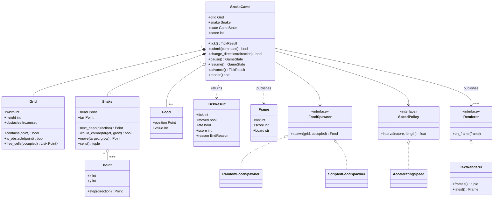
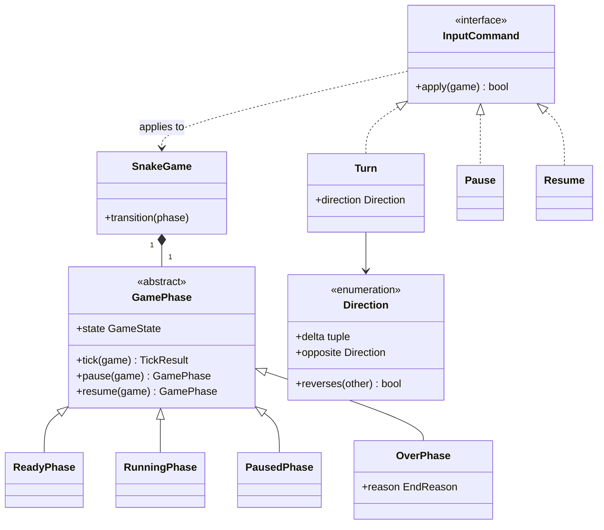
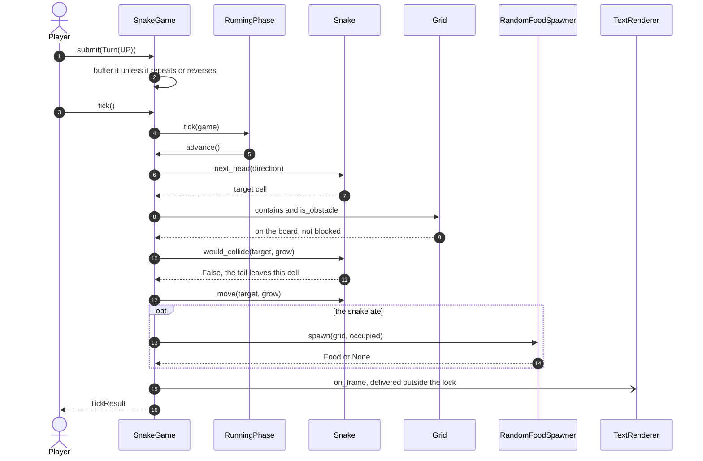
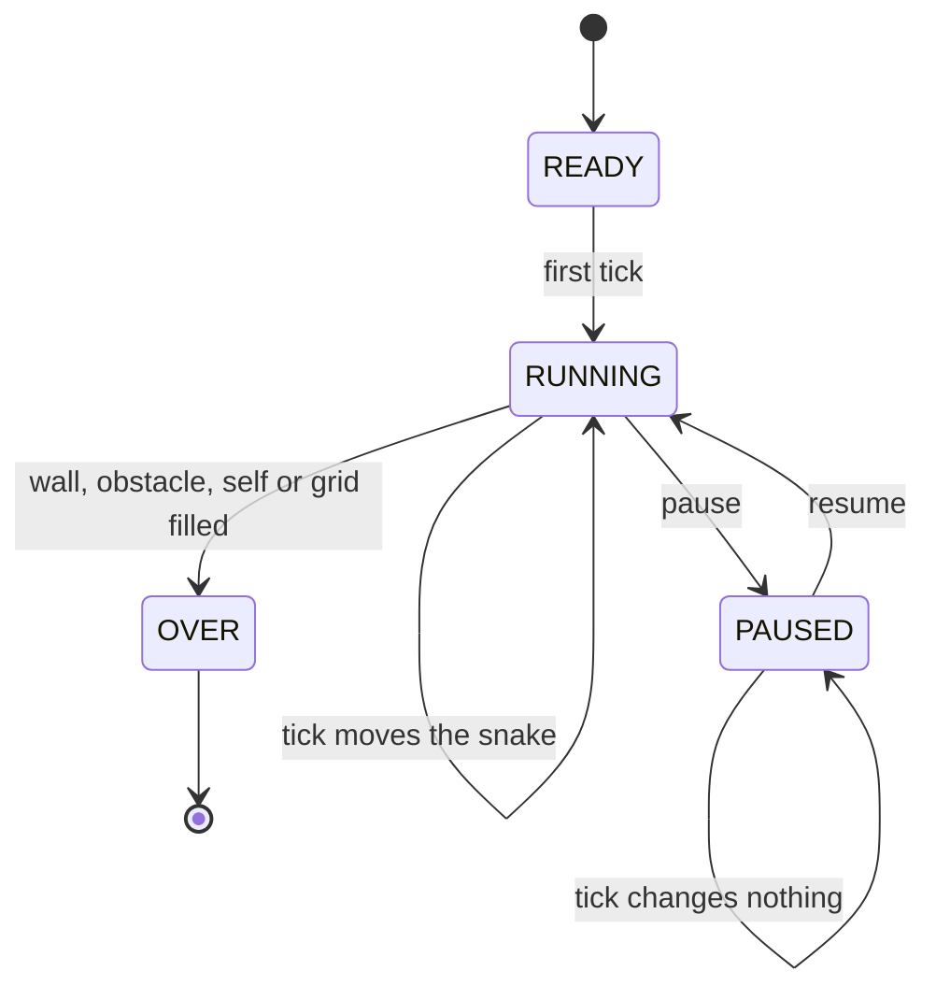

# Design the snake game

## TL;DR

- You build a tick-driven engine: one `tick()` moves the snake one cell, decides whether it died, and publishes a frame to whoever is rendering.
- Three decisions carry the interview: **the tail's cell is free the moment the tail leaves it** (the rule most candidates get wrong), **self-collision is O(1)** because the snake keeps a deque *and* a set, and **the input buffer validates each turn against the last queued direction**, not the last applied one.
- Patterns that earn their place: State (four phase classes, unlike tic-tac-toe's enum), Strategy (food spawner, speed), Observer (renderer), Command (input). Template Method is deliberately *not* used.

## Problem statement

"Design the snake game. On a W x H grid a snake moves one cell per tick in its current direction. Food appears on a free cell; eating it makes the snake one cell longer and scores a point. The game ends when the snake hits a wall, an obstacle or itself. The player can turn — but not by 180 degrees — and can pause and resume. The game speeds up as the score rises. Show me the classes, one tick in detail, and what happens when the player turns twice between two ticks."

## Requirements

**Functional**

- A W x H grid with optional obstacles.
- A snake that moves one cell per tick in its current direction.
- Food on a free cell; eating it grows the snake by one and adds to the score.
- The game ends on a wall, an obstacle or the snake's own body; filling the grid ends it as a win.
- Direction changes that are neither a repeat nor a 180-degree reversal, buffered between ticks.
- Pause and resume; a tick while paused changes nothing.
- Speed scaling: the interval between ticks shortens as the score rises.
- A renderer that receives frames instead of polling the engine.

**Non-functional and constraints**

- One tick is O(1) in the snake's length: no scan of the body, no scan of the grid.
- Deterministic: the food generator is injected and seeded, and time comes from an injected `Clock`.
- Safe when input and the clock run on different threads.
- In-memory, single process, standard library only.

**Out of scope**: actual rendering, key bindings, high-score persistence, multiplayer.

## Clarifying questions and assumptions

| Question to ask | Assumption taken here |
|---|---|
| Do the walls kill, or does the snake wrap around? | They kill. Wrap-around is a one-method change on `Grid`, noted under follow-ups. |
| Can the snake move into the cell its tail is leaving? | Yes, unless it is growing that tick. Ask this out loud; it is the rule the problem exists to test. |
| What happens to two key presses inside one tick? | Both are buffered, up to two, and each is validated against the previous *queued* direction. |
| Does the snake grow immediately on eating? | Yes: the head advances and the tail stays put for that tick. |
| Who drives the clock? | The caller. The engine exposes `next_interval()` and never sleeps, so tests are instant and a front end can use any loop. |
| What ends the game when the grid fills? | The spawner returns `None`, and the engine reports `EndReason.FILLED`. That is a win, not a crash. |
| Are obstacles static? | Yes, fixed at construction. Moving obstacles would be a second entity ticked before the snake. |

## Core entities and relationships

- **SnakeGame** — the engine. It owns the world, the lock and the input buffer, and it exposes exactly three verbs: `tick`, `submit` and the pause/resume pair.
- **GamePhase** with `ReadyPhase`, `RunningPhase`, `PausedPhase`, `OverPhase` — the State machine. Each phase answers `tick`, `pause` and `resume` for itself.
- **Grid** — width, height and obstacles. It answers `contains`, `is_obstacle` and `free_cells`, and knows nothing about snakes.
- **Snake** — a `deque` for order and a `set` for membership. The set is the whole reason collision detection is O(1).
- **Point** — a frozen `(x, y)` cell, with `y` growing downwards so that `UP` is `-1`.
- **Direction** — the four moves, each with a delta and an opposite. `reverses` is one line and it is the guard the player feels.
- **Food** — a frozen position plus its point value.
- **FoodSpawner** — `RandomFoodSpawner` (seeded) and `ScriptedFoodSpawner` (exact, for tests).
- **SpeedPolicy** — `ConstantSpeed` and `AcceleratingSpeed`.
- **TickResult** and **Frame** — the immutable answers to "what happened" and "what does it look like".
- **Renderer** — the output port; `TextRenderer` is the in-memory implementation.
- **InputCommand** with `Turn`, `Pause`, `Resume` — one key press as an object.

Multiplicities: game `1 -> 1` grid, game `1 -> 1` snake, game `1 -> 0..1` food, game `1 -> 1` phase, game `1 -> 1` spawner, game `1 -> 1` speed policy, game `1 -> *` renderers.

## Class diagram

**The world: one engine, one grid, one snake, and the two policies that vary.**



**The State machine and the input commands: the two places where behaviour is an object.**



## Design patterns applied

| Pattern | Where | Why it earns its place |
|---|---|---|
| [State](../patterns/state.md) | `GamePhase` with four subclasses | A tick means three different things: start and advance, do nothing, or raise. Behaviour differs per state, which is exactly the test for State classes over an enum. Contrast with [tic-tac-toe](tic-tac-toe.md), where the status only *labels* the game and an enum is enough. |
| [Strategy](../patterns/strategy.md) | `FoodSpawner`, `SpeedPolicy` | "Make it harder" is a `SpeedPolicy`; "make food appear near the snake" is a `FoodSpawner`. Both are the difficulty knob interviewers reach for, and both keep the tick free of tuning constants. |
| [Observer](../patterns/observer.md) | `Renderer` and `TextRenderer` | The engine publishes `Frame`s and imports no display code. A curses front end, a websocket and the test renderer all implement one method. |
| [Command](../patterns/command.md) | `InputCommand` with `Turn`, `Pause`, `Resume` | A key press becomes an object, which is what makes input queueable, loggable and replayable. Recording the commands is a complete replay format. |
| Value objects | `Point`, `Food`, `TickResult`, `Frame` | Frozen and comparable, so a test asserts `game.food == Food(Point(6, 0))` rather than reading three fields. |
| Dependency injection | `Clock`, the seeded generator, both policies | Nothing calls `time.time()` or the global `random`. The demo runs a full game in microseconds of wall time and 1.28 s of game time. |

What was deliberately *not* used: **Template Method**. The `BoardGame` base that [tic-tac-toe](tic-tac-toe.md) and [snake and ladder](snake-and-ladder.md) share is built around turns and players; this game has neither. Forcing it in would mean a one-player rotation and a `choose_move` that is really "read the input buffer" — ceremony that hides the tick. Say that out loud: knowing when *not* to reuse your own abstraction is the same judgement as knowing when to build it.

## Key flows

**One tick: buffered turn, wall, obstacle, self, move, eat, publish.**



**Game state.** Four phases, and each one answers `tick` differently — which is the argument for State classes rather than an enum and a chain of `if`s.



## Implementation

Write the vocabulary first, then the snake — the two methods on it are the whole problem — then the phases, then the engine.

`Direction.reverses` and the four end reasons are the rule vocabulary. Naming `EndReason.FILLED` early tells the interviewer you have thought about the win condition, which most candidates never reach:

```python title="code/lld/snake_game/models.py — enums"
--8<-- "code/lld/snake_game/models.py:enums"
```

Geometry and the immutable results. `y` grows downwards, so `UP` is a delta of `-1`; say it once and you will not flip a sign later:

```python title="code/lld/snake_game/models.py — geometry"
--8<-- "code/lld/snake_game/models.py:geometry"
```

The grid answers three questions and knows nothing about snakes. `free_cells` returns row-major order so that a seeded spawner is reproducible run to run:

```python title="code/lld/snake_game/models.py — grid"
--8<-- "code/lld/snake_game/models.py:grid"
```

This is the class the problem is really about. Two containers, kept in step by a single mutating method, and the collision rule that costs candidates the interview:

```python title="code/lld/snake_game/models.py — the snake"
--8<-- "code/lld/snake_game/models.py:snake"
```

Both policies are one-method protocols. `ScriptedFoodSpawner` is what makes every test below exact instead of statistical:

```python title="code/lld/snake_game/strategies.py — food spawners"
--8<-- "code/lld/snake_game/strategies.py:spawner"
```

```python title="code/lld/snake_game/strategies.py — speed"
--8<-- "code/lld/snake_game/strategies.py:speed"
```

Now the State machine. Each phase is a handful of lines, and the engine never asks what state it is in:

```python title="code/lld/snake_game/services.py — the phases"
--8<-- "code/lld/snake_game/services.py:phases"
```

The engine. `advance` is the method to write on the whiteboard first: wall, obstacle, self, move, eat, respawn, in that order. `change_direction` is where the input-buffer subtlety lives:

```python title="code/lld/snake_game/services.py — the engine"
--8<-- "code/lld/snake_game/services.py:engine"
```

Input as objects, and the renderer port. Together they are twenty lines and they buy you the whole "how would you add replay?" answer:

```python title="code/lld/snake_game/services.py — input commands"
--8<-- "code/lld/snake_game/services.py:commands"
```

```python title="code/lld/snake_game/services.py — renderer"
--8<-- "code/lld/snake_game/services.py:renderer"
```

Running `python -m lld.snake_game.demo` plays a short game: eat, turn three times so the head lands on the cell the tail is leaving, get a reversal refused, pause, then hit a wall.

```text
--- 10 x 5 grid, scripted food, a snake of 3 heading right ---
..........
........#.
.ooO.*..#.
..........
..........
tick 2: ate at (5,2), score 1, length 4, interval 0.20s to 0.18s
tick 5: moved into the cell the tail was vacating, which is legal
*.........
....oo..#.
....Oo..#.
..........
..........
UP submitted after DOWN: accepted=False (a 180-degree reversal is ignored)
paused: tick still 5, moved=False, state=paused
tick 8: over by wall, score 1, length 4, 10 frames in 1.28s of game time
```

## Concurrency and edge cases

**Which lock protects what.** One `RLock` on `SnakeGame` guards the snake, the food, the score, the phase and the input buffer. It exists because in every real front end input and the clock are different threads: a key press must not land halfway through a tick, after the head has been computed but before the body has moved. The critical section is a few dictionary and deque operations, on the order of the 17 ns an uncontended mutex costs, so a coarse lock is the right trade here — the alternative, a lock-free single-threaded loop with a thread-safe input queue, is the other legitimate answer and worth naming.

**Notifying outside the lock.** Frames are buffered during the tick and delivered by `flush` after the lock is released, so a renderer writing to a socket cannot delay the next tick.

**The tail rule, stated precisely.** When the head moves to a cell, that cell is occupied unless it is the tail *and* the snake is not growing this tick. Growing keeps the tail in place, so eating a fruit that sits on your own tail cell would be fatal — which is why food never spawns on the snake in the first place. A snake of length 2 turning back on itself is the same cell, but it is refused by the reversal guard rather than the collision test: two independent rules, both needed.

**Input buffering.** Each turn is validated against the last *queued* direction, not the last applied one. Press UP then LEFT inside one tick and both are legal in sequence; validate both against the applied RIGHT and you would accept UP then DOWN, and the snake would eat itself on the next tick. The buffer holds at most two turns, so mashing keys cannot queue a minute of moves.

**Edge cases handled**: a wall, an obstacle and the body each ending the game with their own `EndReason`; the grid filling up, which ends it as a win; a paused tick that changes nothing and does not advance the counter; pausing a game that has not started, and pausing or ticking one that has ended; a snake starting on an obstacle or on top of itself; a grid smaller than 3 x 3; obstacles outside the grid; a spawner with nowhere left to put food; and a repeated direction, which is refused rather than queued.

!!! warning "Common mistake"
    Writing self-collision as `if target in snake.body` and stopping there. It kills the snake whenever it follows its own tail, which is the most common legal move in the game, and it is a linear scan on top. Keep the body in a `set` beside the deque, and make the test `target in cells and (grow or target != tail)`. Say the second half out loud before you write it.

## Extensibility and follow-ups

- **Wrap-around walls**: one method on `Grid` — `normalise(point)` returning the point modulo the dimensions — called before `contains`. The engine does not change, and the wall end reason simply stops occurring.
- **Multiplayer**: a second `Snake` and a per-snake direction and buffer. `advance` computes both targets *before* moving either, so a head-on collision is symmetric rather than decided by iteration order. That ordering question is the whole difficulty, and it is worth saying so.
- **A BFS bot**: a `MoveChooser` strategy that runs breadth-first search from the head to the food over free cells, with a fallback that follows the tail when no path exists. It plugs in where `change_direction` is called today, so the engine is untouched.
- **Replay**: record the seed and the `InputCommand` sequence with the tick each was applied on. That is a complete replay, because everything else in the engine is deterministic — which is the payoff for injecting the generator and the clock.
- **Moving obstacles or a shrinking arena**: a `Hazard` collection ticked before the snake; the collision checks already ask the grid, so only the grid gains state.
- **Score multipliers and special food**: `Food.value` is already there; a `GoldenFood` with a spawn probability is a `FoodSpawner` decorator, not a subclass of the snake.

!!! tip "Interview tip"
    Draw one tick as a numbered list before you write any class: next head, wall, obstacle, self, move, eat, respawn, publish. Then implement it top to bottom. Candidates who start with the `Snake` class usually forget that the checks have an order, and discover halfway through that they have to decide whether the head moves before or after the collision test.

## Tests

`tests/test_snake_game.py` has 12 cases. The two to walk through are the tail rule — pinned directly on `Snake` and again through a real tick — and the input buffer, which is the only place where the correct behaviour is genuinely counter-intuitive.

```python title="code/lld/snake_game/tests/test_snake_game.py — the tail rule"
--8<-- "code/lld/snake_game/tests/test_snake_game.py:tail"
```

```python title="code/lld/snake_game/tests/test_snake_game.py — the input buffer"
--8<-- "code/lld/snake_game/tests/test_snake_game.py:input"
```

The concurrency test runs one ticker thread against four key-press threads and asserts two invariants that would break if a turn landed mid-tick: the body never contains a duplicate cell, and no two consecutively applied directions are opposites.

```python title="code/lld/snake_game/tests/test_snake_game.py — concurrency"
--8<-- "code/lld/snake_game/tests/test_snake_game.py:concurrency"
```

The rest cover: a scripted game that eats, grows and publishes exactly two frames with the expected board row; the three collision reasons as a parametrized table; filling a 3 x 3 grid as a win; the pause, resume and game-over transitions including the errors each phase raises; grid, snake and placement validation; and the speed curve, with `0.2 x 0.9^12 = 0.056` clamped to the 0.06 floor. Run them with `uv run pytest code/lld/snake_game -q`.

## 45-minute pacing

| Minutes | What to do | What to say or write |
|---|---|---|
| 0–5 | Clarify | Walls kill or wrap? Tail-chasing legal? Two key presses in one tick? Obstacles? Out of scope: rendering, persistence, multiplayer. |
| 5–10 | One tick as a list | Next head, wall, obstacle, self, move, eat, respawn, publish. Say the order is the design. |
| 10–16 | Entities | Grid, Snake, Point, Direction, Food, spawner, speed policy, renderer. Point out `deque` plus `set` and why. |
| 16–24 | The snake | Write `would_collide` and `move`. State the tail rule before the code, then show that `grow` is the only thing that changes it. |
| 24–32 | Engine and states | `advance` top to bottom, then the four phases. Justify State classes here after using an enum in tic-tac-toe. |
| 32–38 | Input and concurrency | The buffer, validated against the last queued direction. Name the lock and the mid-tick race it prevents. |
| 38–45 | Extensions | Wrap-around, multiplayer head-on collisions, a BFS bot, replay from seed plus commands. |

## Related

- [Design tic-tac-toe (an extensible board game)](tic-tac-toe.md) — the turn-based sibling, and why its status is an enum rather than State classes
- [State](../patterns/state.md) — the four phases and when classes beat an enum
- [Observer](../patterns/observer.md) — the renderer port
- [Command](../patterns/command.md) — input as objects, and the replay it enables
- [Strategy](../patterns/strategy.md) — the spawner and the speed policy
- [Design snake and ladder](snake-and-ladder.md) — the other snake problem, and a completely different shape
