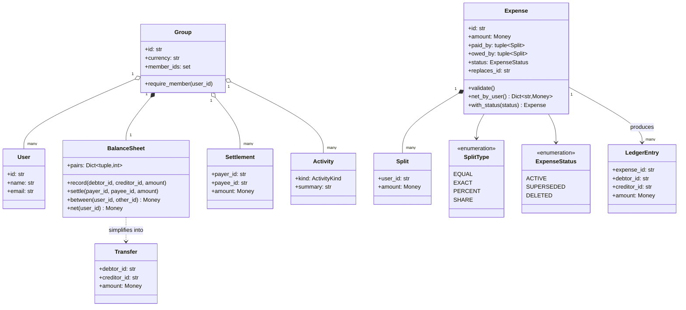
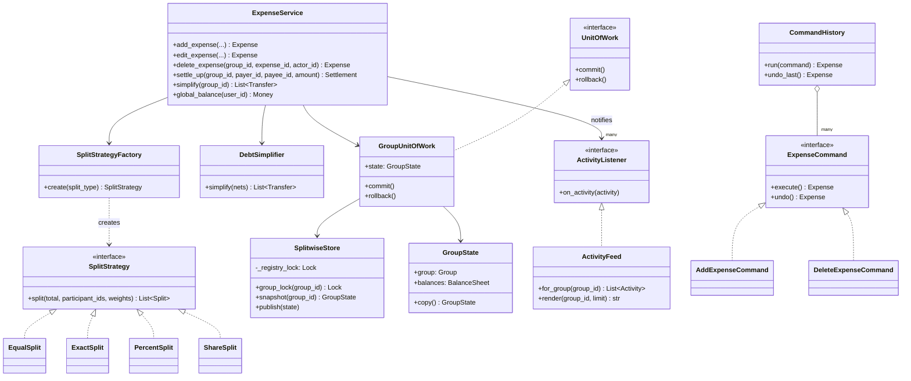
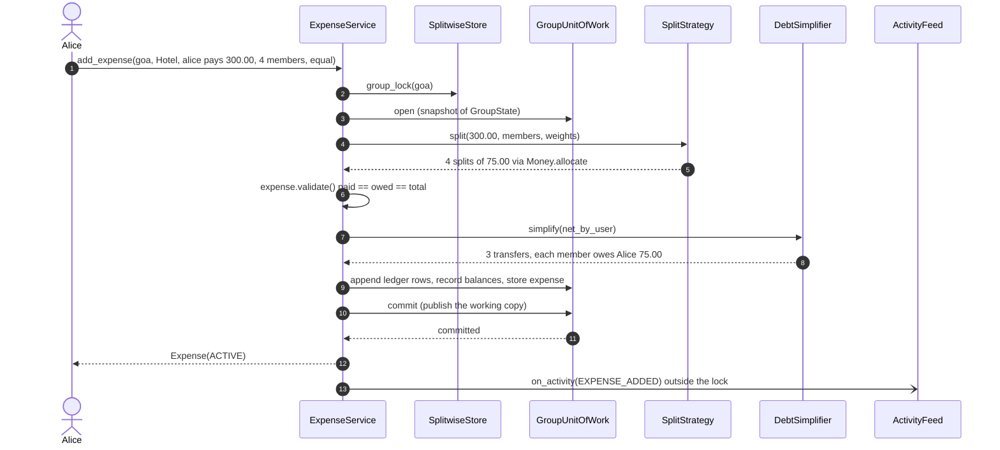
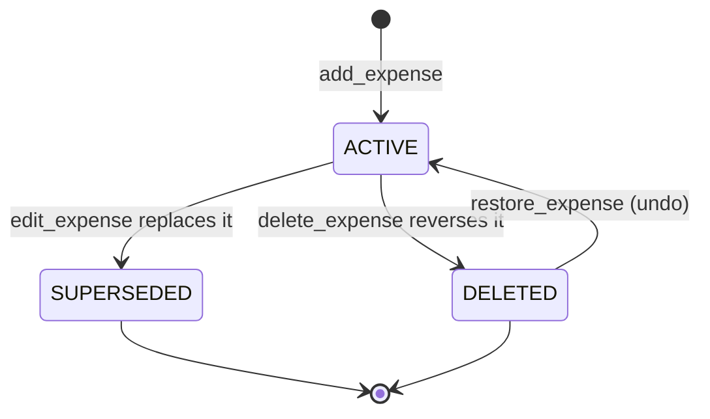

# Design Splitwise

## TL;DR

- You build groups that record expenses, split them four ways (equal, exact, percent, shares), keep per-member balances, and produce a settle-up plan.
- Three decisions carry the interview: **money is integer cents and splits go through `Money.allocate`**, **the expense and the balances commit in one Unit of Work**, and **an edit is a reversal plus a new version**, not a mutation.
- Strategy, Factory, Unit of Work, Command and Observer all earn their place. Debt simplification is greedy, and you say out loud that greedy is not minimal.

## Problem statement

"Design the backend of a shared-expense app. People form groups — a trip, a flat, a team lunch — and record who paid for what and how it should be divided. The app shows each person what they owe and what they are owed, inside a group and overall, and suggests the smallest sensible set of payments to square everyone up. Expenses get corrected and deleted after the fact. Focus on the classes, the split rules, and what happens when two people record an expense at the same time."

## Requirements

**Functional**

- Users, and groups with a member list. A user belongs to many groups.
- Add an expense with one *or several* payers and a split over the participants; the split is equal, exact amounts, percentages, or relative shares.
- Validate that what the payers contributed and what the participants owe both equal the expense total.
- Per-member balances inside a group, and a global balance across every group a member belongs to.
- Simplify debts: turn the group's balances into a short list of transfers.
- Settle up: record that one member paid another outside the app.
- Edit and delete an expense, with the balances recalculated as if the old version never existed.
- An activity feed per group: added, edited, deleted, restored, settled.

**Non-functional and constraints**

- No cent is ever created or destroyed. Money is `common.Money` (integer cents); a float is an automatic fail here.
- Two members adding an expense to the same group concurrently must both land, and the balances must be exactly the sum of both.
- An expense that fails validation leaves nothing behind: no expense row, no ledger row, no balance movement.
- In-memory and single process; the store is behind a small interface you could back with SQL.
- Deterministic and testable: clock and id generator are injected.

**Out of scope**: authentication, push delivery, multi-currency conversion (one currency per group), real payment rails (that is the [payment gateway problem](payment-gateway-wallet.md)), receipts and OCR.

## Clarifying questions and assumptions

| Question to ask | Assumption taken here |
|---|---|
| Can an expense have more than one payer? | Yes. `paid_by` is a map of member to amount, and the invariant is that it sums to the total. |
| How are percentages represented? | As basis points — hundredths of a percent — so 33.33% is the integer `3333` and no float ever touches money. |
| Who absorbs the leftover cent when 100.01 splits three ways? | The first participants in a deterministic order, via `Money.allocate`. Two runs of the same expense produce identical splits. |
| Does "simplify debts" have to be the true minimum number of transfers? | No, and you should say why: minimising it is NP-hard. Greedy gives at most `n-1` transfers, usually fewer. |
| Does an edit rewrite history? | No. The old version is kept as `SUPERSEDED` and a new version replaces it, so the ledger stays auditable. |
| One currency or many? | One per group. Cross-currency is a follow-up because it needs rate snapshots per expense. |
| Do balances need to be exact across concurrent writers? | Yes. That is what the per-group lock and the Unit of Work are for. |

## Core entities and relationships

- **User** — a frozen value object. **Group** — a name, a currency and a member set; `require_member` is the one place membership is enforced.
- **Expense** — frozen: id, group, description, total, `paid_by` splits, `owed_by` splits, split type, creator, timestamp, `ExpenseStatus` and `replaces_id`. `validate()` asserts both sides equal the total; `net_by_user()` reduces it to `paid - owed` per member.
- **Split** — one line, `(user_id, Money)`. The same type describes what someone paid and what someone owes, which is why the invariant reads as one line of code.
- **SplitStrategy** with `EqualSplit`, `ExactSplit`, `PercentSplit`, `ShareSplit`, built by `SplitStrategyFactory`. Every one of them ends in `Money.allocate`.
- **BalanceSheet** — one per group. It stores *pairwise* net debt keyed by the ordered pair `(low_id, high_id)`, so "A owes B 5.00" and "B owes A 5.00" collapse to nothing. `net(user)` is one pass; `between(a, b)` is one lookup.
- **LedgerEntry** — the append-only audit row behind every balance movement; a reversal is the same row with the two ids swapped.
- **DebtSimplifier** — turns balances into `Transfer` objects using a max-creditor and a max-debtor heap.
- **GroupState** — group, balances, expenses, ledger, settlements: the unit the **GroupUnitOfWork** copies, mutates and publishes. **SplitwiseStore** holds one `GroupState` and one lock per group.
- **ExpenseService** — the only writer. **ActivityFeed** observes it. **AddExpenseCommand** / **DeleteExpenseCommand** wrap the two undoable operations for `CommandHistory`.

Multiplicities: group `1 -> *` members, group `1 -> 1` balance sheet, expense `1 -> *` splits on each side, expense `1 -> *` ledger entries, group `1 -> *` settlements.

## Class diagram

**The domain: what an expense is made of and where the balances live.**



**The services: four strategies, one transaction boundary, two undoable commands.**



## Design patterns applied

| Pattern | Where | Why it earns its place |
|---|---|---|
| Strategy | `SplitStrategy` and its four implementations | "Now add split-by-adjustment" is the follow-up you will get. It is one new class plus one registry line; `ExpenseService` does not change. |
| Factory Method | `SplitStrategyFactory.create` | The API receives the string `"percent"`. The registry maps it to a class, so the service never grows an `if/elif` ladder on split type. |
| Unit of Work | `GroupUnitOfWork` | The expense row, the ledger rows and the balance sheet must become visible together. One copy, one commit, one publish. |
| Repository (light) | `SplitwiseStore` | `snapshot` and `publish` are the only two verbs the service knows. Swapping in SQL means implementing those two against a transaction. |
| Command | `AddExpenseCommand`, `DeleteExpenseCommand`, `CommandHistory` | Undo is a product requirement, not decoration: the stack replays the inverse operation. Settling up is deliberately not a command. |
| Observer | `ActivityListener` / `ActivityFeed` | The feed, push notifications and an analytics sink are all listeners. The service publishes after committing, outside the lock. |
| Value objects | `Money`, `Split`, `Expense`, `Transfer` | Frozen dataclasses make "an edit is a new version" the natural implementation rather than a discipline you have to remember. |

What was deliberately *not* used: a **State** class hierarchy for `ExpenseStatus`. Three states with two legal transitions are an enum and a guard clause; classes would add three files and no behaviour. Also no **Memento** for undo — the command re-derives the inverse from the expense itself, which is smaller and cannot drift out of sync with the ledger.

## Key flows

**Adding an expense: strategy, validation, ledger, balances, commit, then notify.**



**Expense lifecycle.** `SUPERSEDED` is what makes an edit auditable: the old row stays, the balances no longer reflect it, and `replaces_id` links the two.



## Implementation

Write it in the order you would in the room: the vocabulary, the entities, the balance sheet, the split rules, the transaction boundary, then the service.

The enums pin the vocabulary — note the comment on each `SplitType` member saying what its weights mean — and the errors subclass the shared hierarchy so an API layer can map `ValidationError` to 400 without knowing about expenses:

```python title="code/lld/splitwise/models.py — enums"
--8<-- "code/lld/splitwise/models.py:enums"
```

```python title="code/lld/splitwise/models.py — errors"
--8<-- "code/lld/splitwise/models.py:errors"
```

`Expense` is frozen. That single choice removes a whole class of bugs: an edit cannot half-mutate an expense, and `with_status` is the only transition. `validate()` is the invariant an interviewer will ask you to state out loud.

```python title="code/lld/splitwise/models.py — entities"
--8<-- "code/lld/splitwise/models.py:entities"
```

The balance sheet is the part candidates usually get wrong by storing a debt row per direction. One ordered pair per couple means a mutual debt cancels itself, and `net` never double counts.

```python title="code/lld/splitwise/models.py — balance sheet"
--8<-- "code/lld/splitwise/models.py:balance"
```

Every strategy funnels into `Money.allocate`, which hands the remainder to the first shares. Percentages are basis points; exact splits are checked against the total rather than recomputed.

```python title="code/lld/splitwise/strategies.py"
--8<-- "code/lld/splitwise/strategies.py:strategy"
```

The store is deliberately dumb: hand out a copy, take back a whole state. All the transactional reasoning lives in the Unit of Work above it.

```python title="code/lld/splitwise/store.py — store"
--8<-- "code/lld/splitwise/store.py:store"
```

```python title="code/lld/splitwise/store.py — unit of work"
--8<-- "code/lld/splitwise/store.py:uow"
```

Debt simplification is two heaps and a loop. The docstring carries the sentence that earns you the point: greedy is `n-1`, not minimal.

```python title="code/lld/splitwise/services.py — debt simplification"
--8<-- "code/lld/splitwise/services.py:simplifier"
```

The service is the only writer. Read `add_expense`, `edit_expense` and `_apply` together: an edit is `_apply(old, -1)` then `_apply(new, +1)` inside one transaction, and because `DebtSimplifier` is deterministic the reversal cancels the original exactly.

```python title="code/lld/splitwise/services.py — expense service"
--8<-- "code/lld/splitwise/services.py:service"
```

The feed is a plain observer, and the two undoable operations are commands over the service — nothing in the service knows they exist:

```python title="code/lld/splitwise/services.py — activity feed"
--8<-- "code/lld/splitwise/services.py:feed"
```

```python title="code/lld/splitwise/commands.py"
--8<-- "code/lld/splitwise/commands.py:commands"
```

The demo walks a trip: three expenses using two split types, an edit, a simplification and one settlement.

```python title="code/lld/splitwise/demo.py"
--8<-- "code/lld/splitwise/demo.py"
```

Running `python -m lld.splitwise.demo` prints:

```text
X-1 Hotel 300.00 USD paid by alice, equal: alice 75.00 USD, bob 75.00 USD, carol 75.00 USD, dave 75.00 USD
X-5 Dinner 100.01 USD paid by bob, equal over 3: alice 33.34 USD, bob 33.34 USD, carol 33.33 USD
X-8 Cab 120.00 USD paid by carol, percent 50/25/25: alice 60.00 USD, carol 30.00 USD, dave 30.00 USD
balances: alice 131.66 USD, bob -8.33 USD, carol -18.33 USD, dave -105.00 USD
edited X-1 -> X-14: hotel is now 280.00 USD
balances: alice 116.66 USD, bob -3.33 USD, carol -13.33 USD, dave -100.00 USD
simplify: 3 transfers for 4 members
  dave pays alice 100.00 USD
  carol pays alice 13.33 USD
  bob pays alice 3.33 USD
after dave settles: alice 16.66 USD, bob -3.33 USD, carol -13.33 USD, dave 0.00 USD
alice across every group: 16.66 USD
--- activity feed ---
bob added Dinner for 100.01 USD
carol added Cab for 120.00 USD
alice edited Hotel to 280.00 USD
dave paid alice 100.00 USD
```

The 100.01 dinner is the line to point at: 33.34 + 33.34 + 33.33 is exactly 100.01. Expense ids jump because expenses and ledger rows draw from the same injected generator.

## Concurrency and edge cases

**Which lock protects what.** There are two, and the granularity is the answer being graded:

1. `SplitwiseStore.group_lock(group_id)` is taken by `ExpenseService` for the entire read-modify-write. It is the group that has an invariant — balances must reflect exactly the set of active expenses — so the group is the unit of locking. Two members adding to the same trip serialise; two different trips never contend.
2. `SplitwiseStore._registry_lock` guards only the user, group and lock registries, and is held for a dict lookup. An uncontended mutex costs about 17 ns (see the [latency cheatsheet](../../cheatsheets/latency-and-estimation.md)), so this lock is free next to the snapshot copy it protects.

**Why a snapshot copy is affordable.** `GroupState.copy()` copies the balance dict and three lists. A 20-member group holds at most `20 x 19 / 2 = 190` pairs, each two ids and an int — far below the ~1 KB the cheatsheet budgets for a profile row, so tens of kilobytes per transaction. If a group ever grew past that, the SQL implementation of the same `UnitOfWork` interface takes over and the copy disappears.

**Rollback is the interesting case.** `add_expense` builds the expense *inside* the `with` block, so a bad percentage or a non-member participant raises after the working copy exists but before `commit`. `__exit__` discards the copy; the store never saw it. The test asserts exactly that: after a rejected expense, balances are all zero and the ledger is empty.

**Cents.** Every split is `Money.allocate`, which gives the remainder to the first shares deterministically. Never divide with `/`, never use `round()`, never store a float. A three-way split of 100.01 is 33.34, 33.34, 33.33 — and the same expense recorded twice produces the same three numbers, which is what makes the reversal on edit exact.

**Edit and delete recalculation.** Because `DebtSimplifier.simplify` is a pure function of the expense's own nets, `_apply(expense, sign=-1)` regenerates the same transfers and records them backwards. There is no need to look up the old ledger rows, and no drift if the balance sheet was touched in between by other expenses.

**Greedy simplification.** Two heaps, `O(n log n)`, at most `n-1` transfers. It is not the minimum: the minimum-transaction problem is NP-hard because you would have to find subsets that already sum to zero. Say that sentence and offer the cheap improvement — first cancel any exact pairwise offsets, then run greedy.

!!! warning "Common mistake"
    Computing splits with floats and rounding at the end. `300 / 4` looks fine until the total is 100.01, and then the balances drift by a cent per expense until someone notices they owe -0.03. Say "integer cents, and the remainder goes to the first shares deterministically" in the first two minutes; it is the single strongest signal on this problem.

**Other edge cases handled**: an expense with several payers; a participant who is also a payer (their net is `paid - owed`, and a zero net is dropped); percentages that do not total 100%; exact amounts that do not total the expense; a non-member payer or participant; deleting an already-deleted expense; editing a superseded version; a settlement of zero or a negative amount; a member who owes themselves.

## Extensibility and follow-ups

- **A new split rule** (split by adjustment, "Bob pays 5.00 extra and the rest is equal"): one class implementing `SplitStrategy`, one line in the factory registry. Nothing in `ExpenseService` changes. That is the seam to name when asked.
- **Multiple currencies**: put the FX rate on the expense at creation time and keep the group's balance sheet in the group currency. Balances must never be re-converted, or yesterday's dinner changes price overnight.
- **Recurring expenses**: a `RecurringExpense` template plus a scheduler that calls `add_expense`; the service is already idempotent per call, so the scheduler only needs a "last generated" marker.
- **Real payments**: `settle_up` currently records that cash moved. Point it at a wallet transfer and the settlement becomes the local half of a distributed transaction — that is the [payment gateway and wallet](payment-gateway-wallet.md) problem, and the honest answer is an outbox row plus a webhook, not a two-phase commit.
- **Persistence**: implement `UnitOfWork` over a SQL transaction. `snapshot`/`publish` become `SELECT ... FOR UPDATE` and an `UPDATE`, and the per-group lock becomes row-level locking on the group.
- **Scale**: at millions of groups you shard by group id, which the design already anticipates — nothing in a transaction crosses groups. Global balances become a fan-out read or a per-user rollup maintained by an event consumer.

!!! tip "Interview tip"
    When you draw the balance sheet, say why the key is an *ordered pair* rather than a directed row. It shows you have thought about the data structure, not just the classes, and it pre-empts the "what if A owes B and B owes A" question before it is asked.

## Tests

`tests/test_splitwise.py` has 12 cases. The two worth walking through are the concurrency test (40 expenses, eight threads, one group — everyone ends square) and the undo test, which proves that delete-then-restore returns the balance sheet to exactly where it was:

```python title="code/lld/splitwise/tests/test_splitwise.py — concurrency"
--8<-- "code/lld/splitwise/tests/test_splitwise.py:concurrency"
```

```python title="code/lld/splitwise/tests/test_splitwise.py — undo"
--8<-- "code/lld/splitwise/tests/test_splitwise.py:undo"
```

The rest cover: the 100.01 three-way split keeping every cent; all four split types via `parametrize`, each asserted to total 10 000 cents; exact shares that do not add up and a non-member participant, both leaving the store untouched; editing recalculating balances and marking the old version `SUPERSEDED`; a simplify plan never exceeding `n-1` transfers and zeroing every balance once executed; the simplifier being deterministic and rejecting a ledger whose nets do not sum to zero; and global balance summing two groups. Run them with `uv run pytest code/lld/splitwise -q`.

## 45-minute pacing

| Minutes | What to do | What to say or write |
|---|---|---|
| 0-5 | Clarify | Several payers? Which split types? Percent representation? Is simplify required to be minimal? Out of scope: multi-currency, real payments. |
| 5-10 | Entities | Nouns: User, Group, Expense, Split, BalanceSheet, LedgerEntry, Settlement. Say "money is integer cents" now, not later. |
| 10-18 | Class diagram | Domain first, then hang `SplitStrategy` off `ExpenseService` and mark the group lock and the transaction boundary. |
| 18-33 | Code | `Money.allocate` splits, then `Expense.validate`, then `BalanceSheet.record`, then `add_expense` inside the Unit of Work. Narrate "compute, validate, post, commit, notify". |
| 33-39 | Concurrency and correctness | The per-group lock, the rollback path, the deterministic reversal on edit. |
| 39-45 | Simplify and extensions | Two heaps, `n-1`, NP-hard caveat; then currencies, recurring expenses, and sharding by group id. |

## Related

- [Strategy](../patterns/strategy.md) — the four split rules behind one interface
- [Unit of Work](../patterns/unit-of-work.md) — the transaction boundary this page reuses
- [Command](../patterns/command.md) — undo for add and delete
- [Design a payment gateway and digital wallet](payment-gateway-wallet.md) — what `settle_up` becomes when real money moves
- [Design a payment system and digital wallet](../../hld/case-studies/payment-system.md) — the distributed version of the same ledger
- [Concurrency for LLD in Python](../fundamentals/concurrency-for-lld.md) — lock granularity and why the group is the unit
