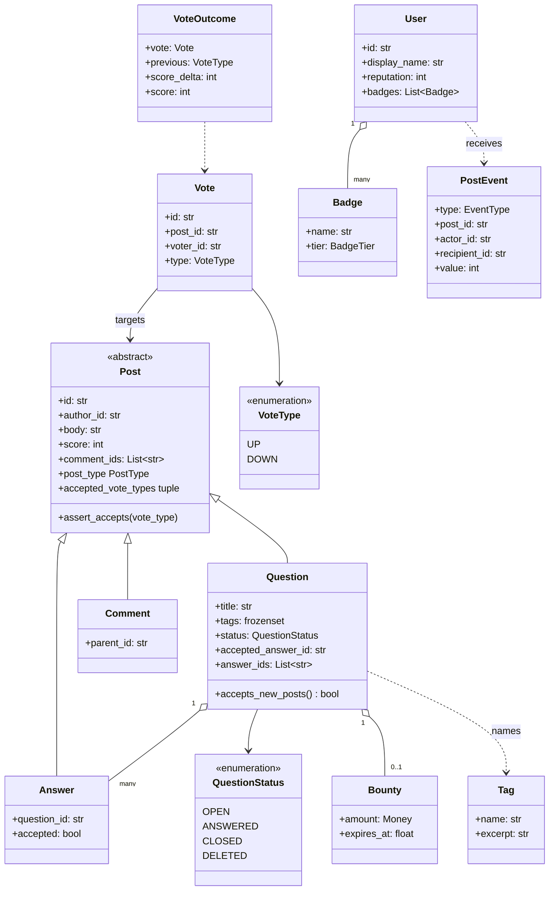
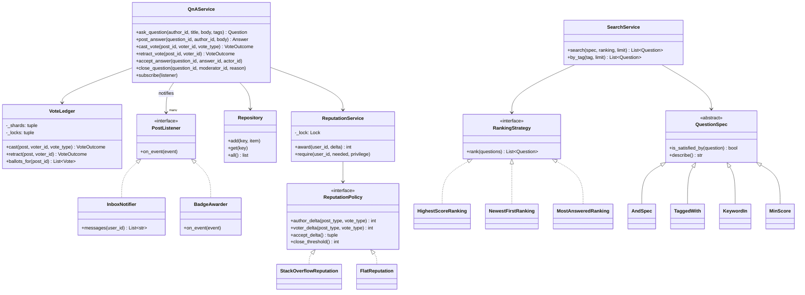
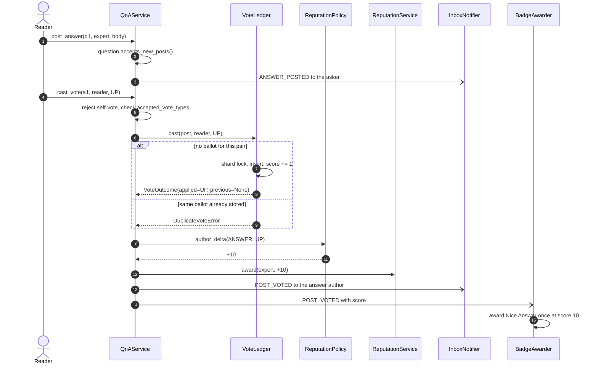
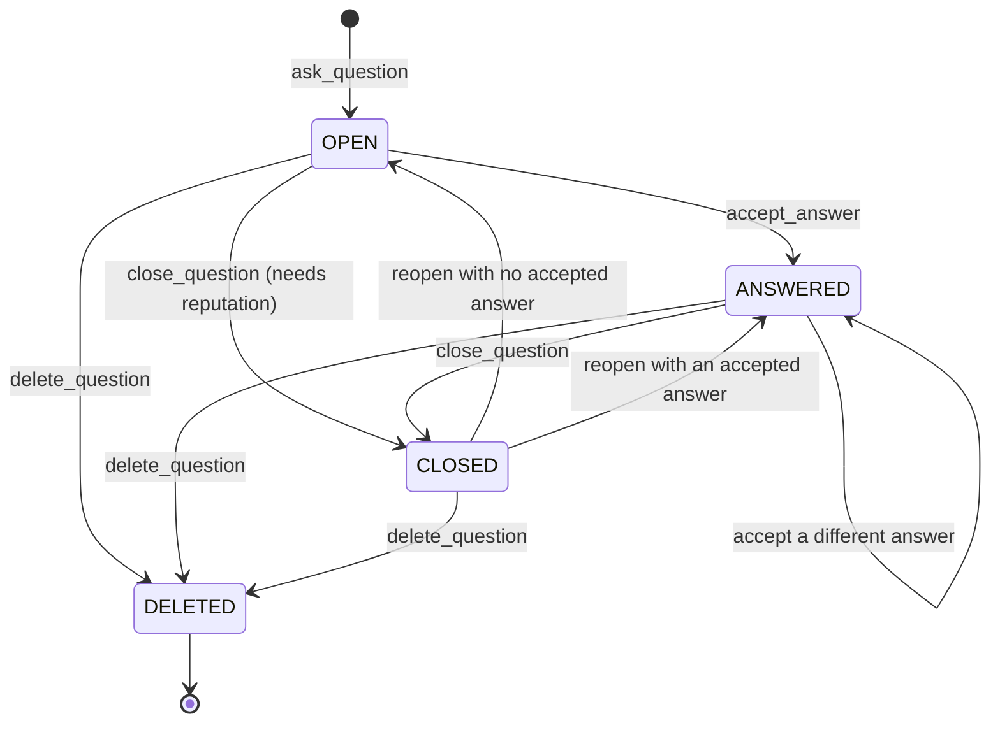

# Design Stack Overflow

## TL;DR

- You build questions, answers and comments over one `Post` base, a `VoteLedger` that enforces one ballot per `(voter, post)`, a `ReputationPolicy` that turns ballots into points, and a `SearchService` driven by composable Specifications.
- Three decisions carry the interview: **the ledger owns both the ballot row and the post score** (so they cannot drift), **reputation is a policy object** (so "make downvotes free" is a new class), and **accept-answer is guarded by a per-question lock** that also handles switching the accepted answer.
- Observer feeds the inbox and the badge awarder. Command is discussed and deliberately *not* used.

## Problem statement

"Design the core of a question-and-answer site. Members ask questions with tags, others answer, everyone comments and votes, and votes move reputation. The asker can accept one answer. Members search by keyword and tag, high-reputation members can close questions, and everyone gets notified about activity on their own posts. Focus on the class model, the vote path, and what happens when two people click the same arrow at the same instant."

## Requirements

**Functional**

- Members with a display name, a reputation score and badges.
- Questions with a title, a body and tags; answers attached to a question; comments attached to a question or an answer.
- Upvotes and downvotes on questions and answers; comments accept upvotes only. Nobody votes on their own post, and one member holds at most one ballot per post — casting the same ballot twice is a conflict, casting the opposite one switches it, and retracting removes it.
- Reputation rules driven by votes and accepts: an answer upvote is worth more than a question upvote, downvotes cost the author, downvoting an answer costs the voter, and accepting pays the answerer and the asker.
- Exactly one accepted answer per question, set only by the asker, movable to a different answer later.
- Search by keyword and by tag, with filters that combine (`tag AND (score >= 1 OR keyword)`), and a pluggable result ranking.
- A tag registry with usage counts; bounties as an optional reputation prize on a question.
- Close, reopen and delete a question behind a reputation privilege.
- Notifications for activity on your posts, and badges awarded automatically and at most once.

**Non-functional and constraints**

- Correct under concurrency: two clicks on the same arrow must produce one ballot, and a post's score must always equal the sum of its ballots.
- In-memory, single process; every store sits behind a `Repository` so a SQL implementation is a constructor change.
- Deterministic and testable: the clock and every ID generator are injected.

**Out of scope**: rendering and markdown, moderation queues and flags beyond close/delete, the real inverted index, reputation recalculation jobs, chat and review queues.

## Clarifying questions and assumptions

| Question to ask | Assumption taken here |
|---|---|
| Is a comment a post? | Yes — same base class, but upvote-only and worth no reputation. That single override replaces a pile of `isinstance` checks. |
| What happens if I click the same arrow twice? | It is a `DuplicateVoteError`. Real sites toggle; an explicit error makes the uniqueness constraint testable, and `retract_vote` is the toggle. |
| Can the asker change the accepted answer? | Yes. The points move with the tick, and the asker's own +2 is paid only on the first accept. |
| Can reputation go negative? | No, it floors at 1. This makes reputation deliberately non-reversible, which is a real edge case, not a bug. |
| Who can close a question? | Anyone above the policy's reputation threshold (3000 by default), because the threshold belongs to the policy, not to the service. |
| Is search a real index? | No. `KeywordIn` scans title and body; the Specification interface is what an inverted index would slot behind. |
| Do we need bounties and badges now? | Badges yes (they show Observer paying rent); bounties are modelled as a value object and left unwired. |

## Core entities and relationships

- **Post** (abstract) with `Question`, `Answer` and `Comment`. The base owns id, author, body, score and the comment list; each subclass declares its `post_type` and the ballots it accepts.
- **Question** — title, a frozen set of tag names, a `QuestionStatus`, its answer ids and at most one `accepted_answer_id`. One question owns many answers (`1 → *`) and many comments.
- **Answer** — the id of its question plus an `accepted` flag. **Comment** — the id of the post it hangs under.
- **User** — display name, reputation (floored at 1) and the badges awarded so far.
- **Vote** — an immutable ballot: id, post, voter, type, time. The pair `(voter_id, post_id)` is the unique key. **VoteOutcome** is what a cast returns: what was applied, what it replaced, the delta and the resulting score.
- **VoteLedger** — every ballot, sharded by post id, and the only place a post's score changes.
- **ReputationService** — the reputation column plus the floor; **ReputationPolicy** — the rule that turns a `(post_type, vote_type)` pair into points.
- **QnAService** — the facade: validate, order the collaborators, publish events. **SearchService** — Specification plus ranking.
- **PostEvent** and **PostListener** — the observer channel; `InboxNotifier` and `BadgeAwarder` are the two listeners.

Multiplicities: question `1 → *` answers, post `1 → *` comments, post `1 → *` votes with at most one per voter, user `1 → *` badges, question `1 → 0..1` accepted answer.

## Class diagram

**Structure: one Post base, three subclasses, and the value objects around them.**



**Behaviour: the facade, the three collaborators that hold locks, and the pluggable rules.**



## Design patterns applied

| Pattern | Where | Why it earns its place |
|---|---|---|
| Inheritance + polymorphism | `Post` → `Question` / `Answer` / `Comment`; `accepted_vote_types` | The rule "comments cannot be downvoted" is one tuple on one subclass. No service ever asks what kind of post it holds. |
| Strategy | `ReputationPolicy`, `RankingStrategy` | These are exactly the two rules an interviewer changes mid-round. `FlatReputation` proves the seam: swap it and every number on the site changes with no service edit. |
| Specification | `QuestionSpec` with `&`, `|`, `~` | Search filters compose instead of accumulating parameters. `TaggedWith("python") & (MinScore(1) | KeywordIn("profile"))` is one object, and it can be printed or later translated to SQL. |
| Observer | `PostListener` → `InboxNotifier`, `BadgeAwarder` | The service publishes a frozen `PostEvent` and knows nothing about inboxes or badges. Adding an email digest is a new listener. |
| Repository | `Repository[T]` | One dict today, one table tomorrow. Services depend on the class, never on a dict literal. |
| Facade | `QnAService` | Callers get `ask_question` / `cast_vote` / `accept_answer` and never touch the ledger, the policy or the event bus by hand. |
| Dependency injection | `Clock`, three `IdGenerator`s, `ReputationPolicy` | Tests run on a `FakeClock` with sequential ids, so every assertion is an exact number. |
| State (lightweight) | `QuestionStatus` with guarded transitions | Four states and six transitions do not justify a class per state; enum plus guard clauses is the honest amount of machinery. |

What was deliberately *not* used: **Command** for vote-with-undo. It is the pattern people reach for, but the ledger already stores the previous ballot, and that row *is* a smaller, more durable undo record than a command log — `retract` reads it and negates it. Say when Command does pay: [Design Cricinfo (live scoreboard)](cricinfo.md) has to replay a whole innings after a correction, and there the log is the design. Naming both sides is the signal.

## Key flows

**Answer, notify, upvote, pay reputation, check badges — the chain the interviewer asks for.**



**Question lifecycle.** `ANSWERED` is a status, not a boolean, because a closed question keeps its accepted answer and must come back to the right state when it is reopened.



## Implementation

Write it in the order you would in the room: vocabulary, then the post hierarchy, then the rules, then the machinery that holds locks, and only then the facade.

The enums pin the vocabulary. `VoteType.score_delta` is the small move that stops `+1`/`-1` from being scattered across the ledger:

```python title="code/lld/stack_overflow/models.py — enums"
--8<-- "code/lld/stack_overflow/models.py:enums"
```

Errors subclass the shared hierarchy, so an API layer can map `ConflictError` to HTTP 409 without knowing what a ballot is:

```python title="code/lld/stack_overflow/models.py — errors"
--8<-- "code/lld/stack_overflow/models.py:errors"
```

The `Post` base is the heart of the model. Note two details worth saying out loud: the dataclasses are `kw_only` so subclasses can add required fields after the base's defaults, and `Question.__post_init__` calls `Post.__post_init__(self)` explicitly because `@dataclass(slots=True)` rebuilds the class and breaks zero-argument `super()`.

```python title="code/lld/stack_overflow/models.py — the post hierarchy"
--8<-- "code/lld/stack_overflow/models.py:posts"
```

Reputation is a `Protocol` quoting deltas **per ballot**, never per transition. That is what lets the service express a switch as "reverse the old one, apply the new one" without the policy knowing any history:

```python title="code/lld/stack_overflow/strategies.py — reputation policies"
--8<-- "code/lld/stack_overflow/strategies.py:reputation"
```

The Specification algebra is an `ABC` rather than a `Protocol` because `&`, `|` and `~` are shared behaviour every leaf should inherit for free:

```python title="code/lld/stack_overflow/strategies.py — search filters"
--8<-- "code/lld/stack_overflow/strategies.py:specification"
```

Now the piece the whole problem turns on. Ballots are sharded by post id, so every ballot for a post lands in exactly one shard and is only ever touched under that shard's lock — which means the row and `post.score` move together and can never drift:

```python title="code/lld/stack_overflow/stores.py — the vote ledger"
--8<-- "code/lld/stack_overflow/stores.py:ledger"
```

The reputation column gets its own lock and its own floor. The comment about lock order is the sentence to say in the interview:

```python title="code/lld/stack_overflow/stores.py — reputation"
--8<-- "code/lld/stack_overflow/stores.py:reputation"
```

The two observers are deliberately dull. `BadgeAwarder` keeps a set of `(user, badge)` so an event storm still awards each badge once:

```python title="code/lld/stack_overflow/stores.py — observers"
--8<-- "code/lld/stack_overflow/stores.py:observers"
```

The facade validates first, claims the ballot second, and moves reputation third — never the other way round, because a rejected ballot must not have paid anyone. `accept_answer` is the other interesting method: it is idempotent, it moves the points when the tick moves, and it pays the asker's +2 only once.

```python title="code/lld/stack_overflow/services.py — the Q&A facade"
--8<-- "code/lld/stack_overflow/services.py:qna"
```

Search is four lines of real work because the Specification does the thinking:

```python title="code/lld/stack_overflow/services.py — search"
--8<-- "code/lld/stack_overflow/services.py:search"
```

Running `python -m lld.stack_overflow.demo` walks the whole scenario:

```text
p-1 'Why is my GIL-bound loop slow?' tags=['concurrency', 'python'] status=open
answer score=11, expert reputation=111
double vote rejected: u-3 already upvoted p-2
self vote rejected: u-2 cannot vote on their own answer
reader1 switches: score=9, expert=99
accepted: status=answered, expert=114
badges: expert=['Nice Answer'], asker=['Scholar']
search: [+1] Why is my GIL-bound loop slow? (concurrency, python) - answered
search: [+0] How do I profile Python? (python) - open
close rejected: closing a question needs 3000 reputation, u-2 has 114
p-4 closed -> closed; tag counts {'concurrency': 1, 'python': 2}
asker inbox: answer_posted on p-2 by u-2: Use processes for CPU work.
```

Trace one line of it: eleven readers upvote at +10 each, so the expert goes from 1 to 111. Reader 1 then switches to a downvote — the service reverses the +10 and applies −2, giving 99, while the score moves by −2 rather than −1. Accepting adds 15 and lands on 114.

## Concurrency and edge cases

**Which lock protects what.** There are three, and the order between them is the answer the interviewer wants:

1. `VoteLedger._locks[i]` — one lock per shard, chosen by `hash(post_id) % 8`. It guards that shard's ballot dict *and* the `score` of any post whose ballots live there. Because the shard is picked by post id, every ballot for a post uses the same lock, so "check for an existing ballot, insert, adjust the score" is one atomic step. Two members voting on different posts almost never contend.
2. `QnAService._question_locks[qid]` — one `RLock` per question, created **when the question is created**. Lazily creating locks is itself a race, which is why they are not lazy. It guards attaching answers and comments and the whole accept/close/reopen transition, so a reader never observes a question that has an accepted answer id but a stale status.
3. `ReputationService._lock` — the reputation column. It is always acquired *after* a shard lock or a question lock has been released or while one is held, never before, so the pair cannot deadlock.

**Double voting.** This is the race the design exists for. The check ("does this pair already have a ballot?") and the write (insert plus `score += delta`) happen inside one shard lock. The concurrency test fires 24 clicks from 8 members through 12 threads: exactly 8 succeed, 16 raise `DuplicateVoteError`, the score lands on 8 and the ledger holds 8 rows. An uncontended mutex costs about 17 ns, so the sharding is not a throughput trick — a busy site might see 1M votes/day, which is 1M / 10^5 s ≈ 10 writes/s average and roughly 30/s at a 3x peak, far below the 5k–20k writes/s a single relational primary sustains. Sharding exists so the ledger never has to hold a global lock across a reputation update.

**Concurrent accept.** Two browser tabs accepting different answers serialise on the question lock. The loser observes `accepted_answer_id` already set, revokes the previous answer's 15 points and grants them to the new one; the asker's +2 is paid only on the first accept, so refreshing cannot farm reputation.

**Reputation is deliberately non-reversible.** The floor at 1 means `1 − 2` clamps to 1, so undoing that downvote hands back 2 points that were never paid. Real sites accept this. Say so rather than pretending the arithmetic is a group — a reviewer who notices the clamp and calls it out scores better than one who silently gets it wrong.

**Other edge cases handled**: self-votes, downvoting a comment, voting on an unknown post, answering or commenting on a closed question, accepting an answer that belongs to a different question, a non-asker accepting, accepting your own answer (worth nothing), retracting a ballot that does not exist, reopening a question that was never closed, deleted questions dropping out of every search, and privileged actions failing with `InsufficientReputationError` before anything mutates.

!!! warning "Common mistake"
    Updating `post.score` in the service after the ledger returns. It reads naturally and it is wrong: between the insert and the increment another thread can insert its own ballot, and the score drifts from the ballot count for good. The score is a cached aggregate of the ledger, so the ledger must own it — one lock, one place, one invariant.

## Extensibility and follow-ups

- **A new reputation regime**: write a class with four methods and pass it to `QnAService(policy=...)`. `FlatReputation` in the repo exists purely to prove nothing else moves.
- **A real search index**: `KeywordIn` scans strings today. Put an inverted index behind the same `QuestionSpec` interface and `SearchService` does not change; that hand-off is where this becomes [Design a search engine (with Twitter real-time search)](../../hld/case-studies/search-engine.md).
- **Bounties**: `Bounty` is already a value object. Wire it as a scheduled job that transfers reputation when `expires_at` passes, and add an `awarded` status.
- **Moderation**: flags become a `Flag` post-adjacent entity plus a `FlagReviewed` event; a moderation queue is one more `PostListener`.
- **Caching hot questions**: the front page is read-heavy — social systems run around a 10:1 read/write ratio — so put a read-through cache in front of `SearchService` keyed by the Specification's `describe()` string, and invalidate it on `POST_VOTED`.
- **Ranking feeds**: `MostAnsweredRanking` is 3 lines. A time-decayed hotness score is 5 more, and the service stays untouched.

!!! tip "Interview tip"
    When you get to voting, do not start with the code. Say the invariant first — "a post's score is always the sum of its ballots, and one member holds at most one ballot per post" — then show the one lock that makes both true at once. Interviewers grade whether you can *name* the invariant, not whether you can spell `threading.Lock`.

## Tests

`tests/test_stack_overflow.py` has 12 cases. The one to walk through is the ballot race: eight members, three clicks each, twelve threads, and an exact assertion on all three quantities that could drift.

```python title="code/lld/stack_overflow/tests/test_stack_overflow.py — the ballot race"
--8<-- "code/lld/stack_overflow/tests/test_stack_overflow.py:concurrency"
```

The search test is the one that shows the Specification paying rent — five different filters, no new service code:

```python title="code/lld/stack_overflow/tests/test_stack_overflow.py — composed filters"
--8<-- "code/lld/stack_overflow/tests/test_stack_overflow.py:search"
```

The rest cover: the happy path from ask to accept with exact reputation numbers; switching a ballot both ways via `parametrize` (including the lossy floor); the validation family (self-vote, comment downvote, duplicate, unknown post); the full `OPEN → ANSWERED → CLOSED → ANSWERED` lifecycle with the privilege check; moving an accepted answer between two answerers; retracting a ballot; the two observers, asserting each badge is awarded exactly once and that you are never notified about your own action; a swapped `FlatReputation` policy; and accepting your own answer for zero points. Run them with `uv run pytest code/lld/stack_overflow -q`.

## 45-minute pacing

| Minutes | What to do | What to say or write |
|---|---|---|
| 0–5 | Clarify | Is a comment a post? What happens on a double click? Can the accepted answer move? Out of scope: markdown, moderation queues, the real index. |
| 5–10 | Entities | Nouns on the board: Post (+3 subclasses), User, Vote, Tag, Badge. Verbs become methods: `ask`, `answer`, `vote`, `accept`, `close`, `search`. |
| 10–18 | Class diagram | Draw the `Post` hierarchy first, then hang `VoteLedger`, `ReputationPolicy` and `QuestionSpec` off `QnAService`. Mark the three locks as you draw them. |
| 18–24 | Vote path | State the invariant, then write `VoteLedger.cast`: shard, lock, check the pair, insert or switch, adjust the score, return the outcome. |
| 24–32 | Reputation and accept | Write `_settle_reputation` (reverse then apply) and `accept_answer` (idempotent, points move, +2 paid once). Mention the floor being lossy. |
| 32–38 | Search | `QuestionSpec` with `&`, `|`, `~`, three leaves, and a four-line `SearchService`. Say "an inverted index slots in here". |
| 38–43 | Concurrency and tests | The three locks, their order, and the 24-click race test with its three assertions. |
| 43–45 | Extensions | Bounties, moderation as another listener, caching the front page, and search at scale as the HLD hand-off. |

## Related

- [Specification](../patterns/specification.md) — the filter algebra `SearchService` runs on
- [Observer](../patterns/observer.md) — the `PostEvent` fan-out to the inbox and the badge awarder
- [Strategy](../patterns/strategy.md) — reputation and ranking as swappable policies
- [Repository](../patterns/repository.md) — the persistence seam under every store
- [Design LinkedIn (social network)](linkedin.md) — the same Observer and Specification shapes over a graph
- [Design a search engine (with Twitter real-time search)](../../hld/case-studies/search-engine.md) — what happens when `KeywordIn` has to be a real index
- Primary source: Stack Exchange help centre, "What is reputation?" (<https://stackoverflow.com/help/whats-reputation>)
