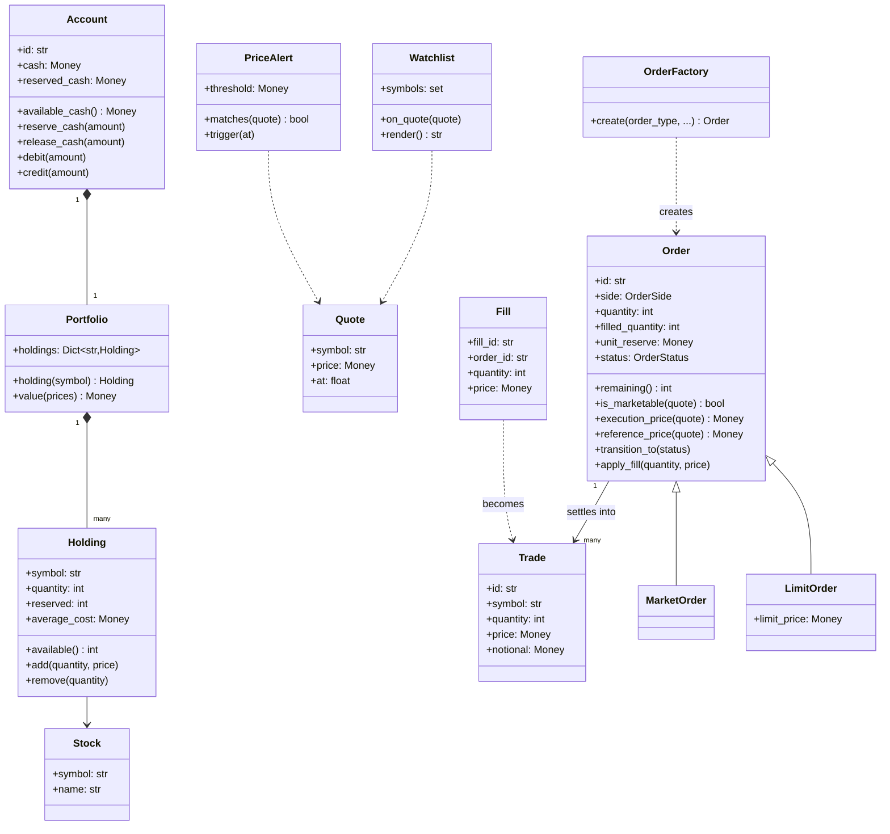
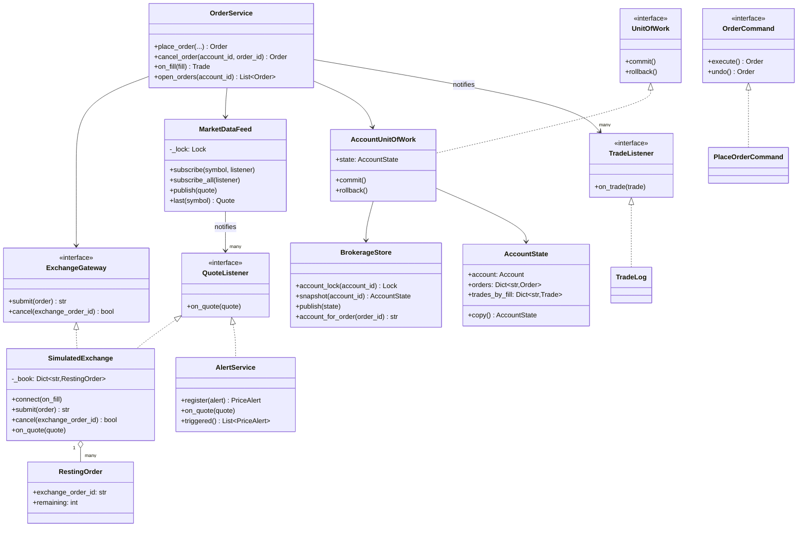
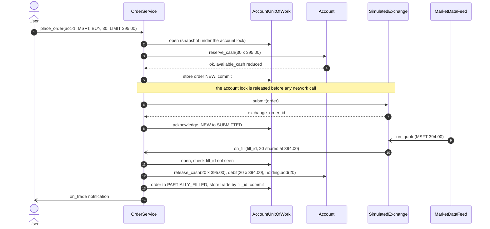
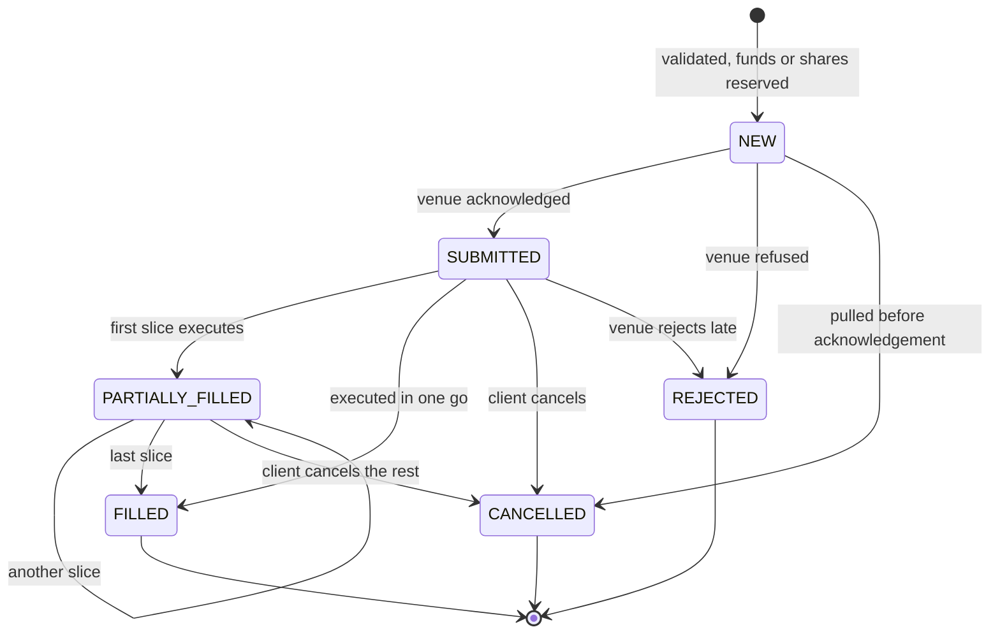

# Design a stock brokerage system

## TL;DR

- You build the broker, not the exchange: accounts with cash and holdings, orders that reserve before they trade, and settlement driven by execution reports from a venue you do not control.
- Three decisions carry the interview: **reserve funds or shares atomically before the order leaves the building**, **settle every fill idempotently on its fill id**, and **never hold the account lock across the call to the exchange**.
- Observer drives the price feed into resting limit orders and alerts; the order lifecycle is an explicit transition table; Unit of Work makes cash, holding, order and trade commit together.

## Problem statement

"Design the backend of a retail brokerage. Users have an account with cash and a portfolio, keep watchlists, and place market and limit orders to buy and sell. Orders are validated against available funds and holdings, sent to an exchange, and may come back filled, partially filled or not at all. Trades update cash and holdings; users see order history and get price alerts. Focus on the classes, the order lifecycle, and what happens when the exchange sends the same execution report twice."

## Requirements

**Functional**

- Accounts holding cash and a `Portfolio` of `Holding` rows (quantity plus average cost).
- A market data feed of quotes; watchlists that follow it; price alerts that fire once when a threshold is crossed.
- Market and limit orders, buy and sell, validated against *available* cash and *available* shares.
- An order lifecycle: new, submitted, partially filled, filled, cancelled, rejected — with only legal transitions allowed.
- Fills arrive from the exchange as execution reports; each one becomes a `Trade` that updates cash and holdings.
- Cancel an open order and get the unused reservation back.
- Order and trade history per account.

**Non-functional and constraints**

- Money is `common.Money` (integer cents). `Decimal` would also be defensible; a float is not.
- Reserving funds must be atomic: 20 concurrent orders against a balance that covers five must accept exactly five.
- Execution reports are at-least-once. Settlement must be effectively-once: the same fill id may arrive many times and must move the account once.
- No network call happens while an account lock is held.
- In-memory, single process; the exchange is behind a `Protocol` so a real venue drops in.

**Out of scope**: the matching engine itself (that is [the exchange](../../hld/case-studies/stock-exchange.md)), margin and leverage, options, tax lots, market hours and halts, regulatory reporting.

## Clarifying questions and assumptions

| Question to ask | Assumption taken here |
|---|---|
| Are we the broker or the exchange? | The broker. We reserve, submit, and settle what comes back. The venue is a `Protocol` with `submit` and `cancel`. |
| Do market orders reserve cash, and at what price? | Yes, at the last print plus 5% headroom, because the price moves between reservation and fill. A limit order reserves exactly `limit x quantity`. |
| Can an order fill in pieces? | Yes. Each slice releases its share of the reservation; the remainder is released when the order reaches a terminal state. |
| Can the exchange send the same fill twice? | Assume yes. `Fill.fill_id` is the idempotency key and the account stores the trade it produced. |
| What if a fill arrives after we cancelled? | It is refused. A production broker treats the venue as the authority and reconciles; say so, then show the guard. |
| Decimal or integer cents? | Integer cents. Share counts are ints, prices are cents, and `price * quantity` is exact — no quantisation rules to argue about. |
| Do we simulate the whole book? | No. `SimulatedExchange` rests orders and fills them when a tick makes them marketable, with a knob for partial fills. |

## Core entities and relationships

- **Account** — cash, `reserved_cash` and a `Portfolio`. `available_cash()` is `cash - reserved_cash`, and it is the only number order validation looks at.
- **Portfolio** and **Holding** — quantity, `reserved` (claimed by open sell orders) and weighted `average_cost`. `available()` mirrors `available_cash()`.
- **Order** (base) with **MarketOrder** and **LimitOrder**, built by **OrderFactory**. The subclasses answer exactly three questions: *would you trade at this price*, *at what price*, and *what price sizes the reservation*.
- **OrderStatus** plus the `ORDER_TRANSITIONS` table — the state machine, enforced by `Order.transition_to`.
- **Quote**, **Fill**, **Trade** — all frozen. `Fill` is what the venue says happened; `Trade` is what the account actually booked.
- **MarketDataFeed** — the subject. **SimulatedExchange**, **AlertService** and **Watchlist** are its observers; `RestingOrder` is the venue's own copy of a working order.
- **BrokerageStore** holds one `AccountState` and one lock per account; **AccountUnitOfWork** is the transaction boundary; **OrderService** is the facade and the only writer.

Multiplicities: account `1 -> 1` portfolio, portfolio `1 -> *` holdings, account `1 -> *` orders, order `1 -> *` trades, feed `1 -> *` listeners.

## Class diagram

**The domain: an account, its holdings, and the two kinds of order.**



**The services: the feed and its observers, the venue, and the transaction boundary.**



## Design patterns applied

| Pattern | Where | Why it earns its place |
|---|---|---|
| Observer | `MarketDataFeed` -> `SimulatedExchange`, `AlertService`, `Watchlist` | One tick drives three unrelated reactions. Adding trailing stops or a chart service is a new listener, and the feed never learns their names. |
| State (transition table) | `OrderStatus` + `ORDER_TRANSITIONS` + `Order.transition_to` | Six states, one table, every illegal move rejected in one place. Six State classes would be ceremony; say that and show the parametrized test. |
| Template Method / polymorphism | `Order.is_marketable`, `execution_price`, `reference_price` | The service never asks "is this a limit order?". Adding stop-loss is a third subclass and one registry branch. |
| Factory Method | `OrderFactory.create` | Turns `("limit", 395.00)` from the API into the right class, and rejects a market order carrying a limit price. |
| Unit of Work | `AccountUnitOfWork` | A settled fill touches cash, reservation, holding, order status and the trade row. All five commit together or none do. |
| Adapter behind a Protocol | `ExchangeGateway` / `SimulatedExchange` | The venue is someone else's system. Tests inject a simulator with a partial-fill knob; production injects FIX or REST. |
| Command | `PlaceOrderCommand` | Placement and cancellation are one request-object pair, which is what an order-entry queue or a "cancel my last order" button needs. |
| Facade | `OrderService` | The app calls four methods. Reservation, transaction, venue and notification are all behind them. |

What was deliberately *not* used: a **Singleton** feed or store. Both are created in `main` and injected, so tests build a dozen independent brokerages. Also no **Memento** for order history — the trade rows already are the history, and duplicating them into snapshots would create two truths.

## Key flows

**A limit buy from reservation to settlement. Note where the account lock is not held.**



**Order lifecycle.** The transition table is the code; this diagram is the picture of it.



## Implementation

Write the vocabulary first, then the account, then the order hierarchy, then the feed, and only then the service that ties them together.

The enums include the transition table. Putting it next to `OrderStatus` is deliberate: the legal moves are part of the vocabulary, not scattered through the service.

```python title="code/lld/stock_brokerage/models.py — enums and transitions"
--8<-- "code/lld/stock_brokerage/models.py:enums"
```

```python title="code/lld/stock_brokerage/models.py — errors"
--8<-- "code/lld/stock_brokerage/models.py:errors"
```

`Quote`, `Fill` and `Trade` are frozen. `Fill` is the venue's claim; `Trade` is what your ledger booked. Keeping them as separate types is what makes the idempotency check obvious later.

```python title="code/lld/stock_brokerage/models.py — market values"
--8<-- "code/lld/stock_brokerage/models.py:market_values"
```

The account is where "available" is defined. Every validation in the system reduces to `available_cash()` or `Holding.available()`, which is why a reservation is enough to make concurrent orders safe.

```python title="code/lld/stock_brokerage/models.py — account and portfolio"
--8<-- "code/lld/stock_brokerage/models.py:account"
```

Watchlists and alerts are listeners with three lines of logic each — the whole point of Observer is that they cost this little.

```python title="code/lld/stock_brokerage/models.py — watchlist and alerts"
--8<-- "code/lld/stock_brokerage/models.py:watch"
```

The order hierarchy carries `unit_reserve`, the cash held per share. Releasing a partial fill is then a multiplication, never a division, so no cent is ever stranded.

```python title="code/lld/stock_brokerage/orders.py"
--8<-- "code/lld/stock_brokerage/orders.py:orders"
```

The feed fans out under a lock it does not hold while calling listeners; the venue keeps its own `remaining` counter because the broker replaces its `Order` object on every commit.

```python title="code/lld/stock_brokerage/market.py — feed"
--8<-- "code/lld/stock_brokerage/market.py:feed"
```

```python title="code/lld/stock_brokerage/market.py — exchange gateway"
--8<-- "code/lld/stock_brokerage/market.py:exchange"
```

The store hands out snapshots and takes back whole states; the Unit of Work is the five-things-at-once boundary.

```python title="code/lld/stock_brokerage/store.py — unit of work"
--8<-- "code/lld/stock_brokerage/store.py:uow"
```

`place_order` and `on_fill` are the two methods to write on the whiteboard. Read the docstrings: the lock is released before the venue call, and the fill id short-circuits a redelivery before anything moves.

```python title="code/lld/stock_brokerage/services.py — order service"
--8<-- "code/lld/stock_brokerage/services.py:service"
```

The demo runs a full session: a market buy, a limit buy that fills in two slices, a redelivered report, a sell that trips an alert, and a cancellation.

```python title="code/lld/stock_brokerage/demo.py"
--8<-- "code/lld/stock_brokerage/demo.py"
```

Running `python -m lld.stock_brokerage.demo` prints:

```text
O-1 market BUY 20 AAPL -> submitted, reserved 3885.00 USD
filled at 186.50 USD, cash 46270.00 USD, reserved 0.00 USD
O-3 limit BUY 30 MSFT at 395.00 -> submitted, reserved 11850.00 USD
tick 398.00: still submitted, 0 shares
tick 394.00: partially_filled 20/30, cash 38390.00 USD
duplicate report F-4 replayed: cash still 38390.00 USD
tick 393.00: filled at average 393.67 USD, cash 34460.00 USD
O-6 limit SELL 10 AAPL at 190.00 -> filled at 191.00
alerts fired: ['al-1']
O-8 rests off-market, reserving 750.00 USD
cancelled: reserved back to 0.00 USD, cash 36370.00 USD
portfolio 13700.00 USD across 4 trades
watchlist: AAPL 191.00 USD, MSFT 393.00 USD
```

Trace the reservation: 20 shares at the last print of 185.00 plus 5% is `194.25 x 20 = 3885.00`; the fill at 186.50 costs `3730.00`, and the difference goes straight back to available cash.

## Concurrency and edge cases

**Which lock protects what.**

1. `BrokerageStore.account_lock(account_id)` guards cash, reservations, holdings, order status and the trade index of *one* account. Two accounts trading the same symbol never contend, which is the granularity you want: contention follows users, not symbols.
2. `BrokerageStore._registry_lock` guards the account, symbol and order-to-account dictionaries, and is held for a lookup only.
3. `MarketDataFeed._lock` guards the subscription map, and `SimulatedExchange._lock` guards the book. Both are released before any callback fires.

**Lock ordering.** The only nesting is account lock then registry lock, always in that direction, and nothing else nests. That is why there is no deadlock to reason about: locks are leaves or a single two-level chain.

**Why the venue call is outside the lock.** An uncontended mutex costs about 17 ns and a same-datacenter round trip about 500 µs (see the [latency cheatsheet](../../cheatsheets/latency-and-estimation.md)); the network call is roughly `500 000 / 17`, near 30 000 times more expensive. Holding an account lock across it would serialise a user's entire session behind one slow venue. The price you pay is that a fill can arrive before the acknowledgement commits, so `_acknowledge` only moves `NEW -> SUBMITTED` if the order is still `NEW`.

**Idempotent settlement.** `AccountState.trades_by_fill` maps fill id to the trade it produced. `on_fill` checks it first, inside the transaction, and returns the stored trade on a repeat. That is effectively-once delivery in three lines: at-least-once transport plus an idempotent consumer.

**Partial fills.** Every slice releases `unit_reserve x slice_quantity` and debits the actual traded notional. When the order reaches a terminal state, `_release_remainder` gives back what the unfilled part was still holding. The arithmetic is exact because `unit_reserve` is a per-share `Money` and quantities are ints.

!!! warning "Common mistake"
    Checking the balance and then debiting it at fill time, with nothing in between. Two orders both pass the check, both get sent, and both come back filled — and now the account is overdrawn by a real amount of real money. Reserve at placement, release on settlement or cancellation, and validate against `available_cash()`, never `cash`.

**Other edge cases handled**: a market order carrying a limit price (rejected by the factory); a sell of shares an open sell order has already claimed; a fill larger than the remaining quantity; cancelling a filled or already cancelled order; a fill arriving after a cancel (refused, with a note that the venue is really the authority); an alert that would fire on every tick above its threshold (it fires once); an order for an unlisted symbol or one with no price yet.

## Extensibility and follow-ups

- **Stop and stop-limit orders**: a third `Order` subclass whose `is_marketable` compares against a trigger, plus one branch in `OrderFactory`. Nothing in `OrderService` changes — name that seam when asked.
- **Time in force (day, good-till-cancelled, immediate-or-cancel)**: a policy object consulted by the venue adapter at the end of each session; IOC becomes "cancel the remainder after the first slice".
- **A real venue**: implement `ExchangeGateway` over FIX or a REST API and turn `on_fill` into a webhook handler. The idempotency key is already the venue's execution id, so redelivery is free.
- **Margin**: `available_cash()` becomes `cash + buying_power - reserved`, computed by a `MarginPolicy`. The reservation machinery does not change, which is the point of having it in one method.
- **The matching engine**: when the interviewer asks "now build the exchange", you are into [Design a stock exchange](../../hld/case-studies/stock-exchange.md) — price-time priority, sequenced order books, deterministic replay.
- **Audit and compliance**: trades already carry account, order, price and time. Add an append-only event stream fed by `TradeListener`, and reconstruct any account by replay.

!!! tip "Interview tip"
    Say "reserve, submit, settle, release" out loud before you write any code, and draw the four boxes. Interviewers grade this problem mostly on whether reservations exist at all; candidates who only debit on fill lose the round in the first ten minutes regardless of how good the class diagram is.

## Tests

`tests/test_stock_brokerage.py` has 13 cases. The three to walk an interviewer through are partial fills, the duplicate execution report, and the concurrency test that proves reservations are atomic:

```python title="code/lld/stock_brokerage/tests/test_stock_brokerage.py — partial fills"
--8<-- "code/lld/stock_brokerage/tests/test_stock_brokerage.py:partial"
```

```python title="code/lld/stock_brokerage/tests/test_stock_brokerage.py — idempotent settlement"
--8<-- "code/lld/stock_brokerage/tests/test_stock_brokerage.py:idempotent"
```

```python title="code/lld/stock_brokerage/tests/test_stock_brokerage.py — concurrency"
--8<-- "code/lld/stock_brokerage/tests/test_stock_brokerage.py:concurrency"
```

The rest cover: a market buy reserving with headroom and settling at the traded price; orders beyond the available balance or holding never reaching the venue; a limit order resting through a non-crossing tick and then filling at the better price; the transition table refusing four illegal moves via `parametrize`; a fill delivered after a cancel; alerts firing once while the watchlist keeps following the feed; and `PlaceOrderCommand` undoing itself. Run them with `uv run pytest code/lld/stock_brokerage -q`.

## 45-minute pacing

| Minutes | What to do | What to say or write |
|---|---|---|
| 0-5 | Clarify | Broker or exchange? Order types? Partial fills? Duplicate execution reports? Out of scope: matching engine, margin, options. |
| 5-10 | Entities | Account, Portfolio, Holding, Order, Fill, Trade, Quote. Say "available cash equals cash minus reserved" while drawing the account. |
| 10-16 | Lifecycle | Draw the six-state diagram and the transition table before any other code. It anchors the rest of the discussion. |
| 16-32 | Code | `Account.reserve_cash`, the `Order` subclasses, `place_order` (reserve, commit, submit, acknowledge), then `on_fill` with the fill-id check. |
| 32-39 | Concurrency | The per-account lock, why the venue call sits outside it, and the 20-orders-five-succeed test. |
| 39-45 | Extensions | Stop orders as a subclass, time in force, a real gateway, and the hand-off to the exchange design. |

## Related

- [Observer](../patterns/observer.md) — the price feed driving limit orders and alerts
- [State](../patterns/state.md) — the order lifecycle, and when a table beats classes
- [Command](../patterns/command.md) — placement and cancellation as request objects
- [Unit of Work](../patterns/unit-of-work.md) — settling five things in one commit
- [Design a stock exchange](../../hld/case-studies/stock-exchange.md) — the venue on the other side of the gateway
- [Concurrency for LLD in Python](../fundamentals/concurrency-for-lld.md) — lock granularity and never locking across I/O
