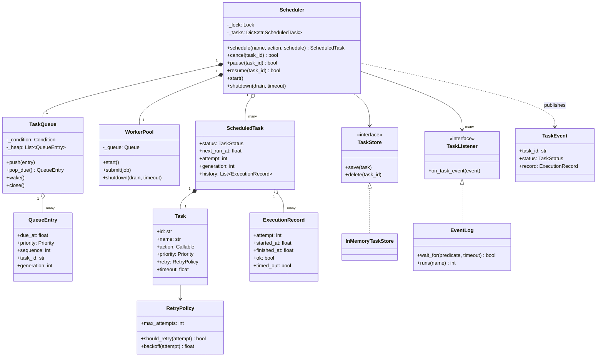
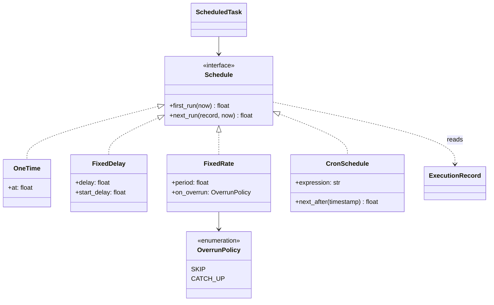
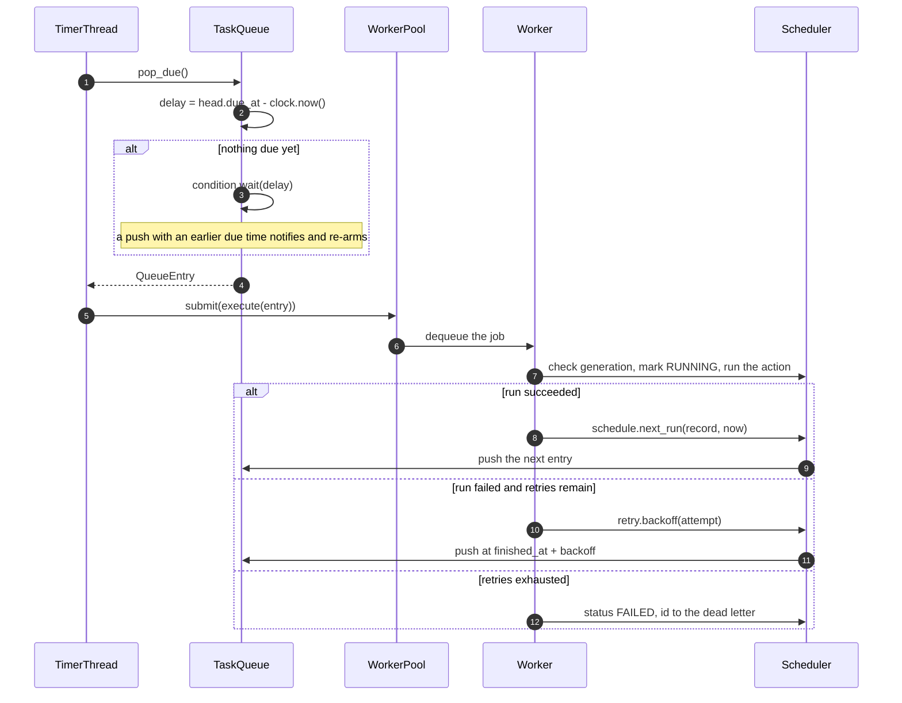
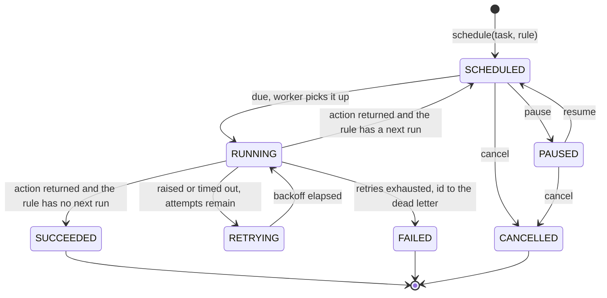

# Design a task scheduler (cron, LLD)

## TL;DR

- You build an in-process scheduler: a min-heap ordered by due time, one timer thread that waits on a `Condition`, and a bounded pool of workers that run the tasks.
- Three decisions carry the interview: **`Condition.wait(timeout)` instead of a poll loop**, so scheduling something sooner wakes the timer immediately; **cancellation tombstones the heap entry** instead of removing it; and **a run that outlasts its own period needs a stated policy**, not silent pile-up.
- Patterns that earn their place: Command (`Task`), Strategy (`Schedule`), Observer (`TaskListener`), Producer-Consumer (heap plus pool), Dependency Injection (`Clock`).

## Problem statement

"Design an in-process task scheduler. Callers register work to run once, at a fixed rate, after a fixed delay, or on a cron expression. Tasks have priorities, can be cancelled, paused and resumed, and are retried with backoff when they fail. Several tasks may be due at the same instant, so there is a pool of worker threads. It must shut down without losing work. Show me the data structure the timer uses, and be precise about what the timer thread does while it has nothing to do."

## Requirements

**Functional**

- Schedules: one-off, fixed rate, fixed delay, and cron to the minute.
- Priorities, used to break a tie between tasks due at the same instant.
- A worker pool, so a slow task does not delay the next due task.
- Cancel, pause and resume for a registered task.
- Retries with exponential backoff and a cap; exhausted tasks go to a dead-letter list.
- Per-task timeouts, and a stated answer for what a timeout can and cannot do in Python.
- Status and per-run history: attempt number, start, finish, outcome, error.
- A persistence interface every status change is written through.
- Graceful shutdown that stops timing first and then drains what is in flight.

**Non-functional and constraints**

- No polling. An idle scheduler must consume no CPU, and the timer must react immediately when work is scheduled earlier than the current head.
- Deterministic and testable: the clock is injected, so a test proves a twelve-hour delay in milliseconds.
- A failing task must never kill its worker thread, and a slow listener must never block the scheduler.

**Out of scope**: distribution and leader election, task dependencies as a DAG, and any form of preemption.

## Clarifying questions and assumptions

| Question to ask | Assumption taken here |
|---|---|
| One process or a cluster? | One. The `TaskStore` protocol is the seam to a shared store, and distribution is the HLD case study. |
| Is fixed rate measured from the start or the finish of a run? | From the start, which is what makes it *rate*. `FixedDelay` measures from the finish, and that is the safer default. |
| What if a run takes longer than its period? | An explicit `OverrunPolicy`: skip to the next slot in the future, or catch up. Never "keep queueing". |
| Can I stop a task that is already running? | No — Python cannot preempt a thread. `cancel` stops future runs; real cancellation is cooperative. |
| Does the cron need seconds, or time zones? | Minutes, in UTC. Both are extensions and neither changes the design. |
| Is a retry a new run or the same run? | The same task, attempt `n + 1`, re-queued at `finished_at + backoff`. The schedule is not consulted. |
| What does the queue do while it waits? | Blocks on a `Condition` with the exact remaining delay. This is the answer they are probing for. |

## Core entities and relationships

- **`Task`** — the Command: an id, a name, the callable, a priority, a retry policy and a timeout. It knows nothing about *when*.
- **`ScheduledTask`** — the task plus its schedule, status, next run, attempt counter, `generation` and history.
- **`Schedule`** (`Protocol`) with **`OneTime`**, **`FixedDelay`**, **`FixedRate`**, **`CronSchedule`** — two questions each: when first, and when again after a given run.
- **`QueueEntry`** — what the heap orders: due time, then priority, then arrival sequence, plus the task id and generation.
- **`TaskQueue`** — the min-heap and the `Condition`.
- **`WorkerPool`** — fixed threads draining a bounded queue.
- **`Scheduler`** — the registry, the timer thread, the pool, the dead-letter list and the lock over all of it.
- **`ExecutionRecord`** — one attempt, kept for history *and* used by the schedule to compute the next run.
- **`TaskStore`** (`Protocol`) with **`InMemoryTaskStore`** — the persistence seam. **`TaskListener`** with **`EventLog`** — the Observer seam, carrying an immutable **`TaskEvent`**.

Multiplicities: scheduler `1 → *` scheduled tasks, scheduled task `1 → 1` task and `1 → 1` schedule, scheduled task `1 → *` execution records, queue `1 → *` entries, scheduler `1 → *` listeners.

## Class diagram

**The machine: registry, heap, pool, and the two seams that hang off it.**



**The schedules: one Protocol, four answers to "when again?".**



## Design patterns applied

| Pattern | Where | Why it earns its place |
|---|---|---|
| Command | `Task` | The work is an object with its own retry policy and timeout, so the queue, the pool and the store move it around without knowing what it does. It is also what makes a history of *attempts* meaningful. |
| Strategy | `Schedule` with four implementations | "Now support cron" is a new class and nothing else. Each schedule answers two questions and holds no state, so one instance is safely shared by many tasks. |
| Producer-Consumer | `TaskQueue` (heap plus `Condition`) feeding `WorkerPool` | The timer produces due tasks, the pool consumes them, and the bounded queue between them is backpressure rather than an unbounded backlog. |
| Observer | `TaskListener`, `EventLog` | Status changes are published to listeners *outside* the scheduler lock, so a slow metrics sink cannot stall the timer. |
| Repository | `TaskStore` | Every transition is written through one interface, so adding durability is one class, not an edit to `_settle`. |
| Dependency Injection | `Clock`, `IdGenerator`, `TaskStore`, listeners | A twelve-hour delay is tested in milliseconds and task ids are `t-1`, `t-2`. |

What was deliberately *not* used: **Singleton** for the scheduler, even though the brief suggests it. One instance built in `main` and injected is strictly better here — the tests build one scheduler per case and shut it down in a fixture, which a module-level singleton makes impossible without a `reset()` back door. Say that out loud. **State classes** per `TaskStatus` are also skipped: seven statuses with guarded transitions in three methods is an enum's job, and a class per status would be ceremony around two `if` statements.

## Key flows

**One tick: the timer waits exactly as long as it must, then hands work to a pool.**



**The lifecycle. `RETRYING` is a separate state from `SCHEDULED` on purpose: a retry keeps the attempt counter, a normal reschedule resets it.**



## Implementation

Write the vocabulary first, then the schedules, then the queue — because the queue is what the interview is really about — and only then the scheduler that ties them together.

Seven statuses, three priorities that sort correctly by being an `IntEnum`, and an overrun policy that forces the awkward question to be answered at configuration time:

```python title="code/lld/task_scheduler/models.py — statuses, priorities and errors"
--8<-- "code/lld/task_scheduler/models.py:enums"
```

`Task` is the Command and `RetryPolicy` is frozen so one policy can be shared by every task that wants it. `ExecutionRecord` is not only history: the schedule reads it to work out the next run.

```python title="code/lld/task_scheduler/models.py — the command and its record"
--8<-- "code/lld/task_scheduler/models.py:task"
```

`ScheduledTask` carries the running state, and `QueueEntry` is what the heap actually orders. The `sequence` field is the detail worth pointing at: without it, two entries that tie on time and priority would fall back to comparing task ids.

```python title="code/lld/task_scheduler/models.py — running state and the heap entry"
--8<-- "code/lld/task_scheduler/models.py:scheduled"
```

The three simple schedules fit on one screen, and the difference between fixed rate and fixed delay — start versus finish — is one attribute access:

```python title="code/lld/task_scheduler/schedules.py — the Schedule protocol and three rules"
--8<-- "code/lld/task_scheduler/schedules.py:protocol"
```

Cron is where candidates lose time. Parse into five sets of allowed values, then walk forward from the next minute, skipping a whole day the moment the date fields do not match:

```python title="code/lld/task_scheduler/schedules.py — cron"
--8<-- "code/lld/task_scheduler/schedules.py:cron"
```

Now the heart of it. `pop_due` is twenty lines and it is what the interviewer is grading:

```python title="code/lld/task_scheduler/queues.py — the heap and the Condition"
--8<-- "code/lld/task_scheduler/queues.py:queue"
```

The pool is the consumer half. Note the bounded queue and the sentinel-per-worker shutdown:

```python title="code/lld/task_scheduler/queues.py — the worker pool"
--8<-- "code/lld/task_scheduler/queues.py:pool"
```

The scheduler is then bookkeeping: one lock over the registry, and the three paths a finished run can take.

```python title="code/lld/task_scheduler/services.py — the scheduler"
--8<-- "code/lld/task_scheduler/services.py:scheduler"
```

Running `python -m lld.task_scheduler.demo` shows the cron arithmetic, a recurring task, a retry sequence, the early wake-up, pause and resume, and shutdown:

```text
cron '*/15 * * * *' from 09:07 UTC fires at 09:15, 09:30, 09:45
fixed rate 60 s after a run of 150 s: skip -> t+180 s, catch-up -> t+60 s
heartbeat every 30 s: 3 runs in the first minute
import: succeeded on attempt 3 after retries at +1 s and +2 s
cleanup: failed after 2 attempts, last error 'RuntimeError: disk is full'
dead letter: ['task-3']
timer parked 12 h out, then an insertion due now: urgent-alert ran without a nudge = True
digest paused through its slot: 0 runs, status paused
digest resumed: 1 run, next due in 3600 s
cancelled digest and heartbeat: heap still holds 3 tombstoned entries
shutdown: 6 tasks registered, 2 succeeded, 1 dead
```

## Concurrency and edge cases

**Which lock protects what.** Two, and they are acquired in one direction only.

1. `TaskQueue._condition` guards the heap and the closed flag. It is a `Condition` rather than a `Lock` because the timer has to *wait for a time that can change*: `wait(delay)` parks with no CPU cost, and `push` notifies, so a task scheduled sooner than the current head re-arms the timer instead of leaving it asleep until the old deadline.
2. `Scheduler._lock` guards the task registry and every mutable field on a task: status, attempt, generation, next run and history. The race it prevents is two workers settling the same task at once and both re-queueing it.

The order is always `Scheduler._lock` then the queue's condition — `_enqueue` holds the registry lock and calls `push`, which never blocks. The timer thread does the reverse in *time* but never holds both, so there is no cycle to deadlock on.

**Why not poll.** The obvious first answer is a loop that sleeps a second and scans for due tasks. It costs 86,400 scans a day per scheduler, it adds up to a second of latency to every task, and it still gets the interesting case wrong: a task scheduled to run now while the loop is mid-sleep waits anyway. `Condition.wait(delay)` is both cheaper and more accurate, and an uncontended acquire around it costs about 17 ns.

**Cancelling a queued entry.** Removing an arbitrary element from a binary heap is O(n) plus a re-heapify, so you do not: `cancel`, `pause` and every re-queue bump the task's `generation`, and a popped entry whose generation no longer matches the task is dropped. The heap therefore holds tombstones — the demo ends with three of them — which is the accepted trade. If tombstones ever outgrew live entries you would rebuild the heap during a quiet tick, exactly as a log-structured store compacts.

**Cancelling a running task.** You cannot. Python has no safe way to stop a thread from outside, so `cancel` marks the task and `_settle` refuses to reschedule it; the in-flight run finishes. Timeouts are the same story: the record is marked `timed_out` after the fact, and the honest answer for real enforcement is cooperative cancellation — hand the task an `Event` it checks — or a subprocess you can actually kill. Say this rather than pretending a decorator can interrupt a thread.

**Shutdown order.** Stop timing first (`queue.close()` wakes the timer and it returns), then drain the pool. Doing it the other way round lets the timer submit into a closed pool. `drain=False` discards what is queued but still lets in-flight runs finish, because there is no way to stop them.

**Edge cases handled**: a failing task never kills its worker, because `_run_once` catches every exception and turns it into a record; a task whose schedule returns `None` retires instead of spinning; the attempt counter resets after a success so a recurring task retries afresh next time; `resume` runs a task that slept through its slot rather than waiting a full period; scheduling after shutdown raises instead of silently never running; `shutdown` is idempotent so a `finally` block can call it; and a cron expression is validated at construction, not on the first tick at 03:00.

!!! warning "Common mistake"
    Calling `notify()` on a push and thinking it is enough. It wakes *one* waiter — fine with a single timer thread, and quietly wrong the moment you add a second one or a shutdown waiter, because the notification can go to the thread that does not care. Use `notify_all` unless you can name every waiter, and always re-test the predicate in a `while` loop after waking: `wait` can return because of a notification, a timeout, or neither.

## Extensibility and follow-ups

- **Task dependencies (DAGs)**: give `Task` a set of upstream ids and hold a task in a `BLOCKED` state until each has a successful record. The queue does not change; a readiness check before `submit` does. That is the shape Airflow grew from.
- **Misfire policies**: a scheduler that was down for an hour has to decide whether to run what it missed. `OverrunPolicy` is the same question for one task; a misfire policy is it for the whole process at startup, and both belong on the schedule, not in the loop.
- **Persistence and recovery**: `TaskStore.load_all` already exists as the seam. Recovery means rebuilding the heap from stored `next_run_at` values and deciding, per task, what to do about slots that passed while you were down.
- **Distribution**: many schedulers, one set of jobs. That needs leases with fencing tokens (so a paused process cannot run a job someone else already took) or partitioned schedulers, plus idempotent tasks, because a lease can expire mid-run. It is the HLD case study.
- **A time wheel instead of a heap**: at hundreds of thousands of timers, a hierarchical timing wheel gives O(1) insertion against the heap's O(log n) — about 17 comparisons per push at 100k entries. It is the right answer for a network stack and the wrong one for a job scheduler, where the entry count is small and the arithmetic is not the bottleneck.
- **Cron extensions**: seconds, time zones and `@daily` aliases are all parsing changes inside `CronSchedule`. Time zones are the one that is genuinely hard, because a daily job at 02:30 does not exist on one day of the year and happens twice on another.

!!! tip "Interview tip"
    When you draw the queue, say the sentence "the timer waits on a condition with a timeout equal to the delay until the head is due" before you write a line. Then follow it with "and `push` notifies, so scheduling something sooner wakes it early." Most candidates write a poll loop and get corrected; saying the mechanism first tells the interviewer you have built one.

## Tests

`tests/test_task_scheduler.py` has 24 cases. Two carry the design: the wake-up test and the fifty-tasks test.

```python title="code/lld/task_scheduler/tests/test_task_scheduler.py — the early wake-up"
--8<-- "code/lld/task_scheduler/tests/test_task_scheduler.py:wakeup"
```

It proves the mechanism rather than the behaviour: nothing advances the clock, so the only thing that can have released the timer from a twelve-hour wait is the notify inside `push`. The negative assertion uses a 50 ms bounded wait, which is how you test that something does *not* happen without sleeping.

```python title="code/lld/task_scheduler/tests/test_task_scheduler.py — fifty tasks, four workers"
--8<-- "code/lld/task_scheduler/tests/test_task_scheduler.py:concurrency"
```

Every test waits on `EventLog.wait_for`, which is a `Condition.wait_for` under the hood — the worker notifies and the test wakes, so the suite finishes in a fraction of a second and never sleeps for a fixed interval.

The rest cover: a one-off task retiring; both overrun policies; fixed delay measured from the finish; five cron expressions including a weekday range and a month rollover; five malformed cron expressions; retry backoff of 1 s then 2 s ending in success; retries exhausted reaching the dead letter with the store recording the transition; cancel tombstoning a queued entry; pause holding a slot and resume running it; priority breaking a tie between three tasks due together; a task over its budget recorded as timed out; shutdown being final and idempotent; and the worker pool draining then refusing new work. Run them with `uv run pytest code/lld/task_scheduler -q`.

## 45-minute pacing

| Minutes | What to do | What to say or write |
|---|---|---|
| 0–5 | Clarify | One process or many? Rate or delay? What happens when a run overruns? Can a running task be cancelled? |
| 5–10 | Entities | `Task`, `Schedule`, `ScheduledTask`, `QueueEntry` on the board. Name the split: the task is *what*, the schedule is *when*. |
| 10–14 | The data structure | Min-heap keyed on due time, priority, sequence. Say why the sequence field exists before anyone asks. |
| 14–24 | The timer loop | Write `pop_due`. Say "wait with a timeout, push notifies" while writing it, then the worker pool behind it. |
| 24–32 | Lifecycle | Statuses, retry with backoff, dead letter, and the reschedule path for a recurring task. |
| 32–38 | Cancellation and shutdown | Tombstones with a generation counter, why you cannot stop a running thread, shutdown order. |
| 38–45 | Extensions | Cron parsing sketch, misfire policies, DAG dependencies, and the hand-off to a distributed scheduler with leases. |

## Related

- [Design a distributed job scheduler](../../hld/case-studies/job-scheduler.md) — the same problem once one process is not enough
- [Command](../patterns/command.md) — the pattern behind `Task`
- [Strategy](../patterns/strategy.md) — the four schedule rules behind one Protocol
- [Observer](../patterns/observer.md) — publishing status changes outside the lock
- [Repository](../patterns/repository.md) — the shape of the `TaskStore` seam
- [Concurrency for LLD in Python](../fundamentals/concurrency-for-lld.md) — `Condition`, producer-consumer and the wait-in-a-while-loop rule
- Primary sources: Varghese and Lauck, "Hashed and Hierarchical Timing Wheels" (SOSP 1987); the POSIX `crontab(5)` specification
