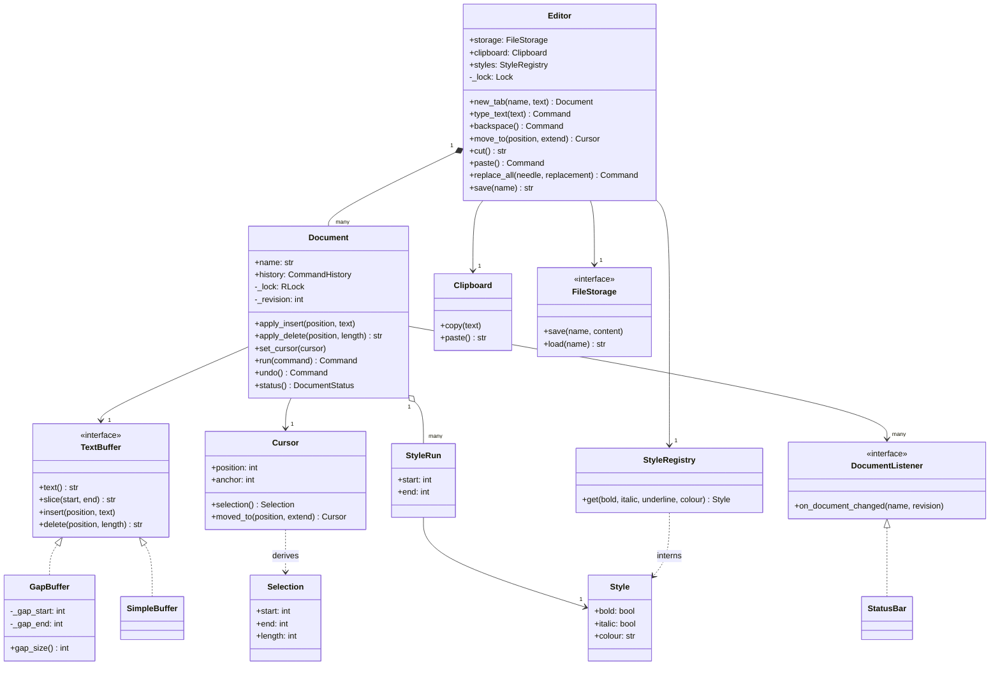
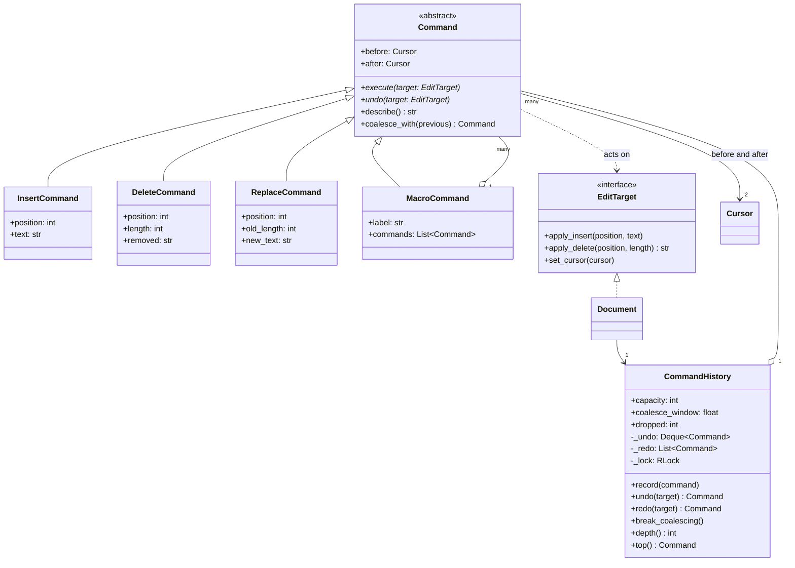
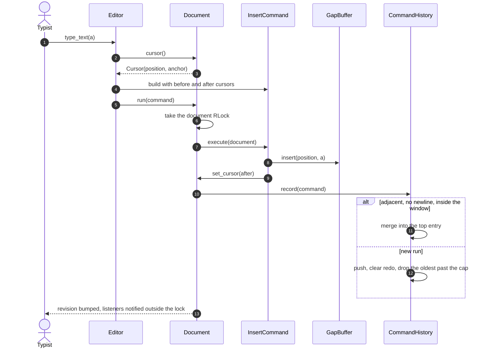
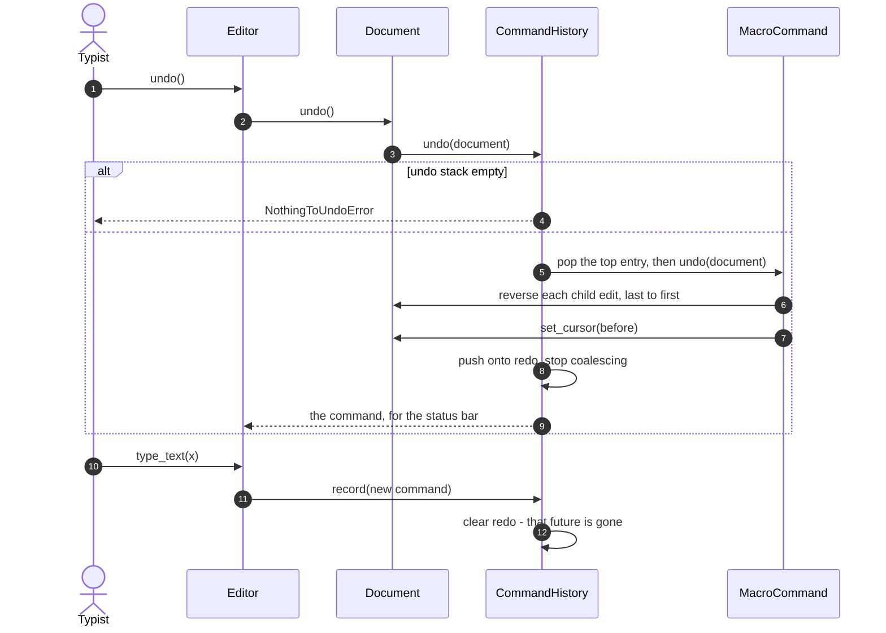
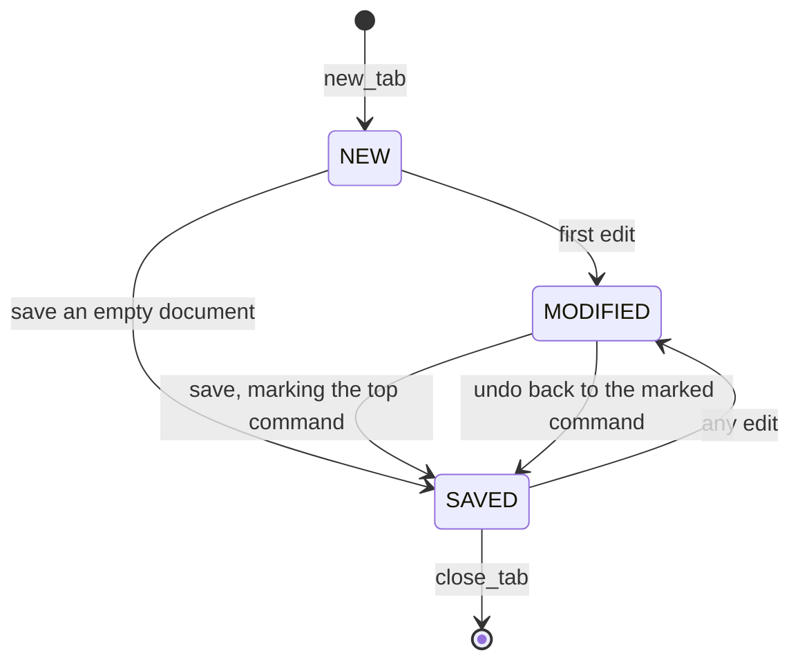

# Design a text editor with undo and redo

## TL;DR

- You build a `Document` (buffer + caret + history under one lock) and an `Editor` facade where every mutation becomes exactly one `Command` object that knows how to apply itself and how to take itself back.
- Three decisions carry the interview: **the caret is part of the command** (undo restores the selection, not just the characters), **consecutive keystrokes coalesce** into one undo entry while they stay adjacent and inside a time window, and **a new command clears the redo stack**.
- Patterns that earn their place: Command, Composite (macros — which is why there is no `PasteCommand`), Strategy (the buffer), Flyweight (styles), Observer (views). Memento is discussed and deliberately not used.

## Problem statement

"Design the core of a text editor. It holds one or more open documents; the user types, deletes, moves the caret, selects ranges, and cuts, copies and pastes. Undo and redo must work the way people expect: a burst of typing is one undo, the caret goes back where it was, and redo disappears the moment you type something new. Find-and-replace should be undoable in one step. Say what data structure is under the text, and keep the history from growing without bound."

## Requirements

**Functional**

- Multiple open documents (tabs), each with its own buffer, caret and history.
- Insert and delete at the caret; caret movement; selection with an anchor.
- Copy, cut and paste through a clipboard.
- Undo and redo with a bounded history; a new command invalidates redo.
- Consecutive keystrokes coalesce into one undo entry; a pause or a caret move ends the run.
- Find (including overlapping matches) and replace-all as a single undoable step.
- Formatting runs over ranges that shift when text is inserted before them.
- Save and load through a storage interface; word count; a modified/saved indicator.

**Non-functional and constraints**

- Undo restores the caret and the selection exactly, not only the text.
- The buffer and the history can never disagree — an edit and its history entry are one atomic step.
- The undo stack is capped; the oldest entries are dropped, never the newest.
- In-memory, single process, standard library only. Time is injected, so the coalescing window is testable without sleeping.

**Out of scope**: rendering, syntax highlighting, real-time collaboration (that is [Design Google Docs](../../hld/case-studies/collaborative-editor.md)), regular-expression search, and encodings beyond Python `str`.

## Clarifying questions and assumptions

| Question to ask | Assumption taken here |
|---|---|
| Command or Memento for undo? | Command. A Memento snapshots the whole document per edit, which is O(document) memory per keystroke; a command stores only the delta and the two caret states. |
| Is a burst of typing one undo or twenty? | One, while the inserts stay adjacent, contain no newline, arrive within the coalescing window and stay under a length cap. Every one of those four conditions is a real editor behaviour. |
| Does undo restore the selection? | Yes. Each command carries `before` and `after` cursors; undo applies `before`. This is the detail that separates a toy from a design. |
| What happens to redo after a new edit? | It is cleared. The branch you undid is gone — no undo tree, and say that you know the alternative exists. |
| Gap buffer, piece table or a plain string? | A gap buffer by default, behind a `TextBuffer` protocol, with a plain-string implementation kept as the honest baseline. |
| Is the history per document or per editor? | Per document. Undo in one tab must not touch another. |
| Where does paste live? | Paste is not a command class — it is a macro of delete-selection plus insert. |

## Core entities and relationships

- **Editor** — the facade a keyboard talks to. It owns the tab registry, the clipboard, the style registry and storage, and it turns each keystroke into exactly one `Command`.
- **Document** — one tab: a `TextBuffer`, a `Cursor`, style runs, listeners and its own `CommandHistory`. It implements the narrow `EditTarget` protocol that commands are allowed to call.
- **TextBuffer** (protocol) — `GapBuffer` (default) and `SimpleBuffer` (a plain string). The commands never know which one they are editing.
- **Cursor** and **Selection** — frozen value objects. `Cursor(position, anchor)`; a selection exists when the anchor differs from the position.
- **Command** (abstract) — `InsertCommand`, `DeleteCommand`, `ReplaceCommand`, `MacroCommand`. Each stores its delta plus `before` and `after` cursors.
- **CommandHistory** — the undo deque and the redo list, plus the coalescing window and the cap. It shares the document's lock.
- **Clipboard** — one per process, injected; **StyleRegistry** — the Flyweight factory; **Style** / **StyleRun** — shared intrinsic state and per-range extrinsic state.
- **FileStorage** (protocol) — `InMemoryStorage` here; **DocumentListener** — `StatusBar`, an observer of revisions.

Multiplicities: editor `1 → *` documents, document `1 → 1` buffer, document `1 → 1` history, history `1 → *` commands, macro `1 → *` commands.

## Class diagram

**Structure: a tab and everything hanging off it.**



**Behaviour: the command layer, which depends on nothing but a three-method protocol.**



## Design patterns applied

| Pattern | Where | Why it earns its place |
|---|---|---|
| Command | `InsertCommand`, `DeleteCommand`, `ReplaceCommand` | Undo becomes a method on the object that did the work, not a giant `if` on an operation code. Adding "indent block" is one class, and it gets undo for free. |
| Composite | `MacroCommand` | Paste, type-over-a-selection and replace-all are all "several edits, one undo step". Because a macro *is* a command, it nests and needs no special case in the history. |
| Strategy | `TextBuffer` with `GapBuffer` / `SimpleBuffer` | The data structure under the text is the question the interviewer wants discussed. Behind a four-method protocol you can answer it without rewriting anything else. |
| Flyweight | `Style` + `StyleRegistry` | A million bold characters share one `Style` object; the per-range cost is a `StyleRun` of three fields. The registry interns by value so identity comparison works. |
| Observer | `DocumentListener` → `StatusBar` | Views redraw when the revision changes and the document knows nothing about views. Notification happens outside the lock so a slow view never blocks typing. |
| Facade | `Editor` | Keystrokes should not construct command objects. The editor turns intent ("backspace") into the right command with the right caret states. |
| Singleton (offered) | `Clipboard.instance()` | The clipboard genuinely is machine-wide, but the constructor stays public: tests build their own, and two editors in one process can share one by injection. |
| Dependency Injection | `Clock`, `FileStorage`, `buffer_factory` | `FakeClock` makes the coalescing window a deterministic assertion instead of a `sleep(1.1)`. |

Deliberately **not** used: **Memento**. It is the pattern people reach for first, and it is the wrong trade here — a snapshot per keystroke costs O(document) memory and O(document) time, where a command costs O(edit). Memento earns its place when an operation is not invertible (a filter over a whole buffer, a re-flow); the right answer in a real editor is a hybrid, a command log with periodic snapshots. Say that, and you have said something the other candidates have not. Also not used: an undo *tree*. Redo is a stack and a new edit discards the branch, which is what every mainstream editor does.

## Key flows

**One keystroke: build the command, execute and record atomically, maybe merge.**



**Undo and redo: the two stacks, and the caret coming back with the text.**



**Document status.** The saved marker stores the *command object* on top of the undo stack, which is why undoing back to where you saved shows `SAVED` again. Storing a depth instead is the trap: save, undo once, then type something new, and the stack is back to the same depth holding entirely different work — a counter reports `SAVED` over unsaved changes, and the user closes the tab.



## Implementation

Start with the value objects, because the caret being a *value* is what makes undo restore a selection.

```python title="code/lld/text_editor/models.py — statuses"
--8<-- "code/lld/text_editor/models.py:enums"
```

```python title="code/lld/text_editor/models.py — the caret"
--8<-- "code/lld/text_editor/models.py:cursor"
```

The buffer is a Strategy behind four methods. Write the plain-string version first and say what it costs, then write the gap buffer and say when the cost matters.

```python title="code/lld/text_editor/buffers.py — the honest baseline"
--8<-- "code/lld/text_editor/buffers.py:simple"
```

```python title="code/lld/text_editor/buffers.py — the gap buffer"
--8<-- "code/lld/text_editor/buffers.py:gap"
```

Commands act on a three-method protocol, not on `Document`. That is what keeps tabs, styles, storage and listeners out of the undo layer entirely.

```python title="code/lld/text_editor/commands.py — what a command may touch"
--8<-- "code/lld/text_editor/commands.py:target"
```

Here is the heart of it. Note `coalesce_with`: the *command* decides whether two edits are structurally mergeable, and the *history* decides whether they are close enough in time. Splitting the decision that way keeps the time policy in one place.

```python title="code/lld/text_editor/commands.py — the commands"
--8<-- "code/lld/text_editor/commands.py:commands"
```

The history is three rules and a cap. Notice the shared lock in the constructor — it is passed in by the document.

```python title="code/lld/text_editor/commands.py — the two stacks"
--8<-- "code/lld/text_editor/commands.py:history"
```

The document is the `EditTarget`, the owner of the lock, and the thing that knows its own saved state.

```python title="code/lld/text_editor/services.py — the document"
--8<-- "code/lld/text_editor/services.py:document"
```

The editor turns intent into commands. Every method here is short, and that is the sign the command layer is carrying its weight.

```python title="code/lld/text_editor/services.py — the editor facade"
--8<-- "code/lld/text_editor/services.py:editor"
```

The clipboard and the style registry are small, but the registry is where the Flyweight actually lives:

```python title="code/lld/text_editor/support.py — the flyweight factory"
--8<-- "code/lld/text_editor/support.py:styles"
```

Running `python -m lld.text_editor.demo` walks coalescing, undo, redo invalidation, macros, flyweights and the history cap:

```text
new tab: notes.txt status=new
typed 'hello' -> 'hello' as 1 undo entry
after a 3 s pause: ["insert 'hello' at 0", "insert ' world' at 5"]
undo -> 'hello' (redo available: True)
redo -> 'hello world'
cut 'hello' -> ' world', cursor at 0
paste at the end -> ' worldhello'
replace-all -> ' worLdheLLo' as one entry: replace 'l' (3 edits)
one undo took all three edits back -> ' worldhello'
a new command dropped the redo stack: can_redo=False
two style runs share one flyweight: True, registry holds 1
saved: status=saved, words=1, status bar: notes.txt (rev 23, 13 redraws)
cap 5: 13 edits recorded -> 5 kept, 8 dropped
undo past the cap: nothing to undo; the oldest edits are unreachable -> ' worldhello!abc'
```

## Concurrency and edge cases

**Which lock protects what.** Two, and the interesting one is that there are not three:

1. `Document._lock` is an `RLock` that guards the buffer, the caret, the style runs, the revision counter **and the command history** — because it is the same lock object, passed into `CommandHistory`. If the history had its own lock you would have two acquisition orders (`run` takes document then history; `undo` takes history then document) and a textbook deadlock. Sharing one reentrant lock means there is one order, so there is no cycle to close.
2. `Editor._lock` guards the tab registry only. Opening a tab never blocks typing in another.

The race it prevents: `run` must execute the command *and* push it in one critical section. Split them and a second thread can call `undo`, pop a command whose text is not in the buffer yet, and delete characters that belong to someone else's edit.

**Listener notification happens outside the lock**, so a slow view cannot block a typist. The consequence is stated, not hidden: a listener may observe revision `n+1` after the document has already reached `n+2`.

**Coalescing has four guards** and each has a reason: adjacency (otherwise a click-and-type merges with an edit somewhere else), no newline (Enter is a natural undo boundary), a length cap of 40 characters (so one undo cannot swallow a paragraph) and a time window from the injected clock. A caret move, a save, an undo or a redo all call `break_coalescing`, so the next keystroke starts a fresh entry.

**Redo invalidation** happens in `record`, before anything else, and it is unconditional — including when the new command coalesces.

**History memory.** The cap is on entries, but the cost is bytes: `DeleteCommand` holds the text it removed, so one "select all, delete" on a large document pins that document in the undo stack. A hundred 1 KB entries is 100 KB and irrelevant; one 10 MB deletion is not. In production you cap on retained bytes as well as on count, and you say so.

**Buffer choice, honestly.** Sequential memory reads run at roughly 1 MB per 3 µs, so re-copying a 10 MB document on every keystroke costs about 30 µs — invisible. `SimpleBuffer` is genuinely fine for ordinary files. The gap buffer matters when the document is much larger, when the allocator churn per keystroke starts to matter, or when you want insert to be O(1) regardless of size. A piece table is the other real answer: it never moves text, makes undo nearly free because every edit is an append, and is the natural base for collaborative editing where several carets touch the document at once.

**Edge cases handled**: backspace at position 0 and delete past the end raise `OutOfBoundsError`; an empty search string is rejected; overlapping matches are all found (`find("aa")` in `"aaa"` returns `[0, 1]`) but replace-all keeps only the leftmost of each overlapping group, because replacing both halves of `"aaaa"` would corrupt each other; replace-all applies right to left so earlier offsets stay valid, and each of its inner edits carries a caret at its own site so a shrinking replacement cannot leave the caret past the end mid-undo; style runs shift when text is inserted before them and disappear when their range is deleted; paste with an empty clipboard raises; each tab has its own history.

!!! warning "Common mistake"
    Storing only the text in each command and rebuilding the caret from the edit position. It works for typing and then breaks the first time someone undoes a paste over a selection — the selection does not come back, and the next keystroke lands in the wrong place. Store `before` and `after` cursors on every command from the start; it costs two integers and it is the difference between an editor that feels right and one that does not.

## Extensibility and follow-ups

- **A new operation** (indent, uppercase, sort lines) is one `Command` subclass with `execute` and `undo`. It joins the same stacks and needs no change anywhere else. If it is naturally several edits, build a `MacroCommand` instead and get one undo step for free.
- **Autosave**: a listener that watches `on_document_changed` and calls `editor.save()` when the revision has moved and the injected clock says enough time has passed. No new mechanism, because saving already marks the top command.
- **Macros ("record what I do and replay it")**: the commands are already objects, so recording is appending them to a list and replaying is `MacroCommand(recorded).execute(other_document)`. This is the pay-off you should name when asked why Command over Memento.
- **Syntax highlighting**: another observer that re-lexes the changed range and emits `StyleRun`s through the same Flyweight registry.
- **Bounded history by bytes**: give `Command` a `retained_bytes()` and have `CommandHistory` drop from the front until both the count and the byte budget fit.
- **Collaborative editing** is the hand-off. Once two people edit at once, "undo my last command" stops meaning "reverse the last edit", positions must be transformed against concurrent edits, and you need operational transformation or a CRDT — see [Design Google Docs](../../hld/case-studies/collaborative-editor.md). A piece table becomes the better buffer at that point.

!!! tip "Interview tip"
    Say "Command, not Memento" in the first two minutes, and give the reason in memory terms. Then, before you are asked, name coalescing and redo invalidation as the two behaviours that make undo *feel* correct. Interviewers grade this problem on whether you have used an editor thoughtfully, not on whether you can push and pop.

## Tests

`tests/test_text_editor.py` has 23 cases. The three worth walking through are coalescing, redo invalidation with caret restoration, and concurrency.

The coalescing test asserts all three boundaries in one pass — the window, the caret move, and the resulting undo granularity:

```python title="code/lld/text_editor/tests/test_text_editor.py — coalescing"
--8<-- "code/lld/text_editor/tests/test_text_editor.py:coalescing"
```

The redo test is the one that catches shallow implementations: after undoing a type-over-a-selection, the *selection* must be back, and a new command must destroy the redo stack.

```python title="code/lld/text_editor/tests/test_text_editor.py — redo invalidation"
--8<-- "code/lld/text_editor/tests/test_text_editor.py:redo"
```

The concurrency test runs eight threads typing 50 characters each into one document and asserts the two invariants the shared lock exists for: 400 characters with none lost, and a full undo returning the document to empty.

```python title="code/lld/text_editor/tests/test_text_editor.py — concurrency"
--8<-- "code/lld/text_editor/tests/test_text_editor.py:concurrency"
```

The rest cover: six invalid operations through `parametrize`; the `NEW → MODIFIED → SAVED` walk including undoing back to the saved point, and a different edit at the same stack depth correctly reporting `MODIFIED`; the history cap dropping the oldest three of six edits; cut and paste as separate undo steps; replace-all as one macro with overlapping `find`, undoing cleanly when the replacement is shorter than the needle, and skipping overlapping matches; independent per-tab histories; style flyweights shared and shifted by an insert before them; the status bar counting revisions; both buffer strategies passing the identical assertions via `parametrize`; a gap buffer growing past its initial gap with the caret jumping around; and a bare `Document` used without an `Editor`. Run them with `uv run pytest code/lld/text_editor -q`.

## 45-minute pacing

| Minutes | What to do | What to say or write |
|---|---|---|
| 0–5 | Clarify | Command or Memento? Is a burst of typing one undo? Does undo restore the selection? What happens to redo? Out of scope: rendering, collaboration, regex. |
| 5–10 | Entities | Nouns: Editor, Document, Cursor, Selection, Command, CommandHistory, Clipboard, Style. Say "Command, not Memento" here with the memory reason. |
| 10–17 | Class diagram | Document and its buffer on one side, the command tree and the two stacks on the other, joined by the `EditTarget` protocol. |
| 17–34 | Code | `Cursor` → `Command.execute/undo` → `InsertCommand.coalesce_with` → `CommandHistory.record` (clear redo, merge, cap) → `Document.run` under the lock → `Editor.type_text` with the selection macro. |
| 34–40 | Buffers and concurrency | Gap buffer versus piece table with the copy-cost arithmetic; the one shared `RLock` and the deadlock it avoids; the byte-budget problem in the history. |
| 40–45 | Extensions | A new command class, macros as recorded commands, autosave as an observer, and collaboration as the hand-off. |

## Related

- [Command](../patterns/command.md) — the pattern the whole undo stack is built on
- [Memento](../patterns/memento.md) — the alternative, and why it loses on memory here
- [Composite](../patterns/composite.md) — `MacroCommand` and one-step replace-all
- [Flyweight](../patterns/flyweight.md) — shared `Style` objects behind the registry
- [Observer](../patterns/observer.md) — views redrawing on a revision change
- [Design Google Docs](../../hld/case-studies/collaborative-editor.md) — what changes when two people type at once
