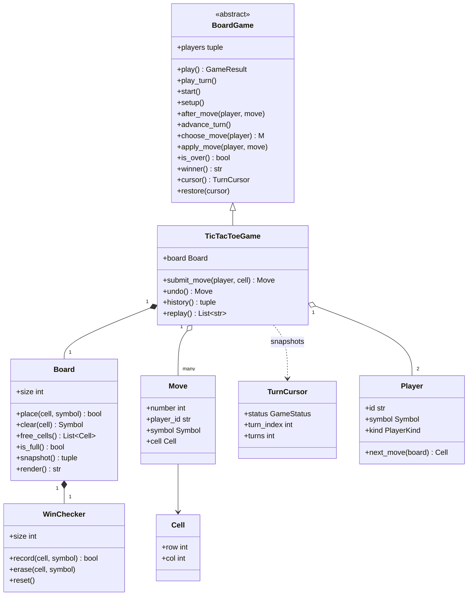
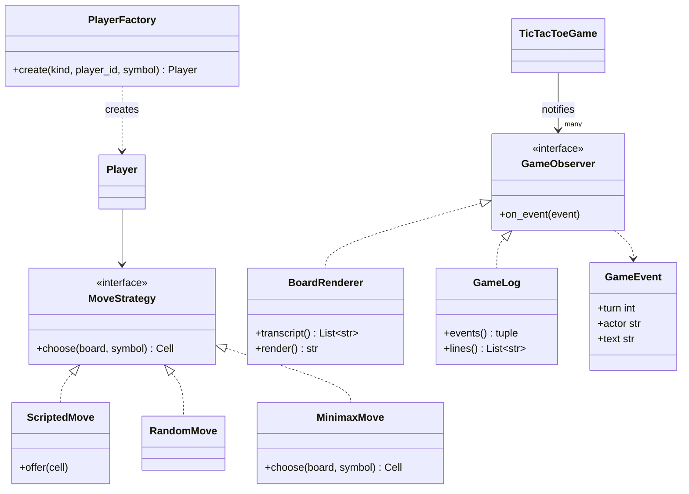
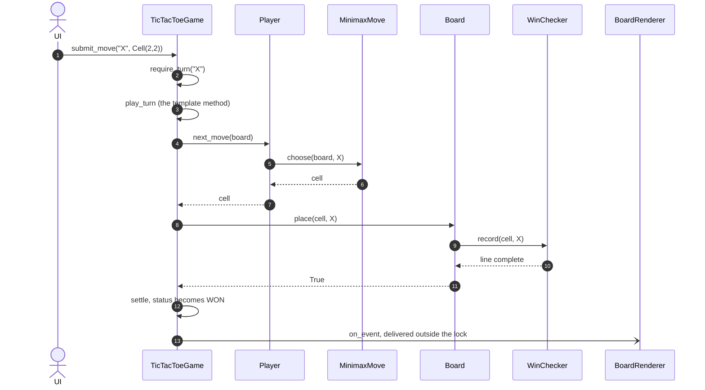
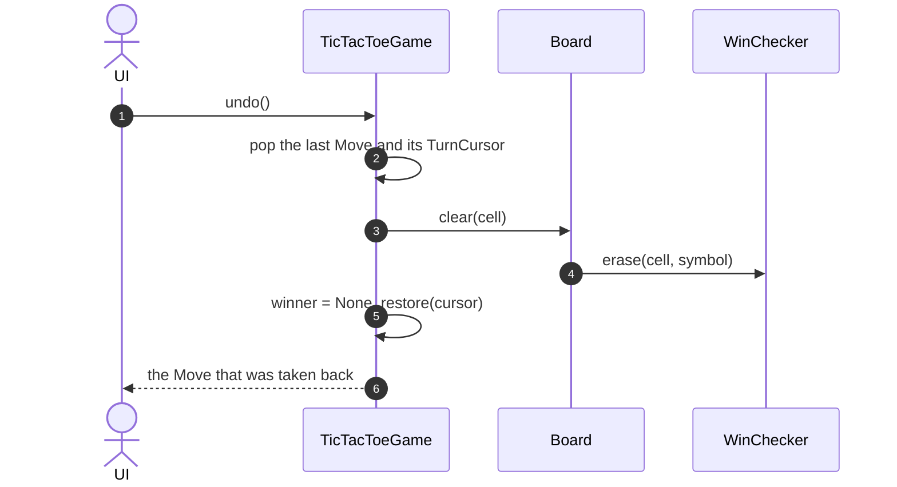
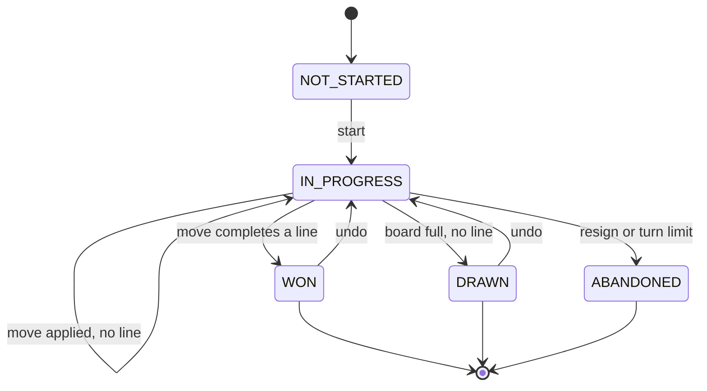

# Design tic-tac-toe (an extensible board game)

## TL;DR

- You build an N x N board game whose skeleton — set up, take turns, judge, rotate — lives in a `BoardGame` base class that snake and ladder and the bowling scorer reuse verbatim.
- Three decisions carry the interview: **win detection is O(1)** (four counters per move, not a rescan), **undo is an inverse command plus a three-field Memento**, and **the bot is a Strategy** so a human, a seeded random bot and minimax are interchangeable.
- Patterns that earn their place: Template Method, Strategy, Factory Method, Command with Memento, Observer. Inheritance for player *kinds* is deliberately not used.

## Problem statement

"Design tic-tac-toe so that it generalises. Two players alternate on an N x N board — 3 x 3 by default — placing their symbol on an empty cell. The first to fill a whole row, column or diagonal wins; a full board with no line is a draw. Players may be human or bots, and the game must support undoing the last move and replaying the game from its history. Show me the classes, the main flow, and how you would add Connect-4 later."

## Requirements

**Functional**

- An N x N board, default 3 x 3, with two players who alternate turns.
- Each player is human or a bot; a bot is random, or minimax (perfect play) on 3 x 3.
- Move validation: the cell must be on the board, empty, and offered by the player whose turn it is.
- Win detection in O(1) per move using row, column and both diagonal counters.
- Draw detection when the board fills with no line.
- Undo the last move, including a move that ended the game.
- A move history and a replay that rebuilds every position from it.
- A renderer that is told about events rather than polling the board.

**Non-functional and constraints**

- Correct when several threads submit moves: at most one move per turn, and no cell written twice.
- Deterministic and testable: every random generator is injected and seeded; no wall-clock reads.
- In-memory, single process, standard library only.

**Out of scope**: networking and matchmaking, persistence, per-move clocks, rendering to an actual screen.

## Clarifying questions and assumptions

| Question to ask | Assumption taken here |
|---|---|
| Is the board always 3 x 3? | No — `size` is a constructor argument. Win means a full line of length N, which keeps the counters correct for any N. |
| More than two players? | Two here, and the base class enforces it with `MIN_PLAYERS`. Snake and ladder raises the same limit to eight. |
| Where do human moves come from? | From outside: `submit_move` takes one move from a UI, socket or test. The library never reads stdin. |
| How strong must the bot be? | Perfect on 3 x 3 (minimax over 5,478 reachable positions); above 3 x 3 it delegates to a fallback strategy rather than pretending to search. |
| Can you undo after the game is over? | Yes. That is the interesting case: the status has to go back to in progress, not just the board. |
| Can two clients play the same game concurrently? | Yes — one lock per game object, and turn enforcement rejects whoever is out of turn. |
| Do we need Connect-4 or Gomoku now? | No, but the win checker is a separate class so that a k-in-a-row variant swaps one object. |

## Core entities and relationships

- **BoardGame** (abstract, generic over the move type) — the shared skeleton: the turn cursor, the turn limit, observers, and the `play` / `play_turn` template methods. It lives in `code/lld/tic_tac_toe/base.py` because it is game vocabulary, not infrastructure, and two other problems import it.
- **TicTacToeGame** — the rules: what a move is, how it is applied, when the game is over, who won. Plus the three features the template does not know about: `submit_move`, `undo` and `replay`.
- **Board** — the N x N grid. It owns placement rules (on the board, currently empty) and nothing else.
- **WinChecker** — the counters. `record` returns whether the placement completed a line; `erase` is its exact inverse. One checker per board.
- **Cell** — a frozen `(row, col)` coordinate. It is a key, not a container; the board holds the symbols.
- **Move** — the frozen command record: turn number, player, symbol, cell. The move log is a list of these, and replay is a fold over it.
- **TurnCursor** — the Memento: status, turn index and turn count, captured before each move.
- **Player** — id, symbol, kind and a `MoveStrategy`. `Player.next_move(board)` delegates; the game never asks what kind of player it is holding.
- **MoveStrategy** — `ScriptedMove` (a queue), `RandomMove` (injected `random.Random`), `MinimaxMove` (negamax with a transposition table).
- **PlayerFactory** — turns a `PlayerKind` plus arguments into a `Player` with the right strategy.
- **GameObserver** — `BoardRenderer` and `GameLog` receive `GameEvent`s; the game never imports a display.

Multiplicities: game `1 -> 1` board, board `1 -> 1` win checker, game `1 -> 2` players, game `1 -> *` moves, player `1 -> 1` strategy, game `1 -> *` observers.

## Class diagram

**Structure: the template, the rules that fill it in, and the two pieces of state a move changes.**



**Behaviour: the two seams an interviewer will push on — who decides a move, and who watches.**



## Design patterns applied

| Pattern | Where | Why it earns its place |
|---|---|---|
| [Template Method](../patterns/template-method.md) | `BoardGame.play` and `BoardGame.play_turn` | The order of a turn — choose, apply, count, judge, rotate — is identical in every board game and is exactly the thing a subclass must not be free to reorder. Two other problems in this handbook subclass it without changing a line. |
| [Strategy](../patterns/strategy.md) | `MoveStrategy` with `ScriptedMove`, `RandomMove`, `MinimaxMove` | "Now add a bot" is a one-class change, and swapping a human for a bot mid-game is an assignment. Bot strength is a runtime choice, which inheritance cannot give you. |
| [Factory Method](../patterns/factory-method.md) | `PlayerFactory.create` with a `PlayerKind` registry | The caller names a kind, not a class. Adding a cautious bot is a builder function plus one registry entry. |
| [Command](../patterns/command.md) | `Move` as an immutable record; `Board.place` and `Board.clear` are inverses | The move log is the whole feature set: undo pops it, replay folds it, and a future network protocol serialises it. |
| [Memento](../patterns/memento.md) | `TurnCursor` captured before each move | The board can be restored by the inverse command, but status and turn index cannot be recomputed once turn order stops being round-robin. Three integers is the cheapest honest snapshot. |
| [Observer](../patterns/observer.md) | `GameObserver`, `BoardRenderer`, `GameLog` | The game emits `GameEvent`s and never imports a display. The same log class serves all three board games in this handbook. |
| Polymorphism over conditionals | `Player.next_move` | There is no `if kind == "bot"` anywhere in the game. The interviewer is checking for that ladder. |

What was deliberately *not* used: a **`HumanPlayer` / `BotPlayer` class hierarchy**. Player kind and move policy vary independently — you would end up with `TimedHumanPlayer`, `TimedBotPlayer` and a combinatorial explosion. Composition (one `Player` class holding a strategy) collapses it. Also skipped: a full **State** class per status. Five enum values with guarded transitions in one `_settle` method is smaller and easier to read than five classes; bowling, where a frame's state genuinely changes its behaviour, is where classes start to pay.

## Key flows

**One turn, driven from outside: turn check, strategy, placement, counters, verdict, notification.**



**Undo: pop the command, invert the board, restore the Memento.**



**Game status.** The two edges that matter are the ones going backwards: undo is the only transition that leaves a terminal state, which is why `TurnCursor` records the status and not just the turn number.



## Implementation

Write it in the order you would on a whiteboard: the skeleton every game shares, then the vocabulary, then the counters, then the rules, then the policies.

The status enum, the result and the Memento are the shared kernel. `TERMINAL_STATUSES` is a `frozenset`, so the module holds no mutable state:

```python title="code/lld/tic_tac_toe/base.py — status and memento"
--8<-- "code/lld/tic_tac_toe/base.py:status"
```

The observer side is three small pieces: an immutable event, a one-method protocol, and a log that every game in this handbook reuses.

```python title="code/lld/tic_tac_toe/base.py — observer"
--8<-- "code/lld/tic_tac_toe/base.py:observer"
```

Now the template itself. `play_turn` fixes the order of a turn; the abstract steps are the rules and the hooks have defaults. Note the `try/finally`: events are buffered under the lock and delivered after it is released.

```python title="code/lld/tic_tac_toe/base.py — the template method"
--8<-- "code/lld/tic_tac_toe/base.py:template"
```

The vocabulary comes next. Errors subclass the shared hierarchy so a caller can catch `ConflictError` without importing anything from tic-tac-toe:

```python title="code/lld/tic_tac_toe/models.py — enums and errors"
--8<-- "code/lld/tic_tac_toe/models.py:enums"
```

`Cell`, `Move` and `Player` are frozen. `Player` holds a strategy instead of being subclassed, and `next_move` is the single line that keeps type checks out of the game:

```python title="code/lld/tic_tac_toe/models.py — values"
--8<-- "code/lld/tic_tac_toe/models.py:values"
```

This is the class the interviewer is waiting for. A naive checker rescans 2N + 2 lines of N cells after every move, so a full 3 x 3 game costs about 9 x 8 = 72 line scans and an N x N game is O(N^2) per move, O(N^4) over the whole board. Counting instead touches at most four integers per move and compares each with N:

```python title="code/lld/tic_tac_toe/models.py — the O(1) win checker"
--8<-- "code/lld/tic_tac_toe/models.py:win_checker"
```

`Board` is deliberately thin: it validates placement and delegates the verdict. `snapshot` exists for one reason — it is the hashable key the minimax transposition table needs.

```python title="code/lld/tic_tac_toe/models.py — board"
--8<-- "code/lld/tic_tac_toe/models.py:board"
```

The strategies. `ScriptedMove` doubles as the input buffer a UI needs and the exact move source a test needs.

```python title="code/lld/tic_tac_toe/strategies.py — the strategy seam"
--8<-- "code/lld/tic_tac_toe/strategies.py:strategy"
```

Minimax is written as negamax with make/unmake on the live board — no copy per node — plus a transposition table. Scores decay by one per ply on the way up, which both prefers a faster win and keeps a cached entry valid regardless of the depth it was first computed at:

```python title="code/lld/tic_tac_toe/strategies.py — minimax"
--8<-- "code/lld/tic_tac_toe/strategies.py:minimax"
```

The factory is a registry of builder functions, so a new player kind never touches the game:

```python title="code/lld/tic_tac_toe/services.py — player factory"
--8<-- "code/lld/tic_tac_toe/services.py:factory"
```

And the game. Everything above the divider is the template's five steps; everything below is the extra features. Read `apply_move` closely: the Memento is captured *before* the board changes and appended only after the placement succeeds, so a rejected move leaves no debris.

```python title="code/lld/tic_tac_toe/services.py — the game"
--8<-- "code/lld/tic_tac_toe/services.py:game"
```

The renderer stores text only, so it never reads a board that another thread is halfway through mutating:

```python title="code/lld/tic_tac_toe/services.py — renderer"
--8<-- "code/lld/tic_tac_toe/services.py:renderer"
```

Running `python -m lld.tic_tac_toe.demo` plays a scripted win on the main diagonal, takes it back, shows both rejections, then lets two perfect bots draw:

```text
--- game 1: X takes the main diagonal ---
[ 0] game started
[ 1] X plays X at (0,0)
[ 2] O plays O at (0,1)
[ 3] X plays X at (1,1)
[ 4] O plays O at (0,2)
[ 5] X plays X at (2,2)
[ 5] X wins
result: won, winner X, 5 turns
X|O|O
.|X|.
.|.|X
--- undo: in_progress, X to play, 4 turns on the clock ---
NotYourTurnError: it is X's turn, not O's
CellOccupiedError: cell (0,0) already holds X
--- game 2: minimax against minimax ---
result: drawn after 9 turns; replay rebuilds 10 frames
X|X|O
O|O|X
X|O|X
```

## Concurrency and edge cases

**Which lock protects what.** There is one lock, `BoardGame._lock`, and the granularity argument is the opposite of the parking lot's. A parking lot is a large aggregate with independent parts, so it locks per floor. A game is a small aggregate whose parts are *not* independent — the board, the turn cursor and the winner change together — so the game object is the unit of locking. The critical section is a placement and four integer increments, roughly the cost of an uncontended mutex acquire (about 17 ns), and contention is limited to the two players of one game. A lock per cell would buy nothing and would make "is the game over" a nine-lock dance.

It is an `RLock` because the hooks re-enter: `play_turn` holds the lock and calls `after_move`, which calls `emit`, which locks again.

**The race it prevents.** Two clients submitting into the same game interleave at three points: the turn check, the cell check, and the status update. Holding the lock across all of `submit_move` makes "check it is your turn, place, judge" atomic, so the losing thread gets `NotYourTurnError` or `CellOccupiedError` and the board never records two moves for one turn. The concurrency test fires 36 submissions from eight workers at one game and asserts that the accepted count equals the number of turns, that no cell appears twice, and that symbols still alternate.

**Notifying outside the lock.** Events are buffered under the lock and delivered by `flush_events` once `play_turn` releases it, the same rule the parking lot's floors follow. Be precise about the exception, because an interviewer reading the code will find it: `submit_move` holds the reentrant lock *across* `play_turn`, so on that path delivery still runs inside its critical section. Name it, then offer the fix — drain the buffer from a queue on another thread.

**Edge cases handled**: a cell that is occupied or off the board (a rejected move costs no turn); a player moving out of turn or not in the game; undo on an empty history; undo of a *winning* move, which must reopen the game; the centre cell of an odd board incrementing both diagonals; a draw when the last cell fills; a board smaller than 3 x 3; two players sharing a symbol; a random bot constructed without a seed; and a turn limit that abandons a game rather than spinning forever.

!!! warning "Common mistake"
    Writing the diagonal counters as `if row == col: ... elif row + col == n - 1: ...`. On a 3 x 3 board the centre sits on both diagonals, so the `elif` silently under-counts the anti-diagonal and a win through the middle is never detected. It is two independent `if` statements. The parametrized test over all eight lines exists precisely to catch this, and it is the first thing to say when you write the checker.

## Extensibility and follow-ups

- **Connect-4 and Gomoku (k-in-a-row)**: keep `Board`, replace `WinChecker`. Row and column totals stop working when a line is shorter than the board, so a `KInARowChecker` counts the run through the placed cell in four directions — O(k) per move, still not a rescan. Connect-4 also changes how a cell is chosen (drop into a column), which is an override of `choose_move`, not a new class hierarchy.
- **Battleship (hidden boards)**: two boards per game and a `visible_to(player)` projection. The template does not change; `apply_move` returns a hit or miss and `after_move` emits an event that says less to the opponent than to the owner.
- **Online play**: `Move` is already a serialisable command. Put `submit_move` behind a request handler, keep one game object per match, and the existing lock is what makes two sockets safe. Reconnect is `replay()`.
- **Move timers**: inject a `Clock`, stamp each `Move`, and add a `TIMED_OUT` transition into `ABANDONED`. Nothing else moves, because time already enters through an interface elsewhere in the handbook.
- **A stronger or faster bot**: alpha-beta pruning on top of the existing negamax, or an opening book keyed by `Board.snapshot`. Both are internal to `MinimaxMove`.
- **Redo**: keep the popped `Move` and `TurnCursor` on a second stack. Undo and redo become symmetric, which is the argument for having stored the cursor rather than recomputing it.

!!! tip "Interview tip"
    Say "the skeleton is shared, the rules are not" *before* you draw anything, then write `BoardGame.play` first and leave the abstract methods empty. You have now shown the interviewer the extension seam, and every follow-up — snake and ladder, Connect-4, bowling — is answered with "that is a new subclass, and here is which method it overrides." Candidates who write the 3 x 3 grid first end up rewriting it when the follow-up arrives.

## Tests

`tests/test_tic_tac_toe.py` has 21 cases. The two worth walking through in an interview are the parametrized line test — it is the anti-diagonal regression guard — and undo after game over, which is the only transition that leaves a terminal status.

```python title="code/lld/tic_tac_toe/tests/test_tic_tac_toe.py — every line, both diagonals"
--8<-- "code/lld/tic_tac_toe/tests/test_tic_tac_toe.py:lines"
```

```python title="code/lld/tic_tac_toe/tests/test_tic_tac_toe.py — undo after game over"
--8<-- "code/lld/tic_tac_toe/tests/test_tic_tac_toe.py:undo"
```

The concurrency case asserts the invariant rather than a timing outcome, which is what makes it stable in CI:

```python title="code/lld/tic_tac_toe/tests/test_tic_tac_toe.py — concurrency"
--8<-- "code/lld/tic_tac_toe/tests/test_tic_tac_toe.py:concurrency"
```

The rest cover: the happy path with the renderer transcript and replay frame count; occupied and off-board cells; out-of-turn and unknown players; a draw on a full board; unwinding every move and then refusing; minimax blocking an immediate threat; two perfect bots always drawing in nine turns; a 4 x 4 win on the diagonal; seeded bots being reproducible and unseeded bots being refused; and playing on after the game ended. Run them with `uv run pytest code/lld/tic_tac_toe -q`.

## 45-minute pacing

| Minutes | What to do | What to say or write |
|---|---|---|
| 0–5 | Clarify | N x N or 3 x 3? Bots? Undo? Who supplies a human move? State out of scope: networking, persistence, timers. |
| 5–10 | Entities | Nouns on the board: Game, Board, Cell, Player, Symbol, Move, WinChecker, MoveStrategy. Verbs become methods: `play`, `place`, `record`, `choose`, `undo`. |
| 10–16 | Skeleton | Write `BoardGame.play_turn` first — five lines, four abstract methods. Say that snake and ladder and bowling will subclass it. |
| 16–26 | Win detection | `WinChecker.record` with the four counters. Say "two ifs, not an elif" out loud and give the centre-cell reason. Then `Board.place` and `clear` as inverses. |
| 26–34 | Rules and undo | `TicTacToeGame`'s five steps, then `submit_move` with the turn check and `undo` with the cursor Memento. Mention that undo after game over is the interesting case. |
| 34–40 | Bot and concurrency | `MoveStrategy` with three implementations; sketch negamax in five lines. Name the single game lock and the race it prevents. |
| 40–45 | Extensions | Connect-4 as a new `WinChecker`, online play as `submit_move` behind a socket, redo as a second stack. |

## Related

- [Template Method](../patterns/template-method.md) — the `BoardGame` skeleton, and when a function taking callables beats a base class
- [Strategy](../patterns/strategy.md) — the interchangeable move policies
- [Memento](../patterns/memento.md) — what `TurnCursor` is and where snapshots get expensive
- [Design snake and ladder](snake-and-ladder.md) — the same base class, dice instead of placement
- [Design a bowling alley](bowling-alley.md) — the same base class with a turn rotation that is not round-robin
- [Design chess](chess.md) — where the move log, undo and legality checking get genuinely hard
