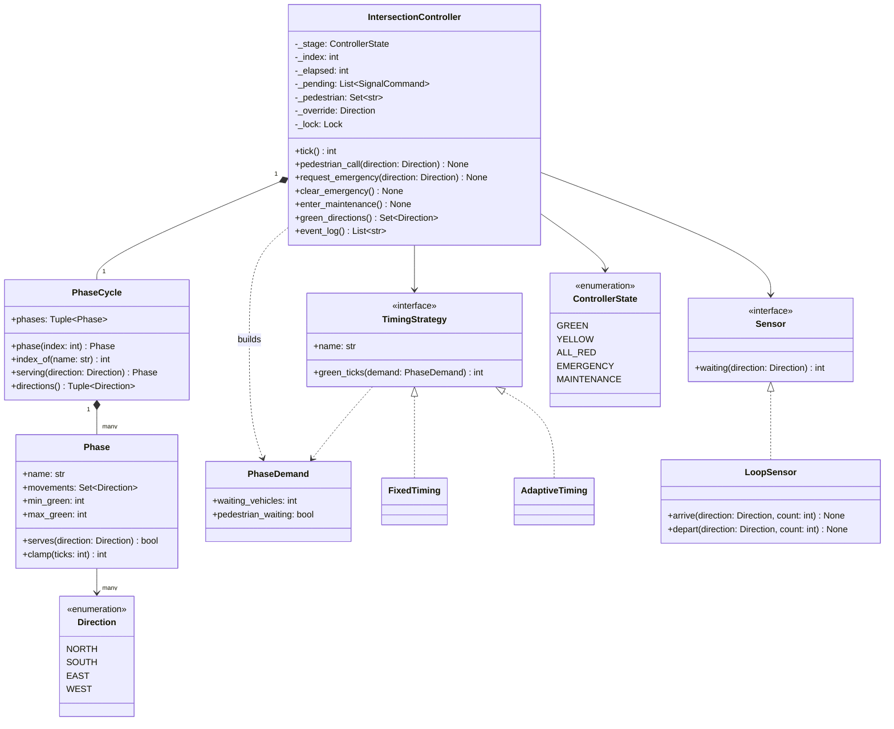
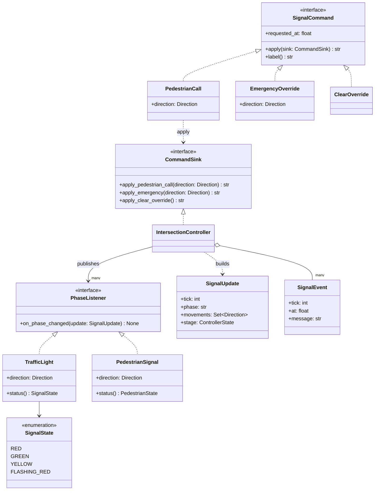
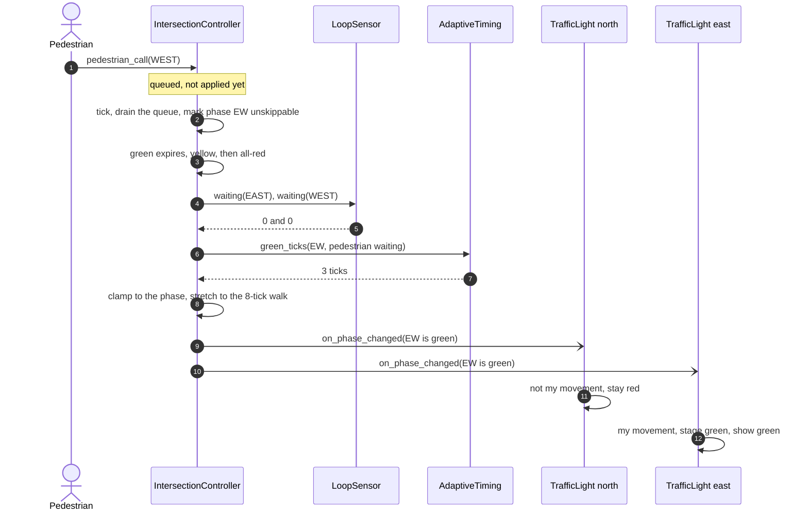
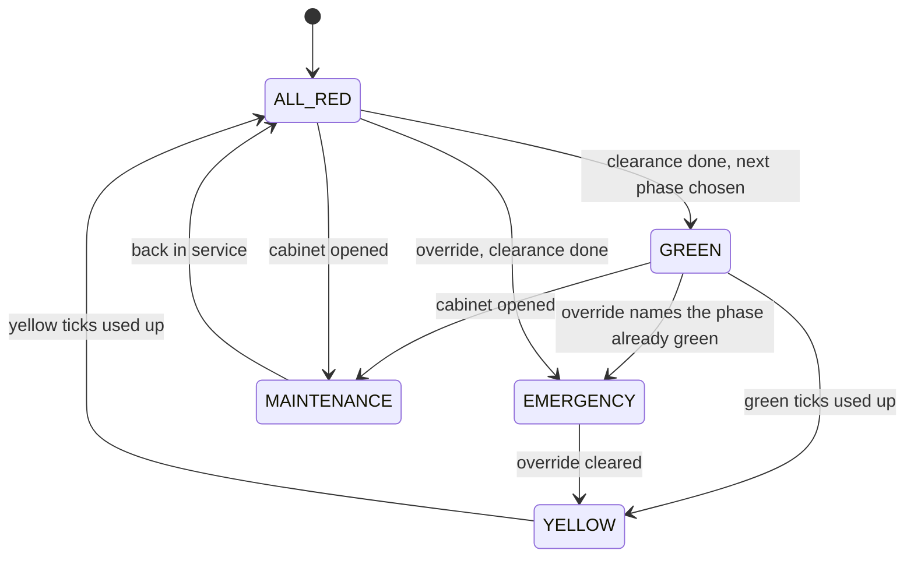

# Design a traffic signal controller

## TL;DR

- You build an intersection controller that walks a ring of phases, green to yellow to all-red to the next green, and publishes each change to signal heads that colour themselves.
- Three decisions carry the interview: **the safety invariant is enforced by a constructor**, not by scheduling logic; **presses are queued commands** applied at safe points, so nothing can shorten a yellow; **timing is a Strategy** whose answer is clamped by the phase.
- Patterns that earn their place: State, Strategy, Command, Observer, Mediator. Singleton is discussed and deliberately not used.

## Problem statement

"Design the controller for a signalised intersection. It has several approaches; each approach has a signal head that shows red, yellow or green. Only non-conflicting movements may be green together, and there is a clearance interval between phases. Pedestrians press a button to be let across, emergency vehicles can demand a green, and an engineer can put the intersection into flashing-red maintenance. Timing should be able to adapt to vehicle detectors. Show me how you would prove it is safe."

## Requirements

**Functional**

- An intersection with N approaches grouped into phases; only non-conflicting movements share a phase.
- Each phase runs green, then yellow, then an all-red clearance before the next phase gets green.
- Pedestrian call buttons: the phase that carries that crossing must not be skipped, and its green is at least the walk interval.
- Emergency override: hold a green for one approach until it is cleared, reached through a safe transition.
- Maintenance mode: every head flashes red, and the intersection resumes through a clearance.
- Adaptive timing from vehicle detectors, with fixed timing as the fallback.
- A tick-based simulation and an event log of every stage change and every press.

**Non-functional and constraints**

- The safety invariant: two conflicting approaches are never green at the same instant, and every change of the green set is preceded by an all-red tick. This is the requirement; everything else is throughput.
- Deterministic: durations are counted in ticks, never measured against a wall clock.
- Thread-safe: presses arrive from buttons, radios and a maintenance laptop while the cycle runs.

**Out of scope**: the cabinet's hardware conflict monitor (the electromechanical backstop that exists precisely because software fails), signal head optics, and coordination between intersections, which is the follow-up.

## Clarifying questions and assumptions

| Question to ask | Assumption taken here |
|---|---|
| Which movements conflict? | Opposing through movements are compatible; anything crossing is not. `Direction.conflicts_with` is one line and the whole model rests on it. |
| What is a tick worth? | One second of signal time. Durations are tick counts, so a slow process runs the intersection slowly rather than dangerously. |
| Can an emergency vehicle get an instant green? | No. It gets the *next* green: the current green ends early, but the yellow and the all-red run in full. |
| May a phase be skipped? | Yes, when the detectors report nobody waiting and no pedestrian has called. A pedestrian call makes a phase unskippable. |
| Who enforces the minimum green? | The phase. The strategy proposes a number and `Phase.clamp` bounds it, so a bad strategy costs throughput, never safety. |
| One controller per process, so a Singleton? | No. A green-wave corridor is a dozen controllers in one process, and every test builds its own. |

## Core entities and relationships

- **Phase** — a set of movements that may run together plus the bounds on its green. Its constructor rejects conflicting movements, so an unsafe phase cannot be built.
- **PhaseCycle** — the ring: the fixed order phases are offered in, with lookup by name and by approach.
- **IntersectionController** — the mediator: it owns the ring position, the stage, the elapsed ticks, the command queue, the pedestrian calls and the event log, all under one lock.
- **ControllerState** — `GREEN`, `YELLOW`, `ALL_RED`, `EMERGENCY`, `MAINTENANCE`: where the intersection is, which is not the same as what any one head is showing.
- **TrafficLight** and **PedestrianSignal** — observers. Each receives a `SignalUpdate` and works out its own colour; neither is ever polled.
- **PedestrianCall**, **EmergencyOverride**, **ClearOverride** — presses as command objects, queued and executed at a safe point.
- **TimingStrategy** (`FixedTiming`, `AdaptiveTiming`) and **Sensor** (`LoopSensor`) — the policy and the detectors. The strategy sees only an immutable `PhaseDemand`.

Multiplicities: intersection `1 -> 1` cycle, cycle `1 -> *` phases, phase `1 -> *` movements, intersection `1 -> *` heads, intersection `1 -> 1` timing strategy.

## Class diagram

**The ring, the controller and the timing policy.**



**Presses as commands, heads as observers.**



## Design patterns applied

| Pattern | Where | Why it earns its place |
|---|---|---|
| [State](../patterns/state.md) | `ControllerState` and the branches in `tick` | Five stages, and a tick means something different in each: run the current interval down, hold indefinitely, or do nothing at all. The enum-and-table form fits because each transition is a line; classes per state would hide the one thing a reviewer must be able to see at a glance, which is that `YELLOW` always goes to `ALL_RED`. |
| [Strategy](../patterns/strategy.md) | `TimingStrategy` with fixed and adaptive implementations | "Now make it adapt to traffic" is the follow-up. The strategy sees an immutable `PhaseDemand` and returns a number, so it is a pure function and cannot reach the lights. |
| [Command](../patterns/command.md) | `PedestrianCall`, `EmergencyOverride`, `ClearOverride` | Presses arrive at arbitrary moments and must be applied at safe ones. As objects they queue, log and replay; as direct method calls they would mutate the cycle mid-transition. |
| [Observer](../patterns/observer.md) | `PhaseListener`, implemented by every head and pedestrian signal | The controller publishes one `SignalUpdate`; each head decides its own colour from it. Adding telemetry is one more subscriber, and the publish happens outside the lock. |
| [Mediator](../patterns/mediator.md) | `IntersectionController` | Detectors, heads, buttons and the timing policy never reference each other. The rules of the conversation live in one object you can read top to bottom. |
| Dependency injection | `Sensor`, `TimingStrategy`, `Clock` | A `LoopSensor` in tests, a hardware bus in the field; the controller cannot tell. |

What was deliberately *not* used: **Singleton**. One intersection is one controller, which is why the pattern is tempting, and it is still wrong — the green-wave follow-up is a corridor of controllers in one process, and the safety test builds a fresh one per case. Say that, then say the real backstop: a production cabinet has a hardware conflict monitor that drops the intersection to flashing red when the software commands conflicting greens. Software invariants are the first line, not the only one.

## Key flows

**A pedestrian press, one tick later, and the heads colouring themselves.**



**The cycle as a state machine. Note that nothing reaches `GREEN` or `EMERGENCY` except through `ALL_RED`.**



The one arrow worth defending is `GREEN --> EMERGENCY`. When the ambulance is coming from an approach that is *already* green, dropping to yellow and back would be worse than useless, so the controller converts the running green into a held one with no colour change. When the ambulance needs a different phase, there is no shortcut: the green ends early, and the yellow and all-red run at their full length.

## Implementation

Write the vocabulary first, and put the safety invariant in it. Everything after that is scheduling, and scheduling bugs then cost throughput instead of lives.

`conflicts_with` is the whole safety model: opposing through movements are compatible, anything crossing is not.

```python title="code/lld/traffic_signal/models.py — approaches and stages"
--8<-- "code/lld/traffic_signal/models.py:enums"
```

```python title="code/lld/traffic_signal/models.py — errors"
--8<-- "code/lld/traffic_signal/models.py:errors"
```

`Phase.__post_init__` is the line to point at when you are asked to prove the intersection is safe: a phase whose movements conflict raises at construction, so no scheduler downstream can produce one.

```python title="code/lld/traffic_signal/models.py — phases and the ring"
--8<-- "code/lld/traffic_signal/models.py:phases"
```

Presses become objects because they arrive at the wrong moment. The controller queues them and drains the queue at the top of a tick, before any timing decision.

```python title="code/lld/traffic_signal/models.py — presses as commands"
--8<-- "code/lld/traffic_signal/models.py:commands"
```

The update that goes out to observers carries the stage and the movements, and nothing else. A head that receives it knows enough to colour itself.

```python title="code/lld/traffic_signal/models.py — the published update"
--8<-- "code/lld/traffic_signal/models.py:observer"
```

Timing is a pure function of demand, and whatever it returns is clamped by the phase.

```python title="code/lld/traffic_signal/strategies.py — fixed and adaptive timing"
--8<-- "code/lld/traffic_signal/strategies.py:timing"
```

The heads are observers with a three-line rule; the pedestrian signal walks with the traffic beside it and never during an emergency hold.

```python title="code/lld/traffic_signal/services.py — heads, walk signals and loops"
--8<-- "code/lld/traffic_signal/services.py:heads"
```

Then the controller. Read `tick` first: drain the queue, spend a tick, and advance the stage when the current one is used up. `_start_green` is where the override, the skipping rule, the strategy and the clamp all meet.

```python title="code/lld/traffic_signal/services.py — the controller"
--8<-- "code/lld/traffic_signal/services.py:controller"
```

Running `python -m lld.traffic_signal.demo` prints one line per stage change, with the four heads and the detector queues:

```text
--- two phases, adaptive green, queues shown as N/S/E/W ---
t  2 green     EW  N:R S:R E:G W:G  west ped walk queues 7/4/6/0
ambulance from the north: the east-west green is cut short, then held for it
t  9 yellow    EW  N:R S:R E:Y W:Y  west ped wait queues 11/7/0/0
t 12 all_red   EW  N:R S:R E:R W:R  west ped wait queues 13/8/0/0
t 14 emergency NS  N:G S:G E:R W:R  west ped wait queues 11/6/0/0
ambulance clear, the ring resumes through yellow and all-red
t 23 yellow    NS  N:Y S:Y E:R W:R  west ped wait queues 1/0/0/0
t 26 all_red   NS  N:R S:R E:R W:R  west ped wait queues 3/1/0/0
t 28 green     NS  N:G S:G E:R W:R  west ped wait queues 1/0/0/0
west button pressed, and no car has waited there for twenty ticks
t 36 yellow    NS  N:Y S:Y E:R W:R  west ped wait queues 0/1/0/0
t 39 all_red   NS  N:R S:R E:R W:R  west ped wait queues 2/2/0/0
t 41 green     EW  N:R S:R E:G W:G  west ped walk queues 3/3/0/0
maintenance N:F S:F E:F W:F  stage maintenance
t39 all_red on NS for 2 ticks
t41 green on EW for 8 ticks
t46 maintenance on EW
```

Three things in that trace are worth narrating. The ambulance request arrives while east-west is green: the green ends at t9 instead of running its full length, but the yellow still gets its three ticks and the clearance its two, and only then does north-south come up as a held `EMERGENCY`. After the override is cleared, north-south drains to zero and the east-west phase is skipped entirely, because the loops report nobody there. Then the west button is pressed, and the log line `green on EW for 8 ticks` shows the walk interval winning over the adaptive strategy's proposal of three.

## Concurrency and edge cases

**Which lock protects what.** One lock, `IntersectionController._lock`, guards the stage, the elapsed count, the ring index, the command queue, the pedestrian calls, the override and the log. That is deliberately coarse: they are one invariant, not six, and a tick is a handful of integer operations. An uncontended lock costs about 17 ns (see the [latency numbers](../../cheatsheets/latency-and-estimation.md)), so even at ten presses a second the locking is noise next to the once-a-second tick. Splitting it would buy nothing and would let a press land halfway through a transition.

The heads have their own small lock because they are read from other threads, and the controller publishes to them *outside* its own lock. A telemetry subscriber that blocks on a socket therefore delays its own update, not the yellow.

**Presses can never break a transition.** `submit` only appends; `_drain_commands` runs at the top of the next tick. An override that arrives during a yellow sets a flag and nothing else, so the yellow and the all-red are untouchable by design rather than by review. The test for this asserts the exact stage sequence after an override arrives mid-yellow.

**`tick` must never raise.** A command that fails validation is logged and dropped rather than propagating out of the tick loop, and the public `request_emergency` validates the approach eagerly so a caller's mistake is a caller's exception. An intersection that stops ticking because of a bad button press is a worse failure than any it could prevent.

**Tick drift.** Durations are tick counts, so the controller has no way to shorten an interval when the process is slow. If you drove it from `Clock.now()` deltas instead, a garbage-collection pause would extend a green harmlessly but a clock adjustment could truncate a yellow. The injected clock only stamps events for correlation with city telemetry.

**Other edges handled**: an emergency for an approach this intersection does not serve; leaving maintenance twice; a walk interval longer than the shortest maximum green, refused at construction; a strategy that returns an absurd number, clamped by the phase; a phase with no demand and no pedestrian, skipped; every phase quiet at once, in which case the ring simply advances.

!!! warning "Common mistake"
    Modelling one light per approach with its own timer. It looks natural and it is unsafe: two timers can both be in green, and no amount of testing proves they cannot. Model the *intersection* as one state machine whose green set is derived from the phase, and the conflicting-green bug becomes unrepresentable rather than unlikely.

## Extensibility and follow-ups

- **Green-wave corridors**: give the controller an offset and a cycle length so its phases start at a fixed point in a shared cycle; a coordinator holds a dozen controllers and sets their offsets. Nothing inside the ring changes, which is the payoff for not making it a Singleton.
- **Transit priority**: an `EmergencyOverride` with a lower rank. Extend the queue to a priority queue and let a bus request an extension of a running green rather than a new phase.
- **Fault detection**: the heads already receive every update; a `ConflictMonitor` listener that also reads the lamp feedback and calls `enter_maintenance` on a mismatch is one more subscriber.
- **Left-turn phases**: a phase per protected movement, added to the ring. The constructor's conflict check does the reasoning for you.
- **Actuated timing with gap-out**: `AdaptiveTiming` extends the green only while vehicles keep crossing the loop. The strategy needs one more field on `PhaseDemand` and no change to the controller.
- **City-wide telemetry**: the event log becomes a stream, and the question turns into a system-design one about ingest, retention and per-corridor dashboards.

!!! tip "Interview tip"
    When you are asked to prove a safety property, show where it is *impossible to violate*, not where it is checked. "A `Phase` with conflicting movements raises in its constructor, and the green set is always exactly one phase's movements" is a two-sentence proof. Then offer the test that asserts it on every tick of a sixty-tick run with overrides and pedestrian calls injected, and mention the hardware conflict monitor that exists because software is not enough.

## Tests

`tests/test_traffic_signal.py` has 11 cases. The two worth walking through are the ring test, which pins the exact stage sequence, and the safety test, which asserts the invariant on every tick of a run that includes a pedestrian call and an override:

```python title="code/lld/traffic_signal/tests/test_traffic_signal.py — the ring"
--8<-- "code/lld/traffic_signal/tests/test_traffic_signal.py:cycle"
```

```python title="code/lld/traffic_signal/tests/test_traffic_signal.py — the safety invariant"
--8<-- "code/lld/traffic_signal/tests/test_traffic_signal.py:safety"
```

The concurrency test runs one thread ticking forty times while twenty-four threads press buttons, and asserts both that no tick ever saw conflicting greens and that no press was lost:

```python title="code/lld/traffic_signal/tests/test_traffic_signal.py — presses under load"
--8<-- "code/lld/traffic_signal/tests/test_traffic_signal.py:concurrency"
```

The rest cover: a conflicting phase refused at construction; an override arriving mid-yellow; an override for an approach that is already green; a quiet phase skipped until a pedestrian calls, then stretched to the walk interval; adaptive green growing with the queue and stopping at the cap; maintenance flashing and resuming through a clearance; an unknown approach; and the heads updating without being polled. Run them with `uv run pytest code/lld/traffic_signal -q`.

## 45-minute pacing

| Minutes | What to do | What to say or write |
|---|---|---|
| 0-5 | Clarify | Which movements conflict? Pedestrians, emergency vehicles, maintenance? Adaptive timing? Out of scope: the hardware conflict monitor, inter-intersection coordination. |
| 5-11 | Safety first | Write `conflicts_with` and `Phase` with its constructor check. State the invariant out loud before any scheduling code. |
| 11-18 | The ring | Draw the five-stage diagram, then `PhaseCycle`. Mark that nothing reaches green except through all-red. |
| 18-33 | Code | `tick`, `_advance`, `_start_green`. Add the command queue and say why a press cannot be applied where it arrives. |
| 33-39 | Timing and observers | `TimingStrategy` with the clamp, then the heads colouring themselves from one update. |
| 39-45 | Extensions | Green waves, transit priority, fault detection, and the hand-off to a city-scale system design. |

## Related

- [State](../patterns/state.md) — the five stages as an enum with guarded transitions
- [Strategy](../patterns/strategy.md) — fixed and adaptive timing behind one method
- [Command](../patterns/command.md) — presses queued and applied at safe points
- [Mediator](../patterns/mediator.md) — the controller as the only object that knows everyone
- [Design an elevator system](elevator-system.md) — the other tick-driven controller, with dispatch instead of phases
- [Concurrency for LLD in Python](../fundamentals/concurrency-for-lld.md) — why one coarse lock is right here
