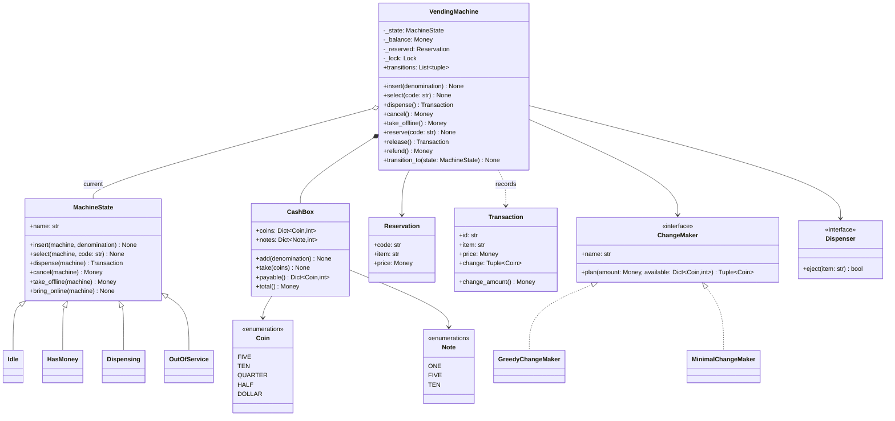
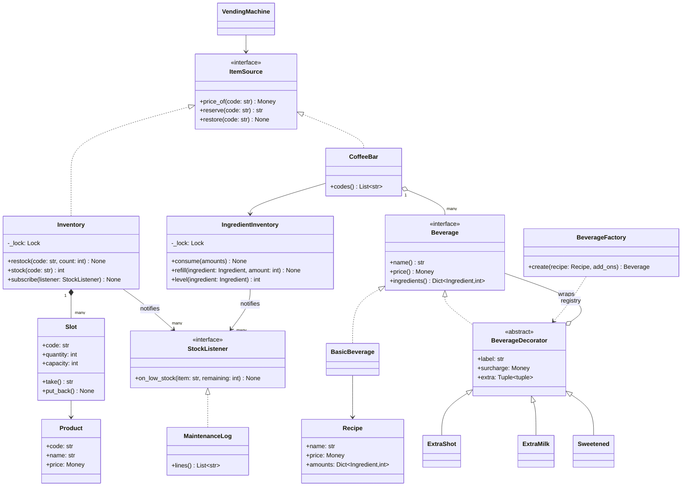
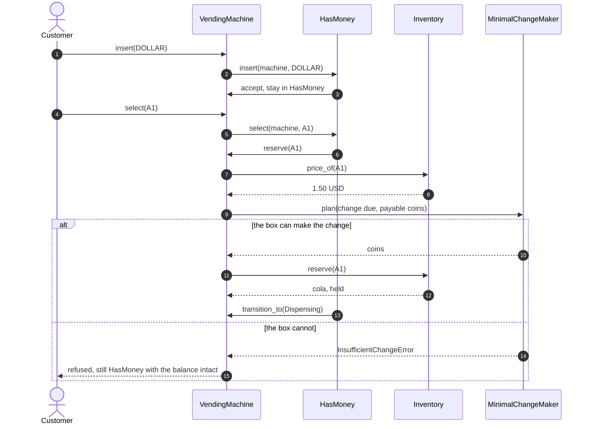
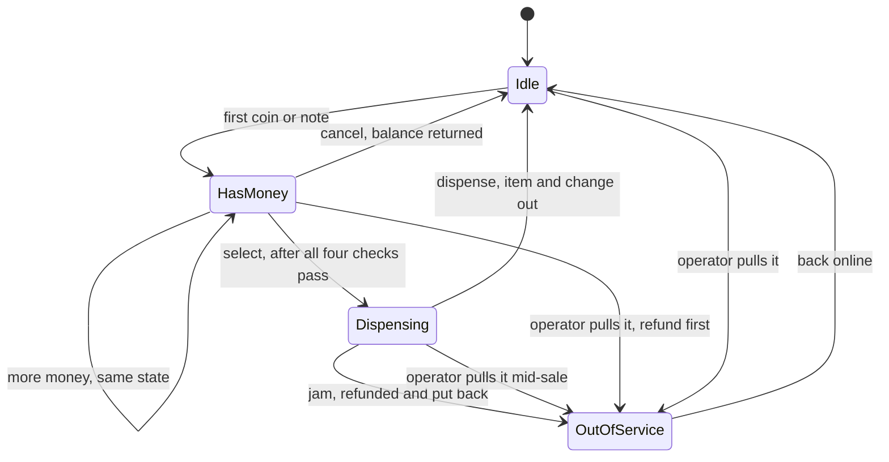

# Design a vending machine (and a coffee machine)

## TL;DR

- You build a machine whose four states accept only the events legal for them, over an item source that is either a shelf of slots or a coffee bar of recipes.
- Three decisions carry the interview: **State classes instead of an if-ladder**, **validate before you transition** (a refused selection leaves the balance untouched), and **change-making behind a Strategy** where greedy is demonstrably wrong.
- Patterns that earn their place: State, Strategy, Decorator, Factory Method, Observer. Singleton is discussed and deliberately not used.

## Problem statement

"Design a vending machine. It holds products in slots, each with a price and a quantity. A customer inserts coins or notes, selects a product, and gets it plus change; they can cancel and be refunded at any point before the item drops. Operators restock slots and collect cash. Handle out of stock and the case where the machine cannot make change. Then: turn it into a coffee machine that brews from recipes and supports add-ons such as an extra shot."

## Requirements

**Functional**

- Slots keyed by a code, each with one product, a price and a quantity.
- Accept coins and notes; the running balance is visible to the customer.
- Select a product: validate the code, the stock, the balance and whether the change can actually be made.
- Dispense the item and return change; a purchase that jams is refunded and the item goes back on the shelf.
- Cancel at any point before dispensing and get the balance back.
- Operator actions: restock a slot, collect the cash while leaving a float.
- Out of stock and insufficient change are refusals with useful messages, not crashes.
- Coffee variant: drinks brewed from recipes against an ingredient pantry, low-level alerts, and add-ons (extra shot, extra milk, sugar) that change both price and ingredients.

**Non-functional and constraints**

- An event that is illegal for the current state raises a domain error naming that state; the machine never silently ignores a press.
- Money is integer cents. Never a float, and never a partially applied purchase.
- Thread-safe: the machine serves one customer at a time, and concurrent presses must not produce two dispenses.

**Out of scope**: card and contactless payment, the note validator's optics, telemetry back-haul, the physical bill stacker.

## Clarifying questions and assumptions

| Question to ask | Assumption taken here |
|---|---|
| Does the machine give notes as change? | No. Notes go in, coins come out, which is why "insufficient change" is a real failure mode rather than an edge case. |
| What happens if the customer cancels after selecting? | `Dispensing` is the point of no return for the *item*; cancelling is legal only while in `HasMoney`. An operator taking the machine offline mid-dispense refunds and restocks. |
| Is the machine restocked while it is running? | Yes. Stock lives behind the inventory's own lock, so an operator refilling column B never blocks a customer buying from column A. |
| In what order do you validate a selection? | Code, then balance, then change feasibility, then stock. The money checks need no rollback; the reservation is the only step that mutates, so it goes last. |
| Are the coffee machine and the snack machine the same class? | Yes. Both are `VendingMachine` over an `ItemSource`; only the source differs. |
| One machine per process, so a Singleton? | No. Tests build dozens, and the demo runs two side by side. |

## Core entities and relationships

- **VendingMachine** — the context: current state, balance, reservation, cash box, and the lock that serialises one customer session. Every public event is one guarded delegation.
- **MachineState** with `Idle`, `HasMoney`, `Dispensing`, `OutOfService` — the four states. The base class rejects every event; each subclass overrides only the cells it accepts.
- **ItemSource** — the seam: `price_of`, `reserve`, `restore`. Implemented by `Inventory` (slots of products) and by `CoffeeBar` (recipes against a pantry).
- **Slot** and **Product** — one column of the machine and what is in it; **Reservation** is what the machine holds between `select` and `dispense`.
- **CashBox** — coins (payable as change) and notes (accepted, never paid out); **ChangeMaker** plans the coins to hand back.
- **Beverage**, **BasicBeverage**, **BeverageDecorator** (`ExtraShot`, `ExtraMilk`, `Sweetened`) and **BeverageFactory** — the coffee side: a drink is a recipe wrapped in zero or more add-ons.
- **IngredientInventory** — the pantry, consumed all-or-nothing; **MaintenanceLog** — an observer of low stock on either side.

Multiplicities: machine `1 -> 1` state, machine `1 -> 1` item source, inventory `1 -> *` slots, slot `1 -> 1` product, machine `1 -> 1` cash box, transaction `1 -> *` coins of change.

## Class diagram

**The context, its four states, and the money.**



**The two item sources: a shelf of slots, and the coffee bar with its decorated drinks.**



## Design patterns applied

| Pattern | Where | Why it earns its place |
|---|---|---|
| [State](../patterns/state.md) | `MachineState` and its four subclasses | Four statuses and six events. The base class refuses everything, so "what happens if they press dispense while idle?" is answered by a method that does not exist on `Idle`, not by a branch someone forgot. Adding a fifth state is one class, not an edit to every method. |
| [Strategy](../patterns/strategy.md) | `ChangeMaker` with a greedy and a complete implementation | Change-making is the algorithm the interviewer will poke at. Both implementations take a snapshot of the payable coins, so they are pure functions and the counterexample below is a two-line test. |
| [Decorator](../patterns/decorator.md) | `BeverageDecorator` and the three add-ons | Three add-ons give seven combinations as subclasses, plus a class per repeat count for "double shot". As decorators they are three classes and one stack built at wiring time. |
| [Factory Method](../patterns/factory-method.md) | `BeverageFactory.create` with its registry | The menu becomes configuration: `create(LATTE, "shot", "milk", "sugar")`. A caramel syrup is a decorator class plus one registry entry, and no call site changes. |
| [Observer](../patterns/observer.md) | `StockListener`, implemented by `MaintenanceLog` | Two publishers (slots and pantry) and one subscriber today, five subscribers tomorrow. Neither inventory knows what a maintenance log is. |
| Dependency injection | `ItemSource`, `Dispenser`, `Clock`, `IdGenerator` | The coffee machine is this pattern's payoff: same class, different source. Tests inject a dispenser that jams. |

What was deliberately *not* used: **Singleton**. A physical machine is one object, so interviewers expect it, and it is still the wrong call — the demo runs a snack machine and a coffee machine in the same process and every test builds its own. Say that out loud. Nor did I write a factory for `Product`: it is a three-field record built once at wiring time, and a registry keyed by code would only duplicate the slot dictionary.

## Key flows

**A selection is four validations and one mutation. The state calls back into the machine; the machine never inspects its own state.**



**The lifecycle. Every arrow is one overriding method; every pair of states without an arrow is a refusal.**



The two arrows into `OutOfService` from a state that holds money are the ones candidates forget. A machine that goes offline while a customer has 2.00 in it and does not refund has stolen money, and the refund has to happen before the transition, which is exactly what a State handler makes easy to write and to read.

## Implementation

Write the vocabulary first, then the states, then the machine that owns the data, and only then the coffee variant. The money-handling types come first because everything else refers to them.

Coins are payable and notes are not, which is the single fact that makes "insufficient change" possible. Both are `IntEnum` in cents, so `Coin.QUARTER.money` is a `Money`, never a float.

```python title="code/lld/vending_machine/models.py — denominations"
--8<-- "code/lld/vending_machine/models.py:enums"
```

```python title="code/lld/vending_machine/models.py — errors"
--8<-- "code/lld/vending_machine/models.py:errors"
```

`Slot` and `CashBox` hold the mutable counts; `Transaction` and `Reservation` are the immutable records of what happened and what is being held.

```python title="code/lld/vending_machine/models.py — entities"
--8<-- "code/lld/vending_machine/models.py:entities"
```

The three protocols are the seams. `ItemSource` is the one that turns this design into two machines.

```python title="code/lld/vending_machine/models.py — the seams"
--8<-- "code/lld/vending_machine/models.py:protocols"
```

Now the states. Read them as a table: `Idle` accepts money and going offline, `HasMoney` accepts money, selection, cancellation and going offline, `Dispensing` accepts dispensing and going offline, `OutOfService` accepts coming back. Everything else raises, and the message names the state.

```python title="code/lld/vending_machine/states.py — the four states"
--8<-- "code/lld/vending_machine/states.py:states"
```

Change-making is the algorithm worth arguing about, so it is a strategy over a snapshot of the payable coins.

```python title="code/lld/vending_machine/strategies.py — change makers"
--8<-- "code/lld/vending_machine/strategies.py:change"
```

The inventory owns the stock and its own lock, so an operator restocking never touches the machine's lock.

```python title="code/lld/vending_machine/services.py — the shelf"
--8<-- "code/lld/vending_machine/services.py:inventory"
```

The coffee variant is one more `ItemSource`. The pantry consumes all-or-nothing (a half-brewed latte is worse than a refusal), and every menu button is a `Beverage` that may be a stack of decorators.

```python title="code/lld/vending_machine/services.py — the pantry and the coffee bar"
--8<-- "code/lld/vending_machine/services.py:coffee"
```

```python title="code/lld/vending_machine/beverages.py — drinks, add-ons and the registry"
--8<-- "code/lld/vending_machine/beverages.py:beverages"
```

Finally the machine. Note the shape: six public events, each one line under the lock, then helpers that assume the lock is held. `reserve` is the validation order argued above; `release` ejects *before* it takes any change, so a jam cannot cost the customer money.

```python title="code/lld/vending_machine/services.py — the machine"
--8<-- "code/lld/vending_machine/services.py:machine"
```

Running `python -m lld.vending_machine.demo` drives a snack machine and then a coffee machine built from the same class:

```text
--- snack machine: A1 cola 1.50, A2 chips 1.00, B1 juice 1.60 ---
insert 1.00 USD         -> HasMoney, balance 1.00 USD
insert 0.50 USD         -> HasMoney, balance 1.50 USD
select A1               -> Dispensing, cola held for this customer
dispense                -> cola, change 0.00 USD, Idle
dispense again          refused: cannot dispense while Idle
operator collects 2.10 USD, leaving 0.35 USD for change
select B1 with 2.00 USD refused: cannot make 0.40 USD from the coins in the box
cancel                  -> refunded 2.00 USD, Idle
transitions: Idle -> HasMoney -> Dispensing -> Idle -> HasMoney -> Idle
--- the same machine over recipes: C1 espresso, C2 latte with add-ons ---
select C2 (4.00 USD in) -> latte + extra shot + extra milk + sugar at 2.55 USD, change 1.45 USD
select C2 again         refused: not enough beans, milk
cancel                  -> refunded 2.55 USD
restock A1 by 4         -> 5 in the slot
low stock: cola (A1) down to 1
low stock: beans down to 6
low stock: milk down to 30
```

The `transitions` line is worth printing in an interview: it is the state diagram as data, and asserting on it is how you prove the machine went the way you drew it.

## Concurrency and edge cases

**Which lock protects what.** Two locks, one direction.

1. `VendingMachine._lock` guards the state, the balance, the reservation and the cash box. Every public event takes it, so check-and-transition is atomic: thirty-two threads racing to `select` produce exactly one `Dispensing` and thirty-one `IllegalActionError`s. The helpers below the events (`accept`, `reserve`, `release`, `refund`, `transition_to`) run with it held and must never take it again, which is why it is a plain `Lock` rather than an `RLock` — the discipline is visible instead of hidden.
2. `Inventory._lock` (and `IngredientInventory._lock`) guard stock counts. `Slot.take` raises `OutOfStockError` *while the lock is held*, so a restock cannot slip between the check and the decrement. An operator refilling a column takes only this lock; the customer at the coin slot is unaffected.

The order is always machine lock first, stock lock second. Stock objects never call back into the machine, so the order cannot invert.

**Refund atomicity on a failed dispense.** `release` ejects first and only then takes change out of the box. If the motor jams, nothing has been charged; the `Dispensing` state catches the failure, puts the item back on the shelf, refunds the balance and moves the machine to `OutOfService` before re-raising. The test asserts all four of those facts.

**Greedy change is wrong, and you should say so.** With unlimited coins, greedy is optimal for this denomination set. With a real cash box it is not even complete: asked for 30 cents from one quarter and three dimes, greedy takes the quarter and then needs a five-cent coin that is not there, while three dimes were sitting in the box. `MinimalChangeMaker` searches every count of every denomination, memoised on (denomination index, remaining amount), and returns the fewest coins. That is the difference between an answer and an answer with a counterexample.

**Other edges handled**: an unknown code; a slot emptied by its last sale; a balance that cannot be refunded because the box cannot break the note the customer inserted; a restock that would overflow a slot's capacity; an operator trying to collect cash while a customer has a balance; a drink whose ingredients are short, which consumes nothing.

!!! warning "Common mistake"
    Checking stock and balance inside `dispense`. By then the machine has already told the customer it is dispensing, and the failure has nowhere to go. Every check belongs in `select`, before the transition; `dispense` should only be able to fail on hardware, which is the one failure you cannot predict and the one that needs the refund path.

## Extensibility and follow-ups

- **Card and contactless payment**: a `PaymentMethod` seam next to the cash box. `HasMoney` becomes reachable from an authorisation hold, and `release` captures instead of taking coins; the states do not change.
- **Dynamic pricing**: `price_of` already goes through the item source, so a `PricingRule` behind it (happy hour, loyalty codes) changes one method.
- **Multi-select and a basket**: a new state between `HasMoney` and `Dispensing` that accumulates reservations; the refund path becomes a loop over them, which is exactly why reservations are objects.
- **Telemetry**: `MaintenanceLog` is a `StockListener`; a second listener that pushes counters to a metrics endpoint subscribes alongside it and nothing else changes.
- **A machine that never refuses change**: keep a coin float target and refuse to accept a note the box cannot break, which turns an unhappy customer into a declined note.
- **Persistence and crash safety**: the reservation is the piece of state that must survive a power cut; write it before ejecting and clear it after, which is the same reserve-do-commit shape as the parking lot's checkout.

!!! tip "Interview tip"
    When you draw the state diagram, write the event names on the arrows before you write any code, then implement the diagram literally: one class per state, one method per event. Interviewers grade whether the code matches the picture you drew, and this is the one problem where they can check it line by line.

## Tests

`tests/test_vending_machine.py` has 24 cases. The one to walk through is the jam, because it proves the refund path; the parametrized rejection test is the one that proves "validate first, transition last":

```python title="code/lld/vending_machine/tests/test_vending_machine.py — a jammed dispense"
--8<-- "code/lld/vending_machine/tests/test_vending_machine.py:jam"
```

```python title="code/lld/vending_machine/tests/test_vending_machine.py — rejected selections"
--8<-- "code/lld/vending_machine/tests/test_vending_machine.py:validation"
```

```python title="code/lld/vending_machine/tests/test_vending_machine.py — one winner"
--8<-- "code/lld/vending_machine/tests/test_vending_machine.py:concurrency"
```

The rest cover: a purchase with change and its transaction record; seven illegal events across all four states; an emptied slot; an unmakeable amount of change; both change makers agreeing where greedy works and disagreeing where it does not; 64 concurrent restocks conserving the count; going offline with money in the machine; the operator's collection guard; the low-stock observer; the decorator stack's price and ingredients; the factory registry; and the coffee bar refusing a drink without consuming anything. Run them with `uv run pytest code/lld/vending_machine -q`.

## 45-minute pacing

| Minutes | What to do | What to say or write |
|---|---|---|
| 0-5 | Clarify | Notes as change? Cancel after selecting? Restock while running? Coffee variant? Out of scope: card payment, telemetry. |
| 5-10 | States | Draw the four states and every arrow. Say "the base class rejects, subclasses accept" while you draw. |
| 10-16 | Entities | Slot, Product, CashBox, Transaction, Reservation. Introduce `ItemSource` as the seam and name the coffee machine as its second implementation. |
| 16-32 | Code | `MachineState` and the four subclasses, then `VendingMachine` with its events and `reserve`. Say the validation order out loud as you write it. |
| 32-38 | Change and failure | The greedy counterexample, then the jam path: eject first, refund, restock, offline. |
| 38-45 | Coffee and extensions | `CoffeeBar` as an `ItemSource`, decorators for add-ons, then card payment and multi-select as the follow-ups. |

## Related

- [State](../patterns/state.md) — the four states, and the enum-plus-table alternative
- [Strategy](../patterns/strategy.md) — the two change makers
- [Decorator](../patterns/decorator.md) — add-ons that stack instead of subclassing
- [Factory Method](../patterns/factory-method.md) — the add-on registry
- [Design an ATM](atm.md) — the same session shape with authentication and a cash cassette
- [Design a parking lot](parking-lot.md) — the other reserve-then-commit problem
