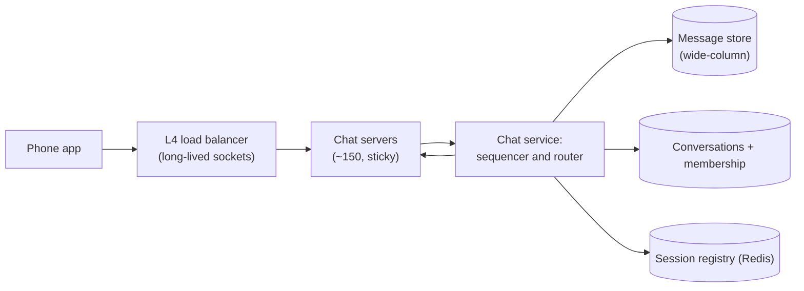
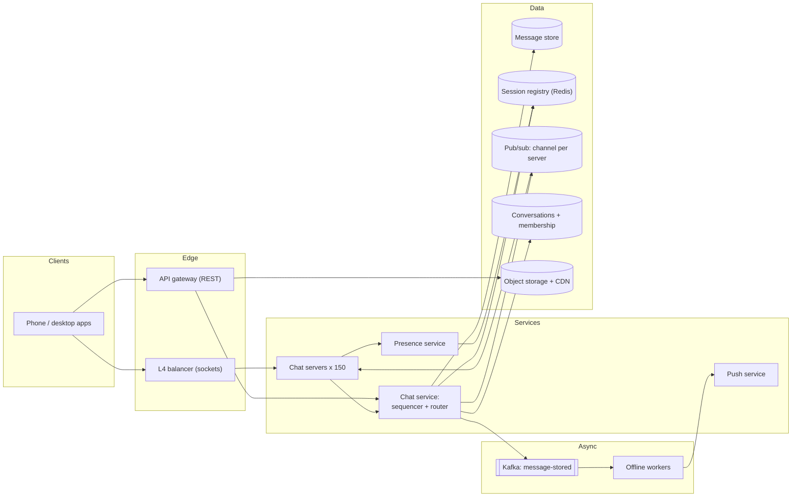
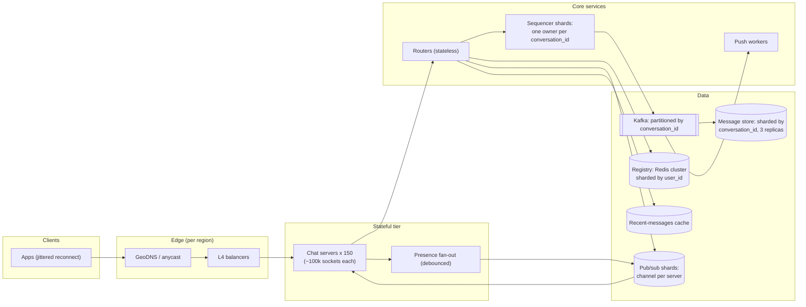

# Mock HLD interview: chat system

## Setup

**Role**: SDE2, backend, a messaging product. **Round**: 45 minutes, one interviewer who owns the connection tier, a whiteboard, no code. **Candidate**: has read [Design a chat system](../hld/case-studies/chat-messenger.md) and rehearsed the clock from [The 45-minute HLD framework](../hld/fundamentals/interview-framework.md).

> **Interviewer:** Design a messaging service like WhatsApp. One-to-one and group chats, delivered in real time when the recipient is online and on reconnect when they are not, with sent, delivered and read indicators. I care most about what happens between two people who are connected to different servers.

That last sentence is the round's real prompt: the interviewer has told you where the marks are before you have drawn anything. Five rubric rows:

| Row | What earns the mark |
|---|---|
| Requirements and scope | Group size, multi-device and delivery guarantees pinned down, because each one multiplies the fan-out |
| Estimation | The socket count derived, not asserted, from the [latency and estimation tables](../cheatsheets/latency-and-estimation.md) |
| High-level design | A stateful tier plus a way to find a user, both on the board by minute 24 |
| Depth on the cruxes | Ordering, the registry, and delivery state, each with a number and a failure mode |
| Communication and recovery | Taking a counter-example without arguing; following the interviewer's stated interest |

The archetype is **real-time stateful**: the hard resource is open connections, not QPS, and the hard correctness property is order.

## Timeline

| t (min) | Phase | Interviewer says | Candidate says, draws, writes | Artifact |
|---|---|---|---|---|
| 0-2 | Prompt | The prompt, with the cross-server hint | Restates it, names the hint as the crux | Plan on the board |
| 2-6 | Requirements | Answers four clarifiers; one lands two constraints at once | Functional verbs, latency and durability targets, out of scope | Requirements list |
| 6-11 | Estimation | "Where does 100k come from?" | Messages/s, then the socket count, then servers and registry size | Estimation table, "10M sockets" boxed |
| 11-15 | API and data model | "Why is `seq` in every frame?" | One WebSocket plus four REST calls; messages by conversation | Frame list, entity sketch |
| 15-19 | v1 design | Silent | Draws the stateful tier, the registry, one write path | **Diagram v1** |
| 19-25 | Ordering | "Two servers, 200 ms of skew. What order?" | Proposes server timestamps, is broken, switches to per-conversation `seq` | Sequencer marked as a single owner |
| 25-31 | Registry and crashes | "A server dies with 100k sockets" | Heartbeats, lazy cleanup, reconnect with jittered backoff | **Diagram v2** with pub/sub and push |
| 31-37 | Delivery state | "2 billion messages a day of receipts?" | Cursors instead of per-message events; forward-only states | Receipt cursor arithmetic |
| 37-41 | Groups and presence | "Now make it 500 members" | One write, one publish per server, debounced presence | **Diagram v3** after the deep dives |
| 41-44 | Wrap-up | "What do you shed under load?" | Degradation order, reconnect storms, multi-region | Trade-off list |
| 44-45 | Close | "What did you get wrong?" | Names the ordering mistake and what caused it | — |

## Transcript

### Minutes 0-6: pin the fan-out multipliers

> **Candidate:** You have already told me the interesting part — two people on different servers — so I will make sure the registry that resolves that is on the board early. Four questions first. Groups, or one-to-one only?

> **Interviewer:** Both. Cap groups at 500 members. And two things you should know now: a user can have up to five devices, all of which must converge on the same history, and message bodies are end-to-end encrypted, so the server routes ciphertext.

> **Candidate:** That is three constraints in one answer, and they all push the same way. Multi-device means my sessions are keyed per *device*, not per user, so the fan-out unit is a device. Encryption means the server keeps metadata only — conversation, sender, sequence, receipts — and that server-side search, link previews and content moderation are out. And it means push notifications carry no body. Second question: what does "never lost" mean here?

> **Interviewer:** Once the sender sees a single tick, the message must survive anything. Duplicates must never be visible to the user.

> **Candidate:** So durable before ack, and effectively-once at the user level: at-least-once delivery plus an idempotent consumer. Third: ordering — total order per conversation, or globally?

> **Interviewer:** Per conversation. Nobody cares how two different chats interleave.

> **Candidate:** Good, that is much cheaper. Fourth: latency target?

> **Interviewer:** Under half a second p99 from tap to the other screen when both are online.

> **Candidate:** Then, scope. Functional: send to a one-to-one or group conversation, deliver to every online device including the sender's others, deliver on reconnect, push when offline, sent/delivered/read, presence. Non-functional: 500 ms p99 delivery, 200 ms p99 for the sender's ack, replicated three ways before that ack, four nines on send and receive. Out of scope: calls, spam detection, search over history, the key-exchange protocol, media processing.

### Minutes 6-11: the number that shapes everything is not QPS

> **Candidate:** 50 million daily active users at 40 messages a day is 2 billion messages a day. Over ten to the fifth seconds that is 23 thousand a second, about 70 thousand at a three-times peak. That is a small number — a single relational primary does 5 to 20 thousand writes a second, so 70 thousand is a handful of shards. Reads are the same order as writes, roughly one to one, so there is no feed to precompute and no read/write ratio to exploit. Which means the interesting resource is somewhere else.

> **Candidate:** It is connections. If twenty percent of 50 million users are online at peak, that is **10 million concurrent WebSockets**, held open for hours. I will assume 100 thousand sockets per server — that is an assumption I would validate with a load test, and it depends on the memory per connection more than on CPU. Ten million over a hundred thousand is 100 servers, times 1.5 for headroom, so about 150.

> **Interviewer:** Where does 100k come from?

> **Candidate:** Experience rather than a table, which is why I flagged it. It is the number I would prove first, because the whole fleet size is linear in it: at 50 thousand per server I need 300 machines, at 200 thousand I need 75. The design does not change either way — the cost does.

> **Candidate:** Three more. Storage: 2 billion messages at about 100 bytes is 200 gigabytes a day, so 73 terabytes a year, 220 with three replicas. At 5 to 10 thousand writes a second per wide-column node and 70 thousand peak writes times three replicas — 210 thousand node-writes a second — that is 25 to 40 nodes. Session registry: 10 million sessions at roughly 100 bytes is about a gigabyte, which is nothing; but each send does about three registry lookups, so 70 thousand sends a second is 200 thousand lookups a second, and a Redis instance does about 100 thousand operations a second, so four shards. Bandwidth: 70 thousand frames a second at a kilobyte each is 70 megabytes a second in and roughly double that out — under a gigabit, never the bottleneck.

> **Candidate:** So the headline is: **the state, not the throughput, is the problem.** Ten million sockets means users are pinned to specific machines, which means every sender needs a way to look up where a recipient is.

### Minutes 11-15: frames and the partition key

> **Candidate:** Messaging rides one WebSocket per device. On connect the client sends its bearer token, `device_id` and a map of last-synced sequence numbers. Over the socket: a `send` frame carrying `{conversation_id, client_msg_id, body}`, which is acked with `{client_msg_id, seq, sent_at}`; and `delivered` and `read` frames carrying `{conversation_id, up_to_seq}`. Everything not latency-critical is REST: `GET /v1/conversations/{id}/messages?after_seq=&limit=`, `POST /v1/conversations`, `POST /v1/devices` for the push token, and a presigned media upload.

> **Interviewer:** Why is `seq` in every frame?

> **Candidate:** So the client can detect its own gaps. If a device holds 41 and the next frame is 43, it knows 42 exists and asks for it rather than trusting the socket to have been reliable. It also makes every cursor in the API an integer: `after_seq`, `read_up_to_seq`, `last_synced_seq`.

> **Candidate:** Data model: `MESSAGE` partitioned by `conversation_id` and clustered by `seq` descending, in a wide-column store. Every query the product asks — latest fifty, everything after N, everything before N — is one partition range scan, no joins, no secondary index. `client_msg_id` is stored alongside as the idempotency key. Memberships and conversations in a key-value store keyed by `conversation_id`, with a reverse index from user to conversations. Sessions in Redis, which is a cache and not a table.

### Minutes 15-19: v1 on the board

**Diagram v1 at minute 17: a stateful socket tier, a service that writes messages, and the registry that answers "where is Bob?".**

> **Candidate:** One send: Ann's frame arrives on the server holding her socket, that server hands it to the chat service, which dedups on `(sender_id, client_msg_id)`, assigns a sequence number, writes one row with three replicas acknowledging, and acks Ann. Her tick appears after exactly one durable write, so the 200 millisecond budget is one store round trip. Then the service asks the registry where Bob's devices are and pushes the frame to those servers. Stickiness is free here — a WebSocket is one TCP stream, so an L4 balancer that assigns it once is all the affinity I need.

### Minutes 19-25: the wrong turn, broken by clock skew

> **Interviewer:** How do you order messages inside a conversation?

> **Candidate:** By the server's arrival timestamp. The chat service stamps each message when it accepts it, and every client sorts by that.

> **Interviewer:** Ann is on server 17, Bob on server 203. Their clocks differ by 200 milliseconds. Ann sends "no", Bob replies "yes" 50 milliseconds later. What does each phone show?

> **Candidate:** Bob's reply gets the smaller timestamp, so both phones show the answer above the question — and worse, they might not even agree with each other, because a client that received the frames live could sort differently from one that resyncs from the store. Server time does not give a total order across servers. Let me take that back.

> **Candidate:** The order has to come from a **single owner per conversation**. Each `conversation_id` maps to one sequencer — a shard of the chat service chosen by consistent hashing, or a Redis `INCR` on a per-conversation key in the simplest version — and that owner assigns a dense, monotonic `seq`. Dense matters: a global time-sortable id would also give a total order, but the ids are sparse, so a client that holds 41 and receives 4,829 cannot tell whether it missed anything. With a counter, "41 then 43" is a detectable gap.

> **Interviewer:** What if the sequencer is a hot spot?

> **Candidate:** One counter per conversation is cheap, and conversations shard perfectly, so the hot case is a single very busy group rather than the fleet. At 500 members that is bounded. Above that I would stop pushing entirely and switch that conversation to fan-out on read, which I will come to. And I would keep a time-sortable global id as a secondary attribute for export and cross-conversation features — just never as the sort key.

### Minutes 25-31: the registry, and a server dying with 100k sockets

> **Candidate:** The registry is `HSET sessions:{user_id} {device_id} {server_id}`, written when a socket opens and deleted on a clean close. Every chat server subscribes to its own pub/sub channel; a router that wants to reach Bob looks up his devices, groups them by server, and publishes one envelope per server. No chat server ever talks to another chat server directly, which is what keeps 150 machines from becoming a mesh.

> **Interviewer:** A server dies with 100 thousand sockets. Walk me through the next sixty seconds.

> **Candidate:** Nobody deletes 100 thousand hash fields, so the registry is stale for a while and that has to be safe. Two heartbeats make it safe. A ping and pong per socket every 30 seconds, so a server notices half-open connections — the phone that went into a tunnel and never sent a FIN. And a liveness key per server, refreshed every five seconds; when it expires, routers publishing to that channel find no subscriber, treat those users as offline, drop the session entries lazily and send a push instead. Meanwhile the clients see a dead socket and reconnect with jittered exponential backoff, land on other servers through the balancer, rewrite their registry entries, and sync with `after_seq`.

> **Candidate:** Nothing is lost, because the socket was never the source of truth. The message store is. The registry is a **rebuildable cache**: if I lose all of Redis, the cost is one reconnect storm, which I absorb with the jitter and with a connection-rate cap at the balancer — not with a replicated database.

**Diagram v2 at minute 29: pub/sub per server, a log feeding push workers, presence and the REST path added.**

### Minutes 31-37: receipts without two billion writes

> **Interviewer:** Sent, delivered and read for 2 billion messages a day. That is a lot of receipt writes.

> **Candidate:** It would be, if receipts were per-message events. They are **cursors**. A device sends `delivered {up_to_seq: 128}` once per batch, and read state is the conversation's `read_up_to_seq`. So the server writes one row per device per batch instead of one per message, and every question about a message becomes a comparison: is `seq <= up_to_seq`? For a group I store a delivered and a read counter per message rather than 500 rows, and the sender's indicator is the *weakest* state across members — one member who has not received it keeps the whole message at one tick.

> **Candidate:** The states are forward-only. A `delivered` ack that arrives after a `read` cursor must not regress the message to delivered; the update is a maximum, not an assignment. That single rule removes an entire class of flickering-tick bugs.

> **Interviewer:** And offline users?

> **Candidate:** No separate queue. I nearly drew one — a per-user inbox — and it is the wrong instinct, because it makes two sources of truth that can disagree. The message store already holds everything indexed by `seq`, so a returning device just asks for `after_seq`. The only extra machinery is a push notification to wake the device, sent by workers consuming the `message-stored` log for users the registry says have no live session. Collapse them per conversation — "3 new messages" — and, since bodies are encrypted, the push carries no content at all.

### Minutes 37-41: groups and presence

> **Interviewer:** Now make it a group of 500.

> **Candidate:** The message is still written **once**. What multiplies is delivery, and the unit of work is the server, not the socket: look up 500 members' sessions in one pipelined registry call, get back maybe 120 live devices spread over 40 servers, and publish 40 envelopes rather than 120. At 70 thousand messages a second, mostly one-to-one with groups averaging tens of online members, that lands around 150 thousand socket writes a second across the fleet and a few tens of thousands of publishes — inside one pub/sub shard's 100 thousand operations a second, with a second shard keyed by server id when it is not.

> **Candidate:** Above 500 I would stop pushing. A 100 thousand-member channel becomes fan-out on read: store once, publish a tiny "new seq available" signal, let clients pull by `seq` when they open it, and turn per-member receipts into aggregate counters.

> **Candidate:** Presence is the same problem with a worse ratio. One user with 300 contacts flipping online costs 300 deliveries, and a phone in a lift flips several times a minute. Three fixes: derive online state from the registry rather than a second heartbeat, debounce transitions with a 30-second grace period before publishing "offline", and fan out only to contacts who currently have the app open — whose servers the same registry already knows. "Last seen" is written lazily on disconnect.

**Diagram v3 at minute 40: sharded registry and pub/sub, sequencer shards backed by a partitioned log, message store sharded by conversation.**

> **Candidate:** The one structural change is that the sequencer now appends to a log partition keyed by `conversation_id` with all replicas acknowledging, and acks the sender from the log rather than from the store. Ordering and durability become the same hop, the store and push workers become consumers, and a sequencer that dies rebuilds its counters from the tail of its partitions. Log lag then delays push notifications and history writes, never delivery to someone who is already online — worth saying out loud, because it is the reassuring answer to "what if Kafka backs up".

### Minutes 41-45: shedding load, and one admission

> **Interviewer:** You are over capacity. What do you shed?

> **Candidate:** In this order: typing indicators first — fire-and-forget, at most one every three seconds, never stored. Then presence fan-out. Then read receipts, which can be batched harder or delayed. Never the message path. Beyond shedding: reconnect storms are capped at the balancer, stale registry entries degrade to "offline plus a push", and hot conversation partitions are bucketed as `(conversation_id, seq // 10_000)` so no partition grows without bound. Multi-region: a conversation is pinned to a home region where its sequencer lives, and members elsewhere pay one cross-region round trip on send — 70 to 150 milliseconds, which still fits inside the 500 millisecond budget.

> **Interviewer:** What did you get wrong today?

> **Candidate:** Ordering by server timestamp. I reached for it because it is free and it works in a single-server prototype, and I did not stop to ask what happens when two servers with different clocks touch the same conversation. The lesson I want to keep is narrower than "clocks are bad": any property that has to hold across machines needs a single owner, and for a conversation that owner is cheap.

!!! tip "Interview tip"
    When the interviewer plants a hint in the prompt — here, "two people connected to different servers" — treat it as the marking scheme. This candidate opens with "you have already told me the interesting part" and puts the registry on the board at minute 17. That is four rubric rows moving at once, and it costs one sentence.

## Artifacts

- The full design with the transport comparison, the storage layout and the follow-up bank: [Design a chat system](../hld/case-studies/chat-messenger.md). The clock it follows: [The 45-minute HLD framework](../hld/fundamentals/interview-framework.md).
- The runnable version is `code/hld/chat_router.py`: a session registry keyed per device, a pub/sub bus with one channel per server, and a chat service that dedups on `client_msg_id`, assigns `seq` under a lock, and routes outside it so one slow socket never delays the next sequence number.
- Reproduce from memory: the socket arithmetic, the registry key shape, and the three diagrams.

## Debrief

| Dimension | Below bar | Meets SDE2 | Exceeds |
|---|---|---|---|
| Requirements and scope | Misses multi-device, then discovers mid-design that fan-out is per device | Unpacks a three-part answer immediately: "the fan-out unit is a device" | Draws the consequence of encryption unprompted: no search, no previews, no push body |
| Estimation | Quotes 10M sockets with no derivation, or stops at messages per second | Derives sockets from DAU, then servers and registry shards from sockets | Flags the assumption and prices both sides: "at 50 thousand per server I need 300 machines, at 200 thousand I need 75" |
| High-level design | A stateless tier and a queue, with no answer to "where is Bob?" | Registry plus channel-per-server on the board by minute 17; write path narrated | "Nothing is lost, because the socket was never the source of truth" |
| Depth on the cruxes | Ordering by timestamp, left standing; receipts as per-message rows | Per-conversation `seq` with gap detection, cursor receipts, per-server group publishes | Forward-only receipt states, and the log-backed sequencer with "log lag delays push, not delivery" |
| Communication and recovery | Argues that 200 ms of skew is unlikely | Concedes on the counter-example and rebuilds in one turn | Names the mistake unprompted at minute 44 and extracts a rule from it |

### What the interviewer wrote down while you talked

- **min 1** — "picked up the hint in my prompt and repeated it back as the crux."
- **min 4** — "gave it three constraints at once; unpacked all three. Multi-device to per-device sessions was instant."
- **min 8** — "labelled 100k sockets/server as an assumption *before* I asked. Then priced the sensitivity."
- **min 17** — "v1 has a registry in it. Most candidates draw a queue here and stall."
- **min 21** — "timestamps. Took the skew example in one breath, no defence, correct replacement."
- **min 22** — "'dense matters' — knew why a Snowflake id is not a substitute. That is the difference between reading and understanding."
- **min 34** — "self-caught the per-user inbox before I could object."
- **min 44** — "named its own error and generalised it. Hire."

Hire at SDE2. The reservation on file is thin: the ordering turn cost roughly two minutes, and media never got drawn.

!!! warning "Common mistake"
    Ordering a conversation by a timestamp — client or server — is the single most common failure in this round, because it is invisible until two machines are involved. It survives every demo and breaks in production the first time clock skew and a resync coincide, and the symptom users report is "my chat reads differently on my laptop". Assign a dense per-conversation counter from one owner, and make every cursor in your API that counter.

## Practice variants

Do each alone, on a clock, out loud.

1. **Slack, not WhatsApp.** Channels with up to 100 thousand members, threads, and full-text search over history — so no end-to-end encryption. Which parts of this design invert, and what does search cost you in the write path? Twenty minutes.
2. **No servers you control.** Same product, but delivery must survive an entire region failing without losing a message or reordering a conversation. Where does the sequencer live, and what does a member in the failed region see? Fifteen minutes.
3. **One tenth the scale, ten times the guarantees.** 5 million daily active users, but every message must be legally retained for seven years and auditable. Redo the storage estimate and say what changes in the ack path. Fifteen minutes.

## Related

- [Design a chat system](../hld/case-studies/chat-messenger.md) — the full design, including the transport table and the multi-region discussion
- [Networking for system design](../hld/fundamentals/networking-essentials.md) — WebSocket against long polling and SSE, L4 against L7, keepalives and half-open connections
- [The 45-minute HLD framework](../hld/fundamentals/interview-framework.md) — the six-step clock this transcript follows
- [Time, clocks and ordering](../hld/fundamentals/time-and-ordering.md) — why the minute-21 counter-example works
- [Latency numbers and estimation tables](../cheatsheets/latency-and-estimation.md) — the messages, storage and node capacity figures spoken at minutes 6 to 11
