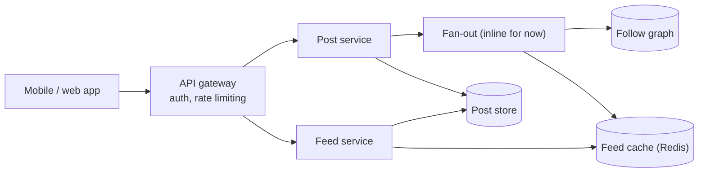
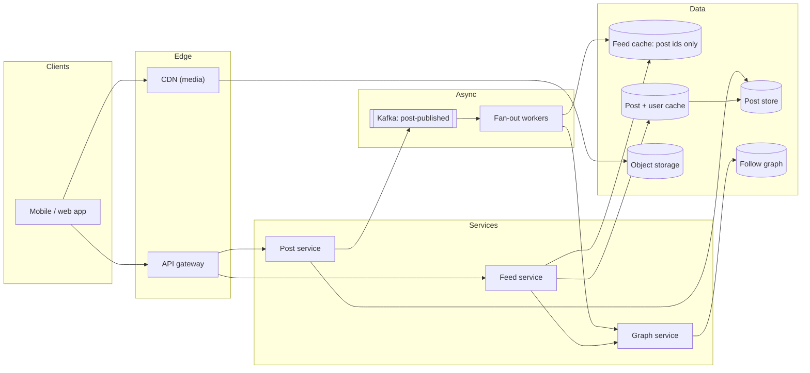
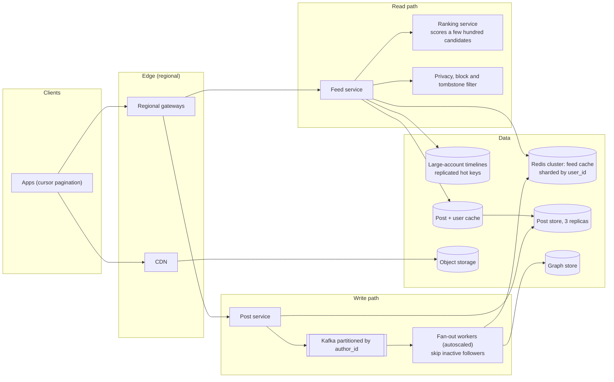

# Mock HLD interview: news feed

## Setup

**Role**: SDE2, backend, a large consumer social product. **Round**: 45 minutes of high-level design, one interviewer (a senior engineer from the timeline team), a shared whiteboard and no code. **Candidate**: has read [Design a news feed](../hld/case-studies/news-feed.md) and practised the pacing from [The 45-minute HLD framework](../hld/fundamentals/interview-framework.md); this is their first attempt under the clock.

> **Interviewer:** Design the home timeline for a social network. Users follow other users, publish posts — text and sometimes images — and open the app to see posts from the people they follow. Assume the product already exists and you are designing the backend that serves it. Take as long as you need on requirements, but I would like to see a diagram before we are halfway through.

Five rubric rows are graded, and the interviewer fills them in silently while you talk:

| Row | What earns the mark |
|---|---|
| Requirements and scope | Functional verbs, non-functional numbers, an out-of-scope list, and questions that change the design |
| Estimation | Arithmetic said out loud from the [latency and estimation tables](../cheatsheets/latency-and-estimation.md), each number attached to a consequence |
| High-level design | A complete v1 by minute 24, both paths narrated end to end, every functional requirement served |
| Depth on the cruxes | Two or three hard decisions, each with options, the number that separates them, a pick and a failure mode |
| Communication and recovery | Driving the room, conceding cleanly under pushback, keeping the clock |

The archetype is **read-heavy fan-out**: reads dwarf writes, the expensive work is duplication, and the interesting failures come from skew.

## Timeline

| t (min) | Phase | Interviewer says | Candidate says, draws, writes | Artifact |
|---|---|---|---|---|
| 0-2 | Prompt | States the prompt; asks for a diagram by the halfway mark | Restates it in one sentence, announces a plan for the 45 minutes | Plan in the corner of the board |
| 2-6 | Requirements | Answers four clarifiers; one answer is not what the candidate expected | Five functional verbs, four non-functional numbers, an out-of-scope list | Requirements list, ticked off later |
| 6-10 | Estimation | Silent, then "where did 200 come from?" | Speaks the arithmetic: posts/s, reads/s, fan-out writes/s, cache size | Estimation table, 100:1 and 200x circled |
| 10-14 | API and data model | "What is in the cursor?" | Four endpoints, four entities, one store each, partition keys named | API and entity list |
| 14-18 | v1 design | Silent; leans in at the fan-out arrow | Draws the skeleton, narrates one write then one read | **Diagram v1** |
| 18-24 | v1 walk-through | "What happens when the account with 100M followers posts?" | Names the crux before being asked, answers it with the hybrid | Threshold on the fan-out arrow |
| 24-30 | Deep dive 1 | "So the cache holds what, exactly?" | Proposes rendered feed pages, is pushed back, concedes, switches to ids | **Diagram v2**: log, workers, pull path |
| 30-36 | Deep dive 2 | "Size it for me. What if a shard dies?" | Sizing arithmetic, rebuild path, single-flight lock | Redis sizing beside the cache box |
| 36-40 | Deep dive 3 | "You said ranked. Where does ranking happen?" | Two-stage candidate generation and scoring; cursor carries the score | **Diagram v3** after the deep dives |
| 40-44 | Wrap-up | "What breaks first at 10x?" | Fan-out lag, hot keys, thundering herd, and the fix for each | Trade-off list |
| 44-45 | Close | "Anything you would change?" | Names the one thing they would revisit and why | — |

## Transcript

### Minutes 0-6: restate, then ask only what changes the design

> **Candidate:** So: a follow graph, a publish path, and a read path that assembles posts from everyone you follow, at consumer scale. Before I draw anything I want four answers, then numbers, then a diagram by about minute eighteen and deep dives after that. First: is the feed chronological or ranked?

> **Interviewer:** Ranked. There is a ranking service already; it takes candidate posts and a viewer and returns them scored. The model is retrained weekly and the feature set changes with it.

> **Candidate:** That is not the answer I was hoping for — chronological is easier — but it is useful, because it tells me where ranking must *not* live. If the model changes weekly I cannot bake scores into anything I store, so whatever I precompute has to be ordered by something stable and scoring happens at read time on a small candidate set. Second: what is the follower distribution?

> **Interviewer:** Median around 200. The tail is long: the largest account has about 100 million followers, and a few thousand accounts are over a million.

> **Candidate:** That is the shape I expected. Third: if I refresh and a post from two seconds ago is missing, is that a bug?

> **Interviewer:** Not a bug. Seconds are fine. A feed that fails to load is a bug.

> **Candidate:** Availability over consistency, then. Fourth: media?

> **Interviewer:** Images, up to four per post. No video.

> **Candidate:** Then here is my scope. Functional: publish a post, delete a post, follow and unfollow, fetch the home feed paginated, show author plus counts. Non-functional: read p99 under 500 ms, publish acknowledged in under 200 ms, four nines on reads — 52.6 minutes of downtime a year, so nothing in the read path can need a manual failover — and a published post is never lost. Out of scope: the ranking model itself, ads, notifications, search, and the comments and likes services, whose counters I will consume rather than design. Anything you want pulled back in?

> **Interviewer:** No, that is the right cut. Numbers.

### Minutes 6-10: the arithmetic, spoken

> **Candidate:** Give me 300 million daily active users and half a post per user per day. That is 150 million posts a day. A day is ten to the fifth seconds, so 1.7 thousand posts per second average, five thousand at a three-times peak. Reads: 300 million times fifty feed opens a day is fifteen billion, which is 175 thousand per second average and about 500 thousand at peak. The read-to-write ratio is a hundred to one, and that alone says I precompute feeds rather than assemble them on demand.

> **Candidate:** Now the number that actually decides the architecture. If I precompute by pushing each post into every follower's feed, the amplification is the median follower count: 150 million posts times 200 followers is 30 billion cache appends a day. Over ten to the fifth that is 300 thousand per second; with the real 86,400 it is nearer 350 thousand, call it a million at peak. Two hundred times the post rate, which is why fan-out cannot be inline with the publish call.

> **Interviewer:** Where did 200 come from?

> **Candidate:** The median you gave me. It is the right multiplier for the *typical* post and the wrong one for the tail — one post from the 100-million-follower account is 100 million appends, a third of a normal day's fan-out for a single post. I will treat that as a separate case rather than pretend the average covers it.

> **Candidate:** Two more. Storage: 150 million posts at a kilobyte of text is 150 gigabytes a day, roughly 55 terabytes a year, 165 with three replicas — that does not fit one box, so the post store is sharded from day one. Media at ten percent of posts carrying a megabyte is 15 terabytes a day, which never goes near a database; object storage and a CDN. Feed cache, if I store ids: 300 million users times 800 entries times 16 bytes is about 3.8 terabytes. And the egress: 175 thousand reads a second, twenty posts each, a kilobyte a post is 3.5 gigabytes a second, about 28 gigabits across the API tier — a fleet-sizing problem, not a design problem.

> **Interviewer:** Do you need 300 million users cached?

> **Candidate:** Probably not, and I do not know the number. What fraction of users open the app in a given week?

> **Interviewer:** About forty percent.

> **Candidate:** Then I cache the active forty percent and rebuild the rest on demand: 1.5 terabytes instead of 3.8. I also skip fan-out to anyone who has not logged in for thirty days, which cuts the appends roughly in half.

### Minutes 10-14: API and data model

> **Candidate:** Four endpoints. `POST /v1/posts` with an idempotency key header, returning 201 with the post id, acknowledged once the post is durable and *before* fan-out. `GET /v1/feed?limit=20&cursor=...` returning posts and a next cursor. `DELETE /v1/posts/{id}`. `POST /v1/users/{id}/follow` and its delete, both idempotent. The user id always comes from the token, never the body.

> **Interviewer:** What is in the cursor?

> **Candidate:** For a chronological feed, the sort key of the last item — created-at plus post id, base64-encoded so clients treat it as opaque. Offsets are wrong here: a post arriving between page one and page two shifts everything and the reader sees an item twice or misses one. Since the feed is ranked, the cursor has to carry the score as well as the id, or a session id that pins a frozen candidate set for the scroll.

> **Candidate:** Four entities. Posts, keyed by a time-sortable 64-bit post id in a wide-column store partitioned by that id's hash — writes are append-only, reads are by id, no joins. The follow graph as two adjacency lists per user, `followers:{id}` and `following:{id}`, sharded by user id; a graph database is more than "who follows whom" needs. The feed cache, one capped list per user in Redis, sharded by user id. Media as object keys, bytes in object storage.

### Minutes 14-18: v1 on the board

**Diagram v1 as drawn at minute 16: the skeleton, with fan-out still inline so the interviewer can see the problem.**

> **Candidate:** One write: the client posts, the gateway authenticates, the post service writes one durable row and returns 201. One read: the feed service reads the caller's cached list, takes twenty ids, fetches those posts, returns them with a cursor. I have drawn fan-out inline on purpose because I want to delete that arrow in a moment — 200 cache appends inside a request that has a 200 millisecond budget is not a thing I can do, and a same-datacenter round trip is already 500 microseconds each.

### Minutes 18-24: naming the crux before it is handed to you

> **Interviewer:** What happens when the account with 100 million followers posts?

> **Candidate:** That is the crux, and I would have raised it in the next sentence. Three options. Push — fan out on write — costs order-followers appends per post and gives an O(1) read; it is right for the median author and catastrophic for that account, because one post is 100 million writes and most of those feeds will never be opened. Pull — fan out on read — costs nothing at publish and makes every read a merge across everyone you follow; at 500 thousand reads a second each touching hundreds of timelines, that is not survivable either. So: hybrid. Push for authors below a threshold, pull for the rest.

> **Interviewer:** Where do you put the threshold?

> **Candidate:** Somewhere between five and fifty thousand followers, and I would set it by measurement rather than taste: the threshold is where the cost of pushing one post exceeds the cost of the read-time merges it saves. It should also be adaptive — the fan-out worker checks the author's follower count each time, so an account that goes viral this afternoon flips to pull mode without anyone deploying anything. The reason the read side stays cheap is that readers follow *tens* of large accounts, not thousands, so the merge is a handful of extra list reads.

> **Candidate:** And publish gets acknowledged before any of it. The post service writes durably, publishes a `post-published` event, and returns. Fan-out workers consume the event. If the workers fall behind, feeds are stale by a minute, which is exactly the degradation I want given you told me seconds of staleness are acceptable.

### Minutes 24-30: the wrong turn, and the way back

> **Interviewer:** So the cache holds what, exactly?

> **Candidate:** I would cache the assembled feed page — the twenty posts as rendered JSON, ready to return. That kills the hydration step entirely; a feed read becomes one Redis get.

> **Interviewer:** The like count on a post changes several times a second, and the author can edit the text. What invalidates your rendered page?

> **Candidate:** …Everything does. That is a bad answer and I will withdraw it. Any change to any of the twenty posts — a like, an edit, a delete, a privacy change, a block — invalidates every rendered page that contains it, and a popular post is in millions of pages. I have turned one write into an unbounded invalidation fan-out, which is worse than the problem I was trying to solve.

> **Candidate:** The cache stores **post ids only**. Sixteen bytes instead of a kilobyte, so 800 entries per user is about 13 kilobytes rather than 800; edits become free because the post cache is the only place content lives; deletes become a tombstone check at read time. The rule I should have applied is: caches hold stable facts, and "which posts, in what order" is stable while "what the post currently says and how many likes it has" is not. Hydration then costs one multi-get against a post cache — recent posts are hot, so that hit rate is high — plus a user cache for handles and avatars.

> **Interviewer:** Good. Redraw it.

**Diagram v2 at minute 28: fan-out moved behind a log, ids in the feed cache, hydration through a second cache, media off to the side.**

> **Candidate:** The read path now has three steps: pull my pushed ids from the cache, ask the graph service which large accounts I follow and merge their recent post ids in, then hydrate twenty ids through the post cache. Duplicates do not matter — the merge is by id, so an id that arrived twice is filtered once.

### Minutes 30-36: sizing the cache and surviving a dead shard

> **Interviewer:** Size it for me. And what if a shard dies?

> **Candidate:** Sizing first. Active users are 120 million — forty percent of 300 million — times 800 ids times 16 bytes, so about 1.5 terabytes. At 64 gigabytes of usable memory per node that is roughly 25 nodes for the data, and I want a replica each, so call it 50, sharded by user id with consistent hashing so adding nodes moves a fraction of keys rather than all of them. Throughput check: a Redis instance does on the order of 100 thousand operations a second, and the peak fan-out is around a million appends a second, so the write side alone needs the fleet I already have — which is a good sign the sizing is not accidental. Workers batch appends per shard to make that cheaper.

> **Candidate:** Structure: a list per user, push then trim to 800, or a sorted set scored by timestamp if I want "everything since this cursor" as one range query. Lists are cheaper; sorted sets make pagination nicer. I would start with lists.

> **Candidate:** A dead shard is a *latency* event, not a data-loss event, and I want to say that clearly: the feed cache is derived state and can always be rebuilt from the post store and the graph. A missing key means "rebuild from the pull path": read the user's following list, take the newest posts from each, merge, write it back. Two guards. First, bound the rebuild — the top 200 followees by recency, not all 5,000, or one user with a huge following list stalls a shard. Second, a single-flight lock per user key, because the moment a shard fails over, every request for every key on it misses at once and I do not want a million simultaneous rebuilds.

> **Interviewer:** What if a user follows a thousand large accounts?

> **Candidate:** Then my cheap read-time merge is not cheap. I would cap the pull side — merge the top K by recent posting activity — or precompute a per-user digest of large-account posts hourly, which is fan-out on write again but at one write per hour rather than per post. It is rare enough that I would measure before building it, and I would say so rather than adding a component speculatively.

### Minutes 36-40: where ranking goes

> **Interviewer:** You said ranked at the start. Where does ranking happen?

> **Candidate:** Two stages, and the split is exactly because the model changes weekly. Stage one is candidate generation, which is what we have built: my pushed ids plus the pulled large-account ids, a few hundred items, ordered chronologically. Stage two is scoring: the feed service hands those candidates and the viewer to the ranking service, gets scores back, and returns the top twenty. The cache stays chronological forever, because chronological order is a fact about the world and a score is a fact about this week's model.

> **Candidate:** Two consequences worth stating. The ranking call is on the read path, so it needs its own latency budget inside the 500 millisecond p99 and a fallback: if it times out, serve chronological rather than serve nothing. And the cursor now carries score plus post id, or pins a candidate set for the scroll session, otherwise a rescore between page one and page two duplicates items — the same failure offset pagination has.

**Diagram v3 at minute 39: after the deep dives — ranking as a read-path stage, hot large-account timelines split out, filters applied after hydration.**

> **Candidate:** Two things changed that are not cosmetic. Privacy and blocks are evaluated *after* hydration, against a cached allow set — never precomputed into the feed cache, because relationships change and a stale precomputed decision is a privacy incident rather than a stale feed. And deletes are tombstones: mark the post deleted, filter it on read, let a low-priority sweeper remove ids later. Nobody scrubs 100 million caches synchronously for one delete.

### Minutes 40-45: what breaks first

> **Interviewer:** Ten times the traffic. What breaks first?

> **Candidate:** Fan-out lag, and it is the failure I am happiest with: Kafka buffers, workers autoscale, feeds go stale by a minute. Partitioning the topic by author id keeps one author's posts in order while that happens. Second, hot keys — everyone opens the app after one huge post, and that account's pulled timeline is a single key taking a large share of reads. Fix: replicate that key across several shards with a suffix and pick one at random per read. Third, the thundering herd on rebuilds after a shard loss, which is the single-flight lock I described. Fourth, hot partitions in the post store, avoided because post ids shard by hash rather than by time, so a burst spreads.

> **Candidate:** The consistency story in one sentence: everything is eventual except "my own post appears in my own feed immediately", which the client handles by inserting it locally while fan-out catches up.

> **Interviewer:** Anything you would change if you had another week?

> **Candidate:** I would replace the fixed celebrity threshold with a per-author decision that the worker recomputes, because a fixed number is wrong the day someone goes viral, and I would measure the read-side merge cost per user before I built any digest for the thousand-follows case. And I would want the ranking fallback exercised in a game day rather than assumed.

!!! tip "Interview tip"
    The strongest single move in this transcript is at minute 18: the candidate answers the celebrity question with "that is the crux, and I would have raised it in the next sentence", then gives options, a threshold, and how the threshold adapts. Naming your own cruxes converts the interviewer's probe into confirmation of your plan. Announce them the moment the v1 is on the board.

## Artifacts

- The design in full, with the estimation table, the store choices, the hybrid fan-out mechanism and the follow-up bank: [Design a news feed](../hld/case-studies/news-feed.md).
- The working code behind the fan-out deep dive lives in `code/hld/fanout.py` — `post()` pushes or records depending on the author's follower count, `get_feed()` merges the pushed and pulled sources with `heapq.merge` and filters tombstones, and the cursor helpers implement the opaque `(created_at, post_id)` cursor discussed at minute 12. Read it after the case study; it is the same design with the hand-waving removed.
- The pacing the transcript follows, and the six-step clock behind it: [The 45-minute HLD framework](../hld/fundamentals/interview-framework.md).
- Board artifacts you should be able to reproduce from memory: the requirements list, the estimation table with the 100:1 and 200x ratios circled, and the three diagrams above.

## Debrief

| Dimension | Below bar | Meets SDE2 | Exceeds |
|---|---|---|---|
| Requirements and scope | Starts drawing boxes before asking anything; no out-of-scope list | Four clarifiers, all of which move the design; "Out of scope: the ranking model itself, ads, notifications, search, comments and likes as services" | Uses an answer against itself: "If the model changes weekly, I cannot bake scores into anything I store" |
| Estimation | Quotes 175k reads/s with no arithmetic, or produces a table nothing depends on | Speaks every step: "150 million posts times 200 followers is 30 billion cache appends a day" and attaches each number to a consequence | Interrogates its own multiplier: "It is the right multiplier for the typical post, and it is the wrong multiplier for the tail" |
| High-level design | No diagram by minute 30, or a diagram with no narrated path | v1 at minute 16 with both paths traced, v2 at 28, v3 at 39; every functional verb has a path | Draws the wrong thing deliberately to expose it: "I have drawn fan-out inline on purpose because I want to delete that arrow in a moment" |
| Depth on the cruxes | Describes push fan-out and stops; never mentions the tail | Three dives with options, numbers and a pick: hybrid fan-out, cache contents and sizing, the ranking stage | Adaptive threshold ("an account that goes viral this afternoon flips to pull mode without anyone deploying anything") and the ranking fallback to chronological |
| Communication and recovery | Defends the rendered-page cache with adjectives, or goes silent | Concedes in one sentence and repairs: "That is a bad answer and I will withdraw it" | Extracts the general rule from the mistake: "caches hold stable facts" — the interviewer stops probing cache design after this |

### What the interviewer wrote down while you talked

They are not taking dictation; they are marking moments. The notes on this candidate, with timestamps:

- **min 3** — "asked ranked-vs-chrono first. Took my surprise answer and *used* it. Strong open."
- **min 8** — "did the fan-out multiplication unprompted. Caught its own rounding: 10^5 vs 86,400. Confident with numbers."
- **min 9** — "asked me for the active fraction instead of guessing. Immediately spent it: 3.8 TB down to 1.5 TB."
- **min 16** — "v1 up eight minutes early. Inline fan-out is deliberate — said so before I could ask."
- **min 25** — "*rendered pages.* Real mistake, not a slip. One counter-example was enough."
- **min 26** — "recovered in under a minute, and generalised the lesson. This is the moment I would quote in the write-up."
- **min 33** — "'the feed cache is derived state' — knows the difference between a cache outage and data loss."
- **min 43** — "would revisit the threshold and game-day the ranking fallback. Senior-adjacent instinct, still an SDE2 hire."

The decision was hire at SDE2, with one reservation recorded: the cache-contents wrong turn cost about ninety seconds of a forty-five minute round, and a candidate who had internalised "ids, not posts" would have spent that time on the media pipeline, which never got drawn. Nothing else in the transcript was weak.

!!! warning "Common mistake"
    The mistake to steal from this transcript is not the rendered-page cache — it is what nearly happened after it. The instinct under pushback is to defend: "well, we could invalidate on write". That answer is technically available and it loses the row, because it commits you to an unbounded invalidation fan-out you would then have to design. Restate the counter-example, agree it is fatal, name the replacement, and move. Ninety seconds spent conceding beats eight minutes spent defending.

## Practice variants

Do each of these alone, on a clock, before reading the case study again. Speak out loud; the arithmetic only counts if it is audible.

1. **Chronological only, and deletes must be instant.** Same scale, no ranking service, but a deleted post must disappear from every feed within one second rather than "on the next read". Where does the tombstone filter have to live now, what does that cost per read, and does it change what the cache stores? Fifteen minutes, ending with a diagram.
2. **Instagram, not Twitter.** Every post carries images, the feed is media-first, and the follow graph is mostly symmetric with a much smaller median follower count. Redo the estimation from the media line down — presigned uploads, variant generation, CDN hit rate — and say which parts of the fan-out design are untouched by the change. Twenty minutes.
3. **One tenth of the scale, one tenth of the team.** 30 million daily active users and four engineers. Which components from the v3 diagram do you delete, and what is the first one you add back as you grow? This variant is graded on what you are willing to leave out; a candidate who builds the same architecture at both scales has not understood either. Fifteen minutes.

## Related

- [Design a news feed](../hld/case-studies/news-feed.md) — the full design this transcript performs, including the deep dives that did not fit in 45 minutes
- [The 45-minute HLD framework](../hld/fundamentals/interview-framework.md) — the six-step clock the candidate announces at minute 1
- [Caching and CDNs](../hld/fundamentals/caching-and-cdn.md) — cache-aside, single-flight and hot-key replication, all three used in the deep dives
- [Latency numbers and estimation tables](../cheatsheets/latency-and-estimation.md) — every number spoken between minutes 6 and 10
- [Common SDE2 mistakes in design rounds](../cheatsheets/common-mistakes-sde2.md) — the failure modes this candidate avoided, and the one they did not
