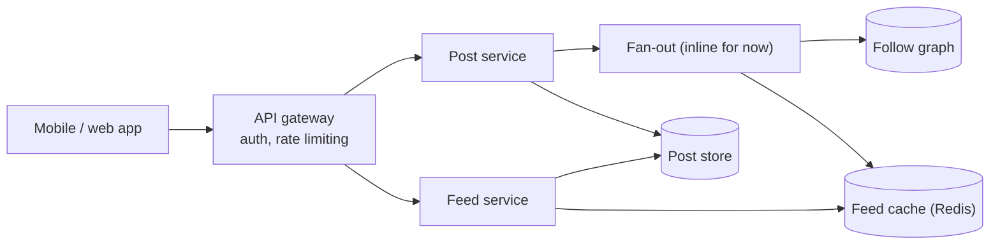
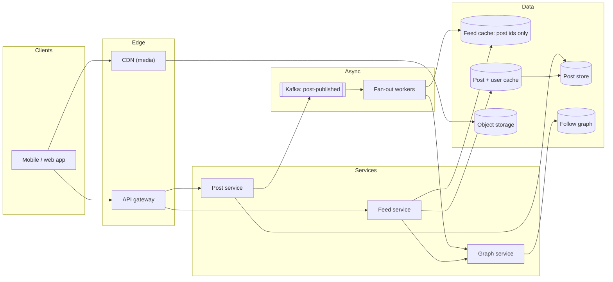
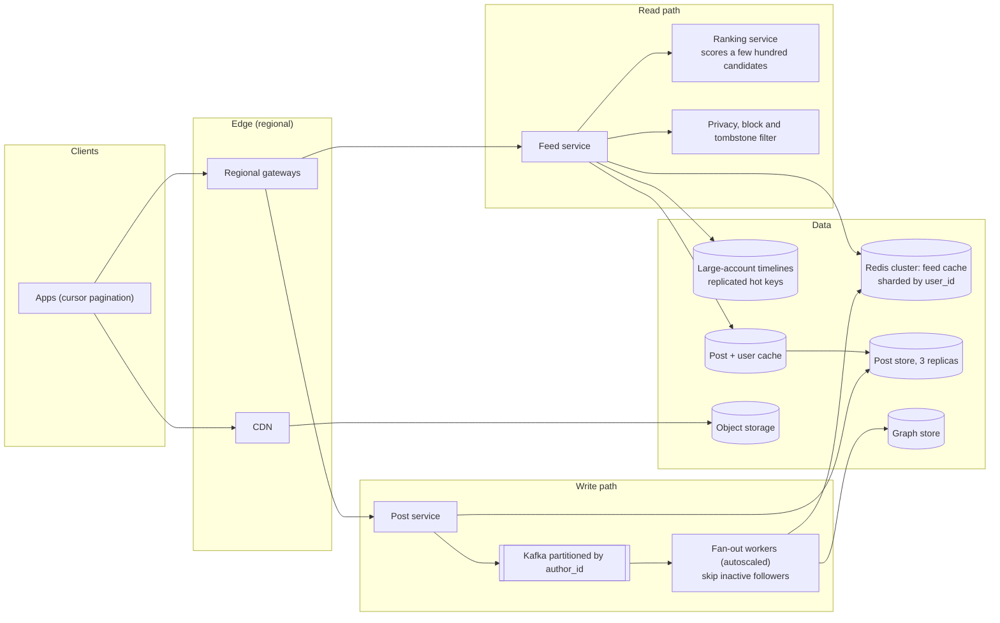

# Mock HLD interview: news feed

## Setup

**Role**: SDE2, backend, a large consumer social product. **Round**: 45 minutes, one interviewer from the timeline team, a whiteboard, no code. **Candidate**: has read [Design a news feed](../hld/case-studies/news-feed.md) and the pacing in [The 45-minute HLD framework](../hld/fundamentals/interview-framework.md); first attempt under the clock.

> **Interviewer:** Design the home timeline for a social network. Users follow other users, publish posts — text and sometimes images — and open the app to see posts from the people they follow. The product exists; you are designing the backend that serves it. Take as long as you need on requirements, but I would like a diagram before we are halfway through.

Five rubric rows, filled in silently while you talk:

| Row | What earns the mark |
|---|---|
| Requirements and scope | Functional verbs, non-functional numbers, out of scope, questions that change the design |
| Estimation | Arithmetic said aloud from the [latency and estimation tables](../cheatsheets/latency-and-estimation.md), each number tied to a consequence |
| High-level design | A complete v1 by minute 24, both paths narrated, every requirement served |
| Depth on the cruxes | Two or three decisions: options, the separating number, a pick, a failure mode |
| Communication and recovery | Driving the room, conceding cleanly under pushback, keeping the clock |

The archetype is **read-heavy fan-out**: reads dwarf writes and the failures come from skew.

## Timeline

| t (min) | Phase | Interviewer says | Candidate says, draws, writes | Artifact |
|---|---|---|---|---|
| 0-2 | Prompt | The prompt; a diagram by the halfway mark | Restates it, announces a plan | Plan in the board's corner |
| 2-6 | Requirements | Answers four clarifiers; one surprises | Five verbs, four numbers, out of scope | Requirements list |
| 6-10 | Estimation | Silent, then "where did 200 come from?" | Speaks the arithmetic: posts/s, reads/s, fan-out, cache | Estimation table, 100:1 and 200x circled |
| 10-14 | API and data model | "What is in the cursor?" | Four endpoints, four entities, partition keys | API and entity list |
| 14-18 | v1 design | Silent; leans in at the fan-out arrow | Draws the skeleton, narrates a write then a read | **Diagram v1** |
| 18-24 | v1 walk-through | "What happens when the 100M-follower account posts?" | Names the crux unprompted, answers with the hybrid | Threshold on the fan-out arrow |
| 24-30 | Deep dive 1 | "So the cache holds what, exactly?" | Proposes rendered pages, is pushed back, switches to ids | **Diagram v2**: log, workers, pull path |
| 30-36 | Deep dive 2 | "Size it. What if a shard dies?" | Sizing arithmetic, rebuild path, single-flight lock | Redis sizing beside the cache box |
| 36-40 | Deep dive 3 | "Where does ranking happen?" | Candidates then scoring; cursor carries the score | **Diagram v3** after the deep dives |
| 40-44 | Wrap-up | "What breaks first at 10x?" | Fan-out lag, hot keys, thundering herd, a fix for each | Trade-off list |
| 44-45 | Close | "Anything you would change?" | The one thing to revisit, and why | — |

## Transcript

### Minutes 0-6: restate, then ask only what changes the design

> **Candidate:** So: a follow graph, a publish path, and a read path that assembles posts from everyone you follow. Before I draw anything I want four answers, then numbers, then a diagram by minute eighteen. First: chronological or ranked?

> **Interviewer:** Ranked. A ranking service exists; it takes candidate posts and a viewer and returns them scored. The model is retrained weekly and the feature set changes with it.

> **Candidate:** That is not the answer I was hoping for — chronological is easier — but it tells me where ranking must *not* live. If the model changes weekly I cannot bake scores into anything I store, so whatever I precompute is ordered by something stable and scoring happens at read time on a small candidate set. Second: what is the follower distribution?

> **Interviewer:** Median around 200. The tail is long: the largest account has about 100 million followers, and a few thousand are over a million.

> **Candidate:** That is the shape I expected. Third: if I refresh and a post from two seconds ago is missing, is that a bug?

> **Interviewer:** Not a bug. Seconds are fine. A feed that fails to load is.

> **Candidate:** Availability over consistency, then. Fourth: media?

> **Interviewer:** Images, up to four per post. No video.

> **Candidate:** Then, scope. Functional: publish, delete, follow and unfollow, fetch the feed paginated, show author plus counts. Non-functional: read p99 under 500 ms, publish acknowledged under 200 ms, four nines on reads — 52.6 minutes of downtime a year, so nothing in the read path can need a manual failover — and a published post is never lost. Out of scope: the ranking model, ads, notifications, search, and the comments and likes services, whose counters I consume rather than design. Anything to pull back in?

> **Interviewer:** No, that is the right cut. Numbers.

### Minutes 6-10: the arithmetic, spoken

> **Candidate:** Give me 300 million daily active users and half a post per user per day: 150 million posts. A day is ten to the fifth seconds, so 1.7 thousand posts per second, five thousand at a three-times peak. Reads: 300 million times fifty feed opens is fifteen billion a day, 175 thousand per second and about 500 thousand at peak. A hundred to one, and that alone says I precompute feeds rather than assemble on demand.

> **Candidate:** Now the number that decides the architecture. If I precompute by pushing each post into every follower's feed, the amplification is the median follower count: 150 million posts times 200 followers is 30 billion cache appends a day. Over ten to the fifth that is 300 thousand per second; with the real 86,400 it is nearer 350 thousand, call it a million at peak. Two hundred times the post rate, which is why fan-out cannot be inline with publish.

> **Interviewer:** Where did 200 come from?

> **Candidate:** The median you gave me. It is right for the *typical* post and wrong for the tail — one post from the 100-million-follower account is 100 million appends, a third of a normal day's fan-out. I will treat that as a separate case rather than pretend the average covers it.

> **Candidate:** Two more. Storage: 150 million posts at a kilobyte of text is 150 gigabytes a day, roughly 55 terabytes a year, 165 with three replicas — that does not fit one box, so the post store is sharded from day one. Media at ten percent of posts carrying a megabyte is 15 terabytes a day: object storage and a CDN, never a database. Feed cache, if I store ids: 300 million users times 800 entries times 16 bytes is about 3.8 terabytes. Egress is 175 thousand reads times twenty posts times a kilobyte, so 3.5 gigabytes a second or 28 gigabits — a fleet-sizing problem, not a design problem.

> **Interviewer:** Do you need 300 million users cached?

> **Candidate:** Probably not. What fraction of users open the app in a given week?

> **Interviewer:** About forty percent.

> **Candidate:** Then I cache the active forty percent and rebuild the rest on demand: 1.5 terabytes instead of 3.8. And I skip fan-out to anyone who has not logged in for thirty days, which halves the appends.

### Minutes 10-14: API and data model

> **Candidate:** Four endpoints. `POST /v1/posts` with an idempotency key header, 201 with the post id, acknowledged once the post is durable and *before* fan-out. `GET /v1/feed?limit=20&cursor=...`. `DELETE /v1/posts/{id}`. `POST /v1/users/{id}/follow` and its delete, both idempotent. The user id comes from the token, never the body.

> **Interviewer:** What is in the cursor?

> **Candidate:** For a chronological feed, the sort key of the last item — created-at plus post id, base64-encoded so clients treat it as opaque. Offsets are wrong here: a post arriving between page one and page two shifts everything and the reader sees an item twice or misses one. Since the feed is ranked, the cursor carries the score as well as the id, or a session id pinning a frozen candidate set.

> **Candidate:** Four entities. Posts, keyed by a time-sortable 64-bit post id in a wide-column store partitioned by that id's hash — append-only writes, reads by id, no joins. The follow graph as two adjacency lists per user, `followers:{id}` and `following:{id}`, sharded by user id; a graph database is more than "who follows whom" needs. The feed cache, one capped list per user in Redis. Media as object keys, bytes in object storage.

### Minutes 14-18: v1 on the board

**Diagram v1 as drawn at minute 16: the skeleton, with fan-out still inline so the interviewer can see the problem.**

> **Candidate:** One write: the client posts, the gateway authenticates, the post service writes one durable row and returns 201. One read: the feed service reads the caller's cached list, takes twenty ids, fetches those posts, returns them with a cursor. I drew fan-out inline on purpose because I want to delete that arrow in a moment — 200 cache appends inside a 200 millisecond budget is not a thing I can do when a same-datacenter round trip is 500 microseconds.

### Minutes 18-24: naming the crux before it is handed to you

> **Interviewer:** What happens when the account with 100 million followers posts?

> **Candidate:** That is the crux, and I would have raised it in the next sentence. Push — fan-out on write — costs order-followers appends per post and gives an O(1) read; right for the median author, catastrophic for that account, because one post is 100 million writes and most of those feeds will never be opened. Pull — fan-out on read — costs nothing at publish and makes every read a merge across everyone you follow; at 500 thousand reads a second, not survivable either. So: hybrid. Push below a follower threshold, pull above it.

> **Interviewer:** Where do you put the threshold?

> **Candidate:** Between five and fifty thousand followers, set by measurement: where pushing one post costs more than the read-time merges it saves. And adaptive — the worker rechecks the author's follower count, so an account that goes viral this afternoon flips to pull mode without anyone deploying anything. The read side stays cheap because readers follow *tens* of large accounts, not thousands.

> **Candidate:** Publish is acknowledged before any of it: write durably, publish a `post-published` event, return. Workers consume it. If they fall behind, feeds are stale by a minute — exactly the degradation I want, given that seconds of staleness are acceptable.

### Minutes 24-30: the wrong turn, and the way back

> **Interviewer:** So the cache holds what, exactly?

> **Candidate:** I would cache the assembled feed page — the twenty posts as rendered JSON, ready to return. That kills the hydration step entirely; a feed read becomes one Redis get.

> **Interviewer:** The like count on a post changes several times a second, and the author can edit the text. What invalidates your rendered page?

> **Candidate:** …Everything does. That is a bad answer and I will withdraw it. Any change to any of the twenty posts — a like, an edit, a delete, a block — invalidates every rendered page containing it, and a popular post is in millions of pages. I have turned one write into an unbounded invalidation fan-out, worse than the problem I was solving.

> **Candidate:** The cache stores **post ids only**. Sixteen bytes instead of a kilobyte, so 800 entries per user is 13 kilobytes rather than 800; edits become free because the post cache is the only place content lives; deletes become a tombstone check at read time. The rule I should have applied: caches hold stable facts, and "which posts, in what order" is stable while "what the post says and how many likes it has" is not. Hydration costs one multi-get against a hot post cache plus a user cache for handles.

> **Interviewer:** Good. Redraw it.

**Diagram v2 at minute 28: fan-out behind a log, ids in the feed cache, hydration through a second cache.**

> **Candidate:** The read path is three steps: pull my pushed ids from the cache, ask the graph service which large accounts I follow and merge their recent post ids in, then hydrate twenty ids through the post cache. Duplicates do not matter — the merge is by id.

### Minutes 30-36: sizing the cache and surviving a dead shard

> **Interviewer:** Size it for me. And what if a shard dies?

> **Candidate:** Sizing first. Active users are 120 million — forty percent of 300 million — times 800 ids times 16 bytes, about 1.5 terabytes. At 64 gigabytes of usable memory per node that is roughly 25 nodes, plus a replica each, so call it 50, sharded by user id with consistent hashing so adding nodes moves a fraction of the keys. Throughput check: a Redis instance does about 100 thousand operations a second against a million appends a second at peak, so the write side alone needs the fleet I sized. Structure: a list per user, push then trim to 800.

> **Candidate:** A dead shard is a *latency* event, not a data-loss event: the feed cache is derived state, rebuildable from the post store and the graph. A missing key means "rebuild from the pull path" — read the following list, take the newest posts from each, merge, write it back. Two guards. Bound the rebuild to the top 200 followees by recency, or one user with a huge following list stalls a shard. And a single-flight lock per key, because the moment a shard fails over every request on it misses at once.

> **Interviewer:** What if a user follows a thousand large accounts?

> **Candidate:** Then my cheap read-time merge is not cheap. Cap the pull side at the top K by recent posting activity, or precompute a per-user digest hourly — fan-out on write again, but one write an hour rather than one per post. Rare enough that I would measure before building it.

### Minutes 36-40: where ranking goes

> **Interviewer:** You said ranked at the start. Where does ranking happen?

> **Candidate:** Two stages, and the split exists precisely because the model changes weekly. Stage one is candidate generation, which is what we have built: pushed ids plus pulled large-account ids, a few hundred items, chronological. Stage two is scoring: the feed service hands the candidates and the viewer to the ranking service and returns the top twenty. The cache stays chronological forever, because chronological order is a fact about the world and a score is a fact about this week's model.

> **Candidate:** Two consequences. The ranking call sits on the read path, so it needs a budget inside the 500 millisecond p99 and a fallback: on timeout, serve chronological rather than nothing. And the cursor now carries score plus post id, or pins a candidate set for the scroll — otherwise a rescore between pages duplicates items, the same failure offset pagination has.

**Diagram v3 at minute 39: ranking as a read-path stage, hot large-account timelines split out, filters after hydration.**

> **Candidate:** Two changes there are not cosmetic. Privacy and blocks are evaluated *after* hydration against a cached allow set, never precomputed into the feed cache: relationships change, and a stale precomputed decision is a privacy incident rather than a stale feed. Deletes are tombstones — mark, filter on read, sweep later. Nobody scrubs 100 million caches for one delete.

### Minutes 40-45: what breaks first

> **Interviewer:** Ten times the traffic. What breaks first?

> **Candidate:** Fan-out lag, and it is the failure I am happiest with: the log buffers, workers autoscale, feeds go stale by a minute. Partitioning the topic by author id keeps one author's posts ordered meanwhile. Second, hot keys — everyone opens the app after one huge post and that account's pulled timeline is a single key taking a large share of reads; replicate it across shards with a key suffix and pick one per read. Third, the thundering herd on rebuilds after a shard loss — the single-flight lock. Fourth, hot partitions in the post store, avoided because post ids shard by hash, not by time.

> **Candidate:** Consistency in one sentence: everything is eventual except "my own post appears in my own feed immediately", which the client handles by inserting it locally while fan-out catches up.

> **Interviewer:** Anything you would change if you had another week?

> **Candidate:** Replace the fixed threshold with a per-author decision the worker recomputes, because a fixed number is wrong the day someone goes viral. Measure the read-side merge cost before building any digest for the thousand-follows case. And exercise the ranking fallback in a game day rather than assuming it.

!!! tip "Interview tip"
    The strongest move here is at minute 18: the candidate answers the celebrity question with "that is the crux, and I would have raised it in the next sentence", then gives options, a threshold and how it adapts. Naming your own cruxes turns the interviewer's probe into confirmation of your plan. Announce them the moment v1 is on the board.

## Artifacts

- The design in full, with the estimation table, store choices and the follow-up bank: [Design a news feed](../hld/case-studies/news-feed.md). The pacing it follows: [The 45-minute HLD framework](../hld/fundamentals/interview-framework.md).
- The code behind the fan-out deep dive is `code/hld/fanout.py`: `post()` pushes or records depending on the author's follower count, `get_feed()` merges pushed and pulled sources with `heapq.merge` and filters tombstones, and the cursor helpers implement the opaque `(created_at, post_id)` cursor from minute 12.
- Board artifacts to reproduce from memory: the requirements list, the estimation table, and the three diagrams.

## Debrief

| Dimension | Below bar | Meets SDE2 | Exceeds |
|---|---|---|---|
| Requirements and scope | Draws boxes before asking anything; no out-of-scope list | Four clarifiers, all of which move the design; scope cut and confirmed | Uses an answer against itself: "If the model changes weekly I cannot bake scores into anything I store" |
| Estimation | Quotes 175k reads/s with no arithmetic | Speaks every step — "150 million posts times 200 followers is 30 billion cache appends a day" | Interrogates its own multiplier: "right for the *typical* post and wrong for the tail" |
| High-level design | No diagram by minute 30, or a diagram with no narrated path | v1 at minute 16 with both paths traced, v2 at 28, v3 at 39 | Draws the wrong thing deliberately: "fan-out inline on purpose because I want to delete that arrow in a moment" |
| Depth on the cruxes | Describes push fan-out and stops; never mentions the tail | Three dives with options, numbers and a pick: hybrid fan-out, cache contents and sizing, ranking | The adaptive threshold that "flips to pull mode without anyone deploying anything", and the ranking fallback |
| Communication and recovery | Defends the rendered-page cache with adjectives, or goes silent | Concedes in one sentence: "That is a bad answer and I will withdraw it" | Extracts the rule — "caches hold stable facts" — and the probing stops |

### What the interviewer wrote down while you talked

They are not taking dictation; they are marking moments. The notes on this candidate:

- **min 3** — "asked ranked-vs-chronological first. Took my surprise answer and *used* it."
- **min 8** — "fan-out multiplication unprompted. Caught its own rounding, 10^5 vs 86,400."
- **min 9** — "asked for the active fraction instead of guessing. Spent it: 3.8 TB to 1.5 TB."
- **min 16** — "v1 up eight minutes early. Inline fan-out deliberate, said so before I could ask."
- **min 25** — "*rendered pages.* A real mistake, not a slip. One counter-example was enough."
- **min 26** — "recovered inside a minute and generalised it. The line I will quote."
- **min 33** — "'the feed cache is derived state' — knows a cache outage from data loss."
- **min 43** — "would revisit the threshold and game-day the fallback. Solid SDE2 hire."

Hire at SDE2, one reservation: the wrong turn cost ninety seconds that would otherwise have bought the media pipeline, which never got drawn.

!!! warning "Common mistake"
    The mistake to steal here is not the rendered-page cache — it is what nearly happened next. The instinct under pushback is to defend: "well, we could invalidate on write". That answer is available and it loses the row, because it commits you to an unbounded invalidation fan-out you then have to design. Restate the counter-example, agree it is fatal, name the replacement, move on.

## Practice variants

Do each alone, on a clock. Speak out loud; the arithmetic only counts if it is audible.

1. **Chronological only, deletes instant.** Same scale, no ranking service, but a deleted post must vanish from every feed within one second rather than on the next read. Where does the tombstone filter live now, what does it cost per read, and does it change what the cache stores? Fifteen minutes, ending with a diagram.
2. **Instagram, not Twitter.** Every post carries images, the feed is media-first, and the graph is mostly symmetric with a smaller median follower count. Redo the estimation from the media line down and say which parts of the fan-out design are untouched. Twenty minutes.
3. **One tenth of the scale and the team.** 30 million daily active users, four engineers. Which boxes in the v3 diagram do you delete, and which is the first you add back? Graded on what you leave out: the same architecture at both scales means you understood neither. Fifteen minutes.

## Related

- [Design a news feed](../hld/case-studies/news-feed.md) — the full design this transcript performs, with the deep dives that did not fit in 45 minutes
- [The 45-minute HLD framework](../hld/fundamentals/interview-framework.md) — the six-step clock announced at minute 1
- [Caching and CDNs](../hld/fundamentals/caching-and-cdn.md) — cache-aside, single-flight and hot-key replication, all used in the deep dives
- [Latency numbers and estimation tables](../cheatsheets/latency-and-estimation.md) — every number spoken between minutes 6 and 10
- [Common SDE2 mistakes in design rounds](../cheatsheets/common-mistakes-sde2.md) — the failure modes avoided here, and the one that was not
