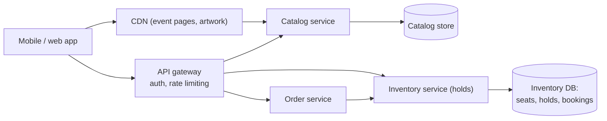
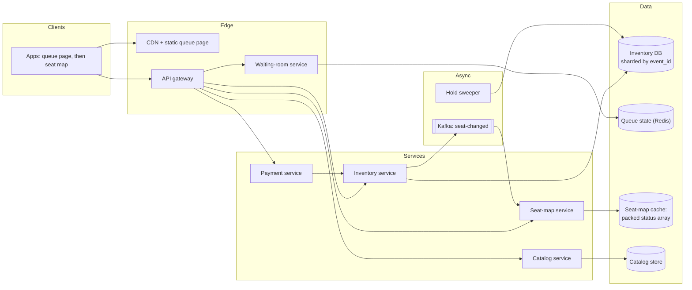
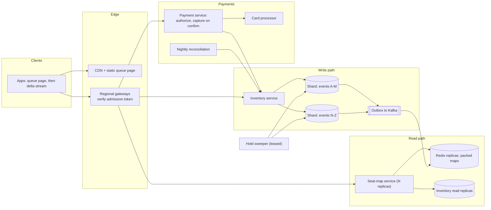

# Mock HLD interview: Ticketmaster

## Setup

**Role**: SDE2, backend, a ticketing platform. **Round**: 45 minutes, one interviewer from the inventory team, a whiteboard, no code. **Candidate**: has read [Design Ticketmaster (with a hotel-booking variant)](../hld/case-studies/ticketing-and-reservations.md) and paces to [The 45-minute HLD framework](../hld/fundamentals/interview-framework.md).

> **Interviewer:** Design Ticketmaster. Fans browse events, pick named seats on a map, hold them while they pay, and end up with a ticket. Then a stadium goes on sale at ten o'clock on a Friday morning. I will be difficult about correctness.

Five rubric rows:

| Row | What earns the mark |
|---|---|
| Requirements and scope | Overselling, hold duration and fairness settled before any box is drawn |
| Estimation | The gap between steady write rate and on-sale arrivals, from the [latency and estimation tables](../cheatsheets/latency-and-estimation.md) |
| High-level design | An inventory path that never holds a lock across a human, on the board by minute 24 |
| Depth on the cruxes | Concurrency control, the waiting room, the payment race, each with a number |
| Communication and recovery | Taking a correctness counter-example cleanly and rebuilding without arguing |

The archetype is **contended inventory**: throughput is trivial, contention is vicious, and the failure that matters is selling one seat twice.

## Timeline

| t (min) | Phase | Interviewer says | Candidate says, draws, writes | Artifact |
|---|---|---|---|---|
| 0-2 | Prompt | The prompt, plus "I will be difficult about correctness" | Restates it, promises no overselling as the invariant | Plan on the board |
| 2-7 | Requirements | Answers five clarifiers; the scale answer is a surprise | Functional verbs, the never-oversell invariant, out of scope | Requirements list |
| 7-12 | Estimation | "And during the on-sale?" | 20 writes/s steady against 17k arrivals/s; map read bandwidth | Estimation table, two ratios circled |
| 12-16 | API and data model | "What is `version` for?" | Six endpoints, `SEAT` with status and version, sharded by event | Schema sketch |
| 16-20 | v1 design | Silent | Draws the browse and hold paths; no queue yet | **Diagram v1** |
| 20-26 | Concurrency | "The fan takes four minutes to type a card number" | Proposes row locks, is killed, switches to holds with TTL | Seat lifecycle sketched |
| 26-32 | The spike | "2 million fans in two minutes" | Rejects rate limiting, derives the admission rate | **Diagram v2** with the waiting room and map cache |
| 32-38 | Payment race | "The hold expires at 600 s, the capture lands at 615 s" | Three cases, grace window, version check, idempotency key | Race drawn as a timeline |
| 38-42 | Read path | "200k people watching one map" | Packed array plus SSE deltas; the bandwidth comparison | **Diagram v3** after the deep dives |
| 42-44 | Wrap-up | "What breaks, and what about hotels?" | Hot shard, retry storms, the room-night variant in three sentences | Trade-off list |
| 44-45 | Close | "What would you do differently?" | Names the locking instinct and where it came from | — |

## Transcript

### Minutes 0-7: settle correctness before anything else

> **Candidate:** The invariant that decides this design is whether a seat can ever be sold twice, so I will start there. Can we oversell?

> **Interviewer:** Never, for concerts. That is the one thing that must not happen.

> **Candidate:** Then seat state is strongly consistent inside the partition that owns it, and I fail closed rather than double-sell. Second: named seats, or general admission?

> **Interviewer:** Named. Seat 14C.

> **Candidate:** So inventory is per-row, not a counter — that rules out the simplest design. Third: how long does a fan get to pay?

> **Interviewer:** Ten minutes, extended only if they explicitly ask.

> **Candidate:** Fourth: can the seat map be stale?

> **Interviewer:** Yes, a second or two. Only the hold call has to tell the truth.

> **Candidate:** That is a gift: the read path can be a cache and the write path the only authority. Fifth: tickets per day?

> **Interviewer:** About 2 million a day.

> **Candidate:** Two million a day is 20 writes a second. That is… much smaller than I expected. On that number alone this fits on one database.

> **Interviewer:** It does. And on Friday at ten, 2 million fans arrive in the first two minutes for one stadium.

> **Candidate:** There it is. The system is sized by a two-minute spike aimed at 60 thousand rows, not by throughput, so everything I draw is about turning that spike into a rate I choose. Scope: browse events, view a seat map, hold seats atomically for a bounded time, release, pay and get a booking, watch the map change, queue for an on-sale, cancel. Non-functional: never oversell, map p99 under 300 ms, hold p99 under 500 ms, four nines on browsing and 99.95 percent on booking — four hours a year, because failing closed beats double-selling — bookings replicated three ways before the 201, and queue position fixed on arrival. Out of scope: resale, dynamic pricing, fraud beyond bot filtering, delivery, seat-chart authoring. Cards are captured by a third party.

### Minutes 7-12: two numbers, three orders of magnitude apart

> **Candidate:** Steady state: 2 million tickets a day over ten to the fifth seconds is 20 writes a second, 60 at a three-times peak. A relational primary does 5 to 20 thousand writes a second, so that is under one percent of one machine.

> **Candidate:** On-sale: 2 million fans over 120 seconds is about 17 thousand arrivals a second. If those were holds it would be three times a primary's ceiling, and each hold is several row updates, so worse. I need to decide the admission rate rather than discover it: let through 2 thousand fans a second, each taking four seats, and the write path sits near a tenth of a primary's capacity. Two million at 2 thousand a second drains in a thousand seconds, about seventeen minutes, and I publish that estimate so clients stop polling.

> **Interviewer:** And the reads during the on-sale?

> **Candidate:** Worse than the writes, and I nearly skipped them. A million people on the queue page refreshing every five seconds is 200 thousand reads a second, against about 200 on a normal day; one Redis node does around 100 thousand operations a second, so that alone needs replicas. And the payload decides everything: a 20 thousand-seat arena at one status byte per seat is a 20 kilobyte map, so 200 thousand readers times 20 kilobytes is 4 gigabytes a second — 32 gigabits, untenable. The same readers taking 200-byte deltas is 40 megabytes a second, comfortable on one 10 gigabit link. A hundredfold difference decided by one choice.

> **Candidate:** Storage is an afterthought: 2 million orders a day at a kilobyte is 730 gigabytes a year, 2.2 terabytes at three replicas. The hot set is tiny — ten thousand live on-sales at 20 kilobytes each is about 200 megabytes of packed maps, so the contended dataset fits in memory.

### Minutes 12-16: the schema is the design

> **Candidate:** Endpoints: `POST /v1/events/{id}/queue` returning position and a poll interval; `GET /v1/events/{id}/seatmap?since={version}` plus a streaming variant; `POST /v1/events/{id}/holds` taking seat ids with an idempotency key and an admission token, returning a hold with an expiry or a 409 naming the taken seats; `DELETE /v1/holds/{id}`; and `POST /v1/holds/{id}/purchase`, the only endpoint that moves money.

> **Candidate:** `SEAT` is the important table: partition key `event_id`, sort key `seat_id`, plus `status`, `hold_id`, `price_cents` and `version`. `HOLD` carries `expires_at`; `BOOKING` and `PAYMENT` hang off it, with a unique constraint on the payment's idempotency key. Partitioning by `event_id` concentrates an on-sale on one partition, which sounds wrong until you notice it makes a four-seat hold a **single-partition transaction**.

> **Interviewer:** What is `version` for?

> **Candidate:** It is the optimistic lock and the receipt. Every conditional update bumps it, so when a payment comes back forty seconds later I can ask "is this still the seat I held?" by comparing a number rather than trusting that time has not passed.

### Minutes 16-20: v1 on the board

**Diagram v1 at minute 18: browse from the catalog, hold against the inventory database. No queue yet — that is the next problem.**

> **Candidate:** Browsing is read-mostly and cacheable, so it goes to the CDN and a catalog store off the critical path. Everything touching a seat goes through one inventory service in front of one sharded database, because the invariant lives there and nowhere else.

### Minutes 20-26: the lock that kills the connection pool

> **Interviewer:** Two fans click 14C in the same millisecond. Who gets it, and how do you know?

> **Candidate:** I take the rows with `SELECT ... FOR UPDATE` inside a transaction, mark them held, and keep the transaction open until the fan finishes paying. Whoever gets the lock first wins; the other blocks and then sees them gone.

> **Interviewer:** The fan is on a phone, hunting for their card. They take four minutes. What is happening in your database?

> **Candidate:** One connection pinned per fan for four minutes, with a row lock held throughout. At 2 thousand admitted fans a second that is hundreds of thousands of open transactions, so the pool is gone in the first second and every other query on the shard queues behind it. Lock waits and deadlocks become normal rather than exceptional. Not survivable — let me replace it.

> **Candidate:** The rule I should have started from: **a hold is data, not a lock.** One statement, `UPDATE seat SET status='held', hold_id=?, version=version+1 WHERE event_id=? AND seat_id IN (...) AND status='available' AND version=?`, committed immediately and accepted only if the row count equals the number of seats requested. The transaction lasts microseconds. The ten minutes of think-time are represented by an `expires_at` column, which costs the database nothing. Two fans racing on 14C: one update touches the row, the other touches zero rows and gets a 409 naming 14C.

> **Interviewer:** Why not a Redis lock per seat with a TTL? Same effect, no database.

> **Candidate:** Because the lock and the truth would live in different systems. A Redis failover that loses a key hands the same seat to two fans, and the database has no idea. Redis stays a cache and a queue here; it is never the arbiter. If I wanted a distributed lock I would need fencing tokens, and at that point I have rebuilt the version column badly.

> **Candidate:** Three details go with it. Multi-seat holds are all-or-nothing, one statement over N rows, seat ids ordered deterministically so overlapping orders serialise instead of deadlocking. Expiry is lazy first and swept second: a seat past its TTL is takeable by the next reader, so a stalled sweeper degrades the map rather than freezing inventory. A release is a status change back to available with another version bump.

### Minutes 26-32: turning a spike into a rate

> **Interviewer:** Back to Friday morning. Two million fans in two minutes.

> **Candidate:** The instinct is rate limiting — cap the endpoint, return 429. Wrong twice: 1.99 million fans get an error, a fairness disaster when the promise is first-come-first-served, and every one retries a second later, so the load never drops. What I want is a **waiting room**.

> **Candidate:** Fans land on a static queue page from the CDN, so the spike never touches my services. A lightweight service assigns each arrival a monotonically increasing ticket in a Redis sorted set and returns their position and an estimated wait. A token issuer admits the head of the queue at the rate I chose — 2 thousand a second — handing out short-lived **signed admission tokens** bound to the user and the event. The booking tier verifies signature and expiry locally, no lookup and no shared state on the hot path; anything without a live token gets a 403.

> **Candidate:** Three things come free. Bots wait like everyone else, which changes the economics of the attack. Ordering is fair by arrival, and refreshing cannot improve a ticket number. And it is a kill switch: set admission to zero and the site degrades to read-only browsing instead of errors. One detail — the token TTL must exceed a hold plus a payment, or I evict fans mid-checkout.

**Diagram v2 at minute 30: a queue in front of the booking tier, a cached seat map fed by change events, and a sweeper behind.**

### Minutes 32-38: the payment race

> **Interviewer:** A hold expires at 600 seconds. The capture webhook lands at 615. What does the fan own?

> **Candidate:** Three answers, and I want to name all three, because picking one is how you get this wrong.

> **Candidate:** One: nobody took the seats in those fifteen seconds. The rows still carry my `hold_id` and the version I captured, so I confirm inside a thirty-second grace window and the fan gets their tickets. Refunding here is a self-inflicted support ticket.

> **Candidate:** Two: somebody took them. My conditional update touches zero rows because `hold_id` or `version` moved, so the confirm fails, I void or refund the capture and tell the fan. Without the version check I would have silently overwritten the new holder — that is the double-sell.

> **Candidate:** Three: the confirm is retried. Providers retry webhooks and clients retry timeouts, so `confirm` is idempotent: a second call for an already-confirmed hold returns the same booking.

> **Candidate:** Two rules shrink the problem before it starts. **Authorize first, capture on confirm**: an authorization is cheap to void and a capture expensive to refund, so moving the irreversible step after the version check removes most of case two. And **one idempotency key per intent**, under a unique constraint next to the payment row, so a retried purchase replays the original booking instead of charging twice. Webhook order is not guaranteed either — a failure event can arrive after a success — so I record the provider's event id and the transition it implies, not whichever message arrived last.

> **Interviewer:** What reconciles all this?

> **Candidate:** A nightly job comparing our bookings against the processor's settlement file, in three buckets: captured with no booking, which we refund; booking with no capture, which we chase; and amount mismatches. Those buckets are exactly the residue of the race we just drew — the safety net for cases the code cannot decide.

### Minutes 38-42: 200,000 people watching one map

> **Interviewer:** Two hundred thousand people are staring at the same seat map. How is it live without melting the primary?

> **Candidate:** By never asking the primary. The map is a **derived projection** no decision is made from. Every committed hold, release and confirm emits a `seat-changed` event of `(event_id, seat_id, status, version)`; a fan-out service applies those to a packed byte array per event in Redis, one status byte per seat, and bumps a monotonic map version. Clients fetch the array once, subscribe with the last version they saw, and replay from it on reconnect.

> **Candidate:** Server-sent events rather than WebSockets: the traffic is one-directional, it rides ordinary HTTP so proxies and CDNs work, and reconnect with the last event id is built in. The justification is the arithmetic from earlier — 4 gigabytes a second of full maps against 40 megabytes a second of deltas. For 200 thousand reads a second I add Redis replicas plus an in-process cache per seat-map server, refreshed from the event stream rather than by re-reading Redis.

> **Candidate:** And the consistency contract said out loud, because otherwise you are assumed not to have thought about it: the map is at most a couple of seconds stale, the hold endpoint is authoritative, and the client treats a 409 as a normal outcome. Making the map strongly consistent would serialise 200 thousand readers behind the write path and buy nothing — even a perfect map is stale by the time it reaches a phone.

**Diagram v3 at minute 41: inventory sharded by event, reads served from replicas and cache, payments and reconciliation drawn in.**

### Minutes 42-45: what breaks, and one admission

> **Interviewer:** What breaks first? And what changes if this is hotels instead?

> **Candidate:** The hot shard's primary, by design — sharding by `event_id` concentrates an on-sale so multi-seat holds stay local. The admission rate keeps it inside the 5 to 20 thousand writes a second envelope; if a mega-event still saturates it, I sub-shard by seat block and accept that an order spanning two blocks becomes a saga. Second, retry storms: a 409 carries a jittered `Retry-After` and the client must not auto-retry the same seat, or every rejection adds load to the hottest row. Third, queue-state loss: a Redis failover would drop positions, so the ticket number lives inside the signed token. A failing sweeper is a degradation, not an outage, because expiry is lazy first. And inventory writes are pinned to the venue's region, so losing it makes the event unbookable — the right trade against double-selling across regions.

> **Candidate:** Hotels change one thing: the inventory shape. Nobody wants room 412, they want any deluxe room for three nights, so `SEAT` becomes a counter row per `(room_type, night)` with `sold` and `allotment`, and a stay is a range that must succeed on every night or none — update nights in ascending order and overlapping stays cannot deadlock. Overbooking stops being a bug and becomes a column: `allotment` is rooms times one plus the overbooking percentage, zero for ticketing. Queues, idempotency and the payment race are untouched.

> **Interviewer:** What would you do differently?

> **Candidate:** Not reach for `FOR UPDATE`. I reached for it because it is the right tool for a short critical section, and I did not notice I had put a human inside the critical section. The check I want to keep: before taking any lock, ask how long it is held and who must act before it is released. If the answer involves a person, it is not a lock — it is a row with an expiry.

!!! tip "Interview tip"
    Open a contended-inventory round with the ratio, not the architecture: "steady state is 20 writes a second and an on-sale is 2 million fans in two minutes, so this is about turning a spike into a rate I choose and never holding a lock across a human." That sentence says you already know which of the two problems is real, and it buys the whole first deep dive.

## Artifacts

- The full design, with the concurrency table and the follow-up bank: [Design Ticketmaster (with a hotel-booking variant)](../hld/case-studies/ticketing-and-reservations.md). The clock it follows: [The 45-minute HLD framework](../hld/fundamentals/interview-framework.md).
- The runnable version is `code/hld/seat_hold.py`: `hold()` is the multi-row conditional update, `confirm()` the version-checked one, `seat_map()` shows an expired hold as free without a sweeper run, and the waiting room issues the admission tokens from minute 28.
- Reproduce from memory: the two-ratio estimation, the seat row with `status` and `version`, and the three diagrams.

## Debrief

| Dimension | Below bar | Meets SDE2 | Exceeds |
|---|---|---|---|
| Requirements and scope | Starts sizing a fleet before asking whether overselling is allowed | Settles the invariant first: "Can we oversell?" then derives strong consistency per partition from the answer | Reads the gift in an answer: a stale map means "the read path can be a cache and the write path can be the only authority" |
| Estimation | Reports 20 writes/s and concludes the system is easy | Puts both numbers side by side and derives the admission rate from a primary's capacity | Catches the read side unprompted: "4 gigabytes a second against 40 megabytes a second, decided by one choice" |
| High-level design | Inventory reads and writes share one path; no queue anywhere | v1 by minute 18, waiting room by 30, cache and payments by 41; every endpoint has a path | Justifies the partition key by what it makes cheap: "a four-seat hold is a single-partition transaction" |
| Depth on the cruxes | One mechanism for concurrency, no alternatives, no failure mode | Holds with TTL, the waiting room and the payment race, each with a number | Names all three payment-race outcomes before choosing, and ties reconciliation back to them |
| Communication and recovery | Defends the row lock ("four minutes is unusual") | Concedes on the pool argument and rebuilds in one turn: "a hold is data, not a lock" | Rejects the Redis-lock alternative on first principles rather than by preference |

### What the interviewer wrote down while you talked

- **min 1** — "asked about overselling before anything else. Correct instinct for this problem."
- **min 6** — "visibly surprised by 20 writes/s and said so, then used it. Did not pretend."
- **min 9** — "derived 2k/s admission from primary capacity. Did not guess a round number and move on."
- **min 11** — "'I nearly skipped the reads' — caught its own omission. The 32 Gbps line is the best number of the round."
- **min 21** — "`FOR UPDATE` across a payment. Textbook failure, and it took only the pool argument."
- **min 23** — "'a hold is data, not a lock' — one sentence, whole design repaired."
- **min 24** — "turned down my Redis-lock offer for the right reason, not from preference."
- **min 34** — "enumerated all three race outcomes unprompted. This is where I decided."
- **min 44** — "generalised its own mistake into a rule about locks and humans. Hire."

Hire at SDE2, with the note that the locking turn cost two minutes that would otherwise have gone to cancellations and refunds, which never got drawn.

!!! warning "Common mistake"
    Holding a transaction open — or worse, a `SELECT ... FOR UPDATE` — for the ten minutes a fan spends entering card details. It passes every demo with two users and destroys the connection pool in the first second of a real on-sale, and it is the mistake that most often ends this round early. A hold is a row with an expiry; the only lock is the microsecond one inside the conditional update.

## Practice variants

Do each alone, on a clock, out loud.

1. **General admission only.** No seat map at all: three price tiers with capacities. Redo the concurrency deep dive as counters, then say what the waiting room is still for and what it is no longer for. Fifteen minutes.
2. **The event is cancelled.** Fifty thousand bookings must be refunded and the seats returned to inventory, while the same platform is running three other on-sales. Design the refund path with idempotency keys, and say what the seat map shows during it. Fifteen minutes.
3. **Airbnb, not Marriott.** Inventory is a specific listing over a date range, not a fungible pool, so two stays may not overlap on any night. What replaces the counter, where does the atomicity live, and how does the answer change for a host with 200 listings? Twenty minutes.

## Related

- [Design Ticketmaster (with a hotel-booking variant)](../hld/case-studies/ticketing-and-reservations.md) — the full design, including the hotel inventory table and the seat lifecycle
- [Transactions, 2PC, sagas and idempotency](../hld/fundamentals/transactions-and-distributed-transactions.md) — isolation levels, idempotency keys and the compensations behind minute 34
- [The 45-minute HLD framework](../hld/fundamentals/interview-framework.md) — the six-step clock this transcript follows
- [Design a movie ticket booking system (BookMyShow)](../lld/problems/movie-ticket-booking.md) — the same seat hold as an object-oriented design
- [Latency numbers and estimation tables](../cheatsheets/latency-and-estimation.md) — the write rate, primary capacity and bandwidth figures spoken at minutes 7 to 12
