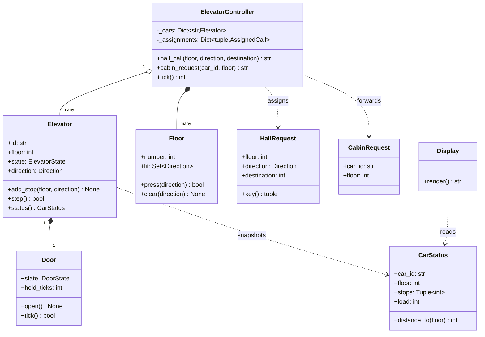
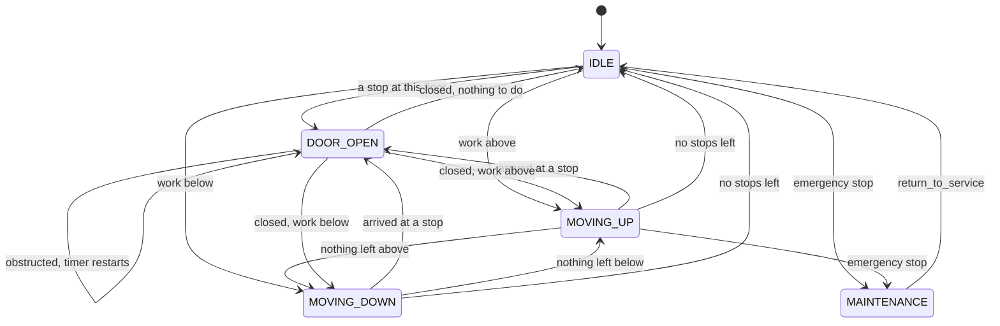
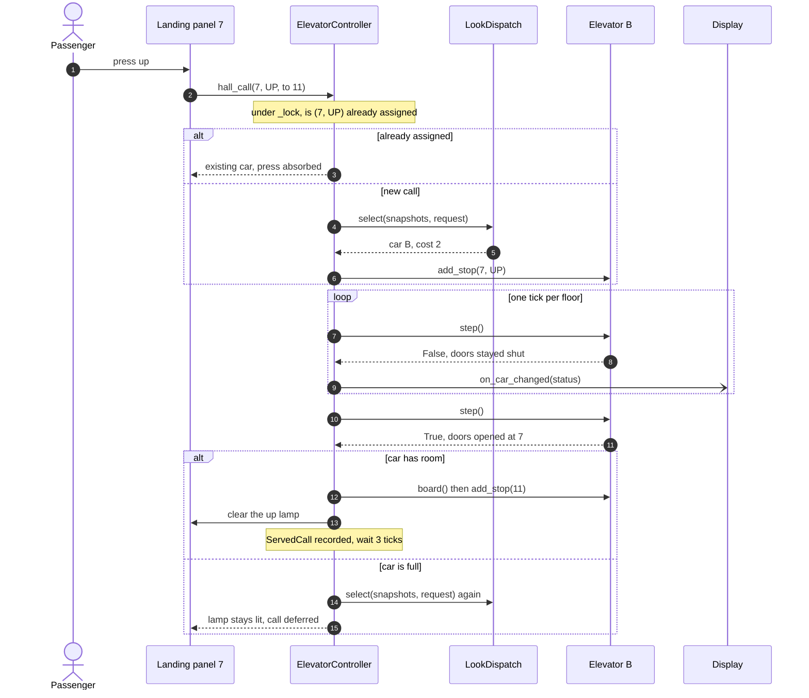

# Mock LLD interview: elevator system

## Setup

**Round**: 45-minute object-oriented design interview for SDE2. **Tools**: a shared editor running Python and pytest, plus a drawing pane. The candidate types and talks at the same time.

The prompt, read once at minute zero:

> "Design the software that runs a bank of elevators. A building has N cars and M floors. People press up or down at a landing and press a floor number inside a car; the system decides which car answers each landing call, moves the cars, opens and closes doors, and drives the indicator displays. Cars have a rated capacity, can be stopped in an emergency and taken into maintenance. Make the scheduling policy pluggable and show me how you would compare two policies."

This is the control-system archetype, and it fails differently from resource-allocation problems. Nobody runs out of classes here; they run out of *time*, because the car is genuinely stateful and candidates try to model it with one sorted list of floors. What is being graded:

| Signal | What the interviewer is watching for |
|---|---|
| Requirements | Does "what is a tick worth?" get asked before any code is written |
| Decomposition | Does the car own its own motion, or does a controller reach in and set `car.floor` |
| Abstraction | Is dispatch a seam with a named second implementation, and is State used in its cheap form |
| Working code | Does one hall call get answered end to end, with the passenger boarding |
| Correctness | Which lock protects what, in which order, and what happens to a call mid-move |
| Communication | Is the scheduling question answered with a measurement plan rather than a favourite algorithm |

Read [Design an elevator system](../lld/problems/elevator-system.md) first, then run this prompt on your own timer before comparing.

## Timeline

| t | Phase | Interviewer says | Candidate says / draws / writes | Artifact |
|---|---|---|---|---|
| 0:00 | Prompt | Reads the prompt | States the plan for the 45 minutes | Agenda agreed |
| 0:40 | Clarify | "Define it however you like" | Asks what one tick represents | Tick defined as one floor or one door step |
| 3:00 | Clarify | "Only in the destination variant" | Asks whether landings know the destination | Optional `destination` on the hall call |
| 5:00 | Clarify | "Single-threaded simulation, thread-safe API" | Writes the assumption and out-of-scope lines | Assumption list |
| 6:00 | Entities | Silent | Nouns to classes, verbs to owners | Class list with owners |
| 10:00 | Diagram | "Where does a landing call live?" | Draws the controller and the cars | v1 class diagram |
| 14:00 | Modelling | "Why two sets and not one queue?" | Splits stops by service direction | Two stop sets on the board |
| 18:00 | State | "Do you want a class per state?" | Refuses; enum plus transition table | v2 state diagram |
| 21:00 | Code | "Start wherever you like" | Enums, requests, `Door`, `CarStatus` | `models.py` compiling |
| 26:00 | Code | "A call arrives while the car is moving" | Puts the lock on the car, writes `step` | `Elevator.step` running |
| 31:00 | Code | Silent, reading | Writes `_assign_locked` and `tick` | One hall call answered |
| 34:00 | Dispatch | "Which algorithm would you use?" | Refuses to pick; names four and two metrics | `LookDispatch.cost` written |
| 37:00 | Concurrency | "What if the chosen car fills up?" | Re-dispatch, then the deferred queue | Lock order stated |
| 39:00 | Concurrency | "Draw the whole call for me" | Draws the final hall-call sequence | v3 sequence diagram |
| 41:00 | Tests | "How do you know LOOK is better?" | Replays one workload against four policies | `pytest -q` green |
| 43:00 | Extensions | "Zoning. Starvation. Go." | Answers both as seams | Two follow-ups |

## Transcript

### Minutes 0-6: the tick question

> **Candidate:** Plan first: five minutes clarifying, five on entities, eight on the state machine and the class diagram, then eighteen writing code for one hall call end to end, and the last ten on concurrency, dispatch comparison and extensions. My first question is the one that decides everything else — what is a tick worth? Is this a real-time system with a scheduler, or a simulation I drive one step at a time?
>
> **Interviewer:** Define it however you like.
>
> **Candidate:** Then a tick is one floor of travel, or one step of the door timer, or one decision. Nothing sleeps and nothing reads the wall clock. That is not laziness — it is the only way the comparison you asked for at the end means anything, because two policies must see byte-identical inputs.

Asking what a tick represents, then defining it yourself, converts an unbounded real-time problem into one you can finish in 45 minutes. Candidates who skip it write `time.sleep` in a thread and lose the last ten minutes to flaky output.

> **Interviewer:** Reasonable. Keep going.
>
> **Candidate:** Does the landing panel know where the passenger is going, or only up and down?
>
> **Interviewer:** Only in the destination-dispatch variant.
>
> **Candidate:** Then `destination` is optional on the hall call and three of my four policies ignore it. Next: capacity, emergency stop, maintenance — all real?
>
> **Interviewer:** All real. A car in maintenance takes no new stops.
>
> **Candidate:** Then it owes hall calls it can no longer serve, and those must be re-dispatched rather than dropped. Last: do you want threads?
>
> **Interviewer:** The simulation is single-threaded. Assume the API is not.
>
> **Candidate:** Understood — presses can arrive from any thread, so shared state is locked even though the tick loop is sequential. Writing it down. **Assumptions**: discrete injected clock; N cars, M floors, in memory; hardware behind method calls I could swap for a driver; calls may arrive concurrently. **Out of scope**: fire-service recall, acceleration curves, access control, the hardware bus. **Use cases**: hall call, cabin request, dispatch, move and open doors, capacity, emergency stop and maintenance, displays, pluggable scheduling.

### Minutes 6-14: nouns, owners, and the modelling decision that matters

> **Candidate:** `ElevatorController`, `Elevator`, `Door`, `Floor` as a landing with two lamps, `HallRequest`, `CabinRequest`, `DispatchStrategy`, `Display`, and a `CarStatus` snapshot. Owners: the car owns `step` because it holds its floor, direction and stops — the controller must never assign `car.floor`. The door owns its dwell timer. The landing owns its lamps, so a second press on a lit lamp dies there. The controller owns the assignment map and the dispatch decision, because it is the only object that sees every car.
>
> **Interviewer:** Where does a landing call live between the press and the pickup?
>
> **Candidate:** In the controller's assignment map, keyed by `(floor, direction)`. Keying on the pair rather than the floor is deliberate: floor 7 up and floor 7 down are two calls that can belong to two different cars.

**v1 at minute 10: the controller, the cars, and what crosses between them.**



> **Interviewer:** How does a car remember where it has to stop?
>
> **Candidate:** Let me argue against the obvious answer first. One sorted list of floors reads well for thirty seconds and then cannot express "stop at 5 on the way up but not on the way down" — the entire reason a hall call carries a direction. So the car keeps *two* sets, `_up_stops` and `_down_stops`. A cabin request goes into the set matching the direction of travel to reach it; a hall call into the set matching the direction the passenger wants.
>
> **Interviewer:** Why two sets and not one queue?
>
> **Candidate:** Because it makes the hard method short. `_stop_here` becomes: going up, stop if this floor is in `_up_stops`, or it is in `_down_stops` and there is no work above me — that second clause is the turnaround. `_next_direction` becomes: keep going if there is work ahead, otherwise turn, otherwise idle. Three lines each, and both readable out loud, which is my test for a model in an interview.

### Minutes 14-21: State, and the version of it worth using

> **Interviewer:** You said state machine. Do you want a class per state?
>
> **Candidate:** No, and I want to say why rather than just decline. Five states — idle, moving up, moving down, door open, maintenance — and the transitions are one line each. A class per state gives me five files, five constructors and an indirection to follow every time I read `step`, and buys nothing, because no state carries behaviour beyond which branch of the tick runs. Enum-plus-transition-table is State in its cheap dress: the guarantee I need is that illegal transitions raise, and a guard clause gives me that. I would reach for state classes when each state grows its own handful of methods, which is not this problem.

That refusal is worth more than the pattern would have been. Name the version you are using and the condition under which you would upgrade, and you have shown the judgement the rubric measures.

**v2 at minute 18: the car's lifecycle. Every arrow is one branch of `step`.**



> **Candidate:** Two things while I draw it. The self-loop on `DOOR_OPEN` is the obstruction: the dwell timer restarts instead of closing, so a car with someone standing in the doorway holds its floor and keeps its queue rather than sailing away. And there is deliberately no arrow from `MOVING_UP` to itself — staying in motion is the *absence* of a transition, so this diagram shows exactly the decisions the code makes and nothing else.

### Minutes 21-34: code, narrated

> **Candidate:** Vocabulary first: `Direction` with `UP`, `DOWN`, `IDLE` — keeping idle in the enum saves a nullable field — then `ElevatorState`, `DoorState`, and five errors including `FloorOutOfRangeError` and `NoCarAvailableError`. Then the presses as command objects: `HallRequest` and `CabinRequest` both carry `requested_at`, which later becomes a measured wait rather than a guessed one. They sit behind a `Request` protocol with `apply(sink)`, so the controller logs every press uniformly and the request decides which controller method runs.
>
> **Interviewer:** Why not just two methods on the controller?
>
> **Candidate:** There are two methods on the controller — `assign_hall_call` and `assign_cabin_call`. The command objects are for the timestamp and the log, not for indirection. If you told me you did not care about measuring wait times, I would delete them.
>
> **Interviewer:** Fair. A call arrives while a car is moving. What happens?
>
> **Candidate:** It lands in a stop set between two ticks, never during one, and that is a property of where I put the lock. `Elevator._lock` guards that car's floor, state, direction, door, load and both stop sets, and every public method takes it. The private helpers — `_resume`, `_stop_here`, `_next_direction` — assume the lock is already held and never take it again, because re-entering would be the first step towards a deadlock and a plain `Lock` will not let me anyway.
>
> **Interviewer:** And `step` itself?
>
> **Candidate:** `step` takes the lock and does one of three things. In `DOOR_OPEN` it runs the door timer and calls `_resume` when the timer expires. In a moving state it changes the floor by one and calls `_resume`. In maintenance it does nothing. `_resume` is the whole machine: if `_stop_here` then open the door, otherwise pick the next direction and set the matching state. `step` returns whether the doors opened this tick, and that is the subtle one. A car standing with its doors open can be given a stop at its own floor and close and reopen within a single tick, so a controller detecting arrivals by watching status changes would leave that passenger waiting forever. The car reports the event instead.
>
> **Interviewer:** Which algorithm would you use for dispatch?
>
> **Candidate:** I would not pick one in the abstract; I would make it a seam and measure. `DispatchStrategy.select(cars, request)` takes immutable `CarStatus` snapshots and returns a car id, so every strategy is a pure function I can test without a building. Four implementations. FCFS ignores geography and is the baseline that proves the others help. Nearest-car ignores direction and will cheerfully give you a car about to pass you going the other way. LOOK is my default: three cases in its cost function — a car heading your way that has not passed you costs the distance, a car that must finish its run first costs the distance plus one shaft height, one that has already passed you costs the distance plus two. Destination dispatch wraps another policy as a fallback and, when the panel knows your floor, prefers a car already stopping there. The metrics are average wait to pick-up and total floors travelled — they trade against each other, so one number would hide the decision.

!!! tip "Interview tip"
    "Which algorithm would you use?" is almost never a request for an algorithm. It is a request for the seam, the candidates, the metrics, and *then* a default with a reason. Answering "SCAN" in one word skips three of the four things being scored, and answering "it depends" without the harness skips all four.

### Minutes 34-41: contention, and what a full car does

> **Interviewer:** What if the chosen car fills up before the passenger boards?
>
> **Candidate:** The passenger stays on the landing, so the assignment was wrong and must be undone rather than forgotten. When the doors open the controller lets riders out, then boards the waiting passenger; if `board` would exceed the rated load, the call is re-dispatched to a car with room, and if no car has room it goes on a deferred queue retried at the start of the next tick. The lamp stays lit throughout, which is what a passenger sees in a real building.
>
> **Interviewer:** And two threads pressing the same button?
>
> **Candidate:** `ElevatorController._lock` guards the assignment map, the lamps, the deferred queue, the rider counts and the log. `_assign_locked` checks the map first and returns the existing car, so the second press is absorbed. What keeps this simple is the lock *order*: the controller lock is always taken before a car lock, never the reverse, and that holds trivially because a car never calls back into the controller — it only returns values from `step` and `status`.
>
> **Interviewer:** Cost of all that locking?
>
> **Candidate:** Negligible, and worth a number rather than a shrug. An uncontended lock acquire is about 17 ns, so eight cars pay roughly 8 x 17 ns, about 140 ns per tick. Nothing next to any real work, which is why per-car granularity is right: one lock over the bank would serialise eight independent shafts for no measurable saving.
>
> **Interviewer:** Draw the whole call for me.

**v3 at minute 39: one hall call from press to served, including the boarding step candidates forget.**



> **Candidate:** Check the arrival branch. Riders leave, the passenger boards and presses 11 — a cabin request going straight into that car's stop sets with no dispatch decision — and only then is the call recorded as served. Recording it at assignment time would measure how fast my dispatcher decides, not how long a person stood there.

### Minutes 41-45: proving it, then extensions

> **Interviewer:** How do you know LOOK is better?
>
> **Candidate:** In general I do not, and that is the honest answer. What I have is a harness: eight calls replayed against each policy with the same clock and the same starting positions. On that workload FCFS averages 8.38 ticks of wait and 49 floors travelled, nearest-car 7.38 and 45, LOOK 7.00 and 32, destination dispatch 4.62 and 28. The shape matters, not the digits: nearest-car buys a shorter wait by dragging cars off their runs and pays in floors; LOOK gets a better wait *and* travels a third less; destination dispatch wins by pooling passengers heading to the same floor. On a light building with idle cars, nearest-car is hard to beat — the ranking is workload-dependent, so the real claim is "here is the harness, run your traffic through it".
>
> **Interviewer:** Starvation. Zoning. One minute each.
>
> **Candidate:** LOOK starves by design: `_next_direction` keeps a car going while any stop remains ahead, so a steady stream of upward calls can strand a down call at the bottom. The fix lives in the controller — age each assignment and re-dispatch, or force a turnaround, once a call has waited past a threshold. Zoning is a `ZonedDispatch` that filters the snapshots to the cars serving that floor's zone and delegates to an inner strategy, the same composition destination dispatch already uses. Neither touches `Elevator`.

## Artifacts

The design is the one on [Design an elevator system](../lld/problems/elevator-system.md); the code is the package at `code/lld/elevator_system/` — `models.py` for enums, requests and value objects, `strategies.py` for the four policies, `car.py` for the state machine, `services.py` for the clock, displays and the controller.

**The order the methods were written**, chosen so that a car moves as early as possible:

1. `Direction`, `ElevatorState`, `DoorState`, then the five domain errors.
2. `HallRequest.key` and `CabinRequest`, both carrying `requested_at`.
3. `Door.open`, `Door.obstruct`, `Door.tick` — the dwell timer, no motor.
4. `Floor.press` and `Floor.clear` — the lamp, and where duplicate presses die.
5. `CarStatus` with `is_idle`, `has_room` and `distance_to` — the read-only view strategies and displays share.
6. `Elevator.add_stop` — the two-set routing rule.
7. `Elevator._stop_here`, `_next_direction`, `_resume`, then `Elevator.step`. **This is the first point at which a car moves.**
8. `LookDispatch.cost` and `select`, with `FcfsDispatch` written first as the baseline.
9. `ElevatorController._assign_locked` and `hall_call`.
10. `ElevatorController.tick` and `_on_arrival` — riders out, passenger in, call recorded.
11. `Display.on_car_changed`, notified outside the controller lock.

Step 7 is the deadline. If minute 30 arrives and `step` does not run, drop the displays and finish the tick loop.

The suite the candidate ran, with `uv run pytest code/lld/elevator_system -q`:

```text
..................                                                       [100%]
18 passed in 0.02s
```

They cover a hall call served end to end with boarding, one car's exact five-tick state sequence, a duplicate press producing one served call, an obstructed door holding its floor, a full car handing its passenger back, an emergency stop re-homing the call it owed, every car in maintenance, floors outside the building, both concurrency invariants, and the four strategies splitting on one snapshot.

## Debrief

| Dimension | Below bar | Meets SDE2 | Exceeds |
|---|---|---|---|
| Requirements | Starts drawing cars immediately | Asks about capacity, maintenance and threading before coding | Opens with *"what is a tick worth?"* and converts a real-time problem into a deterministic one |
| Decomposition | The controller sets `car.floor` each tick | The car owns `step`; the landing owns its lamps | Spots that arrival cannot be inferred from status — *"the car reports the event instead"* |
| Abstraction | Five state classes and a `SchedulerFactory` | Strategy for dispatch, Mediator for the controller, Command for presses | Refuses class-per-state and names the upgrade condition: *"when each state grows its own handful of methods"* |
| Working code | A state machine with no tick loop at minute 40 | One hall call answered, passenger boarding | Orders the writing so a car moves at step 7 of 11, displays last |
| Correctness | "Each car has a lock" and nothing further | Names both locks and what each protects | Gives the lock order *and* why it is trivially safe — *"a car never calls back into the controller"* |
| Communication | Answers "which algorithm" with one word | Names LOOK and justifies it | Answers with a harness, two metrics, four policies and a workload caveat |

The move that separates a strong candidate is at minute 14, and it is a *modelling* move rather than a pattern one: rejecting the single sorted queue for two direction-keyed sets. Everything downstream gets cheaper — `_stop_here` and `_next_direction` become three lines each, the LOOK cost function becomes three cases, the state diagram becomes honest. When a decision makes three later methods shorter, say so as you make it.

The weak stretch was minutes 21 to 26: the command objects arrived before their justification, and it took a question to surface that the timestamp, not the indirection, was the reason. Justify in the same breath as you name.

!!! warning "Common mistake"
    Building the whole thing around a global tick that mutates cars from outside, then bolting a lock on at minute 40. If the controller writes `car.floor`, the car is a struct, the state machine has nowhere to live, and no lock granularity saves the design — nobody reading it can tell which object owns the invariant "a car is at exactly one floor, moving in at most one direction". Give the car its `step` before you give anything a lock.

## Practice variants

Run each on a 45-minute timer, out loud, in an editor. Then compare your *order of writing* against the eleven steps above, not just your class list.

1. **Two express cars plus a service lift.** Cars 1 and 2 serve floors 1, 10 and above only; car 3 takes freight bookings that reserve it for a window. Eligibility now varies per car, so decide whether that belongs in the strategy or in `CarStatus`, and say what happens to a booked car that still owes a hall call.

2. **A multi-lift warehouse with pallets.** Requests carry a weight and a destination bay, capacity is in kilograms, and a pallet cannot be split. Boarding becomes bin packing: expect a push on what happens when the assigned car arrives and the pallet does not fit.

3. **A funicular pair on one track.** Two cars share a rail and can never pass each other, turning per-car independence into a global constraint. The interesting question is where that constraint lives — inside each car, in the controller, or in a scheduler that plans both cars' next tick together.

## Related

- [Design an elevator system](../lld/problems/elevator-system.md) — the same design as a reference write-up, with the full code
- [State](../lld/patterns/state.md) — the enum-and-table form the candidate chose, and when to upgrade
- [The LLD interview framework](../lld/fundamentals/lld-interview-framework.md) — the process this transcript follows
- [Strategy](../lld/patterns/strategy.md) — the four dispatch policies behind one seam
- [Mediator](../lld/patterns/mediator.md) — why landings and cars never address each other
- [Concurrency for LLD in Python](../lld/fundamentals/concurrency-for-lld.md) — lock ordering and granularity
