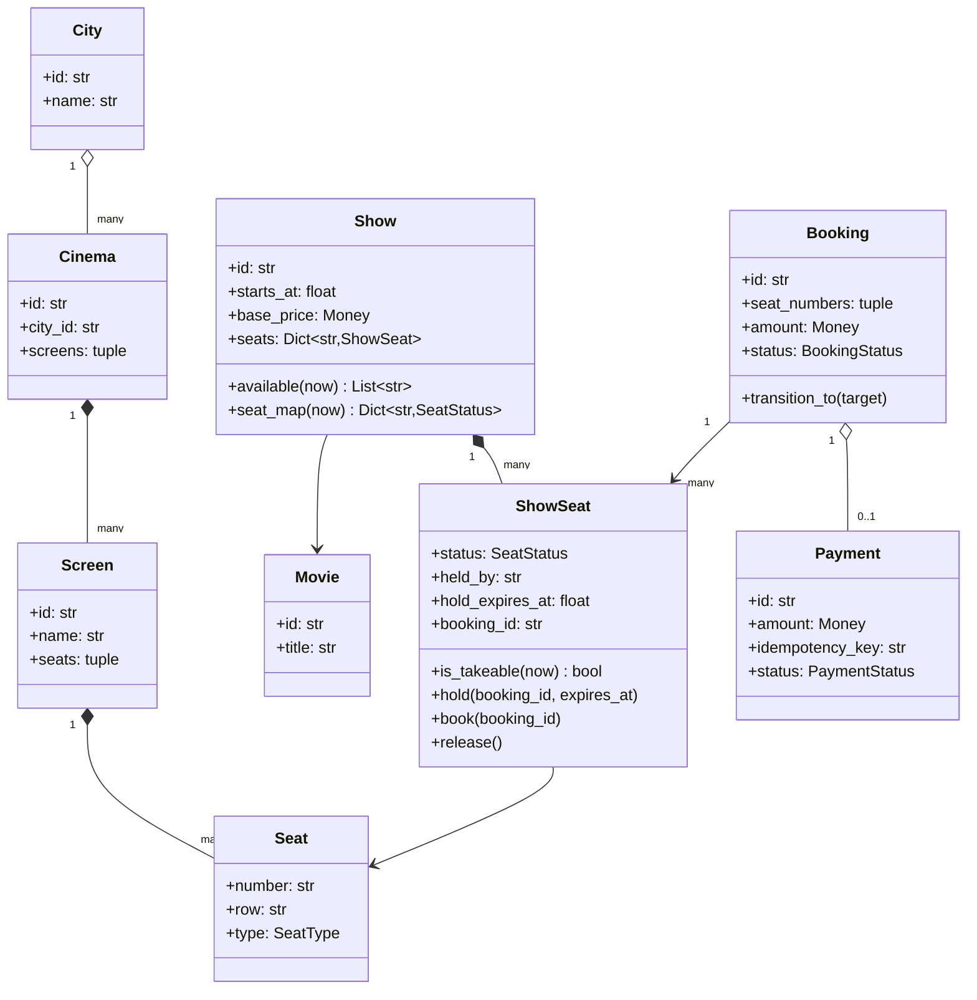
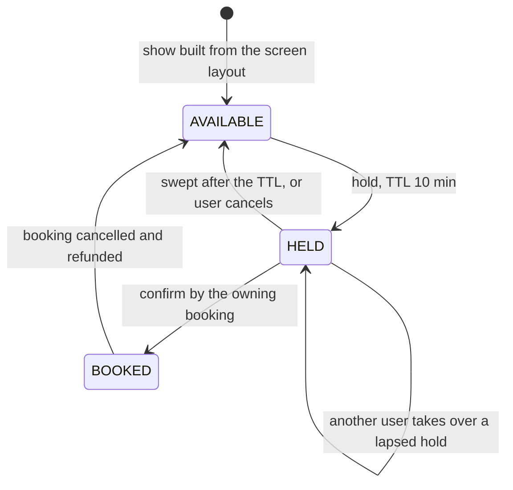
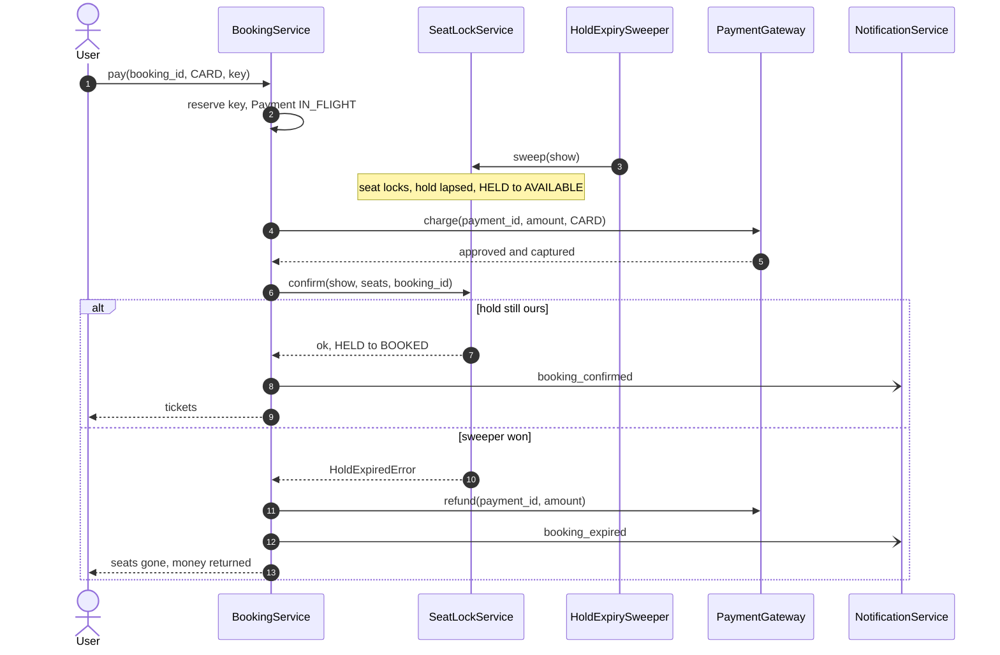

# Mock LLD interview: movie ticket booking

## Setup

**Round**: 45-minute object-oriented design interview for SDE2. **Tools**: a shared editor with Python and pytest, plus a drawing pane.

The prompt, read once at minute zero:

> "Design the booking system behind BookMyShow. A user picks a city, finds a movie, chooses a show at a cinema, sees the seat map, selects seats and pays. Seats must be held while the payment is in flight and released if the user abandons it. No seat may ever be sold twice, and a payment that succeeds after the hold has expired must not leave the user out of pocket. Show me the classes, the seat state machine, and what happens when two people tap the same seat in the same second."

This is the contended-booking archetype, and the last two sentences are the entire interview. The catalog half — cities, cinemas, screens, movies — is easy and worth almost no marks; candidates who spend fifteen minutes there reach the seat map with no time left. What is being graded:

| Signal | What the interviewer is watching for |
|---|---|
| Requirements | Is the hold TTL, the seats-per-booking cap and the post-expiry payment settled before any code |
| Decomposition | Does availability live on the show, or is the physical seat mutated per screening |
| Abstraction | Are pricing and refunds seams, and is the state machine a table rather than four classes |
| Working code | Does hold, pay and confirm run end to end, with an all-or-nothing hold |
| Correctness | Lock granularity, acquisition order, the expiry race, and idempotency of the payment callback |
| Communication | Are the three races named before the interviewer has to ask about the third |

Read [Design a movie ticket booking system (BookMyShow)](../lld/problems/movie-ticket-booking.md) first, then run this prompt on your own timer.

## Timeline

| t | Phase | Interviewer says | Candidate says / draws / writes | Artifact |
|---|---|---|---|---|
| 0:00 | Prompt | Reads the prompt | States the plan and where the marks are | Agenda agreed |
| 0:40 | Clarify | "Ten minutes" | Asks the hold TTL, then the post-expiry payment | Hold is injected config |
| 3:00 | Clarify | "No, a snapshot is fine" | Asks whether the seat map is strongly consistent | Read path declared non-authoritative |
| 5:00 | Clarify | "Park it" | Offers to defer the waiting room to HLD | Assumption and out-of-scope list |
| 6:00 | Entities | Silent | Nouns to classes; separates catalog from inventory | Class list with owners |
| 10:00 | Diagram | "Why not put status on `Seat`?" | Explains `ShowSeat` as the per-screening copy | v1 class diagram |
| 14:00 | State | "Draw the seat machine" | Writes the TTL on the hold edge | v2 state diagram |
| 17:00 | Patterns | "Make the lock service a Singleton?" | Refuses; constructs in `main` and injects | Refusal stated aloud |
| 19:00 | Patterns | "Add weekend surge pricing" | Points at `PricingStrategy`, composes not subclasses | Four seams named |
| 22:00 | Code | "Start where the marks are" | Enums, then `ShowSeat.is_takeable` | Lazy expiry written |
| 26:00 | Code | "Two people tap A5 in the same second" | One lock per seat, acquired in sorted order | `seats_locked` written |
| 30:00 | Code | Silent, reading | `hold`: check all, then mutate all | All-or-nothing hold running |
| 33:00 | Code | "The payment lands after the hold expired" | Reserves the key, charges outside the lock | `pay` and `confirm` running |
| 37:00 | Concurrency | "Name every race you have" | Three races, one lock family each | Lock table on the board |
| 39:00 | Concurrency | "Draw the losing branch" | Draws the sweeper-versus-payment sequence | v3 sequence diagram |
| 41:00 | Tests | "What does the race test assert?" | The invariant, not the winner | `pytest -q` green |
| 43:00 | Extensions | "Now make it multi-region" | Redis locks with fencing, then the HLD hand-off | Two follow-ups |

## Transcript

### Minutes 0-6: settling the three numbers

> **Candidate:** Plan first, and I want to say where I think the marks are so you can redirect me. The catalog — city, cinema, screen, movie, show — is a five-minute drawing. The interview is the seat map under contention, so most of the coding time goes there. Five minutes clarifying, five on entities, six on the seat state machine, fifteen on the hold-pay-confirm path, and the last eight on races and extensions.
>
> **Interviewer:** Good. Go ahead.
>
> **Candidate:** How long is a hold?
>
> **Interviewer:** Ten minutes.
>
> **Candidate:** Then it is `hold_ttl_seconds`, injected, because that number changes per market and does not belong inside an `if`. Second, the one I care about: the gateway approves the charge *after* the hold expired and the seats went back on sale. What should the user see?
>
> **Interviewer:** They must not be out of pocket.
>
> **Candidate:** Then the confirm fails, the booking becomes `EXPIRED`, and the charge is refunded in the same call. I will not try to be clever and re-grab the seats — they may already belong to someone else. Third: is a declined card the same thing?
>
> **Interviewer:** No. Treat it differently.
>
> **Candidate:** Then a decline leaves the booking `PENDING` with the hold alive, so the user can retry with another card. Fourth: how many seats can one user hold?
>
> **Interviewer:** Pick a number.
>
> **Candidate:** Ten. Without a cap, one script holds a whole screen for ten minutes and there is no lock design that saves you. Last one, and it is a scaling question disguised as a modelling one — is the seat map that browsers see strongly consistent?

That question is worth asking even if you never use the answer. It tells the interviewer you know which reads must be authoritative and which can be stale, and it is the single biggest lever in the scaled version of this system.

> **Interviewer:** No, a snapshot is fine.
>
> **Candidate:** Then only the hold is authoritative. A user can see a seat as free and lose it on tap, which is what real cinema sites do. Writing it down. **Assumptions**: hold TTL injected; one booking, one show; ten seats maximum; the seat map read path is a snapshot; time, ids and the gateway are injected. **Out of scope**: the virtual waiting room and the live seat-map push, which are both the distributed version of this problem, plus coupons and recommendations.
>
> **Interviewer:** Park the waiting room, agreed.

### Minutes 6-14: catalog is not inventory

> **Candidate:** Nouns: `City`, `Cinema`, `Screen`, `Seat`, `Movie`, `Show`, `ShowSeat`, `Booking`, `Payment`, `User`. The split I want to draw clearly is that the first five are immutable catalog data — a seat's row, number and type never change — while `ShowSeat` is the contended row, one per seat per screening, holding status, the booking that owns the hold, the expiry, and the confirmed booking id.
>
> **Interviewer:** Why not put the status on `Seat` directly?
>
> **Candidate:** Because seat A5 exists in six screenings tonight, each with its own availability. Status on `Seat` would make the 6 p.m. and 9 p.m. shows fight over one field. So a `Show` builds its own `dict[str, ShowSeat]` from the screen layout; the physical seat is shared and frozen, the per-screening copy is mutable and locked. In a database `ShowSeat` is the row you would `SELECT ... FOR UPDATE`, which tells you where the concurrency section is heading.

**v1 at minute 10: immutable catalog on the left, contended inventory on the right.**



### Minutes 14-22: the machine, then the seams

> **Interviewer:** Draw me the seat machine.
>
> **Candidate:** Four states, and I am going to write two things on the edges as I go because they are the answer to your last question in the prompt.

**v2 at minute 16: the seat lifecycle. The TTL and the sweeper are on the two edges where inventory changes hands.**



> **Candidate:** Two edges move inventory: `AVAILABLE -> HELD` and `HELD -> AVAILABLE`. Both take the same lock, and that sentence covers double booking, the expiry race and the refund path at once. The self-loop is the case candidates miss — a lapsed hold is takeable by someone else *without* passing through `AVAILABLE` first, because correctness must not depend on a background job having run. There is a second machine for `Booking` — `PENDING`, `CONFIRMED`, `EXPIRED`, `CANCELLED` — and I will write it as a transition table rather than four state classes: four states with no per-state behaviour do not deserve four classes, and a table makes illegal moves fail identically everywhere.
>
> **Interviewer:** Would you make the lock service a Singleton? You need exactly one.
>
> **Candidate:** I need exactly one *per process*, which is not the same requirement. I get that by constructing it in `main` and injecting it. A Singleton class would make every test share seat state across cases, which is how you get a suite that passes alone and fails in CI, and it would make a second region a rewrite rather than a second instance. The guarantee you are asking for is a wiring property, so I will enforce it in the wiring.

Refusing the pattern the interviewer offers is not contrarian if you name the requirement it actually satisfies and where you satisfy it instead. That is the difference between recall and judgement, and it is the line the abstraction dimension is scored on.

> **Interviewer:** Add weekend surge pricing.
>
> **Candidate:** `PricingStrategy.price(show, show_seat)` already exists, so it is one class and one wiring line. `SeatTypePricing` multiplies the base price by seat type; `WeekendSurgePricing` *composes* another strategy rather than subclassing it, so surge on top of a loyalty price is one more wrapper instead of a subclass explosion. Same shape for `RefundPolicy`, because "make the last hour non-refundable" is the other follow-up I expect. Two more seams: `PaymentGateway`, so tests can decline on demand, and `BookingListener`, so confirm, expiry and cancellation fan out without `BookingService` knowing what email is. `BookingService` itself is a Facade over four methods — the HTTP layer should not know locking exists.

### Minutes 22-37: code, narrated

> **Candidate:** `SeatStatus` and `BookingStatus` first, then the errors — `SeatUnavailableError`, `HoldExpiredError`, `BookingStateError`, `PaymentInFlightError` — all subclassing the shared hierarchy so an API layer can catch `ConflictError` for everything meaning "try again". Then the five lines I care most about, `ShowSeat.is_takeable(now)`: takeable if `AVAILABLE`, **or** `HELD` with `hold_expires_at` already passed. That is lazy expiry, and it means an abandoned hold is never a permanent loss even if no sweeper ever runs.
>
> **Interviewer:** Two people tap A5 in the same second.
>
> **Candidate:** They contend on A5's lock and exactly one wins. `SeatLockService` owns **one `threading.Lock` per `ShowSeat`**, keyed `show_id::seat_number`, created lazily under a small registry lock. One lock for the whole show would be correct and would serialise every user in the cinema through one mutex — on an opening night that *is* the system. Per seat, a user booking B7 never waits for the pair fighting over A5.
>
> **Interviewer:** And a request for A5 and A6 at the same time as someone asking for A6 and A5?
>
> **Candidate:** That is the deadlock you are fishing for, and the fix is one word: `seats_locked` **sorts** the keys before acquiring. Both requests take A5 first, so one waits and neither holds a lock the other needs. It is a context manager, so the release path is not something I can forget.
>
> **Interviewer:** Now the hold itself.
>
> **Candidate:** Two passes inside the locks, and the order matters. First pass: check `is_takeable(now)` for every requested seat, and raise `SeatUnavailableError` naming the offending seats if any fails. Second pass: only then mutate every seat to `HELD` with `expires_at = now + ttl`. Checking all before writing any is what makes the hold all-or-nothing — a user never ends up owning half a row, which is both a correctness property and a refund conversation I never have to have.
>
> **Interviewer:** The payment lands after the hold expired. Walk me through `pay`.
>
> **Candidate:** Three steps, and each ordering choice is deliberate. One: reserve the idempotency key and create the `Payment` as in-flight, under the bookings lock. Reserving *before* the charge is what makes a retried callback safe — a duplicate arriving mid-flight gets `PaymentInFlightError` rather than a second charge, and one arriving after capture returns the same booking. Two: call the gateway with **no lock held at all**. Three: on approval, call `SeatLockService.confirm`, which re-takes the seat locks and checks this booking still owns every hold. If it does, `HELD -> BOOKED` and the booking becomes `CONFIRMED`. If the sweeper got there first, `confirm` raises `HoldExpiredError`, and in that same call I refund the charge and move the booking to `EXPIRED`.
>
> **Interviewer:** Why is calling the gateway without a lock safe?
>
> **Candidate:** Because the hold protects the seats, not the lock. The lock is held for microseconds around a status check; the hold lasts ten minutes and is re-checked at confirm time. And the arithmetic is stark: six uncontended locks cost roughly 6 x 17 ns, about 100 ns, against a gateway round trip of at minimum 500 µs — five thousand times longer, before the processor is even slow. Holding a seat lock across a payment takes the busiest row in the cinema offline for somebody else's card check.

!!! warning "Common mistake"
    Guarding the whole show with one lock and calling it done. It is correct, and on an opening night it serialises the entire cinema through one mutex. The opposite mistake is worse: per-seat locks acquired in *request* order, which deadlocks the first time two users pick the same two seats in opposite orders. "One lock per seat, acquired in sorted id order" answers both in one sentence, and it is the sentence the correctness dimension is listening for.

### Minutes 37-41: naming every race

> **Interviewer:** Name every race you have.
>
> **Candidate:** Three, mapping onto two lock families. First, two users on overlapping seats: they serialise on the shared seat locks, one hold succeeds, the other gets `SeatUnavailableError` naming the seat. Second, the sweeper against a landing payment: both take the same seat locks, so one wins cleanly — if `confirm` wins the seats are `BOOKED` and the later sweep skips them, if `sweep` wins `confirm` raises and the charge is refunded. Third, the retried callback: guarded by the idempotency key, under `BookingService._bookings_lock`, which is never held while a seat lock is held, so the two families cannot form a cycle.
>
> **Interviewer:** Why keep the sweeper, if `is_takeable` already handles lapsed holds?
>
> **Candidate:** Correctness and display are different jobs. Lazy expiry means inventory is always right; the sweeper exists so the seat map does not show a phantom sell-out for ten minutes after a user walks away. Ship both, and a paused sweeper degrades the display rather than the inventory — the failure mode I want at 3 a.m.
>
> **Interviewer:** Draw the losing branch.

**v3 at minute 39: the payment that lands after the sweeper reclaimed the hold.**



> **Candidate:** The property I want you to check is that there is no branch where the user is charged and has no seats, and no branch where seats are held by a booking that will never confirm. Every path ends in `CONFIRMED` with seats, or `EXPIRED` with the money back.

### Minutes 41-45: tests, then scale

> **Interviewer:** What does your race test assert?
>
> **Candidate:** Not who won — that would be non-deterministic and therefore worthless. Forty threads request six overlapping seat pairs, and the assertions are invariants: no seat number appears in two winning bookings, and the set of seats marked held equals exactly the set of seats claimed by successful bookings. Plus the expiry-race test, which advances a fake clock past the TTL, runs the sweeper, then lets the payment land and asserts the booking is `EXPIRED` and exactly one refund was issued.
>
> **Interviewer:** Now make it multi-region.
>
> **Candidate:** `SeatLockService` is the only class that changes, which is the point of isolating it. Per seat, `SET show:seat NX PX 600000` — still in sorted order — with a fencing token so a slow client cannot release a lock since handed to someone else. One Redis instance sustains around 100k ops/s, and a six-seat hold is six operations, so roughly 16k holds/s from one node — far past any single on-sale. In SQL the equivalent is `SELECT ... FOR UPDATE` over the seat rows ordered by seat id, which gives the same ordering guarantee free. Past that, the bottleneck stops being locks and becomes admission, and the conversation turns into a distributed-systems question.

## Artifacts

The design is the one on [Design a movie ticket booking system (BookMyShow)](../lld/problems/movie-ticket-booking.md); the code is the package at `code/lld/movie_ticket_booking/` — `models.py` for enums, errors and entities, `catalog.py` for the read side, `strategies.py` for pricing and refunds, `ports.py` for the injected interfaces, `services.py` for the lock service, the facade and the sweeper, and `airline.py` for the variant.

**The order the methods were written**, chosen so the contended path exists before anything decorative:

1. `SeatStatus`, `BookingStatus`, `PaymentStatus`, `SeatType`, then the five domain errors.
2. `ShowSeat.is_takeable` — lazy expiry, written before anything that locks.
3. `ShowSeat.hold`, `book`, `release` — the guarded transitions.
4. `Booking.transition_to` against a transition table, not an `if/elif` ladder.
5. `Show.seat`, `available`, `seat_map` — the snapshot read path.
6. `SeatLockService.seats_locked` — the sorted-order context manager.
7. `SeatLockService.hold` — check every seat, then mutate every seat. **First point at which seats can be reserved.**
8. `SeatLockService.confirm` and `release`, which re-validate ownership under the same locks.
9. `BookingService.create_booking`, then `quote` and `_total` via `PricingStrategy`.
10. `BookingService.pay` — reserve the key, charge outside every lock, confirm.
11. `SeatLockService.sweep`, `BookingService.expire_stale_holds` and `HoldExpirySweeper.run_once`.
12. `NotificationService.on_booking_event`, emitted outside the locks.

Step 7 is the deadline. If minute 32 arrives without a working hold, drop the sweeper and notifications and finish `pay`.

The suite the candidate ran, with `uv run pytest code/lld/movie_ticket_booking -q`:

```text
...................                                                      [100%]
19 passed in 0.02s
```

They cover the happy path with a notification assertion, all-or-nothing rejection leaving the untouched seat free, invalid requests through one `parametrize`, a payment that beats the sweeper and one that loses to it, idempotent replay counting gateway charges, a declined card keeping the hold, cancellation under each refund policy, seat-type and weekend pricing, the forty-thread race, and the airline variant reusing the same services.

## Debrief

| Dimension | Below bar | Meets SDE2 | Exceeds |
|---|---|---|---|
| Requirements | Starts on the catalog and never reaches the seat map | Settles TTL, seat cap and the post-expiry refund before coding | Declares where the marks are in minute one, and asks whether the seat map read is authoritative |
| Decomposition | Status mutated on the physical `Seat` | `ShowSeat` per screening, catalog immutable | Justifies it from the domain — *"seat A5 exists in six screenings tonight"* |
| Abstraction | A `BookingManager` doing pricing, locking and email | Strategy for pricing and refunds, Facade over the API surface | Refuses Singleton by separating the requirement from the mechanism: *"I need exactly one per process, which is not the same requirement"* |
| Working code | A lock service with no `pay` at minute 40 | Hold, pay and confirm run; the hold is all-or-nothing | Writes `is_takeable` before anything that locks, so expiry is correct without a sweeper |
| Correctness | "I'd lock the show" | One lock per seat, sorted acquisition, the expiry race handled | Names all three races unprompted and shows why the two lock families cannot form a cycle |
| Communication | Waits to be asked about the second failure branch | Explains each branch when prompted | States the invariant to check — *"no branch where the user is charged and has no seats"* |

The moment that decides this round is at minute 26, and it is one word. Plenty of candidates reach per-seat locks; far fewer say **sorted**, and those who do not usually meet the ABBA deadlock only when the interviewer constructs it for them. Rehearse the sentence until it is automatic: "one lock per seat, acquired in sorted id order, check every seat before mutating any."

The second differentiator is temporal. `is_takeable` was written *before* the sweeper existed, which is what lets the candidate call the sweeper a display concern rather than a correctness one. Design order became an argument — a senior habit worth borrowing.

!!! tip "Interview tip"
    When a prompt contains "must never" and "must not leave the user out of pocket", those are not flavour text — they are the two invariants you will be graded against. Write them on the board verbatim at minute five, and at minute 40 walk each branch of your flow and point at which line preserves them. Interviewers are usually holding a rubric with those exact phrases on it.

## Practice variants

Run each on a 45-minute timer, out loud, in an editor. Compare your *order of writing* against the twelve steps above, not your class list.

1. **Hotel rooms over date ranges.** A booking spans nights, not seats, so the contended unit is a room-plus-interval and two requests conflict when their ranges overlap. Sorted acquisition still works, but on what key? Decide between locking per room and per room-night, and say what changes about all-or-nothing.

2. **Multi-leg flight itineraries.** One booking holds seats across two or three legs, each with its own inventory, and the hold is still all-or-nothing, so the sorted key list spans leg ids. Expect a push on partial failure and on a per-cabin overbooking allowance.

3. **A festival with 40,000 unreserved tickets.** No seat map — just a counter and a queue. The per-seat design collapses to one contended integer, so the question becomes how to shard that counter without oversell, and when to admit this is now a distributed-systems problem.

## Related

- [Design a movie ticket booking system (BookMyShow)](../lld/problems/movie-ticket-booking.md) — the same design as a reference write-up
- [Design Ticketmaster (with a hotel-booking variant)](../hld/case-studies/ticketing-and-reservations.md) — the distributed version, where the waiting room lives
- [The LLD interview framework](../lld/fundamentals/lld-interview-framework.md) — the process this transcript follows
- [State](../lld/patterns/state.md) — the transition table behind `Booking` and `ShowSeat`
- [Strategy](../lld/patterns/strategy.md) — the pricing and refund seams
- [Concurrency for LLD in Python](../lld/fundamentals/concurrency-for-lld.md) — lock ordering and granularity
