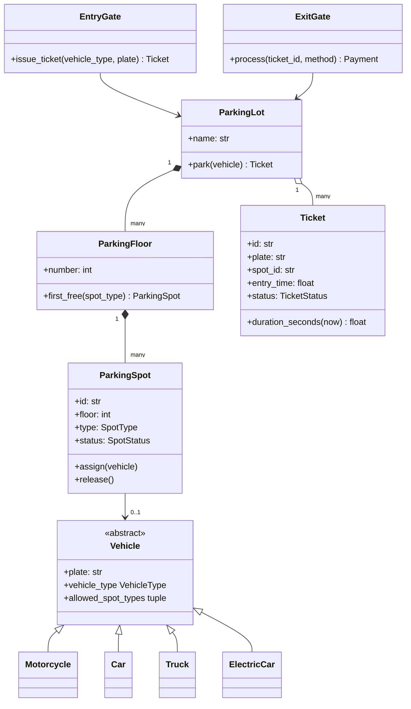
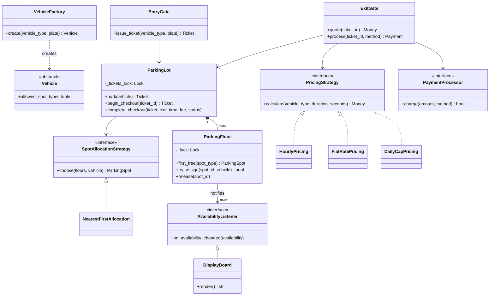
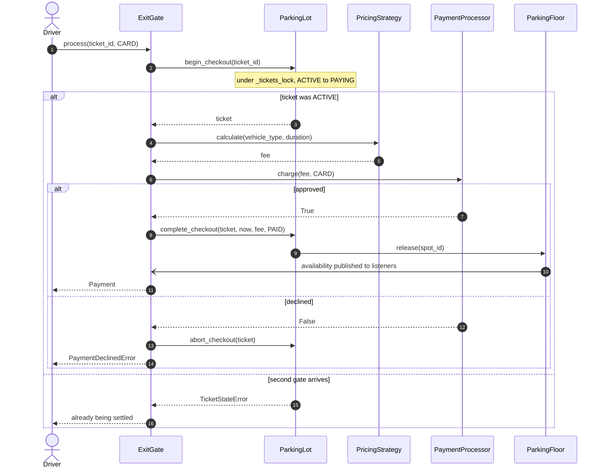

# Mock LLD interview: parking lot

## Setup

**Round**: 45-minute object-oriented design (OOD) interview for SDE2, with a bar raiser. **Tools**: a shared editor with Python and pytest, plus a drawing pane. The candidate is expected to talk continuously and leave running code behind.

The prompt, read out at minute zero and not elaborated on:

> "Design the software for a multi-floor parking lot. Vehicles of different sizes arrive at several entry gates and get a ticket; when they leave through an exit gate they pay for the time they stayed. The lot shows free spots per floor and turns cars away when it is full. I care about the classes, the flows, and what happens when two gates act at the same moment."

This is the most-asked OOD prompt at Amazon and it is deliberately underspecified. Everything being graded is hidden behind the last clause:

| Signal | What the interviewer is watching for |
|---|---|
| Requirements | A scoped, confirmed use-case list before anything is drawn |
| Decomposition | Behaviour sitting with its data, and no `ParkingLotManager` |
| Abstraction | Patterns with a nameable second implementation, and refusals for the rest |
| Working code | One path running end to end by minute 40, not eight class headers |
| Correctness | Which lock protects which state, at what granularity, defending which invariant |
| Communication | Taking the hint when it arrives instead of defending past it |

The transcript below is the passing version. Read [Design a parking lot](../lld/problems/parking-lot.md), attempt the prompt on a timer, and only then compare.

## Timeline

| t | Phase | Interviewer says | Candidate says / draws / writes | Artifact |
|---|---|---|---|---|
| 0:00 | Prompt | Reads the prompt, then goes quiet | Announces the plan for the 45 minutes | Agenda agreed |
| 0:30 | Clarify | "Assume four vehicle types" | Asks about gates, fit rules, pricing, lost tickets | Numbered use cases |
| 4:00 | Clarify | "Two gates can absolutely act at once" | Writes the assumption line and the out-of-scope line | Assumption list on the board |
| 5:00 | Entities | Silent | Nouns to classes, verbs to owners, out loud | Class names with one sentence each |
| 9:00 | Diagram | "Where does a ticket live if the driver loses it?" | Adds `Ticket.status`, keeps the ticket in the lot | v1 class diagram |
| 12:00 | Patterns | "Why not make the lot a Singleton?" | Refuses Singleton, explains injection | Refusal stated aloud |
| 15:00 | Patterns | "Add a daily-cap rate" | Points at the `PricingStrategy` seam | v2 class diagram |
| 18:00 | Code | "Start wherever you like" | Enums, errors, `Vehicle` hierarchy | `models.py` compiling |
| 24:00 | Code | "What if two gates race for the last spot?" | Splits `first_free` from `try_assign` | `ParkingFloor` with its lock |
| 28:00 | Code | Silent, reading | Writes the optimistic `park` loop | `ParkingLot.park` running |
| 32:00 | Code | "What if the payment declines?" | Adds `PAYING`, reserve-charge-commit | `ExitGate.process` and `_settle` |
| 36:00 | Concurrency | "Convince me the retry loop terminates" | Names the bound and the failure mode | Lock table on the board |
| 38:00 | Concurrency | "Draw me the exit under contention" | Draws the final exit sequence | v3 sequence diagram |
| 40:00 | Tests | "Which test would catch a regression here?" | Names five, writes the race test | `pytest -q` green |
| 43:00 | Extensions | "Reservations. One minute." | Answers with a seam and a test | Two follow-ups |

## Transcript

### Minutes 0-5: turning one paragraph into a contract

> **Candidate:** Before I ask anything, here is how I would like to spend the 45 minutes: five minutes clarifying, five turning nouns into classes, eight on a class diagram, then about seventeen writing real code for the entry and exit flows, and the last ten on concurrency, tests and extensions. Stop me if you want a different balance.
>
> **Interviewer:** That works.
>
> **Candidate:** First, vehicles and spots. How many kinds of each, and can a small vehicle take a big spot?
>
> **Interviewer:** Assume four vehicle types — motorcycle, car, truck, electric car — and spot types motorcycle, compact, large, and electric, which is a compact with a charger. A smaller vehicle can use a bigger spot.
>
> **Candidate:** Then the fit rule is per vehicle and ordered: a motorcycle prefers a motorcycle spot and only falls back to compact, otherwise a busy Saturday fills every compact bay with scooters. A truck fits nothing but large. Second question, and it decides the design: how many gates, and can they act simultaneously?
>
> **Interviewer:** Several of each. Two gates can absolutely act at once.
>
> **Candidate:** Good, that is the invariant I will design around: one vehicle per spot, and one charge per ticket. Third, pricing?
>
> **Interviewer:** Per hour, with a short free grace period. Assume it will change.
>
> **Candidate:** "Assume it will change" is the phrase that earns an interface, so I will keep pricing behind one. Fourth: lost tickets, and can an operator take a bay out of service?
>
> **Interviewer:** Both yes. Lost ticket is a flat penalty, looked up by plate.
>
> **Candidate:** Last one — is this one process, or a chain of lots with a database?

Ask that question. It is the fork between an OOD round and a distributed-systems round, and candidates who skip it spend ten minutes designing tables nobody asked for.

> **Interviewer:** One process, in memory. Persistence is a later problem.
>
> **Candidate:** Then I am writing three lines on the board for you to correct. **Assumptions**: multiple gates operate concurrently in one process; state is in memory behind interfaces I could swap for a repository; time and IDs are injected so tests are deterministic. **Out of scope**: payment integration beyond a processor interface, reservations, demand pricing, and hardware. **Use cases**: park, exit and pay, settle a lost ticket, show free spots per floor, take a spot out of service, reject when full.
>
> **Interviewer:** Agreed. Go.

### Minutes 5-10: nouns to classes, verbs to owners

> **Candidate:** Nouns first. `ParkingLot`, `ParkingFloor`, `ParkingSpot`, `Vehicle` with four subclasses, `Ticket`, `EntryGate`, `ExitGate`, `Payment`. Plate is a string on the vehicle, not a class — it has no behaviour. Now the verbs, and I will say who owns each: the spot owns `assign` and `release` because it holds its own status. The ticket owns `duration_seconds(now)` because it holds the entry time — I pass `now` in rather than reading the clock, which is what keeps the fee test deterministic. The floor owns `try_assign` because it owns the spots. The lot owns `park` because only it can see every floor.
>
> **Interviewer:** Where does a ticket live if the driver loses it?
>
> **Candidate:** In the lot's registry, which is the point. The paper ticket is a receipt; the record is server-side and keyed by id, with a secondary lookup by plate for exactly this case. So `Ticket` carries a `status` — I will need it in a moment for a second reason.

**v1 at minute 10: entities and multiplicities, no patterns yet.**



> **Candidate:** Composition on lot-to-floor and floor-to-spot because destroying the lot destroys them; aggregation on tickets because a ticket outlives its stay in a report. The gates point at the lot rather than being parts of it, which is what lets me create ten gates in a test.

### Minutes 10-18: three patterns, and one refusal

> **Interviewer:** Most candidates make the lot a Singleton. Why haven't you?
>
> **Candidate:** Because I would rather build one in `main` and pass it to the gates. A Singleton buys me a global variable and costs me two things I need: my tests cannot build a second lot with a different layout, and the day the company opens a second garage I am refactoring instead of instantiating. If somebody insisted on process-wide access I would put the wiring in a composition root, not in `ParkingLot.__new__`.

Say the refusal out loud. Naming a pattern you rejected, with the reason, is a stronger abstraction signal than naming three you used.

> **Interviewer:** Fine. Now add a daily-cap rate — airport parking, no day costs more than twenty.
>
> **Candidate:** That is one new class and no edits. `PricingStrategy` is a `Protocol` with `calculate(vehicle_type, duration_seconds) -> Money`; `HourlyPricing` and `FlatRatePricing` exist; `DailyCapPricing` composes `HourlyPricing` rather than subclassing it — it splits the duration into whole days plus a remainder and caps each. The exit gate takes the strategy in its constructor, so the only change outside the new file is the line in `main` that wires it.
>
> **Interviewer:** And allocation?
>
> **Candidate:** Same shape, different reason. `SpotAllocationStrategy.choose(floors, vehicle)` returns a candidate or `None`. Today `NearestFirstAllocation` means lowest floor, then the vehicle's preferred type, then lowest id. If you later want "nearest to the gate the driver entered", that is `NearestToGateAllocation(gate_location)` and nothing else moves. One rule I am imposing now because it matters at minute 35: **allocation only selects, it never mutates**. The claim happens somewhere else.
>
> **Interviewer:** Any other patterns?
>
> **Candidate:** Two small ones. `VehicleFactory.create("car", plate)` is a Factory Method over a registry dict, because the gate receives a string from a scanner and should not name classes; adding a bus touches the registry. And the display board is an Observer — the floor publishes a `FloorAvailability` value object to subscribed `AvailabilityListener`s, so boards never poll. What I am *not* adding is a Builder for tickets, a Command for gate actions, or an event bus: none has a second implementation I can name.

**v2 at minute 18: the same design with the seams hung off it.**



### Minutes 18-35: code, narrated while typing

> **Candidate:** I write vocabulary first so nothing later is stringly typed: `VehicleType`, `SpotType`, `SpotStatus`, `TicketStatus`, `PaymentMethod` as `StrEnum`s, then four errors — `LotFullError`, `InvalidTicketError`, `TicketStateError`, `PaymentDeclinedError` — subclassing the shared `ConflictError`, `NotFoundError` and `InvalidStateError` so a caller can catch a category without importing parking vocabulary.
>
> **Interviewer:** Keep going.
>
> **Candidate:** Now the vehicles. Each subclass declares `allowed_spot_types` as an ordered tuple. That single line is why the allocator has no `if isinstance` ladder — it iterates the vehicle's own preferences. `Car` is `(COMPACT, LARGE)`; `Truck` is `(LARGE,)`; `ElectricCar` is `(ELECTRIC, COMPACT, LARGE)` so it takes a charger when one is free and still parks when one is not. Then `ParkingSpot.assign` and `release`, each raising if the status is wrong.
>
> **Interviewer:** Two gates race for the last compact spot on floor one. What happens?
>
> **Candidate:** With what I have written so far, both get it, and that is a real bug rather than a theoretical one. The fix is where I put the lock, so let me answer that properly. The invariant is *one vehicle per spot*, and spots belong to floors, so **the floor owns the lock**. I split the read from the write: `first_free(spot_type)` is a hint taken with no lock, and `try_assign(spot_id, vehicle)` takes `self._lock`, re-checks `spot.is_free()`, and returns `False` if it lost the race.
>
> **Interviewer:** Why not one lock on the lot?
>
> **Candidate:** Correct but coarse — every gate in the building serialises through one mutex even when they are working on different floors. Why not a lock per spot? Because then *finding* a free spot becomes a multi-lock dance and I have invented a deadlock. Floor-level is the granularity that matches the invariant.
>
> **Interviewer:** Then `park` has to cope with `False`.
>
> **Candidate:** It becomes an optimistic loop: choose, try to claim, and on `False` choose again, because the world moved. `MAX_CLAIM_ATTEMPTS = 64` bounds it, so a pathological storm degrades into a clean `LotFullError` instead of spinning forever. Only after a successful claim do I mint the ticket from the injected id generator and clock and store it under `_tickets_lock`.
>
> **Interviewer:** Now the exit. What if the payment declines?
>
> **Candidate:** This is the second race and it is nastier, because the naive version double-charges. If two exit terminals are handed the same ticket id, both read it as active, both price it, both charge. So the ticket gets a third state. `begin_checkout` moves it `ACTIVE -> PAYING` under `_tickets_lock` and raises `TicketStateError` if it is not active — exactly one gate wins. Then the gate prices the stay, charges through the `PaymentProcessor`, and only then calls `complete_checkout`, which moves `PAYING -> PAID` and releases the spot. On a decline, `abort_checkout` puts it back to `ACTIVE` and the car stays parked. Reserve, charge, commit — the spot is never freed before the money is confirmed.
>
> **Interviewer:** Are you holding the lock while you charge?
>
> **Candidate:** No, and the numbers say why. An uncontended lock acquire is about 17 ns; a card authorisation is at minimum a datacenter round trip, about 500 µs. Holding the ticket lock across the charge would block other gates for 500 µs / 17 ns, roughly 30,000 lock acquisitions' worth of time, and that is before the processor is slow. The `PAYING` state is what makes that safe: reserved without anything staying locked. The floor does the same — it computes availability under its lock and notifies listeners outside it, so a slow board never blocks a gate.

!!! warning "Common mistake"
    Answering "I'd synchronise `park`" and moving on. It is correct and it is worth almost nothing, because the interviewer is not testing whether you know the word `Lock` — they are testing whether you can name the invariant, choose a granularity, justify rejecting the two neighbouring granularities, and say what happens when the claim fails. Four sentences, and they are the difference between "meets" and "below bar" on the correctness line.

### Minutes 35-42: the deep dive, then tests

> **Interviewer:** Convince me the retry loop terminates.
>
> **Candidate:** Each iteration either claims a spot or observes that the spot it picked was taken by someone who *did* claim it — every wasted iteration is paid for by another gate's success. It is not a spin lock; there is no waiting, only re-selection. The bound of 64 covers the pathological case where a small pool churns faster than one gate can read it, and hitting it raises `LotFullError`, which the gate already knows how to display.
>
> **Interviewer:** Draw me the exit path under contention.

**v3 at minute 38: the final exit flow, with the state transition that makes it safe.**



> **Candidate:** Every branch leaves the system in a state a driver can recover from: approved frees the spot, declined leaves the car parked with an active ticket they can retry with cash, and the losing gate gets a typed error rather than a duplicate charge.
>
> **Interviewer:** Which tests would catch a regression here?
>
> **Candidate:** Five. One: exiting after two hours thirty-five minutes charges three started hours at the car rate. Two: a stay inside the grace period is free. Three: a motorcycle takes a motorcycle spot before falling back to compact. Four, the one I would write first: forty arrivals against ten spots through three gates on a thread pool, asserting exactly ten tickets, every spot id unique, and `LotFullError` for the other thirty. Five: a declining processor raises `PaymentDeclinedError` and leaves the ticket `ACTIVE` with the spot occupied. Let me write four and five now.
>
> **Interviewer:** Run them.
>
> **Candidate:** Green — and deterministic, because the fake clock never advances on its own and the ids are sequential, so a failure here is real and not a flake.

### Minutes 42-45: extensions as seams

> **Interviewer:** Reservations. One minute.
>
> **Candidate:** A `RESERVED` value on `SpotStatus` with an expiry, a `ReservationService` that converts a reservation into an assignment while holding the floor lock, and one line in the allocation strategy that skips reserved spots. Test: an expired reservation is allocatable again, a live one is not. Expiry needs no background thread if you read it lazily — a reservation past its deadline reads as free.
>
> **Interviewer:** And charging fees for the electric bays?
>
> **Candidate:** A `ChargingPricing` decorator wrapping any `PricingStrategy` and adding energy cost from a meter reading — a Decorator, because otherwise every pricing rule needs a charging twin. And a chain of lots across a city stops being an OOD problem: that is an availability API, a search service, and eventually consistent display boards.

## Artifacts

The design in this transcript is the one on [Design a parking lot](../lld/problems/parking-lot.md); the code left in the editor is the package at `code/lld/parking_lot/` — `models.py` for enums, errors and entities, `strategies.py` for the two policy families, `services.py` for the floor, the lot and the gates, and `tests/test_parking_lot.py`.

**The order the methods were written**, which is the artifact worth copying, because it is chosen so that something runs as early as possible:

1. `VehicleType`, `SpotType`, `SpotStatus`, `TicketStatus`, `PaymentMethod` — vocabulary before logic.
2. `LotFullError`, `InvalidTicketError`, `TicketStateError`, `PaymentDeclinedError` — the error contract, stated once.
3. `Vehicle.allowed_spot_types` on the four subclasses, then `VehicleFactory.create`.
4. `ParkingSpot.assign` and `ParkingSpot.release` — guarded transitions on the smallest entity.
5. `ParkingFloor.first_free` (no lock, a hint) and `ParkingFloor.try_assign` (under `_lock`, re-checks).
6. `NearestFirstAllocation.choose` — selection only, no mutation.
7. `ParkingLot.park` — the optimistic claim loop; **the first point at which a vehicle can be parked end to end.**
8. `HourlyPricing.calculate` — per started hour after the grace period.
9. `ParkingLot.begin_checkout`, `complete_checkout`, `abort_checkout` — the checkout state machine.
10. `ExitGate.process` and `ExitGate._settle` — reserve, charge, commit.
11. `ParkingFloor.release` and `DisplayBoard.on_availability_changed` — the observer edge, notified outside the lock.

Step 7 is the deadline that matters: if minute 30 arrives and `park` does not run, abandon the board and finish the flow.

The suite the candidate ran, with `uv run pytest code/lld/parking_lot -q`:

```text
..............                                                           [100%]
14 passed in 0.02s
```

Fourteen cases: per-started-hour pricing, the grace period, motorcycle preference and fallback, trucks spilling to the next floor and `LotFullError`, the race, exiting twice, an unknown ticket, the declined payment, the lost-ticket flow, the display board, and all three pricing strategies through one `parametrize`.

## Debrief

| Dimension | Below bar | Meets SDE2 | Exceeds |
|---|---|---|---|
| Requirements | Starts drawing after one question | Confirms use cases and writes an assumption line: *"multiple gates operate concurrently in one process"* | Asks *"is this one process, or a chain of lots with a database?"* and scopes the whole round with the answer |
| Decomposition | A `ParkingLotManager` holding spots, pricing and payments | Verbs land on owners: *"the ticket owns `duration_seconds(now)` because it holds the entry time"* | Splits selection from mutation up front — *"allocation only selects, it never mutates"* — which is what makes the lock design possible |
| Abstraction | Six patterns, none with a second implementation | Strategy for pricing and allocation, Factory for vehicles, Observer for the board | Refuses one and says why: *"a Singleton buys me a global variable and costs me two things I need"*; also refuses Builder, Command and an event bus |
| Working code | Class headers with no bodies at minute 40 | Entry and exit both run; enums and errors written first | Orders the writing so `park` runs at step 7 of 11, with the board last |
| Correctness | "I'd synchronise `park`" | Names the two locks and what each protects | Justifies the granularity in both directions — *"a lock per spot makes finding a free spot a multi-lock dance"* — and refuses to hold a lock across the charge with the arithmetic to back it |
| Communication | Defends the first design when hinted at | Takes *"what if two gates race"* as the concurrency section arriving early | Concedes the live bug in one sentence — *"both get it, and that is a real bug"* — then fixes it |

Two moments moved this from "meets" to "exceeds", and both are cheap to rehearse. The Singleton refusal costs fifteen seconds and shows judgement rather than recall. And answering *"are you holding the lock while you charge?"* with a number instead of an opinion — ~17 ns against ~500 µs, roughly 30,000 to one — makes the conclusion something other than taste.

The weakest stretch was minutes 5 to 10: the nouns were listed competently but multiplicities were not drawn until prompted. Writing `1 -> *` on the lines as you draw them is free, and it forces exactly the question the interviewer was about to ask.

!!! tip "Interview tip"
    When the interviewer says "assume it will change", write an interface. When they say "assume there is exactly one", write a constructor argument. Those two sentences from the clarifying phase determine, more than anything else in the round, which patterns you will be able to justify at minute 15 — and justification, not recognition, is what the abstraction line of the rubric scores.

## Practice variants

Run each on a 45-minute timer, in a real editor, out loud. Then diff your class list against the one above and, more importantly, your *order of writing* against the eleven steps.

1. **Valet parking with keys.** Drivers hand over keys at a desk, and the system tracks which attendant holds which key and where the car ended up, including moves between bays. The new invariant is that a car can be moved while its ticket is active, so decide whether `Ticket` still points at a spot or at a mutable placement record.

2. **A shared-bike dock network.** Docks with fixed points, bikes taken from one dock and returned to another, and an overnight rebalancing job. Allocation now runs at *return* time as well as pickup, and "one vehicle per spot" becomes "a bike is in exactly one dock or exactly one ride". Say which of your parking-lot classes survive unchanged.

3. **Airport parking with pre-booking.** Drivers reserve a spot type for a date range before arriving, pricing is capped per day, and a no-show releases the reservation after a grace window. Expect a push on whether reservations reduce advertised availability, and on what a reserved driver sees when you have over-allocated.

## Related

- [Design a parking lot](../lld/problems/parking-lot.md) — the same design as a reference write-up, with the full code
- [The LLD interview framework](../lld/fundamentals/lld-interview-framework.md) — the process this transcript follows
- [Strategy](../lld/patterns/strategy.md) — the pricing and allocation seams
- [Factory Method](../lld/patterns/factory-method.md) — the registry idiom behind `VehicleFactory`
- [Singleton](../lld/patterns/singleton.md) — the pattern refused at minute 12, and when it is right
- [Concurrency for LLD in Python](../lld/fundamentals/concurrency-for-lld.md) — lock granularity and optimistic retries
